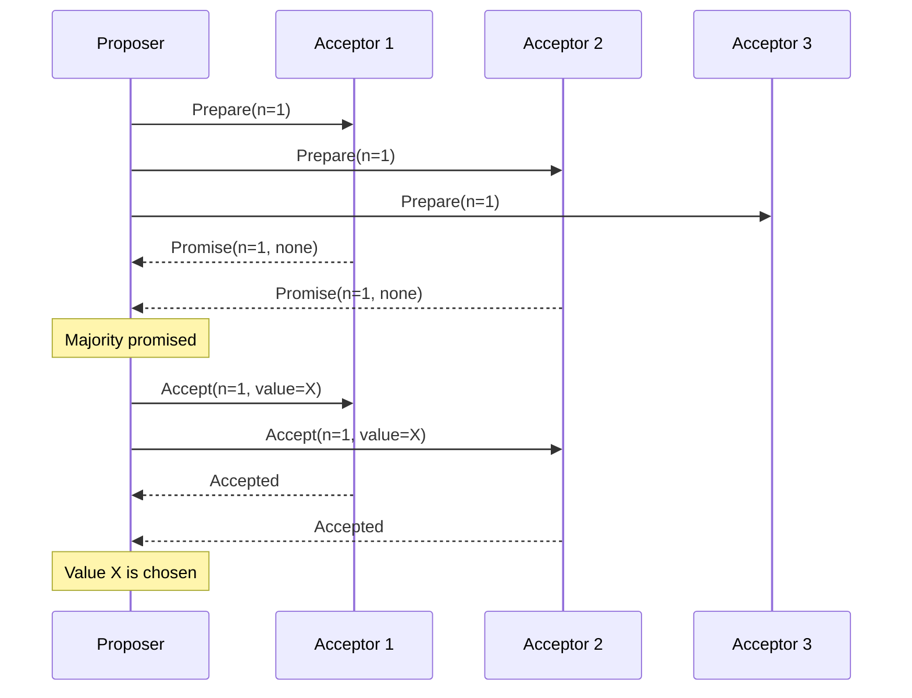
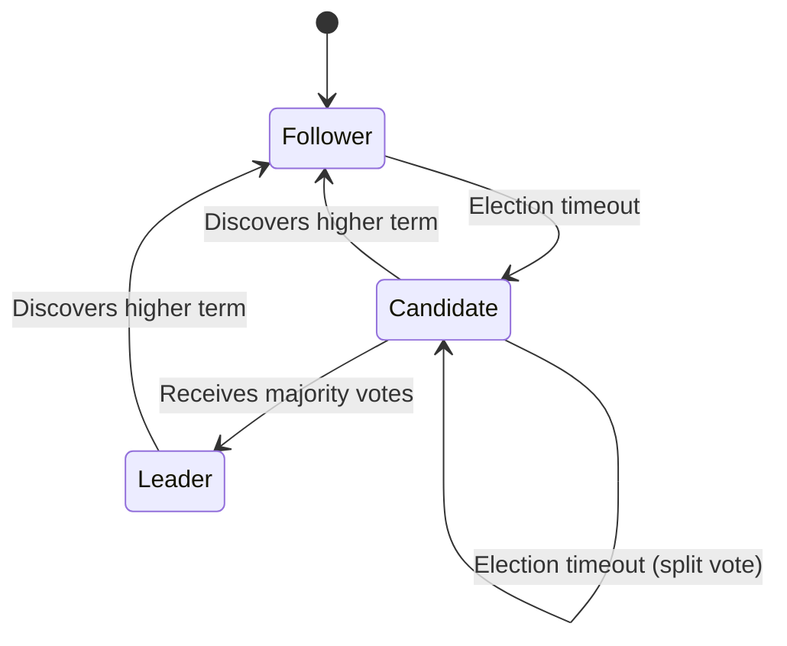

# Consensus Algorithms (Raft & Paxos)

---

## Why Consensus Matters for Staff Engineers

Consensus algorithms are the foundation of every strongly consistent distributed system: databases (Spanner, CockroachDB, etcd), configuration stores (ZooKeeper), and coordination services. At L6, interviewers expect you to **articulate when and why you need consensus**, not just recite the algorithm.

!!! note
    You will rarely implement Raft or Paxos from scratch. But you must understand their properties to make architectural decisions: "Should this service use a Raft-based store (etcd) or an eventually consistent one (Cassandra)?"

---

## The Consensus Problem

**Agreement:** A set of distributed nodes must agree on a single value (or sequence of values) despite crashes and network delays.

| Property | Definition |
|----------|------------|
| **Safety (Agreement)** | All non-faulty nodes decide on the same value |
| **Validity** | The decided value was proposed by some node |
| **Termination (Liveness)** | Every non-faulty node eventually decides |
| **Fault tolerance** | The system makes progress as long as a majority (quorum) of nodes is alive |

!!! warning
    **FLP Impossibility (1985):** In a purely asynchronous system with even one crash failure, no deterministic algorithm can guarantee both safety and liveness. Real systems work around this with timeouts and leader election (giving up pure asynchrony).

---

## Paxos

### Overview

Paxos (Lamport, 1989) is the foundational consensus protocol. It solves single-value consensus (single-decree Paxos) and can be extended to a replicated log (Multi-Paxos).

### Roles

| Role | Responsibility |
|------|----------------|
| **Proposer** | Proposes a value; drives the protocol |
| **Acceptor** | Votes on proposals; stores accepted values durably |
| **Learner** | Learns the decided value (often the same nodes) |

### Single-Decree Paxos (Two Phases)

**Phase 1: Prepare**

1. Proposer picks a unique, monotonically increasing proposal number `n`
2. Proposer sends `Prepare(n)` to a majority of acceptors
3. Each acceptor: if `n` is the highest it has seen, replies `Promise(n, last_accepted_value)` and promises not to accept proposals < `n`

**Phase 2: Accept**

1. If the proposer receives promises from a majority:
   - If any acceptor already accepted a value, the proposer must propose **that value** (not its own)
   - Otherwise, it proposes its own value
2. Proposer sends `Accept(n, value)` to the majority
3. Acceptors accept if they have not promised a higher number
4. Once a majority accepts, the value is **chosen**



### Why Paxos Is Hard in Practice

| Challenge | Description |
|-----------|-------------|
| **Dueling proposers** | Two proposers keep preempting each other with higher proposal numbers; livelock |
| **Multi-Paxos complexity** | Extending to a log requires leader election, log compaction, and membership changes |
| **Implementation subtlety** | Edge cases in crash recovery, disk flushing, and message reordering |

!!! tip
    **Staff-level insight:** Paxos is theoretically foundational but notoriously difficult to implement correctly. This is precisely why Raft was invented—to provide an equivalent algorithm that is easier to understand, implement, and teach.

---

## Raft

### Overview

Raft (Ongaro & Ousterhout, 2014) solves the same problem as Multi-Paxos but is designed for understandability. It decomposes consensus into three subproblems: **leader election**, **log replication**, and **safety**.

### Roles

| Role | Description |
|------|-------------|
| **Leader** | Handles all client requests; replicates log entries to followers |
| **Follower** | Passive; responds to leader's append entries and vote requests |
| **Candidate** | A follower that has timed out and is seeking election |

### Leader Election

1. Each node starts as a follower with a randomized election timeout (e.g., 150–300ms)
2. If a follower receives no heartbeat before its timeout, it becomes a candidate
3. The candidate increments its **term**, votes for itself, and requests votes from all other nodes
4. A node grants its vote if: (a) it has not voted in this term, and (b) the candidate's log is at least as up-to-date
5. A candidate that receives votes from a majority becomes leader
6. The leader sends periodic heartbeats to maintain authority



!!! note
    Randomized election timeouts prevent perpetual split votes. This is Raft's practical solution to the FLP impossibility result.

### Log Replication

1. Client sends a command to the leader
2. Leader appends the command to its local log
3. Leader sends `AppendEntries` RPCs to all followers
4. Once a majority acknowledges, the leader **commits** the entry
5. Leader applies the committed entry to its state machine and responds to the client
6. Followers apply committed entries to their state machines

```mermaid
sequenceDiagram
  participant C as Client
  participant L as Leader
  participant F1 as Follower 1
  participant F2 as Follower 2

  C->>L: Command X
  L->>L: Append to log (index 5, term 3)
  L->>F1: AppendEntries(index 5, term 3, X)
  L->>F2: AppendEntries(index 5, term 3, X)
  F1-->>L: Success
  F2-->>L: Success
  Note over L: Majority replicated; commit index 5
  L->>L: Apply X to state machine
  L-->>C: Result
```

### Safety Properties

| Property | Guarantee |
|----------|-----------|
| **Election safety** | At most one leader per term |
| **Leader append-only** | Leader never overwrites or deletes its own log entries |
| **Log matching** | If two logs contain an entry with the same index and term, all preceding entries are identical |
| **Leader completeness** | If a log entry is committed in a given term, it will be present in the logs of leaders of all higher terms |
| **State machine safety** | If a server applies a log entry at a given index, no other server will apply a different entry at that index |

---

## Paxos vs Raft: Comparison

| Dimension | Paxos | Raft |
|-----------|-------|------|
| **Understandability** | Difficult; many variants | Designed for clarity |
| **Leader** | Optional (Multi-Paxos uses one) | Mandatory; all writes go through leader |
| **Log structure** | Flexible; gaps allowed | Strict; no gaps; entries committed in order |
| **Membership change** | Complex | Joint consensus or single-server changes |
| **Production systems** | Google Chubby, Spanner (internally) | etcd, CockroachDB, TiKV, Consul |
| **Performance** | Comparable | Comparable (both require majority ack) |

---

## Practical Applications

| System | Consensus Use |
|--------|---------------|
| **etcd** | Raft-based key-value store; Kubernetes control plane |
| **ZooKeeper** | ZAB (Paxos variant) for configuration and coordination |
| **Google Spanner** | Paxos groups per split; TrueTime for external consistency |
| **CockroachDB** | Raft per range; multi-range transactions via 2PC |
| **Kafka (KRaft)** | Raft for metadata quorum (replacing ZooKeeper) |

---

## When to Use (and When Not to Use) Consensus

| Use Consensus When | Avoid Consensus When |
|--------------------|----------------------|
| Leader election for a single-writer service | High-throughput writes where eventual consistency suffices |
| Distributed lock service (Chubby, etcd) | Session or presence data (ephemeral, tolerates staleness) |
| Replicated state machine (databases) | Metrics or analytics (small errors acceptable) |
| Configuration management | Caching layers (stale reads are by design) |

!!! warning
    **Staff-level insight:** Consensus is expensive (majority round-trip per write). Use it only for the coordination plane, not the data plane. For example, use Raft for leader election in a sharded database, but the data replication within a shard can use simpler async replication if the workload tolerates it.

---

## Interview Tips

| Signal | What to Say |
|--------|-------------|
| **When to use it** | "We need consensus here because this component requires a single source of truth for leader assignment. I'd use an etcd lease for leader election." |
| **When to avoid it** | "For the user session store, consensus is overkill. We can use async replication with LWW; a stale session read just triggers a re-login." |
| **Trade-off** | "Consensus gives us linearizable reads at the cost of write latency bounded by the slowest majority node." |

---

_Last updated: 2026-04-05_
