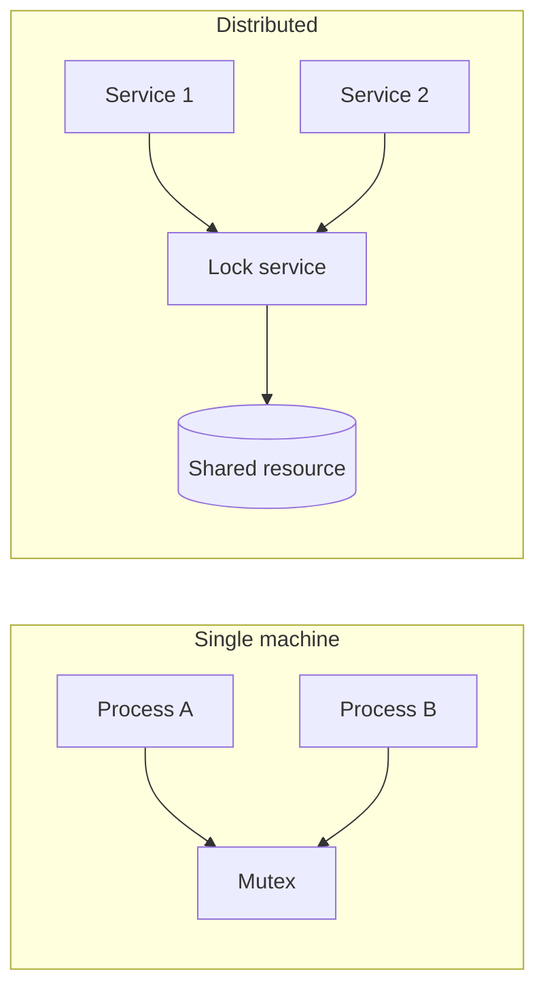
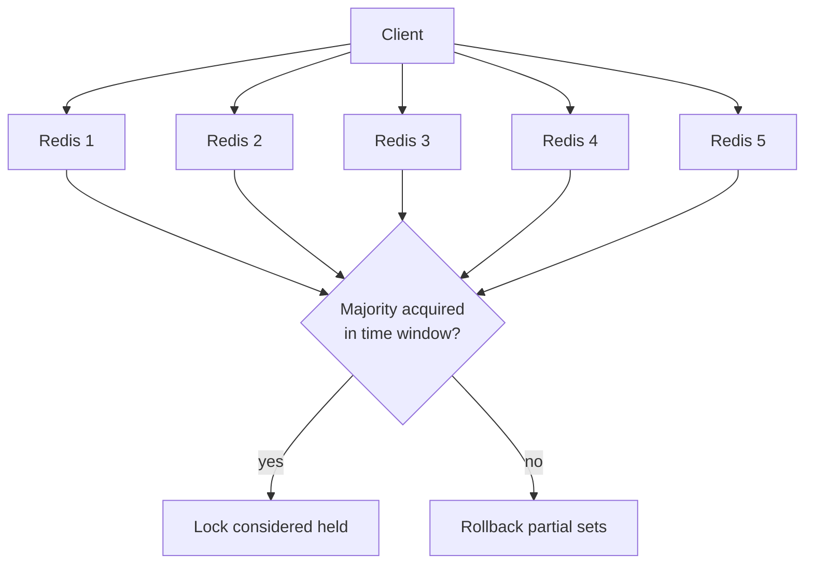
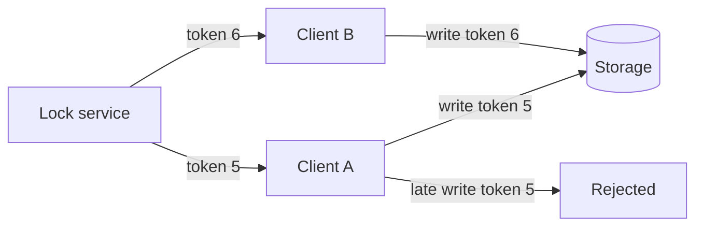
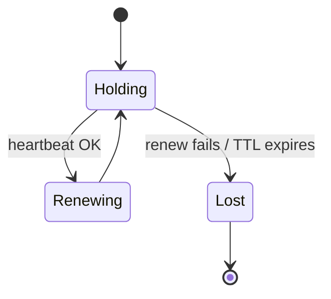
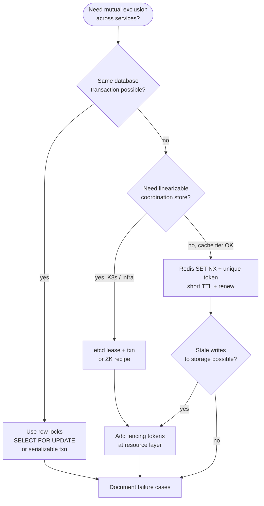

# Distributed Locking
{: .no_toc }

<details open markdown="block">
  <summary>Table of contents</summary>
  {: .text-delta }
1. TOC
{:toc}
</details>

---

## Why Distributed Locking

In a single process, you protect shared mutable state with mutexes, monitors, or language-level synchronization. In a distributed system, **multiple independent processes** may run on different machines, share no memory, and communicate only over the network. You still need **mutual exclusion** when two or more services must not perform conflicting operations on the same logical resource at the same time.

Typical scenarios include:

- **Shared resources across services** — Updating inventory, reserving a seat, debiting an account, or writing to a single-writer pipeline.
- **Cross-node coordination** — Ensuring only one worker processes a partition, or only one instance runs a scheduled job.
- **When you need mutual exclusion across processes or nodes** — Any time correctness depends on "at most one actor does X now," and those actors are not in the same OS process.

{: .note }
> Distributed locks are **not** the same as consensus. A lock service can help you serialize access, but you must still reason about failures, clock skew, storage delays, and what happens when a lock holder crashes or runs slowly.



---

## Lock Fundamentals

### Mutex vs advisory locks in distributed context

A **mutex** (mutual exclusion) guarantees that only one thread or process enters a critical section. In distributed systems, people often speak of **distributed mutexes** implemented on top of external stores (Redis, ZooKeeper, databases).

**Advisory locks** mean the lock does not block the resource at the storage layer; cooperating clients must **voluntarily** acquire the lock before touching the resource. If a client ignores the protocol, it can still corrupt data. Most Redis and database advisory mechanisms work this way.

| Concept | Local mutex | Distributed "mutex" |
|---------|-------------|---------------------|
| Enforcement | Kernel or runtime | Convention + lock service |
| Failure of holder | Thread dies; lock released (often) | Lease expiry, session loss, or manual cleanup |
| Cost | Nanoseconds to microseconds | Network RTT + persistence latency |

### Lock granularity

- **Coarse-grained** — One lock for an entire subsystem (simple, high contention).
- **Fine-grained** — Per-entity locks (e.g., per `user_id` or per `order_id`) to reduce contention but increase bookkeeping and deadlock risk if multiple locks are taken in inconsistent orders.

### Lock duration and TTL

Holding a lock for a long time increases contention and delays other workers. **Time-to-live (TTL)** or **lease** bounds how long a lock survives if the holder crashes without releasing it. If TTL is too short, a slow but healthy holder may lose the lock while still working (**false expiration**). If TTL is too long, failures block others for too long.

{: .tip }
> Prefer short leases with **renewal** (heartbeat) for long work, and design the protected operation to be **idempotent** or **safe to abort** when the lease is lost.

---

## Redis-Based Locking (Redlock)

### SET NX PX pattern

The common Redis pattern uses atomic **SET** with **NX** (only if not exists) and **PX** (expiry in milliseconds) to create a lock key with a value that identifies the owner (often a random token):

```text
SET lock:resource <unique_token> NX PX <ttl_ms>
```

The unique token is required so that only the owner can delete the key (compare token before `DEL`), avoiding accidental release by another client.

**Python (redis-py):**

```python
import uuid
import redis

r = redis.Redis(host="localhost", port=6379, db=0)
LOCK_KEY = "lock:payments:shard-3"
TOKEN = str(uuid.uuid4())
TTL_MS = 10_000

def acquire() -> bool:
    return bool(r.set(LOCK_KEY, TOKEN, nx=True, px=TTL_MS))

def release() -> None:
    lua = """
    if redis.call("get", KEYS[1]) == ARGV[1] then
        return redis.call("del", KEYS[1])
    else
        return 0
    end
    """
    r.eval(lua, 1, LOCK_KEY, TOKEN)
```

**Go (go-redis):**

```go
package main

import (
	"context"
	"time"

	"github.com/google/uuid"
	"github.com/redis/go-redis/v9"
)

var ctx = context.Background()

func acquireLock(rdb *redis.Client, key string, ttl time.Duration) (token string, ok bool) {
	token = uuid.NewString()
	ok, err := rdb.SetNX(ctx, key, token, ttl).Result()
	if err != nil || !ok {
		return "", false
	}
	return token, true
}
```

**Java (Lettuce-style pseudo-release with Lua):**

```java
// Acquire with SET NX PX
String token = UUID.randomUUID().toString();
Boolean ok = redisCommands.set(key, token, SetArgs.Builder.nx().px(ttlMs));

// Release atomically only if value matches
String lua =
    "if redis.call('get', KEYS[1]) == ARGV[1] then " +
    "return redis.call('del', KEYS[1]) else return 0 end";
redisCommands.eval(lua, ScriptOutputType.INTEGER, new String[]{key}, token);
```

### The Redlock algorithm (multi-node)

**Redlock** (Redis documentation algorithm) uses **multiple independent Redis masters** (typically 5). A client tries to acquire the lock on a majority of nodes with the same TTL, using wall-clock timing to validate that acquisition completed within a small fraction of the TTL. The intent is to survive failure of individual Redis processes without a single centralized coordinator.



### Martin Kleppmann's critique and the fencing token response

Martin Kleppmann argued that Redlock's assumptions about **wall-clock time** and **process pauses** (GC, scheduling) can violate safety: a client may believe it holds the lock when it does not, or two clients may both believe they hold the lock under certain failure and timing scenarios.

The practical response in many designs is not to abandon locks entirely but to combine them with **fencing tokens** (see below): the lock proves who *may* proceed, and the resource uses a **monotonic token** to reject stale writers.

### Clock drift issues

Any design that compares **elapsed real time** across machines (Redlock's validity window) is sensitive to **clock skew** and **NTP adjustments**. Redis single-instance locks with TTL are also sensitive: expiry is based on the server's clock and key lifetime semantics, but clients still use local time for renewal intervals. Use **monotonic clocks** (`CLOCK_MONOTONIC`) for intervals on the client, not wall-clock time for correctness proofs.

{: .warning }
> Do not assume synchronized wall clocks across nodes for correctness. Use leases, version numbers, or consensus-backed ordering for safety arguments.

---

## ZooKeeper-Based Locking

ZooKeeper provides a **hierarchical namespace** of znodes, **ephemeral** nodes (deleted when the session ends), and **sequential** node names with monotonic suffixes.

### Ephemeral sequential nodes

A typical recipe for a distributed lock:

1. Create an **ephemeral sequential** child under a lock path, e.g. `/locks/resource/lock-`.
2. ZooKeeper returns `lock-00000001`, `lock-00000002`, etc.
3. The client holds the lock if its znode has the **lowest sequence number** among siblings.
4. If not, **watch** the znode immediately before it; when that predecessor disappears, retry the check.

```mermaid
sequenceDiagram
    participant C as Client
    participant ZK as ZooKeeper
    C->>ZK: create /locks/r/lock- (ephemeral+sequential)
    ZK-->>C: lock-00000042
    C->>ZK: list children /locks/r/
    ZK-->>C: [..., lock-00000041, lock-00000042]
    C->>ZK: watch lock-00000041
    Note over C: Not smallest; wait
    ZK-->>C: predecessor deleted
    C->>ZK: list children again
    C->>ZK: I am smallest; critical section
```

### Watch mechanism

**Watches** notify clients when a znode changes, avoiding busy polling. You typically watch the **immediate predecessor** in the queue, not the parent, to reduce thundering herd when the lock is released.

### Leader election via locks

The same pattern elects a **leader**: the process owning the smallest ephemeral sequential child is the leader. When the leader's session dies, its ephemeral node vanishes and the next sequence becomes the new leader.

{: .note }
> ZooKeeper gives you **ordering visibility** through sequence numbers and session semantics; correctness still depends on clients implementing the recipe correctly and the resource handling failures (fencing) if needed.

---

## Fencing Tokens

### Why locks alone are not enough

Consider: Process **A** acquires a lock, then **stalls** (long GC, pause). The lock **expires**. Process **B** acquires the lock and writes. **A** wakes up, still believing it holds the lock, and writes **again**. You now have two writers who both thought they were protected.

### Monotonically increasing tokens

A **fencing token** is a number that **strictly increases** every time the lock is granted (or every time the lock service grants permission to write). The storage layer rejects any write whose token is **less than or equal to** the highest token it has already accepted.



### How to use fencing in practice

- The lock service (or a small coordination service) returns `(lock_id, fencing_token)` on acquire.
- Every downstream write carries `fencing_token` (header or column).
- Storage compares `fencing_token` to `max_seen_token` for that resource atomically.

```python
# Conceptual check at storage
def apply_write(resource_id: str, fencing_token: int, payload: bytes) -> bool:
    row = storage.get(resource_id)
    if fencing_token <= row.max_fencing_token:
        return False  # stale writer
    row.data = payload
    row.max_fencing_token = fencing_token
    storage.put(resource_id, row)
    return True
```

---

## Database-Based Locking

### SELECT FOR UPDATE

Within a **transaction**, `SELECT ... FOR UPDATE` locks matching rows until the transaction commits or rolls back. Other transactions block or fail depending on isolation level. This gives **strong mutual exclusion** for rows managed by the same database, without a separate lock service.

```sql
BEGIN;
SELECT id FROM inventory WHERE sku = $1 FOR UPDATE;
-- Critical section: decrement quantity, insert order line
UPDATE inventory SET qty = qty - $2 WHERE sku = $1;
COMMIT;
```

### Advisory locks in PostgreSQL

PostgreSQL **session-level advisory locks** (`pg_advisory_lock`, transactional advisory locks) serialize access using integer keys or bigint pairs. They do not lock table rows automatically; application code must acquire the right advisory lock before touching related rows.

```sql
-- Transaction-scoped advisory lock (released at end of transaction)
SELECT pg_advisory_xact_lock(hashtext('order:' || $1::text));
```

### Optimistic locking with version numbers

No long-held DB lock: read `version`, apply update with `WHERE id = ? AND version = ?`, increment version. If row count is zero, **retry**. Good for **low contention**; poor under heavy write conflicts.

```sql
UPDATE accounts
SET balance = balance - $1, version = version + 1
WHERE id = $2 AND version = $3;
```

{: .tip }
> Combine **short transactions** with `SELECT FOR UPDATE` for hot rows, or **partition** work so different shards contend on different DB rows.

---

## etcd-Based Locking

**etcd** is a strongly consistent key-value store built on **Raft**. Clients use **leases** (TTL), **keep-alive** streams, and **transactional compare-and-swap** to implement locks.

### Lease-based approach

1. Create a **lease** with a TTL.
2. Put a key `lock/resource` with your owner ID and **attach the lease** — the key disappears if the lease is not renewed.
3. **KeepAlive** renews the lease while the process is healthy.

### Compare-and-swap operations

Use a **transaction** that succeeds only if the key does not exist or matches your session:

```text
Txn:
  If create revision of lock/resource is 0 → put with lease
  Else → fail acquire
```

Client libraries (e.g. `etcd/client/v3` in Go) expose **session** or **mutex** helpers that wrap leases and transactions.

**Go (conceptual clientv3 usage):**

```go
// Pseudocode outline — use official concurrency package for production
// session, _ := concurrency.NewSession(client, concurrency.WithTTL(10))
// mutex := concurrency.NewMutex(session, "my-lock/")
// mutex.Lock(ctx)
// defer mutex.Unlock(ctx)
```

{: .note }
> etcd's linearizable writes and watch API make it a solid choice when you already run Kubernetes or need **strong consistency** from the coordination store itself.

---

## Design Considerations

### Performance vs correctness trade-offs

| Approach | Latency | Safety story |
|----------|---------|--------------|
| Single Redis SET NX | Low | Depends on TTL, fencing, single point of failure |
| Redlock | Medium | Debated; combine with fencing |
| ZooKeeper / etcd | Medium–higher | Sessions, ordering, Raft-backed |
| DB `FOR UPDATE` | Depends on DB | ACID scope only; no cross-DB mutex |

### Lock contention and thundering herd

When many clients wait for the same lock, they may **wake together** when it is released, causing a stampede. Mitigations: **randomized backoff**, **watch only the predecessor** (ZK), **per-shard locks**, or **message queues** to serialize work without polling locks.

### Deadlock detection in distributed systems

Classic deadlock requires **wait cycles**. In distributed locks, reduce risk by **total ordering** of lock acquisition (always lock `A` then `B`), **timeouts**, and **single lock** per task when possible. General **distributed deadlock detection** is hard; design to avoid needing it.

### Lease renewal and heartbeats

Long work items should use **renewal** (extend lease TTL) on a timer shorter than the TTL. If renewal fails (network partition, process crash), the lease expires and another worker can take over — ensure work is **idempotent** or **resumable**.



---

## Interview Decision Framework

Use this flowchart to structure answers: clarify **consistency requirements**, **failure modes**, and whether you need **fencing**.



**Talking points in an interview:**

1. **Start with the resource** — What exactly must be serialized?
2. **Single DC vs multi-region** — Locks do not magically span regions; often you partition or use CRDTs/event logs instead.
3. **Always mention TTL false expiration** and **fencing** for Redis-style locks.
4. **Contrast** ZooKeeper/etcd session semantics with Redis key expiry.

---

## Further Reading

- Martin Kleppmann — *"How to do distributed locking"* (Redlock critique) — essential for Staff-level depth.
- Redis documentation — **Distributed locks with Redis** and Redlock specification (read alongside critiques).
- Apache ZooKeeper — **Recipes and Solutions** (distributed locks and barriers).
- etcd — **etcd client v3 concurrency** package documentation.
- PostgreSQL manual — **Explicit Locking**, advisory locks, and isolation levels.
- Herlihy and Wing — *Linearizability: A Correctness Condition for Concurrent Objects* (foundations).

---

## Summary

| Topic | One-liner |
|-------|-----------|
| Redis SET NX PX | Atomic key with TTL + unique value; Lua unlock |
| Redlock | Multi-master quorum; understand clock/pause criticisms |
| ZooKeeper | Ephemeral sequential + watch predecessor |
| Fencing | Monotonic token at storage to reject stale writers |
| Database | `FOR UPDATE`, advisory locks, optimistic versioning |
| etcd | Lease + keep-alive + transactional CAS |

Distributed locking is a **coordination** tool. Pair it with **clear ownership**, **leases**, **idempotency**, and when stakes are high, **fencing** so that delayed or confused clients cannot corrupt shared state after they have lost the right to lead.
