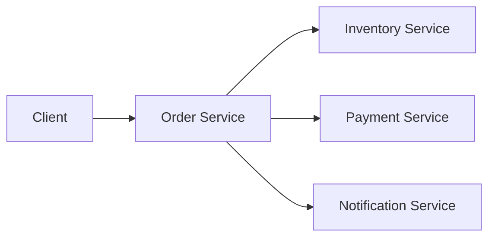
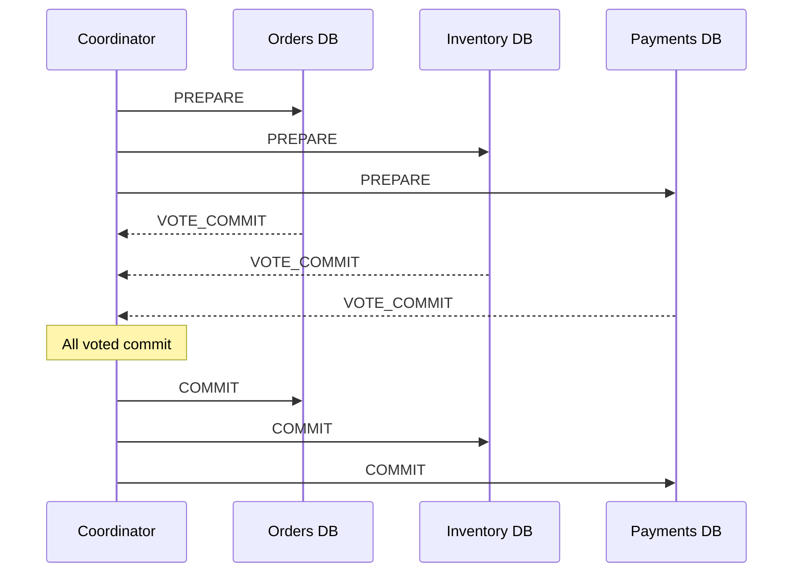
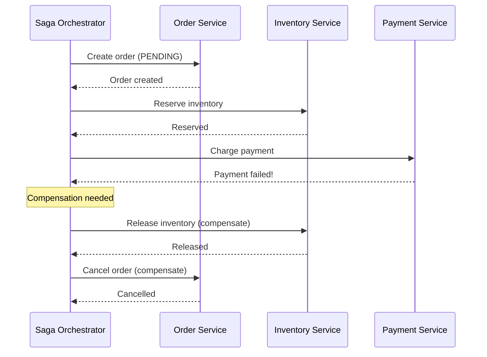
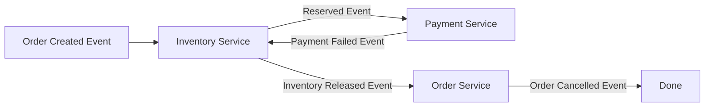
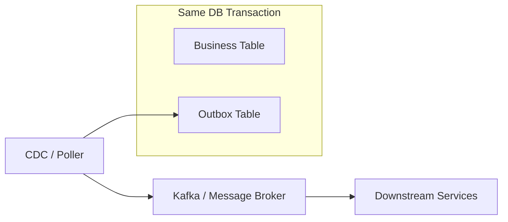

# Distributed Transactions (2PC, Saga, Outbox)

---

## Why Distributed Transactions Matter for Staff Engineers

In a microservices or sharded database world, a single business operation often spans multiple services or data stores. At L6, you must articulate **which transaction pattern to use and why**, considering the trade-offs between consistency, availability, latency, and operational complexity.

!!! note
    The interview question is never "implement 2PC." It's "Order placement writes to the Orders DB, deducts inventory, and charges the payment. How do you keep these consistent?" Your answer must include a transaction pattern with clear trade-off reasoning.

---

## The Problem

A single logical operation spans multiple services or databases:



If the payment succeeds but inventory deduction fails, the system is **inconsistent**. We need a mechanism to ensure all-or-nothing (or compensating) semantics.

---

## Two-Phase Commit (2PC)

### How It Works

| Phase | Coordinator Action | Participant Action |
|-------|--------------------|--------------------|
| **Phase 1: Prepare** | Sends `PREPARE` to all participants | Each participant writes to WAL, acquires locks, responds `VOTE_COMMIT` or `VOTE_ABORT` |
| **Phase 2: Commit/Abort** | If all voted commit: sends `COMMIT`; if any voted abort: sends `ABORT` | Participant applies or rolls back; releases locks |



### Failure Modes

| Failure | Impact | Mitigation |
|---------|--------|------------|
| **Participant crash after PREPARE** | Coordinator waits; locks held indefinitely | Timeout + coordinator decides abort; participant recovers from WAL |
| **Coordinator crash after collecting votes** | Participants are in **uncertain state**; cannot independently decide | Participants must wait for coordinator recovery; this is the **blocking problem** |
| **Network partition during Phase 2** | Some participants receive COMMIT, others don't | Recovery log on coordinator; participants query coordinator on restart |

### When to Use 2PC

| Use Case | Why |
|----------|-----|
| **Homogeneous database shards** | All participants are the same DB (e.g., Spanner shards); tight coupling acceptable |
| **Short-lived transactions** | Lock duration is bounded (milliseconds); blocking risk is low |
| **Strong consistency required** | Financial transactions where eventual consistency is unacceptable |

### When to Avoid 2PC

| Scenario | Why |
|----------|-----|
| **Across microservices** | Different teams own different services; coupling via locks is operationally fragile |
| **High-latency participants** | 2PC holds locks during the slowest participant's round-trip; degrades throughput |
| **High availability required** | Coordinator failure blocks all participants; violates availability goals |

---

## Saga Pattern

### Overview

A saga breaks a distributed transaction into a sequence of **local transactions**, each with a **compensating action** to undo its effects if a later step fails.

| Concept | Description |
|---------|-------------|
| **Forward action** | The normal business operation (e.g., deduct inventory) |
| **Compensating action** | The undo operation (e.g., restore inventory) |
| **Eventual consistency** | The system is temporarily inconsistent between steps; eventually converges |

### Orchestration vs. Choreography

| Style | How It Works | Pros | Cons |
|-------|-------------|------|------|
| **Orchestration** | A central **saga orchestrator** coordinates the steps; tells each service what to do | Clear flow; easy to monitor and debug | Single point of failure; coupling to orchestrator |
| **Choreography** | Each service listens for events and triggers the next step | Decoupled; no central coordinator | Hard to trace; implicit flow; risk of cyclic dependencies |

**Orchestration example:**



**Choreography example:**



### Saga Design Considerations

| Concern | Solution |
|---------|----------|
| **Idempotency** | Every step and compensation must be idempotent; retries are inevitable |
| **Observability** | Log saga state (step, status, timestamps) in a saga table for debugging |
| **Partial failure visibility** | Users may see a "pending" order that later gets cancelled; design UX accordingly |
| **Semantic lock** | Mark resources as "pending" during the saga; prevent other sagas from conflicting |
| **Compensation may fail** | Compensating actions can also fail; implement retry with exponential backoff; final fallback: manual intervention + alert |

### When to Use Sagas

| Scenario | Why |
|----------|-----|
| **Cross-service business processes** | E-commerce order flow, booking + payment, multi-step onboarding |
| **Long-running processes** | Workflows that take minutes or hours; holding locks is not viable |
| **Microservices architecture** | Services own their own data; no shared DB for 2PC |

---

## Transactional Outbox Pattern

### The Dual-Write Problem

When a service needs to update its database AND publish an event (e.g., to Kafka), doing both independently risks inconsistency:

```
1. Write to DB → succeeds
2. Publish to Kafka → fails (network error)
Result: DB updated, but downstream services never learn about it
```

### Solution: Outbox Table

Write the event to an **outbox table** in the same database transaction as the business data. A separate process reads the outbox and publishes to the message broker.



| Step | Action |
|------|--------|
| 1 | `BEGIN TRANSACTION` |
| 2 | `INSERT INTO orders (...)` |
| 3 | `INSERT INTO outbox (aggregate_id, event_type, payload, created_at)` |
| 4 | `COMMIT` |
| 5 | CDC (Debezium) or poller reads outbox, publishes to Kafka |
| 6 | Mark outbox row as published (or delete) |

### Outbox + CDC vs. Polling

| Approach | Latency | Complexity | Reliability |
|----------|---------|------------|-------------|
| **CDC (Debezium)** | Near real-time (ms) | Higher (requires CDC infrastructure) | Very high (reads DB WAL) |
| **Polling** | Seconds (poll interval) | Lower | Good; missed polls are caught up |

!!! tip
    **Staff-level answer:** *"I'd use the transactional outbox pattern with Debezium CDC for near-real-time event publishing. The outbox guarantees atomicity with the business write, and Debezium gives me low-latency event delivery without polling overhead. For teams without CDC infrastructure, a simple poller with a 1-second interval is a good starting point."*

---

## Comparison: 2PC vs Saga vs Outbox

| Dimension | 2PC | Saga | Transactional Outbox |
|-----------|-----|------|----------------------|
| **Consistency** | Strong (ACID) | Eventual | Eventual (but guaranteed delivery) |
| **Coupling** | Tight (locks across services) | Loose (event-driven) | Loose (async events) |
| **Latency** | Highest (lock duration) | Medium (sequential steps) | Lowest (fire-and-forget from producer) |
| **Failure handling** | Coordinator abort | Compensating transactions | Retry publishing |
| **Complexity** | Moderate | High (compensations, idempotency) | Low-moderate |
| **Best for** | Sharded databases (same system) | Cross-service business workflows | Reliable event publishing from a service |

---

## Advanced: Google Spanner's Approach

Google Spanner combines Paxos groups (per shard) with 2PC (across shards) and **TrueTime** for external consistency:

| Component | Role |
|-----------|------|
| **Paxos per split** | Consensus within a shard for replication |
| **2PC across splits** | When a transaction spans multiple shards, a coordinator runs 2PC across the Paxos leaders |
| **TrueTime** | GPS + atomic clocks provide bounded clock uncertainty; enables commit-wait for serializable snapshot isolation |

!!! note
    Spanner's approach works because all participants are within Google's controlled infrastructure. For cross-organization or cross-cloud transactions, Sagas remain the practical choice.

---

## Interview Checklist

| Topic | What to Cover |
|-------|---------------|
| **Identify the consistency need** | "Does this operation require strong consistency or is eventual acceptable?" |
| **Choose the pattern** | 2PC for same-system shards; Sagas for cross-service; Outbox for reliable event publishing |
| **Idempotency** | Every participant must handle retries safely |
| **Failure modes** | What happens when the coordinator/orchestrator crashes? |
| **Observability** | Saga state table, dead letter queues, correlation IDs |
| **Compensation** | Design undo operations that are safe, idempotent, and handle partial state |

---

_Last updated: 2026-04-05_
