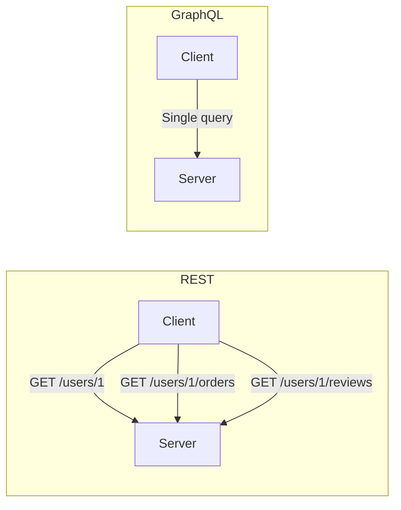
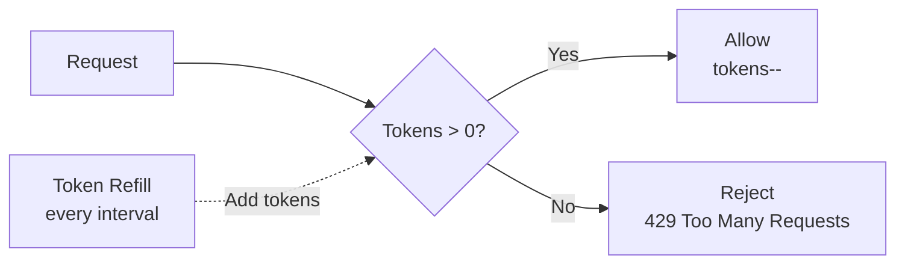
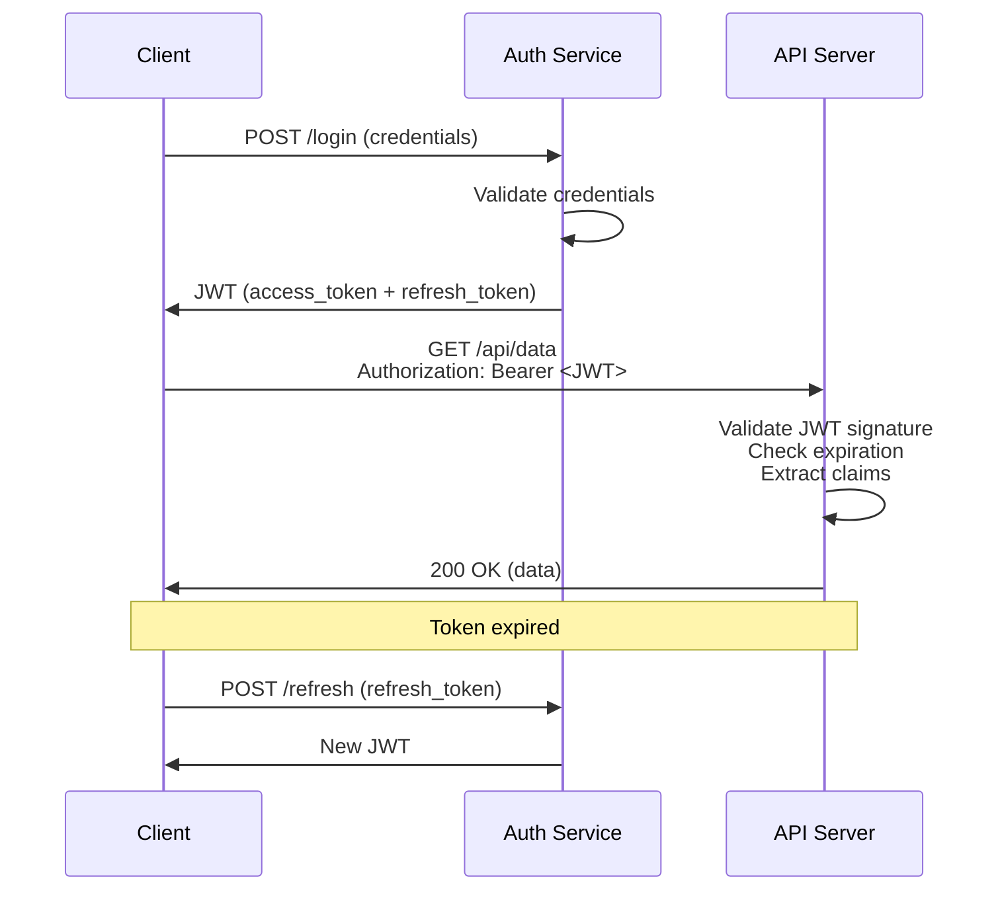
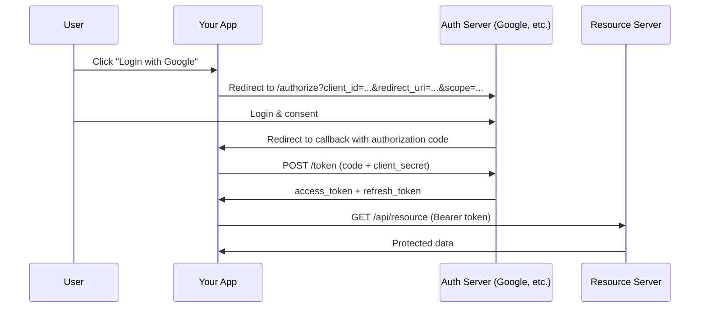
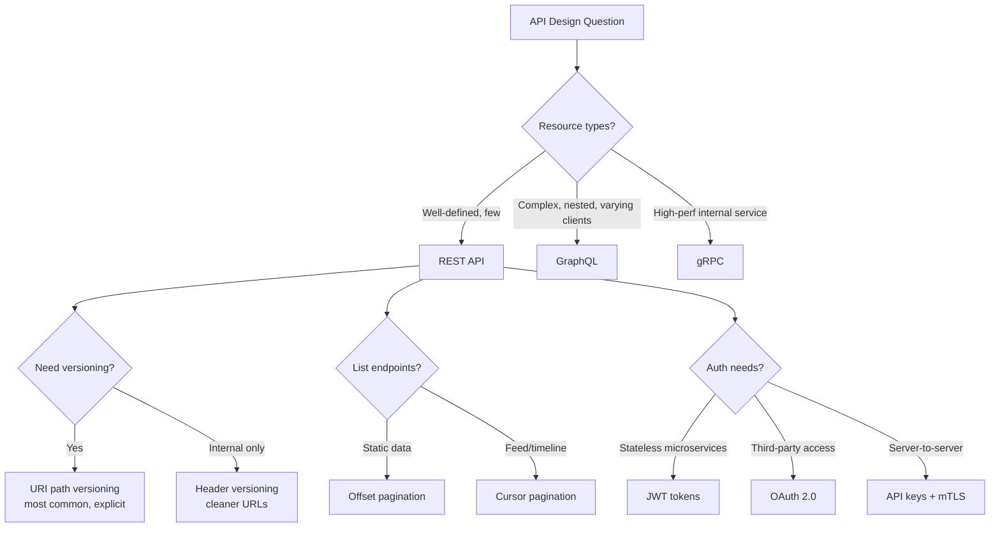

# API Design
{: .no_toc }

<details open markdown="block">
  <summary>Table of Contents</summary>
  {: .text-delta }
1. TOC
{:toc}
</details>

---

## What is an API?

An API (Application Programming Interface) is a contract between software components that defines how they communicate. In the context of system design interviews, APIs typically refer to **web APIs**—interfaces exposed over HTTP that allow clients to interact with backend services.

Good API design is the difference between a system that is easy to evolve, scale, and maintain versus one that becomes a tangled mess of breaking changes and confused consumers.

### Why API Design Matters in Interviews

Interviewers assess your API design skills because:

1. **It reveals your thinking:** How you model resources shows how well you understand the domain
2. **It affects the entire system:** A bad API forces bad architecture decisions downstream
3. **It impacts users:** External APIs are extremely hard to change once published
4. **It demonstrates experience:** Senior engineers instinctively think about versioning, pagination, error handling, and backwards compatibility

---

## RESTful API Design

REST (Representational State Transfer) is the dominant architectural style for web APIs. Defined by Roy Fielding in his 2000 dissertation, REST uses HTTP semantics to create intuitive, resource-oriented interfaces.

### REST Principles

| Principle | Description |
|-----------|-------------|
| **Client-Server** | Client and server are independent; they evolve separately |
| **Stateless** | Each request contains all information needed; server stores no session state |
| **Cacheable** | Responses declare themselves cacheable or not |
| **Uniform Interface** | Consistent resource identification, manipulation through representations, self-descriptive messages |
| **Layered System** | Client cannot tell if it is connected directly to the server or through intermediaries |

### Resource Modeling

Resources are the nouns of your API. They represent entities in your domain.

**Good resource naming:**

```
GET    /users                    → List all users
GET    /users/{id}               → Get a specific user
POST   /users                    → Create a new user
PUT    /users/{id}               → Replace a user entirely
PATCH  /users/{id}               → Partially update a user
DELETE /users/{id}               → Delete a user

GET    /users/{id}/orders        → List orders for a user
POST   /users/{id}/orders        → Create an order for a user
GET    /users/{id}/orders/{oid}  → Get a specific order for a user
```

**Common mistakes:**

```
GET  /getUser?id=123         ❌  Verb in URL
POST /createUser             ❌  HTTP method already implies creation
GET  /users/123/delete       ❌  Using GET for a destructive action
POST /users/search           ⚠️  Acceptable when query is complex (body needed)
```

### HTTP Methods and Status Codes

| Method | Idempotent | Safe | Use Case |
|--------|------------|------|----------|
| GET | Yes | Yes | Retrieve a resource |
| POST | No | No | Create a resource or trigger an action |
| PUT | Yes | No | Replace a resource entirely |
| PATCH | No* | No | Partially update a resource |
| DELETE | Yes | No | Remove a resource |

*PATCH can be made idempotent depending on the patch format.

**Essential status codes for interviews:**

| Code | Meaning | When to Use |
|------|---------|-------------|
| 200 | OK | Successful GET, PUT, PATCH, DELETE |
| 201 | Created | Successful POST that created a resource |
| 204 | No Content | Successful DELETE with no response body |
| 400 | Bad Request | Malformed request syntax, invalid parameters |
| 401 | Unauthorized | Missing or invalid authentication |
| 403 | Forbidden | Authenticated but lacks permission |
| 404 | Not Found | Resource does not exist |
| 409 | Conflict | State conflict (duplicate, version mismatch) |
| 429 | Too Many Requests | Rate limit exceeded |
| 500 | Internal Server Error | Unexpected server-side failure |
| 503 | Service Unavailable | Server overloaded or in maintenance |

### Java Example: RESTful API with Spring Boot

```java
@RestController
@RequestMapping("/api/v1/users")
public class UserController {

    private final UserService userService;

    public UserController(UserService userService) {
        this.userService = userService;
    }

    @GetMapping
    public ResponseEntity<PagedResponse<UserDto>> listUsers(
            @RequestParam(defaultValue = "0") int page,
            @RequestParam(defaultValue = "20") int size,
            @RequestParam(required = false) String sort) {

        Page<UserDto> users = userService.findAll(PageRequest.of(page, size, parseSort(sort)));
        return ResponseEntity.ok(PagedResponse.from(users));
    }

    @GetMapping("/{id}")
    public ResponseEntity<UserDto> getUser(@PathVariable UUID id) {
        return userService.findById(id)
            .map(ResponseEntity::ok)
            .orElse(ResponseEntity.notFound().build());
    }

    @PostMapping
    public ResponseEntity<UserDto> createUser(
            @Valid @RequestBody CreateUserRequest request) {
        UserDto created = userService.create(request);
        URI location = ServletUriComponentsBuilder.fromCurrentRequest()
            .path("/{id}")
            .buildAndExpand(created.getId())
            .toUri();
        return ResponseEntity.created(location).body(created);
    }

    @PutMapping("/{id}")
    public ResponseEntity<UserDto> replaceUser(
            @PathVariable UUID id,
            @Valid @RequestBody UpdateUserRequest request) {
        return userService.replace(id, request)
            .map(ResponseEntity::ok)
            .orElse(ResponseEntity.notFound().build());
    }

    @PatchMapping("/{id}")
    public ResponseEntity<UserDto> updateUser(
            @PathVariable UUID id,
            @Valid @RequestBody PatchUserRequest request) {
        return userService.patch(id, request)
            .map(ResponseEntity::ok)
            .orElse(ResponseEntity.notFound().build());
    }

    @DeleteMapping("/{id}")
    public ResponseEntity<Void> deleteUser(@PathVariable UUID id) {
        boolean deleted = userService.delete(id);
        return deleted ? ResponseEntity.noContent().build()
                       : ResponseEntity.notFound().build();
    }
}
```

### Standardized Response Envelope

Consistent response structures make APIs predictable for consumers:

```java
public class ApiResponse<T> {
    private final boolean success;
    private final T data;
    private final ApiError error;
    private final Map<String, Object> metadata;

    // Success response
    public static <T> ApiResponse<T> success(T data) {
        return new ApiResponse<>(true, data, null, null);
    }

    // Success with metadata (pagination info, etc.)
    public static <T> ApiResponse<T> success(T data, Map<String, Object> metadata) {
        return new ApiResponse<>(true, data, null, metadata);
    }

    // Error response
    public static <T> ApiResponse<T> error(String code, String message) {
        return new ApiResponse<>(false, null, new ApiError(code, message, null), null);
    }

    // Error with field-level details
    public static <T> ApiResponse<T> error(String code, String message,
                                            List<FieldError> fieldErrors) {
        return new ApiResponse<>(false, null, new ApiError(code, message, fieldErrors), null);
    }
}

// JSON output for success:
// {
//   "success": true,
//   "data": { "id": "abc-123", "name": "Alice", "email": "alice@example.com" },
//   "metadata": { "requestId": "req-xyz" }
// }

// JSON output for error:
// {
//   "success": false,
//   "error": {
//     "code": "VALIDATION_ERROR",
//     "message": "Request validation failed",
//     "details": [
//       { "field": "email", "message": "must be a valid email address" }
//     ]
//   }
// }
```

---

## Pagination

Any endpoint that returns a list must support pagination. Without it, returning millions of records in a single response will crash clients and servers alike.

### Offset-Based Pagination

The simplest approach: client specifies `page` and `size`.

```
GET /api/v1/orders?page=2&size=20
```

```json
{
  "data": [...],
  "metadata": {
    "page": 2,
    "size": 20,
    "totalElements": 1543,
    "totalPages": 78,
    "hasNext": true,
    "hasPrevious": true
  }
}
```

**Pros:** Simple, allows jumping to any page.

**Cons:** Inconsistent results when data changes between requests. Slow for large offsets (`OFFSET 1000000` is expensive in SQL).

### Cursor-Based Pagination

Uses an opaque cursor (typically an encoded ID or timestamp) to mark position.

```
GET /api/v1/orders?cursor=eyJpZCI6MTAwfQ==&size=20
```

```json
{
  "data": [...],
  "metadata": {
    "nextCursor": "eyJpZCI6MTIwfQ==",
    "previousCursor": "eyJpZCI6MTAxfQ==",
    "hasNext": true,
    "hasPrevious": true
  }
}
```

**Pros:** Consistent results even with inserts/deletes. Performant at any depth.

**Cons:** Cannot jump to arbitrary page. Cursor becomes invalid if underlying data changes schema.

### Java Example: Cursor-Based Pagination

```java
public class CursorPaginator<T> {
    
    public record CursorPage<T>(
        List<T> items,
        String nextCursor,
        String previousCursor,
        boolean hasNext,
        boolean hasPrevious
    ) {}

    public CursorPage<T> paginate(String cursor, int limit,
                                   Function<CursorQuery, List<T>> queryFn,
                                   Function<T, String> cursorExtractor) {
        CursorQuery query = decodeCursor(cursor, limit);
        
        // fetch one extra to determine if there are more results
        List<T> results = queryFn.apply(query.withLimit(limit + 1));
        boolean hasNext = results.size() > limit;

        List<T> page = hasNext ? results.subList(0, limit) : results;

        String nextCur = hasNext ? encodeCursor(cursorExtractor.apply(page.getLast())) : null;
        String prevCur = !page.isEmpty() ? encodeCursor(cursorExtractor.apply(page.getFirst())) : null;

        return new CursorPage<>(page, nextCur, prevCur, hasNext, cursor != null);
    }

    private String encodeCursor(String value) {
        return Base64.getEncoder().encodeToString(value.getBytes(StandardCharsets.UTF_8));
    }

    private CursorQuery decodeCursor(String cursor, int limit) {
        if (cursor == null) return new CursorQuery(null, limit);
        String decoded = new String(Base64.getDecoder().decode(cursor), StandardCharsets.UTF_8);
        return new CursorQuery(decoded, limit);
    }
}
```

### When to Use Each

| Criteria | Offset-Based | Cursor-Based |
|----------|-------------|--------------|
| **Data volatility** | Low (static lists) | High (feeds, timelines) |
| **UX requirement** | Jump to page N | Infinite scroll |
| **Dataset size** | Small to medium | Any size |
| **Implementation** | Simple | Moderate |
| **Real-world use** | Admin dashboards | Twitter feed, Slack messages |

---

## GraphQL

GraphQL is an alternative to REST that lets clients specify exactly what data they need. Developed by Facebook in 2012 and open-sourced in 2015.

### REST vs GraphQL



**The problem REST has:** To show a user profile page with their orders and reviews, you make 3 separate requests (over-fetching on each one since each endpoint returns full objects).

**GraphQL solves this:** One request, one response, exactly the fields you need.

```graphql
# GraphQL query — single request gets everything
query {
  user(id: "123") {
    name
    email
    orders(last: 5) {
      id
      total
      status
    }
    reviews(last: 3) {
      rating
      comment
    }
  }
}
```

### When to Use GraphQL vs REST

| Factor | REST | GraphQL |
|--------|------|---------|
| **Multiple resource types per page** | Multiple requests | Single query |
| **Mobile clients (bandwidth)** | Over-fetching common | Fetch only needed fields |
| **Caching** | HTTP caching built-in | More complex (no URL-based caching) |
| **File uploads** | Native support | Requires extensions |
| **Real-time** | WebSocket/SSE separately | Subscriptions built-in |
| **Learning curve** | Lower | Higher |
| **Tooling maturity** | Extensive | Growing |

{: .note }
> In interviews, stating "I'd use REST for this API because the resources are well-defined and we benefit from HTTP caching" is stronger than defaulting to either without rationale.

---

## API Versioning

APIs evolve. You will need to make breaking changes. Versioning strategies let you do this without breaking existing clients.

### Versioning Strategies

**1. URI Path Versioning** (Most common)

```
GET /api/v1/users/123
GET /api/v2/users/123
```

**Pros:** Explicit, easy to understand, easy to route.
**Cons:** URL pollution, version becomes part of the resource identity.

**2. Query Parameter Versioning**

```
GET /api/users/123?version=2
```

**Pros:** Optional parameter, default version for omitted param.
**Cons:** Easy to forget, harder to cache.

**3. Header Versioning**

```
GET /api/users/123
Accept: application/vnd.myapi.v2+json
```

**Pros:** Clean URLs, HTTP-correct.
**Cons:** Less visible, harder to test in browser.

**4. Content Negotiation**

```
GET /api/users/123
Accept: application/json; version=2
```

### Java Example: API Version Routing

```java
/**
 * Version-aware controller that routes to the correct handler
 * based on API version extracted from the request path.
 */
@RestController
public class VersionedUserController {

    private final UserServiceV1 v1Service;
    private final UserServiceV2 v2Service;

    // V1: returns basic user info
    @GetMapping("/api/v1/users/{id}")
    public ResponseEntity<UserDtoV1> getUserV1(@PathVariable UUID id) {
        return v1Service.findById(id)
            .map(ResponseEntity::ok)
            .orElse(ResponseEntity.notFound().build());
    }

    // V2: returns enriched user info with profile and preferences
    @GetMapping("/api/v2/users/{id}")
    public ResponseEntity<UserDtoV2> getUserV2(@PathVariable UUID id) {
        return v2Service.findById(id)
            .map(ResponseEntity::ok)
            .orElse(ResponseEntity.notFound().build());
    }
}

// V1 DTO — kept for backward compatibility
public record UserDtoV1(UUID id, String name, String email) {}

// V2 DTO — enriched with new fields
public record UserDtoV2(
    UUID id,
    String name,
    String email,
    ProfileDto profile,
    PreferencesDto preferences,
    Instant createdAt,
    Instant lastLoginAt
) {}
```

### Versioning Best Practices

1. **Start with v1 from day one** — retrofit is painful
2. **Support at least N-1** — give clients time to migrate
3. **Document deprecation timelines** — "v1 sunset: 2026-06-01"
4. **Use feature flags internally** — versions map to feature flags, not separate codebases
5. **Never break within a version** — adding fields is OK; removing or renaming is not

---

## Rate Limiting

Rate limiting protects your API from abuse, prevents resource exhaustion, and ensures fair usage across clients. It is one of the most commonly asked topics in system design interviews.

### Common Algorithms

#### Token Bucket

A bucket holds tokens. Each request consumes one token. Tokens are added at a fixed rate. Requests are rejected when the bucket is empty.



**Properties:** Allows bursts (up to bucket capacity), smooth average rate.

#### Sliding Window Log

Record timestamps of all requests. Count requests in the current window. Reject if count exceeds limit.

**Properties:** Precise, but memory-intensive (stores every timestamp).

#### Sliding Window Counter

Combines fixed window and sliding window. Uses weighted counts from current and previous windows.

**Properties:** Good balance of precision and memory.

### Java Example: Token Bucket Rate Limiter

```java
import java.util.concurrent.ConcurrentHashMap;
import java.util.concurrent.atomic.AtomicReference;

public class TokenBucketRateLimiter {
    
    private record Bucket(double tokens, long lastRefillTimestamp) {}

    private final ConcurrentHashMap<String, AtomicReference<Bucket>> buckets = 
        new ConcurrentHashMap<>();
    private final int maxTokens;
    private final double refillRate; // tokens per millisecond

    /**
     * @param maxTokens   Maximum burst capacity
     * @param refillRate  Tokens added per second
     */
    public TokenBucketRateLimiter(int maxTokens, double refillRate) {
        this.maxTokens = maxTokens;
        this.refillRate = refillRate / 1000.0; // convert to per-millisecond
    }

    public boolean allowRequest(String clientId) {
        AtomicReference<Bucket> ref = buckets.computeIfAbsent(clientId,
            k -> new AtomicReference<>(new Bucket(maxTokens, System.currentTimeMillis())));

        while (true) {
            Bucket current = ref.get();
            long now = System.currentTimeMillis();
            long elapsed = now - current.lastRefillTimestamp();

            // refill tokens based on elapsed time
            double newTokens = Math.min(maxTokens, current.tokens() + elapsed * refillRate);

            if (newTokens < 1.0) {
                return false; // no tokens available
            }

            Bucket updated = new Bucket(newTokens - 1.0, now);
            if (ref.compareAndSet(current, updated)) {
                return true;
            }
            // CAS failed — retry (another thread modified the bucket concurrently)
        }
    }

    public RateLimitInfo getRateLimitInfo(String clientId) {
        AtomicReference<Bucket> ref = buckets.get(clientId);
        if (ref == null) {
            return new RateLimitInfo(maxTokens, maxTokens, 0);
        }
        Bucket bucket = ref.get();
        long resetMs = (long) ((1.0 - bucket.tokens() % 1.0) / refillRate);
        return new RateLimitInfo(maxTokens, (int) bucket.tokens(), resetMs);
    }

    public record RateLimitInfo(int limit, int remaining, long resetMs) {}
}

// Usage in a servlet filter
public class RateLimitFilter implements Filter {
    private final TokenBucketRateLimiter limiter = new TokenBucketRateLimiter(100, 10.0);

    @Override
    public void doFilter(ServletRequest req, ServletResponse resp, FilterChain chain)
            throws IOException, ServletException {
        HttpServletRequest httpReq = (HttpServletRequest) req;
        HttpServletResponse httpResp = (HttpServletResponse) resp;

        String clientId = extractClientId(httpReq);

        if (!limiter.allowRequest(clientId)) {
            RateLimitInfo info = limiter.getRateLimitInfo(clientId);
            httpResp.setStatus(429);
            httpResp.setHeader("X-RateLimit-Limit", String.valueOf(info.limit()));
            httpResp.setHeader("X-RateLimit-Remaining", "0");
            httpResp.setHeader("Retry-After", String.valueOf(info.resetMs() / 1000));
            httpResp.getWriter().write("{\"error\": \"Rate limit exceeded\"}");
            return;
        }

        RateLimitInfo info = limiter.getRateLimitInfo(clientId);
        httpResp.setHeader("X-RateLimit-Limit", String.valueOf(info.limit()));
        httpResp.setHeader("X-RateLimit-Remaining", String.valueOf(info.remaining()));
        chain.doFilter(req, resp);
    }

    private String extractClientId(HttpServletRequest req) {
        String apiKey = req.getHeader("X-API-Key");
        return apiKey != null ? apiKey : req.getRemoteAddr();
    }
}
```

### Rate Limiting Headers (Standard)

```
HTTP/1.1 200 OK
X-RateLimit-Limit: 100
X-RateLimit-Remaining: 45
X-RateLimit-Reset: 1617235200
```

```
HTTP/1.1 429 Too Many Requests
X-RateLimit-Limit: 100
X-RateLimit-Remaining: 0
Retry-After: 30
```

---

## Authentication and Authorization

### Authentication (Who are you?)

| Method | How It Works | Best For |
|--------|-------------|----------|
| **API Keys** | Static key in header or query param | Server-to-server, simple APIs |
| **Basic Auth** | Base64-encoded username:password in header | Internal/dev only (insecure without TLS) |
| **JWT (JSON Web Token)** | Self-contained signed token with claims | Stateless microservices |
| **OAuth 2.0** | Delegated authorization with access tokens | Third-party access, social login |
| **mTLS** | Mutual TLS with client certificates | Service mesh, zero-trust |

### JWT Deep Dive



**JWT Structure:**

```
eyJhbGciOiJIUzI1NiJ9.          ← Header (algorithm, type)
eyJzdWIiOiJ1c2VyLTEyMyJ9.     ← Payload (claims: sub, exp, iat, roles)
SflKxwRJSMeKKF2QT4fwpM...     ← Signature (HMAC or RSA)
```

### Java Example: JWT Authentication

```java
public class JwtTokenProvider {
    private final SecretKey secretKey;
    private final long accessTokenValidityMs;
    private final long refreshTokenValidityMs;

    public JwtTokenProvider(String secret, long accessTokenValidityMs,
                             long refreshTokenValidityMs) {
        this.secretKey = Keys.hmacShaKeyFor(secret.getBytes(StandardCharsets.UTF_8));
        this.accessTokenValidityMs = accessTokenValidityMs;
        this.refreshTokenValidityMs = refreshTokenValidityMs;
    }

    public String createAccessToken(String userId, Set<String> roles) {
        Instant now = Instant.now();
        return Jwts.builder()
            .subject(userId)
            .claim("roles", roles)
            .claim("type", "access")
            .issuedAt(Date.from(now))
            .expiration(Date.from(now.plusMillis(accessTokenValidityMs)))
            .signWith(secretKey)
            .compact();
    }

    public String createRefreshToken(String userId) {
        Instant now = Instant.now();
        return Jwts.builder()
            .subject(userId)
            .claim("type", "refresh")
            .issuedAt(Date.from(now))
            .expiration(Date.from(now.plusMillis(refreshTokenValidityMs)))
            .signWith(secretKey)
            .compact();
    }

    public Claims validateToken(String token) {
        return Jwts.parser()
            .verifyWith(secretKey)
            .build()
            .parseSignedClaims(token)
            .getPayload();
    }

    public boolean isTokenExpired(String token) {
        try {
            Claims claims = validateToken(token);
            return claims.getExpiration().before(new Date());
        } catch (ExpiredJwtException e) {
            return true;
        }
    }
}
```

### OAuth 2.0 Authorization Code Flow



---

## Idempotency

An idempotent operation produces the same result regardless of how many times it is executed. This is critical in distributed systems where network failures can cause clients to retry requests.

### Why Idempotency Matters

```
Client → Server: "Create order for $100"
Server: Creates order, sends response
Network: Response lost!
Client: "No response... retry!"
Client → Server: "Create order for $100"  ← DUPLICATE!
```

Without idempotency, the user is charged $200 instead of $100.

### Idempotency Key Pattern

```java
@PostMapping("/api/v1/payments")
public ResponseEntity<PaymentDto> createPayment(
        @RequestHeader("Idempotency-Key") String idempotencyKey,
        @RequestBody CreatePaymentRequest request) {

    // check if we already processed this request
    Optional<PaymentDto> existing = paymentService.findByIdempotencyKey(idempotencyKey);
    if (existing.isPresent()) {
        return ResponseEntity.ok(existing.get()); // return cached result
    }

    PaymentDto payment = paymentService.processPayment(request, idempotencyKey);
    return ResponseEntity.status(HttpStatus.CREATED).body(payment);
}

@Service
public class PaymentService {
    @Transactional
    public PaymentDto processPayment(CreatePaymentRequest request, String idempotencyKey) {
        // atomic: insert idempotency record + create payment in single transaction
        idempotencyStore.save(new IdempotencyRecord(
            idempotencyKey, "PROCESSING", Instant.now(), Instant.now().plusSeconds(86400)
        ));

        Payment payment = paymentRepository.save(Payment.from(request));
        PaymentDto result = PaymentDto.from(payment);

        idempotencyStore.update(idempotencyKey, "COMPLETED", serialize(result));
        return result;
    }
}
```

### HTTP Method Idempotency Summary

| Method | Idempotent? | Safe? | Notes |
|--------|------------|-------|-------|
| GET | Yes | Yes | Never changes state |
| PUT | Yes | No | Replaces resource entirely — same result on repeat |
| DELETE | Yes | No | Deleting already-deleted resource returns 404 or 204 |
| POST | **No** | No | Use Idempotency-Key header to make it safe |
| PATCH | Depends | No | Increment operations are not idempotent |

---

## API Design Best Practices Checklist

Use this as a reference during interviews:

| Category | Practice |
|----------|----------|
| **Naming** | Use nouns for resources, plural forms, kebab-case or snake_case |
| **Versioning** | Start with v1, support N-1, document sunset dates |
| **Pagination** | Always paginate list endpoints; default to cursor-based for feeds |
| **Filtering** | Support query params: `?status=active&created_after=2024-01-01` |
| **Sorting** | `?sort=created_at:desc,name:asc` |
| **Error handling** | Consistent error envelope with code, message, field errors |
| **Rate limiting** | Include rate limit headers in every response |
| **Idempotency** | Require Idempotency-Key for non-idempotent mutations |
| **HATEOAS** | Include links for discoverability: `"links": {"next": "/users?page=2"}` |
| **Documentation** | OpenAPI/Swagger spec auto-generated from code annotations |
| **Security** | HTTPS only, validate all input, use short-lived tokens |
| **Monitoring** | Log request ID, latency, status code on every request |

---

## Interview Decision Framework



{: .important }
> In interviews, always justify your API design choices. Don't just say "I'll use REST"—explain why REST fits better than GraphQL or gRPC for the specific use case. Discuss pagination strategy, error handling, and authentication in your design.

---

## Further Reading

| Topic | Resource |
|-------|----------|
| REST Dissertation | [Roy Fielding's Dissertation (2000)](https://www.ics.uci.edu/~fielding/pubs/dissertation/rest_arch_style.htm) |
| HTTP Specification | [RFC 9110 - HTTP Semantics](https://httpwg.org/specs/rfc9110.html) |
| GraphQL Spec | [graphql.org/spec](https://spec.graphql.org/) |
| OAuth 2.0 | [RFC 6749](https://tools.ietf.org/html/rfc6749) |
| JWT | [RFC 7519](https://tools.ietf.org/html/rfc7519) |
| API Design Guidelines | [Microsoft REST API Guidelines](https://github.com/microsoft/api-guidelines) |
