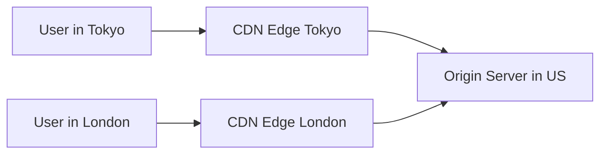
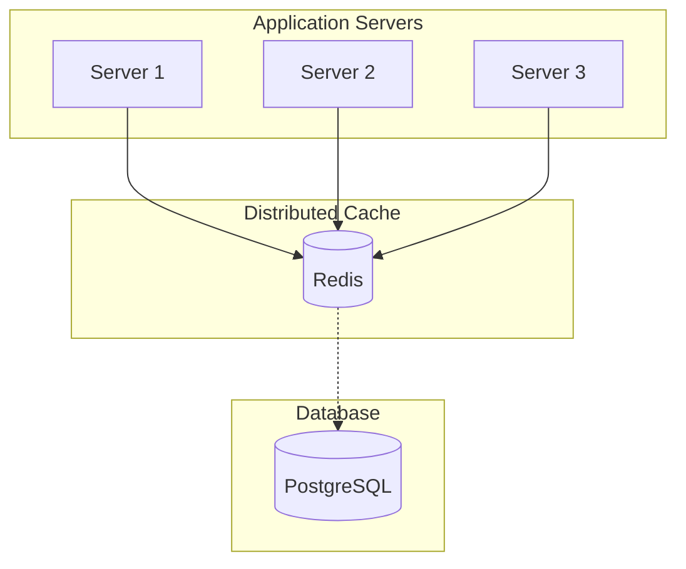
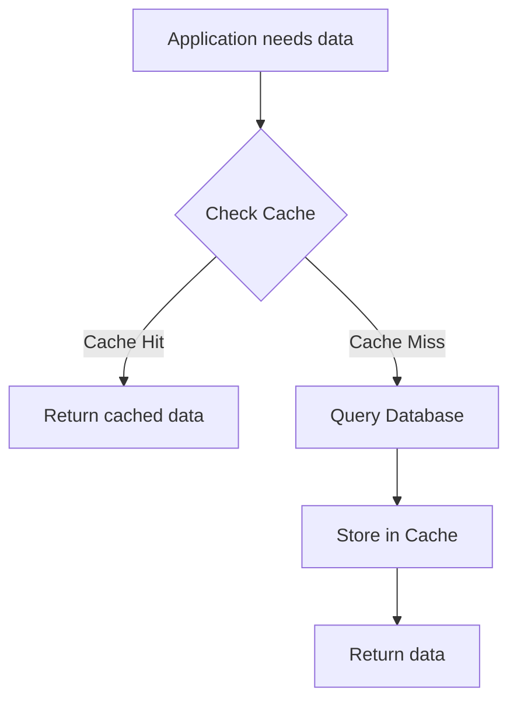
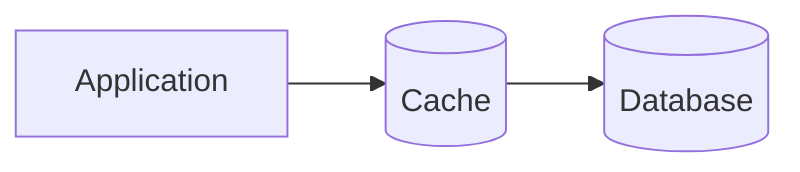
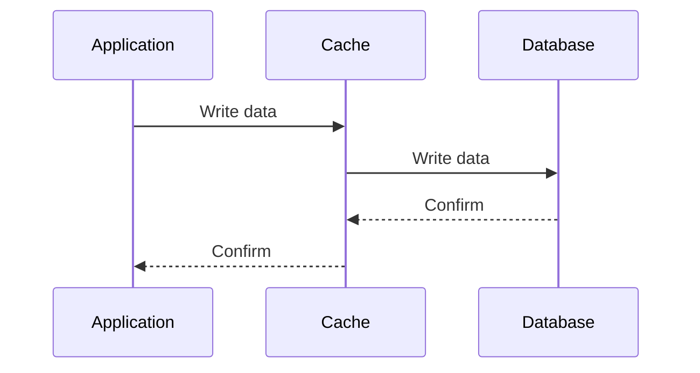
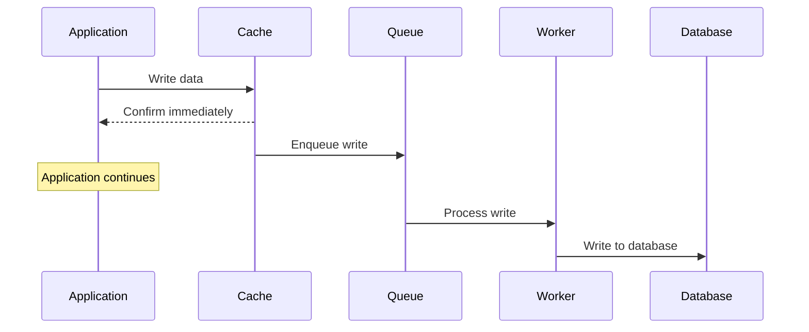
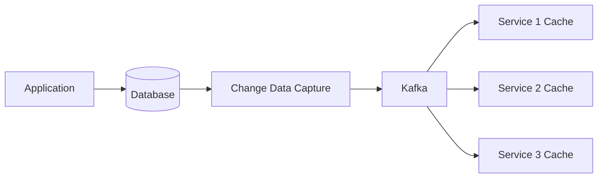
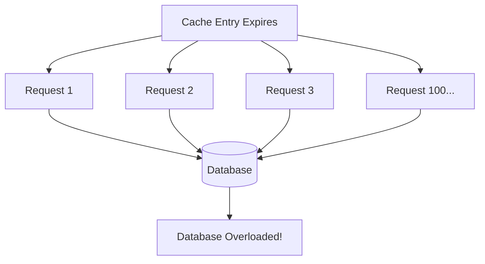

# Caching
{: .no_toc }

<details open markdown="block">
  <summary>Table of Contents</summary>
  {: .text-delta }
1. TOC
{:toc}
</details>

---

## What is Caching?

Caching is a technique that stores copies of frequently accessed data in a faster storage layer, so that future requests for that data can be served more quickly. Think of it like keeping your most-used tools on your desk instead of walking to the storage room every time you need them.

In computing, the "storage room" is typically a database or an external API, and the "desk" is memory (RAM). Reading from memory is orders of magnitude faster than reading from disk or making a network request:

| Storage Type | Access Time | Comparison |
|--------------|-------------|------------|
| L1 CPU Cache | 0.5 nanoseconds | Reference point |
| L2 CPU Cache | 7 nanoseconds | 14x slower |
| RAM | 100 nanoseconds | 200x slower |
| SSD | 150 microseconds | 300,000x slower |
| HDD | 10 milliseconds | 20,000,000x slower |
| Network (same datacenter) | 0.5 milliseconds | 1,000,000x slower |
| Network (cross-continent) | 150 milliseconds | 300,000,000x slower |

This massive difference in access times is why caching is so powerful. If you can serve a request from RAM instead of making a database query, you're potentially making your application thousands of times faster for that request.

### How Caching Works: A Concrete Example

Let's say you're building a news website. When a user visits the homepage, you need to fetch the top 10 articles from your database:

**Without caching:**
```
1. User requests homepage
2. Server queries database: "SELECT * FROM articles ORDER BY views DESC LIMIT 10"
3. Database scans table, sorts results, returns data (takes 50ms)
4. Server renders HTML and sends response
5. Total time: ~60ms

Next user visits:
1. User requests homepage
2. Server queries database again (another 50ms)
3. Server renders HTML
4. Total time: ~60ms again
```

The problem? Every single visitor triggers the same expensive database query, even though the top articles probably haven't changed in the last few seconds.

**With caching:**
```
First user visits:
1. User requests homepage
2. Server checks cache for "top_articles" - NOT FOUND (cache miss)
3. Server queries database (50ms)
4. Server stores result in cache with key "top_articles"
5. Server renders HTML and sends response
6. Total time: ~60ms

Second user visits (1 second later):
1. User requests homepage
2. Server checks cache for "top_articles" - FOUND (cache hit)
3. Server reads data from cache (0.5ms)
4. Server renders HTML and sends response
5. Total time: ~10ms
```

The second user's request is 6x faster. If you have 1,000 users per minute viewing the homepage, 999 of them get the fast cached response instead of hitting the database.

---

## Why Caching Matters in System Design

Caching is not just about speed—it's a fundamental building block for building scalable systems. Here's why caching appears in virtually every system design interview:

### 1. Reducing Database Load

Databases are often the bottleneck in web applications. They can handle a limited number of concurrent connections and queries per second. Every query you can serve from cache is one less query hitting your database.

**Example calculation:**
- Your database can handle 1,000 queries per second
- Your homepage is viewed 10,000 times per second
- Without caching: You need 10 database replicas (expensive!)
- With 99% cache hit rate: Only 100 queries/second hit the database (1 server is enough)

### 2. Improving User Experience

Users expect fast responses. Studies show:
- 47% of users expect pages to load in 2 seconds or less
- A 1-second delay in page response can result in a 7% reduction in conversions
- Google found that a 0.5-second delay in search results caused a 20% drop in traffic

Caching can reduce response times from hundreds of milliseconds to single-digit milliseconds.

### 3. Reducing Costs

Cloud databases charge based on CPU usage and I/O operations. By serving requests from cache, you:
- Use smaller/cheaper database instances
- Reduce read replica requirements
- Lower your overall infrastructure costs

A well-implemented caching layer can reduce database costs by 80% or more.

### 4. Improving Availability

Caches can serve as a buffer during traffic spikes or partial outages. If your database goes down briefly, users can still be served from cache (though the data might be slightly stale).

---

## Types of Caches

Understanding where caching can be applied is crucial for system design. Data can be cached at multiple layers of your architecture:

### Browser Cache

The browser itself caches resources locally on the user's device. This is controlled through HTTP headers sent by your server.

**How it works:**

When your server sends a response, it includes headers that tell the browser how to cache the resource:

```http
HTTP/1.1 200 OK
Content-Type: image/png
Cache-Control: max-age=31536000, public
ETag: "abc123"
```

- `Cache-Control: max-age=31536000` tells the browser to cache this for 1 year (31,536,000 seconds)
- `public` means any cache (including CDNs) can store this
- `ETag` is a version identifier for the resource

**On subsequent requests:**

If the cached resource is still valid (within max-age), the browser doesn't make a network request at all. If it's expired but has an ETag, the browser sends a conditional request:

```http
GET /logo.png HTTP/1.1
If-None-Match: "abc123"
```

The server can respond with `304 Not Modified` (no body) if the resource hasn't changed, saving bandwidth.

**Key Cache-Control directives:**

| Directive | Meaning |
|-----------|---------|
| `max-age=N` | Cache for N seconds |
| `no-cache` | Must revalidate with server before using cached copy |
| `no-store` | Never cache (for sensitive data) |
| `private` | Only browser can cache, not CDN |
| `public` | Any cache can store this |
| `immutable` | Resource will never change (no revalidation needed) |

**Best practices:**
- Use long max-age (1 year) for versioned assets (e.g., `app.v2.js`)
- Use `no-cache` for HTML pages that might change
- Use `no-store` for sensitive user data
- Include version hashes in filenames to enable cache busting

### CDN (Content Delivery Network)

A CDN is a distributed network of servers positioned geographically close to users. They cache your content at "edge locations" around the world.

**How it works:**



1. User in Tokyo requests your image
2. Request goes to nearest CDN edge server (Tokyo)
3. If cached: Edge serves immediately (latency: ~10ms)
4. If not cached: Edge fetches from origin, caches it, then serves user (first request slower)
5. Subsequent Tokyo users get the cached version

**Why CDNs matter:**

The speed of light limits how fast data can travel. A request from Tokyo to a US server takes at least 100ms just for the round trip. By caching content in Tokyo, you eliminate that latency entirely.

**What CDNs cache:**
- Static assets (images, CSS, JavaScript, fonts)
- Video content (Netflix, YouTube use CDNs heavily)
- API responses (with proper cache headers)
- Entire HTML pages (for mostly-static sites)

**Popular CDN providers:**

| Provider | Strengths | Use Case |
|----------|-----------|----------|
| **Cloudflare** | Free tier, DDoS protection, Workers (edge compute) | General purpose, startups |
| **AWS CloudFront** | Deep AWS integration, Lambda@Edge | AWS-based applications |
| **Fastly** | Real-time purging, VCL customization | When you need instant cache invalidation |
| **Akamai** | Largest network, enterprise features | Large enterprises, media streaming |

### Application-Level Cache (In-Process)

This is caching within your application's memory space—the fastest possible cache because there's no network latency.

**Example in Python:**

```python
from functools import lru_cache
import time

# Simulating an expensive database query
def get_user_from_database(user_id):
    time.sleep(0.1)  # Simulates 100ms database query
    return {"id": user_id, "name": f"User {user_id}"}

# Without caching
def get_user_slow(user_id):
    return get_user_from_database(user_id)  # 100ms every time

# With in-process caching
@lru_cache(maxsize=1000)
def get_user_fast(user_id):
    return get_user_from_database(user_id)  # 100ms first time, <1ms after

# First call: 100ms (cache miss)
# Second call: <0.001ms (cache hit)
```

**Pros:**
- Zero network latency (data is in the same process)
- Very simple to implement
- No additional infrastructure

**Cons:**
- Cache is lost when the process restarts
- Not shared across multiple server instances
- Limited by the memory of a single server
- Can cause memory issues if not bounded properly

**When to use:**
- Configuration data that rarely changes
- Computed values that are expensive to calculate
- Reference data (country codes, categories, etc.)
- Single-server applications

### Distributed Cache (Redis, Memcached)

A distributed cache is a separate caching service that multiple application servers can access. This solves the main limitations of in-process caching.

**How it works:**



All servers share the same cache, so when Server 1 caches a value, Server 2 and Server 3 can read it.

**Redis vs Memcached:**

| Feature | Redis | Memcached |
|---------|-------|-----------|
| **Data structures** | Strings, Lists, Sets, Hashes, Sorted Sets, Streams, HyperLogLog | Strings only |
| **Persistence** | Optional (RDB snapshots, AOF logs) | No |
| **Replication** | Built-in master-replica | No (requires external tools) |
| **Clustering** | Built-in (Redis Cluster) | Client-side sharding |
| **Pub/Sub** | Yes | No |
| **Lua scripting** | Yes | No |
| **Memory efficiency** | Good | Slightly better for simple strings |
| **Multi-threaded** | No (single-threaded, I/O multiplexed) | Yes (multi-threaded) |

**When to use Redis:**
- You need data structures beyond simple strings (e.g., leaderboards with sorted sets)
- You need persistence (surviving restarts)
- You want pub/sub messaging
- You need atomic operations on complex data

**When to use Memcached:**
- Simple key-value caching is all you need
- You want the simplest possible setup
- Memory efficiency for simple strings is critical

**Example Redis usage (Python):**

```python
import redis
import json

# Connect to Redis
cache = redis.Redis(host='localhost', port=6379, db=0)

def get_user(user_id):
    # Try cache first
    cache_key = f"user:{user_id}"
    cached = cache.get(cache_key)
    
    if cached:
        print("Cache hit!")
        return json.loads(cached)
    
    # Cache miss - query database
    print("Cache miss - querying database")
    user = database.query(f"SELECT * FROM users WHERE id = {user_id}")
    
    # Store in cache for 1 hour (3600 seconds)
    cache.setex(cache_key, 3600, json.dumps(user))
    
    return user
```

---

## Caching Strategies (Read Patterns)

How you read from and write to the cache significantly impacts your application's behavior. There are several common patterns:

### Cache-Aside (Lazy Loading)

This is the most common caching pattern. The application is responsible for reading from and writing to the cache.

**How it works:**



**Implementation:**

```python
def get_product(product_id):
    # Step 1: Check cache
    cache_key = f"product:{product_id}"
    cached_product = cache.get(cache_key)
    
    if cached_product is not None:
        # Cache hit - return immediately
        return json.loads(cached_product)
    
    # Step 2: Cache miss - load from database
    product = db.query("SELECT * FROM products WHERE id = %s", product_id)
    
    if product is None:
        return None
    
    # Step 3: Store in cache for future requests
    cache.setex(cache_key, 3600, json.dumps(product))  # 1 hour TTL
    
    return product
```

**Advantages:**
- Only requested data is cached (no wasted memory)
- Simple to implement and understand
- Cache failures don't break the application (just slower)
- Works well for read-heavy workloads

**Disadvantages:**
- First request for each item is slow (cache miss)
- Data can become stale if updated in database but not invalidated in cache
- "Cache stampede" possible when popular cache entries expire

**When to use:**
- General-purpose caching
- Read-heavy workloads
- When you can tolerate some staleness

### Read-Through

Similar to cache-aside, but the cache itself is responsible for loading data from the database on a miss.

**How it works:**



The application only talks to the cache. The cache transparently loads from the database on misses.

**Implementation concept:**

```python
class ReadThroughCache:
    def __init__(self, cache, database, loader_function):
        self.cache = cache
        self.database = database
        self.loader = loader_function
    
    def get(self, key):
        # Check cache
        value = self.cache.get(key)
        
        if value is not None:
            return value
        
        # Cache miss - load from database
        value = self.loader(self.database, key)
        
        # Store in cache
        self.cache.set(key, value)
        
        return value

# Usage
cache = ReadThroughCache(
    cache=redis_client,
    database=postgres_client,
    loader_function=lambda db, key: db.query(f"SELECT * FROM users WHERE id = {key}")
)

user = cache.get("user:123")  # Transparently handles cache miss
```

**Advantages:**
- Simpler application code (doesn't need to know about database)
- Cache loading logic is centralized
- Easier to maintain consistency

**Disadvantages:**
- More complex cache implementation
- Cache becomes a critical component
- Less flexibility for complex loading scenarios

### Cache Warming

Proactively loading data into the cache before it's requested, rather than waiting for cache misses.

**When to use:**
- After cache restart/failure
- For predictably hot data
- Before expected traffic spikes (e.g., flash sales)

**Implementation:**

```python
def warm_cache():
    """Pre-load popular products into cache."""
    
    # Get top 1000 most-viewed products
    popular_products = db.query("""
        SELECT * FROM products 
        ORDER BY view_count DESC 
        LIMIT 1000
    """)
    
    for product in popular_products:
        cache_key = f"product:{product['id']}"
        cache.setex(cache_key, 3600, json.dumps(product))
    
    print(f"Warmed cache with {len(popular_products)} products")

# Run on application startup or as a scheduled job
warm_cache()
```

---

## Caching Strategies (Write Patterns)

When data changes, how do you handle the cache? This is where things get tricky.

### Write-Through

Write to the cache AND the database synchronously. The cache always has the latest data.

**How it works:**



**Implementation:**

```python
def update_product(product_id, new_data):
    cache_key = f"product:{product_id}"
    
    # Write to database first
    db.execute(
        "UPDATE products SET name=%s, price=%s WHERE id=%s",
        (new_data['name'], new_data['price'], product_id)
    )
    
    # Then update cache
    cache.setex(cache_key, 3600, json.dumps(new_data))
    
    return new_data
```

**Advantages:**
- Cache is always consistent with database
- Reads after writes always see updated data
- Simple mental model

**Disadvantages:**
- Higher write latency (must write to both)
- If cache write fails after DB write, inconsistency occurs
- May cache data that's never read

**When to use:**
- When you need strong consistency
- When read-after-write consistency is important
- When data is likely to be read soon after writing

### Write-Behind (Write-Back)

Write to the cache immediately, then asynchronously write to the database later.

**How it works:**



**Implementation concept:**

```python
import threading
from queue import Queue

write_queue = Queue()

def write_behind_update(product_id, new_data):
    cache_key = f"product:{product_id}"
    
    # Update cache immediately
    cache.setex(cache_key, 3600, json.dumps(new_data))
    
    # Queue database write for later
    write_queue.put({
        'type': 'UPDATE',
        'table': 'products',
        'id': product_id,
        'data': new_data
    })
    
    return new_data  # Return immediately

# Background worker
def db_writer_worker():
    while True:
        write_task = write_queue.get()
        try:
            # Write to database
            db.execute(
                f"UPDATE {write_task['table']} SET ... WHERE id = %s",
                (write_task['id'],)
            )
        except Exception as e:
            # Handle failure - retry or log
            logging.error(f"Failed to write: {e}")
        write_queue.task_done()

# Start background worker
threading.Thread(target=db_writer_worker, daemon=True).start()
```

**Advantages:**
- Very low write latency (only cache write)
- Can batch multiple writes together
- Absorbs database write spikes

**Disadvantages:**
- Risk of data loss if cache fails before DB write
- More complex implementation
- Harder to debug
- Not suitable for critical data

**When to use:**
- Analytics and logging
- High write throughput requirements
- Data where some loss is acceptable
- Rate limiting/counting

### Write-Around

Write directly to the database, skip the cache entirely. Cache is only populated on reads.

**Implementation:**

```python
def update_product_write_around(product_id, new_data):
    # Write only to database
    db.execute(
        "UPDATE products SET name=%s, price=%s WHERE id=%s",
        (new_data['name'], new_data['price'], product_id)
    )
    
    # Optionally invalidate cache so next read gets fresh data
    cache.delete(f"product:{product_id}")
    
    return new_data
```

**Advantages:**
- Simple implementation
- No cache write overhead
- Good for write-heavy workloads where data isn't immediately re-read

**Disadvantages:**
- Read after write hits database
- Cache can be stale until invalidated

**When to use:**
- Data that's written often but read rarely
- Bulk data imports
- Log data

---

## Cache Eviction Policies

When the cache is full, which items should be removed to make room for new ones? This decision is critical for cache effectiveness.

### LRU (Least Recently Used)

Remove the item that hasn't been accessed for the longest time.

**How it works:**

Imagine a bookshelf that can only hold 4 books. When you read a book, you put it at the front. When the shelf is full and you need to add a new book, you remove the one at the back.

```
Initial state: [A, B, C, D] (A most recent, D least recent)
Access B:      [B, A, C, D] (B moves to front)
Access E:      [E, B, A, C] (D removed, E added to front)
Access A:      [A, E, B, C] (A moves to front)
```

**Implementation (Python with OrderedDict):**

```python
from collections import OrderedDict

class LRUCache:
    def __init__(self, capacity):
        self.capacity = capacity
        self.cache = OrderedDict()
    
    def get(self, key):
        if key not in self.cache:
            return None
        
        # Move to end (most recently used)
        self.cache.move_to_end(key)
        return self.cache[key]
    
    def put(self, key, value):
        if key in self.cache:
            # Update existing and move to end
            self.cache.move_to_end(key)
        else:
            if len(self.cache) >= self.capacity:
                # Remove oldest (first item)
                self.cache.popitem(last=False)
        
        self.cache[key] = value

# Usage
cache = LRUCache(3)
cache.put("a", 1)
cache.put("b", 2)
cache.put("c", 3)
print(cache.get("a"))  # 1, moves "a" to most recent
cache.put("d", 4)      # Evicts "b" (least recently used)
```

**Why LRU is popular:**
- Simple to understand and implement
- Works well in practice (temporal locality)
- O(1) time complexity with proper data structures

**Limitations:**
- Doesn't consider frequency (an item accessed once recently beats one accessed 1000 times earlier)
- Scan resistance problem: A single full scan of data can evict all useful cached items

### LFU (Least Frequently Used)

Remove the item that has been accessed the fewest number of times.

**How it works:**

```
Item A: accessed 10 times
Item B: accessed 2 times  ← Will be evicted
Item C: accessed 5 times
Item D: accessed 8 times

New item E arrives, B is removed.
```

**Advantages over LRU:**
- Better for stable access patterns
- Doesn't evict frequently accessed items due to a burst of new items

**Disadvantages:**
- More complex implementation
- "Cache pollution": items with high historical counts but no longer relevant stay cached
- New items are vulnerable (low count = high eviction risk)

### TTL (Time To Live)

Items automatically expire after a set duration, regardless of access patterns.

**How it works:**

```python
# Set with 1 hour TTL
cache.setex("user:123", 3600, user_data)

# After 3600 seconds, the key automatically disappears
```

**Advantages:**
- Guarantees freshness (data can't be older than TTL)
- Simple to implement and understand
- Good for data that becomes stale over time

**Disadvantages:**
- All items expire regardless of popularity
- Can cause cache stampedes when popular items expire

**Best practice: Combine LRU with TTL:**

```python
# Store with TTL for freshness
cache.setex(key, 3600, value)  # Expires after 1 hour

# Redis automatically uses LRU when maxmemory is reached
# Configure in redis.conf:
# maxmemory 1gb
# maxmemory-policy allkeys-lru
```

### Choosing an Eviction Policy

| Policy | Best For | Avoid When |
|--------|----------|------------|
| **LRU** | General purpose, temporal locality | Access frequency matters more than recency |
| **LFU** | Stable access patterns | Data access patterns change over time |
| **TTL** | Time-sensitive data | You need to maximize cache hit ratio |
| **Random** | Simple systems, testing | Production systems with limited cache size |

---

## Cache Invalidation

> "There are only two hard things in Computer Science: cache invalidation and naming things."
> — Phil Karlton

When data in your database changes, how do you ensure the cache doesn't serve stale data? This is the cache invalidation problem.

### Strategy 1: TTL-Based Expiration

Set a TTL (Time To Live) on cached items. They automatically expire and get refreshed.

```python
# User data expires after 5 minutes
cache.setex("user:123", 300, user_data)
```

**Trade-off:**
- Short TTL = More freshness, more cache misses
- Long TTL = Better hit ratio, more staleness

**When to use:**
- Data that changes occasionally
- When some staleness is acceptable
- When you can't easily track all updates

### Strategy 2: Explicit Invalidation

When you update data, explicitly delete or update the cache.

```python
def update_user(user_id, new_data):
    # Update database
    db.execute("UPDATE users SET name = %s WHERE id = %s", 
               (new_data['name'], user_id))
    
    # Invalidate cache
    cache.delete(f"user:{user_id}")  # Delete approach
    # OR
    cache.setex(f"user:{user_id}", 3600, json.dumps(new_data))  # Update approach
```

**Challenge: Finding all related cache keys**

If you cache a user's data under multiple keys:
- `user:123` (main record)
- `user:123:profile` (profile page)
- `team:456:members` (team member list containing this user)
- `leaderboard:weekly` (leaderboard containing this user)

You need to invalidate all of them when the user changes!

**Solutions:**

1. **Cache key registry:** Track all keys related to an entity
```python
# When caching
cache.sadd("user:123:related_keys", "team:456:members", "leaderboard:weekly")

# When invalidating
related_keys = cache.smembers("user:123:related_keys")
for key in related_keys:
    cache.delete(key)
```

2. **Cache tags (Redis supports this):**
```python
# Tag cache entries
cache.set("user:123", data, tags=["user:123", "team:456"])
cache.set("team:456:members", members, tags=["team:456"])

# Invalidate by tag
cache.invalidate_by_tag("user:123")  # Clears all entries with this tag
```

### Strategy 3: Event-Driven Invalidation

Use an event system to notify caches when data changes.



**How it works:**

1. Application updates the database
2. Change Data Capture (CDC) detects the change
3. CDC publishes an event to Kafka
4. All services subscribed to that topic receive the event
5. Each service invalidates its local cache

**Technologies:**
- **Debezium:** CDC for PostgreSQL, MySQL, MongoDB
- **Kafka:** Event streaming
- **Redis Pub/Sub:** Simpler alternative for same-datacenter

**Implementation example:**

```python
# Publisher (runs when data changes)
def on_user_updated(user_id):
    kafka.publish("user-updates", {
        "event": "USER_UPDATED",
        "user_id": user_id,
        "timestamp": time.time()
    })

# Subscriber (runs in each service)
@kafka.subscribe("user-updates")
def handle_user_update(event):
    if event["event"] == "USER_UPDATED":
        cache.delete(f"user:{event['user_id']}")
        cache.delete(f"user:{event['user_id']}:profile")
        # etc.
```

**Advantages:**
- Decoupled services
- Near real-time invalidation
- Works across microservices

**Disadvantages:**
- Added infrastructure complexity
- Message delivery isn't instant (small window of staleness)
- Need to handle message failures

---

## Cache Consistency Problems

### Problem 1: Stale Data

**Scenario:** User updates their profile, but sees old data on the next page.

**Cause:** The cache hasn't been invalidated yet, or the user was served from a different server with old cache.

**Solutions:**
- Write-through caching (cache is always updated)
- Immediate cache invalidation on writes
- Read-your-writes consistency (route user to same server after write)
- Client-side cache bypass after writes

### Problem 2: Cache Stampede (Thundering Herd)

**Scenario:** A popular cache entry expires. Suddenly 1000 requests hit the database simultaneously.



**Solutions:**

**1. Locking (Mutex)**

Only one request fetches from the database. Others wait for the cache to be populated.

```python
def get_with_lock(key, fetch_function, ttl=3600):
    # Try cache first
    value = cache.get(key)
    if value is not None:
        return json.loads(value)
    
    lock_key = f"lock:{key}"
    
    # Try to acquire lock
    if cache.set(lock_key, "1", nx=True, ex=10):  # Lock for 10 seconds
        try:
            # We have the lock - fetch from DB
            value = fetch_function()
            cache.setex(key, ttl, json.dumps(value))
            return value
        finally:
            cache.delete(lock_key)
    else:
        # Someone else has the lock - wait and retry
        time.sleep(0.1)
        return get_with_lock(key, fetch_function, ttl)
```

**2. Probabilistic Early Expiration**

Refresh the cache *before* it expires, with some randomness.

```python
def get_with_early_refresh(key, fetch_function, ttl=3600, beta=1):
    cached = cache.get(key)
    
    if cached:
        data = json.loads(cached)
        expiry = data['_expiry']
        value = data['value']
        
        # Calculate if we should refresh early
        # Higher beta = more aggressive early refresh
        delta = ttl * beta * random.random()
        
        if time.time() + delta >= expiry:
            # Refresh in background
            threading.Thread(
                target=lambda: refresh_cache(key, fetch_function, ttl)
            ).start()
        
        return value
    
    # Cache miss - normal fetch
    return fetch_and_cache(key, fetch_function, ttl)
```

**3. Background Refresh**

Never let items expire. A background job refreshes them before TTL.

```python
def cache_refresh_job():
    """Run every minute."""
    keys_to_refresh = cache.smembers("keys_to_keep_fresh")
    
    for key in keys_to_refresh:
        ttl = cache.ttl(key)
        if ttl < 300:  # Less than 5 minutes left
            # Refresh now
            value = fetch_from_database(key)
            cache.setex(key, 3600, value)
```

### Problem 3: Race Conditions

**Scenario:** Two processes try to update the same cache entry simultaneously.

```
Time 0: Process A reads user from DB (name = "Alice")
Time 1: Process B updates user in DB (name = "Bob")
Time 2: Process B updates cache (name = "Bob")
Time 3: Process A updates cache (name = "Alice")  ← WRONG!
```

The cache now shows "Alice" but the database has "Bob".

**Solutions:**

**1. Use atomic operations**
```python
# Instead of read-modify-write, use atomic increment
cache.incr("page_views:homepage")  # Atomic increment
```

**2. Use versioning**
```python
def update_with_version(key, new_value, expected_version):
    # Lua script for atomic compare-and-set
    script = """
    local current = redis.call('GET', KEYS[1])
    local data = cjson.decode(current)
    if data.version == ARGV[1] then
        redis.call('SET', KEYS[1], ARGV[2])
        return 1
    else
        return 0
    end
    """
    
    new_data = {"value": new_value, "version": expected_version + 1}
    success = cache.eval(script, 1, key, expected_version, json.dumps(new_data))
    
    if not success:
        raise ConcurrencyError("Version mismatch - retry")
```

**3. Use locks (for complex updates)**
```python
from redis.lock import Lock

def update_user_safely(user_id, updates):
    with Lock(cache, f"lock:user:{user_id}", timeout=10):
        # Only one process can be here at a time
        user = get_user(user_id)
        user.update(updates)
        save_user(user)
        cache.setex(f"user:{user_id}", 3600, json.dumps(user))
```

---

## Cache Sizing and Monitoring

### How Much Memory Do You Need?

**Calculate your working set:**

```
Example: E-commerce product cache

Number of products: 100,000
Average product data size: 2 KB
Products accessed in any hour: 20,000 (20%)

Minimum cache size for hourly working set:
20,000 × 2 KB = 40 MB

Add buffer for overhead and growth:
40 MB × 1.5 = 60 MB

Recommended cache size: 64 MB - 128 MB
```

**Key metrics to monitor:**

| Metric | Target | Action if Violated |
|--------|--------|-------------------|
| **Hit Ratio** | > 90% | Increase cache size, review eviction policy |
| **Memory Usage** | < 80% | Increase memory or reduce TTL |
| **Evictions/sec** | Low, stable | Increase memory if evictions spike |
| **Latency** | < 1ms | Check network, consider Redis Cluster |
| **Connections** | < max_connections | Implement connection pooling |

### Hit Ratio

The most important cache metric. It tells you what percentage of requests are served from cache.

```
Hit Ratio = Cache Hits / (Cache Hits + Cache Misses)
```

**Interpreting hit ratio:**
- **> 95%:** Excellent. Cache is very effective.
- **90-95%:** Good. Normal for most applications.
- **80-90%:** Acceptable. Consider increasing cache size.
- **< 80%:** Poor. Investigate why. Possible causes:
  - Cache too small
  - TTL too short
  - Access pattern doesn't benefit from caching
  - Too many unique keys

---

## Interview Tips

### What Interviewers Want to Hear

1. **When to cache:** Not everything should be cached. Cache data that is:
   - Read frequently
   - Expensive to compute/fetch
   - Doesn't change often (or staleness is acceptable)

2. **Cache invalidation strategy:** Don't just say "use Redis." Explain HOW you'll keep the cache consistent with the database.

3. **Failure scenarios:** What happens if the cache goes down? Your application should still work (just slower).

4. **Sizing considerations:** Show you understand that cache size affects hit ratio.

### Common Interview Questions

**Q: How would you improve this system's performance?**

*Good answer:*
> "Looking at this read-heavy system, I'd add a caching layer using Redis. Specifically, I'd cache the user profiles using cache-aside pattern with a 15-minute TTL. For the product catalog, I'd use a longer 1-hour TTL since products change less frequently. I'd monitor hit ratio and aim for 95%+. For cache invalidation, when a product is updated, I'd publish an event to Kafka that triggers cache invalidation across all service instances."

**Q: What's your cache invalidation strategy?**

*Good answer:*
> "It depends on the data. For user sessions, I'd use short TTLs (15-30 minutes) since staleness is unacceptable. For product catalogs, I'd combine TTL (1 hour) with explicit invalidation on updates—when a product is modified, we delete its cache entry. For highly distributed systems, I'd use event-driven invalidation through Kafka to ensure all service instances invalidate simultaneously."

**Q: What happens if your cache fails?**

*Good answer:*
> "The application should gracefully degrade to querying the database directly. I'd implement circuit breakers so if Redis is unresponsive, we skip the cache lookup entirely rather than waiting for timeouts. This means higher latency and increased database load, but the system stays functional. We'd also have alerts on cache availability and automatic failover to a Redis replica if available."

---

## Summary

| Concept | Key Takeaway |
|---------|--------------|
| **What is caching** | Storing data in faster storage (RAM) to avoid expensive operations |
| **Where to cache** | Browser, CDN, in-process, distributed (Redis/Memcached) |
| **Read patterns** | Cache-aside (most common), read-through, cache warming |
| **Write patterns** | Write-through (consistent), write-behind (fast), write-around (simple) |
| **Eviction** | LRU (most common), LFU (frequency-based), TTL (time-based) |
| **Invalidation** | TTL, explicit delete, event-driven—this is the hard part |
| **Problems** | Stale data, stampedes, race conditions—know the solutions |
| **Monitoring** | Hit ratio is king—aim for 90%+ |
