# Caching
{: .no_toc }

<details open markdown="block">
  <summary>Table of Contents</summary>
  {: .text-delta }
1. TOC
{:toc}
</details>

---

## 🎯 What is Caching?

Imagine you're looking up a phone number. The first time, you check the phone book (slow). But if you write it on a sticky note on your desk, next time you just glance at the note (fast!).

**Caching is that sticky note for computers.**

A cache stores copies of frequently accessed data in a faster storage layer, so future requests are served quicker.

```mermaid
flowchart LR
    Request[Request] --> Cache{Cache}
    Cache -->|HIT| Fast[⚡ Fast Response]
    Cache -->|MISS| DB[(Database)]
    DB --> Slow[🐢 Slower Response]
    DB -.->|Store| Cache
```



---

## Why Caching Matters

| Benefit | Impact |
|---------|--------|
| **Speed** | Reduce latency from 100ms to 1ms |
| **Scale** | Handle 10x more requests without more DBs |
| **Cost** | Database queries are expensive |
| **Reliability** | Serve stale data if DB is down |

{: .note }
> Caching appears in almost every system design. Know when to cache, what to cache, and how to handle cache invalidation.

---

## Types of Caches

### 1. In-Memory Cache (Redis, Memcached)

Stores data in RAM for sub-millisecond access.


| Feature | Redis | Memcached |
|---------|-------|-----------|
| **Data structures** | Strings, lists, sets, hashes | Strings only |
| **Persistence** | Optional disk backup | No |
| **Replication** | Yes | No |
| **Use case** | Versatile | Simple caching |

**When to use:** Session storage, API response caching, leaderboards, real-time analytics.

### 2. CDN (Content Delivery Network)

Caches static content (images, CSS, JS) at edge locations worldwide.

```mermaid
flowchart LR
    User1[👤 User NYC] --> Edge1[CDN Edge NYC]
    User2[👤 User London] --> Edge2[CDN Edge London]
    Edge1 --> Origin[Origin Server]
    Edge2 --> Origin
```



| Provider | Strengths |
|----------|-----------|
| CloudFlare | Easy setup, DDoS protection |
| AWS CloudFront | AWS integration |
| Akamai | Enterprise, largest network |
| Fastly | Real-time purging |

**When to use:** Static assets, video streaming, global user base.

### 3. Browser Cache

The browser stores resources locally based on HTTP headers.

```http
Cache-Control: max-age=3600, public
ETag: "abc123"
```

| Header | Purpose |
|--------|---------|
| `Cache-Control` | How long to cache |
| `ETag` | Version identifier for validation |
| `Last-Modified` | When resource changed |
| `Expires` | Absolute expiry time (older) |

**When to use:** Always for static assets!

### 4. Database Query Cache

Database caches query results internally.

```sql
-- MySQL query cache (deprecated in 8.0)
SELECT SQL_CACHE * FROM users WHERE id = 123;
```

**Modern approach:** Use application-level caching instead.

### 5. Application-Level Cache

Cache within your application process.

```python
from functools import lru_cache

@lru_cache(maxsize=1000)
def get_user(user_id):
    return db.query(f"SELECT * FROM users WHERE id = {user_id}")
```

| Pros | Cons |
|------|------|
| Zero network latency | Lost on restart |
| Simple | Not shared across instances |

---

## Cache Patterns

### 1. Cache-Aside (Lazy Loading) ⭐

The most common pattern. Application manages cache and database separately.


```python
def get_user(user_id):
    # 1. Check cache
    cached = redis.get(f"user:{user_id}")
    if cached:
        return json.loads(cached)
    
    # 2. Cache miss - query database
    user = db.query("SELECT * FROM users WHERE id = %s", user_id)
    
    # 3. Store in cache for next time
    redis.setex(f"user:{user_id}", 3600, json.dumps(user))
    
    return user
```

| Pros | Cons |
|------|------|
| Only cache what's needed | Cache miss is slow (extra round trip) |
| Simple to implement | Data can become stale |

### 2. Write-Through

Write to cache AND database together. Cache is always up-to-date.


```python
def update_user(user_id, data):
    # Write to both
    redis.set(f"user:{user_id}", json.dumps(data))
    db.execute("UPDATE users SET ... WHERE id = %s", user_id)
```

| Pros | Cons |
|------|------|
| Cache always fresh | Higher write latency |
| Read after write is fast | Cache may store unused data |

### 3. Write-Behind (Write-Back)

Write to cache immediately, sync to database asynchronously.


| Pros | Cons |
|------|------|
| Very fast writes | Risk of data loss |
| Batch writes to DB | Complex implementation |

**Use case:** High-write scenarios where slight data loss is acceptable (analytics, logs).

### 4. Read-Through

Cache sits between app and database. Cache handles DB queries.


| Pros | Cons |
|------|------|
| Simpler app code | Less control |
| Consistent loading | Cache needs DB access |

---

## Cache Eviction Policies

When cache is full, which items do we remove?

### LRU (Least Recently Used) ⭐

Remove the item that hasn't been accessed in the longest time.

```
Access order: A, B, C, A, D, B, E
Cache size: 3

[A] → [A,B] → [A,B,C] → [B,C,A] → [C,A,D] → [A,D,B] → [D,B,E]
                                    ↑ C evicted   ↑ A evicted
```

**Best for:** General purpose, most common choice.

### LFU (Least Frequently Used)

Remove the item accessed the fewest times.

```
Item counts: A(5), B(2), C(10), D(1)
Evict: D (only 1 access)
```

**Best for:** When access frequency matters more than recency.

### FIFO (First In, First Out)

Remove the oldest item.

**Best for:** Simple scenarios, time-based data.

### TTL (Time To Live)

Items expire after a set time.

```python
redis.setex("session:abc", 3600, session_data)  # Expires in 1 hour
```

**Best for:** Sessions, tokens, time-sensitive data.

### Comparison

| Policy | Best For | Avoids |
|--------|----------|--------|
| **LRU** | General use | Evicting hot data |
| **LFU** | Stable access patterns | Evicting popular items |
| **FIFO** | Simple queues | Complexity |
| **TTL** | Time-sensitive data | Stale data |

{: .tip }
> In interviews, LRU is almost always the right answer. Know how to implement it with a HashMap + Doubly Linked List.

---

## Cache Invalidation

> "There are only two hard things in Computer Science: cache invalidation and naming things."
> — Phil Karlton

### The Problem

When data changes in the database, the cache becomes **stale** (outdated).

### Strategies

#### 1. TTL (Time-Based Expiration)

```python
redis.setex("user:123", 300, user_data)  # Expires in 5 minutes
```

| Pros | Cons |
|------|------|
| Simple | Data can be stale for TTL duration |
| No coordination needed | Wasteful if data never changes |

#### 2. Write Invalidation

Delete cache when data changes.

```python
def update_user(user_id, data):
    db.update(user_id, data)
    redis.delete(f"user:{user_id}")  # Invalidate cache
```

| Pros | Cons |
|------|------|
| Cache always fresh | Need to track all cache keys |
| Efficient | Race conditions possible |

#### 3. Write Update

Update cache when data changes.

```python
def update_user(user_id, data):
    db.update(user_id, data)
    redis.set(f"user:{user_id}", json.dumps(data))
```

| Pros | Cons |
|------|------|
| Immediately consistent | More complex |
| No cache miss after write | May update unused data |

#### 4. Event-Based Invalidation

Use events/messages to invalidate caches.


**Use case:** Microservices where multiple services cache the same data.

---

## Cache Consistency Problems

### 1. Stale Data

**Problem:** User updates profile, but sees old data.

**Solution:** Write-through or immediate invalidation.

### 2. Cache Stampede (Thundering Herd)

**Problem:** Popular cache key expires → thousands of requests hit DB simultaneously.

```mermaid
flowchart LR
    R1[Request 1] --> Cache{Cache MISS}
    R2[Request 2] --> Cache
    R3[Request 3] --> Cache
    R4[Request ...] --> Cache
    Cache --> DB[(💥 Database Overload)]
```



**Solutions:**

1. **Locking:** Only one request fetches from DB
```python
def get_with_lock(key):
    value = redis.get(key)
    if value:
        return value
    
    # Try to acquire lock
    if redis.setnx(f"lock:{key}", 1, ex=10):
        value = db.query(...)
        redis.set(key, value)
        redis.delete(f"lock:{key}")
        return value
    else:
        # Wait and retry
        time.sleep(0.1)
        return get_with_lock(key)
```

2. **Probabilistic Early Refresh:** Refresh before expiry
3. **Background Refresh:** Separate job refreshes cache

### 3. Race Conditions

**Problem:** Concurrent read and write cause stale data.

```
Thread 1: Read from DB (old value)
Thread 2: Update DB + Invalidate cache
Thread 1: Write old value to cache  ← BUG!
```

**Solution:** Use versions or atomic operations.

---

## Cache Sizing

### How Much to Cache?

```
Rule of thumb: Cache the 20% of data that gets 80% of traffic

Memory calculation:
- 1 million users
- 1 KB per user record
- Cache 20% = 200,000 users
- Memory needed = 200 MB
```

### Hit Ratio

```
Hit Ratio = Cache Hits / Total Requests

Good: > 90%
Great: > 95%
Investigate if: < 80%
```

---

## Distributed Caching

### Single Node vs Cluster

| Single Node | Cluster |
|-------------|---------|
| Simple | Complex |
| Limited size | Scales horizontally |
| Single point of failure | High availability |

### Redis Cluster


**Key distribution:** Hash slots (0-16383), each shard owns a range.

---

## Interview Tips

{: .warning }
> Don't just say "add caching." Explain what to cache, where, and how to handle invalidation.

### Common Questions

1. **"How would you improve this system's performance?"**
   - "I'd add Redis caching for the hot data path..."

2. **"What happens if your cache goes down?"**
   - "We'd see increased latency as requests go to the database. We could use Redis Cluster for HA, or serve stale data from a backup cache."

3. **"How do you handle cache invalidation?"**
   - "It depends on consistency requirements. For user profiles, I'd use write-through. For analytics, TTL is fine."

### Strong Answer Structure

1. Identify what to cache (hot data, expensive computations)
2. Choose cache type (Redis, CDN, etc.)
3. Select pattern (cache-aside, write-through)
4. Address invalidation strategy
5. Mention eviction policy (LRU)
6. Discuss failure scenarios

---

## Quick Reference

```
CACHE PATTERNS
├── Cache-Aside    → App checks cache, then DB
├── Write-Through  → Write to cache AND DB together
├── Write-Behind   → Write cache, async to DB
└── Read-Through   → Cache handles DB queries

EVICTION POLICIES
├── LRU  → Remove least recently used
├── LFU  → Remove least frequently used
├── FIFO → Remove oldest
└── TTL  → Expire after time

INVALIDATION
├── TTL           → Automatic expiry
├── Write Delete  → Delete on update
├── Write Update  → Update on write
└── Event-Based   → Pub/sub invalidation

COMMON ISSUES
├── Stale Data       → Use write-through
├── Cache Stampede   → Use locking
└── Race Conditions  → Use versions
```

---

## Summary

| Concept | Key Point |
|---------|-----------|
| **Why cache** | Speed, scale, cost, reliability |
| **Types** | Redis, CDN, browser, application |
| **Best pattern** | Cache-aside (lazy loading) |
| **Best eviction** | LRU for most cases |
| **Invalidation** | TTL + write invalidation |
| **Watch out** | Stampede, stale data, race conditions |

