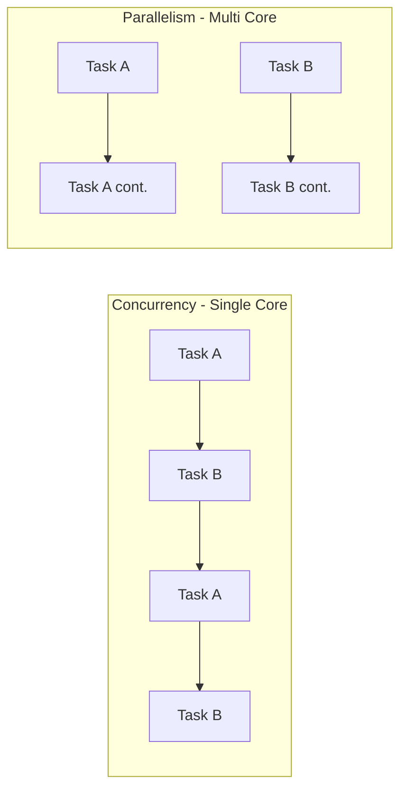
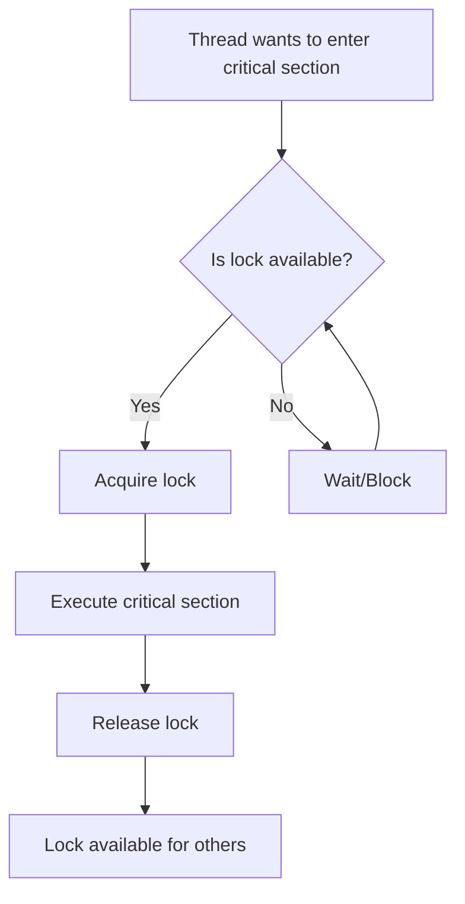
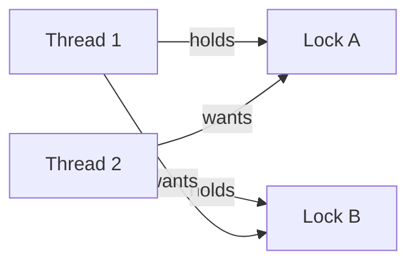
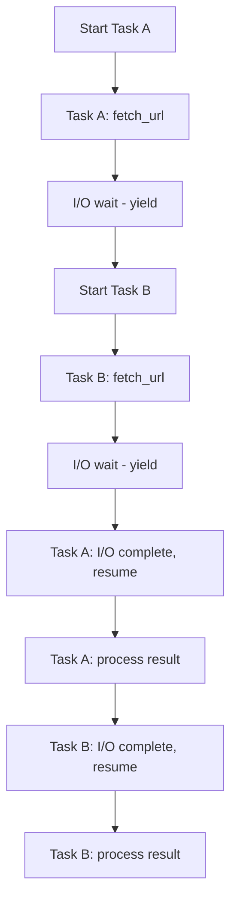

# Concurrency
{: .no_toc }

<details open markdown="block">
  <summary>Table of Contents</summary>
  {: .text-delta }
1. TOC
{:toc}
</details>

---

## What is Concurrency?

Concurrency is the ability of a system to handle multiple tasks at the same time. It's about **dealing with** many things at once, not necessarily **doing** many things at once (that's parallelism).

### Why Concurrency Matters

Modern systems are inherently concurrent:
- A web server handles thousands of simultaneous requests
- A mobile app fetches data while keeping the UI responsive
- A database processes multiple queries from different clients
- A video game updates physics, AI, rendering, and network simultaneously

Without concurrency, your program can only do one thing at a time. A web server that handles one request at a time would be useless.

### Concurrency vs Parallelism

These terms are often confused. Let's clarify with an analogy.

**Concurrency: One cook, multiple dishes**

Imagine a chef cooking three dishes. They don't finish one dish completely before starting another. Instead:
- Start boiling pasta
- While pasta boils, chop vegetables
- Check on pasta, start sauce
- Stir sauce, drain pasta
- Plate everything

One person, appearing to do multiple things by switching between tasks.

**Parallelism: Multiple cooks, multiple dishes**

Now imagine three chefs, each cooking one dish simultaneously. All three dishes are literally being prepared at the same instant.

**In computing:**

| Concept | Definition | Example |
|---------|------------|---------|
| Concurrency | Managing multiple tasks (switching between them) | Single-core CPU running multiple programs |
| Parallelism | Executing multiple tasks simultaneously | Multi-core CPU running multiple programs |

A single CPU core achieves concurrency through **context switching**—rapidly switching between tasks so fast it appears simultaneous.

True parallelism requires multiple CPU cores or processors.



---

## Threads and Processes

### What is a Process?

A process is an independent program execution with its own:
- Memory space (isolated from other processes)
- File descriptors
- Security context
- At least one thread

When you start Chrome, that's a process. Start another Chrome window, that's another process.

**Process isolation:**

Process A cannot read Process B's memory. If Process A crashes, Process B continues running. This isolation is provided by the operating system.

```
Process A Memory: [Program A code] [Program A data] [Program A stack]
Process B Memory: [Program B code] [Program B data] [Program B stack]
                  ↑ Completely separate, protected by OS
```

### What is a Thread?

A thread is a unit of execution within a process. A process can have multiple threads that:
- Share the same memory space
- Share file descriptors
- Have their own stack and registers
- Run concurrently (or in parallel on multi-core)

Think of threads as workers in the same office. They share the office space (memory), can see each other's desks (data), but each has their own to-do list (stack).

```
Process Memory:
├── Code (shared by all threads)
├── Heap (shared by all threads)
├── Thread 1: [stack] [registers]
├── Thread 2: [stack] [registers]
└── Thread 3: [stack] [registers]
```

### Threads vs Processes: Trade-offs

| Aspect | Processes | Threads |
|--------|-----------|---------|
| **Memory** | Isolated | Shared |
| **Creation cost** | High (copy memory) | Low |
| **Communication** | IPC (slow) | Shared memory (fast) |
| **Crash impact** | Independent | Whole process crashes |
| **Security** | Isolated | Can access each other's data |
| **Use case** | Browser tabs, microservices | Web server workers, parallel computation |

**When to use processes:**
- Running untrusted code (sandboxing)
- Crash isolation is critical
- Different security contexts needed
- Multi-language systems

**When to use threads:**
- Tasks need to share data frequently
- Low-latency communication needed
- Memory efficiency matters
- CPU-bound parallel computation

### Creating Threads

**Python (threading):**

```python
import threading
import time

def worker(name):
    print(f"{name} starting")
    time.sleep(2)  # Simulate work
    print(f"{name} done")

# Create threads
thread1 = threading.Thread(target=worker, args=("Thread-1",))
thread2 = threading.Thread(target=worker, args=("Thread-2",))

# Start threads
thread1.start()
thread2.start()

# Wait for completion
thread1.join()
thread2.join()

print("All threads complete")
```

**Java:**

```java
public class Worker implements Runnable {
    private String name;
    
    public Worker(String name) {
        this.name = name;
    }
    
    @Override
    public void run() {
        System.out.println(name + " starting");
        try {
            Thread.sleep(2000);
        } catch (InterruptedException e) {
            Thread.currentThread().interrupt();
        }
        System.out.println(name + " done");
    }
}

// Create and start
Thread t1 = new Thread(new Worker("Thread-1"));
Thread t2 = new Thread(new Worker("Thread-2"));
t1.start();
t2.start();
t1.join();
t2.join();
```

### The Global Interpreter Lock (GIL)

Python's CPython interpreter has a Global Interpreter Lock that prevents multiple threads from executing Python bytecode simultaneously.

**This means:**
- Python threads don't achieve true parallelism for CPU-bound tasks
- Python threads DO help for I/O-bound tasks (network, disk)
- For CPU parallelism in Python, use multiprocessing instead

```python
# I/O bound - threading works great
import threading
import requests

def fetch_url(url):
    response = requests.get(url)
    return len(response.content)

# 10 URLs fetched concurrently (not blocked by GIL during I/O)
threads = [threading.Thread(target=fetch_url, args=(url,)) for url in urls]

# CPU bound - use multiprocessing
from multiprocessing import Pool

def compute_heavy(n):
    return sum(i * i for i in range(n))

with Pool(processes=4) as pool:
    results = pool.map(compute_heavy, [1000000, 2000000, 3000000, 4000000])
```

---

## Synchronization Primitives

When threads share data, chaos can ensue. Synchronization primitives bring order.

### Race Conditions

A race condition occurs when the program's behavior depends on the timing of thread execution.

**Classic example: Counter**

```python
counter = 0

def increment():
    global counter
    for _ in range(100000):
        counter += 1  # NOT atomic!

# Run two threads
thread1 = threading.Thread(target=increment)
thread2 = threading.Thread(target=increment)
thread1.start()
thread2.start()
thread1.join()
thread2.join()

print(counter)  # Expected: 200000, Actual: ~150000 (random each run!)
```

**Why this happens:**

`counter += 1` is not atomic. It's actually three operations:
1. Read counter value
2. Add 1
3. Write back

```
Thread 1: READ counter (0)
Thread 2: READ counter (0)    ← Both read 0
Thread 1: ADD 1 → 1
Thread 2: ADD 1 → 1           ← Both compute 1
Thread 1: WRITE 1
Thread 2: WRITE 1             ← Both write 1, should be 2!
```

This is a **lost update**—Thread 2's increment is lost.

### Mutex (Mutual Exclusion Lock)

A mutex ensures only one thread can access a critical section at a time.

```python
import threading

counter = 0
lock = threading.Lock()

def increment():
    global counter
    for _ in range(100000):
        lock.acquire()    # Block until lock available
        try:
            counter += 1  # Only one thread here at a time
        finally:
            lock.release() # Always release!

# Or use context manager (cleaner)
def increment_clean():
    global counter
    for _ in range(100000):
        with lock:
            counter += 1
```

Now the counter will correctly reach 200000.

**How a mutex works:**



**Mutex properties:**
- Only the thread that acquired the lock can release it
- Only one thread can hold the lock
- Other threads block (sleep) while waiting

### Reentrant Lock (Recursive Mutex)

A reentrant lock can be acquired multiple times by the same thread.

```python
import threading

lock = threading.RLock()  # Reentrant lock

def outer():
    with lock:
        print("Outer acquired lock")
        inner()  # Calling inner while holding lock

def inner():
    with lock:  # Same thread reacquires - OK with RLock
        print("Inner acquired lock")

# With regular Lock, inner() would deadlock!
outer()
```

**When to use:** When you have nested function calls that all need the lock, or recursive functions.

### Semaphore

A semaphore is a counter that allows up to N threads to access a resource.

```python
import threading
import time

# Allow max 3 concurrent connections
semaphore = threading.Semaphore(3)

def access_resource(thread_id):
    print(f"Thread {thread_id} waiting...")
    with semaphore:
        print(f"Thread {thread_id} acquired! ({3 - semaphore._value} using)")
        time.sleep(2)  # Simulate work
        print(f"Thread {thread_id} released")

# Start 10 threads
threads = [threading.Thread(target=access_resource, args=(i,)) for i in range(10)]
for t in threads:
    t.start()
```

**Output:** At most 3 threads access the resource simultaneously.

**Use cases:**
- Connection pools (limit concurrent DB connections)
- Rate limiting (limit requests per second)
- Resource limiting (limit concurrent file operations)

### Read-Write Lock

Allows multiple readers OR a single writer.

```python
import threading

class ReadWriteLock:
    def __init__(self):
        self._readers = 0
        self._readers_lock = threading.Lock()
        self._writer_lock = threading.Lock()
    
    def acquire_read(self):
        with self._readers_lock:
            self._readers += 1
            if self._readers == 1:
                self._writer_lock.acquire()  # Block writers
    
    def release_read(self):
        with self._readers_lock:
            self._readers -= 1
            if self._readers == 0:
                self._writer_lock.release()  # Allow writers
    
    def acquire_write(self):
        self._writer_lock.acquire()
    
    def release_write(self):
        self._writer_lock.release()
```

**When to use:** Read-heavy workloads where writes are rare. Multiple readers can proceed simultaneously.

### Condition Variable

Allows threads to wait for a condition to become true.

```python
import threading
import time

queue = []
condition = threading.Condition()

def producer():
    for i in range(5):
        time.sleep(1)
        with condition:
            queue.append(i)
            print(f"Produced {i}")
            condition.notify()  # Wake up one waiting consumer

def consumer():
    while True:
        with condition:
            while not queue:  # Wait while queue is empty
                condition.wait()  # Releases lock and waits
            item = queue.pop(0)
            print(f"Consumed {item}")

# Start threads
threading.Thread(target=producer).start()
threading.Thread(target=consumer).start()
```

**Key pattern:** Always check condition in a `while` loop, not `if`. This handles spurious wakeups.

---

## Deadlocks

A deadlock occurs when threads are waiting for each other in a cycle, and none can proceed.

### Classic Deadlock Example

```python
lock_a = threading.Lock()
lock_b = threading.Lock()

def thread_1():
    with lock_a:
        print("Thread 1 has lock A")
        time.sleep(0.1)
        with lock_b:  # Waiting for lock B
            print("Thread 1 has both locks")

def thread_2():
    with lock_b:
        print("Thread 2 has lock B")
        time.sleep(0.1)
        with lock_a:  # Waiting for lock A
            print("Thread 2 has both locks")

# DEADLOCK: Thread 1 holds A, wants B. Thread 2 holds B, wants A.
```



### Conditions for Deadlock

All four must be true for a deadlock:

1. **Mutual exclusion:** Resources can't be shared
2. **Hold and wait:** Thread holds resources while waiting for others
3. **No preemption:** Resources can't be forcibly taken
4. **Circular wait:** Circular chain of threads waiting

### Preventing Deadlocks

**Strategy 1: Lock ordering**

Always acquire locks in the same order.

```python
# BAD: Different order in different threads
def thread_1():
    with lock_a:
        with lock_b: ...

def thread_2():
    with lock_b:  # Different order!
        with lock_a: ...

# GOOD: Same order everywhere
def thread_1():
    with lock_a:
        with lock_b: ...

def thread_2():
    with lock_a:  # Same order
        with lock_b: ...
```

**Strategy 2: Lock timeout**

Don't wait forever for a lock.

```python
if lock_a.acquire(timeout=1.0):
    try:
        if lock_b.acquire(timeout=1.0):
            try:
                # Do work
                pass
            finally:
                lock_b.release()
        else:
            # Couldn't get lock_b, handle gracefully
            pass
    finally:
        lock_a.release()
else:
    # Couldn't get lock_a, handle gracefully
    pass
```

**Strategy 3: Try-lock with backoff**

```python
def acquire_both_locks():
    while True:
        if lock_a.acquire(blocking=False):
            if lock_b.acquire(blocking=False):
                return True  # Got both
            else:
                lock_a.release()  # Release A if can't get B
        
        # Wait a random time before retry
        time.sleep(random.uniform(0.001, 0.01))
```

**Strategy 4: Avoid holding locks while doing I/O**

```python
# BAD: Holding lock during network call
with lock:
    data = fetch_from_network()  # Slow! Blocks other threads
    process(data)

# GOOD: Release lock during I/O
with lock:
    params = prepare_request()

data = fetch_from_network(params)  # No lock held

with lock:
    process(data)
```

---

## Common Concurrency Patterns

### Producer-Consumer

One or more producers create work items, one or more consumers process them.

```python
import queue
import threading
import time

work_queue = queue.Queue(maxsize=10)  # Bounded queue

def producer(producer_id):
    for i in range(5):
        item = f"Item-{producer_id}-{i}"
        work_queue.put(item)  # Blocks if queue full
        print(f"Produced: {item}")
        time.sleep(0.1)

def consumer(consumer_id):
    while True:
        try:
            item = work_queue.get(timeout=2)  # Blocks if queue empty
            print(f"Consumer {consumer_id} processing: {item}")
            time.sleep(0.3)  # Simulate processing
            work_queue.task_done()
        except queue.Empty:
            print(f"Consumer {consumer_id} timeout, exiting")
            break

# Start producers and consumers
producers = [threading.Thread(target=producer, args=(i,)) for i in range(2)]
consumers = [threading.Thread(target=consumer, args=(i,)) for i in range(3)]

for p in producers:
    p.start()
for c in consumers:
    c.start()

for p in producers:
    p.join()

work_queue.join()  # Wait until all items processed
```

**Key benefits:**
- Decouples production from consumption
- Smooths out bursts (queue acts as buffer)
- Easy to scale (add more producers or consumers)

### Thread Pool

Reuse a fixed number of threads for many tasks. Creating threads is expensive; pooling avoids that overhead.

```python
from concurrent.futures import ThreadPoolExecutor
import time

def process_item(item):
    time.sleep(0.1)  # Simulate work
    return item * 2

# Create pool with 4 workers
with ThreadPoolExecutor(max_workers=4) as executor:
    items = range(20)
    
    # Submit all tasks
    futures = [executor.submit(process_item, item) for item in items]
    
    # Get results as they complete
    for future in futures:
        result = future.result()
        print(f"Result: {result}")
```

**Why thread pools:**
- Avoid thread creation overhead
- Limit concurrent threads (prevent resource exhaustion)
- Built-in task queuing

### Async/Await (Cooperative Multitasking)

Modern approach to concurrency for I/O-bound tasks. Instead of threads, use a single thread with non-blocking I/O.

```python
import asyncio
import aiohttp

async def fetch_url(session, url):
    async with session.get(url) as response:
        return await response.text()

async def main():
    urls = [
        "https://api.example.com/1",
        "https://api.example.com/2",
        "https://api.example.com/3",
    ]
    
    async with aiohttp.ClientSession() as session:
        # Fetch all URLs concurrently
        tasks = [fetch_url(session, url) for url in urls]
        results = await asyncio.gather(*tasks)
        
        for url, result in zip(urls, results):
            print(f"{url}: {len(result)} bytes")

asyncio.run(main())
```

**How it works:**

1. When a task hits I/O (network, disk), it **yields** control
2. Event loop runs another task while waiting
3. When I/O completes, original task resumes



**Async vs Threads:**

| Aspect | Threads | Async |
|--------|---------|-------|
| Overhead | Higher (kernel threads) | Lower (single thread) |
| Memory | ~1MB per thread | ~1KB per coroutine |
| Scalability | 100s-1000s threads | 10,000s+ coroutines |
| Context switching | OS-controlled | User-controlled |
| CPU-bound | Good (parallelism) | Poor (single thread) |
| Complexity | Race conditions | Simpler (no shared state) |

**Use async for:**
- High-concurrency I/O (web servers, chat)
- Many simultaneous network connections
- When you need 10,000+ concurrent operations

### Actor Model

Encapsulate state in "actors" that communicate only via messages. No shared state = no locks needed.

**Concept:**

```
Actor A                Actor B
┌──────────┐          ┌──────────┐
│ State    │ ◄─────── │ Message  │
│ Behavior │ ───────► │ Queue    │
│ Mailbox  │          │ State    │
└──────────┘          └──────────┘
```

Each actor:
- Has private state
- Has a mailbox (message queue)
- Processes one message at a time
- Can send messages to other actors

**Python example (simplified):**

```python
import queue
import threading

class Actor:
    def __init__(self):
        self.mailbox = queue.Queue()
        self._running = True
        self._thread = threading.Thread(target=self._run)
        self._thread.start()
    
    def send(self, message):
        self.mailbox.put(message)
    
    def receive(self, message):
        raise NotImplementedError
    
    def _run(self):
        while self._running:
            try:
                message = self.mailbox.get(timeout=0.1)
                self.receive(message)
            except queue.Empty:
                continue
    
    def stop(self):
        self._running = False
        self._thread.join()

class Counter(Actor):
    def __init__(self):
        super().__init__()
        self.count = 0
    
    def receive(self, message):
        if message == "increment":
            self.count += 1
        elif message == "get":
            print(f"Count: {self.count}")

# Usage
counter = Counter()
for _ in range(1000):
    counter.send("increment")
counter.send("get")
```

**Frameworks:**
- **Akka** (JVM): Industry-standard actor framework
- **Erlang/Elixir**: Built on actor model
- **Ray** (Python): Actor model for distributed computing

---

## Distributed Concurrency

In distributed systems, concurrency challenges multiply. You can't use local locks when processes are on different machines.

### Distributed Locks

A lock that works across multiple servers.

**Redis-based distributed lock:**

```python
import redis
import time
import uuid

class DistributedLock:
    def __init__(self, redis_client, lock_name, ttl=10):
        self.redis = redis_client
        self.lock_name = lock_name
        self.ttl = ttl
        self.lock_value = str(uuid.uuid4())  # Unique identifier
    
    def acquire(self, timeout=10):
        start = time.time()
        while time.time() - start < timeout:
            # SET if Not eXists, with TTL
            if self.redis.set(self.lock_name, self.lock_value, nx=True, ex=self.ttl):
                return True
            time.sleep(0.1)
        return False
    
    def release(self):
        # Only release if we own the lock (atomic with Lua script)
        script = """
        if redis.call("get", KEYS[1]) == ARGV[1] then
            return redis.call("del", KEYS[1])
        else
            return 0
        end
        """
        self.redis.eval(script, 1, self.lock_name, self.lock_value)

# Usage
lock = DistributedLock(redis_client, "my-resource-lock")
if lock.acquire():
    try:
        # Critical section
        process_resource()
    finally:
        lock.release()
```

**Challenges:**
- **Clock skew:** Different servers have different times
- **Network partitions:** Lock might appear held when holder crashed
- **TTL expiration:** What if holder is slow and TTL expires?

**Solutions:**
- Use **Redlock** algorithm for multiple Redis nodes
- Implement **fencing tokens** to detect stale locks
- Use managed services (AWS DynamoDB locks, GCP Spanner)

### Optimistic Concurrency Control

Instead of locking, detect conflicts at write time.

```python
def update_user_optimistic(user_id, updates):
    # 1. Read current version
    user = db.query("SELECT * FROM users WHERE id = %s", user_id)
    current_version = user['version']
    
    # 2. Apply updates locally
    updated_user = {**user, **updates}
    
    # 3. Write with version check
    result = db.execute("""
        UPDATE users 
        SET name = %s, email = %s, version = version + 1
        WHERE id = %s AND version = %s
    """, (updated_user['name'], updated_user['email'], user_id, current_version))
    
    if result.rowcount == 0:
        # Version mismatch - someone else updated
        raise ConflictError("User was modified, please retry")
    
    return updated_user
```

**When to use:**
- Low contention (conflicts are rare)
- Retries are cheap
- Strong consistency required

### Event Sourcing and CQRS

Instead of updating state directly, append events. Derive current state from event history.

```python
class BankAccount:
    def __init__(self, account_id):
        self.account_id = account_id
        self.events = []
        self.balance = 0
    
    def deposit(self, amount):
        event = {"type": "deposited", "amount": amount, "timestamp": time.time()}
        self.events.append(event)
        self._apply(event)
    
    def withdraw(self, amount):
        if self.balance < amount:
            raise ValueError("Insufficient funds")
        event = {"type": "withdrawn", "amount": amount, "timestamp": time.time()}
        self.events.append(event)
        self._apply(event)
    
    def _apply(self, event):
        if event["type"] == "deposited":
            self.balance += event["amount"]
        elif event["type"] == "withdrawn":
            self.balance -= event["amount"]
    
    def rebuild(self):
        """Rebuild state from events."""
        self.balance = 0
        for event in self.events:
            self._apply(event)
```

**Benefits for concurrency:**
- Append-only (no updates = no conflicts)
- Full audit trail
- Can replay to any point in time
- Easy to scale reads (separate read models)

---

## Performance Considerations

### Amdahl's Law

The speedup from parallelization is limited by the sequential portion of your code.

```
Speedup = 1 / (S + P/N)

Where:
- S = Sequential fraction (can't be parallelized)
- P = Parallel fraction (can be parallelized)
- N = Number of processors
```

**Example:**

If 50% of your code is sequential (S=0.5, P=0.5):
- 2 cores: Speedup = 1 / (0.5 + 0.5/2) = 1.33x
- 4 cores: Speedup = 1 / (0.5 + 0.5/4) = 1.6x
- ∞ cores: Speedup = 1 / 0.5 = 2x max!

**Lesson:** Focus on reducing the sequential portion, not just adding more parallelism.

### Lock Contention

When many threads compete for the same lock, performance degrades.

**Symptoms:**
- Low CPU usage despite many threads
- High context switching
- Poor scalability with more cores

**Solutions:**

1. **Fine-grained locking:** Multiple locks for different data
```python
# Bad: One lock for entire cache
with cache_lock:
    cache[key] = value

# Good: Lock per key or bucket
with cache_locks[key % num_locks]:
    cache[key] = value
```

2. **Lock-free data structures:** Use atomic operations
```python
import atomics  # hypothetical library

counter = atomics.AtomicInt(0)
counter.increment()  # Lock-free atomic increment
```

3. **Copy-on-write:** Each thread gets its own copy
```python
# Instead of modifying shared data
shared_list.append(item)

# Create new version
new_list = shared_list.copy()
new_list.append(item)
shared_list = new_list  # Atomic reference assignment
```

### Thread Count Tuning

**For CPU-bound work:**
```
Optimal threads ≈ Number of CPU cores
```

More threads = more context switching overhead without benefit.

**For I/O-bound work:**
```
Optimal threads ≈ Cores × (1 + Wait time / Compute time)
```

If each request spends 90% waiting for I/O:
- 4 cores × (1 + 0.9/0.1) = 4 × 10 = 40 threads

**Practical approach:** Start with cores×2, benchmark, and adjust.

---

## Interview Tips

### Common Interview Questions

**Q: "What is a race condition? How do you prevent it?"**

*Good answer:*
> "A race condition occurs when multiple threads access shared data and the result depends on execution timing. For example, if two threads increment a counter, they might both read the same value, increment locally, and write back—losing one increment. Prevention strategies include: using locks/mutexes to ensure mutual exclusion, using atomic operations, avoiding shared mutable state altogether, or using immutable data structures."

**Q: "Explain deadlock and how to prevent it."**

*Good answer:*
> "A deadlock is when two or more threads are blocked forever, each waiting for a resource held by another. Four conditions must all be true: mutual exclusion, hold and wait, no preemption, and circular wait. To prevent deadlock, I'd break one of these conditions—most commonly by enforcing a global lock ordering so all threads acquire locks in the same order, eliminating circular wait. Other approaches include timeouts, try-lock with backoff, or avoiding holding multiple locks."

**Q: "When would you use async/await vs threads?"**

*Good answer:*
> "I'd use async/await for I/O-bound workloads with high concurrency—like a web server handling thousands of connections or a crawler fetching many URLs. Async is more lightweight, with lower overhead per task. I'd use threads for CPU-bound work that benefits from parallelism, or when integrating with blocking libraries that don't support async. In Python specifically, threading is limited by the GIL for CPU work, so I'd use multiprocessing there."

**Q: "How would you implement a rate limiter?"**

*Good answer:*
> "For single-server rate limiting, I'd use a token bucket algorithm with a thread-safe counter and timestamp. Each request consumes a token; tokens refill at a fixed rate. For distributed rate limiting, I'd use Redis with an atomic Lua script that checks and updates the counter in one operation. The key would be the user ID or IP, with a TTL matching the rate limit window."

---

## Summary

| Concept | Key Takeaway |
|---------|--------------|
| **Concurrency vs Parallelism** | Concurrency = dealing with many things, Parallelism = doing many things |
| **Threads vs Processes** | Threads share memory (fast, risky), Processes are isolated (safe, slower IPC) |
| **Race Conditions** | Shared mutable state + concurrent access = bugs |
| **Mutex** | Ensures only one thread in critical section |
| **Semaphore** | Allows N threads to access a resource |
| **Deadlock** | Circular wait for locks. Prevent with ordering or timeouts |
| **Producer-Consumer** | Decouple work creation from processing |
| **Thread Pool** | Reuse threads, limit concurrency |
| **Async/Await** | Single thread, non-blocking I/O, scales to 10,000s |
| **Distributed Locks** | Coordinate across servers (Redis, ZooKeeper) |
