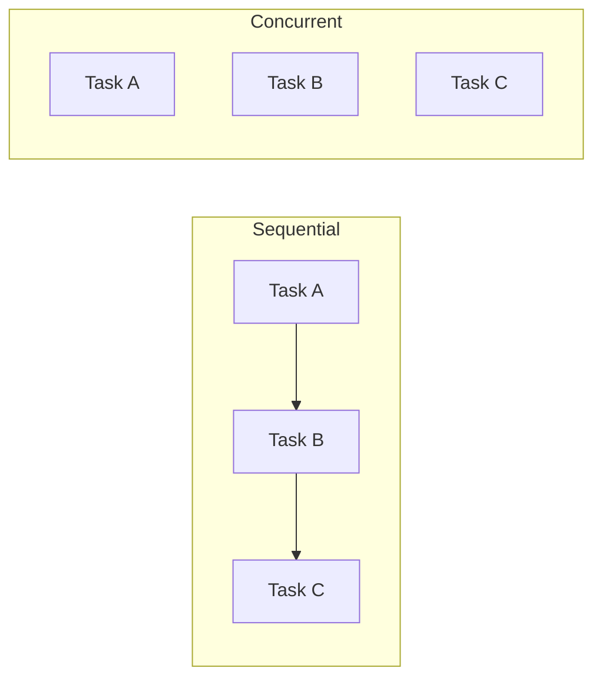
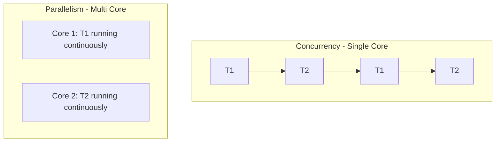
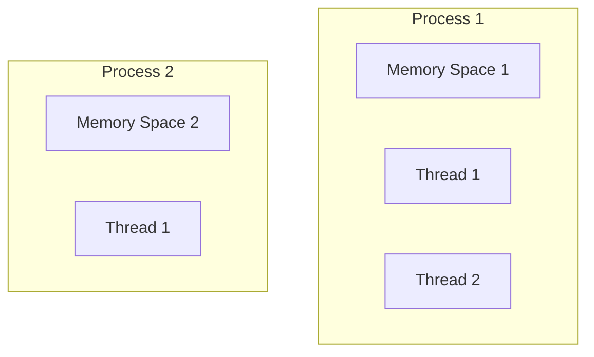
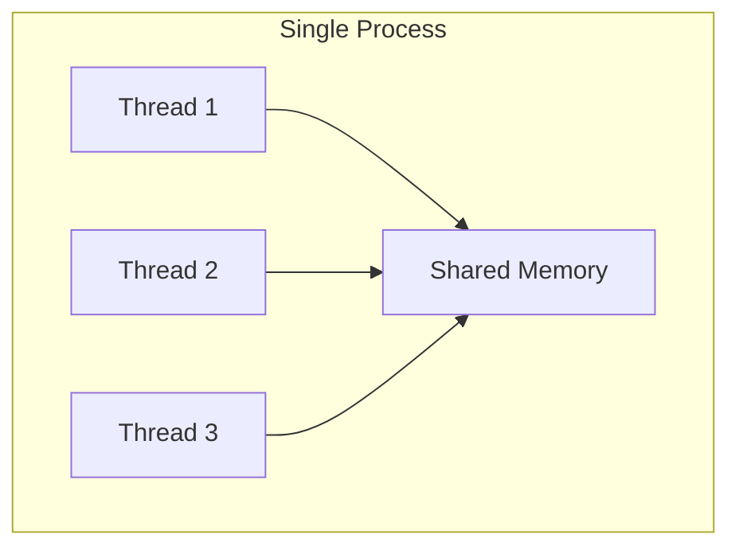
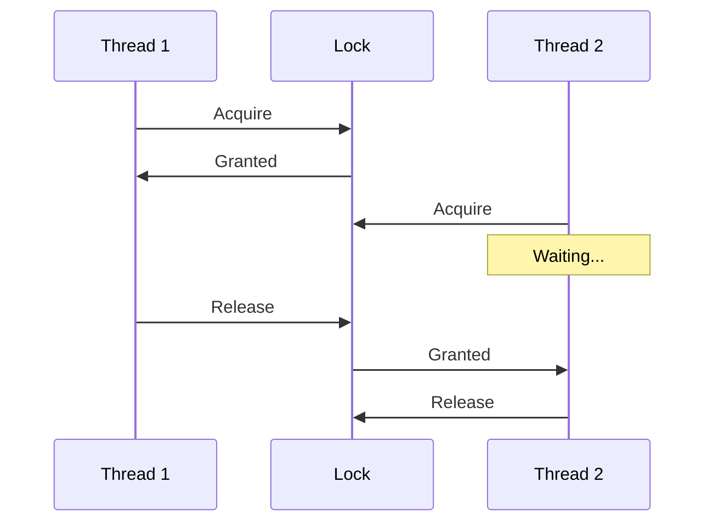
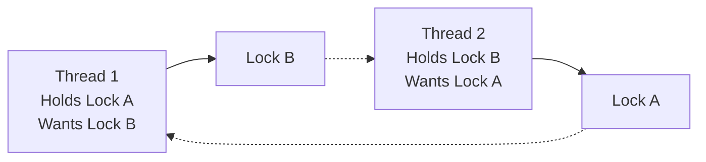
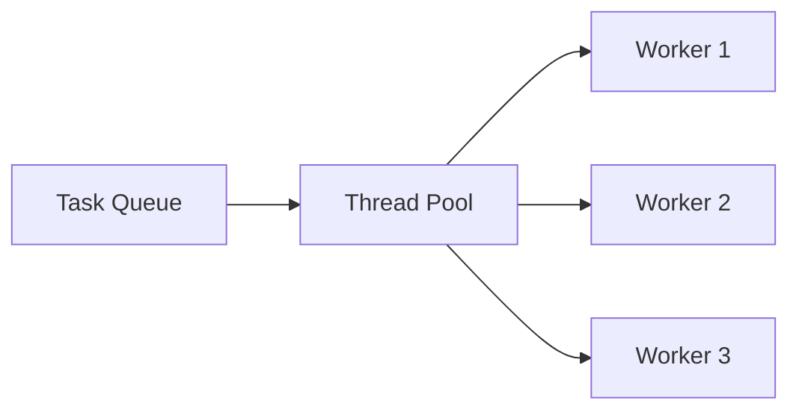
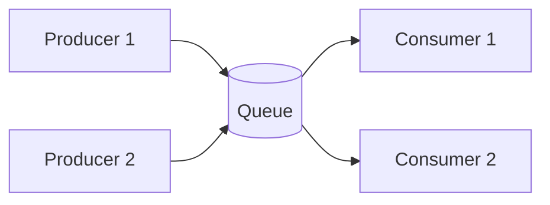
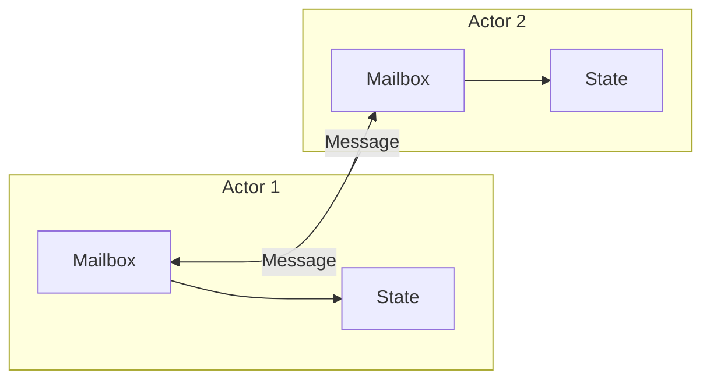
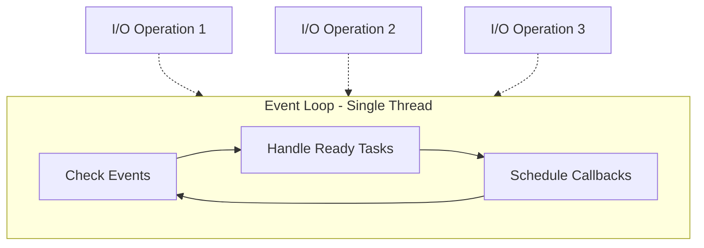

# Concurrency
{: .no_toc }

<details open markdown="block">
  <summary>Table of Contents</summary>
  {: .text-delta }
1. TOC
{:toc}
</details>

---

## 🎯 What is Concurrency?

**Concurrency** is about dealing with multiple things at once. It's essential for:

- Handling many users simultaneously
- Keeping UIs responsive while doing background work
- Maximizing CPU/resource utilization
- Processing independent tasks in parallel



---

## Concurrency vs Parallelism

| Concept | Definition | Example |
|---------|------------|---------|
| **Concurrency** | Dealing with multiple tasks (may not run simultaneously) | One chef switching between dishes |
| **Parallelism** | Running multiple tasks at the exact same time | Multiple chefs cooking simultaneously |



{: .note }
> Concurrency is about structure; parallelism is about execution. You can have concurrency without parallelism.

---

## Processes vs Threads

### Processes

Independent programs with their own memory space.



| Feature | Process |
|---------|---------|
| **Memory** | Isolated, own address space |
| **Communication** | IPC (pipes, sockets, shared memory) |
| **Creation cost** | High |
| **Crash impact** | Only affects that process |

### Threads

Lightweight units of execution within a process, sharing memory.



| Feature | Thread |
|---------|--------|
| **Memory** | Shared with other threads |
| **Communication** | Direct (shared memory) |
| **Creation cost** | Low |
| **Crash impact** | Can crash entire process |

### When to Use Each

| Use Case | Choice |
|----------|--------|
| **Isolation needed** | Processes |
| **High performance shared data** | Threads |
| **Web server handling requests** | Thread pool or async |
| **Running untrusted code** | Processes (sandboxing) |

---

## Synchronization Primitives

When threads share data, we need to prevent conflicts.

### The Problem: Race Conditions

```python
# Two threads incrementing a counter
counter = 0

def increment():
    global counter
    temp = counter      # Thread 1: reads 0
                        # Thread 2: reads 0
    temp = temp + 1     # Thread 1: temp = 1
                        # Thread 2: temp = 1
    counter = temp      # Thread 1: writes 1
                        # Thread 2: writes 1
    # Expected: 2, Actual: 1 😱
```

### Mutex (Mutual Exclusion Lock)

Only one thread can hold the lock at a time.

```python
from threading import Lock

counter = 0
lock = Lock()

def increment():
    global counter
    with lock:  # Acquire lock
        counter += 1  # Only one thread here at a time
    # Lock automatically released
```



### Semaphore

Like a mutex, but allows N threads to hold it simultaneously.

```python
from threading import Semaphore

# Allow 3 concurrent database connections
db_semaphore = Semaphore(3)

def query_database():
    with db_semaphore:
        # At most 3 threads here simultaneously
        execute_query()
```

| Mutex | Semaphore |
|-------|-----------|
| Binary (1 holder) | Counting (N holders) |
| Exclusive access | Limited concurrent access |
| Lock/Unlock | Wait/Signal |

### Read-Write Lock

Multiple readers OR one writer.

```python
# Many threads can read simultaneously
# Only one thread can write (and no readers during write)

rw_lock = ReadWriteLock()

def read_data():
    with rw_lock.read():
        return data  # Multiple readers OK

def write_data(new_value):
    with rw_lock.write():
        data = new_value  # Exclusive access
```

**Use when:** Reads are frequent, writes are rare.

### Condition Variables

Wait for a condition, then proceed.

```python
from threading import Condition

queue = []
condition = Condition()

def producer():
    with condition:
        queue.append(item)
        condition.notify()  # Wake up a waiting consumer

def consumer():
    with condition:
        while not queue:
            condition.wait()  # Sleep until notified
        return queue.pop(0)
```

---

## Common Concurrency Problems

### 1. Deadlock

Two or more threads waiting for each other forever.



```python
# Thread 1
lock_a.acquire()
lock_b.acquire()  # Waits forever if Thread 2 has it

# Thread 2
lock_b.acquire()
lock_a.acquire()  # Waits forever if Thread 1 has it
```

**Prevention:**
1. **Lock ordering** - Always acquire locks in the same order
2. **Timeout** - Give up after waiting too long
3. **Try-lock** - Non-blocking acquire attempt

### 2. Livelock

Threads keep responding to each other but make no progress.

```
Thread 1: "After you!"
Thread 2: "No, after you!"
Thread 1: "I insist, after you!"
... forever
```

**Solution:** Add randomness or backoff.

### 3. Starvation

A thread never gets resources because others keep taking them.

```
High-priority thread 1: Gets CPU
High-priority thread 2: Gets CPU
Low-priority thread: Never runs 😢
```

**Solution:** Fair scheduling, priority inheritance.

### 4. Priority Inversion

Low-priority thread holds a lock that high-priority thread needs.

```
High-priority thread: Wants lock (waits)
Medium-priority thread: Runs (preempts low-priority)
Low-priority thread: Can't release lock (never runs)
```

**Solution:** Priority inheritance - temporarily boost low-priority thread.

---

## Concurrency Patterns

### 1. Thread Pool

Reuse a fixed set of threads for many tasks.



```python
from concurrent.futures import ThreadPoolExecutor

with ThreadPoolExecutor(max_workers=4) as executor:
    futures = [executor.submit(process, item) for item in items]
    results = [f.result() for f in futures]
```

**Benefits:**
- No thread creation overhead per task
- Bounded resource usage
- Work queue handles bursts

### 2. Producer-Consumer

Producers add to a queue, consumers process from it.



```python
from queue import Queue
from threading import Thread

work_queue = Queue(maxsize=100)

def producer():
    while True:
        item = generate_item()
        work_queue.put(item)  # Blocks if full

def consumer():
    while True:
        item = work_queue.get()  # Blocks if empty
        process(item)
        work_queue.task_done()
```

**Use case:** Decoupling work generation from processing.

### 3. Actor Model

Each actor has:
- Private state (no sharing!)
- Mailbox for messages
- Processes messages one at a time



**Benefits:**
- No shared state = no locks
- Location transparent (works across networks)
- Fault tolerant (actors can restart)

**Implementations:** Erlang, Akka (Java/Scala)

### 4. Futures/Promises

Placeholder for a result that will be available later.

```python
import asyncio

async def fetch_user(user_id):
    # Non-blocking I/O
    return await database.get(user_id)

async def main():
    # Start all fetches concurrently
    tasks = [fetch_user(id) for id in user_ids]
    users = await asyncio.gather(*tasks)
```

---

## Async/Await (Event Loop)

Handle many I/O operations with a single thread.



### Threads vs Async

| Aspect | Threads | Async |
|--------|---------|-------|
| **Overhead** | Higher (memory, context switch) | Lower |
| **Concurrency** | Limited by thread count | Can handle 10,000s |
| **Complexity** | Race conditions, locks | Callback/async patterns |
| **CPU-bound work** | Good | Poor (blocks event loop) |
| **I/O-bound work** | OK | Excellent |

### When to Use Async

| Use Case | Threads | Async |
|----------|---------|-------|
| **Web server** | Thread per request | ✅ async handler |
| **Database queries** | Thread pool | ✅ async driver |
| **CPU computation** | ✅ multiprocessing | ❌ |
| **File I/O** | Either | ✅ with async I/O |

---

## Distributed Concurrency

Concurrency across multiple machines adds new challenges.

### Distributed Locks

When you need to coordinate across services.

```python
# Using Redis for distributed locking
def acquire_lock(lock_name, timeout=10):
    return redis.set(lock_name, "locked", nx=True, ex=timeout)

def release_lock(lock_name):
    redis.delete(lock_name)

# Usage
if acquire_lock("process_order_123"):
    try:
        process_order(123)
    finally:
        release_lock("process_order_123")
```

**Tools:**
- Redis (SETNX, Redlock)
- ZooKeeper
- etcd

### Idempotency

Operations that can be safely repeated.

```python
# Non-idempotent (dangerous to retry)
def charge_card(amount):
    payment_gateway.charge(amount)  # Double charge on retry!

# Idempotent (safe to retry)
def charge_card(idempotency_key, amount):
    if already_processed(idempotency_key):
        return get_previous_result(idempotency_key)
    result = payment_gateway.charge(amount)
    store_result(idempotency_key, result)
    return result
```

### Optimistic vs Pessimistic Locking

| Type | How It Works | Best For |
|------|--------------|----------|
| **Pessimistic** | Lock before reading | High contention |
| **Optimistic** | Check version at write time | Low contention |

```python
# Pessimistic: Lock early
with distributed_lock("resource"):
    read_and_modify()

# Optimistic: Check version
def update(id, new_value):
    old = db.get(id)
    if db.update(id, new_value, expected_version=old.version):
        return  # Success
    else:
        raise ConcurrencyError("Someone else modified it!")
```

---

## Interview Tips

### Common Questions

1. **"How do you handle concurrent requests to the same resource?"**
   - Depends on consistency requirements
   - Optimistic locking for low contention
   - Pessimistic locking for high contention
   - Or design for eventual consistency

2. **"What's a deadlock and how do you prevent it?"**
   - Circular wait between threads
   - Prevention: lock ordering, timeouts

3. **"Thread pool vs creating new threads?"**
   - Pool: reuse, bounded resources, handles bursts
   - New threads: simple, but expensive at scale

### Red Flags

- Ignoring race conditions
- Not considering distributed concurrency
- Using locks everywhere (over-synchronization)
- Not making operations idempotent

---

## Quick Reference

```
PRIMITIVES
├── Mutex         → One thread at a time
├── Semaphore     → N threads at a time
├── RW Lock       → Many readers OR one writer
└── Condition Var → Wait for condition

PROBLEMS
├── Race Condition → Unprotected shared state
├── Deadlock       → Circular wait
├── Livelock       → Active but no progress
└── Starvation     → Thread never gets resources

PATTERNS
├── Thread Pool     → Reuse fixed threads
├── Producer-Consumer → Queue between stages
├── Actor Model     → Message passing, no sharing
└── Async/Await     → Event loop for I/O

DISTRIBUTED
├── Distributed Lock → Redis, ZooKeeper
├── Idempotency      → Safe to retry
├── Optimistic Lock  → Version check at write
└── Pessimistic Lock → Lock before read
```

---

## Summary

| Concept | Key Point |
|---------|-----------|
| **Process vs Thread** | Processes isolated, threads share memory |
| **Race condition** | Shared state + no synchronization |
| **Mutex** | Exclusive access to shared resource |
| **Deadlock** | Circular dependency on locks |
| **Thread pool** | Reuse threads, bound resources |
| **Async I/O** | Single thread handles many I/O operations |
| **Idempotency** | Safe to retry operations |

