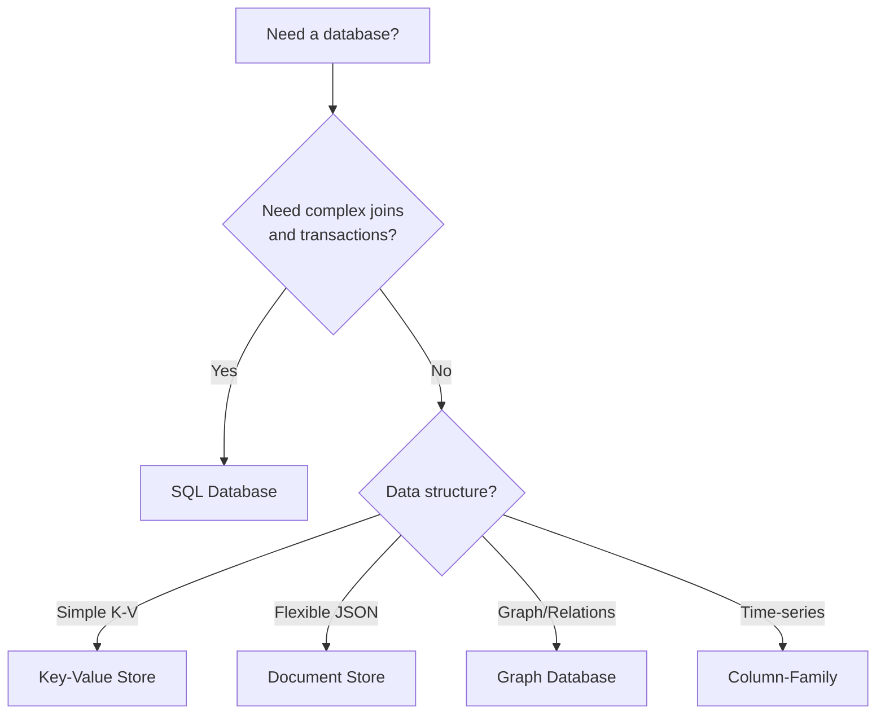
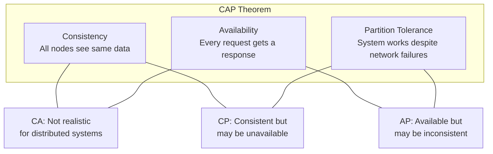
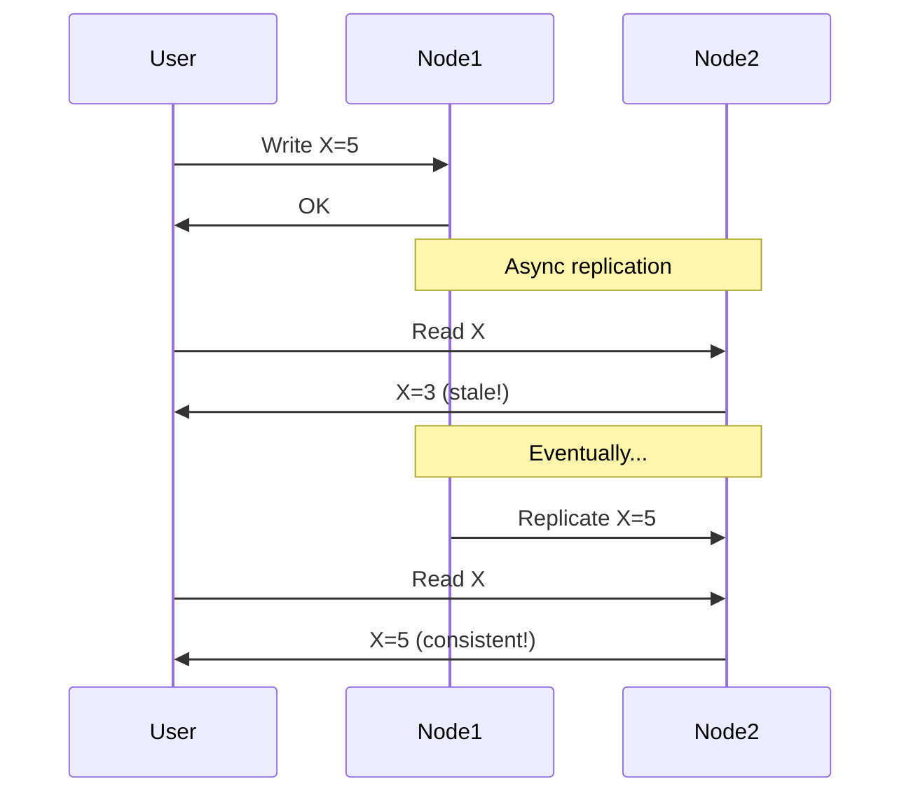
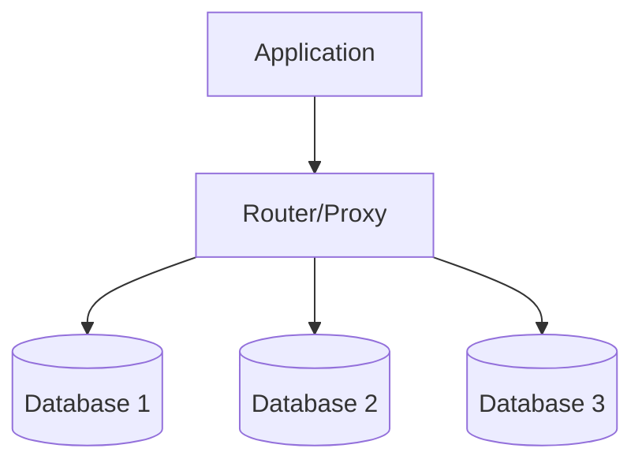
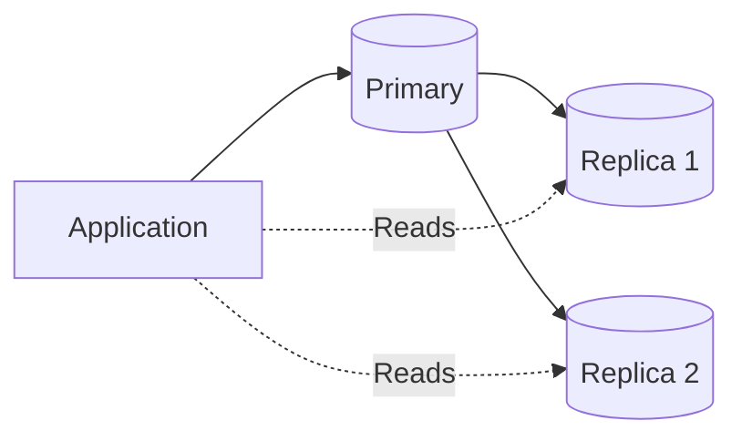
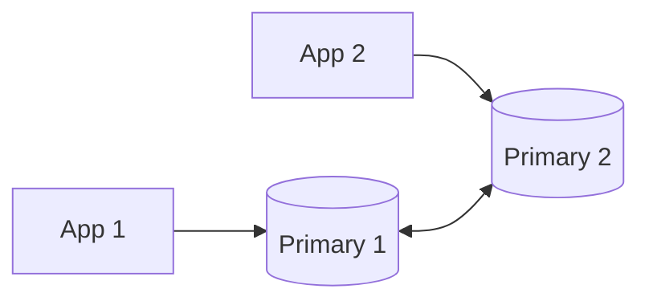
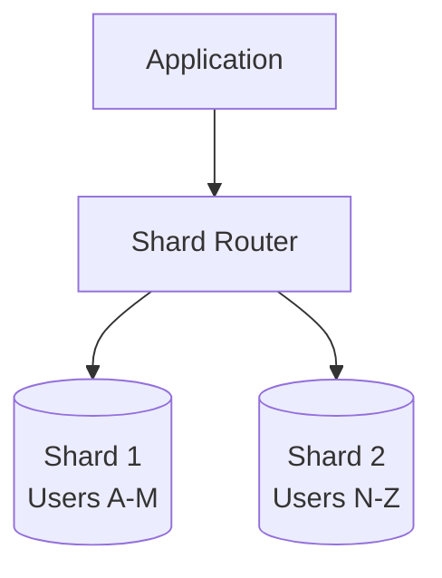
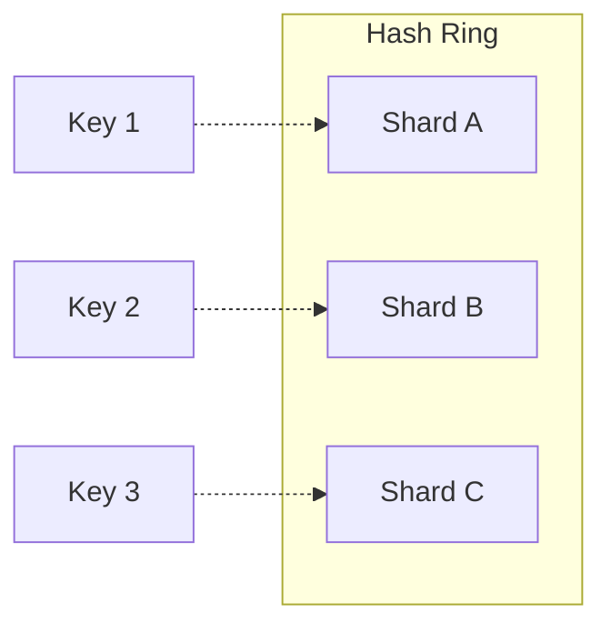
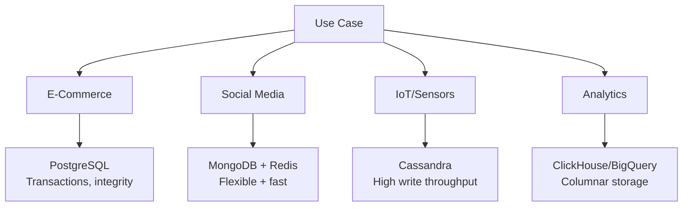

# Databases
{: .no_toc }

<details open markdown="block">
  <summary>Table of Contents</summary>
  {: .text-delta }
1. TOC
{:toc}
</details>

---

## 🎯 What You Need to Know

In system design interviews, you'll constantly make database decisions:
- SQL or NoSQL?
- How to scale?
- What consistency guarantees?

This guide covers everything you need to answer these questions confidently.

---

## SQL vs NoSQL

### SQL (Relational) Databases

Data organized in **tables** with **rows** and **columns**, linked by relationships.

```sql
-- Users table
| id  | name    | email           |
|-----|---------|-----------------|
| 1   | Alice   | alice@email.com |
| 2   | Bob     | bob@email.com   |

-- Orders table (relates to Users via user_id)
| id  | user_id | product  | amount |
|-----|---------|----------|--------|
| 101 | 1       | Widget   | 29.99  |
| 102 | 1       | Gadget   | 49.99  |
```

**Popular options:** PostgreSQL, MySQL, Oracle, SQL Server

### NoSQL Databases

"Not Only SQL" - various data models for different use cases.

| Type | Structure | Example | Use Case |
|------|-----------|---------|----------|
| **Key-Value** | Key → Value | Redis, DynamoDB | Caching, sessions |
| **Document** | JSON-like documents | MongoDB, Firestore | Flexible schemas |
| **Column-Family** | Column-oriented | Cassandra, HBase | Time-series, analytics |
| **Graph** | Nodes + Edges | Neo4j, Neptune | Social networks, recommendations |

### When to Use Each



| Choose SQL When | Choose NoSQL When |
|-----------------|-------------------|
| Complex relationships | Simple key-value lookups |
| ACID transactions required | Flexible/evolving schema |
| Complex queries (JOINs) | Massive scale needed |
| Data integrity is critical | High write throughput |
| Reporting/analytics | Denormalized data is OK |

---

## ACID Properties

SQL databases guarantee ACID properties for transactions:

### Atomicity
**All or nothing.** If any part of a transaction fails, the entire transaction is rolled back.

```sql
BEGIN TRANSACTION;
  UPDATE accounts SET balance = balance - 100 WHERE id = 1;
  UPDATE accounts SET balance = balance + 100 WHERE id = 2;
COMMIT;
-- If either UPDATE fails, BOTH are rolled back
```

### Consistency
**Database always moves from one valid state to another.** Constraints are never violated.

```sql
-- Constraint: balance >= 0
-- This will fail if it would make balance negative
UPDATE accounts SET balance = balance - 1000 WHERE id = 1;
```

### Isolation
**Concurrent transactions don't interfere.** Each transaction sees a consistent snapshot.

```
Transaction 1: Read balance = $100
Transaction 2: Read balance = $100
Transaction 1: Withdraw $100, balance = $0
Transaction 2: Withdraw $100... 
               ↑ Without isolation, this would succeed (bad!)
               With isolation, it sees the update and fails
```

### Durability
**Committed transactions survive crashes.** Data is written to disk.

{: .tip }
> When an interviewer asks about "consistency requirements," they often mean ACID. Know these properties cold.

---

## CAP Theorem

In a distributed system, you can only have **two of three** guarantees:



### The Trade-off

| Choice | Behavior During Network Partition | Example |
|--------|-----------------------------------|---------|
| **CP** | Reject requests to stay consistent | MongoDB (with majority write concern) |
| **AP** | Serve requests with possibly stale data | Cassandra, DynamoDB |

{: .warning }
> In practice, **P is mandatory** for distributed systems. The real choice is between C and A.

### Real-World Examples

| Database | CAP Choice | Why |
|----------|------------|-----|
| PostgreSQL (single node) | CA | No partition = no trade-off |
| MongoDB | CP | Prioritizes consistency |
| Cassandra | AP | Prioritizes availability |
| DynamoDB | Configurable | You choose per-operation |

---

## BASE Properties

NoSQL databases often follow BASE instead of ACID:

| Property | Meaning |
|----------|---------|
| **Basically Available** | System always responds (might be stale) |
| **Soft State** | State may change over time (even without input) |
| **Eventually Consistent** | Given enough time, all nodes converge |



---

## Database Scaling

### Vertical Scaling (Scale Up)

Add more power to a single machine: more CPU, RAM, faster disks.

| Pros | Cons |
|------|------|
| Simple | Hardware limits |
| No code changes | Expensive at high end |
| ACID preserved | Single point of failure |

**Limit:** ~128 cores, 4TB RAM (then you need horizontal scaling)

### Horizontal Scaling (Scale Out)

Add more machines and distribute data.



---

## Replication

Copy data to multiple nodes for **availability** and **read performance**.

### Master-Slave (Primary-Replica)



| Pros | Cons |
|------|------|
| Read scaling | Write bottleneck at primary |
| High availability | Replication lag |
| Simple | Failover complexity |

**Replication lag:** Replicas may be slightly behind the primary.

```
Primary: User updated at 10:00:00.000
Replica: User updated at 10:00:00.050 (50ms lag)

Problem: User writes, then immediately reads from replica → sees old data
Solution: Read-your-writes consistency (route user's reads to primary after writes)
```

### Master-Master (Multi-Primary)

Multiple nodes can accept writes.



| Pros | Cons |
|------|------|
| Write scaling | Conflict resolution needed |
| Geographic distribution | Complex |
| No single point of failure | Harder to maintain consistency |

**Conflict resolution:**
- Last-write-wins (simple, may lose data)
- Application-level merge (complex)
- CRDTs (Conflict-free Replicated Data Types)

---

## Sharding (Partitioning)

Split data across multiple databases. Each shard holds a subset of data.



### Sharding Strategies

#### 1. Range-Based Sharding

```
Shard 1: user_id 1-1,000,000
Shard 2: user_id 1,000,001-2,000,000
Shard 3: user_id 2,000,001-3,000,000
```

| Pros | Cons |
|------|------|
| Range queries efficient | Hot spots possible |
| Simple to understand | Uneven distribution |

#### 2. Hash-Based Sharding

```python
shard = hash(user_id) % num_shards
```

| Pros | Cons |
|------|------|
| Even distribution | Range queries span all shards |
| No hot spots | Adding shards = reshuffling |

#### 3. Directory-Based Sharding

A lookup service maps keys to shards.

| Pros | Cons |
|------|------|
| Flexible | Lookup service is bottleneck |
| Easy resharding | Extra network hop |

### Consistent Hashing

Minimizes data movement when adding/removing shards.



When Shard B is removed, only keys on B move to C. Keys on A and C don't move.

### Sharding Challenges

| Challenge | Description | Solution |
|-----------|-------------|----------|
| **Cross-shard queries** | JOINs across shards are slow | Denormalize or avoid |
| **Transactions** | Can't do ACID across shards easily | Use sagas or 2PC |
| **Resharding** | Adding shards moves data | Consistent hashing |
| **Hot shards** | Uneven traffic (celebrity problem) | Further split hot shards |

{: .warning }
> Sharding adds significant complexity. Only shard when you've exhausted other options (caching, read replicas, query optimization).

---

## Indexing

Indexes speed up reads at the cost of slower writes.

### How Indexes Work

Without index: Scan every row (O(n))
With index: Jump directly to matching rows (O(log n))

```sql
-- Without index: Full table scan
SELECT * FROM users WHERE email = 'alice@email.com';
-- Scans all 1 million rows 😱

-- With index: Direct lookup
CREATE INDEX idx_email ON users(email);
SELECT * FROM users WHERE email = 'alice@email.com';
-- Finds it instantly ⚡
```

### Types of Indexes

| Type | Use Case |
|------|----------|
| **B-Tree** | Range queries, equality (most common) |
| **Hash** | Exact match only |
| **Full-text** | Text search |
| **Geospatial** | Location queries |

### Index Trade-offs

| Pros | Cons |
|------|------|
| Fast reads | Slower writes (must update index) |
| Sorted data access | Storage overhead |
| Unique constraints | Over-indexing hurts performance |

{: .tip }
> Index columns you frequently filter or sort by. Don't index everything!

---

## Transactions and Isolation Levels

### Isolation Levels (from least to most strict)

| Level | Dirty Read | Non-Repeatable Read | Phantom Read | Use Case |
|-------|------------|---------------------|--------------|----------|
| **Read Uncommitted** | ✓ | ✓ | ✓ | Never use this |
| **Read Committed** | ✗ | ✓ | ✓ | Default in most DBs |
| **Repeatable Read** | ✗ | ✗ | ✓ | MySQL default |
| **Serializable** | ✗ | ✗ | ✗ | When correctness is critical |

### Common Anomalies

**Dirty Read:** Reading uncommitted data from another transaction.

**Non-Repeatable Read:** Same query returns different results within a transaction.

**Phantom Read:** New rows appear between queries in same transaction.

---

## Database Selection Guide

### Quick Decision Matrix

| Requirement | Recommendation |
|-------------|----------------|
| Complex relationships | PostgreSQL |
| High write throughput | Cassandra |
| Flexible schema | MongoDB |
| Key-value with persistence | Redis |
| Graph relationships | Neo4j |
| Time-series data | TimescaleDB, InfluxDB |
| Full-text search | Elasticsearch |
| OLAP/Analytics | ClickHouse, BigQuery |

### By Use Case



---

## Interview Tips

### Common Questions

1. **"SQL or NoSQL for this system?"**
   - Consider: schema flexibility, query complexity, scale, consistency needs

2. **"How would you scale this database?"**
   - Start with: caching → read replicas → sharding

3. **"What happens if the database goes down?"**
   - Discuss: replication, failover, data durability

### Strong Answer Structure

```
1. Clarify requirements (consistency, scale, query patterns)
2. Choose database type with justification
3. Design schema/data model
4. Explain scaling strategy
5. Address failure scenarios
```

### Red Flags to Avoid

- "Just use MongoDB for everything"
- Ignoring consistency requirements
- Sharding when you don't need it
- Not considering index design

---

## Quick Reference

```
DATABASE TYPES
├── SQL (PostgreSQL, MySQL)  → Complex queries, ACID
├── Key-Value (Redis)        → Simple, fast lookups
├── Document (MongoDB)       → Flexible JSON documents
├── Column (Cassandra)       → High write throughput
└── Graph (Neo4j)            → Relationship queries

ACID vs BASE
├── ACID → Strong consistency, transactions
└── BASE → Eventual consistency, availability

SCALING
├── Vertical   → Bigger machine
├── Replication → Copy data for reads
└── Sharding   → Split data across machines

SHARDING STRATEGIES
├── Range-based  → Sequential data
├── Hash-based   → Even distribution
└── Directory    → Flexible mapping

CONSISTENCY LEVELS
├── Strong     → All reads see latest write
├── Eventual   → Reads may be stale temporarily
└── Causal     → Related operations in order
```

---

## Summary

| Concept | Key Point |
|---------|-----------|
| **SQL vs NoSQL** | SQL for complex queries/ACID, NoSQL for scale/flexibility |
| **ACID** | Atomicity, Consistency, Isolation, Durability |
| **CAP** | Choose Consistency or Availability during partitions |
| **Replication** | Copies for availability and read scaling |
| **Sharding** | Split data for write scaling (last resort) |
| **Indexing** | Speed up reads, slow down writes |

