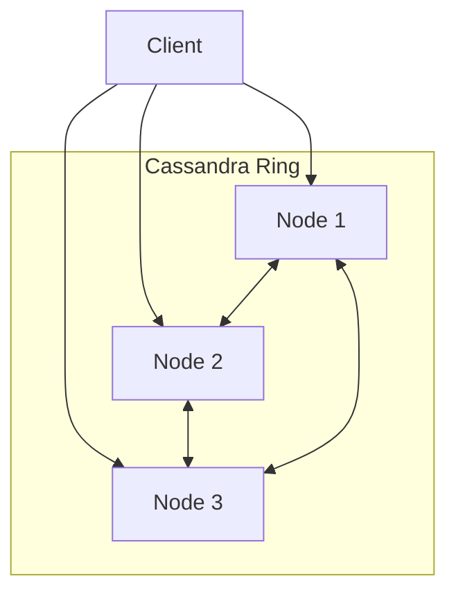
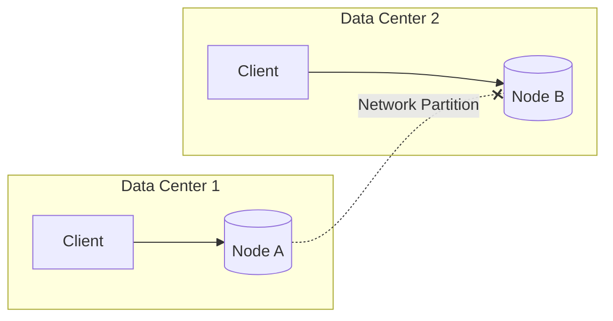
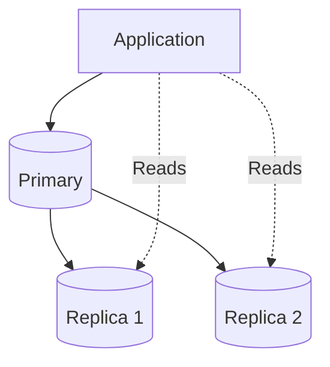
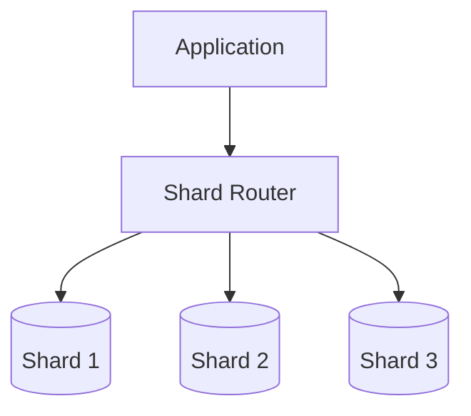
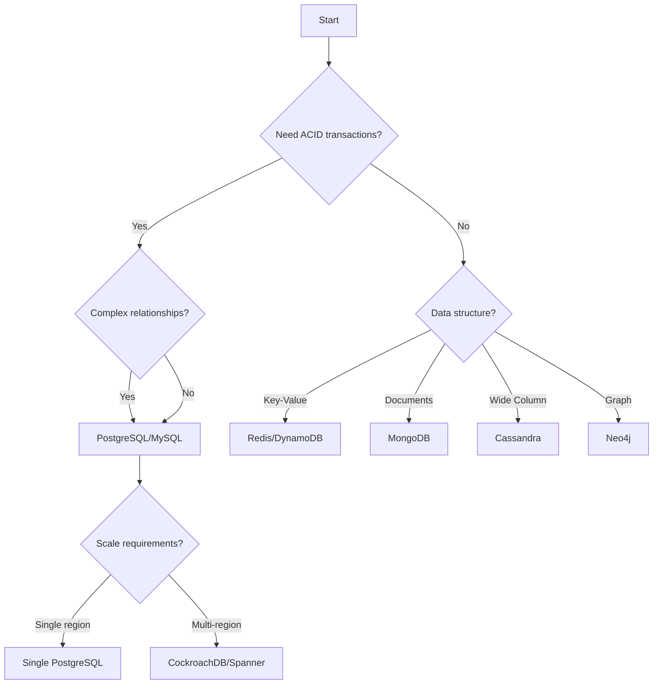

# Databases
{: .no_toc }

<details open markdown="block">
  <summary>Table of Contents</summary>
  {: .text-delta }
1. TOC
{:toc}
</details>

---

## What is a Database?

A database is an organized collection of data stored electronically. But more importantly, it's a system that allows you to efficiently store, retrieve, update, and delete data while maintaining integrity and handling concurrent access.

In system design, choosing the right database is one of the most critical decisions you'll make. The wrong choice can lead to scalability nightmares, data corruption, or performance bottlenecks that are extremely difficult to fix later.

### Why Database Choice Matters

Consider two scenarios:

**Scenario 1: Social Media Feed**
- Billions of posts per day
- Complex relationships (followers, likes, comments)
- Read-heavy (100 reads per 1 write)
- Eventual consistency acceptable

**Scenario 2: Banking System**
- Thousands of transactions per day
- Simple data model (accounts, transactions)
- Write-heavy with strict ordering
- ACID compliance mandatory

These scenarios require fundamentally different database architectures. Using a banking system's database design for social media would collapse under load. Using a social media database for banking could lose or corrupt financial transactions.

---

## Relational Databases (SQL)

Relational databases store data in tables with rows and columns, connected by relationships. They've been the backbone of enterprise applications for 40+ years.

### How Relational Databases Work

**Tables (Relations):**
Each table represents an entity type. Columns define attributes, rows are individual records.

```
users table:
+----+----------+-------------------+------------+
| id | name     | email             | created_at |
+----+----------+-------------------+------------+
| 1  | Alice    | alice@example.com | 2024-01-15 |
| 2  | Bob      | bob@example.com   | 2024-01-16 |
| 3  | Charlie  | charlie@ex.com    | 2024-01-17 |
+----+----------+-------------------+------------+

orders table:
+----+---------+--------+------------+
| id | user_id | amount | status     |
+----+---------+--------+------------+
| 1  | 1       | 99.99  | completed  |
| 2  | 1       | 149.99 | pending    |
| 3  | 2       | 29.99  | completed  |
+----+---------+--------+------------+
```

**Relationships:**
The `user_id` in orders references `id` in users. This is a foreign key relationship.

```sql
-- Get all orders for Alice
SELECT orders.* 
FROM orders 
JOIN users ON orders.user_id = users.id 
WHERE users.name = 'Alice';
```

### Schema: The Blueprint

A schema defines the structure of your data before you store it. This is called **schema-on-write**.

```sql
CREATE TABLE users (
    id SERIAL PRIMARY KEY,
    name VARCHAR(100) NOT NULL,
    email VARCHAR(255) UNIQUE NOT NULL,
    created_at TIMESTAMP DEFAULT CURRENT_TIMESTAMP
);

CREATE TABLE orders (
    id SERIAL PRIMARY KEY,
    user_id INTEGER REFERENCES users(id),
    amount DECIMAL(10,2) NOT NULL,
    status VARCHAR(20) DEFAULT 'pending',
    CHECK (status IN ('pending', 'completed', 'cancelled'))
);
```

**Advantages of strict schema:**
- Data integrity: Can't insert invalid data
- Query optimization: Database knows data types in advance
- Documentation: Schema serves as data documentation
- Tooling: ORMs and code generators work well

**Disadvantages:**
- Schema changes require migrations (can be complex for large tables)
- Less flexible for evolving data models
- All rows must conform to same structure

### ACID Properties

ACID is the set of guarantees that relational databases provide. Understanding ACID is crucial for system design interviews.

#### Atomicity

A transaction is "all or nothing." Either every operation in the transaction succeeds, or none of them do.

**Why it matters:**

```sql
-- Transfer $100 from Alice to Bob
BEGIN TRANSACTION;
UPDATE accounts SET balance = balance - 100 WHERE user_id = 1;  -- Deduct from Alice
UPDATE accounts SET balance = balance + 100 WHERE user_id = 2;  -- Add to Bob
COMMIT;
```

What if the server crashes after line 2 but before line 3? Without atomicity, Alice loses $100 and Bob doesn't receive it—money vanishes!

With atomicity, if anything fails, the entire transaction is rolled back. Alice's $100 is never deducted.

**Implementation:** Databases use a Write-Ahead Log (WAL). Changes are first written to a log, then applied. On crash recovery, uncommitted transactions are rolled back using the log.

#### Consistency

The database moves from one valid state to another valid state. All constraints, triggers, and rules are enforced.

**Example:**

```sql
-- Constraint: account balance can't go negative
ALTER TABLE accounts ADD CONSTRAINT positive_balance CHECK (balance >= 0);

-- This will FAIL if Alice only has $50
BEGIN TRANSACTION;
UPDATE accounts SET balance = balance - 100 WHERE user_id = 1;
-- Error: new row violates check constraint "positive_balance"
ROLLBACK;
```

The database prevents you from creating an invalid state (negative balance).

**Types of consistency:**
- **Primary key uniqueness:** No duplicate IDs
- **Foreign key integrity:** Can't reference non-existent records
- **Check constraints:** Custom validation rules
- **Triggers:** Complex business rules enforced at database level

#### Isolation

Concurrent transactions don't interfere with each other. Each transaction sees a consistent snapshot of the data.

**Why isolation is tricky:**

Imagine two transactions running simultaneously:

```
Time 0: Transaction A reads Alice's balance ($100)
Time 1: Transaction B reads Alice's balance ($100)
Time 2: Transaction A withdraws $30 → balance = $70
Time 3: Transaction B withdraws $50 → balance = $50 (should be $20!)
```

Both transactions read $100, so both think they can withdraw. The result is $50 instead of $20. This is called a **lost update**.

**Isolation Levels:**

Databases offer different isolation levels, trading off consistency for performance:

| Level | Dirty Reads | Non-Repeatable Reads | Phantom Reads | Performance |
|-------|-------------|---------------------|---------------|-------------|
| Read Uncommitted | Yes | Yes | Yes | Fastest |
| Read Committed | No | Yes | Yes | Fast |
| Repeatable Read | No | No | Yes | Medium |
| Serializable | No | No | No | Slowest |

**Definitions:**
- **Dirty Read:** Reading uncommitted data from another transaction
- **Non-Repeatable Read:** Reading same row twice returns different values
- **Phantom Read:** A query returns different rows when executed twice

**Most databases default to Read Committed or Repeatable Read.** Serializable is rarely used due to performance impact.

#### Durability

Once a transaction is committed, it's permanent—even if the server crashes immediately after.

**Implementation:**
- Changes written to disk before commit confirmation
- Write-Ahead Log (WAL) ensures crash recovery
- Synchronous writes (fsync) guarantee data hits disk

**Trade-off:** Synchronous disk writes are slow. Some databases offer "relaxed durability" modes that batch writes for better performance at the risk of losing the last few seconds of transactions on crash.

### Popular Relational Databases

| Database | Strengths | Best For |
|----------|-----------|----------|
| **PostgreSQL** | Feature-rich, extensible, JSONB support, great for complex queries | General purpose, startups, complex applications |
| **MySQL** | Fast reads, mature replication, wide hosting support | Web applications, read-heavy workloads |
| **SQLite** | Embedded, zero configuration, single file | Mobile apps, desktop apps, testing |
| **Oracle** | Enterprise features, excellent support | Large enterprises with budget |
| **SQL Server** | Windows integration, BI tools | Microsoft shops, enterprise |

---

## Non-Relational Databases (NoSQL)

NoSQL databases emerged to solve problems that relational databases struggled with: massive scale, flexible schemas, and specific access patterns.

### Document Databases (MongoDB, CouchDB)

Store data as JSON-like documents. Each document can have a different structure.

**Example document:**

```json
{
  "_id": "user_123",
  "name": "Alice",
  "email": "alice@example.com",
  "profile": {
    "bio": "Software engineer",
    "location": "San Francisco",
    "interests": ["coding", "hiking", "photography"]
  },
  "orders": [
    {"id": "order_1", "amount": 99.99, "status": "completed"},
    {"id": "order_2", "amount": 149.99, "status": "pending"}
  ]
}
```

Notice how:
- Data is denormalized (orders embedded in user)
- Structure is flexible (profile fields optional)
- No joins needed to get user with orders

**When to use document databases:**

✅ **Good for:**
- Rapidly evolving schemas (startups, prototyping)
- Data accessed together (user + their orders)
- Content management systems
- Mobile app backends
- Real-time analytics

❌ **Bad for:**
- Complex relationships between entities
- Strong consistency requirements
- Complex transactions across documents
- Heavy aggregation/reporting

**How querying works:**

```javascript
// Find users in San Francisco with orders > $100
db.users.find({
  "profile.location": "San Francisco",
  "orders.amount": { $gt: 100 }
})

// Aggregation pipeline (like SQL GROUP BY)
db.orders.aggregate([
  { $match: { status: "completed" } },
  { $group: { _id: "$user_id", total: { $sum: "$amount" } } },
  { $sort: { total: -1 } }
])
```

### Key-Value Stores (Redis, DynamoDB)

The simplest database model: keys map to values. Think of it as a giant hash table.

**Example:**

```
Key: "user:123"           Value: {"name": "Alice", "email": "alice@..."}
Key: "session:abc123"     Value: {"user_id": 123, "expires": 1640000000}
Key: "cache:homepage"     Value: "<html>...</html>"
Key: "counter:pageviews"  Value: 1500000
```

**Why key-value stores are fast:**

No query parsing, no indexing, no joins—just hash the key and retrieve the value. O(1) operations.

Redis can handle 100,000+ operations per second on a single server.

**When to use:**

✅ **Good for:**
- Caching
- Session storage
- Real-time leaderboards
- Rate limiting
- Pub/sub messaging

❌ **Bad for:**
- Complex queries
- Data that needs relationships
- Searching by value (only by key)

**Redis data structures:**

Redis isn't just key-string. It supports:

```python
# Strings
redis.set("user:123:name", "Alice")

# Hashes (mini-documents)
redis.hset("user:123", mapping={"name": "Alice", "email": "alice@..."})

# Lists (queues)
redis.lpush("queue:jobs", "job_data")
job = redis.rpop("queue:jobs")

# Sets (unique values)
redis.sadd("user:123:friends", "user:456", "user:789")
friends = redis.smembers("user:123:friends")

# Sorted Sets (leaderboards)
redis.zadd("leaderboard", {"alice": 1000, "bob": 850, "charlie": 920})
top_10 = redis.zrevrange("leaderboard", 0, 9, withscores=True)

# HyperLogLog (cardinality estimation)
redis.pfadd("unique_visitors", "user_1", "user_2", "user_1")
count = redis.pfcount("unique_visitors")  # ~2
```

### Column-Family Stores (Cassandra, HBase)

Designed for massive scale and high write throughput. Data organized by columns rather than rows.

**How it's different from relational:**

Relational (row-oriented):
```
| user_id | name    | email            | age |
|---------|---------|------------------|-----|
| 1       | Alice   | alice@example.com| 28  |
| 2       | Bob     | bob@example.com  | 32  |
```

To read Alice's email, you must read the entire row, then extract the email column.

Column-family (column-oriented):
```
user_id: [1, 2, 3, ...]
name:    ["Alice", "Bob", "Charlie", ...]
email:   ["alice@...", "bob@...", "charlie@...", ...]
age:     [28, 32, 25, ...]
```

To read all emails, you only read the email column. Great for analytics!

**Cassandra architecture:**



- No master node (peer-to-peer)
- Data partitioned across nodes using consistent hashing
- Configurable replication factor
- Tunable consistency (from eventual to strong)

**When to use:**

✅ **Good for:**
- Time-series data (IoT sensors, metrics)
- Write-heavy workloads (logging, event tracking)
- Geographically distributed data
- When you need linear scalability

❌ **Bad for:**
- Complex queries (no joins, limited aggregations)
- Strong consistency requirements
- Small datasets (overhead not worth it)
- Frequently changing query patterns

### Graph Databases (Neo4j, Amazon Neptune)

Optimized for data with complex relationships. Store nodes (entities) and edges (relationships).

**Example: Social network**

```
(Alice)-[:FRIENDS_WITH]->(Bob)
(Alice)-[:FRIENDS_WITH]->(Charlie)
(Bob)-[:FOLLOWS]->(TechNews)
(Charlie)-[:WORKS_AT]->(Acme Corp)
(Alice)-[:WORKS_AT]->(Acme Corp)
```

**Why graphs beat relational for relationships:**

To find "friends of friends" in SQL:

```sql
-- Alice's friends of friends
SELECT DISTINCT f2.name
FROM friendships f1
JOIN friendships f2 ON f1.friend_id = f2.user_id
WHERE f1.user_id = 1  -- Alice
AND f2.friend_id != 1  -- Exclude Alice herself
```

This requires joining the table to itself. For 3 degrees of separation, you need 3 self-joins. For 6 degrees? Performance becomes terrible.

In a graph database (Cypher query language):

```cypher
// Friends of friends
MATCH (alice:Person {name: 'Alice'})-[:FRIENDS_WITH*2]->(fof)
RETURN DISTINCT fof.name

// Friends of friends of friends (3 hops)
MATCH (alice:Person {name: 'Alice'})-[:FRIENDS_WITH*3]->(fofof)
RETURN DISTINCT fofof.name

// Shortest path between two people
MATCH path = shortestPath(
  (alice:Person {name: 'Alice'})-[:FRIENDS_WITH*]-(bob:Person {name: 'Bob'})
)
RETURN path
```

Graph databases traverse relationships directly—no joins needed.

**When to use:**

✅ **Good for:**
- Social networks (friends, followers)
- Recommendation engines ("people who bought X also bought Y")
- Fraud detection (finding suspicious patterns)
- Knowledge graphs
- Network/IT infrastructure mapping

❌ **Bad for:**
- Simple CRUD operations
- High-volume transactional workloads
- Data without relationships

---

## CAP Theorem

The CAP theorem states that a distributed database can only guarantee two of three properties:

- **Consistency:** Every read receives the most recent write
- **Availability:** Every request receives a response (not an error)
- **Partition Tolerance:** System continues operating despite network failures between nodes

### Why You Can Only Have Two

In a distributed system, network partitions (nodes can't communicate) WILL happen. It's not if, but when.

**Scenario: Two database nodes, network partition occurs**



Client 1 writes `x = 1` to Node A. But Node A can't replicate to Node B due to the partition.

Now Client 2 reads from Node B. What should happen?

**Option 1: Choose Consistency (CP)**
- Node B rejects the read (or waits until partition heals)
- System is not available during partition
- Client 2 gets an error or timeout
- Examples: Traditional SQL databases, MongoDB (with majority write concern)

**Option 2: Choose Availability (AP)**
- Node B returns its last known value (stale data)
- System is available but inconsistent
- Client 2 might get outdated data
- Examples: Cassandra, DynamoDB (with eventual consistency)

**You can't have both:** If Node B returns data, it might be stale (not consistent). If Node B waits for consistency, it's not available.

### CP vs AP: When to Choose Which

| Requirement | Choice | Example Systems |
|-------------|--------|-----------------|
| Financial transactions | CP | Bank transfers, stock trading |
| User sessions | AP | Login sessions, shopping carts |
| Inventory (strict) | CP | Ticket booking (no overselling) |
| Social media feeds | AP | Facebook feed, Twitter timeline |
| Medical records | CP | Patient data |
| Analytics | AP | Page view counts, metrics |

### BASE Properties

BASE is the alternative to ACID for distributed systems, often used with AP databases:

- **Basically Available:** System guarantees availability (per CAP)
- **Soft state:** State may change over time even without input (due to eventual consistency)
- **Eventually consistent:** Given enough time without updates, all replicas converge

**Eventual consistency in practice:**

```
Time 0: Client writes x=1 to Node A
Time 1: Node A acknowledges write, starts replicating
Time 2: Client reads from Node B, gets x=0 (stale)
Time 3: Replication completes
Time 4: Client reads from Node B, gets x=1 (consistent)
```

The window between Time 1 and Time 3 is the "inconsistency window." It's usually milliseconds to seconds.

---

## Scaling Databases

As your application grows, a single database server becomes a bottleneck. There are two approaches to scaling:

### Vertical Scaling (Scale Up)

Add more resources to your existing server: more CPU, RAM, faster disks.

**Advantages:**
- Simple (no code changes)
- No distributed systems complexity
- Full ACID support

**Disadvantages:**
- Expensive (high-end servers cost exponentially more)
- Single point of failure
- Hard limits (can't infinitely add RAM)

**When to use:** Start here. Vertical scaling can take you surprisingly far. A properly tuned PostgreSQL on a 64-core, 256GB RAM server can handle millions of rows and thousands of QPS.

### Horizontal Scaling (Scale Out)

Add more servers and distribute data across them.

**Approaches:**

#### Replication

Copy data to multiple servers. 

**Master-Replica (Primary-Secondary):**



- All writes go to the primary
- Reads can go to any replica
- Replicas sync from primary (asynchronously or synchronously)

**Benefits:**
- Read scalability (distribute reads across replicas)
- High availability (promote replica if primary fails)
- Geographic distribution (replica closer to users)

**Challenges:**
- Replication lag (replicas may have stale data)
- Write scalability not addressed
- Failover complexity

#### Sharding (Partitioning)

Split data across multiple servers based on a shard key.

**Example: Shard by user_id**

```
Shard 1: user_id 1-1,000,000
Shard 2: user_id 1,000,001-2,000,000
Shard 3: user_id 2,000,001-3,000,000
```

Each shard is an independent database containing a subset of the data.



**Sharding strategies:**

| Strategy | How It Works | Pros | Cons |
|----------|--------------|------|------|
| **Range** | Divide by ranges (user_id 1-1M, 1M-2M) | Simple, range queries efficient | Hotspots if data is uneven |
| **Hash** | Hash the key, mod by shard count | Even distribution | Range queries hit all shards |
| **Directory** | Lookup table maps keys to shards | Flexible | Lookup table is bottleneck |
| **Geographic** | Shard by region | Data locality | Uneven shard sizes |

**Challenges of sharding:**

1. **Cross-shard queries:** If user 1 (Shard 1) wants to see user 2,000,001's profile (Shard 3), you need to query multiple shards.

2. **Joins become impossible:** Can't join tables that live on different shards.

3. **Resharding is painful:** Adding or removing shards requires data migration.

4. **Application complexity:** Your application needs to know about shards (unless using a proxy).

**Consistent hashing:**

A technique to minimize data movement when adding/removing shards.

```
Traditional hashing:
shard = hash(key) % num_shards

Problem: If num_shards changes, almost all keys move to different shards!

Consistent hashing:
- Place shards on a ring (0 to 2^32)
- Hash each key, find the next shard clockwise
- Adding a shard only affects keys between it and its predecessor
```

---

## Indexing

Indexes make queries fast. Without an index, the database must scan every row to find matches. With an index, it can jump directly to matching rows.

### How Indexes Work

**Without index:**

```sql
SELECT * FROM users WHERE email = 'alice@example.com';
-- Database scans all 1,000,000 rows
-- Time: O(n) = 1,000,000 row reads
```

**With index on email:**

```sql
CREATE INDEX idx_users_email ON users(email);
SELECT * FROM users WHERE email = 'alice@example.com';
-- Database looks up email in index, gets row location
-- Time: O(log n) = ~20 lookups for 1M rows
```

### B-Tree Index (Most Common)

B-Trees are balanced tree structures optimized for disk access.

**Structure:**

```
                    [M]
                   /   \
            [D, H]     [R, V]
           /  |  \     /  |  \
         [A-C][E-G][I-L][N-Q][S-U][W-Z]
```

**Properties:**
- Balanced (all leaf nodes at same depth)
- Each node can have multiple keys (fits in one disk page)
- O(log n) lookups, inserts, and deletes
- Supports range queries (find all emails between 'a' and 'm')

### Hash Index

Hash the key directly to a location. O(1) lookups.

**When to use:**
- Equality comparisons only (WHERE email = 'x')
- NOT for range queries (WHERE age > 25)
- Memory tables

**Why not always use hash:**
- No range query support
- Can't be used for sorting
- Hash collisions can degrade performance

### Composite Indexes

Index on multiple columns.

```sql
CREATE INDEX idx_users_country_age ON users(country, age);
```

**Column order matters:**

This index is useful for:
- `WHERE country = 'US'` ✅
- `WHERE country = 'US' AND age = 25` ✅
- `WHERE country = 'US' AND age > 20` ✅
- `WHERE age = 25` ❌ (can't skip first column)

**Rule:** Index on columns in order of selectivity (most selective first) and considering your query patterns.

### Covering Indexes

An index that includes all columns needed by a query.

```sql
-- Query
SELECT name, email FROM users WHERE country = 'US';

-- Regular index (needs to fetch row from table)
CREATE INDEX idx_country ON users(country);

-- Covering index (all data is in the index)
CREATE INDEX idx_country_covering ON users(country) INCLUDE (name, email);
```

With a covering index, the database never reads the actual table—it gets everything from the index. This is called an "index-only scan."

### When Not to Index

Indexes aren't free. Every index:
- Uses disk space
- Slows down writes (index must be updated)
- Needs maintenance

**Don't index:**
- Small tables (full scan is fast enough)
- Columns rarely used in WHERE/JOIN/ORDER BY
- Columns with low cardinality (e.g., boolean) unless highly selective
- Tables with heavy write load (each write updates all indexes)

---

## Transactions and Concurrency Control

When multiple operations need to succeed or fail together, you use transactions.

### Transaction Basics

```sql
BEGIN;
UPDATE accounts SET balance = balance - 100 WHERE id = 1;
UPDATE accounts SET balance = balance + 100 WHERE id = 2;
COMMIT;  -- Both updates are now permanent

-- OR

ROLLBACK;  -- Neither update happens
```

### Concurrency Control Mechanisms

**Pessimistic Locking:**

Lock resources before accessing them. Other transactions wait.

```sql
BEGIN;
SELECT * FROM accounts WHERE id = 1 FOR UPDATE;  -- Lock this row
-- Other transactions trying to update this row will wait
UPDATE accounts SET balance = balance - 100 WHERE id = 1;
COMMIT;  -- Lock released
```

**Types of locks:**
- **Shared (Read) Lock:** Multiple readers, no writers
- **Exclusive (Write) Lock:** One writer, no readers

**Optimistic Locking:**

Don't lock. Instead, check if data changed before committing.

```python
# Read with version
account = db.query("SELECT * FROM accounts WHERE id = 1")
version = account['version']

# Do some work...
new_balance = account['balance'] - 100

# Try to update with version check
result = db.execute("""
    UPDATE accounts 
    SET balance = %s, version = version + 1 
    WHERE id = 1 AND version = %s
""", (new_balance, version))

if result.rowcount == 0:
    # Version changed - someone else modified it
    raise ConflictError("Account was modified, please retry")
```

**When to use which:**

| Approach | Best For | Drawback |
|----------|----------|----------|
| Pessimistic | High contention, critical data | Blocking, potential deadlocks |
| Optimistic | Low contention, read-heavy | Retries on conflict |

### Deadlocks

Two transactions waiting for each other's locks.

```
Transaction A: Locks row 1, wants row 2
Transaction B: Locks row 2, wants row 1

Both wait forever!
```

**Databases handle this by:**
1. Detecting the deadlock (cycle detection in wait graph)
2. Choosing a "victim" transaction to abort
3. Rolling back the victim

**Prevention strategies:**
- Always acquire locks in the same order
- Keep transactions short
- Use timeouts

---

## Choosing the Right Database

### Decision Framework



### Quick Reference

| Use Case | Recommended Database | Why |
|----------|---------------------|-----|
| E-commerce | PostgreSQL + Redis | ACID for orders, Redis for caching |
| Social network | PostgreSQL + Cassandra + Neo4j | Posts in Cassandra, relationships in Neo4j |
| Real-time analytics | ClickHouse or TimescaleDB | Optimized for time-series |
| Mobile app backend | MongoDB or Firebase | Flexible schema, easy scaling |
| IoT/Sensors | InfluxDB or TimescaleDB | Time-series optimized |
| Gaming leaderboard | Redis | Sorted sets, in-memory speed |
| Financial system | PostgreSQL or Oracle | Strong ACID, proven reliability |
| Chat application | Cassandra or ScyllaDB | High write throughput |

---

## Interview Tips

### Common Interview Questions

**Q: SQL vs NoSQL - when do you choose each?**

*Good answer:*
> "I choose SQL when I need ACID transactions, complex queries, or well-defined relationships—like for a payment system where I can't afford data inconsistency. I choose NoSQL when I need flexible schemas, horizontal scaling, or specific access patterns—like a product catalog where each product might have different attributes, or time-series data where I'm appending billions of records."

**Q: How would you design the database for a Twitter-like application?**

*Good answer:*
> "I'd use multiple databases for different purposes:
> - PostgreSQL for user accounts and authentication (need ACID)
> - Cassandra for the tweet timeline (high write throughput, time-ordered data)
> - Redis for caching hot tweets and user sessions
> - Elasticsearch for tweet search
>
> For the timeline, I'd denormalize—when a user posts, I'd fan-out the tweet to followers' timelines. This makes reads fast at the cost of write amplification."

**Q: Explain how you'd shard a database**

*Good answer:*
> "First, I'd identify the shard key—usually the most common query filter. For a multi-tenant SaaS, I'd shard by tenant_id since most queries are within a tenant. I'd use consistent hashing to minimize data movement when adding shards. For cross-shard queries (rare), I'd either scatter-gather or maintain a separate aggregation store. I'd also plan for resharding by keeping shard count as a power of 2."

---

## Summary

| Concept | Key Takeaway |
|---------|--------------|
| **Relational (SQL)** | Tables, relationships, ACID guarantees, structured data |
| **NoSQL** | Flexible schemas, horizontal scaling, specific access patterns |
| **CAP Theorem** | Choose 2 of 3: Consistency, Availability, Partition Tolerance |
| **ACID** | Atomicity, Consistency, Isolation, Durability |
| **BASE** | Basically Available, Soft state, Eventually consistent |
| **Replication** | Copy data for reads, availability, geographic distribution |
| **Sharding** | Split data for write scaling, but adds complexity |
| **Indexing** | B-Trees for range queries, Hash for equality, careful with over-indexing |
| **Transactions** | ACID guarantees, pessimistic vs optimistic locking |
