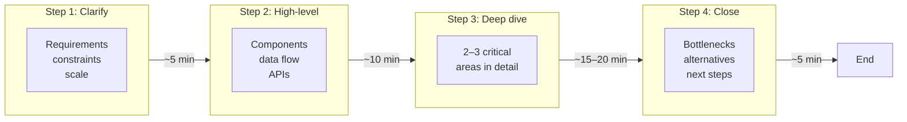

# System Design Interview Framework

---

## Why a Framework Matters

System design interviews are not primarily tests of how many technologies you have memorized. They evaluate whether you can **structure an ambiguous problem**, communicate clearly under time pressure, and reason about trade-offs the way a senior engineer would in a real design review.

A repeatable framework is the meta-skill that sits above any single domain. Whether the prompt is a URL shortener, a chat system, or a video pipeline, the same phases apply: clarify what “good” means, sketch a coherent whole, zoom into the riskiest parts, then close with honesty about limitations and next steps. Interviewers notice when candidates jump straight to Kafka and microservices without knowing the read/write ratio, and they also notice when someone methodically narrows the problem before drawing a box.

!!! note
    Treat the framework as a **conversation map**, not a script. The goal is to show judgment: which questions to ask first, what to defer, and when to stop designing and start discussing failure modes.

The sections below align to a typical **35–45 minute** session. Adjust pacing if your interviewer announces a shorter slot; the relative proportions (short clarify, medium breadth, longest depth, short close) still hold.

---

## The 4-Step Framework

Most strong answers follow four phases. The minutes below are targets for a **40-minute** interview; use the range in the diagram if your session is closer to 35 or 45 minutes.

### Step 1: Requirements Clarification (about 5 minutes)

Before you draw anything substantial, align on what you are building and what “success” means.

- **Functional requirements**: Core user-visible behaviors (e.g., “create short link,” “resolve redirect,” “list links for a user”). Separate must-haves from nice-to-haves.
- **Non-functional requirements**: Latency expectations (p50/p99), availability targets, consistency needs (can a user ever see stale data?), durability (what must never be lost).
- **Constraints**: Tech stack assumptions, geographic scope, compliance, budget for operational complexity.
- **Scale**: Order-of-magnitude daily active users, write vs read patterns, peak vs average load. You do not need exact numbers yet—rough ranges are enough to choose data stores and caching strategies.

!!! tip
    If the interviewer is vague, propose a concrete scenario (“Assume 100M DAU, mostly reads”) and ask whether that is in the right ballpark. **Proposing and validating** is faster than open-ended guessing.

End this phase with a one-sentence problem statement you can point back to while you design.

### Step 2: High-Level Design (about 10 minutes)

Give a **coherent end-to-end picture**: main components, how a request flows through them, and where data lives at rest.

- **Components**: Clients, API layer, core services, storage, caches, async pipelines (if any). Keep the first diagram at the right altitude—names of services and arrows, not every class or table.
- **Data flow**: Walk one read path and one write path. Call out idempotency or ordering only where it matters for the problem.
- **API design**: Sketch a minimal set of operations (REST resources or RPCs) that cover the functional requirements. Mention authentication or rate limiting if the problem implies public internet exposure.

This step proves you can **decompose** the problem and **sequence** dependencies. It is also the hook for the deep dive: you are implicitly choosing 2–3 areas the interviewer is likely to probe.

### Step 3: Deep Dive (about 15–20 minutes)

Spend the bulk of the interview on **two or three critical components**, not six shallow topics. Good candidates often choose:

- The **hardest consistency or concurrency** question (e.g., feed generation, counters, uniqueness).
- The **primary data model** and how it is partitioned or replicated.
- **Reliability and failure handling** for the money path (payment, redirect, message delivery).

For each area, state the goal, your chosen approach, and **at least one alternative** with a trade-off (latency vs consistency, cost vs simplicity). Invite the interviewer to steer: “I can go deeper on the database schema or on cache invalidation—which is more useful?”

!!! warning
    Avoid **tour-of-everything** deep dives. Listing seven technologies without depth reads as breadth without judgment. Pick your battles.

### Step 4: Trade-offs and Wrap-up (about 5 minutes)

Close deliberately.

- **Bottlenecks**: What breaks first under 10x load? CPU, DB hot partitions, network egress?
- **Alternatives**: What would you try if requirements shifted (e.g., stronger consistency, lower cost)?
- **Future improvements**: Sharding strategy, observability, feature flags, gradual rollout—keep it grounded in the design you already presented.

This phase shows **maturity**: you know the design is not perfect and you know how you would learn more in production.

---

### Visual: Four Steps and Time Budget

| Phase | Time (35–45 min session) | What “done” looks like |
|-------|--------------------------|-------------------------|
| Requirements | ~5 min | Agreed scope, NFRs, rough scale |
| High-level design | ~10 min | Diagram + request walkthrough + core APIs |
| Deep dive | ~15–20 min | Detailed reasoning on 2–3 hotspots |
| Wrap-up | ~5 min | Limits, trade-offs, sensible extensions |

---

## Back-of-Envelope Estimation Quick Guide

Rough numbers keep your design honest and prevent orders-of-magnitude mistakes. You are not judged on mental math perfection; you are judged on **structured reasoning** and **sanity checks**.

### From users to traffic

- **DAU to average QPS (very rough)**: If each daily active user generates \(U\) meaningful requests per day spread over \(T\) seconds of “active day,” average RPS is \(\text{DAU} \times U / T\). A common shortcut: assume a fraction of DAU is concurrent and each user generates a few requests per minute during peak—then **peak RPS** is often **3–10x** average for consumer products (highly variable).

!!! tip
    State assumptions explicitly: “If peak is 5x average, then …” Interviewers care that you **bound** the problem, not that you recall industry averages.

### Storage

- **Record size × count × replication**: Total raw bytes ≈ (average row/document size) × (number of records) × (replica factor if counting disk). Add **indexes** as a multiplier (often 10–50% extra for OLTP, more for heavy secondary indexes).
- **Growth**: Extrapolate monthly or yearly growth if the problem implies long retention (logs, media metadata).

### Bandwidth

- **Egress**: (requests per second) × (average response size) for read-heavy APIs.
- **Ingress**: (writes per second) × (payload size) for upload-heavy systems.

### Useful reference anchors (order-of-magnitude)

These are **memory aids**, not universal truths—always reconcile with the scenario.

| Quantity | Ballpark |
|----------|----------|
| Day length for spreading load | \(8.64 \times 10^4\) seconds |
| “1 million requests per day” average | ~12 RPS average (before peak multiplier) |
| JSON small object | Often hundreds of bytes to a few KB |
| SSD random read | Microseconds to low milliseconds (system dependent) |
| Cross-region RTT | Tens to hundreds of milliseconds |

For a deeper treatment with worked examples, use the dedicated [Estimation](estimation.md) page alongside this framework.

!!! note
    If arithmetic is not your strength, **write the formula on the board** and plug numbers slowly. A clear structure beats a wrong fast answer.

---

## Communication Tips

### Drive the conversation without dominating

- **Start with questions**, then transition to proposals. Early on, “Who are the users?” and “What’s the most important failure mode to avoid?” build shared context.
- After alignment, **lead with a proposal**: “I’ll assume X unless you object” moves faster than endless clarification. Pause for corrections.
- **Narrate your diagram** as you draw: name components when you add them so the interviewer can follow audio-only if needed.

### When to ask vs when to propose

| Situation | Lean toward |
|-----------|-------------|
| Core product behavior is unclear | Ask |
| Scale is unspecified | Propose a range and validate |
| Choice between two standard patterns | Propose one + one-sentence alternative |
| Interviewer says “assume whatever you want” | Lock in assumptions and document them |

### Handling “what if” questions

Treat them as **scoped trade-off exercises**, not traps.

1. Restate the change: “So we need linearizable reads globally—got it.”
2. Name the cost: latency, complexity, availability, operational load.
3. Sketch the minimal adjustment to your design—or explain why the current stack is insufficient and what you would replace.

!!! tip
    It is acceptable to say **“I would measure that in production”** for fine-grained performance questions, as long as you say **what** you would measure (p99 latency, error rate, saturation) and **how** it would change your design.

---

## Common Mistakes to Avoid

### Jumping to solutions

Starting with “We’ll use Cassandra and Kubernetes” before scope is set signals **technology-first thinking**. Interviewers infer you may do the same on the job—shipping complexity without validating requirements.

### Over-engineering

Every additional moving part needs a reason tied to **requirements or scale**. If you introduce a message queue, say what async work it decouples and what breaks if you omit it. Default to **the simplest design that meets stated NFRs**.

### Ignoring non-functional requirements

A design that ignores latency, availability, or consistency when the prompt implies them will be challenged immediately. Call out NFRs explicitly, even if you mark some as “assumed unless you disagree.”

### Skipping trade-offs

Strong candidates compare **at least two** realistic options for major decisions (SQL vs NoSQL for a given access pattern, cache-aside vs read-through, etc.). A single unchallenged choice sounds like habit, not reasoning.

### Silent diagrams

Drawing without labeling arrows or without a verbal walkthrough wastes the interviewer’s attention. **Annotate** bottlenecks and **verbalize** the critical path.

!!! warning
    **Debating the interviewer** about requirements rarely helps. If they set a constraint, adapt your design and explain the impact.

---

## Template: Requirements Gathering Checklist

Use this as a mental or whiteboard checklist. Skip items that clearly do not apply; do not turn it into an interrogation.

### Product and users

- [ ] Who are the primary users (consumer, enterprise admin, internal service)?
- [ ] What are the **must-have** user journeys vs optional features?
- [ ] Are there admin, moderation, or billing flows that affect the architecture?

### Scale and traffic

- [ ] Order of magnitude **DAU/MAU** or requests per day.
- [ ] **Read vs write** ratio for the hot path.
- [ ] **Peak vs average** load (seasonality, flash sales, viral spikes).
- [ ] Geographic distribution (single region vs global users).

### Latency and experience

- [ ] Target **p50/p99** latency for core operations (if relevant).
- [ ] **Offline or partial connectivity** requirements (mobile, IoT).
- [ ] **Real-time** expectations (live updates vs eventual visibility).

### Availability and durability

- [ ] **Uptime** target or acceptable downtime window.
- [ ] What data **must not be lost** vs what can be reconstructed?
- [ ] **Disaster recovery** expectations (RPO/RTO) if enterprise-grade.

### Consistency and correctness

- [ ] **Strong vs eventual** consistency for reads after writes.
- [ ] **Idempotency** needs (retries, duplicate submissions).
- [ ] **Ordering** requirements (per user, globally, or none).

### Security and compliance

- [ ] **Authentication/authorization** model (public, logged-in, role-based).
- [ ] **Data sensitivity** (PII, payments, health data).
- [ ] **Compliance** constraints (region, retention, audit logs).

### Operations and constraints

- [ ] Preferred **ecosystem** if any (cloud, on-prem, existing stack).
- [ ] **Team size** or operational complexity budget (sometimes implied).

---

## Sample Warm-Up Dialogue

The following is a **realistic shape** for the first five minutes; wording will vary by problem.

**Candidate:** Before I sketch anything, I want to make sure I understand the product. Are we designing a URL shortener for public internet users who create links and share them, or is this also for internal analytics and admin?

**Interviewer:** Public users. They can create short links that redirect to long URLs.

**Candidate:** Got it. For functional scope, I’ll assume: create short URL, resolve redirect, and maybe list or delete links for the authenticated user—are deletes and analytics in scope for this session?

**Interviewer:** Focus on create and redirect. You can mention analytics briefly if you want.

**Candidate:** For non-functional, should I assume we care more about **redirect latency** on the read path than about create latency? And any availability target—like 99.9% for redirects?

**Interviewer:** Yes, reads are hotter and latency-sensitive. High availability on redirect is important.

**Candidate:** On scale, is something like **100M created links** and **1000 redirects per second** at peak in the right ballpark, or should I think bigger?

**Interviewer:** That’s fine for discussion.

**Candidate:** Last thing on consistency: after someone creates a link, is it acceptable if redirect works **immediately everywhere**, or is slight propagation delay OK for a global system?

**Interviewer:** Assume we want it visible quickly; you can discuss trade-offs.

**Candidate:** Perfect. I’ll summarize: **create and redirect** are core; **read-heavy**, **low-latency redirects**, **high availability**; rough scale you confirmed; and I’ll call out **consistency** when we pick storage. I’ll start with a high-level diagram unless you want more detail on any of that.

This pattern shows **closed questions** where helpful, **explicit assumptions**, and a **clean handoff** to the design phase.

---

## Summary

| Topic | Takeaway |
|-------|----------|
| Framework purpose | Repeatable phases beat ad-hoc brainstorming; shows senior judgment. |
| Step 1 | Clarify functional scope, NFRs, constraints, and rough scale early. |
| Step 2 | End-to-end diagram, data flow, minimal APIs—breadth before depth. |
| Step 3 | Go deep on 2–3 critical areas; compare alternatives and trade-offs. |
| Step 4 | Bottlenecks, what would change under new constraints, grounded next steps. |
| Estimation | Use simple formulas; state assumptions; sanity-check orders of magnitude. |
| Communication | Ask then propose; narrate diagrams; handle “what if” as scoped trade-offs. |
| Pitfalls | Avoid solution-first, over-engineering, silent NFRs, and shallow breadth. |

---

## Further Reading

- [Estimation](estimation.md) — Back-of-the-envelope drills and sizing patterns that pair with Step 1 and Step 2.
- [Scalability, Availability, and Reliability](scalability.md) — Vocabulary for NFR discussions and failure-aware design.
- [Distributed Systems](distributed_systems.md) — Consensus, replication, and messaging—common deep-dive territory in Step 3.
- [Databases](databases.md) — Choosing stores and articulating consistency trade-offs during deep dive.
- [API Design](api_design.md) — Shaping boundaries and contracts in Step 2.

---

_Last updated: this page is a process guide; combine it with fundamentals topics above when preparing for interviews._
