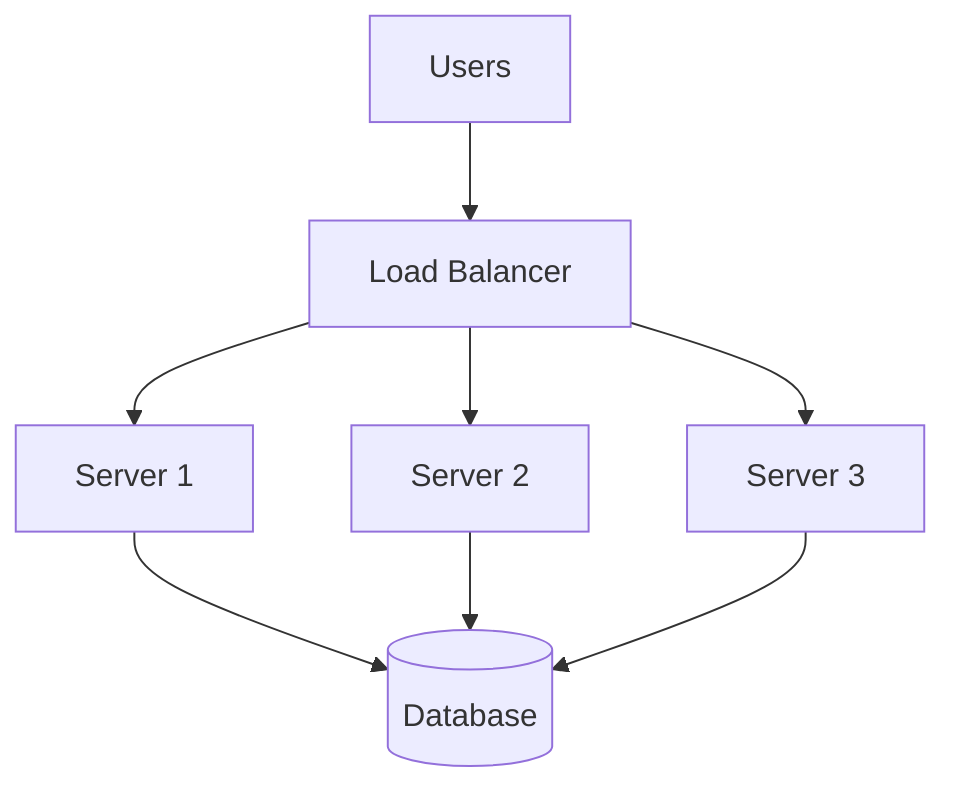
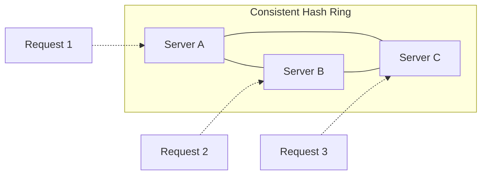
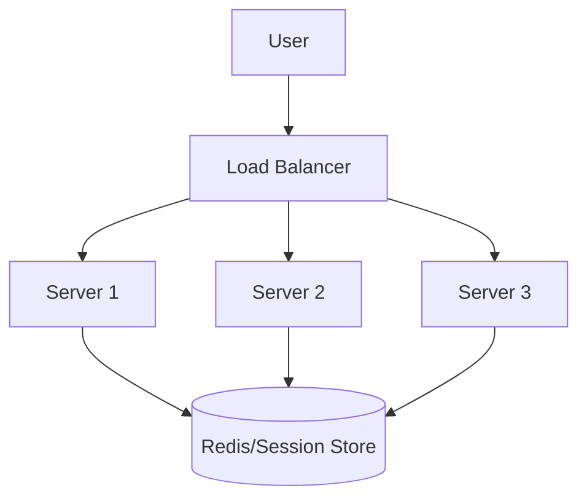
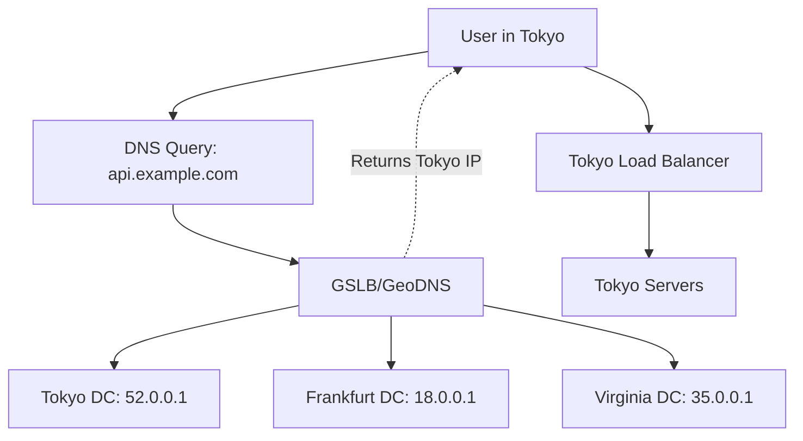

# Load Balancing
{: .no_toc }

<details open markdown="block">
  <summary>Table of Contents</summary>
  {: .text-delta }
1. TOC
{:toc}
</details>

---

## What is Load Balancing?

Load balancing is the process of distributing incoming network traffic across multiple servers so that no single server bears too much load. Think of it like checkout lines at a grocery store—instead of everyone crowding into one line, customers are directed to different registers to reduce wait times.

### Why Load Balancing Matters

Without load balancing, a single server must handle all requests. This creates several problems:

1. **Single point of failure:** If that server goes down, your entire application is offline
2. **Scalability ceiling:** One server can only handle so many requests per second
3. **Poor resource utilization:** During low traffic, you waste capacity; during high traffic, you crash

**Example:**

Imagine your website gets 10,000 requests per second. A single server can handle 2,000 requests per second before response times degrade.

Without load balancing:
- 8,000 requests queue up → slow responses → users leave

With load balancing across 6 servers:
- Each server handles ~1,700 requests → fast responses → happy users
- If one server crashes, 5 remain → degraded but operational

### How Load Balancing Works



1. **User sends request** to your domain (e.g., api.example.com)
2. **DNS resolves** to the load balancer's IP address
3. **Load balancer receives** the request
4. **Load balancer selects** a backend server using its algorithm
5. **Request is forwarded** to the selected server
6. **Server processes** the request and returns a response
7. **Load balancer forwards** the response to the user

From the user's perspective, they're talking to a single endpoint. They don't know (or care) about the multiple servers behind it.

---

## Types of Load Balancers

Load balancers come in different forms, each with distinct trade-offs.

### Hardware vs Software Load Balancers

**Hardware Load Balancers:**

Dedicated physical appliances purpose-built for load balancing.

| Aspect | Details |
|--------|---------|
| **Examples** | F5 BIG-IP, Citrix ADC, A10 Networks |
| **Performance** | Extremely high (millions of connections) |
| **Features** | SSL acceleration, DDoS protection, WAF |
| **Cost** | $15,000 - $500,000+ |
| **Deployment** | Physical rack-mounted devices |

**When to use:** Large enterprises with massive traffic, strict performance requirements, and budget for specialized hardware.

**Software Load Balancers:**

Applications running on commodity servers.

| Aspect | Details |
|--------|---------|
| **Examples** | Nginx, HAProxy, Traefik, Envoy |
| **Performance** | Very high (100,000s connections) |
| **Features** | Highly configurable, scriptable |
| **Cost** | Free (open source) or modest licensing |
| **Deployment** | Any Linux server, container, VM |

**When to use:** Most modern applications. Flexible, cost-effective, and easily managed with infrastructure-as-code.

### Layer 4 vs Layer 7 Load Balancing

These refer to layers in the OSI networking model.

**Layer 4 (Transport Layer) Load Balancing:**

Operates at the TCP/UDP level. Makes routing decisions based on:
- Source/destination IP addresses
- Source/destination ports
- Protocol (TCP/UDP)

```
User Request: 
  Source IP: 203.0.113.50
  Dest IP: 198.51.100.10 (Load Balancer)
  Dest Port: 443

L4 Decision: Forward to Server 2 (based on IP hash)
```

**Characteristics:**
- Very fast (minimal packet inspection)
- No application awareness
- Can't route based on URL, headers, or content
- Preserves end-to-end encryption

**When to use:** TCP services, database connections, any non-HTTP protocol, or when you need maximum performance.

**Layer 7 (Application Layer) Load Balancing:**

Operates at the HTTP/HTTPS level. Makes routing decisions based on:
- URL paths
- HTTP headers
- Cookies
- Request content
- HTTP methods

```
User Request:
  GET /api/users/123 HTTP/1.1
  Host: api.example.com
  Authorization: Bearer eyJhbGciOiJIUzI1...
  Cookie: session=abc123

L7 Decision: Route to API server pool (based on path /api/*)
```

**Characteristics:**
- Can inspect and modify requests/responses
- Supports content-based routing
- SSL termination (decrypts traffic, then re-encrypts or sends plain HTTP to backend)
- Higher latency than L4 (more processing)

**When to use:** Web applications, APIs, when you need URL-based routing, SSL termination, or request manipulation.

**Comparison:**

| Feature | Layer 4 | Layer 7 |
|---------|---------|---------|
| Speed | Faster | Slower |
| Intelligence | Basic | Rich |
| SSL visibility | No (pass-through) | Yes (terminates) |
| URL routing | No | Yes |
| Header inspection | No | Yes |
| Protocol support | Any TCP/UDP | HTTP/HTTPS primarily |
| Use case | Database, TCP services | Web apps, APIs |

### Cloud Load Balancers

Major cloud providers offer managed load balancing services:

**AWS:**
- **ALB (Application Load Balancer):** Layer 7, HTTP/HTTPS, WebSocket
- **NLB (Network Load Balancer):** Layer 4, ultra-low latency, millions of requests/sec
- **CLB (Classic Load Balancer):** Legacy, both L4 and L7

**GCP:**
- **Cloud Load Balancing:** Global, anycast-based, auto-scaling
- **HTTP(S) Load Balancing:** Layer 7, global distribution
- **TCP/UDP Load Balancing:** Layer 4

**Azure:**
- **Azure Load Balancer:** Layer 4
- **Application Gateway:** Layer 7, WAF integration

**Benefits of cloud load balancers:**
- No infrastructure to manage
- Auto-scaling
- Built-in health checks
- Global distribution
- Pay-per-use pricing

---

## Load Balancing Algorithms

How does a load balancer decide which server should handle each request? Various algorithms exist, each suited to different scenarios.

### Round Robin

The simplest algorithm. Requests are distributed to servers in sequential, rotating order.

```
Request 1 → Server A
Request 2 → Server B
Request 3 → Server C
Request 4 → Server A (back to start)
Request 5 → Server B
...
```

**Implementation:**

```python
class RoundRobinBalancer:
    def __init__(self, servers):
        self.servers = servers
        self.current = 0
    
    def get_server(self):
        server = self.servers[self.current]
        self.current = (self.current + 1) % len(self.servers)
        return server

balancer = RoundRobinBalancer(['server1', 'server2', 'server3'])
for i in range(6):
    print(f"Request {i+1} → {balancer.get_server()}")
# Request 1 → server1
# Request 2 → server2
# Request 3 → server3
# Request 4 → server1
# ...
```

**Advantages:**
- Simple to implement and understand
- No state beyond a counter
- Fair distribution when servers are equal

**Disadvantages:**
- Doesn't account for server capacity differences
- Doesn't consider current server load
- Long-running requests can cause imbalance

**When to use:** Servers are identical in capacity, and requests are roughly equal in cost.

### Weighted Round Robin

Like round robin, but servers have weights reflecting their capacity.

```
Servers:
  Server A: weight 3 (powerful)
  Server B: weight 2 (medium)
  Server C: weight 1 (small)

Distribution over 6 requests:
  Request 1 → Server A
  Request 2 → Server A
  Request 3 → Server A
  Request 4 → Server B
  Request 5 → Server B
  Request 6 → Server C
```

**Implementation:**

```python
class WeightedRoundRobinBalancer:
    def __init__(self, servers_weights):
        # servers_weights: [('server1', 3), ('server2', 2), ('server3', 1)]
        self.servers = []
        for server, weight in servers_weights:
            self.servers.extend([server] * weight)
        self.current = 0
    
    def get_server(self):
        server = self.servers[self.current]
        self.current = (self.current + 1) % len(self.servers)
        return server
```

**When to use:** Servers have different capacities (e.g., mixed instance types in cloud).

### Least Connections

Route to the server with the fewest active connections.

```
Current state:
  Server A: 45 active connections
  Server B: 12 active connections
  Server C: 28 active connections

New request → Server B (fewest connections)
```

**How it works:**

```python
class LeastConnectionsBalancer:
    def __init__(self, servers):
        self.servers = {server: 0 for server in servers}
    
    def get_server(self):
        # Find server with minimum connections
        server = min(self.servers, key=self.servers.get)
        self.servers[server] += 1
        return server
    
    def release_connection(self, server):
        self.servers[server] -= 1
```

**Advantages:**
- Accounts for request duration differences
- Naturally balances load over time
- Good for long-lived connections (WebSocket, gRPC streaming)

**Disadvantages:**
- Requires tracking connection counts
- New servers get flooded with requests (0 connections)
- Connection count isn't always correlated with load

**When to use:** Requests have varying processing times, long-lived connections, or when server response times differ.

### Weighted Least Connections

Combines least connections with server capacity weights.

```
Formula: effective_load = connections / weight

Server A: 30 connections, weight 3 → effective_load = 10
Server B: 15 connections, weight 2 → effective_load = 7.5
Server C: 6 connections, weight 1  → effective_load = 6

New request → Server C (lowest effective load)
```

**When to use:** Mixed server capacities with varying request durations.

### IP Hash

Hash the client's IP address to determine the server. Same client always goes to the same server.

```python
import hashlib

class IPHashBalancer:
    def __init__(self, servers):
        self.servers = servers
    
    def get_server(self, client_ip):
        # Create a hash of the IP address
        hash_value = int(hashlib.md5(client_ip.encode()).hexdigest(), 16)
        # Map to server index
        server_index = hash_value % len(self.servers)
        return self.servers[server_index]

balancer = IPHashBalancer(['server1', 'server2', 'server3'])
print(balancer.get_server('192.168.1.100'))  # Always same server
print(balancer.get_server('192.168.1.100'))  # Same result
```

**Advantages:**
- Provides session affinity without cookies
- Good for caching (same user hits same cache)
- Simple and stateless (no session tracking)

**Disadvantages:**
- Uneven distribution if client IP distribution is skewed
- Adding/removing servers reshuffles most clients
- NAT can cause many users to share one IP

**When to use:** When you need sticky sessions without application-level support.

### Consistent Hashing

Advanced hashing that minimizes redistribution when servers change.

**The problem with regular hashing:**

With 3 servers and hash % 3:
```
Hash 100 → Server 1 (100 % 3 = 1)
Hash 101 → Server 2 (101 % 3 = 2)
Hash 102 → Server 0 (102 % 3 = 0)
```

Add a 4th server (hash % 4):
```
Hash 100 → Server 0 (100 % 4 = 0)  ← Changed!
Hash 101 → Server 1 (101 % 4 = 1)  ← Changed!
Hash 102 → Server 2 (102 % 4 = 2)  ← Same
```

Almost everything moves!

**Consistent hashing solution:**

Place servers on a virtual ring (0 to 2^32). Hash each request to a point on the ring, then walk clockwise to find the first server.



Adding a new server only affects keys between it and its predecessor.

**Virtual nodes:**

To improve distribution, each physical server gets multiple positions on the ring.

```python
class ConsistentHashBalancer:
    def __init__(self, servers, replicas=100):
        self.ring = {}
        self.sorted_keys = []
        
        for server in servers:
            for i in range(replicas):
                key = self._hash(f"{server}:{i}")
                self.ring[key] = server
                self.sorted_keys.append(key)
        
        self.sorted_keys.sort()
    
    def _hash(self, key):
        return int(hashlib.md5(key.encode()).hexdigest(), 16)
    
    def get_server(self, request_key):
        if not self.ring:
            return None
        
        hash_val = self._hash(request_key)
        
        # Find first server with hash >= request hash
        for key in self.sorted_keys:
            if key >= hash_val:
                return self.ring[key]
        
        # Wrap around to first server
        return self.ring[self.sorted_keys[0]]
```

**When to use:** Distributed caches, CDNs, any system where data is partitioned and you want to minimize reshuffling.

### Least Response Time

Route to the server with the fastest recent response time.

```
Recent average response times:
  Server A: 45ms
  Server B: 12ms  ← Fastest, gets the request
  Server C: 28ms
```

**Implementation approach:**
- Track response times using exponential moving average
- Optionally combine with connection count

**When to use:** Backend servers have varying loads or capabilities, and you want to optimize user experience.

### Random

Randomly select a server for each request.

```python
import random

class RandomBalancer:
    def __init__(self, servers):
        self.servers = servers
    
    def get_server(self):
        return random.choice(self.servers)
```

**Advantages:**
- Extremely simple
- No state to maintain
- Statistically even distribution over time

**Disadvantages:**
- Short-term imbalances possible
- No consideration of server health or load

**When to use:** Simple systems, testing, or when other algorithms add unneeded complexity.

### Resource Based (Adaptive)

Query servers for their current resource usage and route to the least loaded.

```
Server health responses:
  Server A: CPU 80%, Memory 70% → Score: 150
  Server B: CPU 20%, Memory 30% → Score: 50  ← Best
  Server C: CPU 50%, Memory 60% → Score: 110
```

**Advantages:**
- Most accurate load balancing
- Adapts to real-time conditions

**Disadvantages:**
- Requires health endpoint on each server
- Added latency for health checks
- More complex implementation

---

## Health Checks

A load balancer must know which servers are healthy. Sending traffic to a crashed server means failed requests.

### Passive Health Checks

Monitor real traffic for failures.

```
Server A: 
  Last 100 requests: 3 failures (3% error rate) → HEALTHY
  
Server B:
  Last 100 requests: 47 failures (47% error rate) → UNHEALTHY
```

**Pros:** No extra traffic, real-world accuracy
**Cons:** Failures affect users, slow detection for low-traffic servers

### Active Health Checks

Periodically send probe requests to each server.

```
Every 5 seconds:
  GET /health → Server A (200 OK, 15ms) ✓
  GET /health → Server B (Connection refused) ✗
  GET /health → Server C (200 OK, 23ms) ✓
```

**Typical health check configuration:**

```nginx
# Nginx upstream health check
upstream backend {
    server server1.example.com:8080;
    server server2.example.com:8080;
    server server3.example.com:8080;
    
    health_check interval=5s fails=3 passes=2;
}
```

- **interval:** How often to check (5 seconds)
- **fails:** How many failures before marking unhealthy (3)
- **passes:** How many successes to mark healthy again (2)

### Health Check Endpoints

Your application should expose a health endpoint:

```python
@app.route('/health')
def health_check():
    checks = {
        'database': check_database(),
        'redis': check_redis(),
        'disk_space': check_disk_space(),
    }
    
    all_healthy = all(checks.values())
    
    return jsonify({
        'status': 'healthy' if all_healthy else 'unhealthy',
        'checks': checks
    }), 200 if all_healthy else 503
```

**Types of health checks:**

| Type | What it checks | When to use |
|------|----------------|-------------|
| **Liveness** | Is the process running? | Container orchestration (restart) |
| **Readiness** | Can the process handle traffic? | Load balancer (route traffic) |
| **Startup** | Has the process finished starting? | Slow-starting apps |

### Graceful Degradation

When a server is failing, transition gradually:

1. **Draining:** Stop sending new connections, let existing ones complete
2. **Removal:** After timeout, forcibly remove from pool
3. **Recovery:** When healthy again, gradually add back (slow start)

**Slow start:**

Don't flood a recovering server with traffic. Gradually increase its share.

```
Time 0: Server B back online → weight 1
Time 30s: → weight 2
Time 60s: → weight 4
Time 90s: → full weight
```

---

## Sticky Sessions (Session Affinity)

Sometimes you need the same user to reach the same server consistently.

### Why Sticky Sessions?

**Scenario:** User logs in, session stored in server memory.

```
Request 1: Login → Server A (creates session in memory)
Request 2: Dashboard → Server B (no session found!) → Login page
```

The user is unexpectedly logged out because their session is on Server A, but the load balancer sent them to Server B.

### Implementing Sticky Sessions

**Method 1: Cookie-based (Application Layer)**

Load balancer sets a cookie identifying the server:

```http
Set-Cookie: SERVERID=server-a; Path=/
```

Subsequent requests include this cookie:

```http
Cookie: SERVERID=server-a
```

Load balancer reads the cookie and routes to Server A.

**Method 2: IP Hash (Network Layer)**

As described earlier, hash the client IP to always reach the same server.

**Method 3: Application Session ID**

Use an existing session ID cookie:

```http
Cookie: SESSION=abc123xyz
```

Load balancer hashes SESSION to determine server.

### Problems with Sticky Sessions

**1. Uneven load distribution:**

If some users are more active than others, their server gets overloaded.

**2. Failover complexity:**

If Server A crashes, all sticky sessions are lost. Users must re-authenticate.

**3. Scaling difficulties:**

Adding servers doesn't help users stuck on overloaded servers.

### Better Alternative: Externalized Session State

Instead of server-local sessions, store sessions in a shared store:



**Implementation:**

```python
import redis
import json

session_store = redis.Redis(host='redis', port=6379)

def get_session(session_id):
    data = session_store.get(f"session:{session_id}")
    return json.loads(data) if data else None

def set_session(session_id, data, ttl=3600):
    session_store.setex(f"session:{session_id}", ttl, json.dumps(data))
```

**Advantages:**
- Any server can handle any request
- Session survives server crashes
- Easy horizontal scaling

---

## SSL/TLS Termination

HTTPS requires encryption/decryption, which is CPU-intensive. Where should this happen?

### SSL Termination at Load Balancer

Load balancer handles HTTPS. Backend servers receive plain HTTP.

```
User → [HTTPS] → Load Balancer → [HTTP] → Backend Servers
```

**Advantages:**
- Offloads CPU from application servers
- Simplifies certificate management (one place)
- Enables L7 features (URL routing, header inspection)

**Disadvantages:**
- Traffic between LB and backends is unencrypted
- Must trust internal network

### SSL Passthrough

Load balancer passes encrypted traffic directly to backends.

```
User → [HTTPS] → Load Balancer → [HTTPS] → Backend Servers
```

**Advantages:**
- End-to-end encryption
- Backend handles its own certificate
- No visibility of traffic at LB (security)

**Disadvantages:**
- Only L4 load balancing possible
- Each backend needs certificate management
- Higher backend CPU usage

### SSL Re-encryption (End-to-End)

Load balancer terminates user SSL, then creates new SSL connection to backend.

```
User → [HTTPS] → Load Balancer → [HTTPS (internal)] → Backend Servers
```

**Advantages:**
- End-to-end encryption
- L7 features available at LB
- Can use different certs (public vs internal CA)

**Disadvantages:**
- Double encryption overhead
- More complex certificate management

### Which to Choose?

| Scenario | Recommendation |
|----------|----------------|
| Internal services, trusted network | SSL Termination |
| Compliance requirements (PCI, HIPAA) | SSL Re-encryption |
| Maximum performance, basic routing | SSL Passthrough |
| General web applications | SSL Termination |

---

## Global Server Load Balancing (GSLB)

Traditional load balancers work within a single data center. GSLB distributes traffic globally across multiple data centers.

### How GSLB Works



1. User queries DNS for api.example.com
2. GSLB (acting as DNS) considers:
   - User's geographic location
   - Data center health
   - Data center load
   - Network latency
3. Returns IP of the optimal data center
4. User connects to nearest/best data center

### GSLB Routing Strategies

**Geographic routing:**
Route users to the nearest data center.
- User in Japan → Tokyo DC
- User in Germany → Frankfurt DC

**Performance-based routing:**
Route based on measured latency.
- Continuously probe latency from each DC
- Route to lowest latency option

**Failover routing:**
Primary data center unless it fails.
- Normal: Everyone → Primary DC
- Primary down: Everyone → Secondary DC

**Load-based routing:**
Distribute based on current capacity.
- If Tokyo is overloaded, send some traffic to Virginia

### CDN Integration

CDNs like Cloudflare, AWS CloudFront, and Akamai combine GSLB with edge caching:

```
User Request → Edge Location (cache hit) → Response
                            ↓ (cache miss)
                      Origin Server
```

**Benefits:**
- Static content served from edge (fast)
- Only dynamic requests reach origin
- DDoS protection at edge
- Global availability

---

## Interview Tips

### What Interviewers Look For

1. **Understanding of trade-offs:** No algorithm is universally best
2. **Awareness of failure modes:** What happens when things break?
3. **Scalability thinking:** How does this work at 10x, 100x scale?
4. **Practical experience:** Real-world considerations

### Common Interview Questions

**Q: "How would you design load balancing for a social media site?"**

*Good answer:*
> "I'd use a multi-tier approach. At the edge, a CDN like Cloudflare handles static content and provides global distribution. For API traffic, I'd use an L7 load balancer like AWS ALB with path-based routing—`/api/v1/users` goes to the user service, `/api/v1/posts` to the post service. Within each service, I'd use least connections algorithm since request durations vary. Health checks every 5 seconds with automatic removal after 3 failures. For session management, I'd externalize sessions to Redis instead of using sticky sessions, allowing any server to handle any user."

**Q: "What happens when a backend server crashes?"**

*Good answer:*
> "The load balancer detects failure through health checks—either active probes failing or passive detection of connection errors. It marks the server unhealthy and stops sending new traffic. Existing connections may fail, so clients should implement retry logic with exponential backoff. Once the server recovers and passes health checks, it's gradually reintroduced with slow-start to avoid overloading it. The system should also alert operators and potentially auto-replace the instance if using auto-scaling."

**Q: "Why would you choose L4 over L7 load balancing?"**

*Good answer:*
> "I'd choose L4 for non-HTTP protocols like databases, custom TCP services, or when I need SSL passthrough. L4 is also faster—less processing per packet—so for ultra-high-throughput scenarios or when I don't need URL-based routing, L4 makes sense. For most web applications though, I'd use L7 because it enables intelligent routing, SSL termination, header manipulation, and better visibility into traffic patterns."

---

## Summary

| Concept | Key Takeaway |
|---------|--------------|
| **Purpose** | Distribute traffic, improve availability, enable scaling |
| **Hardware vs Software** | Software is flexible and cost-effective for most cases |
| **L4 vs L7** | L4 for speed and non-HTTP; L7 for intelligent routing |
| **Round Robin** | Simple, equal distribution, good for identical servers |
| **Least Connections** | Good for varying request durations |
| **IP Hash** | Session affinity without cookies |
| **Consistent Hashing** | Minimizes redistribution when servers change |
| **Health Checks** | Essential for reliability; use both active and passive |
| **Sticky Sessions** | Avoid if possible; use external session store |
| **SSL Termination** | Offload at LB for most cases |
| **GSLB** | Global distribution across data centers |
