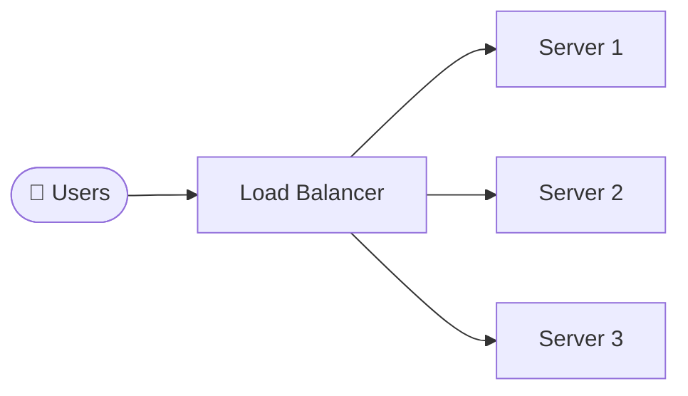
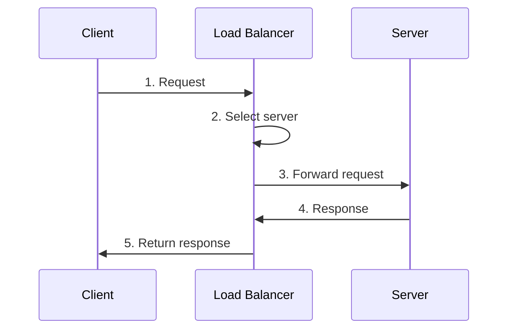

# Load Balancing
{: .no_toc }

<details open markdown="block">
  <summary>Table of Contents</summary>
  {: .text-delta }
1. TOC
{:toc}
</details>

---

## 🎯 What is Load Balancing?

Imagine you're at a busy grocery store. If there's only one checkout lane open, the line gets incredibly long. But if you open multiple lanes and direct customers to the shortest line, everyone gets served faster.

**Load balancing works the same way for web traffic.**

A load balancer sits in front of your servers and distributes incoming requests across multiple servers. This prevents any single server from becoming overwhelmed.



---

## Why Load Balancing Matters

| Benefit | What It Means |
|---------|---------------|
| **High Availability** | If one server crashes, others keep working. No downtime! |
| **Scalability** | Need more capacity? Just add more servers. |
| **Performance** | No single server gets overloaded, so responses stay fast. |
| **Maintenance** | Update servers one at a time without taking your app offline. |

{: .tip }
> Load balancing appears in almost every system design interview. Know at least 3-4 algorithms and when to use each.

---

## How It Works (Step by Step)



1. **Client Request** - User's browser sends a request to your domain
2. **Interception** - The load balancer receives the request first
3. **Server Selection** - Algorithm picks the best server
4. **Forwarding** - Request goes to the chosen server
5. **Response** - Server responds, load balancer forwards it back

The client never knows multiple servers exist!

---

## Load Balancing Algorithms

### 1. Round Robin

The simplest approach: distribute requests in order.

```
Request 1 → Server A
Request 2 → Server B
Request 3 → Server C
Request 4 → Server A (starts over)
```

| Pros | Cons |
|------|------|
| Dead simple to implement | Ignores server load/capacity |
| Fair if servers are equal | Bad if servers have different specs |

**Use when:** All servers are identical and requests are roughly equal.

---

### 2. Weighted Round Robin

Like Round Robin, but some servers get more traffic.

```
Server A (weight: 3) → Gets 3x the requests
Server B (weight: 1) → Gets 1x the requests
```

| Pros | Cons |
|------|------|
| Handles different server sizes | Weights are static |
| Still simple | Doesn't adapt to real-time load |

**Use when:** You have servers with different capacities (e.g., mixing old and new hardware).

---

### 3. Least Connections

Send requests to the server with the fewest active connections.

```
Server A: 10 connections → skip
Server B: 3 connections  → PICK THIS ONE ✓
Server C: 7 connections  → skip
```

| Pros | Cons |
|------|------|
| Adapts to real-time load | Needs connection tracking |
| Handles varying request durations | Long-lived connections can skew it |

**Use when:** Requests have varying processing times. Great for dynamic workloads.

---

### 4. IP Hash (Sticky Sessions)

Hash the client's IP address to determine their server. Same client always goes to the same server.

```
hash("192.168.1.100") % 3 = 1 → Always Server B
```

| Pros | Cons |
|------|------|
| Session persistence built-in | Clients behind proxies cause hot spots |
| No session replication needed | Adding servers breaks existing mappings |

**Use when:** Your app stores session data locally and can't share it between servers.

---

### 5. Least Response Time

Pick the server responding fastest right now.

| Pros | Cons |
|------|------|
| Optimizes for speed | Requires constant monitoring |
| Adapts to server health | Short-term blips cause flapping |

**Use when:** Latency is your top priority (e.g., real-time applications).

---

## Quick Comparison Table

| Algorithm | Best For | Avoids |
|-----------|----------|--------|
| **Round Robin** | Equal servers, simple setup | Complex logic |
| **Weighted Round Robin** | Mixed hardware | Real-time adaptation |
| **Least Connections** | Varying request times | Ignoring current load |
| **IP Hash** | Session persistence | Session replication |
| **Least Response Time** | Latency-critical apps | Slow servers |

---

## Hardware vs. Software Load Balancers

### Hardware Load Balancers

Physical appliances (F5, Citrix ADC) with dedicated chips.

| Pros | Cons |
|------|------|
| Extremely fast | Very expensive ($10K+) |
| Advanced security features | Less flexible |
| SSL offloading | Can be a single point of failure |

### Software Load Balancers

Applications running on regular servers (Nginx, HAProxy, cloud LBs).

| Pros | Cons |
|------|------|
| Cost-effective | May need tuning for extreme loads |
| Highly flexible | Run on shared resources |
| Easy to scale | |

**Popular options:**
- **Nginx** - Great for HTTP, easy config
- **HAProxy** - High performance, TCP/HTTP
- **AWS ALB/NLB** - Managed, auto-scaling
- **Traefik** - Great for containers/Kubernetes

{: .note }
> In interviews, most systems use software load balancers. Hardware is mainly for very high-traffic edge cases.

---

## Sticky Sessions (Session Affinity)

### The Problem

Some apps store user data in memory:
- Shopping cart contents
- Login state
- Form progress

If requests bounce between servers, this data is lost!

### The Solution

**Sticky sessions** ensure the same user always hits the same server.

**Methods:**
1. **IP Hash** - Route by client IP
2. **Cookie-based** - LB sets a cookie with server ID
3. **URL rewriting** - Embed server ID in URLs (rare)

### The Trade-off

| Pros | Cons |
|------|------|
| Session data stays intact | Uneven load distribution |
| Simple to implement | Server failure = lost sessions |

### Better Alternatives

Instead of sticky sessions, consider:

1. **Centralized Session Store** - Store sessions in Redis/Memcached
2. **Session Replication** - Copy sessions across all servers
3. **Stateless Design** - Use JWTs, store data client-side

{: .tip }
> In interviews, mention that sticky sessions are a valid solution but explain why stateless designs scale better.

---

## Health Checks

Load balancers need to know if servers are alive. Health checks test this continuously.

### Types

| Type | How It Works |
|------|--------------|
| **TCP** | Can we connect to the port? |
| **HTTP** | Does `/health` return 200 OK? |
| **Custom** | Run a script, check dependencies |

### Configuration

```yaml
health_check:
  interval: 10s        # Check every 10 seconds
  timeout: 5s          # Wait 5 seconds for response
  unhealthy_threshold: 3   # 3 failures = mark unhealthy
  healthy_threshold: 2     # 2 successes = mark healthy again
```

### What Happens When a Server Fails?

1. Health check fails 3 times
2. Load balancer marks server "unhealthy"
3. No new requests sent to that server
4. Other servers absorb the traffic
5. When server recovers, it's added back

---

## Interview Tips

{: .warning }
> Don't just name algorithms. Explain **when** you'd use each one.

**Common questions:**
- "How would you handle a server going down?"
- "What if users need session persistence?"
- "How do you prevent overloading a single server?"

**Strong answer structure:**
1. State the algorithm you'd use
2. Explain why it fits this use case
3. Acknowledge trade-offs
4. Mention alternatives considered

**Example:**
> "I'd use Least Connections because our API requests have varying durations. Round Robin might overload a server stuck on long requests. The trade-off is we need to track connections, but that's minimal overhead."

---

## Summary

- **Load balancing** distributes traffic across servers
- Choose algorithm based on your needs (session persistence, performance, simplicity)
- **Least Connections** is often a safe default
- Use **health checks** to automatically remove failing servers
- Consider **stateless design** over sticky sessions for better scalability
