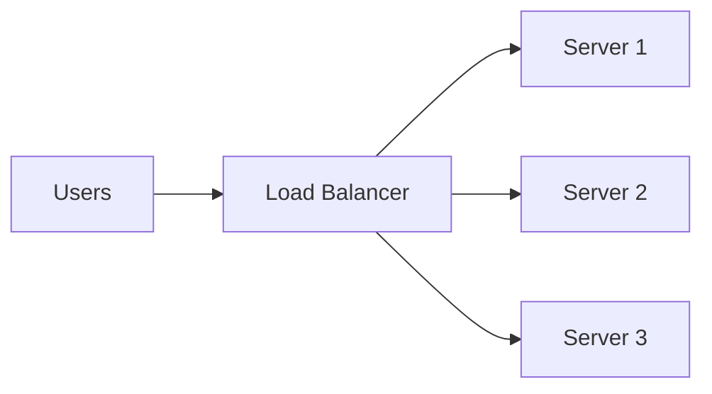
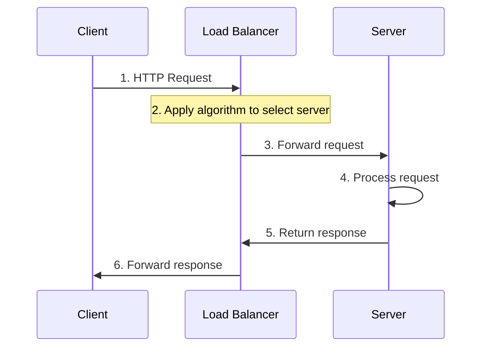
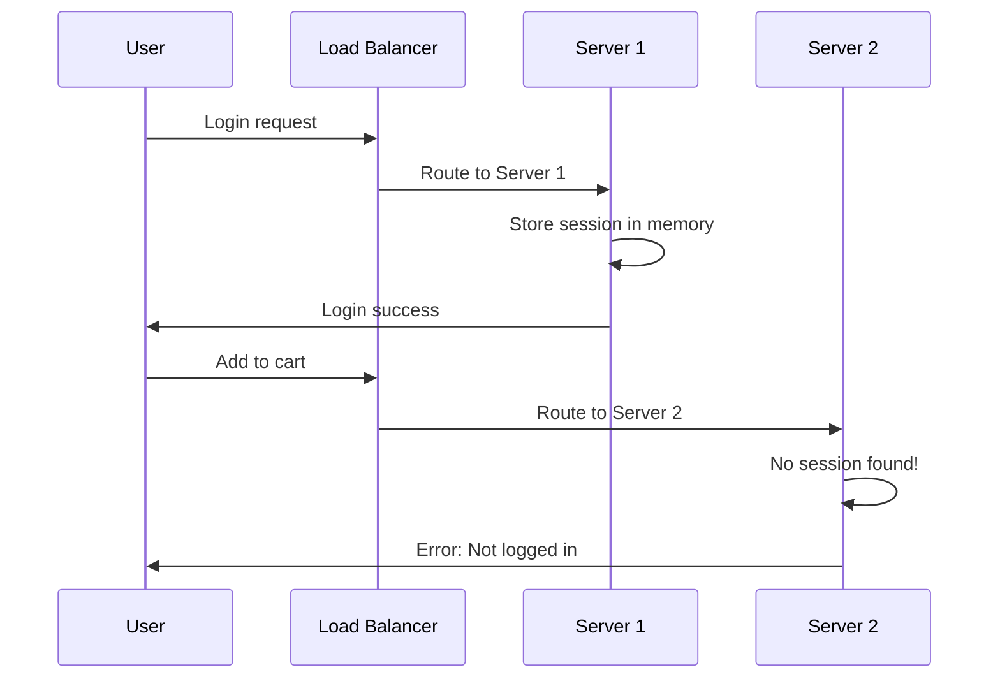
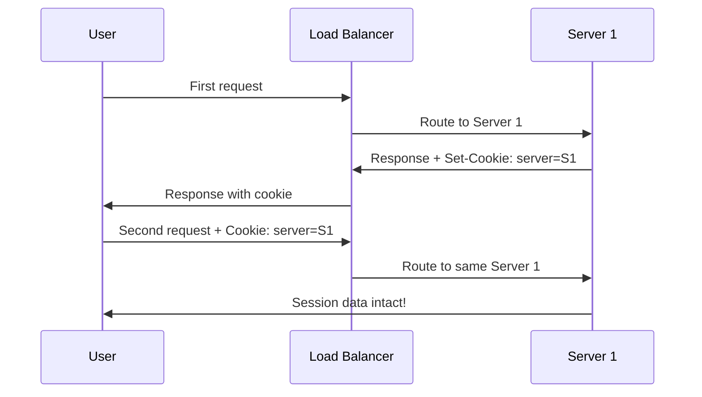
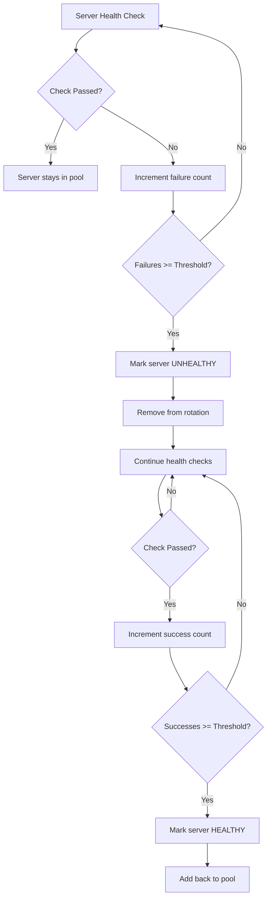
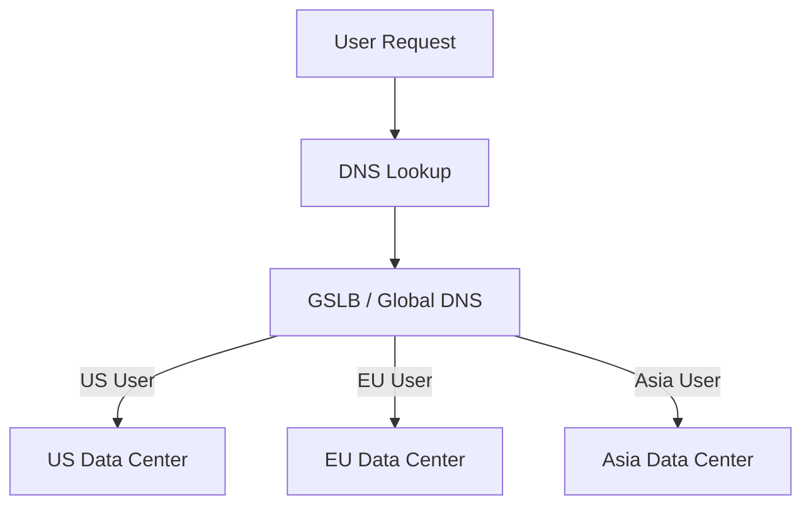

# Load Balancing
{: .no_toc }

<details open markdown="block">
  <summary>Table of Contents</summary>
  {: .text-delta }
1. TOC
{:toc}
</details>

---

## 🎯 What is Load Balancing?

Imagine you're at a busy grocery store. If there's only one checkout lane open, the line gets incredibly long. But if you open multiple lanes and direct customers to the shortest line, everyone gets served faster.

**Load balancing works the same way for web traffic.**

A load balancer is a critical component in distributed systems that sits in front of your servers and distributes incoming network traffic across multiple backend servers (or other resources). This ensures no single server is overwhelmed, which improves:

- **Application responsiveness** - Faster response times
- **Availability** - No single point of failure
- **Scalability** - Easy to add more capacity



---

## Why Load Balancing is Essential

Load balancing is a core component of any high-traffic, highly available system. Here's why every production system needs it:

| Benefit | Detailed Explanation |
|---------|---------------------|
| **High Availability** | Distributes load across multiple servers, preventing single points of failure. If one server goes down, the load balancer automatically routes traffic to healthy servers, ensuring continuous service. |
| **Scalability** | Enables horizontal scaling by simply adding more servers as traffic increases. No need to upgrade to more powerful (and expensive) hardware. |
| **Performance** | Prevents any single server from becoming a bottleneck by distributing requests evenly. This keeps response times low even under heavy load. |
| **Resource Optimization** | Maximizes the utilization of all available servers rather than overloading some while others sit idle. |
| **Maintenance Flexibility** | Allows for rolling updates and maintenance without downtime. Take servers out of rotation one at a time while others handle the traffic. |
| **Geographic Distribution** | Can route users to the nearest data center, reducing latency for global applications. |

{: .tip }
> Load balancing appears in almost every system design interview. You should know at least 3-4 algorithms, when to use each, and their trade-offs.

---

## How Load Balancing Works

### High-Level Flow

Here's what happens when a client makes a request to a load-balanced system:



### Step-by-Step Breakdown

1. **Client Request**: A client (web browser, mobile app, API consumer) sends a request to a publicly accessible IP address or domain name (e.g., `api.example.com`).

2. **Load Balancer Interception**: The DNS resolves to the load balancer's IP address. The load balancer receives the request first, not the actual application servers.

3. **Server Selection**: The load balancer uses a pre-configured algorithm (Round Robin, Least Connections, etc.) to select an appropriate backend server. This decision considers:
   - Current server load
   - Server health status
   - Session affinity requirements
   - Geographic location

4. **Request Forwarding**: The load balancer forwards the original request to the chosen server. It may also:
   - Add headers (like `X-Forwarded-For` with client IP)
   - Terminate SSL/TLS encryption
   - Modify the request path

5. **Server Processing**: The backend server processes the request normally, unaware that a load balancer is involved.

6. **Response Delivery**: The server sends its response back to the load balancer, which forwards it to the original client. The client typically has no idea which specific server handled their request.

---

## Load Balancing Algorithms

Different algorithms are suited for different use cases. Here's a comprehensive breakdown:

### 1. Round Robin

**How it works:** Distributes requests sequentially to each server in a circular order. Server 1, then Server 2, then Server 3, then back to Server 1, and so on.

```
Request 1 → Server A
Request 2 → Server B
Request 3 → Server C
Request 4 → Server A (cycle repeats)
Request 5 → Server B
...
```

| Aspect | Details |
|--------|---------|
| **Pros** | Simple to implement and understand. Fair distribution if all servers have similar capabilities. No state to maintain. |
| **Cons** | Doesn't consider actual server load or capacity. A heavily loaded server receives the same number of requests as a lightly loaded one. Not suitable if servers have different processing power. |
| **Best For** | Simple applications with relatively uniform server resources. Good starting point when server capacities are roughly equal. Stateless applications. |
| **Avoid When** | Servers have different specs. Requests have vastly different processing times. |

---

### 2. Weighted Round Robin

**How it works:** Similar to Round Robin, but each server is assigned a weight based on its capacity. Servers with higher weights receive proportionally more requests.

```
Configuration:
  Server A: weight = 3 (more powerful)
  Server B: weight = 1 (less powerful)

Distribution:
  Requests 1, 2, 3 → Server A
  Request 4 → Server B
  Requests 5, 6, 7 → Server A
  Request 8 → Server B
  ...
```

| Aspect | Details |
|--------|---------|
| **Pros** | Accounts for differences in server capacity. Still relatively simple to implement. Good for heterogeneous server environments. |
| **Cons** | Weights are typically static and don't adapt to real-time conditions. Can still lead to uneven distribution if load fluctuates significantly. Requires manual configuration of weights. |
| **Best For** | Environments with servers of different processing capabilities. Gradually introducing new servers (start with low weight). Cost optimization (use cheaper servers for some traffic). |
| **Avoid When** | Server performance varies dynamically. You need real-time adaptation. |

---

### 3. Least Connections

**How it works:** Directs each new request to the server with the fewest active connections at that moment. The load balancer tracks the connection count for each server.

```
Current state:
  Server A: 10 active connections
  Server B: 3 active connections   ← NEW REQUEST GOES HERE
  Server C: 7 active connections

After routing:
  Server A: 10 connections
  Server B: 4 connections
  Server C: 7 connections
```

| Aspect | Details |
|--------|---------|
| **Pros** | Dynamically adapts to actual server load. Provides more even distribution than Round Robin in most real-world scenarios. Excellent for long-lived connections. |
| **Cons** | Requires tracking active connections for each server (slight overhead). Can be less effective if connections have significantly different durations. A server with few long-lived connections might appear underutilized. |
| **Best For** | Applications where request processing times vary significantly. Dynamic environments where load fluctuates. WebSocket connections or other long-lived connections. |
| **Avoid When** | All requests are identical and quick. Connection tracking overhead is a concern. |

---

### 4. Weighted Least Connections

**How it works:** Combines Least Connections with server weights. Routes requests to the server with the lowest ratio of `(active connections / weight)`.

```
Configuration:
  Server A: weight = 3, connections = 9  → ratio = 3.0
  Server B: weight = 1, connections = 2  → ratio = 2.0 ← LOWEST
  Server C: weight = 2, connections = 6  → ratio = 3.0

New request goes to Server B (lowest ratio)
```

| Aspect | Details |
|--------|---------|
| **Pros** | Best of both worlds: considers both capacity and current load. Provides the most refined distribution. Maximizes resource utilization across heterogeneous servers. |
| **Cons** | More complex to implement. Requires accurate weight configuration. Higher computational overhead for calculating ratios. |
| **Best For** | Heterogeneous server environments with fluctuating loads. Production systems requiring optimal resource utilization. Enterprise applications with mixed hardware. |
| **Avoid When** | Simplicity is more important than optimization. All servers are identical. |

---

### 5. IP Hash

**How it works:** Calculates a hash based on the client's IP address (and sometimes port). This hash determines which server handles the request. The same client IP is consistently routed to the same server.

```
hash("192.168.1.100") % 3 = 1 → Always routes to Server B
hash("192.168.1.101") % 3 = 2 → Always routes to Server C
hash("192.168.1.102") % 3 = 0 → Always routes to Server A
```

| Aspect | Details |
|--------|---------|
| **Pros** | Provides session persistence (sticky sessions) without explicit session management. Simple implementation. Client always reaches the same server (cache benefits). |
| **Cons** | Can lead to uneven distribution if some clients generate much more traffic (e.g., clients behind corporate proxy). Adding or removing servers changes the hash mapping, breaking existing sessions. |
| **Best For** | Applications requiring session persistence. Stateful applications where data is cached on the server. Gaming servers or real-time applications. |
| **Avoid When** | Many users behind NAT/proxy (all appear as same IP). You need to frequently add/remove servers. |

---

### 6. Least Response Time

**How it works:** Routes traffic to the server with the fastest current response time. The load balancer continuously monitors response times from each server.

| Aspect | Details |
|--------|---------|
| **Pros** | Prioritizes performance by selecting the most responsive server. Adapts well to fluctuating server conditions. Great for latency-sensitive applications. |
| **Cons** | Requires constant monitoring of response times (overhead). Can be susceptible to short-term fluctuations. May cause "flapping" between servers. |
| **Best For** | Performance-critical applications. Real-time systems where latency matters. Financial trading platforms. |
| **Avoid When** | Monitoring overhead is a concern. Response times are consistently similar. |

---

### 7. URL Hash

**How it works:** Uses the requested URL (or a portion of it) to calculate the hash, similar to IP Hash. Different URLs are consistently routed to different servers.

```
hash("/api/users") % 3 = 0 → Server A
hash("/api/products") % 3 = 1 → Server B
hash("/api/orders") % 3 = 2 → Server C
```

| Aspect | Details |
|--------|---------|
| **Pros** | Excellent for caching scenarios. Same content always served from the same server (cache hit ratio increases). Good for content-based routing. |
| **Cons** | Can lead to uneven distribution if some URLs are much more popular. Adding/removing servers causes cache invalidation. |
| **Best For** | CDN and caching servers. Content-based routing. API gateways with different backend services. |
| **Avoid When** | Traffic patterns are unpredictable. You need even distribution regardless of URL. |

---

### 8. Random

**How it works:** Selects a server completely at random for each request.

| Aspect | Details |
|--------|---------|
| **Pros** | Extremely simple implementation. Stateless (no tracking needed). Can be surprisingly effective with large numbers of requests. |
| **Cons** | Distribution can be very uneven, especially with fewer requests. No guarantee of fair distribution. |
| **Best For** | Testing and development environments. Systems with very high request volumes (law of large numbers). |
| **Avoid When** | You need predictable distribution. Production systems with moderate traffic. |

---

## Algorithm Comparison Summary

| Algorithm | Complexity | Statefulness | Dynamic Adaptation | Best Use Case |
|-----------|------------|--------------|-------------------|---------------|
| **Round Robin** | Low | Stateless | None | Equal servers, simple setup |
| **Weighted Round Robin** | Low | Stateless | None | Different server capacities |
| **Least Connections** | Medium | Stateful | High | Varying request times |
| **Weighted Least Conn.** | Medium | Stateful | High | Mixed hardware + varying load |
| **IP Hash** | Low | Stateless | None | Session persistence needed |
| **Least Response Time** | High | Stateful | High | Latency-critical applications |
| **URL Hash** | Low | Stateless | None | Caching, CDN scenarios |
| **Random** | Very Low | Stateless | None | Testing, high-volume systems |

---

## Hardware vs. Software Load Balancers

### Hardware Load Balancers

Dedicated physical appliances designed specifically for load balancing. They use specialized hardware (ASICs) for maximum performance.

**Examples:** F5 BIG-IP, Citrix ADC, A10 Networks

| Pros | Cons |
|------|------|
| Extremely high performance and throughput | Very expensive ($10,000 - $100,000+) |
| Advanced features (DDoS protection, WAF) | Less flexible and harder to modify |
| SSL offloading with dedicated crypto chips | Physical hardware = data center dependency |
| Enterprise support and SLAs | Single point of failure (unless HA pair) |
| Very low latency | Scaling requires buying more hardware |

### Software Load Balancers

Software applications that run on commodity servers (physical or virtual).

**Examples:** HAProxy, Nginx, Traefik, Envoy, AWS ALB/NLB, Google Cloud Load Balancer

| Pros | Cons |
|------|------|
| Cost-effective (often free/open source) | Performance may be lower for extreme loads |
| Highly flexible and configurable | Requires server resources (CPU, memory) |
| Easy to deploy and update | May need tuning for optimal performance |
| Cloud-native, works with containers | |
| Scales horizontally | |

### Popular Software Load Balancers

| Load Balancer | Best For | Key Features |
|---------------|----------|--------------|
| **Nginx** | Web apps, HTTP/HTTPS | Easy config, reverse proxy, web server combo |
| **HAProxy** | High-performance TCP/HTTP | Battle-tested, very fast, rich health checks |
| **Traefik** | Kubernetes, Docker | Auto-discovery, native container support |
| **Envoy** | Service mesh | Modern, gRPC support, observability |
| **AWS ALB** | AWS deployments | Managed, auto-scaling, path-based routing |
| **AWS NLB** | Ultra-low latency | TCP/UDP, millions of requests/sec |

{: .note }
> In system design interviews, assume software load balancers unless there's a specific need for hardware. Most cloud-native systems use managed software load balancers.

---

## Session Management: Sticky Sessions

### The Problem

Some applications store user-specific data in server memory:
- Shopping cart contents
- Authentication/login state
- Multi-step form progress
- Cached user preferences

If a user's requests are load balanced to different servers, this in-memory data is lost!



### The Solution: Sticky Sessions

Sticky sessions (also called session affinity) ensure all requests from a particular client are directed to the same server for the duration of their session.

**Implementation Methods:**

1. **IP Hash** - Route based on client IP (as described above)
2. **Cookie-Based** - Load balancer inserts a cookie identifying the assigned server
3. **URL Parameter** - Server ID embedded in URLs (less common)



### Trade-offs of Sticky Sessions

| Pros | Cons |
|------|------|
| Simple to implement | Uneven load distribution |
| Works with in-memory sessions | If server fails, sessions are lost |
| No infrastructure changes needed | Harder to scale dynamically |
| Lower latency (no session lookup) | Complicates rolling deployments |

### Better Alternatives to Sticky Sessions

For scalable production systems, consider these alternatives:

| Alternative | How It Works | Pros | Cons |
|-------------|--------------|------|------|
| **Centralized Session Store** | Store sessions in Redis/Memcached, accessible by all servers | Scalable, fault-tolerant | Additional infrastructure, network latency |
| **Session Replication** | Copy session data across all servers | Any server can handle any request | High memory usage, sync overhead |
| **Stateless Design (JWT)** | Store session data in encrypted tokens (client-side) | Infinitely scalable, no server state | Token size, can't invalidate easily |
| **Database Sessions** | Store sessions in database | Simple, persistent | Database load, latency |

{: .tip }
> In interviews, mention that sticky sessions work but explain why stateless architectures (using JWT or centralized session stores) scale better.

---

## Health Checks

Load balancers must know if backend servers are healthy. Health checks continuously monitor server status and automatically remove unhealthy servers from the pool.

### Types of Health Checks

| Type | How It Works | Best For |
|------|--------------|----------|
| **TCP** | Attempt to open a TCP connection on the specified port | Basic availability check |
| **HTTP/HTTPS** | Send HTTP request, check for specific status code (200 OK) | Web applications |
| **HTTP Content** | Check response body for specific content/pattern | Application-level health |
| **gRPC** | Use gRPC health checking protocol | gRPC services |
| **Custom Script** | Execute a custom script to check health | Complex dependencies |

### Health Check Configuration

```yaml
# Example HAProxy health check configuration
backend web_servers
    option httpchk GET /health HTTP/1.1
    http-check expect status 200
    
    server web1 192.168.1.10:8080 check inter 5s fall 3 rise 2
    server web2 192.168.1.11:8080 check inter 5s fall 3 rise 2
    server web3 192.168.1.12:8080 check inter 5s fall 3 rise 2
```

**Key Parameters:**

| Parameter | Description | Typical Value |
|-----------|-------------|---------------|
| **Interval** | How often to perform health check | 5-30 seconds |
| **Timeout** | How long to wait for response | 2-10 seconds |
| **Fall Threshold** | Consecutive failures before marking unhealthy | 2-5 |
| **Rise Threshold** | Consecutive successes before marking healthy | 2-3 |

### What Happens During Server Failure



### Best Practices for Health Checks

1. **Use application-level checks** - Don't just check if port is open; verify the application is working
2. **Check dependencies** - Include database/cache connectivity in health endpoint
3. **Keep health endpoints light** - Don't do expensive operations
4. **Use appropriate intervals** - Balance between quick detection and overhead
5. **Implement graceful degradation** - Return partial health status if some features are down

---

## Layer 4 vs. Layer 7 Load Balancing

Load balancers operate at different layers of the OSI model:

### Layer 4 (Transport Layer)

Makes routing decisions based on TCP/UDP information (IP addresses and ports). Does not inspect packet contents.

| Aspect | Details |
|--------|---------|
| **Speed** | Very fast (minimal processing) |
| **Visibility** | IP address, port numbers only |
| **SSL** | Cannot terminate (passes through) |
| **Use Cases** | TCP load balancing, gaming, real-time apps |
| **Examples** | AWS NLB, HAProxy (TCP mode) |

### Layer 7 (Application Layer)

Makes routing decisions based on application-level data (HTTP headers, URL path, cookies, etc.).

| Aspect | Details |
|--------|---------|
| **Speed** | Slower (must parse application data) |
| **Visibility** | Full request/response content |
| **SSL** | Can terminate and decrypt |
| **Use Cases** | HTTP routing, API gateways, content switching |
| **Examples** | AWS ALB, Nginx, HAProxy (HTTP mode) |

### Comparison

| Feature | Layer 4 | Layer 7 |
|---------|---------|---------|
| **Performance** | Higher (less processing) | Lower (content inspection) |
| **Routing decisions** | IP + Port only | URL, headers, cookies, content |
| **SSL termination** | No | Yes |
| **Connection pooling** | No | Yes |
| **WebSocket support** | Pass-through | Full support |
| **Caching** | No | Possible |
| **Cost** | Lower | Higher |

---

## Global Server Load Balancing (GSLB)

For applications with global presence, GSLB distributes traffic across multiple data centers worldwide.



### GSLB Methods

| Method | How It Works | Best For |
|--------|--------------|----------|
| **Geographic** | Route to nearest data center | Latency reduction |
| **Latency-based** | Route based on measured latency | Performance optimization |
| **Failover** | Route to backup if primary is down | Disaster recovery |
| **Weighted** | Distribute percentage to each DC | Gradual migrations |

---

## Interview Tips

{: .warning }
> Don't just name algorithms. Explain **when** you'd use each one and why.

### Common Interview Questions

1. **"How would you handle a server going down?"**
   - Health checks detect failure
   - Load balancer removes from pool
   - Traffic automatically redistributed
   - Alerting system notifies team

2. **"What if users need session persistence?"**
   - Start with sticky sessions (simple)
   - Recommend Redis for production scale
   - Discuss trade-offs of each approach

3. **"How do you prevent overloading a single server?"**
   - Use Least Connections algorithm
   - Implement rate limiting
   - Configure connection limits
   - Horizontal scaling with auto-scaling groups

4. **"Layer 4 or Layer 7 for your system?"**
   - Layer 7 for HTTP-based applications (most common)
   - Layer 4 for non-HTTP protocols or extreme performance needs

### Strong Answer Structure

1. **State your choice** - Name the algorithm/approach
2. **Justify it** - Explain why it fits this use case
3. **Acknowledge trade-offs** - Show you understand limitations
4. **Mention alternatives** - Demonstrate breadth of knowledge

**Example Answer:**
> "For this e-commerce system, I'd use **Least Connections** because checkout requests have varying processing times - some are quick product views, others are slow payment processing. Round Robin might overload a server stuck on long checkout sessions. The trade-off is we need to track connection state, but that's minimal overhead. For session persistence, I'd use **Redis** rather than sticky sessions so we can scale horizontally without session loss."

---

## Quick Reference

```
ALGORITHMS
├── Round Robin        → Equal servers, simple setup
├── Weighted RR        → Different server capacities
├── Least Connections  → Varying request durations
├── Weighted Least C.  → Best of both worlds
├── IP Hash            → Session persistence
├── Least Response     → Latency-critical apps
├── URL Hash           → Caching scenarios
└── Random             → Testing, high volume

HEALTH CHECKS
├── TCP         → Port open check
├── HTTP        → Status code check
├── Content     → Response body check
└── Custom      → Script-based check

SESSION HANDLING
├── Sticky Sessions    → Simple, less scalable
├── Redis/Memcached    → Centralized, scalable
├── JWT Tokens         → Stateless, most scalable
└── Session Replication → High memory usage

LAYERS
├── Layer 4 → TCP/UDP, fastest, less features
└── Layer 7 → HTTP, slower, content-aware routing
```

---

## Summary

| Concept | Key Takeaway |
|---------|--------------|
| **Purpose** | Distribute traffic across servers for availability and performance |
| **Algorithms** | Choose based on server similarity, request patterns, and session needs |
| **Default Choice** | Least Connections is often a safe starting point |
| **Sessions** | Prefer stateless (JWT) or centralized stores (Redis) over sticky sessions |
| **Health Checks** | Use application-level checks, not just port checks |
| **Layer 4 vs 7** | Use Layer 7 for HTTP apps, Layer 4 for performance-critical non-HTTP |
| **Scaling** | Load balancing enables horizontal scaling - just add more servers |
