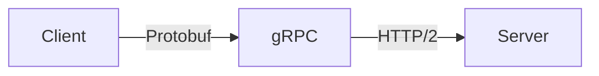

# Networking
{: .no_toc }

<details open markdown="block">
  <summary>Table of Contents</summary>
  {: .text-delta }
1. TOC
{:toc}
</details>

---

## 🎯 Why Networking Matters

Every system design involves machines talking to each other over a network. Understanding networking helps you:

- Estimate latency between services
- Choose the right communication protocol
- Design for network failures
- Optimize data transfer

---

## The OSI Model (Simplified)

You don't need all 7 layers. Focus on these:

| Layer | Name | What You Need to Know |
|-------|------|----------------------|
| 7 | Application | HTTP, gRPC, WebSocket |
| 4 | Transport | TCP vs UDP |
| 3 | Network | IP addresses, routing |
| 2 | Data Link | MAC addresses, switches |
| 1 | Physical | Cables, signals |


---

## TCP vs UDP

### TCP (Transmission Control Protocol)

**Reliable, ordered delivery.** Like registered mail with tracking.


| Feature | TCP |
|---------|-----|
| **Reliability** | ✅ Guaranteed delivery |
| **Ordering** | ✅ Packets arrive in order |
| **Flow control** | ✅ Prevents overwhelming receiver |
| **Overhead** | Higher (connection setup, ACKs) |

**Use for:** Web pages, APIs, file transfers, emails - anything where you can't lose data.

### UDP (User Datagram Protocol)

**Fast, unreliable delivery.** Like throwing postcards in the mail.


| Feature | UDP |
|---------|-----|
| **Reliability** | ❌ Packets can be lost |
| **Ordering** | ❌ Packets may arrive out of order |
| **Flow control** | ❌ None |
| **Overhead** | Low (no connection, no ACKs) |

**Use for:** Video streaming, gaming, VoIP - where speed matters more than occasional packet loss.

### Quick Comparison

| Aspect | TCP | UDP |
|--------|-----|-----|
| **Connection** | Connection-oriented | Connectionless |
| **Speed** | Slower | Faster |
| **Reliability** | Guaranteed | Best-effort |
| **Use case** | HTTP, databases | Video, gaming, DNS |

{: .tip }
> In system design interviews, assume TCP unless you have a specific reason for UDP (real-time, high throughput with acceptable loss).

---

## HTTP/HTTPS

### HTTP Basics

The protocol of the web. Request-response pattern.

```http
GET /api/users/123 HTTP/1.1
Host: api.example.com
Authorization: Bearer token123
Accept: application/json
```

```http
HTTP/1.1 200 OK
Content-Type: application/json
Content-Length: 52

{"id": 123, "name": "Alice", "email": "alice@example.com"}
```

### HTTP Methods

| Method | Purpose | Idempotent? |
|--------|---------|-------------|
| **GET** | Retrieve data | ✅ Yes |
| **POST** | Create resource | ❌ No |
| **PUT** | Update/replace resource | ✅ Yes |
| **PATCH** | Partial update | ❌ No |
| **DELETE** | Remove resource | ✅ Yes |

### HTTP Status Codes

| Range | Category | Common Codes |
|-------|----------|--------------|
| **2xx** | Success | 200 OK, 201 Created, 204 No Content |
| **3xx** | Redirect | 301 Moved, 302 Found, 304 Not Modified |
| **4xx** | Client Error | 400 Bad Request, 401 Unauthorized, 404 Not Found |
| **5xx** | Server Error | 500 Internal Error, 502 Bad Gateway, 503 Unavailable |

### HTTP Versions

| Version | Key Feature |
|---------|-------------|
| **HTTP/1.0** | One request per connection |
| **HTTP/1.1** | Keep-alive connections, pipelining |
| **HTTP/2** | Multiplexing, header compression, server push |
| **HTTP/3** | UDP-based (QUIC), faster connection setup |


### HTTPS

HTTP + TLS encryption. Always use HTTPS.


---

## REST APIs

**Representational State Transfer** - architectural style for web APIs.

### REST Principles

| Principle | Meaning |
|-----------|---------|
| **Stateless** | Each request contains all needed info |
| **Client-Server** | Separation of concerns |
| **Cacheable** | Responses indicate if cacheable |
| **Uniform Interface** | Consistent URL structure |

### REST URL Design

```
GET    /users           → List all users
GET    /users/123       → Get user 123
POST   /users           → Create new user
PUT    /users/123       → Update user 123
DELETE /users/123       → Delete user 123

GET    /users/123/orders    → Get user 123's orders
POST   /users/123/orders    → Create order for user 123
```

### REST vs RPC Style

| REST | RPC |
|------|-----|
| `/users/123` | `/getUser?id=123` |
| `POST /orders` | `/createOrder` |
| Resource-oriented | Action-oriented |

---

## gRPC

**Google's Remote Procedure Call** - high-performance, binary protocol.



### REST vs gRPC

| Aspect | REST | gRPC |
|--------|------|------|
| **Protocol** | HTTP/1.1 or 2 | HTTP/2 |
| **Format** | JSON (text) | Protobuf (binary) |
| **Speed** | Slower | Faster |
| **Streaming** | Limited | Built-in |
| **Browser support** | Native | Requires proxy |

### When to Use gRPC

- **Microservices communication** (internal)
- **High-performance requirements**
- **Streaming data**
- **Polyglot environments** (multiple languages)

### When to Use REST

- **Public APIs** (broader compatibility)
- **Browser clients** (no proxy needed)
- **Simple CRUD operations**
- **Human-readable debugging**

---

## WebSockets

**Full-duplex, persistent connections** for real-time communication.


### HTTP vs WebSocket

| Aspect | HTTP | WebSocket |
|--------|------|-----------|
| **Connection** | Short-lived | Persistent |
| **Direction** | Request-response | Bidirectional |
| **Overhead** | Headers each request | Low after handshake |
| **Server push** | Polling needed | Native |

### Use Cases

| Use Case | Best Choice |
|----------|-------------|
| **Chat applications** | WebSocket |
| **Live notifications** | WebSocket or SSE |
| **Stock tickers** | WebSocket |
| **Form submission** | HTTP |
| **File upload** | HTTP |
| **REST API** | HTTP |

### Server-Sent Events (SSE)

One-way server-to-client streaming over HTTP.

```
Client → Server: GET /events (keeps connection open)
Server → Client: data: {"price": 100}\n\n
Server → Client: data: {"price": 101}\n\n
Server → Client: data: {"price": 99}\n\n
```

| WebSocket | SSE |
|-----------|-----|
| Bidirectional | Server → Client only |
| Custom protocol | Plain HTTP |
| More complex | Simpler |

---

## DNS (Domain Name System)

**Translates domain names to IP addresses.**


### DNS Record Types

| Type | Purpose | Example |
|------|---------|---------|
| **A** | Domain → IPv4 | `example.com → 93.184.216.34` |
| **AAAA** | Domain → IPv6 | `example.com → 2606:2800:...` |
| **CNAME** | Alias to another domain | `www.example.com → example.com` |
| **MX** | Mail server | `example.com → mail.example.com` |
| **TXT** | Text records | SPF, DKIM verification |
| **NS** | Name servers | `example.com → ns1.example.com` |

### DNS in System Design

**Load balancing via DNS:**
```
example.com → 10.0.0.1
example.com → 10.0.0.2
example.com → 10.0.0.3
(Round-robin rotation)
```

**Geographic routing:**
```
US users → us.example.com → US datacenter
EU users → eu.example.com → EU datacenter
```

### TTL (Time To Live)

How long DNS records are cached.

| TTL | Use Case |
|-----|----------|
| **Short (60s)** | Frequent changes, failover |
| **Long (86400s)** | Stable records, reduce DNS load |

---

## Proxies

### Forward Proxy

Sits between clients and the internet. Clients know about it.


**Use cases:** Corporate firewalls, content filtering, anonymity.

### Reverse Proxy

Sits between internet and servers. Clients don't know about it.


**Use cases:**
- **Load balancing** - Distribute traffic
- **SSL termination** - Handle encryption
- **Caching** - Cache responses
- **Security** - Hide backend servers

### Common Reverse Proxies

| Tool | Strengths |
|------|-----------|
| **Nginx** | Fast, widely used |
| **HAProxy** | High performance, TCP/HTTP |
| **Traefik** | Container-native, auto-discovery |
| **Envoy** | Modern, service mesh ready |

---

## Key Network Metrics

### Latency

Time for a packet to travel from source to destination.

```
Same datacenter:    <1ms
Same region:        1-10ms
Cross-region:       50-100ms
Cross-continent:    100-200ms
```

### Bandwidth

Maximum data transfer rate.

```
1 Gbps = 125 MB/second
10 Gbps = 1.25 GB/second
```

### Throughput

Actual data transfer rate (often less than bandwidth).

```
Bandwidth: 1 Gbps (theoretical max)
Throughput: 800 Mbps (actual, due to overhead)
```

### Back-of-Envelope

```
Reading 1 MB sequentially from memory: 250 μs
Reading 1 MB sequentially from SSD:    1 ms
Reading 1 MB over 1 Gbps network:      10 ms
Reading 1 MB from disk (seek):         20 ms

Round trip within datacenter:          0.5 ms
Round trip CA → Netherlands:           150 ms
```

{: .tip }
> In interviews, estimate network latency as ~1ms within datacenter, ~100ms across continents.

---

## Network Failures

### Common Failure Modes

| Failure | Description | Impact |
|---------|-------------|--------|
| **Packet loss** | Data doesn't arrive | Retransmission, delay |
| **High latency** | Slow response | Timeouts, poor UX |
| **Partition** | Network split | CAP theorem applies |
| **DNS failure** | Can't resolve names | Service unreachable |

### Handling Failures

```python
# Timeouts - don't wait forever
response = requests.get(url, timeout=5)

# Retries with exponential backoff
for attempt in range(3):
    try:
        return make_request()
    except NetworkError:
        time.sleep(2 ** attempt)  # 1s, 2s, 4s

# Circuit breaker - stop calling failing services
if circuit_breaker.is_open():
    return fallback_response()
```

---

## Interview Tips

### Common Questions

1. **"How do clients communicate with your service?"**
   - REST/HTTP for public APIs
   - gRPC for internal microservices
   - WebSocket for real-time features

2. **"How do you handle network failures?"**
   - Timeouts, retries, circuit breakers
   - Idempotency for safe retries
   - Graceful degradation

3. **"How do you reduce latency?"**
   - CDN for static content
   - Geographic distribution
   - Caching at multiple levels
   - Keep connections alive (HTTP/2)

### Red Flags to Avoid

- Ignoring network latency in estimates
- Not considering timeouts and retries
- Assuming network is reliable
- Using WebSocket for everything

---

## Quick Reference

```
PROTOCOLS
├── TCP  → Reliable, ordered (HTTP, databases)
├── UDP  → Fast, unreliable (video, gaming)
├── HTTP → Request-response, stateless
├── gRPC → Binary, fast, streaming
└── WebSocket → Bidirectional, real-time

DNS RECORDS
├── A     → Domain to IPv4
├── CNAME → Alias to another domain
├── MX    → Mail server
└── TXT   → Text records

PROXIES
├── Forward → Client-side, privacy
└── Reverse → Server-side, load balancing

LATENCY ESTIMATES
├── Same datacenter:   <1ms
├── Same region:       1-10ms
├── Cross-region:      50-100ms
└── Cross-continent:   100-200ms
```

---

## Summary

| Concept | Key Point |
|---------|-----------|
| **TCP vs UDP** | TCP for reliability, UDP for speed |
| **HTTP** | Stateless, request-response |
| **gRPC** | High-performance microservices |
| **WebSocket** | Real-time bidirectional |
| **DNS** | Domain to IP translation |
| **Reverse Proxy** | Load balancing, SSL, caching |
| **Latency** | ~1ms datacenter, ~100ms cross-continent |

