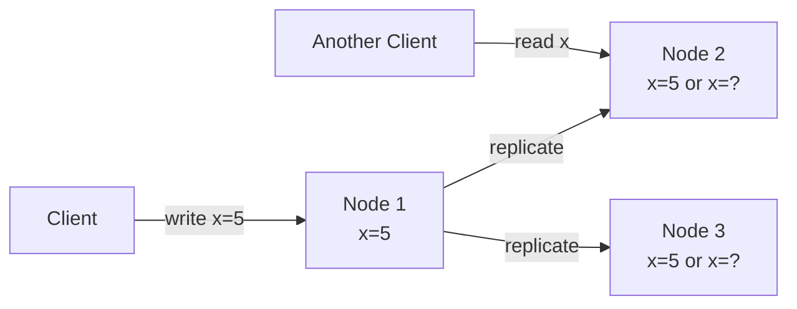
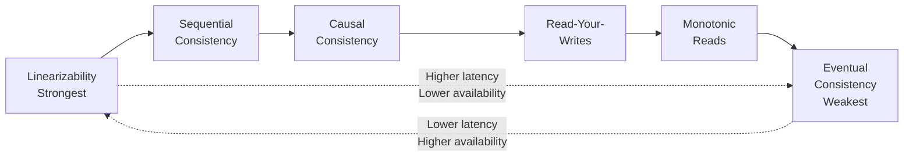
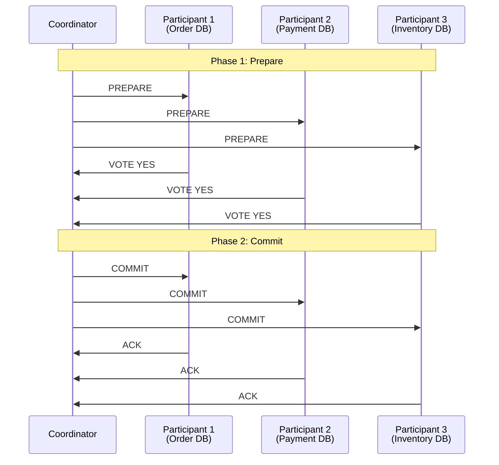
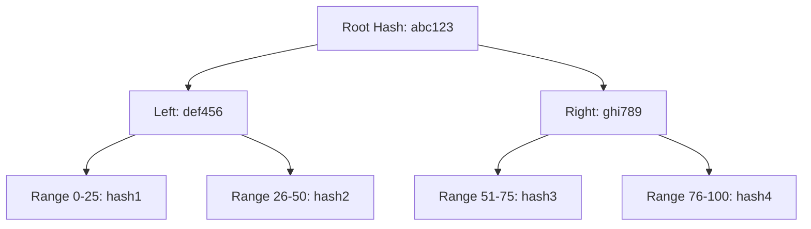
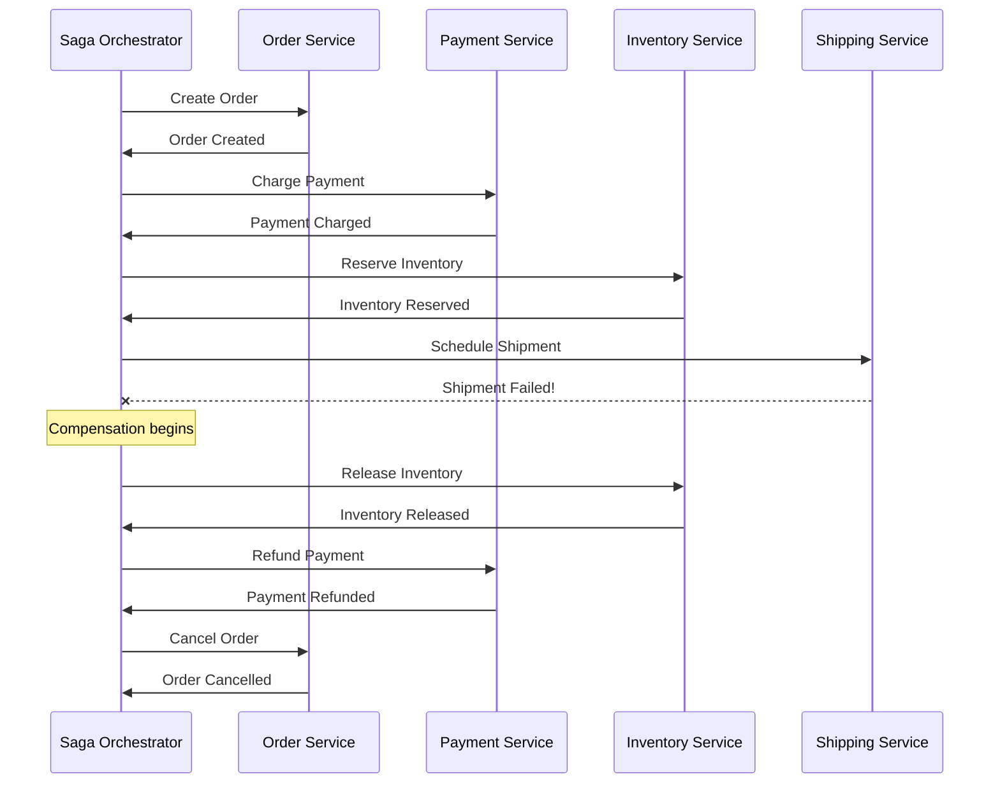
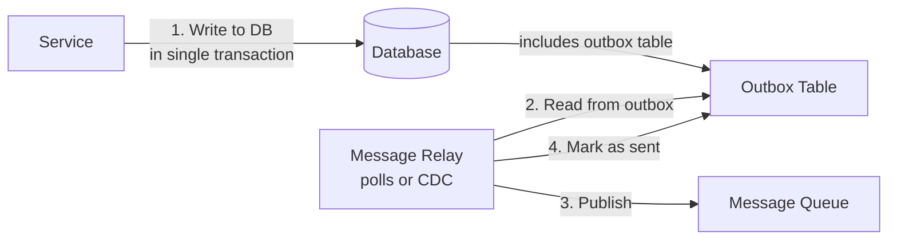
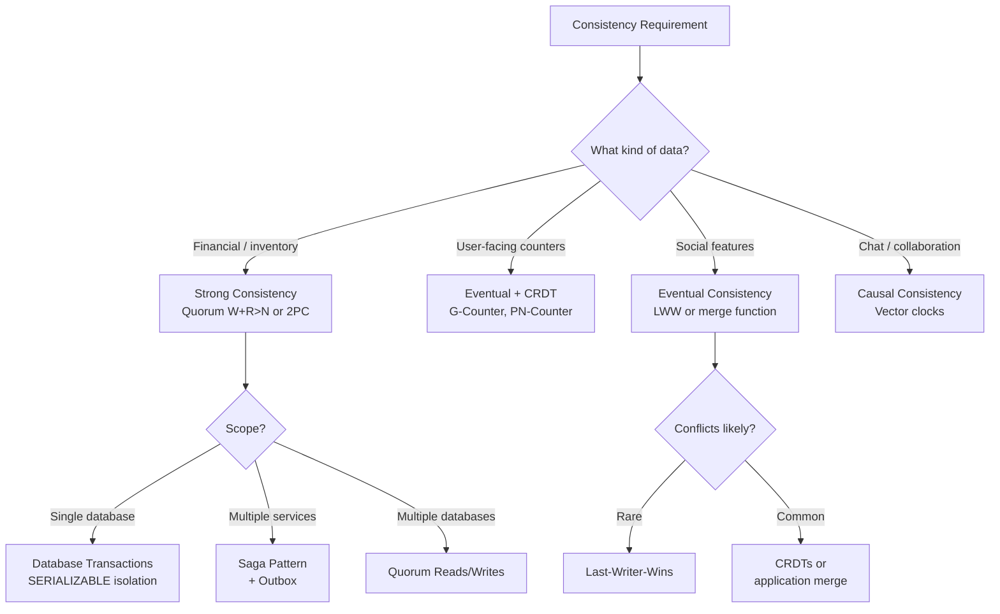

# Consistency Patterns

---

## Why Consistency Is Hard

In a distributed system, data is replicated across multiple nodes for availability and performance. The fundamental challenge: when data changes on one node, how and when do other nodes see the change? The answer defines your consistency model — and choosing the wrong one leads to either data corruption or unnecessary performance penalties.



Between the moment Node 1 accepts the write and the moment Nodes 2 and 3 receive it, clients reading from those nodes may see stale data. How you handle this window defines everything.

---

## The Consistency Spectrum

Consistency is not binary. It's a spectrum from strongest to weakest guarantees, with corresponding trade-offs in latency and availability.



| Model | Guarantee | Latency | Availability |
|-------|-----------|---------|-------------|
| **Linearizability** | Reads always return the most recent write | Highest | Lowest |
| **Sequential** | All nodes see operations in the same total order | High | Low |
| **Causal** | Causally related operations are seen in order | Medium | Medium |
| **Read-your-writes** | A client always sees its own writes | Medium | Medium |
| **Monotonic reads** | A client never sees a value older than what it already saw | Low | High |
| **Eventual** | All replicas eventually converge | Lowest | Highest |

---

## Strong Consistency (Linearizability)

Linearizability makes a distributed system behave as if there is only one copy of the data. Every read returns the value of the most recent completed write, regardless of which node handles the request.

### How It Works: Quorum Reads and Writes

The most common implementation uses **quorum** operations:

```
N = total replicas
W = write quorum (number of acks needed to confirm a write)
R = read quorum (number of responses needed to confirm a read)

Strong consistency requires: W + R > N
```

```mermaid
flowchart TD
    subgraph Write Quorum (W=2, N=3)
        W_CLIENT[Client Write] --> WN1[Node 1 ✓]
        W_CLIENT --> WN2[Node 2 ✓]
        W_CLIENT --> WN3[Node 3 ✗ slow]
        WN1 -->|ack| W_CLIENT
        WN2 -->|ack| W_CLIENT
    end
    
    subgraph Read Quorum (R=2, N=3)
        R_CLIENT[Client Read] --> RN1[Node 1: v=5]
        R_CLIENT --> RN2[Node 2: v=5]
        R_CLIENT --> RN3[Node 3: v=3 stale]
        RN1 -->|v=5| R_CLIENT
        RN2 -->|v=5| R_CLIENT
    end
```

With W=2, R=2, N=3: at least one node in any read quorum must have the latest write. The client takes the value with the highest version number.

### Two-Phase Commit (2PC)

2PC is a distributed transaction protocol that ensures all participants either commit or abort a transaction — maintaining strong consistency across multiple databases.



**Problems with 2PC:**

| Problem | Description |
|---------|-------------|
| **Blocking** | If the coordinator crashes after Phase 1, participants are stuck holding locks |
| **Latency** | Two network round trips minimum |
| **Availability** | Any participant failure blocks the entire transaction |
| **Single point of failure** | Coordinator crash is catastrophic |

!!! warning
    2PC is widely used within a single data center but is problematic across wide-area networks. For cross-service transactions in microservices, prefer the **saga pattern** instead.

### Java Example: Quorum-Based Read/Write

```java
import java.util.ArrayList;
import java.util.Comparator;
import java.util.List;
import java.util.concurrent.CompletableFuture;
import java.util.concurrent.TimeUnit;

/**
 * Quorum-based replicated store with configurable consistency levels.
 * Demonstrates how W + R > N achieves strong consistency.
 */
public class QuorumStore {

    public record VersionedValue(String value, long version, long timestamp) {}

    private final List<ReplicaClient> replicas;
    private final int writeQuorum;
    private final int readQuorum;

    public QuorumStore(List<ReplicaClient> replicas, int writeQuorum, int readQuorum) {
        this.replicas = replicas;
        this.writeQuorum = writeQuorum;
        this.readQuorum = readQuorum;

        int n = replicas.size();
        if (writeQuorum + readQuorum <= n) {
            throw new IllegalArgumentException(
                "W + R must be > N for strong consistency. " +
                "W=" + writeQuorum + " R=" + readQuorum + " N=" + n
            );
        }
    }

    public boolean write(String key, String value) {
        long version = System.nanoTime();
        VersionedValue vv = new VersionedValue(value, version, System.currentTimeMillis());

        int acks = 0;
        List<CompletableFuture<Boolean>> futures = new ArrayList<>();

        for (ReplicaClient replica : replicas) {
            futures.add(CompletableFuture.supplyAsync(() -> {
                try {
                    return replica.write(key, vv);
                } catch (Exception e) {
                    return false;
                }
            }));
        }

        for (CompletableFuture<Boolean> future : futures) {
            try {
                if (future.get(500, TimeUnit.MILLISECONDS)) acks++;
            } catch (Exception e) { /* replica unreachable */ }
        }

        return acks >= writeQuorum;
    }

    public String read(String key) {
        List<CompletableFuture<VersionedValue>> futures = new ArrayList<>();

        for (ReplicaClient replica : replicas) {
            futures.add(CompletableFuture.supplyAsync(() -> {
                try {
                    return replica.read(key);
                } catch (Exception e) {
                    return null;
                }
            }));
        }

        List<VersionedValue> responses = new ArrayList<>();
        for (CompletableFuture<VersionedValue> future : futures) {
            try {
                VersionedValue vv = future.get(500, TimeUnit.MILLISECONDS);
                if (vv != null) responses.add(vv);
            } catch (Exception e) { /* replica unreachable */ }
        }

        if (responses.size() < readQuorum) {
            throw new InsufficientReplicasException(
                "Only " + responses.size() + "/" + readQuorum + " replicas responded"
            );
        }

        // return the value with the highest version (most recent write)
        VersionedValue latest = responses.stream()
            .max(Comparator.comparingLong(VersionedValue::version))
            .orElseThrow();

        // read repair: update stale replicas asynchronously
        for (ReplicaClient replica : replicas) {
            CompletableFuture.runAsync(() -> replica.write(key, latest));
        }

        return latest.value();
    }
}
```

---

## Eventual Consistency

With eventual consistency, updates propagate asynchronously. Replicas may return stale data temporarily, but will eventually converge to the same value if no new updates are made.

### Conflict Resolution Strategies

When two replicas accept conflicting writes before synchronizing, you need a strategy to resolve the conflict.

| Strategy | How It Works | Pros | Cons |
|----------|-------------|------|------|
| **Last-Writer-Wins (LWW)** | Highest timestamp wins | Simple, deterministic | Data loss (losing write is silently discarded) |
| **Multi-Value (siblings)** | Keep all conflicting values, let client resolve | No data loss | Client complexity |
| **Merge function** | Application-specific merge logic | Domain-appropriate | Complex to implement correctly |
| **CRDTs** | Mathematically guaranteed conflict-free merge | Automatic resolution | Limited data types |

### Java Example: Last-Writer-Wins Register

```java
public class LWWRegister<T> {
    private volatile T value;
    private volatile long timestamp;

    public LWWRegister(T initialValue) {
        this.value = initialValue;
        this.timestamp = System.nanoTime();
    }

    public synchronized void update(T newValue, long newTimestamp) {
        if (newTimestamp > this.timestamp) {
            this.value = newValue;
            this.timestamp = newTimestamp;
        }
    }

    public T getValue() { return value; }
    public long getTimestamp() { return timestamp; }

    /**
     * Merge with a remote replica's state.
     * The value with the higher timestamp wins.
     */
    public synchronized void merge(LWWRegister<T> remote) {
        if (remote.timestamp > this.timestamp) {
            this.value = remote.value;
            this.timestamp = remote.timestamp;
        }
    }
}
```

### Anti-Entropy: Read Repair and Merkle Trees

**Read Repair:** When a read reveals stale replicas (during a quorum read), the coordinator sends the latest value to the stale replicas in the background.

**Merkle Trees:** To detect which data ranges are inconsistent between replicas without comparing every record, use Merkle trees — hash trees where each leaf is a hash of a data range, and each parent is a hash of its children. Two replicas only need to compare tree roots; if they differ, walk down the tree to find the exact divergent ranges.



---

## Causal Consistency

Causal consistency preserves the ordering of causally related operations while allowing concurrent (independent) operations to be seen in any order.

### What Is "Causally Related"?

Two operations are causally related if:
1. They are performed by the same client (read-your-writes)
2. One reads the result of the other
3. They are transitively linked through other causal relationships

**Example:**

```
Alice writes: "Anyone want to grab lunch?"        (op A)
Bob reads Alice's message, then writes: "Sure!"    (op B, caused by A)
Charlie writes: "Great weather today!"             (op C, independent)
```

Operations A and B are causally related (B depends on A). Operation C is independent — it can be seen before or after A and B on any replica, but B must always be seen after A.

### Go Example: Causal Consistency with Lamport Timestamps

```go
package consistency

import (
	"sync"
	"sync/atomic"
)

// LamportClock provides a logical clock for causal ordering.
type LamportClock struct {
	counter atomic.Int64
}

func NewLamportClock() *LamportClock {
	return &LamportClock{}
}

// Tick increments the clock for a local event and returns the new timestamp.
func (c *LamportClock) Tick() int64 {
	return c.counter.Add(1)
}

// Receive updates the clock on receiving a message from another node.
// The clock is set to max(local, remote) + 1.
func (c *LamportClock) Receive(remoteTimestamp int64) int64 {
	for {
		local := c.counter.Load()
		newVal := max(local, remoteTimestamp) + 1
		if c.counter.CompareAndSwap(local, newVal) {
			return newVal
		}
	}
}

func max(a, b int64) int64 {
	if a > b {
		return a
	}
	return b
}

// CausalKVStore enforces causal consistency by tracking dependencies.
type CausalKVStore struct {
	mu    sync.RWMutex
	data  map[string]VersionedEntry
	clock *LamportClock
}

type VersionedEntry struct {
	Value     string
	Timestamp int64
	DependsOn []int64 // timestamps of operations this depends on
}

func NewCausalKVStore() *CausalKVStore {
	return &CausalKVStore{
		data:  make(map[string]VersionedEntry),
		clock: NewLamportClock(),
	}
}

// Put writes a value with causal dependency tracking.
func (s *CausalKVStore) Put(key, value string, causalDeps []int64) int64 {
	s.mu.Lock()
	defer s.mu.Unlock()

	ts := s.clock.Tick()
	s.data[key] = VersionedEntry{
		Value:     value,
		Timestamp: ts,
		DependsOn: causalDeps,
	}
	return ts
}

// Get reads a value, returning it only if all its causal dependencies are satisfied.
func (s *CausalKVStore) Get(key string) (VersionedEntry, bool) {
	s.mu.RLock()
	defer s.mu.RUnlock()

	entry, ok := s.data[key]
	return entry, ok
}

// ApplyRemote applies a write from a remote replica, respecting causal order.
func (s *CausalKVStore) ApplyRemote(key string, entry VersionedEntry) bool {
	s.mu.Lock()
	defer s.mu.Unlock()

	// check if all causal dependencies are satisfied locally
	for _, dep := range entry.DependsOn {
		if !s.isDependencySatisfied(dep) {
			return false // buffer and retry later
		}
	}

	s.clock.Receive(entry.Timestamp)
	existing, exists := s.data[key]
	if !exists || entry.Timestamp > existing.Timestamp {
		s.data[key] = entry
	}
	return true
}

func (s *CausalKVStore) isDependencySatisfied(ts int64) bool {
	for _, entry := range s.data {
		if entry.Timestamp == ts {
			return true
		}
	}
	return false
}
```

---

## CRDTs (Conflict-Free Replicated Data Types)

CRDTs are data structures that can be replicated across nodes and updated independently without coordination. They are mathematically guaranteed to converge to the same state when all updates are propagated.

### Types of CRDTs

| Type | CRDT | Description | Use Case |
|------|------|-------------|----------|
| **Counter** | G-Counter | Grow-only counter (each node tracks its own count) | Page views, likes |
| **Counter** | PN-Counter | Increment and decrement (two G-Counters) | Cart item quantity |
| **Set** | G-Set | Grow-only set (add, never remove) | Tag collection |
| **Set** | OR-Set | Observed-Remove set (add and remove) | Shopping cart items |
| **Register** | LWW-Register | Last-writer-wins register | User profile fields |
| **Map** | LWW-Map | Map of LWW-Registers | User preferences |

### Java Example: G-Counter and PN-Counter

```java
import java.util.Collections;
import java.util.Map;
import java.util.concurrent.ConcurrentHashMap;

/**
 * G-Counter: a grow-only distributed counter.
 * Each node maintains its own increment count.
 * The total value is the sum of all nodes' counts.
 */
public class GCounter {
    private final String nodeId;
    private final Map<String, Long> counts;

    public GCounter(String nodeId) {
        this.nodeId = nodeId;
        this.counts = new ConcurrentHashMap<>();
        this.counts.put(nodeId, 0L);
    }

    public void increment() {
        counts.merge(nodeId, 1L, Long::sum);
    }

    public long value() {
        return counts.values().stream().mapToLong(Long::longValue).sum();
    }

    public void merge(GCounter other) {
        for (Map.Entry<String, Long> entry : other.counts.entrySet()) {
            counts.merge(entry.getKey(), entry.getValue(), Math::max);
        }
    }

    public Map<String, Long> state() {
        return Collections.unmodifiableMap(counts);
    }
}

/**
 * PN-Counter: supports both increment and decrement.
 * Internally uses two G-Counters: one for increments, one for decrements.
 */
public class PNCounter {
    private final GCounter positive;
    private final GCounter negative;

    public PNCounter(String nodeId) {
        this.positive = new GCounter(nodeId);
        this.negative = new GCounter(nodeId);
    }

    public void increment() { positive.increment(); }
    public void decrement() { negative.increment(); }

    public long value() {
        return positive.value() - negative.value();
    }

    public void merge(PNCounter other) {
        positive.merge(other.positive);
        negative.merge(other.negative);
    }
}

// Usage: distributed page view counter
public class DistributedViewCounter {
    public static void main(String[] args) {
        GCounter node1 = new GCounter("node-1");
        GCounter node2 = new GCounter("node-2");
        GCounter node3 = new GCounter("node-3");

        node1.increment(); // node-1 sees 1 view
        node1.increment(); // node-1 sees another
        node2.increment(); // node-2 sees 1 view
        node3.increment(); // node-3 sees 1 view
        node3.increment();
        node3.increment();

        // before merge: each node has partial count
        // node1.value() = 2, node2.value() = 1, node3.value() = 3

        // after merge: all nodes converge to total
        node1.merge(node2);
        node1.merge(node3);
        // node1.value() = 6 (total across all nodes)
    }
}
```

### Python Example: OR-Set (Observed-Remove Set)

```python
from dataclasses import dataclass, field
from typing import Any
import uuid

@dataclass
class ORSet:
    """
    Observed-Remove Set: supports both add and remove operations
    without conflicts. Each add creates a unique tag; remove removes
    all currently observed tags for an element.
    """
    _adds: dict[Any, set[str]] = field(default_factory=dict)
    _removes: dict[Any, set[str]] = field(default_factory=dict)

    def add(self, element: Any) -> str:
        tag = str(uuid.uuid4())
        if element not in self._adds:
            self._adds[element] = set()
        self._adds[element].add(tag)
        return tag

    def remove(self, element: Any) -> None:
        if element in self._adds:
            removed_tags = self._adds[element].copy()
            if element not in self._removes:
                self._removes[element] = set()
            self._removes[element].update(removed_tags)

    def contains(self, element: Any) -> bool:
        add_tags = self._adds.get(element, set())
        remove_tags = self._removes.get(element, set())
        return bool(add_tags - remove_tags)

    def elements(self) -> set:
        result = set()
        for element, add_tags in self._adds.items():
            remove_tags = self._removes.get(element, set())
            if add_tags - remove_tags:
                result.add(element)
        return result

    def merge(self, other: 'ORSet') -> None:
        for elem, tags in other._adds.items():
            if elem not in self._adds:
                self._adds[elem] = set()
            self._adds[elem].update(tags)

        for elem, tags in other._removes.items():
            if elem not in self._removes:
                self._removes[elem] = set()
            self._removes[elem].update(tags)

# Usage: distributed shopping cart
cart_node1 = ORSet()
cart_node2 = ORSet()

cart_node1.add("item-A")
cart_node1.add("item-B")
cart_node2.add("item-C")
cart_node2.remove("item-A")  # no effect: node2 hasn't seen item-A's tag

cart_node1.merge(cart_node2)
cart_node2.merge(cart_node1)

print(cart_node1.elements())  # {'item-A', 'item-B', 'item-C'}
print(cart_node2.elements())  # {'item-A', 'item-B', 'item-C'}
```

---

## Distributed Transactions: Saga Pattern

In microservices, you cannot use traditional database transactions across services (each service owns its database). The saga pattern coordinates multi-service transactions through a sequence of local transactions with compensating actions.

### Choreography-Based Saga

Each service publishes events and listens for events from other services.

```mermaid
flowchart LR
    OS[Order Service<br/>Create Order] -->|OrderCreated| E1[Event Bus]
    E1 --> PS[Payment Service<br/>Charge Payment]
    PS -->|PaymentCharged| E2[Event Bus]
    E2 --> IS[Inventory Service<br/>Reserve Stock]
    IS -->|StockReserved| E3[Event Bus]
    E3 --> SS[Shipping Service<br/>Schedule Delivery]
    
    SS -->|ShippingFailed| E4[Event Bus]
    E4 --> IS2[Inventory Service<br/>Release Stock]
    IS2 -->|StockReleased| E5[Event Bus]
    E5 --> PS2[Payment Service<br/>Refund Payment]
```



### Orchestration-Based Saga

A central orchestrator tells each service what to do.



### Java Example: Saga Orchestrator

```java
import java.util.ArrayList;
import java.util.List;
import java.util.function.Supplier;

public class OrderSagaOrchestrator {

    public enum SagaState {
        STARTED, ORDER_CREATED, PAYMENT_CHARGED, INVENTORY_RESERVED,
        SHIPPING_SCHEDULED, COMPLETED, COMPENSATING, FAILED
    }

    public record SagaStep(
        String name,
        Supplier<Boolean> action,
        Runnable compensate
    ) {}

    private final List<SagaStep> steps;
    private final List<SagaStep> completedSteps = new ArrayList<>();
    private SagaState state = SagaState.STARTED;

    public OrderSagaOrchestrator(OrderService orders, PaymentService payments,
                                  InventoryService inventory, ShippingService shipping,
                                  String orderId) {
        this.steps = List.of(
            new SagaStep("create-order",
                () -> orders.createOrder(orderId),
                () -> orders.cancelOrder(orderId)),
            new SagaStep("charge-payment",
                () -> payments.charge(orderId),
                () -> payments.refund(orderId)),
            new SagaStep("reserve-inventory",
                () -> inventory.reserve(orderId),
                () -> inventory.release(orderId)),
            new SagaStep("schedule-shipping",
                () -> shipping.schedule(orderId),
                () -> shipping.cancel(orderId))
        );
    }

    public SagaState execute() {
        for (SagaStep step : steps) {
            try {
                boolean success = step.action().get();
                if (!success) {
                    compensate();
                    return state = SagaState.FAILED;
                }
                completedSteps.add(step);
            } catch (Exception e) {
                compensate();
                return state = SagaState.FAILED;
            }
        }
        return state = SagaState.COMPLETED;
    }

    private void compensate() {
        state = SagaState.COMPENSATING;
        // compensate in reverse order
        for (int i = completedSteps.size() - 1; i >= 0; i--) {
            try {
                completedSteps.get(i).compensate().run();
            } catch (Exception e) {
                // log and alert — compensation failure needs manual intervention
            }
        }
    }
}
```

### Choreography vs Orchestration

| Factor | Choreography | Orchestration |
|--------|-------------|---------------|
| **Coupling** | Loose (services only know events) | Tighter (orchestrator knows all services) |
| **Visibility** | Hard to trace the full flow | Easy to see the entire saga |
| **Complexity** | Distributed across services | Centralized in orchestrator |
| **Failure handling** | Each service handles its own compensation | Orchestrator drives compensation |
| **Testing** | Harder (distributed events) | Easier (single orchestrator) |
| **Best for** | Simple sagas, few steps | Complex sagas, many steps |

---

## Transactional Outbox Pattern

The outbox pattern ensures that a database write and a message publish happen atomically — without 2PC.



**How it works:**
1. Service writes business data **and** an outbox record in a single local database transaction
2. A separate process (relay) reads unpublished outbox records and publishes them to the message queue
3. After successful publish, the relay marks the outbox record as sent
4. The relay is idempotent — if it crashes, it re-reads and re-publishes (consumers must be idempotent)

### Go Example: Transactional Outbox

```go
package outbox

import (
	"context"
	"database/sql"
	"encoding/json"
	"time"
)

type OutboxMessage struct {
	ID            string
	AggregateType string
	AggregateID   string
	EventType     string
	Payload       json.RawMessage
	CreatedAt     time.Time
	PublishedAt   *time.Time
}

type OutboxWriter struct {
	db *sql.DB
}

// WriteWithOutbox performs a business operation and writes an outbox
// message in a single database transaction.
func (w *OutboxWriter) WriteWithOutbox(ctx context.Context,
	businessFn func(tx *sql.Tx) error,
	event OutboxMessage) error {

	tx, err := w.db.BeginTx(ctx, nil)
	if err != nil {
		return err
	}
	defer tx.Rollback()

	// execute business logic within the transaction
	if err := businessFn(tx); err != nil {
		return err
	}

	// write outbox message in the same transaction
	payload, _ := json.Marshal(event.Payload)
	_, err = tx.ExecContext(ctx, `
		INSERT INTO outbox_messages
			(id, aggregate_type, aggregate_id, event_type, payload, created_at)
		VALUES ($1, $2, $3, $4, $5, $6)`,
		event.ID, event.AggregateType, event.AggregateID,
		event.EventType, payload, time.Now(),
	)
	if err != nil {
		return err
	}

	return tx.Commit()
}

type OutboxRelay struct {
	db        *sql.DB
	publisher MessagePublisher
	batchSize int
}

// PollAndPublish reads unpublished outbox messages and publishes them.
func (r *OutboxRelay) PollAndPublish(ctx context.Context) (int, error) {
	rows, err := r.db.QueryContext(ctx, `
		SELECT id, aggregate_type, aggregate_id, event_type, payload
		FROM outbox_messages
		WHERE published_at IS NULL
		ORDER BY created_at ASC
		LIMIT $1
		FOR UPDATE SKIP LOCKED`, r.batchSize)
	if err != nil {
		return 0, err
	}
	defer rows.Close()

	published := 0
	for rows.Next() {
		var msg OutboxMessage
		if err := rows.Scan(&msg.ID, &msg.AggregateType,
			&msg.AggregateID, &msg.EventType, &msg.Payload); err != nil {
			continue
		}

		if err := r.publisher.Publish(ctx, msg); err != nil {
			continue // will be retried on next poll
		}

		_, _ = r.db.ExecContext(ctx,
			`UPDATE outbox_messages SET published_at = $1 WHERE id = $2`,
			time.Now(), msg.ID)
		published++
	}
	return published, nil
}
```

---

## Choosing the Right Consistency Pattern



### Quick Reference for Interviews

| Scenario | Pattern | Why |
|----------|---------|-----|
| Bank account balance | Strong (quorum) | Cannot show wrong balance or allow overdraft |
| Shopping cart | Eventual (OR-Set CRDT) | Availability matters more; merge conflicts automatically |
| Social media likes | Eventual (G-Counter CRDT) | Approximate count is fine; high availability needed |
| Order processing across services | Saga with outbox | Cannot use 2PC across microservices |
| Chat message ordering | Causal consistency | Messages must appear in conversation order |
| DNS records | Eventual (TTL-based) | Reads heavily outnumber writes; staleness is acceptable |
| Leader election | Strong (Raft/Paxos) | Exactly one leader at any time is critical |
| User session data | Read-your-writes | User must see their own changes immediately |

!!! important
    In interviews, never say "we need strong consistency" without explaining the cost. Always frame it as: "For this specific data, strong consistency is worth the latency penalty because [reason]. For other data in the system, we can use eventual consistency to improve performance."

---

## Further Reading

| Topic | Resource |
|-------|----------|
| Designing Data-Intensive Applications | Martin Kleppmann — Chapters 5, 7, 9 |
| CRDTs | [crdt.tech](https://crdt.tech/) |
| Saga Pattern | [microservices.io/patterns/data/saga](https://microservices.io/patterns/data/saga.html) |
| Jepsen (correctness testing) | [jepsen.io](https://jepsen.io/) |
| Consistency Models | [jepsen.io/consistency](https://jepsen.io/consistency) |
| Transactional Outbox | [microservices.io/patterns/data/transactional-outbox](https://microservices.io/patterns/data/transactional-outbox.html) |
