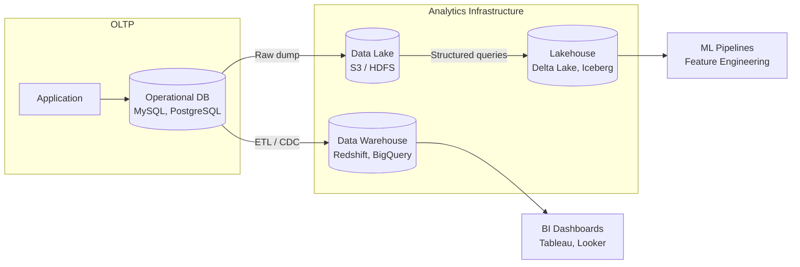
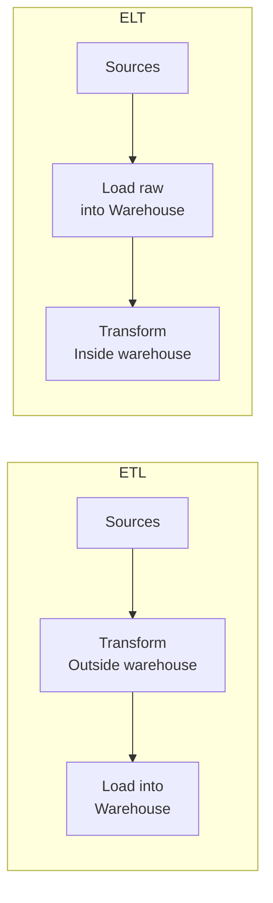
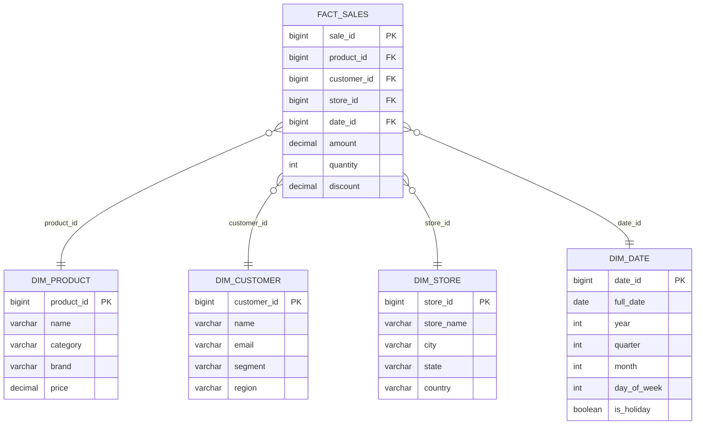
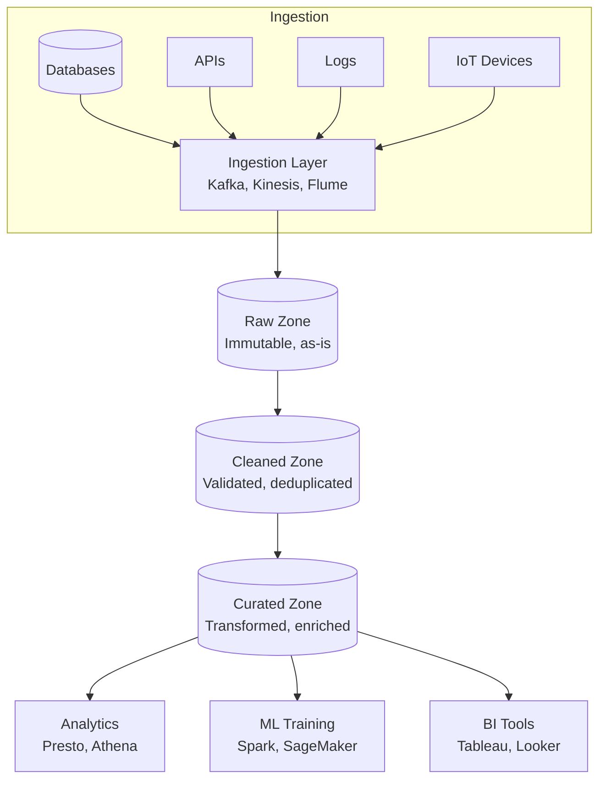
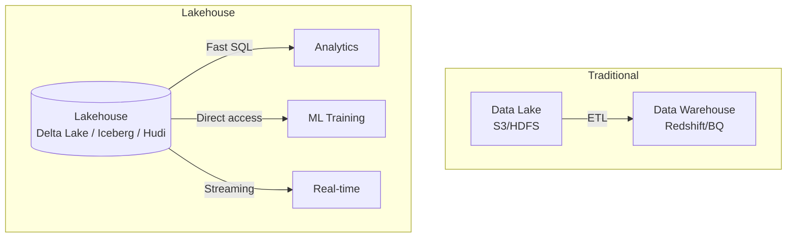
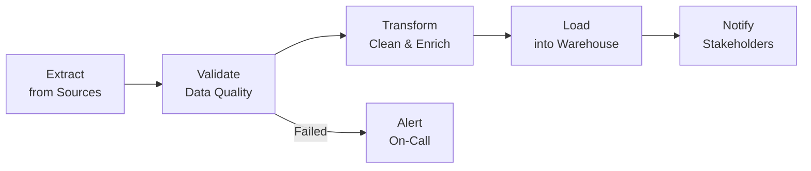
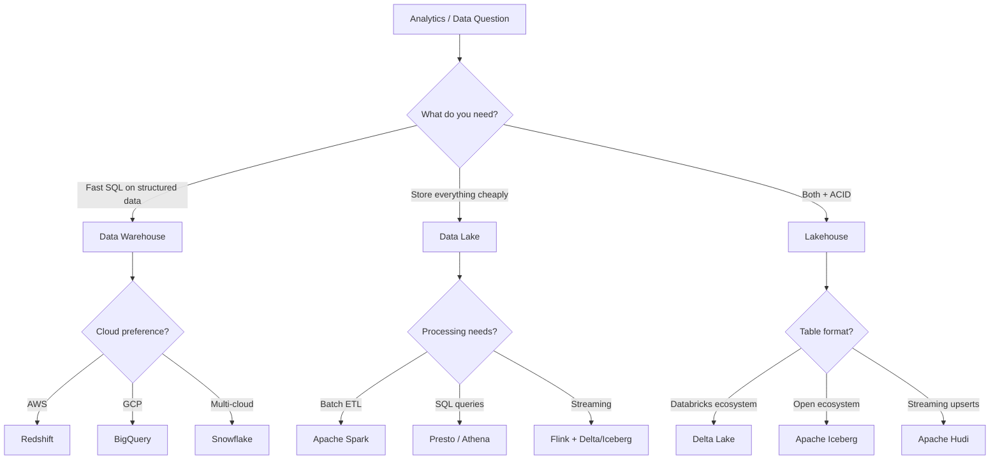

# Data Warehousing and Data Lakes

---

## Why Data Infrastructure Matters

Every large-scale system generates massive amounts of data: user actions, transactions, logs, metrics. This data is valuable for analytics, reporting, machine learning, and business intelligence — but your operational database (OLTP) is not designed for heavy analytical queries. You need a separate data infrastructure.



| System | Optimized For | Typical Queries |
|--------|-------------|-----------------|
| **OLTP** (MySQL, PostgreSQL) | Many small read/write transactions | `SELECT * FROM orders WHERE id = 123` |
| **OLAP** (Redshift, BigQuery) | Complex analytical queries over large datasets | `SELECT region, SUM(revenue) FROM orders GROUP BY region` |
| **Data Lake** (S3, HDFS) | Storing everything cheaply in raw format | Schema-on-read, ML feature extraction |

---

## Data Warehousing

A data warehouse is a centralized repository of structured, processed data optimized for analytical queries. Data is cleaned, transformed, and loaded (ETL) from multiple source systems.

### ETL vs ELT



| Approach | Transform Location | Best For | Tools |
|----------|-------------------|----------|-------|
| **ETL** | Outside warehouse (dedicated pipeline) | Limited warehouse compute, sensitive data | Informatica, Talend, custom scripts |
| **ELT** | Inside warehouse (SQL transforms) | Modern cloud warehouses with cheap compute | dbt, BigQuery, Snowflake |

!!! tip
    Modern architectures favor **ELT** because cloud warehouses (BigQuery, Snowflake, Redshift) have massive compute capacity. Load raw data first, then transform with SQL — this is simpler and more flexible.

### Dimensional Modeling

Dimensional modeling organizes warehouse data into **fact tables** (measurements) and **dimension tables** (context), making analytical queries fast and intuitive.

#### Star Schema



**Fact table:** Central table containing measurements (sales amount, quantity). Has foreign keys to dimension tables. Typically the largest table.

**Dimension tables:** Surrounding tables providing context (who bought, what, where, when). Denormalized for query speed.

**Query example:**

```sql
-- Revenue by product category and region, last quarter
SELECT
    d.category,
    c.region,
    SUM(f.amount) AS total_revenue,
    COUNT(DISTINCT f.sale_id) AS num_transactions,
    AVG(f.amount) AS avg_order_value
FROM fact_sales f
JOIN dim_product d ON f.product_id = d.product_id
JOIN dim_customer c ON f.customer_id = c.customer_id
JOIN dim_date dt ON f.date_id = dt.date_id
WHERE dt.year = 2025 AND dt.quarter = 4
GROUP BY d.category, c.region
ORDER BY total_revenue DESC;
```

#### Snowflake Schema

A snowflake schema normalizes dimension tables further — dimensions reference sub-dimensions.

```
Star:      FACT → DIM_PRODUCT (has category, brand inline)
Snowflake: FACT → DIM_PRODUCT → DIM_CATEGORY → DIM_BRAND
```

| Schema | Joins | Storage | Query Speed | Complexity |
|--------|-------|---------|-------------|------------|
| **Star** | Fewer | More (denormalized) | Faster | Simpler |
| **Snowflake** | More | Less (normalized) | Slower | More complex |

!!! note
    In interviews, default to **star schema** — it's simpler and faster for the analytical workloads that warehouses handle. Snowflake schema is mainly used when storage cost is a primary concern.

### Java Example: ETL Pipeline Framework

```java
import java.math.BigDecimal;
import java.time.Instant;
import java.time.LocalDate;
import java.time.ZoneOffset;
import java.util.Arrays;
import java.util.List;
import java.util.Objects;

import javax.sql.DataSource;

/**
 * Simple ETL pipeline that extracts data from a source database,
 * transforms it into a star schema, and loads into a data warehouse.
 */
public class SalesETLPipeline {

    public record RawTransaction(
        long id, String productName, String customerEmail,
        String storeName, Instant timestamp, BigDecimal amount, int quantity
    ) {}

    public record FactSale(
        long saleId, long productId, long customerId,
        long storeId, long dateId, BigDecimal amount, int quantity
    ) {}

    private final DataSource source;
    private final DataSource warehouse;
    private final DimensionLookup dimensions;

    public SalesETLPipeline(DataSource source, DataSource warehouse) {
        this.source = source;
        this.warehouse = warehouse;
        this.dimensions = new DimensionLookup(warehouse);
    }

    public PipelineResult runDaily(LocalDate date) {
        // EXTRACT
        List<RawTransaction> rawData = extract(date);

        // TRANSFORM
        List<FactSale> facts = rawData.stream()
            .map(this::transform)
            .filter(Objects::nonNull)
            .toList();

        // LOAD
        int loaded = load(facts);

        return new PipelineResult(rawData.size(), facts.size(), loaded, date);
    }

    private List<RawTransaction> extract(LocalDate date) {
        String sql = """
            SELECT id, product_name, customer_email, store_name,
                   created_at, amount, quantity
            FROM transactions
            WHERE DATE(created_at) = ?
            ORDER BY created_at
            """;
        return jdbcTemplate(source).query(sql, rawTransactionMapper, date);
    }

    private FactSale transform(RawTransaction raw) {
        long productId = dimensions.getOrCreateProduct(raw.productName());
        long customerId = dimensions.getOrCreateCustomer(raw.customerEmail());
        long storeId = dimensions.getOrCreateStore(raw.storeName());
        long dateId = dimensions.getOrCreateDate(raw.timestamp().atZone(ZoneOffset.UTC).toLocalDate());

        return new FactSale(
            raw.id(), productId, customerId, storeId, dateId,
            raw.amount(), raw.quantity()
        );
    }

    private int load(List<FactSale> facts) {
        String sql = """
            INSERT INTO fact_sales (sale_id, product_id, customer_id,
                                    store_id, date_id, amount, quantity)
            VALUES (?, ?, ?, ?, ?, ?, ?)
            ON CONFLICT (sale_id) DO NOTHING
            """;
        int[][] results = jdbcTemplate(warehouse).batchUpdate(sql, facts, 1000,
            (ps, fact) -> {
                ps.setLong(1, fact.saleId());
                ps.setLong(2, fact.productId());
                ps.setLong(3, fact.customerId());
                ps.setLong(4, fact.storeId());
                ps.setLong(5, fact.dateId());
                ps.setBigDecimal(6, fact.amount());
                ps.setInt(7, fact.quantity());
            });
        return Arrays.stream(results).mapToInt(r -> r.length).sum();
    }
}
```

### Modern Cloud Warehouses Comparison

| Feature | Redshift | BigQuery | Snowflake |
|---------|----------|----------|-----------|
| **Vendor** | AWS | Google Cloud | Multi-cloud |
| **Architecture** | Shared-nothing (MPP) | Serverless, columnar | Separate storage & compute |
| **Scaling** | Resize cluster | Auto-scales | Independent compute scaling |
| **Pricing** | Per-node-hour | Per-query (bytes scanned) | Credits (compute time) |
| **Storage format** | Columnar (custom) | Capacitor (columnar) | Micro-partitions |
| **Concurrency** | Limited by cluster size | High (serverless) | High (virtual warehouses) |
| **Best for** | AWS-native shops | Ad-hoc analytics, ML | Multi-cloud, diverse workloads |

---

## Data Lakes

A data lake is a centralized repository that stores **all** data in its raw, unprocessed format — structured (CSV, Parquet), semi-structured (JSON, XML), and unstructured (images, logs, text).

### Data Lake Architecture



### Data Lake Zones (Medallion Architecture)

| Zone | Also Called | Data Quality | Access |
|------|-----------|-------------|--------|
| **Bronze (Raw)** | Landing zone | As-is from source, immutable | Data engineers only |
| **Silver (Cleaned)** | Refined zone | Validated, deduplicated, typed | Data scientists, engineers |
| **Gold (Curated)** | Business zone | Aggregated, enriched, business-ready | Analysts, dashboards, ML |

### Key Technologies

| Technology | Role | Description |
|-----------|------|-------------|
| **HDFS** | Storage | Distributed file system (Hadoop), on-premise |
| **Amazon S3** | Storage | Object storage, cloud-native, cheap |
| **Apache Spark** | Processing | Distributed compute for ETL, ML, SQL |
| **Apache Hive** | SQL layer | SQL-on-Hadoop, schema-on-read |
| **Presto / Trino** | Query engine | Interactive SQL over data lake files |
| **AWS Glue** | ETL + Catalog | Serverless ETL + metadata catalog |
| **Apache Airflow** | Orchestration | DAG-based workflow scheduling |

### Data Warehouse vs Data Lake

| Aspect | Data Warehouse | Data Lake |
|--------|---------------|-----------|
| **Data type** | Structured only | Structured + semi-structured + unstructured |
| **Schema** | Schema-on-write (define before load) | Schema-on-read (define when querying) |
| **Processing** | ETL | ELT |
| **Cost** | Higher (compute + storage coupled) | Lower (cheap object storage) |
| **Users** | Business analysts, BI | Data scientists, ML engineers |
| **Query speed** | Fast (pre-optimized) | Variable (depends on format and engine) |
| **Data quality** | High (curated) | Variable (raw data mixed with curated) |
| **Governance** | Strong (schemas enforced) | Weak (data swamp risk) |

!!! warning
    A data lake without governance becomes a **data swamp** — a dumping ground of unorganized, undocumented, unusable data. Always implement metadata catalogs, access controls, and data quality checks.

---

## The Lakehouse Architecture

The lakehouse combines the best of warehouses and lakes: cheap storage (lake) with ACID transactions, schema enforcement, and fast queries (warehouse).



### Key Lakehouse Technologies

| Technology | Creator | Key Feature |
|-----------|---------|-------------|
| **Delta Lake** | Databricks | ACID on Spark, time travel, schema evolution |
| **Apache Iceberg** | Netflix/Apple | Hidden partitioning, partition evolution, S3-native |
| **Apache Hudi** | Uber | Record-level upserts, incremental processing |

**What they add to a plain data lake:**
- **ACID transactions** — concurrent reads/writes don't corrupt data
- **Schema enforcement** — reject writes that don't match schema
- **Time travel** — query data as it was at any point in time
- **Merge/upsert** — update specific rows without rewriting entire partitions

### Python Example: Data Pipeline with PySpark

```python
from pyspark.sql import SparkSession
from pyspark.sql import functions as F
from pyspark.sql.types import StructType, StructField, StringType, DoubleType, TimestampType

spark = SparkSession.builder \
    .appName("SalesETL") \
    .config("spark.sql.extensions", "io.delta.sql.DeltaSparkSessionExtension") \
    .getOrCreate()

def bronze_ingest(source_path: str, bronze_path: str) -> int:
    """Raw ingestion — read from source, write as-is to bronze zone."""
    raw_df = spark.read.json(source_path)
    raw_df = raw_df.withColumn("_ingested_at", F.current_timestamp())
    raw_df.write.format("delta").mode("append").save(bronze_path)
    return raw_df.count()

def silver_transform(bronze_path: str, silver_path: str) -> int:
    """Clean and validate — deduplicate, cast types, filter bad records."""
    bronze_df = spark.read.format("delta").load(bronze_path)

    silver_df = (
        bronze_df
        .dropDuplicates(["transaction_id"])
        .filter(F.col("amount").isNotNull() & (F.col("amount") > 0))
        .withColumn("amount", F.col("amount").cast(DoubleType()))
        .withColumn("event_time", F.to_timestamp("timestamp"))
        .withColumn("_processed_at", F.current_timestamp())
        .select(
            "transaction_id", "user_id", "product_id",
            "amount", "quantity", "event_time",
            "store_id", "_processed_at",
        )
    )

    silver_df.write.format("delta").mode("overwrite") \
        .partitionBy("store_id") \
        .save(silver_path)
    return silver_df.count()

def gold_aggregate(silver_path: str, gold_path: str) -> int:
    """Business-ready aggregations for dashboards and ML features."""
    silver_df = spark.read.format("delta").load(silver_path)

    daily_sales = (
        silver_df
        .withColumn("sale_date", F.to_date("event_time"))
        .groupBy("sale_date", "store_id", "product_id")
        .agg(
            F.sum("amount").alias("total_revenue"),
            F.sum("quantity").alias("total_units"),
            F.count("transaction_id").alias("num_transactions"),
            F.avg("amount").alias("avg_order_value"),
        )
    )

    daily_sales.write.format("delta").mode("overwrite") \
        .partitionBy("sale_date") \
        .save(gold_path)
    return daily_sales.count()
```

### Go Example: Data Pipeline Orchestration

```go
package pipeline

import (
	"context"
	"fmt"
	"log"
	"time"
)

type StageResult struct {
	StageName    string
	RecordsIn    int64
	RecordsOut   int64
	Duration     time.Duration
	Error        error
}

type Stage interface {
	Name() string
	Execute(ctx context.Context) (StageResult, error)
}

type Pipeline struct {
	stages []Stage
	alerts AlertService
}

func NewPipeline(alertService AlertService, stages ...Stage) *Pipeline {
	return &Pipeline{stages: stages, alerts: alertService}
}

func (p *Pipeline) Run(ctx context.Context) ([]StageResult, error) {
	var results []StageResult

	for _, stage := range p.stages {
		start := time.Now()
		log.Printf("[Pipeline] Starting stage: %s", stage.Name())

		result, err := stage.Execute(ctx)
		result.Duration = time.Since(start)

		if err != nil {
			result.Error = err
			results = append(results, result)
			p.alerts.Send(fmt.Sprintf("Pipeline failed at stage %s: %v",
				stage.Name(), err))
			return results, fmt.Errorf("stage %s failed: %w", stage.Name(), err)
		}

		results = append(results, result)
		log.Printf("[Pipeline] Stage %s completed: %d in → %d out (%v)",
			stage.Name(), result.RecordsIn, result.RecordsOut, result.Duration)
	}

	return results, nil
}

// BronzeStage ingests raw data from source systems.
type BronzeStage struct {
	sourcePath string
	bronzePath string
	loader     DataLoader
}

func (s *BronzeStage) Name() string { return "bronze_ingest" }

func (s *BronzeStage) Execute(ctx context.Context) (StageResult, error) {
	records, err := s.loader.IngestRaw(ctx, s.sourcePath, s.bronzePath)
	return StageResult{
		StageName:  s.Name(),
		RecordsIn:  records,
		RecordsOut: records,
	}, err
}

// SilverStage cleans and deduplicates data.
type SilverStage struct {
	bronzePath string
	silverPath string
	transformer DataTransformer
}

func (s *SilverStage) Name() string { return "silver_transform" }

func (s *SilverStage) Execute(ctx context.Context) (StageResult, error) {
	in, out, err := s.transformer.CleanAndDeduplicate(ctx, s.bronzePath, s.silverPath)
	return StageResult{
		StageName:  s.Name(),
		RecordsIn:  in,
		RecordsOut: out,
	}, err
}
```

---

## Data Pipeline Orchestration

### Apache Airflow

Airflow is the standard for orchestrating batch data pipelines. Workflows are defined as Directed Acyclic Graphs (DAGs) in Python.



**Key Airflow concepts:**

| Concept | Description |
|---------|-------------|
| **DAG** | Directed Acyclic Graph defining task dependencies |
| **Operator** | A single task (Python, SQL, Bash, Spark, etc.) |
| **Sensor** | Waits for an external condition (file exists, API ready) |
| **XCom** | Cross-communication between tasks (pass small data) |
| **Backfill** | Re-run past DAG runs for historical data |

---

## Partitioning and File Formats

### Columnar vs Row-Based Storage

| Format | Type | Compression | Best For |
|--------|------|------------|----------|
| **CSV** | Row | None | Small files, interop |
| **JSON** | Row | None | Semi-structured, APIs |
| **Avro** | Row | Good | Streaming, schema evolution |
| **Parquet** | Columnar | Excellent | Analytics, warehouse |
| **ORC** | Columnar | Excellent | Hive workloads |

**Why columnar for analytics?**

A query like `SELECT SUM(amount) FROM sales WHERE year = 2025` only needs two columns (`amount`, `year`). Columnar formats read only those columns, skipping everything else — 10-100x less I/O.

### Partitioning Strategies

```
data/
├── year=2024/
│   ├── month=01/
│   │   ├── part-00000.parquet
│   │   └── part-00001.parquet
│   └── month=02/
│       └── part-00000.parquet
└── year=2025/
    └── month=01/
        └── part-00000.parquet
```

Partition pruning: a query with `WHERE year = 2025` only reads files under `year=2025/`, skipping all other years entirely.

---

## Interview Decision Framework



!!! important
    In interviews, always explain **why** you need a separate analytics system from the OLTP database. Key reasons: (1) analytical queries are expensive and would slow down the production DB, (2) you need to join data from multiple sources, (3) you need historical data that the OLTP DB doesn't retain, (4) different access patterns require different storage optimizations.

---

## Further Reading

| Topic | Resource | Why This Matters |
|-------|----------|-----------------|
| The Data Warehouse Toolkit | Kimball & Ross (Wiley) | Ralph Kimball defined dimensional modeling (star schemas, slowly changing dimensions) as the standard approach for analytical databases. His methodology — identify business processes, declare grain, choose dimensions, define facts — is still how data warehouses are designed at every major company. The book explains *why* denormalization is correct for analytics (read-optimized, aggregation-friendly) even though it violates normal forms used in OLTP. |
| Delta Lake Documentation | [delta.io](https://delta.io/) | Delta Lake solved the data lake reliability crisis: raw Parquet/ORC files on S3/HDFS have no ACID transactions, no schema enforcement, and no time travel. Delta adds a transaction log (JSON-based, optimistic concurrency) on top of Parquet files, enabling ACID commits, schema evolution, and `MERGE` operations. It bridges the gap between the flexibility of data lakes and the reliability of data warehouses (the "lakehouse" architecture). |
| Apache Iceberg | [iceberg.apache.org](https://iceberg.apache.org/) | Netflix created Iceberg to fix the performance and correctness problems of Hive-style table formats. Hive tables rely on directory listings for partition discovery (slow at scale, race-prone), while Iceberg uses snapshot-based metadata with manifest files — enabling hidden partitioning, schema evolution without rewriting data, and time-travel queries. It's engine-agnostic (Spark, Flink, Trino), making it the emerging standard for open table formats. |
| Designing Data-Intensive Applications | Martin Kleppmann (O'Reilly) — Chapter 10 | Chapter 10 covers batch processing (MapReduce, Spark) as the foundation of data warehouse ETL pipelines. Kleppmann explains the Unix philosophy applied to data: small, composable processing stages connected by materialized intermediate datasets. Understanding sort-merge joins, broadcast joins, and data locality is essential for designing efficient data pipelines that populate warehouses. |
| dbt (data build tool) | [getdbt.com](https://www.getdbt.com/) | dbt brought software engineering practices (version control, testing, documentation, CI/CD) to SQL-based data transformations. Before dbt, warehouse transformations were ad-hoc stored procedures with no lineage tracking. dbt models are SELECT statements organized into a DAG, enabling incremental builds, data quality tests, and automatic documentation — the "T" in modern ELT pipelines. |
| Apache Airflow | [airflow.apache.org](https://airflow.apache.org/) | Airbnb created Airflow to orchestrate complex data pipelines that existing cron-based scheduling couldn't handle: multi-step DAGs with dependencies, retries, backfills, and SLA monitoring. Airflow separates workflow definition (Python DAGs) from execution (task instances on workers), enabling dynamic pipeline generation and programmatic scheduling that scales with organizational complexity. |
