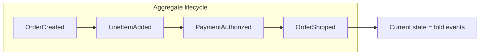
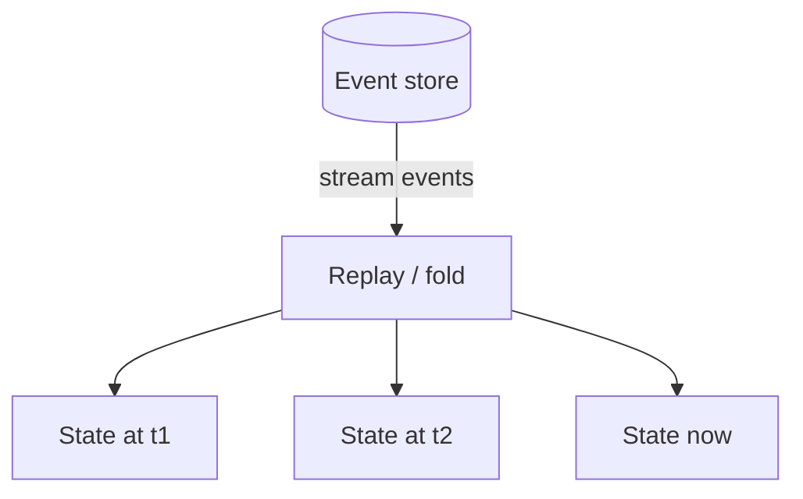
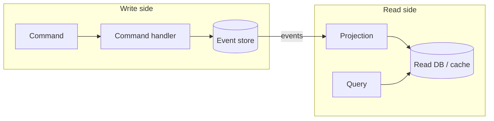
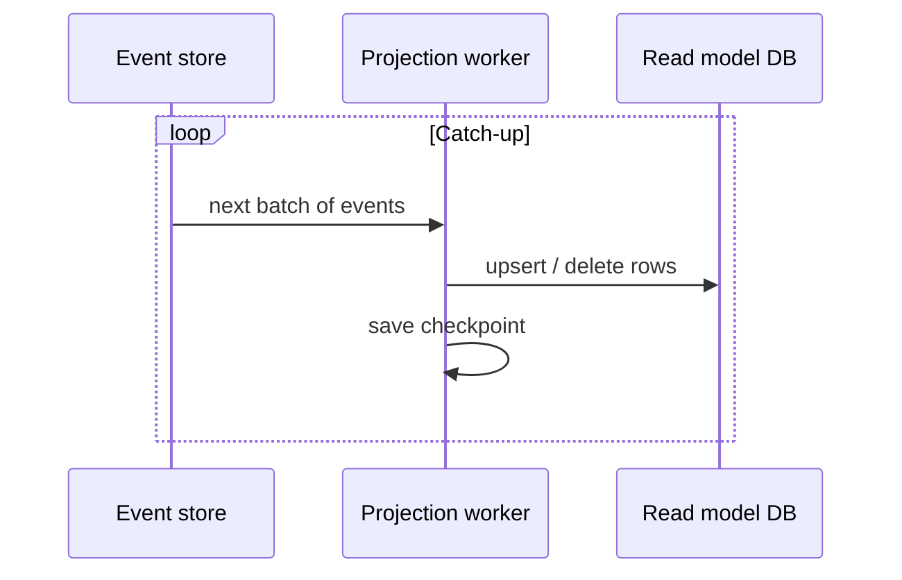
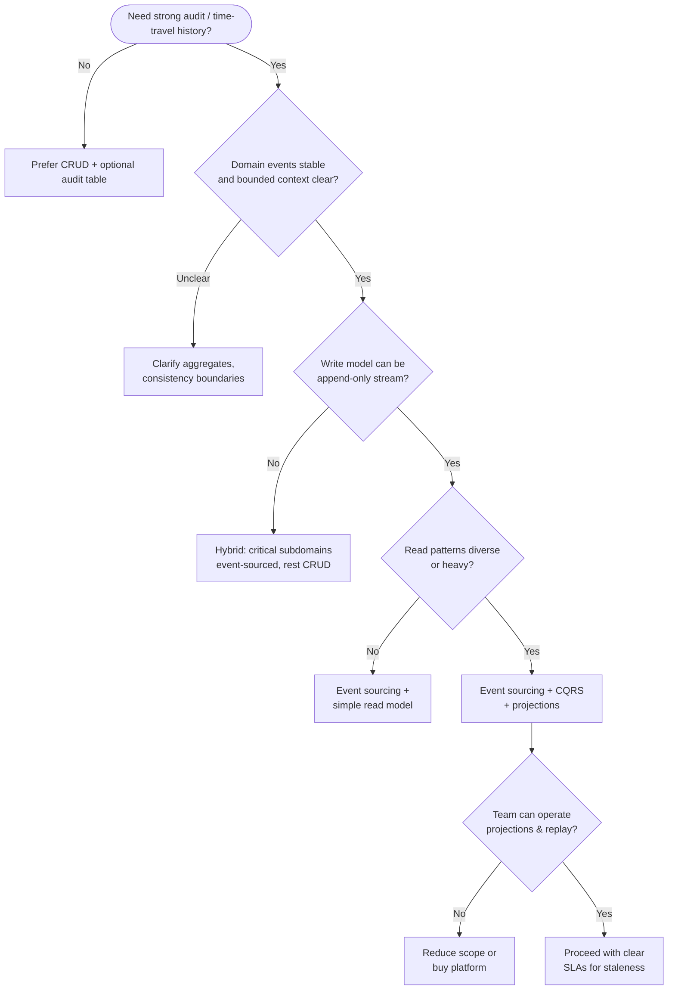
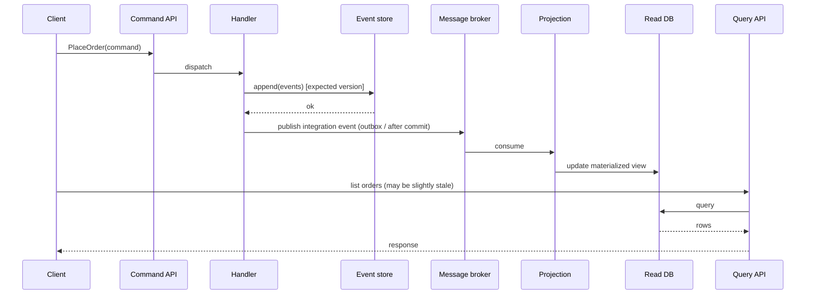

# Event Sourcing & CQRS

---

## Why Event Sourcing and CQRS

Traditional **CRUD** applications treat the database row as the source of truth: you read current state, mutate it in memory, and overwrite the row. That model is simple and familiar, but it discards history. You cannot answer "what was the balance last Tuesday?" or "who changed this field?" without separate audit tables or application-level logging — often bolted on inconsistently.

**Limitations of CRUD for certain domains:**

| Concern | CRUD default | Why it breaks down |
|---------|--------------|-------------------|
| Auditability | Optional `updated_at` | No full narrative of *how* state evolved |
| Compliance | Manual audit logs | Easy to miss events or diverge from state |
| Debugging | Current snapshot only | Hard to reproduce bugs that depend on sequence |
| Integration | Polling or ad-hoc webhooks | No canonical stream of business facts |

**When state changes need an audit trail:** Regulated industries (finance, healthcare), order and payment lifecycles, inventory with reservations, and any system where reconstructing past behavior is a first-class requirement. In those cases, storing **events** as the primary record and deriving state from them is often the right mental model — even if the implementation is hybrid.

!!! tip
    Event sourcing is not "every microservice must use it." It is a **pattern** for domains where the history of changes is as important as the current value.

---

## Event Sourcing Fundamentals

### Events as the source of truth

An **event** is an immutable fact: something that happened in the past, named in past tense (for example `MoneyDeposited`, `OrderShipped`). The aggregate's current state is not stored as a single row that you overwrite; it is the **fold** (or reduce) of all events for that aggregate, in order.



### Event store design (append-only log)

The **event store** is an append-only log partitioned by **stream** (typically one stream per aggregate instance, e.g. `order-123`). Each append adds one or more events with monotonically increasing **positions** or **version** numbers within that stream. Deletes are rare; corrections are modeled as new events (or compensating events), not silent overwrites.

Properties that matter in production:

| Property | Purpose |
|----------|---------|
| Per-stream ordering | Replay preserves causal order within an aggregate |
| Global ordering (optional) | Cross-stream ordering for projections or integration |
| Idempotent writers | Retries do not duplicate business events incorrectly |
| Metadata | Correlation id, causation id, user id for tracing |

### Event replay and state reconstruction

To rebuild state, load all events for a stream in order and apply a **pure** handler function: `(state, event) -> state`. If the handler is deterministic, the same event list always yields the same state — which is how you get testability and time travel.



### Event schema evolution and versioning

Events live forever in the log. **Schema evolution** rules:

- Prefer **additive** changes (new optional fields) with sensible defaults when old events are read.
- Use **event type versioning** (`OrderCreated` vs `OrderCreatedV2`) when semantics change; upcast old payloads to a canonical in-memory representation when replaying.
- Avoid renaming or reusing event types for different meanings — old payloads remain in the store.

!!! note
    Upcasters and versioned serializers are infrastructure you plan for up front; retrofitting them after years of production traffic is expensive.

---

## CQRS (Command Query Responsibility Segregation)

**CQRS** splits the model into:

- **Commands** — intentions to change state (validate, append events, enforce invariants on the write side).
- **Queries** — read optimized shapes that may be denormalized, cached, or served from a different store than the event write path.

CQRS does not require event sourcing (you can CQRS with two SQL tables), but **event sourcing pairs naturally with CQRS**: the write model appends events; the read model is built by **projections**.

### Separate read and write models



### When CQRS makes sense

| Signal | Explanation |
|--------|-------------|
| Read/write ratio skew | Heavy reads with expensive joins — materialize views |
| Multiple query profiles | Same domain, different dashboards and search needs |
| Scaling independence | Scale read replicas without touching write consistency rules |
| Team boundaries | Clear API between "things that change state" and "things that display state" |

### Eventual consistency between write and read sides

After a command succeeds, the **read model may lag**. Users might briefly see stale lists or counts. UX patterns: optimistic UI with revision tokens, polling, or push notifications when projection catches up.

!!! warning
    Hiding eventual consistency is a product problem as much as an architecture problem. If the business requires immediate read-your-writes everywhere, you need synchronous projections or stronger coupling — which reduces the benefits of CQRS.

---

## Event Store Implementation

### Schema design for event stores

A minimal relational layout:

- `stream_id` — logical stream (aggregate instance).
- `version` — monotonic per stream (optimistic concurrency).
- `event_type` — string or smallint mapping to a type registry.
- `payload` — JSON, Avro, or Protobuf (binary).
- `metadata` — JSON for correlation, causation, trace ids.

NoSQL alternatives (document or wide-column) use the same ideas: partition key = stream, sort key = sequence.

### Optimistic concurrency with stream versioning

Clients send commands with **expected version** `v`. The store appends only if the current stream version equals `v`; otherwise it rejects with a **concurrency conflict** so the caller can reload events and retry. This prevents lost updates when two actors mutate the same aggregate concurrently.

### Snapshotting for performance

Replaying thousands of events per aggregate is slow. **Snapshots** persist `(stream_id, version, serialized_state)` periodically. Replay starts from the latest snapshot version + subsequent events. Snapshots are a cache — if lost, you can rebuild from events alone.

!!! important
    Snapshot frequency trades disk and write amplification against replay latency. Domain with long-lived aggregates (accounts open for decades) almost always need snapshots or rolling aggregates.

---

## Projections and Read Models

### Building materialized views from events

A **projection** subscribes to the event stream (or to a category of event types) and updates one or more read models: SQL rows, Elasticsearch documents, Redis keys, or graph nodes.

### Projection strategies (synchronous vs async)

| Strategy | Latency | Complexity | When |
|----------|---------|------------|------|
| Synchronous inline | Lowest | Couples write path to projection failure | Small read models, strict consistency needs |
| Async queue / outbox | Low–medium | Requires at-least-once handling and idempotency | Most production systems |
| Batch rebuild | N/A for live path | Simple mental model for recovery | Analytics, reporting |

### Rebuilding projections from scratch

Because the event log is canonical, you can **drop** a projection store and **rebuild** by reprocessing events from position 0 (or from a known checkpoint). This is powerful for bug fixes in projection logic — at the cost of time and resources during catch-up.



!!! tip
    Make projections **idempotent**: the same event delivered twice should not corrupt the read model. Use natural keys, upserts, or idempotency keys stored with the processed event id.

---

## Event-Driven Integration

### Domain events vs integration events

| Kind | Audience | Content |
|------|----------|---------|
| **Domain event** | Inside the bounded context | Rich, may reference internal types |
| **Integration event** | Other services | Stable contract, versioned, minimal payload, often immutable facts |

Translate at the boundary: publish integration events after the transaction that appends domain events commits (see **outbox pattern**).

### Event bus / message broker for cross-service communication

Downstream services consume integration events from Kafka, RabbitMQ, SNS/SQS, or similar. The broker provides buffering, fan-out, and replay (depending on product). Your **event store** is not always the same as the **integration bus** — many architectures write to the store first, then publish outward.

### Exactly-once vs at-least-once delivery

True **exactly-once end-to-end** processing across distributed components is difficult; practically you aim for **exactly-once effects** by combining **at-least-once delivery** with **idempotent consumers** and deduplication stores.

!!! note
    Prefer honest **at-least-once** plus idempotent handlers over fragile distributed transactions between the database and the broker unless you have infrastructure that supports transactional outbox with strong guarantees.

---

## Real-World Use Cases

### Banking and financial systems (ledger)

Double-entry ledgers map naturally to append-only **transactions** as events. Balance is derived; fraud analysis replays sequences; regulators ask for immutable history.

### E-commerce (order lifecycle)

`CartUpdated`, `PaymentCaptured`, `InventoryReserved`, `ShipmentDispatched` — each step is an event. Fulfillment, customer notifications, and analytics subscribe to different projections of the same stream.

### Audit trails and compliance

If "prove what the system knew at time T" is a requirement, event sourcing provides a first-class artifact. Combine with WORM storage or cryptographic chaining for stronger tamper evidence where required by policy.

---

## Design Considerations

### When NOT to use event sourcing

- Simple CRUD with no audit or temporal queries.
- Teams without experience operating projections, replays, and schema migration.
- Domains where deletes and GDPR **right to erasure** conflict with immutable logs (need tombstoning, crypto-shredding, or legal design).

### Complexity trade-offs

You gain history and flexibility; you pay in **cognitive load**, **more moving parts**, and **migration discipline**. Not every service should be the event-sourced core — often one or two critical contexts use it, others integrate via APIs and messages.

### Storage growth and archival

Append-only logs grow without bound. Strategies: **cold tier** storage, compacted snapshots as source for old periods, **archival** to object storage with replay tooling for rare audits.

### Debugging and tooling

Invest in **event browsers**, correlation tracing from command to events to projection lag, and **test fixtures** that rebuild state from golden event sequences. Replay in staging is invaluable when production shows unexpected state.

!!! warning
    If developers cannot inspect streams and projections easily, operational incidents become guesswork. Tooling is part of the architecture, not an afterthought.

---

## Interview Decision Framework

Use this flowchart to structure answers in system design interviews when someone mentions events, sagas, or auditability.



**Talking points for interviewers:**

1. **Consistency:** Write side often strong per aggregate; read side eventual unless synchronous projection.
2. **Failure modes:** Projection lag, poison events, replay storms after deploy — mention mitigation.
3. **Trade-off summary:** Correctness of history vs operational complexity and storage cost.

---

## Code sketches: event store, command handler, projection

The following snippets are illustrative — not production-complete — but show the same concepts in Java, Python, and Go.

=== "Python"

    ```python
    from dataclasses import dataclass
    from typing import Any, Callable, Dict, List, Protocol
    
    @dataclass(frozen=True)
    class OrderCreated:
        order_id: str
        customer_id: str
    
    class EventStore(Protocol):
        def append(self, stream_id: str, expected_version: int, events: List[Any]) -> None: ...
        def read_stream(self, stream_id: str) -> List[Any]: ...
    
    def fold_state(events: List[Any], init: Dict, handler: Callable[[Dict, Any], Dict]) -> Dict:
        state = init
        for ev in events:
            state = handler(state, ev)
        return state
    
    def handle_place_order(cmd: dict, store: EventStore) -> None:
        stream_id = cmd["order_id"]
        current = store.read_stream(stream_id)
        if current:
            raise ValueError("order already exists")
        store.append(stream_id, expected_version=len(current), events=[OrderCreated(stream_id, cmd["customer_id"])])
    
    def project_order_summary(events: List[Any]) -> dict:
        def step(acc: dict, ev: Any) -> dict:
            if isinstance(ev, OrderCreated):
                return {"order_id": ev.order_id, "customer_id": ev.customer_id}
            return acc
        return fold_state(events, {}, step)
    ```

=== "Java"

    ```java
    import java.time.Instant;
    import java.util.List;
    
    // Event record (immutable)
    public record OrderCreated(String orderId, String customerId, Instant occurredAt) {}
    
    public interface EventStore {
        void append(String streamId, long expectedVersion, List<Object> events);
        List<Object> readStream(String streamId);
    }
    
    public final class PlaceOrderHandler {
        private final EventStore store;
    
        public PlaceOrderHandler(EventStore store) { this.store = store; }
    
        public void handle(PlaceOrder command) {
            var events = store.readStream(command.orderId());
            long version = events.size(); // simplified versioning
            if (!events.isEmpty()) throw new IllegalStateException("already exists");
            store.append(command.orderId(), version,
                List.of(new OrderCreated(command.orderId(), command.customerId(), Instant.now())));
        }
    }
    
    // Projection: rebuild read model (pseudo)
    public final class OrderSummaryProjection {
        public void apply(String streamId, List<Object> events) {
            for (Object e : events) {
                if (e instanceof OrderCreated oc) {
                    // upsert into read DB: order summary row
                }
            }
        }
    }
    ```

=== "Go"

    ```go
    package es
    
    import "time"
    
    type OrderCreated struct {
    	OrderID    string
    	CustomerID string
    	OccurredAt time.Time
    }
    
    type EventStore interface {
    	Append(streamID string, expectedVersion uint64, events []any) error
    	ReadStream(streamID string) ([]any, error)
    }
    
    type PlaceOrderHandler struct {
    	store EventStore
    }
    
    func (h *PlaceOrderHandler) Handle(orderID, customerID string) error {
    	events, err := h.store.ReadStream(orderID)
    	if err != nil {
    		return err
    	}
    	if len(events) > 0 {
    		return ErrAlreadyExists
    	}
    	ev := OrderCreated{OrderID: orderID, CustomerID: customerID, OccurredAt: time.Now().UTC()}
    	return h.store.Append(orderID, uint64(len(events)), []any{ev})
    }
    
    // Projection applies events to a read-model builder.
    type OrderSummary struct {
    	OrderID    string
    	CustomerID string
    }
    
    func ProjectOrderSummary(events []any) OrderSummary {
    	var s OrderSummary
    	for _, e := range events {
    		switch t := e.(type) {
    		case OrderCreated:
    			s.OrderID = t.OrderID
    			s.CustomerID = t.CustomerID
    		}
    	}
    	return s
    }
    ```

---

## Further Reading

| Resource | Topic | Why This Matters |
|----------|--------|-----------------|
| Martin Fowler — *Event Sourcing* | Conceptual overview and when to use | Fowler's article explains the fundamental insight: instead of storing current state (which loses history), store the sequence of events that produced it. This enables temporal queries ("what was the balance at 3pm?"), complete audit trails, and the ability to rebuild state from scratch. He also honestly covers the downsides — schema evolution of events is painful, and event stores grow without bound. |
| Greg Young — CQRS materials | Command/query separation and read models | Greg Young formalized CQRS as a pattern where write models (optimized for business invariants) and read models (optimized for query performance) are completely separate. This was needed because a single model that handles both writes and complex reads leads to bloated schemas and performance compromises. His materials explain how event sourcing naturally feeds CQRS — events are projected into purpose-built read stores. |
| *Implementing Domain-Driven Design* (Vaughn Vernon) | Aggregates, domain events, bounded contexts | Vernon's book bridges the gap between DDD theory (Evans) and practical implementation with event sourcing. It explains why aggregates are the consistency boundary for commands, how domain events flow between bounded contexts, and why getting aggregate boundaries wrong leads to either distributed transactions (too large) or inconsistent state (too small). |
| Enterprise Integration Patterns (Hohpe & Woolf) | Messaging, idempotency, outbox | Event-sourced systems communicate through messages, and this book catalogues the patterns for reliable messaging: the transactional outbox (atomically write to DB and event store), idempotent consumers (handle duplicate delivery), and content-based routing. These are the building blocks that make event-driven architectures work in production. |
| Kafka / Pulsar documentation | Log-based integration at scale | Kafka and Pulsar provide the durable, ordered, replayable log that event sourcing requires as its backbone. Understanding log compaction (retaining only the latest value per key), consumer group semantics, and exactly-once delivery is essential for implementing event sourcing at scale — the event store is effectively a Kafka topic. |

---

## Diagram: end-to-end event flow



!!! important
    In interviews, connect this diagram to **failure modes**: broker down (outbox backlog), projection bug (rebuild), conflicting writes (optimistic retry). Showing you understand operations distinguishes senior answers from textbook definitions.
