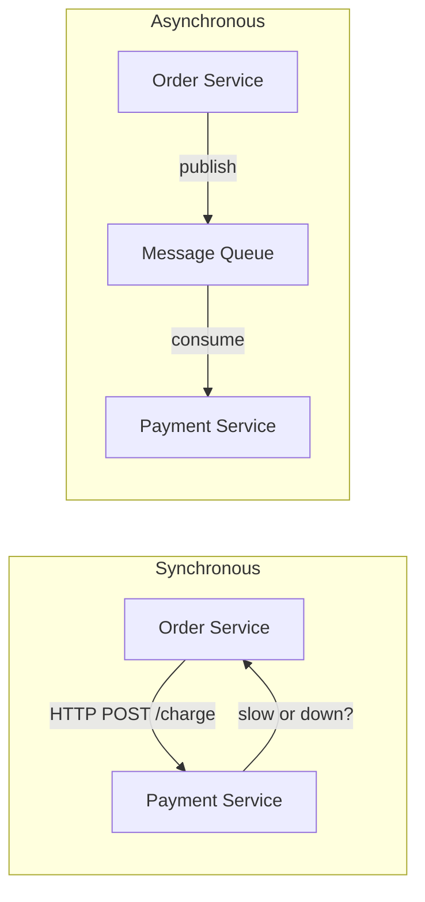
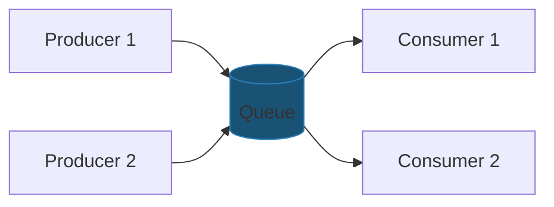
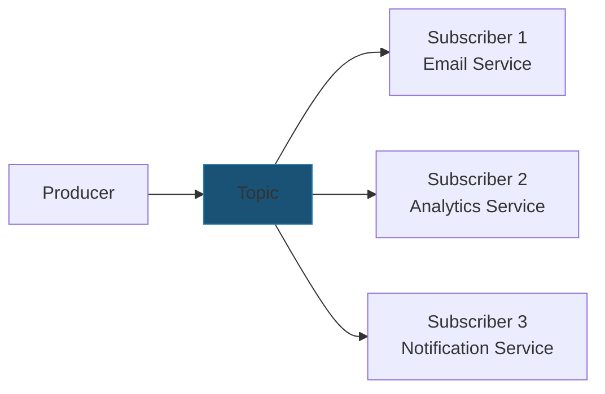
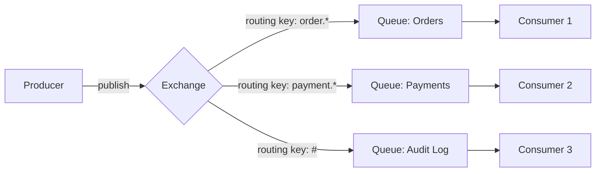
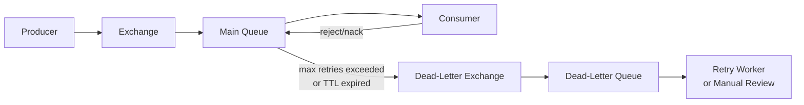
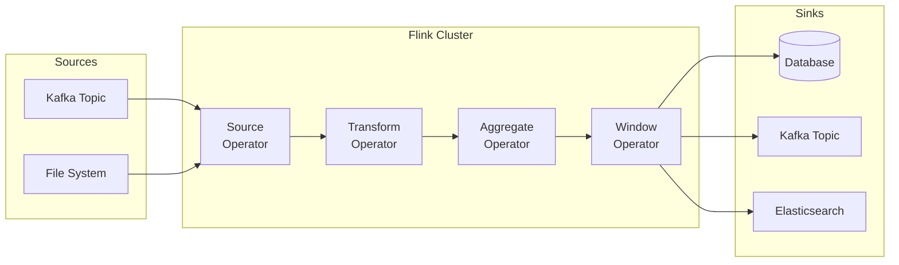
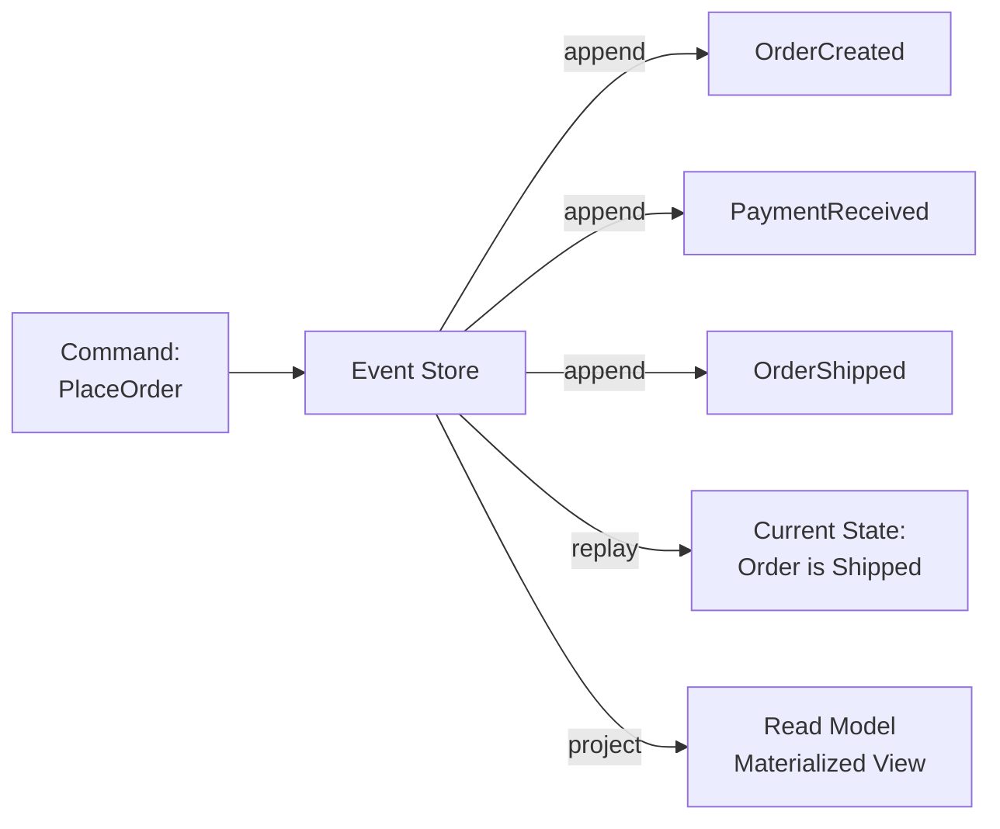
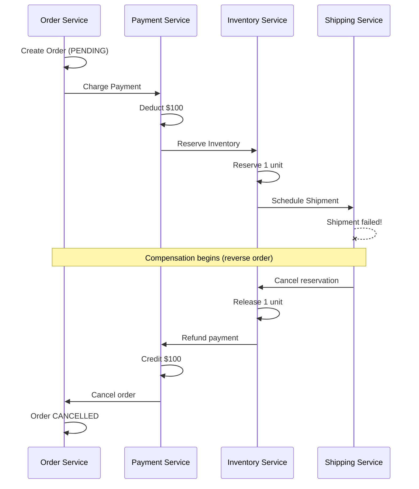
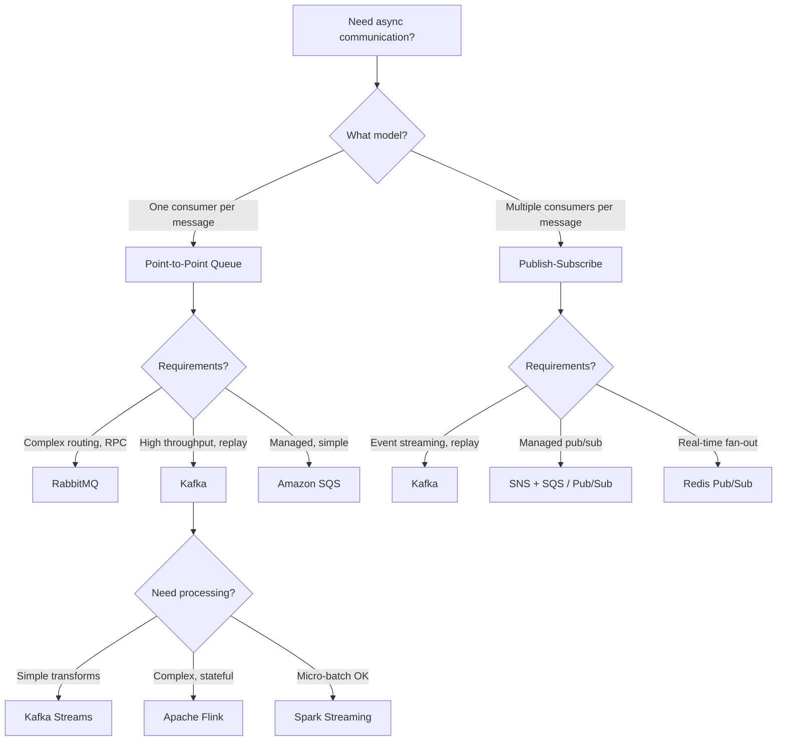

# Message Queues and Stream Processing

---

## Why Message Queues?

In any distributed system, services need to communicate. Direct synchronous calls (REST, gRPC) create tight coupling — if the downstream service is slow or down, the caller blocks or fails. Message queues break this dependency by introducing an intermediary that stores messages until the consumer is ready.



### When to Use Message Queues

| Use Case | Why a Queue Helps |
|----------|------------------|
| **Decoupling services** | Producer and consumer evolve independently |
| **Handling traffic spikes** | Queue absorbs bursts; consumers process at their own pace |
| **Reliability** | Messages persist even if consumers are temporarily down |
| **Fan-out** | One message triggers multiple independent consumers |
| **Ordering** | Guarantee processing order within a partition |
| **Async workflows** | Long-running tasks (video transcoding, ML inference) |

---

## Message Queue Models

### Point-to-Point (Queue)

Each message is consumed by exactly one consumer. Once acknowledged, the message is removed.



**Use case:** Task distribution, job queues, work items.

### Publish-Subscribe (Topic)

Each message is delivered to all subscribed consumers. Messages are retained for a configurable period.



**Use case:** Event broadcasting, notifications, data replication.

---

## Apache Kafka Deep Dive

Kafka is a distributed event streaming platform built around an immutable, append-only **log**. It is the backbone of event-driven architectures at LinkedIn, Netflix, Uber, and most large-scale systems.

### Architecture

```mermaid
flowchart TD
    subgraph Kafka Cluster
        subgraph Broker 1
            TP0[Topic-A<br/>Partition 0<br/>Leader]
            TP2[Topic-A<br/>Partition 2<br/>Follower]
        end
        subgraph Broker 2
            TP1[Topic-A<br/>Partition 1<br/>Leader]
            TP0F[Topic-A<br/>Partition 0<br/>Follower]
        end
        subgraph Broker 3
            TP2L[Topic-A<br/>Partition 2<br/>Leader]
            TP1F[Topic-A<br/>Partition 1<br/>Follower]
        end
    end

    P[Producer] -->|key-based routing| TP0
    P -->|key-based routing| TP1
    P -->|key-based routing| TP2L

    subgraph Consumer Group A
        C1[Consumer 1] --> TP0
        C2[Consumer 2] --> TP1
        C3[Consumer 3] --> TP2L
    end

    ZK[ZooKeeper / KRaft] --> Broker 1
    ZK --> Broker 2
    ZK --> Broker 3
```

### Core Concepts

| Concept | Description |
|---------|-------------|
| **Topic** | A named category/feed of messages |
| **Partition** | An ordered, immutable log within a topic. Parallelism unit |
| **Offset** | Sequential ID for each message within a partition |
| **Broker** | A Kafka server that stores data and serves clients |
| **Producer** | Publishes messages to topics |
| **Consumer** | Reads messages from topics |
| **Consumer Group** | A set of consumers that share partition assignments for parallel consumption |
| **Replication Factor** | Number of copies of each partition across brokers |
| **ISR** | In-Sync Replicas — followers that are caught up with the leader |

### Kafka Guarantees

| Guarantee | Configuration |
|-----------|--------------|
| **Ordering** | Guaranteed within a partition (not across partitions) |
| **At-most-once** | `acks=0` — fire and forget |
| **At-least-once** | `acks=all` + consumer manual commit (default) |
| **Exactly-once** | Idempotent producer + transactional API + EOS consumer |

### Kafka Producer and Consumer

=== "Python"

    ```python
    from confluent_kafka import Producer, Consumer, KafkaError
    import json
    import logging
    
    logger = logging.getLogger(__name__)
    
    class OrderEventProducer:
        def __init__(self, bootstrap_servers: str, topic: str):
            self.topic = topic
            self.producer = Producer({
                'bootstrap.servers': bootstrap_servers,
                'acks': 'all',
                'enable.idempotence': True,
                'retries': 3,
            })
    
        def publish(self, user_id: str, event: dict) -> None:
            value = json.dumps(event).encode('utf-8')
            self.producer.produce(
                topic=self.topic,
                key=user_id.encode('utf-8'),
                value=value,
                callback=self._delivery_callback,
            )
            self.producer.flush()
    
        @staticmethod
        def _delivery_callback(err, msg):
            if err:
                logger.error(f"Delivery failed: {err}")
            else:
                logger.info(f"Delivered to {msg.topic()}[{msg.partition()}] @ offset {msg.offset()}")
    
    class OrderEventConsumer:
        def __init__(self, bootstrap_servers: str, group_id: str, topic: str):
            self.consumer = Consumer({
                'bootstrap.servers': bootstrap_servers,
                'group.id': group_id,
                'auto.offset.reset': 'earliest',
                'enable.auto.commit': False,
            })
            self.consumer.subscribe([topic])
            self._running = True
    
        def consume(self, process_fn):
            while self._running:
                msg = self.consumer.poll(timeout=1.0)
                if msg is None:
                    continue
                if msg.error():
                    if msg.error().code() == KafkaError._PARTITION_EOF:
                        continue
                    logger.error(f"Consumer error: {msg.error()}")
                    continue
    
                try:
                    event = json.loads(msg.value().decode('utf-8'))
                    process_fn(msg.key().decode('utf-8'), event)
                    self.consumer.commit(asynchronous=False)
                except Exception as e:
                    logger.error(f"Processing failed: {e}, sending to DLQ")
    
        def shutdown(self):
            self._running = False
            self.consumer.close()
    ```

=== "Java"

    ```java
    import java.time.Duration;
    import java.util.List;
    import java.util.Properties;
    import java.util.concurrent.CompletableFuture;

    import com.fasterxml.jackson.databind.ObjectMapper;

    import org.apache.kafka.clients.consumer.ConsumerConfig;
    import org.apache.kafka.clients.consumer.ConsumerRecord;
    import org.apache.kafka.clients.consumer.ConsumerRecords;
    import org.apache.kafka.clients.consumer.KafkaConsumer;
    import org.apache.kafka.clients.producer.KafkaProducer;
    import org.apache.kafka.clients.producer.ProducerConfig;
    import org.apache.kafka.clients.producer.ProducerRecord;
    import org.apache.kafka.clients.producer.RecordMetadata;
    import org.apache.kafka.common.serialization.StringDeserializer;
    import org.apache.kafka.common.serialization.StringSerializer;

    // Producer — publishes order events to Kafka
    public class OrderEventProducer {
    private final KafkaProducer<String, String> producer;
    private final String topic;
    private final ObjectMapper mapper = new ObjectMapper();
    
    public OrderEventProducer(String bootstrapServers, String topic) {
        this.topic = topic;
        Properties props = new Properties();
        props.put(ProducerConfig.BOOTSTRAP_SERVERS_CONFIG, bootstrapServers);
        props.put(ProducerConfig.KEY_SERIALIZER_CLASS_CONFIG, StringSerializer.class.getName());
        props.put(ProducerConfig.VALUE_SERIALIZER_CLASS_CONFIG, StringSerializer.class.getName());
        props.put(ProducerConfig.ACKS_CONFIG, "all");
        props.put(ProducerConfig.ENABLE_IDEMPOTENCE_CONFIG, true);
        props.put(ProducerConfig.RETRIES_CONFIG, 3);
        this.producer = new KafkaProducer<>(props);
    }
    
    public CompletableFuture<RecordMetadata> publishOrderCreated(OrderEvent event) {
        String key = event.getUserId();  // partition by user for ordering
        String value = mapper.writeValueAsString(event);
    
        ProducerRecord<String, String> record = new ProducerRecord<>(topic, key, value);
        record.headers().add("event_type", "ORDER_CREATED".getBytes());
        record.headers().add("timestamp", String.valueOf(System.currentTimeMillis()).getBytes());
    
        CompletableFuture<RecordMetadata> future = new CompletableFuture<>();
        producer.send(record, (metadata, exception) -> {
            if (exception != null) {
                future.completeExceptionally(exception);
            } else {
                future.complete(metadata);
            }
        });
        return future;
    }
    
    public void close() { producer.close(); }
    }
    
    // Consumer — processes order events with at-least-once semantics
    public class OrderEventConsumer implements Runnable {
        private final KafkaConsumer<String, String> consumer;
        private final OrderProcessor processor;
        private volatile boolean running = true;
    
        public OrderEventConsumer(String bootstrapServers, String groupId,
                                   String topic, OrderProcessor processor) {
            this.processor = processor;
            Properties props = new Properties();
            props.put(ConsumerConfig.BOOTSTRAP_SERVERS_CONFIG, bootstrapServers);
            props.put(ConsumerConfig.GROUP_ID_CONFIG, groupId);
            props.put(ConsumerConfig.KEY_DESERIALIZER_CLASS_CONFIG, StringDeserializer.class.getName());
            props.put(ConsumerConfig.VALUE_DESERIALIZER_CLASS_CONFIG, StringDeserializer.class.getName());
            props.put(ConsumerConfig.ENABLE_AUTO_COMMIT_CONFIG, false); // manual commit
            props.put(ConsumerConfig.AUTO_OFFSET_RESET_CONFIG, "earliest");
            props.put(ConsumerConfig.MAX_POLL_RECORDS_CONFIG, 100);
    
            this.consumer = new KafkaConsumer<>(props);
            consumer.subscribe(List.of(topic));
        }
    
        @Override
        public void run() {
            while (running) {
                ConsumerRecords<String, String> records = consumer.poll(Duration.ofMillis(500));
                for (ConsumerRecord<String, String> record : records) {
                    try {
                        processor.process(record.key(), record.value(), record.offset());
                    } catch (Exception e) {
                        publishToDeadLetterQueue(record, e);
                    }
                }
                consumer.commitSync();
            }
            consumer.close();
        }
    
        public void shutdown() { running = false; }
    }
    ```

=== "Go"

    ```go
    package messaging
    
    import (
    	"context"
    	"encoding/json"
    	"log"
    
    	"github.com/IBM/sarama"
    )
    
    type OrderEvent struct {
    	OrderID string  `json:"order_id"`
    	UserID  string  `json:"user_id"`
    	Amount  float64 `json:"amount"`
    	Status  string  `json:"status"`
    }
    
    // Producer wraps a Kafka sync producer with order event publishing.
    type Producer struct {
    	producer sarama.SyncProducer
    	topic    string
    }
    
    func NewProducer(brokers []string, topic string) (*Producer, error) {
    	config := sarama.NewConfig()
    	config.Producer.RequiredAcks = sarama.WaitForAll
    	config.Producer.Idempotent = true
    	config.Producer.Return.Successes = true
    	config.Net.MaxOpenRequests = 1 // required for idempotent producer
    
    	producer, err := sarama.NewSyncProducer(brokers, config)
    	if err != nil {
    		return nil, err
    	}
    	return &Producer{producer: producer, topic: topic}, nil
    }
    
    func (p *Producer) PublishOrderEvent(event OrderEvent) (int32, int64, error) {
    	value, err := json.Marshal(event)
    	if err != nil {
    		return 0, 0, err
    	}
    
    	msg := &sarama.ProducerMessage{
    		Topic: p.topic,
    		Key:   sarama.StringEncoder(event.UserID), // partition by user
    		Value: sarama.ByteEncoder(value),
    	}
    	partition, offset, err := p.producer.SendMessage(msg)
    	return partition, offset, err
    }
    
    func (p *Producer) Close() error { return p.producer.Close() }
    
    // ConsumerGroupHandler implements sarama.ConsumerGroupHandler for order events.
    type ConsumerGroupHandler struct {
    	ProcessFn func(event OrderEvent) error
    }
    
    func (h *ConsumerGroupHandler) Setup(_ sarama.ConsumerGroupSession) error   { return nil }
    func (h *ConsumerGroupHandler) Cleanup(_ sarama.ConsumerGroupSession) error { return nil }
    
    func (h *ConsumerGroupHandler) ConsumeClaim(
    	session sarama.ConsumerGroupSession,
    	claim sarama.ConsumerGroupClaim,
    ) error {
    	for msg := range claim.Messages() {
    		var event OrderEvent
    		if err := json.Unmarshal(msg.Value, &event); err != nil {
    			log.Printf("Failed to unmarshal: %v", err)
    			continue
    		}
    
    		if err := h.ProcessFn(event); err != nil {
    			log.Printf("Processing failed for order %s: %v", event.OrderID, err)
    			// in production: send to dead-letter topic
    			continue
    		}
    
    		session.MarkMessage(msg, "") // mark for commit
    	}
    	return nil
    }
    
    func StartConsumerGroup(ctx context.Context, brokers []string, groupID, topic string,
    	processFn func(OrderEvent) error) error {
    
    	config := sarama.NewConfig()
    	config.Consumer.Group.Rebalance.GroupStrategies = []sarama.BalanceStrategy{
    		sarama.NewBalanceStrategyRoundRobin(),
    	}
    	config.Consumer.Offsets.Initial = sarama.OffsetOldest
    
    	group, err := sarama.NewConsumerGroup(brokers, groupID, config)
    	if err != nil {
    		return err
    	}
    	defer group.Close()
    
    	handler := &ConsumerGroupHandler{ProcessFn: processFn}
    	for {
    		if err := group.Consume(ctx, []string{topic}, handler); err != nil {
    			return err
    		}
    		if ctx.Err() != nil {
    			return ctx.Err()
    		}
    	}
    }
    ```

---

## RabbitMQ

RabbitMQ is a traditional message broker implementing AMQP (Advanced Message Queuing Protocol). Unlike Kafka's log-based approach, RabbitMQ focuses on flexible routing, acknowledgments, and message-level operations.

### Architecture



### Exchange Types

| Type | Routing Logic | Use Case |
|------|--------------|----------|
| **Direct** | Exact routing key match | Task queues, RPC |
| **Fanout** | Broadcast to all bound queues | Notifications, events |
| **Topic** | Pattern matching (`*` = one word, `#` = zero or more) | Selective event routing |
| **Headers** | Match on message headers | Complex routing rules |

### Dead-Letter Queues (DLQ)

Messages that cannot be processed (rejected, expired, queue full) are routed to a dead-letter exchange for later inspection and retry.



### Kafka vs RabbitMQ Decision Matrix

| Factor | Kafka | RabbitMQ |
|--------|-------|----------|
| **Data model** | Immutable log (append-only) | Mutable queue (messages deleted after ack) |
| **Throughput** | Millions msg/sec | Tens of thousands msg/sec |
| **Retention** | Days to forever (configurable) | Until consumed |
| **Replay** | Yes (reset consumer offset) | No (once consumed, gone) |
| **Ordering** | Per partition | Per queue |
| **Routing** | Topic + partition key | Flexible (exchanges, routing keys) |
| **Consumer model** | Pull (consumer polls) | Push (broker delivers) + pull |
| **Best for** | Event streaming, log aggregation, data pipelines | Task queues, RPC, complex routing |
| **Complexity** | Higher (partitions, offsets, consumer groups) | Lower (familiar queue semantics) |

!!! tip
    **Interview heuristic:** Use Kafka when you need event replay, high throughput, or stream processing. Use RabbitMQ when you need flexible routing, per-message acknowledgment, or RPC-style communication.

---

## Stream Processing

Stream processing is the continuous, real-time computation over unbounded data streams — as opposed to batch processing which operates on finite, stored datasets.

### Batch vs Stream

| Aspect | Batch Processing | Stream Processing |
|--------|-----------------|-------------------|
| **Data** | Finite, stored | Infinite, continuous |
| **Latency** | Minutes to hours | Milliseconds to seconds |
| **Processing** | MapReduce, Spark batch | Flink, Kafka Streams, Spark Streaming |
| **Use case** | Daily reports, ETL | Fraud detection, real-time analytics |
| **Complexity** | Lower | Higher (ordering, late data, state) |

### Apache Flink

Flink is the leading stream processing framework, designed for stateful computations over unbounded and bounded data streams.



**Key Flink concepts:**

| Concept | Description |
|---------|-------------|
| **Event Time** | When the event actually occurred (embedded in the data) |
| **Processing Time** | When the event is processed by Flink |
| **Watermarks** | Markers that signal "all events before this timestamp have arrived" |
| **Windows** | Group events by time (tumbling, sliding, session) |
| **Checkpoints** | Periodic snapshots of state for exactly-once recovery |
| **State Backends** | Where state is stored (memory, RocksDB) |

### Windowing Strategies

```mermaid
gantt
    title Window Types
    dateFormat X
    axisFormat %s

    section Tumbling
    Window 1 :0, 5
    Window 2 :5, 10
    Window 3 :10, 15

    section Sliding size5 slide2
    Window 1 :0, 5
    Window 2 :2, 7
    Window 3 :4, 9

    section Session gap3
    Session 1 :0, 4
    Session 2 :8, 13
```



| Window | Description | Use Case |
|--------|-------------|----------|
| **Tumbling** | Fixed-size, non-overlapping | Hourly aggregations |
| **Sliding** | Fixed-size, overlapping | Moving averages |
| **Session** | Dynamic, based on activity gap | User session analysis |

### Java Example: Flink Fraud Detection Pipeline

```java
import java.time.Duration;

import org.apache.flink.api.common.eventtime.WatermarkStrategy;
import org.apache.flink.api.common.time.Time;
import org.apache.flink.connector.kafka.sink.KafkaSink;
import org.apache.flink.connector.kafka.source.KafkaSource;
import org.apache.flink.connector.kafka.source.enumerator.initializer.OffsetsInitializer;
import org.apache.flink.streaming.api.datastream.DataStream;
import org.apache.flink.streaming.api.environment.StreamExecutionEnvironment;
import org.apache.flink.streaming.api.windowing.assigners.SlidingEventTimeWindows;

public class FraudDetectionPipeline {

    public static void main(String[] args) throws Exception {
        StreamExecutionEnvironment env = StreamExecutionEnvironment.getExecutionEnvironment();
        env.enableCheckpointing(60_000); // checkpoint every 60 seconds
        env.setParallelism(4);

        // source: read transactions from Kafka
        KafkaSource<Transaction> source = KafkaSource.<Transaction>builder()
            .setBootstrapServers("kafka:9092")
            .setTopics("transactions")
            .setGroupId("fraud-detector")
            .setStartingOffsets(OffsetsInitializer.latest())
            .setValueOnlyDeserializer(new TransactionDeserializer())
            .build();

        DataStream<Transaction> transactions = env.fromSource(
            source, WatermarkStrategy
                .<Transaction>forBoundedOutOfOrderness(Duration.ofSeconds(5))
                .withTimestampAssigner((txn, ts) -> txn.getTimestamp()),
            "Kafka Source"
        );

        // detect: flag transactions exceeding velocity threshold
        DataStream<FraudAlert> alerts = transactions
            .keyBy(Transaction::getUserId)
            .window(SlidingEventTimeWindows.of(
                Time.minutes(5),   // window size
                Time.minutes(1)    // slide interval
            ))
            .aggregate(new TransactionVelocityAggregator())
            .filter(result -> result.getTransactionCount() > 10
                           || result.getTotalAmount() > 5000.0)
            .map(result -> new FraudAlert(
                result.getUserId(),
                "HIGH_VELOCITY",
                result.getTransactionCount(),
                result.getTotalAmount()
            ));

        // sink: write alerts to Kafka and database
        alerts.sinkTo(KafkaSink.<FraudAlert>builder()
            .setBootstrapServers("kafka:9092")
            .setRecordSerializer(new FraudAlertSerializer("fraud-alerts"))
            .build());

        env.execute("Fraud Detection Pipeline");
    }
}
```

---

## Event-Driven Architecture Patterns

### Event Sourcing

Instead of storing current state, store the sequence of events that led to the current state. The state is derived by replaying events.



**Benefits:**
- Complete audit trail
- Temporal queries ("what was the state at time T?")
- Event replay for debugging or reprocessing

**Trade-offs:**
- Schema evolution of events is hard
- Event store can grow very large
- Eventual consistency for read models

### Saga Pattern

A saga is a sequence of local transactions across multiple services. Each step has a compensating action to undo it if a later step fails.



**Orchestration vs Choreography:**

| Approach | Description | Pros | Cons |
|----------|-------------|------|------|
| **Orchestration** | Central coordinator tells each service what to do | Easy to understand, centralized logic | Single point of failure, coupling |
| **Choreography** | Each service listens for events and reacts | Loose coupling, independent services | Hard to trace, complex debugging |

---

## Message Queue Design Considerations

### Choosing Partition Count

```
Partitions = max(Target_Throughput / Per_Partition_Throughput,
                 Number_of_Consumers)
```

**Rules of thumb:**
- Start with `max(6, num_brokers * 2)`
- Each partition handles ~10 MB/s write, ~30 MB/s read
- More partitions = more parallelism but higher latency for rebalancing
- Cannot reduce partition count without recreating the topic

### Handling Failures: Dead-Letter Queue Pattern

```java
import java.time.Instant;

import org.apache.kafka.clients.consumer.ConsumerRecord;
import org.apache.kafka.clients.producer.KafkaProducer;
import org.apache.kafka.clients.producer.ProducerRecord;

public class ResilientConsumer {
    private static final int MAX_RETRIES = 3;
    private final KafkaProducer<String, String> dlqProducer;
    private final String dlqTopic;

    public void processWithRetry(ConsumerRecord<String, String> record) {
        int attempt = 0;
        while (attempt < MAX_RETRIES) {
            try {
                processRecord(record);
                return; // success
            } catch (TransientException e) {
                attempt++;
                long backoff = (long) (100 * Math.pow(2, attempt));
                sleep(backoff);
            } catch (PermanentException e) {
                sendToDeadLetterQueue(record, e);
                return;
            }
        }
        sendToDeadLetterQueue(record, new RetriesExhaustedException(
            "Failed after " + MAX_RETRIES + " attempts"));
    }

    private void sendToDeadLetterQueue(ConsumerRecord<String, String> original,
                                        Exception error) {
        ProducerRecord<String, String> dlqRecord = new ProducerRecord<>(
            dlqTopic, original.key(), original.value());
        dlqRecord.headers()
            .add("original_topic", original.topic().getBytes())
            .add("original_partition", String.valueOf(original.partition()).getBytes())
            .add("original_offset", String.valueOf(original.offset()).getBytes())
            .add("error_message", error.getMessage().getBytes())
            .add("failed_at", Instant.now().toString().getBytes());
        dlqProducer.send(dlqRecord);
    }
}
```

### Exactly-Once Semantics

True exactly-once in distributed systems requires coordination at multiple levels:

| Level | Mechanism |
|-------|-----------|
| **Producer** | Idempotent producer (Kafka assigns sequence numbers per partition) |
| **Broker** | Deduplicates based on producer ID + sequence number |
| **Consumer** | Transactional read-process-write (consume + produce in single transaction) |
| **End-to-end** | Idempotent consumers + transactional outbox pattern |

---

## Interview Decision Framework



!!! important
    In interviews, always state your delivery guarantee requirement (at-most-once, at-least-once, exactly-once) and explain why. Most systems use **at-least-once with idempotent consumers** — it gives reliability without the complexity of exactly-once.

---

## Further Reading

| Topic | Resource |
|-------|----------|
| Kafka: The Definitive Guide | O'Reilly (Shapira, Palino, et al.) |
| Designing Event-Driven Systems | [confluent.io/designing-event-driven-systems](https://www.confluent.io/designing-event-driven-systems/) |
| Flink Documentation | [flink.apache.org](https://flink.apache.org/) |
| RabbitMQ Tutorials | [rabbitmq.com/tutorials](https://www.rabbitmq.com/tutorials) |
| Enterprise Integration Patterns | Hohpe & Woolf |
