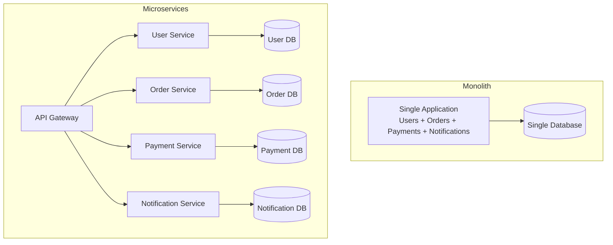
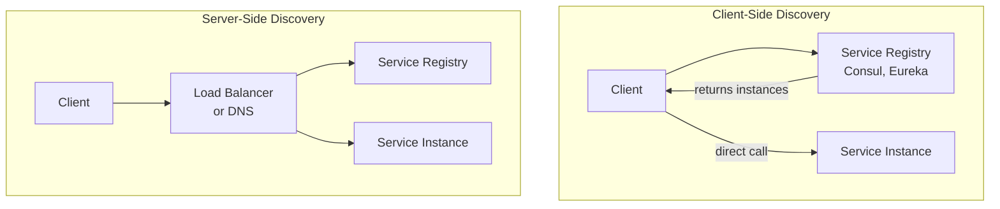
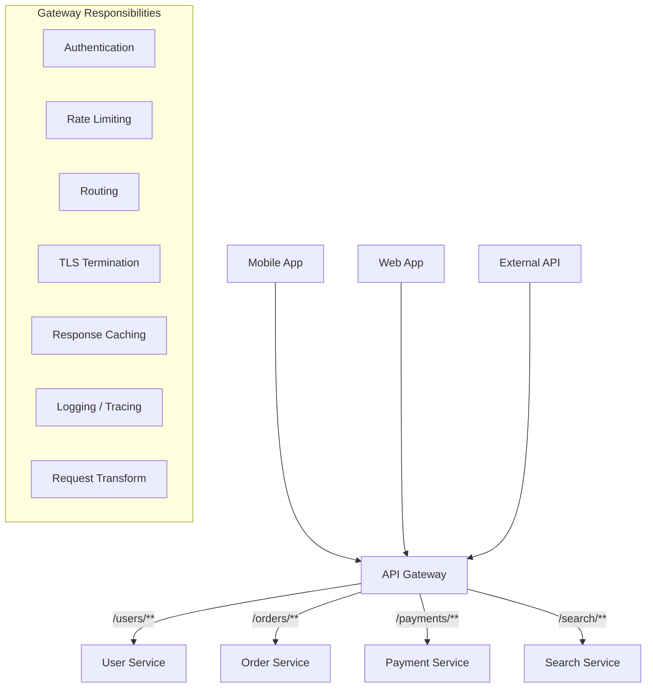
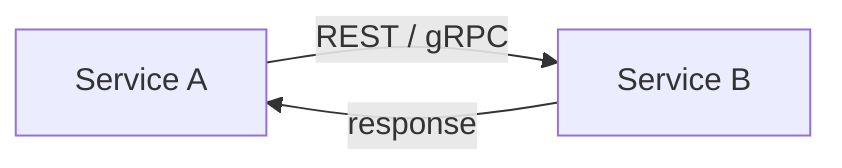
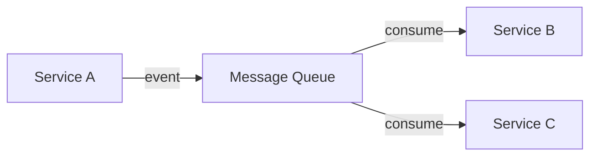
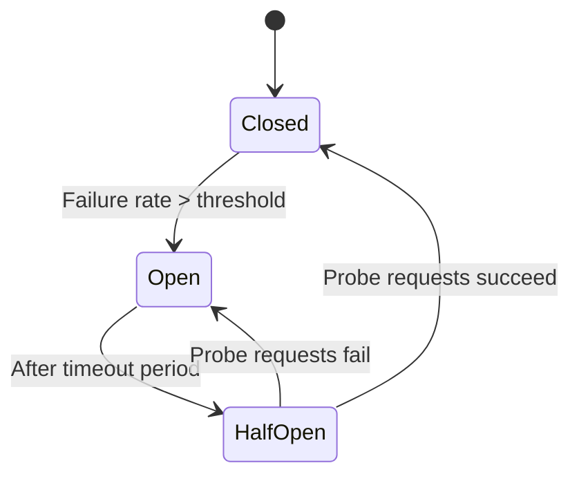
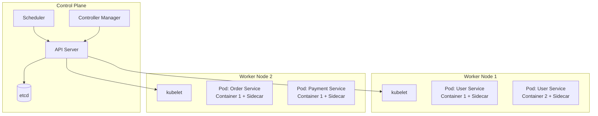
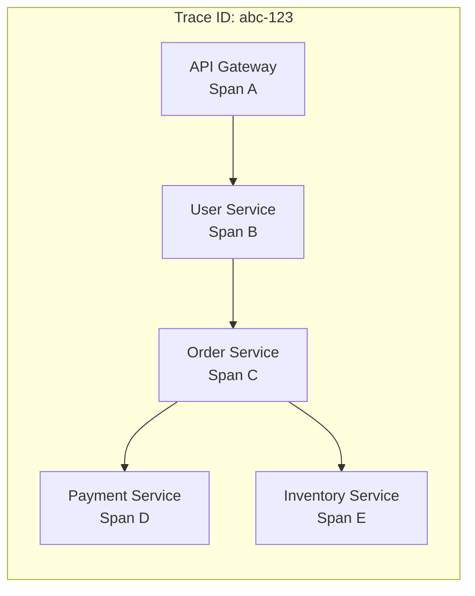
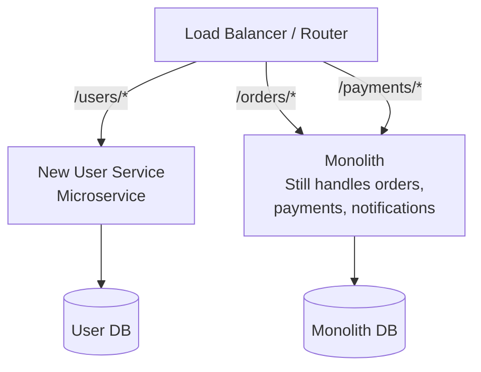
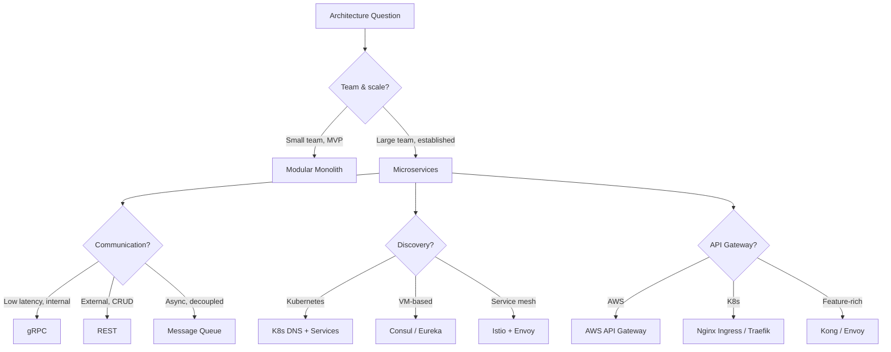

# Microservices Architecture

---

## Monolith vs Microservices

A monolithic application is a single deployable unit where all components (user management, orders, payments, notifications) share one codebase, one database, and one deployment pipeline. A microservices architecture decomposes the application into small, independently deployable services, each owning its own data and communicating over the network.



### When to Choose Each

| Factor | Monolith | Microservices |
|--------|----------|---------------|
| **Team size** | < 10 engineers | > 20 engineers, multiple teams |
| **Product maturity** | MVP, early stage | Established, well-understood domains |
| **Deployment frequency** | Weekly releases OK | Multiple deploys per day needed |
| **Scaling needs** | Uniform scaling | Different components need different scaling |
| **Domain complexity** | Simple, few bounded contexts | Complex, clear domain boundaries |
| **Operational maturity** | Limited DevOps | Strong CI/CD, monitoring, observability |

!!! warning
    Microservices are not inherently better than monoliths. They trade development simplicity for operational complexity. Most startups should start with a modular monolith and extract services only when the pain of the monolith exceeds the cost of distribution.

---

## Service Discovery

In a microservices architecture, services need to find each other. Hard-coded IP addresses don't work when instances are created and destroyed dynamically (auto-scaling, deployments, failures).

### Approaches



| Approach | How It Works | Pros | Cons |
|----------|-------------|------|------|
| **Client-side** | Client queries registry, chooses instance | No extra hop, client controls routing | Client complexity, language-specific |
| **Server-side** | Load balancer queries registry, routes request | Simpler clients, language-agnostic | Extra network hop, LB is a bottleneck |
| **DNS-based** | DNS SRV records resolve to instances | Simple, universal | TTL caching delays, limited health info |
| **Service mesh** | Sidecar proxy handles discovery + routing | Zero code changes, rich features | Operational complexity |

### Java Example: Service Registry with Health Checks

```java
import java.time.Instant;
import java.util.Collections;
import java.util.List;
import java.util.Map;
import java.util.concurrent.ConcurrentHashMap;
import java.util.concurrent.ThreadLocalRandom;

public class ServiceRegistry {

    public record ServiceInstance(
        String serviceId,
        String instanceId,
        String host,
        int port,
        HealthStatus status,
        Instant lastHeartbeat,
        Map<String, String> metadata
    ) {}

    public enum HealthStatus { UP, DOWN, STARTING }

    private final ConcurrentHashMap<String, ConcurrentHashMap<String, ServiceInstance>> registry =
        new ConcurrentHashMap<>();
    private final long heartbeatTimeoutMs;

    public ServiceRegistry(long heartbeatTimeoutMs) {
        this.heartbeatTimeoutMs = heartbeatTimeoutMs;
    }

    public void register(ServiceInstance instance) {
        registry.computeIfAbsent(instance.serviceId(), k -> new ConcurrentHashMap<>())
            .put(instance.instanceId(), instance);
    }

    public void deregister(String serviceId, String instanceId) {
        var instances = registry.get(serviceId);
        if (instances != null) {
            instances.remove(instanceId);
        }
    }

    public void heartbeat(String serviceId, String instanceId) {
        var instances = registry.get(serviceId);
        if (instances != null) {
            ServiceInstance existing = instances.get(instanceId);
            if (existing != null) {
                instances.put(instanceId, new ServiceInstance(
                    existing.serviceId(), existing.instanceId(),
                    existing.host(), existing.port(),
                    HealthStatus.UP, Instant.now(), existing.metadata()
                ));
            }
        }
    }

    public List<ServiceInstance> getHealthyInstances(String serviceId) {
        var instances = registry.get(serviceId);
        if (instances == null) return Collections.emptyList();

        Instant cutoff = Instant.now().minusMillis(heartbeatTimeoutMs);
        return instances.values().stream()
            .filter(i -> i.status() == HealthStatus.UP)
            .filter(i -> i.lastHeartbeat().isAfter(cutoff))
            .toList();
    }

    public ServiceInstance selectInstance(String serviceId) {
        List<ServiceInstance> healthy = getHealthyInstances(serviceId);
        if (healthy.isEmpty()) {
            throw new NoHealthyInstanceException("No healthy instance for: " + serviceId);
        }
        return healthy.get(ThreadLocalRandom.current().nextInt(healthy.size()));
    }
}
```

### Go Example: Service Discovery Client

```go
package discovery

import (
	"fmt"
	"math/rand"
	"sync"
	"time"
)

type Instance struct {
	ServiceID   string
	InstanceID  string
	Host        string
	Port        int
	Healthy     bool
	LastSeen    time.Time
	Metadata    map[string]string
}

func (i Instance) Address() string {
	return fmt.Sprintf("%s:%d", i.Host, i.Port)
}

type Registry struct {
	mu               sync.RWMutex
	services         map[string]map[string]*Instance
	heartbeatTimeout time.Duration
}

func NewRegistry(heartbeatTimeout time.Duration) *Registry {
	r := &Registry{
		services:         make(map[string]map[string]*Instance),
		heartbeatTimeout: heartbeatTimeout,
	}
	go r.evictStale()
	return r
}

func (r *Registry) Register(inst *Instance) {
	r.mu.Lock()
	defer r.mu.Unlock()

	if r.services[inst.ServiceID] == nil {
		r.services[inst.ServiceID] = make(map[string]*Instance)
	}
	inst.LastSeen = time.Now()
	inst.Healthy = true
	r.services[inst.ServiceID][inst.InstanceID] = inst
}

func (r *Registry) Heartbeat(serviceID, instanceID string) bool {
	r.mu.Lock()
	defer r.mu.Unlock()

	instances, ok := r.services[serviceID]
	if !ok {
		return false
	}
	inst, ok := instances[instanceID]
	if !ok {
		return false
	}
	inst.LastSeen = time.Now()
	inst.Healthy = true
	return true
}

func (r *Registry) GetHealthy(serviceID string) []*Instance {
	r.mu.RLock()
	defer r.mu.RUnlock()

	instances := r.services[serviceID]
	cutoff := time.Now().Add(-r.heartbeatTimeout)
	var healthy []*Instance
	for _, inst := range instances {
		if inst.Healthy && inst.LastSeen.After(cutoff) {
			healthy = append(healthy, inst)
		}
	}
	return healthy
}

func (r *Registry) Pick(serviceID string) (*Instance, error) {
	healthy := r.GetHealthy(serviceID)
	if len(healthy) == 0 {
		return nil, fmt.Errorf("no healthy instances for %s", serviceID)
	}
	return healthy[rand.Intn(len(healthy))], nil
}

func (r *Registry) evictStale() {
	ticker := time.NewTicker(r.heartbeatTimeout / 2)
	for range ticker.C {
		r.mu.Lock()
		cutoff := time.Now().Add(-r.heartbeatTimeout)
		for _, instances := range r.services {
			for id, inst := range instances {
				if inst.LastSeen.Before(cutoff) {
					inst.Healthy = false
					delete(instances, id)
				}
			}
		}
		r.mu.Unlock()
	}
}
```

---

## API Gateway

An API gateway is the single entry point for all client requests. It handles cross-cutting concerns so individual services don't have to.



### Gateway Responsibilities

| Responsibility | Description |
|---------------|-------------|
| **Routing** | Route requests to the correct service based on path/header |
| **Authentication** | Validate JWT/API keys before forwarding |
| **Rate limiting** | Protect services from abuse |
| **TLS termination** | Handle HTTPS, services communicate over plain HTTP internally |
| **Request transformation** | Aggregate/split requests, translate protocols |
| **Load balancing** | Distribute across service instances |
| **Circuit breaking** | Stop sending requests to failing services |
| **Observability** | Centralized logging, metrics, distributed tracing |

### Popular API Gateways

| Gateway | Type | Best For |
|---------|------|----------|
| **Kong** | Open-source | Full-featured, plugin ecosystem |
| **AWS API Gateway** | Managed | AWS-native, serverless |
| **Envoy** | Proxy/mesh | High performance, gRPC, service mesh |
| **Nginx** | Web server/proxy | Simple routing, high throughput |
| **Traefik** | Cloud-native | Docker/Kubernetes auto-discovery |

### Java Example: Simple API Gateway with Spring Cloud

```java
import java.time.Duration;
import java.util.Map;
import java.util.UUID;

import org.springframework.boot.autoconfigure.SpringBootApplication;
import org.springframework.cloud.client.discovery.EnableDiscoveryClient;
import org.springframework.cloud.gateway.filter.ratelimit.KeyResolver;
import org.springframework.cloud.gateway.filter.ratelimit.RedisRateLimiter;
import org.springframework.cloud.gateway.route.RouteLocator;
import org.springframework.cloud.gateway.route.builder.RouteLocatorBuilder;
import org.springframework.context.annotation.Bean;
import org.springframework.http.HttpStatus;
import org.springframework.http.ResponseEntity;
import org.springframework.web.bind.annotation.GetMapping;
import org.springframework.web.bind.annotation.RestController;

import reactor.core.publisher.Mono;

@SpringBootApplication
@EnableDiscoveryClient
public class ApiGatewayApplication {

    @Bean
    public RouteLocator customRoutes(RouteLocatorBuilder builder) {
        return builder.routes()
            .route("user-service", r -> r
                .path("/api/v1/users/**")
                .filters(f -> f
                    .stripPrefix(1)
                    .addRequestHeader("X-Request-Id", UUID.randomUUID().toString())
                    .circuitBreaker(cb -> cb
                        .setName("user-service-cb")
                        .setFallbackUri("forward:/fallback/users"))
                    .retry(retryConfig -> retryConfig
                        .setRetries(3)
                        .setBackoff(Duration.ofMillis(100), Duration.ofSeconds(2), 2, true)))
                .uri("lb://user-service"))
            .route("order-service", r -> r
                .path("/api/v1/orders/**")
                .filters(f -> f
                    .stripPrefix(1)
                    .requestRateLimiter(rl -> rl
                        .setRateLimiter(redisRateLimiter())
                        .setKeyResolver(userKeyResolver())))
                .uri("lb://order-service"))
            .build();
    }

    @Bean
    public RedisRateLimiter redisRateLimiter() {
        return new RedisRateLimiter(10, 20); // 10 req/sec, burst of 20
    }

    @Bean
    public KeyResolver userKeyResolver() {
        return exchange -> Mono.just(
            exchange.getRequest().getHeaders().getFirst("X-User-Id"));
    }

    @RestController
    public static class FallbackController {
        @GetMapping("/fallback/users")
        public ResponseEntity<Map<String, String>> userFallback() {
            return ResponseEntity.status(HttpStatus.SERVICE_UNAVAILABLE)
                .body(Map.of("error", "User service temporarily unavailable"));
        }
    }
}
```

---

## Communication Patterns

### Synchronous Communication



| Protocol | Format | Use Case | Latency |
|----------|--------|----------|---------|
| **REST** | JSON over HTTP | External APIs, simple CRUD | Medium |
| **gRPC** | Protobuf over HTTP/2 | Internal service-to-service, streaming | Low |
| **GraphQL** | JSON over HTTP | BFF (Backend for Frontend), client-driven queries | Medium |

### Asynchronous Communication



| Pattern | Mechanism | Use Case |
|---------|-----------|----------|
| **Event-driven** | Publish event to topic | Order created → notify, update inventory, send email |
| **Command** | Send command to queue | Process payment, generate report |
| **Request-reply** | Correlate request/response via queue | Async RPC with guaranteed delivery |

### Python Example: gRPC Service Communication

```python
# order.proto definition (compiled with protoc)
# service OrderService {
#   rpc GetOrder (GetOrderRequest) returns (Order);
#   rpc CreateOrder (CreateOrderRequest) returns (Order);
# }

import grpc
from concurrent import futures
import order_pb2
import order_pb2_grpc

class OrderServicer(order_pb2_grpc.OrderServiceServicer):
    """gRPC server implementation for the Order service."""

    def __init__(self, order_repository, payment_client):
        self.repo = order_repository
        self.payment_client = payment_client

    def GetOrder(self, request, context):
        order = self.repo.find_by_id(request.order_id)
        if order is None:
            context.abort(grpc.StatusCode.NOT_FOUND, "Order not found")
        return self._to_proto(order)

    def CreateOrder(self, request, context):
        order = self.repo.create(
            user_id=request.user_id,
            items=[(item.product_id, item.quantity) for item in request.items],
        )

        # synchronous call to payment service via gRPC
        try:
            payment_response = self.payment_client.charge(
                user_id=request.user_id,
                amount=order.total_amount,
                order_id=order.id,
            )
            order.payment_id = payment_response.payment_id
            order.status = "CONFIRMED"
        except grpc.RpcError as e:
            order.status = "PAYMENT_FAILED"
            context.set_code(grpc.StatusCode.INTERNAL)
            context.set_details(f"Payment failed: {e.details()}")

        self.repo.save(order)
        return self._to_proto(order)

    def _to_proto(self, order):
        return order_pb2.Order(
            order_id=order.id,
            user_id=order.user_id,
            status=order.status,
            total_amount=order.total_amount,
        )

def serve():
    server = grpc.server(futures.ThreadPoolExecutor(max_workers=10))
    order_pb2_grpc.add_OrderServiceServicer_to_server(
        OrderServicer(order_repo, payment_client), server
    )
    server.add_insecure_port("[::]:50051")
    server.start()
    server.wait_for_termination()
```

---

## Resilience Patterns

### Circuit Breaker

Prevents cascading failures by stopping requests to a failing downstream service.



### Bulkhead

Isolates resources per downstream service so one slow service can't exhaust all threads.

### Timeout + Retry + Backoff

Every external call must have a timeout. Failed calls are retried with exponential backoff and jitter.

### Patterns Summary

| Pattern | Protects Against | Mechanism |
|---------|-----------------|-----------|
| **Circuit Breaker** | Cascading failure | Stop calling failing services |
| **Bulkhead** | Resource exhaustion | Isolate thread pools per dependency |
| **Timeout** | Hung connections | Fail fast on slow responses |
| **Retry** | Transient failures | Retry with exponential backoff |
| **Fallback** | Service unavailability | Return cached/default response |
| **Rate Limiter** | Overload | Reject excess requests |

---

## Containerization: Docker and Kubernetes

### Docker

Docker packages an application and its dependencies into a lightweight, portable container.

```dockerfile
# Multi-stage build for a Go microservice
FROM golang:1.22-alpine AS builder
WORKDIR /app
COPY go.mod go.sum ./
RUN go mod download
COPY . .
RUN CGO_ENABLED=0 GOOS=linux go build -o /service ./cmd/server

FROM alpine:3.19
RUN apk --no-cache add ca-certificates
COPY --from=builder /service /service
EXPOSE 8080
ENTRYPOINT ["/service"]
```

### Kubernetes Architecture



### Key Kubernetes Concepts

| Concept | Description |
|---------|-------------|
| **Pod** | Smallest deployable unit; one or more containers |
| **Deployment** | Manages replica sets; handles rolling updates |
| **Service** | Stable network endpoint for a set of pods |
| **Ingress** | External HTTP routing to internal services |
| **ConfigMap / Secret** | Configuration and sensitive data management |
| **HPA** | Horizontal Pod Autoscaler — scales pods based on metrics |
| **Namespace** | Logical isolation within a cluster |

### Kubernetes Deployment Example

```yaml
apiVersion: apps/v1
kind: Deployment
metadata:
  name: order-service
  namespace: production
spec:
  replicas: 3
  selector:
    matchLabels:
      app: order-service
  strategy:
    type: RollingUpdate
    rollingUpdate:
      maxSurge: 1
      maxUnavailable: 0
  template:
    metadata:
      labels:
        app: order-service
        version: v2.1.0
    spec:
      containers:
      - name: order-service
        image: registry.example.com/order-service:v2.1.0
        ports:
        - containerPort: 8080
        resources:
          requests:
            cpu: 250m
            memory: 256Mi
          limits:
            cpu: 500m
            memory: 512Mi
        readinessProbe:
          httpGet:
            path: /health/ready
            port: 8080
          initialDelaySeconds: 10
          periodSeconds: 5
        livenessProbe:
          httpGet:
            path: /health/live
            port: 8080
          initialDelaySeconds: 30
          periodSeconds: 10
        env:
        - name: DB_HOST
          valueFrom:
            secretKeyRef:
              name: order-db-credentials
              key: host
---
apiVersion: v1
kind: Service
metadata:
  name: order-service
  namespace: production
spec:
  selector:
    app: order-service
  ports:
  - port: 80
    targetPort: 8080
  type: ClusterIP
---
apiVersion: autoscaling/v2
kind: HorizontalPodAutoscaler
metadata:
  name: order-service-hpa
  namespace: production
spec:
  scaleTargetRef:
    apiVersion: apps/v1
    kind: Deployment
    name: order-service
  minReplicas: 3
  maxReplicas: 20
  metrics:
  - type: Resource
    resource:
      name: cpu
      target:
        type: Utilization
        averageUtilization: 70
```

---

## Observability

In a microservices architecture, a single user request can traverse 10+ services. Without observability, debugging is impossible.

### The Three Pillars

| Pillar | Purpose | Tools |
|--------|---------|-------|
| **Logs** | Detailed event records | ELK Stack, Loki, CloudWatch Logs |
| **Metrics** | Aggregated numerical measurements | Prometheus, Grafana, Datadog |
| **Traces** | End-to-end request flow across services | Jaeger, Zipkin, AWS X-Ray |

### Distributed Tracing



Each request gets a **trace ID** propagated through all services. Each service creates a **span** with timing information. Together, they form a trace that shows the complete request path and where time was spent.

---

## Migration: Monolith to Microservices

### Strangler Fig Pattern

Gradually replace monolith functionality with microservices, routing traffic to the new service as it's built.



**Steps:**
1. Identify a bounded context to extract (start with the simplest)
2. Build the new microservice alongside the monolith
3. Route traffic for that domain to the new service
4. Replicate data if needed during transition
5. Remove the old code from the monolith
6. Repeat for the next bounded context

---

## Interview Decision Framework



!!! important
    In interviews, demonstrate that you understand the **trade-offs** of microservices, not just the benefits. Mention: increased operational complexity, distributed transactions, network latency, data consistency challenges, and the need for robust monitoring. Show that you know when a monolith is the right choice.

---

## Further Reading

| Topic | Resource | Why This Matters |
|-------|----------|-----------------|
| Building Microservices | Sam Newman (O'Reilly) | Newman's book addresses the fundamental question: *when should you decompose a monolith, and where do you draw service boundaries?* It covers the organizational argument (Conway's Law — team structure determines architecture), the technical patterns (API gateway, circuit breaker, saga), and the operational requirements (independent deployment, monitoring, failure isolation) that must be in place before microservices pay off. |
| Microservices Patterns | Chris Richardson (Manning) | Richardson created microservices.io and this book systematically catalogs 44 patterns organized by concern: decomposition (by business capability, by subdomain), communication (API gateway, messaging), data management (database per service, saga, CQRS), and observability (health check, distributed tracing). Each pattern includes a problem/solution/trade-off structure that maps directly to system design interview answers. |
| Kubernetes in Action | Marko Lukša (Manning) | Kubernetes became the standard platform for deploying microservices because it solves the operational problems that microservices create: service discovery (DNS-based), load balancing (kube-proxy), rolling deployments, self-healing (restart failed containers), and resource isolation (CPU/memory limits). The book explains the architecture (control plane, kubelet, etcd) and the abstractions (Pods, Services, Deployments) that make container orchestration practical. |
| Domain-Driven Design | Eric Evans | Evans' 2003 book introduced bounded contexts — the idea that a single domain model cannot serve an entire organization, and that explicit boundaries between models are necessary. This concept became the primary strategy for microservice decomposition: each bounded context maps to a service with its own data store and ubiquitous language. Without DDD, service boundaries are arbitrary and lead to distributed monoliths. |
| The Twelve-Factor App | [12factor.net](https://12factor.net/) | Heroku engineers distilled 12 principles for building cloud-native applications: externalize config (environment variables), treat backing services as attached resources, scale via stateless processes, and treat logs as event streams. These principles are prerequisites for microservices — a service that stores local state, reads config from files, or depends on sticky sessions cannot be independently scaled or deployed. |
| Envoy Proxy | [envoyproxy.io](https://www.envoyproxy.io/) | Lyft built Envoy to solve the "smart endpoints, dumb pipes" problem at scale: every microservice needs retries, timeouts, circuit breaking, rate limiting, and observability, but implementing this in every service creates massive duplication. Envoy runs as a sidecar proxy alongside each service, handling all L7 networking concerns transparently. It's the data plane behind Istio and the foundation of the service mesh architecture pattern. |
