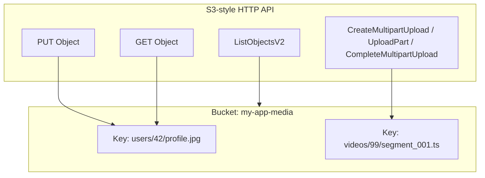
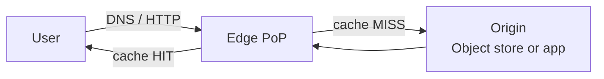
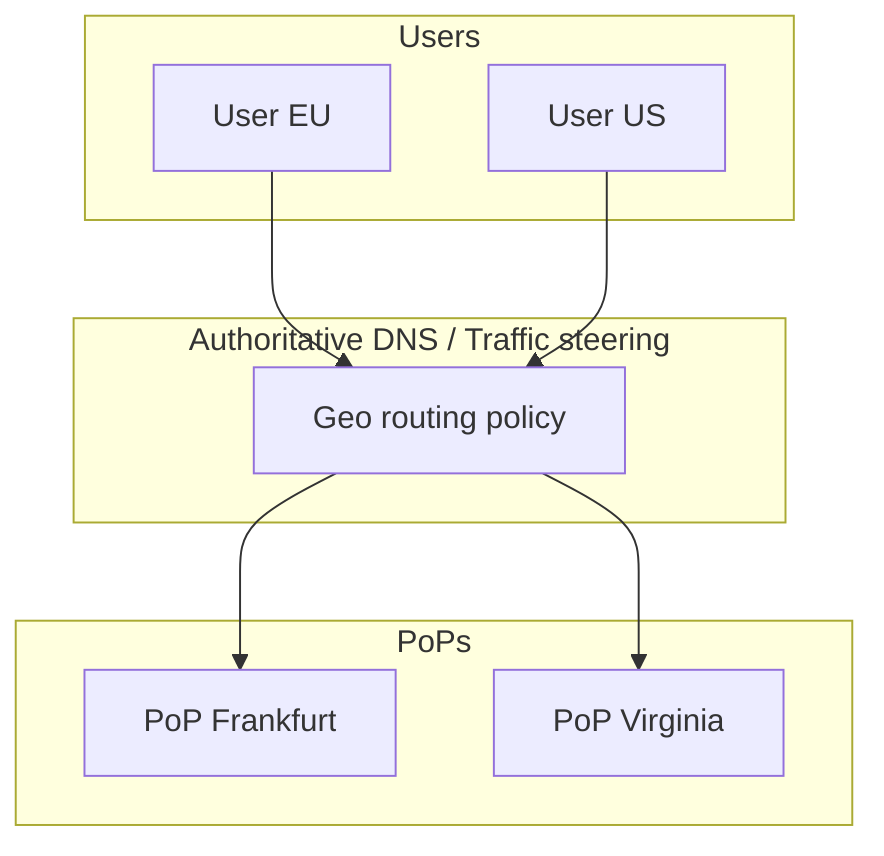
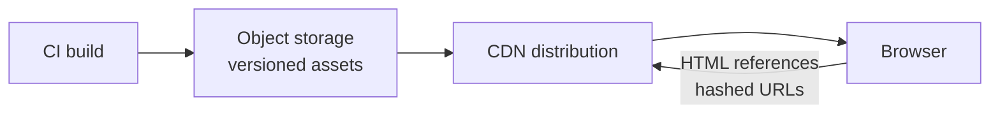
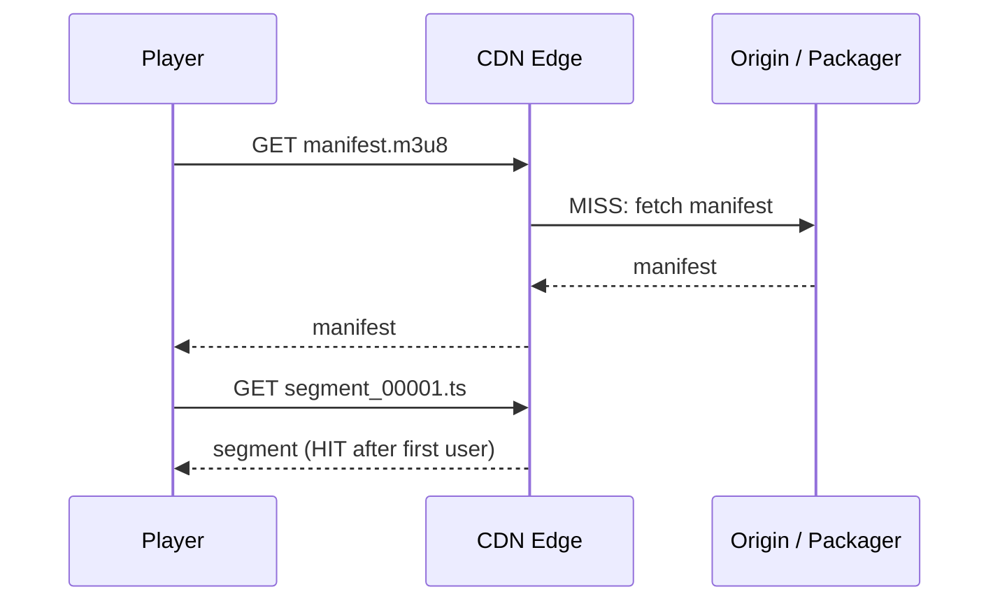
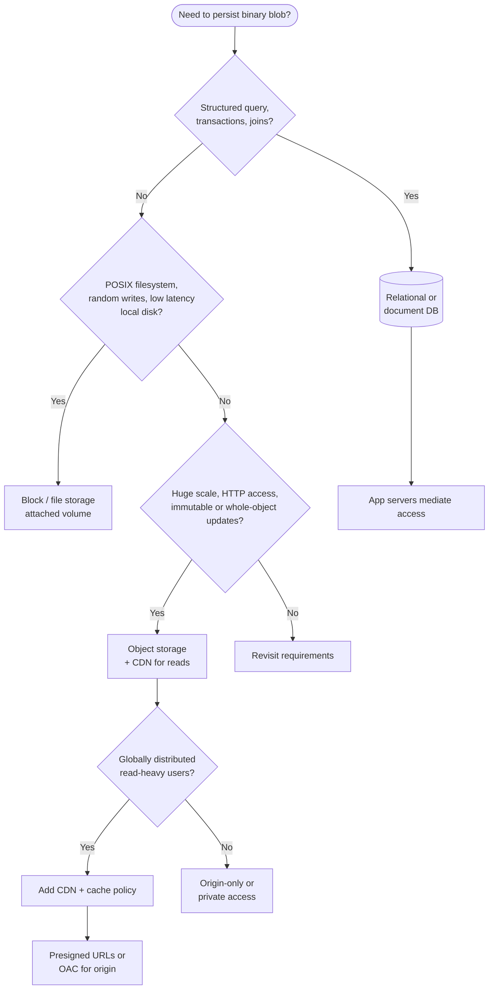

# Object Storage & CDN

---

## Why Object Storage and CDNs Matter

Object storage and content delivery networks are the default backbone for **media-heavy** and **globally distributed** systems. In interviews, designs for image feeds, video platforms, document vaults, software distribution, and static web hosting almost always route through blob storage plus a CDN.

Together they solve three problems at scale:

1. **Durable, cheap bulk storage** without managing filesystems or block devices per server.
2. **High read bandwidth** close to users, offloading origin services and databases.
3. **Controlled access** via time-limited URLs and policy-driven authorization instead of exposing internal networks.

If you can articulate when data belongs in object storage versus a database or a POSIX filesystem, how edge caching behaves, and how to invalidate or version content safely, you demonstrate production awareness beyond “store files in S3.”

!!! tip
    In Staff-level discussions, tie choices to **cost** (egress, request charges, storage class), **consistency** (read-after-write for uploads), and **operational blast radius** (bad cache TTL vs leaked presigned URL).

---

## Object Storage Fundamentals

### What is object storage vs block vs file storage

| Model | Unit | Typical use | Mutability | Interface |
|-------|------|-------------|------------|-----------|
| **Block** | Fixed-size blocks (e.g. 4 KiB) | VM disks, databases on SAN | In-place overwrite | SCSI, NVMe, iSCSI |
| **File** | Hierarchical paths, directories | Shared drives, app servers | In-place overwrite, locks | NFS, SMB |
| **Object** | Flat namespace of `(bucket, key)` blobs | Media, backups, logs, static sites | Replace whole object or version | HTTP REST (S3 API) |

**Object storage** exposes a simple key-value model at massive scale: you upload bytes with a key; you retrieve by key. There is no partial random-write API like a block device; updates are typically **whole-object PUT** or multipart completion. Directories are simulated via **key prefixes** (`user/123/avatar.jpg`), not true filesystem semantics.

!!! note
    Interviewers often probe whether you understand that **listing by prefix** and **strong consistency of listing** are separate concerns from single-key GET semantics on some providers.

### S3-compatible APIs, buckets, keys, metadata

Most cloud object stores follow Amazon S3’s semantics:

- **Bucket**: A container for objects, usually in one **region**, with its own namespace and configuration (versioning, encryption default, lifecycle).
- **Key**: UTF-8 string identifying the object within the bucket. Keys can contain `/` to mimic folders.
- **Object metadata**:
  - **System metadata**: `Content-Type`, `Content-Length`, `ETag`, server-side encryption headers.
  - **User metadata**: `x-amz-meta-*` custom key/value pairs (size limits apply).

S3-compatible APIs include **AWS S3**, **MinIO**, **Cloudflare R2**, **Google Cloud Storage** (S3 interoperability), **Azure Blob** (similar concepts with different names).



### Consistency model (eventual vs strong read-after-write)

Object stores are often described as **eventually consistent** for **list** operations and **delete markers** in versioned buckets, while **single-key GET** after a successful **PUT** of a new object often provides **read-after-write consistency** for that key in many regions (provider-specific).

You should be ready to say in an interview:

- After a successful upload, serving the same URL should return the new bytes (subject to CDN caching — see CDN section).
- **Cross-region replication** may lag; readers in another region might see old data until replication completes.
- **Versioning** exposes multiple object versions under one key; listing versions is a separate API from GET latest.

!!! warning
    Do not assume **strong consistency** for all operations across all vendors. Always qualify with “check the provider’s guarantees for LIST, HEAD, and replication lag.”

### Multi-part uploads for large files

Large objects are uploaded in **parts** (typically 5 MiB–5 GiB per part, minimum part size rules apply):

1. `CreateMultipartUpload` returns an `uploadId`.
2. Client uploads parts in parallel with `UploadPart` (each part gets an `ETag`).
3. `CompleteMultipartUpload` commits the manifest; object becomes visible as one key.

Benefits: **parallelism**, **retry per part**, **checkpointing** for flaky networks. Failure to complete leaves **orphaned parts**; lifecycle rules can abort incomplete uploads after N days.

### Lifecycle policies, storage classes (hot/warm/cold)

**Storage classes** trade cost vs latency and retrieval time:

| Class (example names) | Access pattern | Retrieval | Cost profile |
|------------------------|----------------|-----------|--------------|
| **Standard / hot** | Frequent | Milliseconds | Higher storage, lower access charge |
| **Infrequent / warm** | Monthly access | Milliseconds | Lower storage, per-GB retrieval fee |
| **Archive / cold / glacier** | Rare, minutes–hours acceptable | Async restore job | Lowest storage, highest restore cost/time |

**Lifecycle policies** automate transitions: e.g. move objects to Infrequent after 30 days, to Glacier after 180 days, **expire** old logs after 90 days, **abort incomplete multipart uploads** after 7 days.

!!! note
    In interviews, mention **minimum storage duration** charges for infrequent tiers — moving data in and out has economic consequences, not just technical ones.

---

## Content Delivery Networks (CDN)

### How CDNs work: edge locations, PoPs, origin pull vs push

A **CDN** is a distributed network of **Points of Presence (PoPs)** with **edge caches** that store copies of content closer to end users.



- **Origin pull**: On a cache miss, the edge fetches from origin (S3, app server), stores per TTL, then serves subsequent requests.
- **Origin push** (less common wording): You **upload** assets directly to the CDN or storage integrated with CDN so edges are populated without your app acting as origin for every first request — often combined with **storage + CDN** products.

**Shield / mid-tier caches** (provider-dependent) may sit between edge and origin to collapse duplicate origin fetches.

### Cache invalidation strategies

| Strategy | When to use | Trade-off |
|----------|-------------|-----------|
| **TTL-only** | Immutable assets with hashed filenames (`app.abc123.js`) | Simple; old URLs remain valid until TTL if you reuse names |
| **Purge / invalidation API** | HTML or named files must update before TTL | API rate limits; eventual propagation across PoPs |
| **Versioned URLs** | Best practice for static builds | No purge needed for new deploys |
| **Soft purge** (provider-specific) | Mark stale; revalidate on next request | Faster than full delete |

Interview answer pattern: **prefer immutable content + long TTL**; use **purge** sparingly for exceptions (CMS pages, legal takedowns).

### TTL and cache headers (Cache-Control, ETag, Last-Modified)

- **`Cache-Control`**: `max-age`, `s-maxage` (shared caches), `public` / `private`, `no-store`, `immutable`.
- **`ETag`**: Opaque validator for **conditional GET** (`If-None-Match` → 304 Not Modified).
- **`Last-Modified`**: Time-based validator (`If-Modified-Since`).

For **API response caching** at the edge, only cache **GET** (or explicitly cacheable methods) and respect **Vary** headers if content varies by `Accept-Encoding` or headers.

!!! tip
    Pair **short TTL** on HTML entry pages with **long TTL + hashed names** for JS/CSS/images — the pattern behind most SPAs and static site generators.

### Geo-routing and anycast

- **Geo-based DNS (GSLB)** returns different edge IPs based on resolver location or EDNS Client Subnet.
- **Anycast** advertises the same IP from multiple locations; BGP routes each user to the nearest PoP.

CDNs use these so users hit a **nearby edge** automatically, reducing latency and load on a single region.



---

## Pre-signed URLs and Access Control

### Temporary access tokens

**Pre-signed URLs** grant **time-limited** HTTP GET or PUT to a specific object without sharing long-lived API keys with clients. The server signs a request with credentials; the client uses the URL until expiry.

Typical flows:

- **Download**: Mobile app receives a short-lived GET URL for a private object.
- **Upload**: Client requests a PUT pre-signed URL from your API, then uploads directly to object storage (saving bandwidth through app servers).

!!! note
    Always set **short expiry** for presigned URLs, **least privilege** (single object, specific method), and **HTTPS only** in production.

### Bucket policies, IAM roles, CORS

- **Bucket policy**: JSON attached to the bucket granting cross-account access, public read for static sites (if intended), or conditions on IP / prefix.
- **IAM roles**: Compute (Lambda, ECS task role) assumes a role with `s3:GetObject` instead of embedding keys.
- **CORS**: Required for browser **JavaScript** calling S3 directly; must whitelist origins, methods, and headers for preflight.

Misconfigured **public bucket ACLs** are a common data leak class — in interviews, mention **Block Public Access** defaults and auditing.

---

## CDN Architecture Patterns

### Static asset serving



**Pattern**: Build pipeline uploads to object storage; **CloudFront / Cloudflare / Fastly** fronts the bucket with HTTPS and HTTP/2/3. **Origin Access Control** restricts bucket reads to the CDN only.

### Video streaming (HLS/DASH segments)

Adaptive bitrate streaming splits video into **small segment files** (`.ts` or CMAF) and **manifests** (`.m3u8`, `.mpd`). Each segment is a **cacheable HTTP object**.



Discuss **segment duration** (latency vs switching granularity), **CDN cache** for popular titles, and **DRM** (license servers separate from segments) for premium content.

### API response caching

Use edge caching for **read-heavy, low-personalization** endpoints: product catalog fragments, public leaderboards, feature flags payload (with short TTL).

Avoid caching **authenticated personalized** responses unless you use **edge-side includes**, **cache keys** that include user or segment, or **Vary** correctly — mistakes leak one user’s data to another.

!!! warning
    **Never** cache responses that include **PII** without a strict cache key policy and `private` / `no-store` defaults for sensitive routes.

### Edge compute (Lambda@Edge, Cloudflare Workers)

**Edge functions** run close to users for:

- **Request/response rewriting** (A/B routing, header injection).
- **Auth at edge** (validate JWT before hitting origin).
- **Dynamic personalization** with small logic.

Trade-offs: **CPU/time limits**, **no long-lived connections to arbitrary backends**, **cold start**, **debugging complexity**. Use when latency savings justify operational cost.

---

## Design Considerations for Interviews

### Cost optimization (storage tiers, CDN costs)

- **Storage**: Right-size **storage class**; lifecycle to colder tiers; dedupe large backups where applicable.
- **Egress**: Often the dominant bill — **serve user downloads via CDN** (caching) and **same-cloud origin** to avoid double-charge patterns.
- **Requests**: `LIST` and small GET storms cost money; use **prefix design** and **indexes in DB** instead of listing millions of keys per request.

### Multi-region replication

**Cross-region replication (CRR)** gives **disaster recovery** and **local read** in another geography at the cost of **replication lag**, **eventual consistency** across regions, and **compliance** (data residency).

Interview talking points: **RPO/RTO**, **failover DNS**, **whether writes are regional or global**, and **conflict handling** if the same key is written in two regions (avoid by architecture or use versioning + out-of-band reconciliation).

### Versioning and immutability

**Versioning** retains old objects when overwritten — essential for **accidental overwrite recovery** and **audit**. **Immutable uploads** (new key per version, e.g. content hash as key) simplify CDN caching and rollback.

---

## Interview Decision Framework

Use this flowchart to choose where data lives in a design discussion.



**Heuristics:**

| Need | Prefer |
|------|--------|
| User profiles, orders, inventory | Database |
| Video, images, PDFs, backups, logs | Object storage |
| Database files, VM disks | Block storage |
| Shared team drive, legacy NFS app | File storage |
| Public or large-scale downloads | Object storage + CDN |

!!! tip
    If the interviewer mentions **“users upload profile photos”**, your answer should include **direct-to-S3 upload via presigned POST/PUT**, **virus scanning pipeline**, **image processing** (async workers), and **CDN URL** for delivery — not “store the file in Postgres BYTEA.”

---

## Code Examples

The following examples assume AWS S3; adjust **endpoint** and **credentials** for MinIO or other S3-compatible services. **Never commit real access keys**; use environment variables or IAM roles.

### Upload, download, and presigned URLs

=== "Python"

    ```python
    import boto3
    from botocore.client import Config
    
    def upload_file(local_path: str, bucket: str, key: str) -> None:
        s3 = boto3.client("s3", config=Config(signature_version="s3v4"))
        s3.upload_file(local_path, bucket, key)
    
    def download_file(bucket: str, key: str, local_path: str) -> None:
        s3 = boto3.client("s3", config=Config(signature_version="s3v4"))
        s3.download_file(bucket, key, local_path)
    
    def presigned_get_url(bucket: str, key: str, expires_in: int = 300) -> str:
        s3 = boto3.client("s3", config=Config(signature_version="s3v4"))
        return s3.generate_presigned_url(
            "get_object",
            Params={"Bucket": bucket, "Key": key},
            ExpiresIn=expires_in,
        )
    
    def presigned_put_url(bucket: str, key: str, expires_in: int = 300) -> str:
        s3 = boto3.client("s3", config=Config(signature_version="s3v4"))
        return s3.generate_presigned_url(
            "put_object",
            Params={"Bucket": bucket, "Key": key},
            ExpiresIn=expires_in,
        )
    ```

=== "Java"

    ```java
    import software.amazon.awssdk.auth.credentials.DefaultCredentialsProvider;
    import software.amazon.awssdk.core.sync.RequestBody;
    import software.amazon.awssdk.regions.Region;
    import software.amazon.awssdk.services.s3.S3Client;
    import software.amazon.awssdk.services.s3.model.GetObjectRequest;
    import software.amazon.awssdk.services.s3.model.PutObjectRequest;
    import software.amazon.awssdk.services.s3.presigner.S3Presigner;
    import software.amazon.awssdk.services.s3.presigner.model.GetObjectPresignRequest;
    import software.amazon.awssdk.services.s3.presigner.model.PutObjectPresignRequest;
    
    import java.nio.file.Path;
    import java.time.Duration;
    
    public class S3Examples {
    
        private final S3Client s3;
        private final S3Presigner presigner;
    
        public S3Examples(Region region) {
            var creds = DefaultCredentialsProvider.create();
            this.s3 = S3Client.builder().region(region).credentialsProvider(creds).build();
            this.presigner = S3Presigner.builder().region(region).credentialsProvider(creds).build();
        }
    
        public void upload(String bucket, String key, Path file) {
            s3.putObject(PutObjectRequest.builder().bucket(bucket).key(key).build(),
                    RequestBody.fromFile(file));
        }
    
        public void download(String bucket, String key, Path destination) {
            s3.getObject(GetObjectRequest.builder().bucket(bucket).key(key).build(), destination);
        }
    
        public String presignedGetUrl(String bucket, String key, Duration ttl) {
            var get = GetObjectRequest.builder().bucket(bucket).key(key).build();
            var presign = GetObjectPresignRequest.builder()
                    .signatureDuration(ttl)
                    .getObjectRequest(get)
                    .build();
            return presigner.presignGetObject(presign).url().toString();
        }
    
        public String presignedPutUrl(String bucket, String key, Duration ttl) {
            var put = PutObjectRequest.builder().bucket(bucket).key(key).build();
            var presign = PutObjectPresignRequest.builder()
                    .signatureDuration(ttl)
                    .putObjectRequest(put)
                    .build();
            return presigner.presignPutObject(presign).url().toString();
        }
    }
    ```

=== "Go"

    ```go
    package s3example
    
    import (
    	"context"
    	"io"
    	"os"
    	"time"
    
    	"github.com/aws/aws-sdk-go-v2/config"
    	"github.com/aws/aws-sdk-go-v2/service/s3"
    )
    
    func Upload(ctx context.Context, bucket, key, localPath string) error {
    	cfg, err := config.LoadDefaultConfig(ctx)
    	if err != nil {
    		return err
    	}
    	client := s3.NewFromConfig(cfg)
    	f, err := os.Open(localPath)
    	if err != nil {
    		return err
    	}
    	defer f.Close()
    	_, err = client.PutObject(ctx, &s3.PutObjectInput{
    		Bucket: &bucket,
    		Key:    &key,
    		Body:   f,
    	})
    	return err
    }
    
    func Download(ctx context.Context, bucket, key, localPath string) error {
    	cfg, err := config.LoadDefaultConfig(ctx)
    	if err != nil {
    		return err
    	}
    	client := s3.NewFromConfig(cfg)
    	out, err := client.GetObject(ctx, &s3.GetObjectInput{Bucket: &bucket, Key: &key})
    	if err != nil {
    		return err
    	}
    	defer out.Body.Close()
    	f, err := os.Create(localPath)
    	if err != nil {
    		return err
    	}
    	defer f.Close()
    	_, err = io.Copy(f, out.Body)
    	return err
    }
    
    // PresignGet uses the built-in presign helper (SDK v2).
    func PresignGet(ctx context.Context, bucket, key string, ttl time.Duration) (string, error) {
    	cfg, err := config.LoadDefaultConfig(ctx)
    	if err != nil {
    		return "", err
    	}
    	client := s3.NewFromConfig(cfg)
    	presign := s3.NewPresignClient(client)
    	out, err := presign.PresignGetObject(ctx, &s3.GetObjectInput{
    		Bucket: &bucket,
    		Key:    &key,
    	}, func(o *s3.PresignOptions) {
    		o.Expires = ttl
    	})
    	if err != nil {
    		return "", err
    	}
    	return out.URL, nil
    }
    
    // PresignPut signs a PUT for direct browser/client upload.
    func PresignPut(ctx context.Context, bucket, key string, ttl time.Duration) (string, error) {
    	cfg, err := config.LoadDefaultConfig(ctx)
    	if err != nil {
    		return "", err
    	}
    	client := s3.NewFromConfig(cfg)
    	presign := s3.NewPresignClient(client)
    	out, err := presign.PresignPutObject(ctx, &s3.PutObjectInput{
    		Bucket: &bucket,
    		Key:    &key,
    	}, func(o *s3.PresignOptions) {
    		o.Expires = ttl
    	})
    	if err != nil {
    		return "", err
    	}
    	return out.URL, nil
    }
    ```

!!! note
    For custom signing policies beyond `PresignClient`, use `github.com/aws/aws-sdk-go-v2/aws/signer/v4` with explicit `Sign` calls; most apps use `s3.NewPresignClient` only.

---

## Further Reading

- **Amazon S3 User Guide** — Consistency model, multipart upload, storage classes, and replication (official AWS documentation).
- **RFC 7234** — HTTP caching semantics (`Cache-Control`, validation).
- **Mozilla MDN: HTTP caching** — Practical guide to browser and shared caches.
- **AWS Well-Architected: Cost Optimization** — Data transfer and storage tier patterns.
- **“High Performance Browser Networking” (Ilya Grigorik)** — CDN, TCP, and HTTP/2 behavior for latency-sensitive designs.

---

## Quick interview checklist

| Topic | One-liner |
|-------|-----------|
| Object vs block vs file | Objects are whole-blob key-value at scale; blocks are disk chunks; files are POSIX trees. |
| CDN miss path | Edge fetches from origin, caches for TTL, then serves hot. |
| Presigned URL | Time-limited signed HTTP URL; no long-lived secrets to clients. |
| Cost | Egress and requests often dominate; tier and cache deliberately. |
| Consistency | Per-key read-after-write common; cross-region and LIST may lag. |

!!! tip
    Close design questions by stating **monitoring**: 4xx/5xx from origin, **cache hit ratio**, **S3 request rate**, and **billing alerts** on egress spikes.
