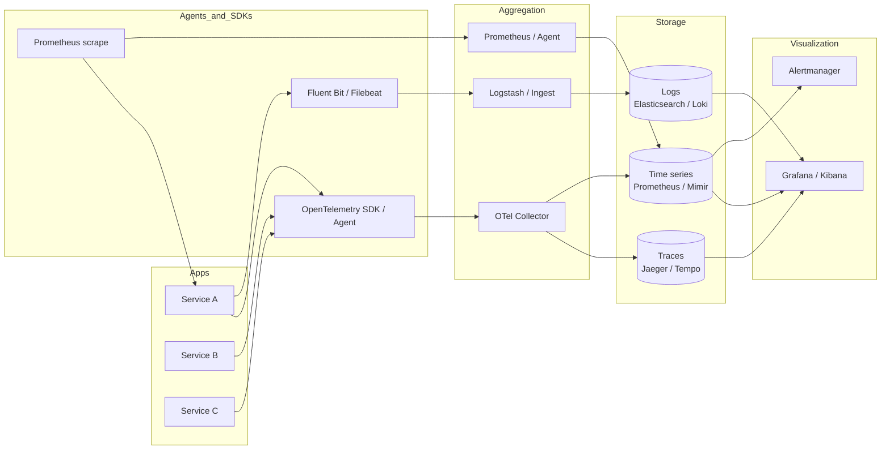
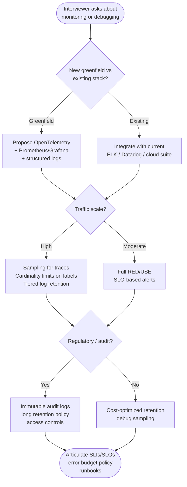

# Observability

---

## Why Observability Matters

**Monitoring** traditionally means predefined dashboards and alerts on known failure modes: CPU high, disk full, HTTP 5xx rate above a threshold. You watch metrics you already decided matter. That works when failures repeat known patterns.

**Observability** is the ability to understand a system's internal state from its **external outputs** — logs, metrics, and traces — so you can ask novel questions when something unexpected happens. You can drill from a symptom (spike in latency) down to specific traces and logs without redeploying new instrumentation.

The **three pillars** are often described as:

| Pillar | What it answers | Typical signal |
|--------|-----------------|----------------|
| **Logs** | What happened, in narrative or structured form? | Discrete events with context |
| **Metrics** | How much, how often, over time? | Aggregated numeric time series |
| **Traces** | How did a request flow through services? | Causal chains of operations (spans) |

!!! note
    The three pillars are a useful mental model, not a shopping list. In practice they **correlate**: trace IDs link to log lines; RED metrics sit on top of trace-derived or request-scoped measurements. Modern platforms (OpenTelemetry, vendor suites) unify collection and context propagation.

---

## Logging

### Structured logging (JSON)

Unstructured logs ("`User login failed`") are hard to query at scale. **Structured logging** emits machine-parseable records — often **JSON** — with stable field names (`level`, `message`, `trace_id`, `user_id`, `duration_ms`).

Benefits:

- Filter and aggregate in Elasticsearch, Loki, or cloud log analytics without regex fragility.
- Correlate with metrics and traces when fields align (same `trace_id`).

### Log levels and when to use each

| Level | Use | Example |
|-------|-----|---------|
| **ERROR** | Failures requiring attention; may need paging | Payment provider timeout after retries |
| **WARN** | Degraded but handled; worth tracking trends | Circuit breaker opened, fallback used |
| **INFO** | Business-significant lifecycle events | Order placed, shipment dispatched |
| **DEBUG** | Diagnostic detail for development | Cache key resolved, query plan |
| **TRACE** | Very verbose, often disabled in production | Per-frame parsing in a protocol |

!!! warning
    **Avoid** logging secrets, full payment payloads, or raw tokens — even in ERROR. Prefer structured fields with redaction policies. Volume at INFO/DEBUG can dominate storage cost; sample or gate verbose logs in production.

### Log aggregation (ELK stack: Elasticsearch, Logstash, Kibana)

A common pattern:

1. **Agents** (Filebeat, Fluent Bit) ship logs from hosts or containers.
2. **Logstash** (or ingest pipelines) parses, enriches, and routes to **Elasticsearch**.
3. **Kibana** provides search, dashboards, and alerting on indexed documents.

Alternatives include **OpenSearch** (Elasticsearch fork), **Grafana Loki** (label-indexed, pairs well with Prometheus), and managed offerings (CloudWatch, Datadog, Splunk).

### Log retention and storage costs

- Hot retention (fast queries, full text) is expensive; **tier** to warm/cold storage or object storage for compliance.
- **Sampling** high-cardinality debug logs; keep ERROR/audit longer than DEBUG.
- **Cardinality** of indexed fields (e.g. `user_id` on every line) explodes index size; sometimes aggregate metrics instead of logging every event.

### Correlation IDs for request tracing

A **correlation ID** (or **request ID**) is generated at the edge (API gateway, load balancer) and passed through headers (`X-Request-ID`, `traceparent` with OpenTelemetry). Every log line for that request includes the same ID so you can filter one user's journey across services.

### Structured logging with correlation

=== "Python"

    ```python
    import structlog
    import logging
    
    structlog.configure(
        processors=[
            structlog.stdlib.add_log_level,
            structlog.processors.TimeStamper(fmt="iso"),
            structlog.processors.JSONRenderer(),
        ],
        wrapper_class=structlog.stdlib.BoundLogger,
        context_class=dict,
        logger_factory=structlog.stdlib.LoggerFactory(),
    )
    
    log = structlog.get_logger()
    
    def handle_checkout(correlation_id: str, order_id: str) -> None:
        bind = log.bind(correlation_id=correlation_id, order_id=order_id)
        bind.info("checkout_started")
        bind.warning("payment_retry", attempt=1)
        bind.info("checkout_completed")
    ```

=== "Java"

    ```java
    import org.slf4j.Logger;
    import org.slf4j.LoggerFactory;
    import org.slf4j.MDC;
    
    public final class CheckoutHandler {
    
        private static final Logger log = LoggerFactory.getLogger(CheckoutHandler.class);
    
        public void handle(String correlationId, String orderId) {
            MDC.put("correlation_id", correlationId);
            MDC.put("order_id", orderId);
            try {
                log.info("checkout_started");
                processPayment(orderId);
                log.info("checkout_completed");
            } finally {
                MDC.clear();
            }
        }
    
        private void processPayment(String orderId) {
            log.warn("payment_retry attempt=1 order_id={}", orderId);
        }
    }
    ```

=== "Go"

    ```go
    package main
    
    import (
    	"context"
    	"log/slog"
    	"os"
    )
    
    func main() {
    	h := slog.NewJSONHandler(os.Stdout, &slog.HandlerOptions{Level: slog.LevelInfo})
    	logger := slog.New(h)
    
    	ctx := context.Background()
    	logger.InfoContext(ctx, "checkout_started",
    		slog.String("correlation_id", "req-abc"),
    		slog.String("order_id", "ord-123"),
    	)
    	logger.WarnContext(ctx, "payment_retry",
    		slog.String("order_id", "ord-123"),
    		slog.Int("attempt", 1),
    	)
    }
    ```

Configure Logback with a JSON encoder (e.g. `logstash-logback-encoder`) so MDC keys become JSON fields.

---

## Metrics

### Types: counters, gauges, histograms, summaries

| Type | Behavior | Example |
|------|----------|---------|
| **Counter** | Monotonically increasing (reset on process restart) | `http_requests_total` |
| **Gauge** | Point-in-time value, up or down | `queue_depth`, `memory_bytes` |
| **Histogram** | Observations in configurable buckets; exposes `_count`, `_sum`, `_bucket` | Request latency distribution |
| **Summary** | Pre-computed quantiles (client-side); differs by implementation | Legacy latency quantiles |

Histograms power **SLI** percentile latency (e.g. p99) when scraped by Prometheus-compatible systems.

### RED method (Rate, Errors, Duration) for services

**RED** focuses on request-driven services:

- **Rate**: requests per second (throughput).
- **Errors**: failed requests (ratio or count), typically HTTP 5xx or business error codes.
- **Duration**: latency distribution (histogram), not just the mean.

If RED is healthy for a service, users usually get a good experience unless resource-level saturation is the bottleneck (then add **USE**).

### USE method (Utilization, Saturation, Errors) for resources

**USE** applies to **resources**: CPUs, disks, network interfaces, connection pools.

- **Utilization**: percentage busy (e.g. disk I/O time).
- **Saturation**: extra work queued (run queue length, disk await).
- **Errors**: failed operations (I/O errors, packet drops).

!!! tip
    Combine **RED** on the service with **USE** on nodes and shared infrastructure to separate "my app is slow" from "the disk is saturated."

### Prometheus + Grafana stack

**Prometheus** scrapes HTTP endpoints (pull model), stores time series, and evaluates **recording** and **alerting** rules. **Grafana** queries Prometheus (and other sources) for dashboards.

Characteristics:

- PromQL for powerful queries (`histogram_quantile`, `rate`, `increase`).
- Labels drive cardinality — avoid unbounded label values (raw `user_id` as a label is usually wrong).

### Time-series databases

Prometheus is embedded TSDB for many teams; at larger scale you may use **Thanos**, **Cortex**, or **Mimir** for long-term storage and global query. Cloud-native options include **Amazon Timestream**, **Azure Monitor**, **Google Cloud Monitoring**.

### Alerting strategies (avoid alert fatigue)

- Alert on **SLI/SLO** burn or user-visible symptoms, not every threshold twitch.
- Use **multi-window, multi-burn-rate** alerts for error budgets (see SLO section).
- **Group** related alerts; **deduplicate** and **suppress** during maintenance windows.
- Every alert should have a **runbook** or owner; delete alerts nobody acts on.

### Checkout metrics (Prometheus-style)

=== "Python"

    ```python
    from prometheus_client import Counter, Histogram, start_http_server
    
    CHECKOUT_STARTED = Counter("checkout_started_total", "Checkout flows started")
    CHECKOUT_LATENCY = Histogram(
        "checkout_latency_seconds",
        "Checkout latency",
        buckets=(0.005, 0.01, 0.025, 0.05, 0.1, 0.25, 0.5, 1.0),
    )
    
    def checkout() -> None:
        CHECKOUT_STARTED.inc()
        with CHECKOUT_LATENCY.time():
            do_work()
    
    def do_work() -> None:
        pass
    
    if __name__ == "__main__":
        start_http_server(8000)
    ```

=== "Java"

    ```java
    import io.micrometer.core.instrument.Counter;
    import io.micrometer.core.instrument.MeterRegistry;
    import io.micrometer.core.instrument.Timer;
    
    public final class OrderService {
    
        private final Counter checkoutStarted;
        private final Timer checkoutLatency;
    
        public OrderService(MeterRegistry registry) {
            this.checkoutStarted = Counter.builder("checkout_started_total")
                .description("Checkout flows started")
                .register(registry);
            this.checkoutLatency = Timer.builder("checkout_latency_seconds")
                .publishPercentileHistogram()
                .register(registry);
        }
    
        public void checkout() {
            checkoutStarted.increment();
            checkoutLatency.recordCallable(() -> {
                return doWork();
            });
        }
    
        private String doWork() throws Exception {
            Thread.sleep(10);
            return "ok";
        }
    }
    ```

=== "Go"

    ```go
    package main
    
    import (
    	"net/http"
    
    	"github.com/prometheus/client_golang/prometheus"
    	"github.com/prometheus/client_golang/prometheus/promauto"
    	"github.com/prometheus/client_golang/prometheus/promhttp"
    )
    
    var (
    	checkoutStarted = promauto.NewCounter(prometheus.CounterOpts{
    		Name: "checkout_started_total",
    		Help: "Checkout flows started",
    	})
    	checkoutLatency = promauto.NewHistogram(prometheus.HistogramOpts{
    		Name:    "checkout_latency_seconds",
    		Help:    "Checkout latency",
    		Buckets: prometheus.DefBuckets,
    	})
    )
    
    func checkout() {
    	checkoutStarted.In()
    	timer := prometheus.NewTimer(checkoutLatency)
    	defer timer.ObserveDuration()
    	doWork()
    }
    
    func doWork() {}
    
    func main() {
    	http.Handle("/metrics", promhttp.Handler())
    	_ = http.ListenAndServe(":8000", nil)
    }
    ```

---

## Distributed Tracing

### What is a trace, span, context propagation

- **Trace**: end-to-end story of one distributed operation (e.g. one HTTP request), identified by a **trace ID**.
- **Span**: one unit of work within a trace (e.g. "SELECT in DB", "HTTP POST to payment API"). Spans have start/end times, attributes, and parent/child links.
- **Context propagation**: trace and span IDs cross process boundaries via **headers** (W3C Trace Context: `traceparent`, `tracestate`) so downstream services continue the same trace without ad-hoc IDs.

### OpenTelemetry standard

**OpenTelemetry (OTel)** defines APIs, SDKs, and the **OTLP** protocol for exporting traces, metrics, and logs to backends (Jaeger, Tempo, vendor agents). It reduces vendor lock-in and unifies instrumentation across languages.

### Jaeger / Zipkin

**Jaeger** and **Zipkin** are open-source tracing backends: collect spans, store them, and provide UI for trace search and dependency graphs. In production, traces often land in managed APM or **Grafana Tempo** + Grafana for correlation with Loki/Prometheus.

### Sampling strategies (head-based, tail-based)

| Strategy | When decision happens | Pros | Cons |
|----------|----------------------|------|------|
| **Head-based** | At trace start (random %, rate limited) | Simple, low memory | Might drop the exact rare trace you need |
| **Tail-based** (e.g. some commercial pipelines) | After spans collected, keep interesting traces | Keeps errors/slow paths | Higher buffering cost and complexity |

!!! important
    Always sample in high-traffic systems — 100% tracing can overwhelm collectors and storage. Tune sample rate against cost and debuggability.

### Trace correlation with logs and metrics

- Inject **trace_id** and **span_id** into log fields (OTel logging bridge).
- **Exemplars** in Prometheus link a metric data point to example trace IDs (where supported).
- In Grafana, jumping from a metric spike to representative traces is the ideal workflow.

### OpenTelemetry span example

=== "Python"

    ```python
    from opentelemetry import trace
    from opentelemetry.sdk.trace import TracerProvider
    from opentelemetry.sdk.trace.export import BatchSpanProcessor, ConsoleSpanExporter
    
    provider = TracerProvider()
    provider.add_span_processor(BatchSpanProcessor(ConsoleSpanExporter()))
    trace.set_tracer_provider(provider)
    
    tracer = trace.get_tracer(__name__)
    
    def charge(order_id: str) -> None:
        with tracer.start_as_current_span("charge") as span:
            span.set_attribute("order.id", order_id)
            call_provider()
    
    def call_provider() -> None:
        pass
    ```

=== "Java"

    ```java
    import io.opentelemetry.api.OpenTelemetry;
    import io.opentelemetry.api.trace.Span;
    import io.opentelemetry.api.trace.Tracer;
    import io.opentelemetry.context.Scope;
    
    public final class PaymentClient {
    
        private final Tracer tracer;
    
        public PaymentClient(OpenTelemetry otel) {
            this.tracer = otel.getTracer("payments", "1.0.0");
        }
    
        public void charge(String orderId) {
            Span span = tracer.spanBuilder("charge")
                .setAttribute("order.id", orderId)
                .startSpan();
            try (Scope scope = span.makeCurrent()) {
                callProvider();
            } catch (Exception e) {
                span.recordException(e);
                throw e;
            } finally {
                span.end();
            }
        }
    
        private void callProvider() {
            // outbound HTTP would propagate context automatically with OTel instrumentation
        }
    }
    ```

=== "Go"

    ```go
    package main
    
    import (
    	"context"
    
    	"go.opentelemetry.io/otel"
    	"go.opentelemetry.io/otel/attribute"
    	"go.opentelemetry.io/otel/codes"
    )
    
    func charge(ctx context.Context, orderID string) error {
    	tracer := otel.Tracer("payments")
    	ctx, span := tracer.Start(ctx, "charge")
    	defer span.End()
    	span.SetAttributes(attribute.String("order.id", orderID))
    	if err := callProvider(ctx); err != nil {
    		span.RecordError(err)
    		span.SetStatus(codes.Error, err.Error())
    		return err
    	}
    	return nil
    }
    
    func callProvider(ctx context.Context) error {
    	return nil
    }
    ```

---

## Health Checks and SLIs/SLOs/SLAs

### Liveness vs readiness probes

Kubernetes (and similar runtimes) use:

- **Liveness**: Is the process stuck or deadlocked? Failure → **restart** the container.
- **Readiness**: Can this instance accept traffic? Failure → **remove** from load balancer until healthy.

!!! warning
    Do not put slow dependencies (full database checks) on **liveness** — transient blips restart the whole pod. Use **readiness** for dependency checks; keep liveness cheap.

### Defining SLIs (latency, availability, throughput)

**SLI** (Service Level Indicator) is a **measured** aspect of service quality:

- **Latency**: proportion of requests faster than a threshold (e.g. p99 < 300 ms).
- **Availability**: proportion of successful requests (e.g. non-5xx, or valid business success).
- **Throughput**: requests per second sustained under SLO conditions.

Good SLIs are **user-centric** (what the client experiences), not only CPU metrics.

### Setting SLOs and error budgets

**SLO** (Service Level Objective) is a **target** for an SLI over a window (e.g. 99.9% of monthly requests succeed).

**Error budget** = allowed bad events (e.g. 0.1% of requests). When the budget burns fast, **freeze features** and invest in reliability; when healthy, you can ship faster or take more risk.

### SLA implications

**SLA** (Service Level Agreement) is a **contract** with customers — often with **financial credits** if missed. SLAs are typically **stricter or equal** to internal SLOs (you want buffer between internal target and external promise).

---

## Alerting Best Practices

### Symptom-based vs cause-based alerts

- **Symptom-based**: Latency SLO burn, error rate spike, checkout failure rate — what users feel.
- **Cause-based**: Disk 90% full, one pod restarted — useful for operators but noisy if not tied to symptoms.

Prefer paging humans for **symptoms**; **causes** can be dashboards or low-priority tickets unless correlated.

### Alert fatigue prevention

- Require alerts to be **actionable** and **owned**.
- **Tune** thresholds using historical data; avoid static limits that fire every Tuesday.
- **On-call runbooks**: if the alert fires twice with no doc, fix the alert or the system.

### Runbooks and automated remediation

- **Runbook**: step-by-step diagnosis (check dependency dashboard, recent deploy, failover procedure).
- **Automated remediation**: restart unhealthy instances, scale out, circuit-break downstream — reduces toil when safe.

---

## Observability Architecture

End-to-end flow from applications to insight:



**Collection agents** unify OTLP, logs, and scrapes; **aggregation** routes, samples, and enriches; **storage** optimizes for each signal type; **visualization** ties dashboards and alerts together.

---

## Interview Decision Framework

Use this flow in system design discussions when observability comes up:



**Talking points:**

- Start from **user-visible** SLIs, then derive metrics and traces.
- Mention **correlation** (trace ID in logs) and **one** concrete stack you know.
- Acknowledge **cost**: logs are not free; traces need sampling.

---

## Further Reading

- [OpenTelemetry](https://opentelemetry.io/docs/) — OpenTelemetry merged the competing OpenTracing and OpenCensus projects into a single vendor-neutral standard for traces, metrics, and logs. It solves the vendor lock-in problem: instrument once with OTel SDKs, then export to any backend (Jaeger, Datadog, Grafana). The documentation covers the collector architecture, context propagation (W3C Trace Context), and auto-instrumentation for major frameworks.
- [Google SRE Book — Monitoring Distributed Systems](https://sre.google/sre-book/monitoring-distributed-systems/) — This chapter defines the monitoring philosophy that shaped modern observability: monitor for *symptoms* (user-visible errors, latency) not *causes* (CPU usage, disk space). It introduced the "four golden signals" (latency, traffic, errors, saturation) and SLO-based alerting — alert when the error budget is being consumed too fast, not on arbitrary thresholds.
- [Prometheus documentation](https://prometheus.io/docs/introduction/overview/) — Prometheus pioneered the pull-based metrics model (scraping `/metrics` endpoints) and the multi-dimensional data model (time series identified by metric name + label set). PromQL enables powerful queries like "p99 latency per endpoint per region over the last hour." Understanding Prometheus's architecture (TSDB storage, recording rules, alertmanager) is essential for any metrics-based observability system design.
- [W3C Trace Context](https://www.w3.org/TR/trace-context/) — Before this standard, each tracing system (Zipkin, Jaeger, Datadog) used incompatible propagation headers, breaking traces at service boundaries that used different vendors. W3C Trace Context defines `traceparent` and `tracestate` headers that enable end-to-end trace propagation across heterogeneous systems — a prerequisite for observability in microservice architectures.
- [The RED Method](https://www.weave.works/blog/the-red-method-key-metrics-for-microservices-architecture/) — Tom Wilkie (Grafana) created RED (Rate, Errors, Duration) as a service-centric monitoring framework. Unlike USE (which monitors infrastructure), RED monitors *what users experience*: request rate, error rate, and latency distribution. These three metrics per service endpoint provide the minimum viable observability for any microservice.
- [USE Method](http://www.brendangregg.com/usemethod.html) — Brendan Gregg's USE method (Utilization, Saturation, Errors) is a systematic approach for analyzing *infrastructure* performance: for every resource (CPU, memory, disk, network), check utilization (% busy), saturation (queue depth), and errors. It prevents the common mistake of monitoring averages instead of bottlenecks and provides a checklist-driven approach to performance troubleshooting.

!!! tip
    In interviews, naming **RED**, **USE**, **SLO/error budget**, and **head vs tail sampling** signals production experience — but always tie choices back to **what users experience** and **operational cost**.
