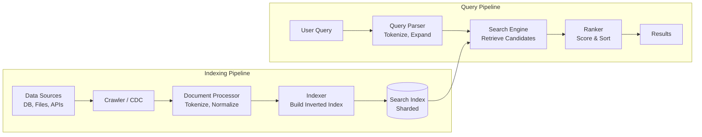
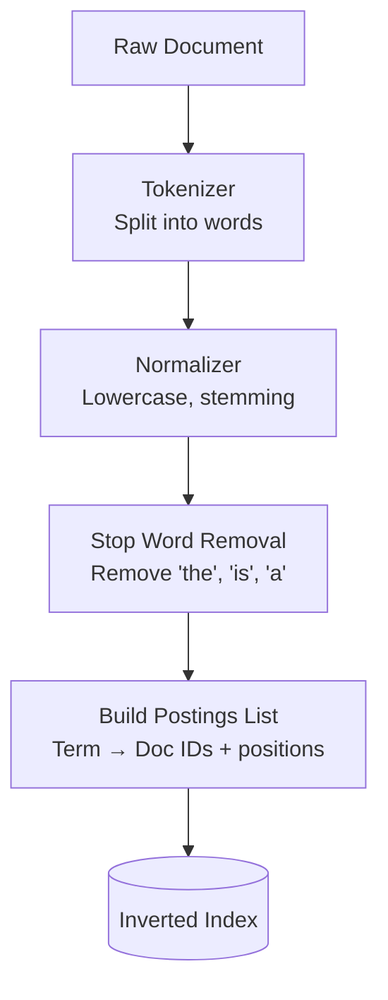
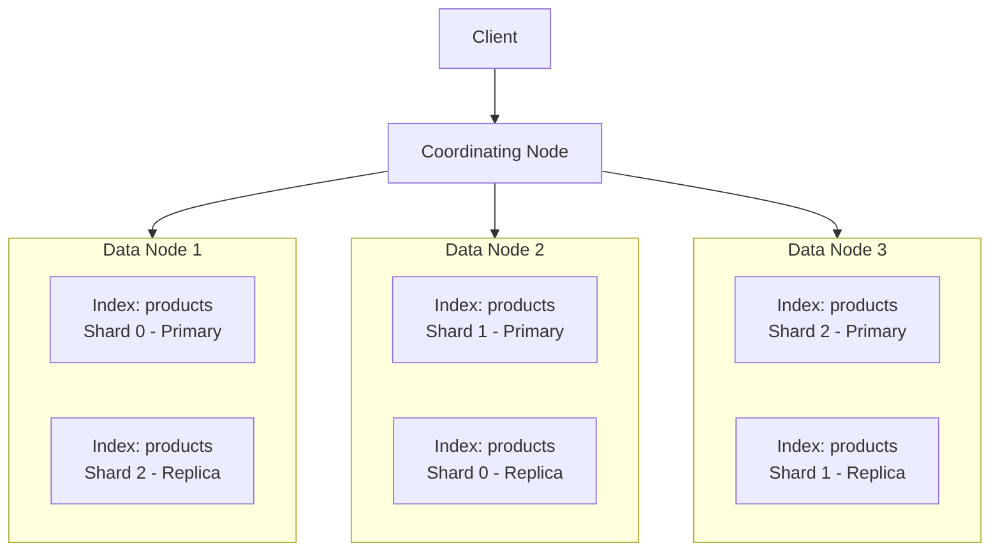
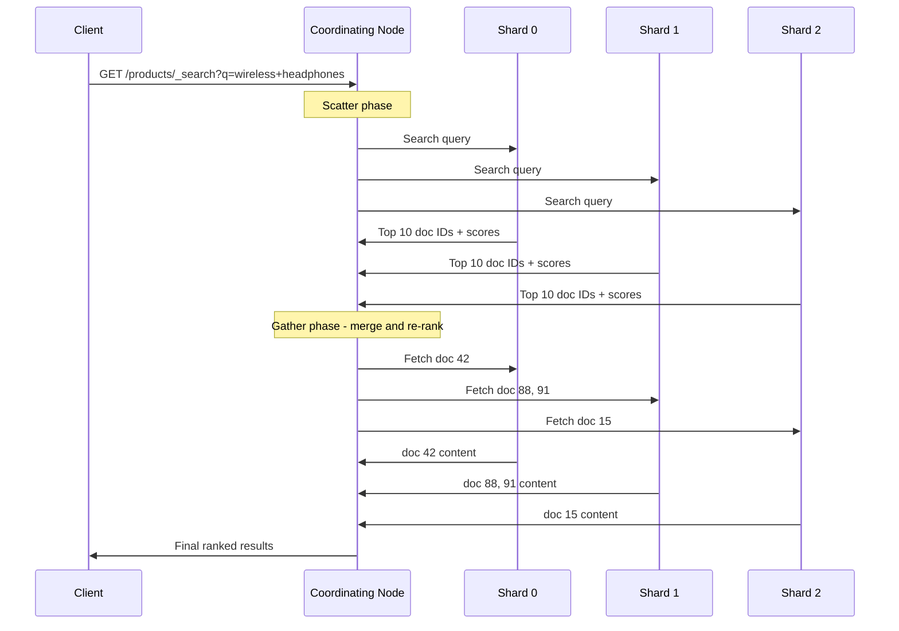
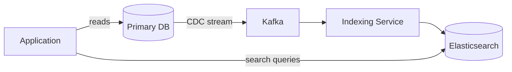
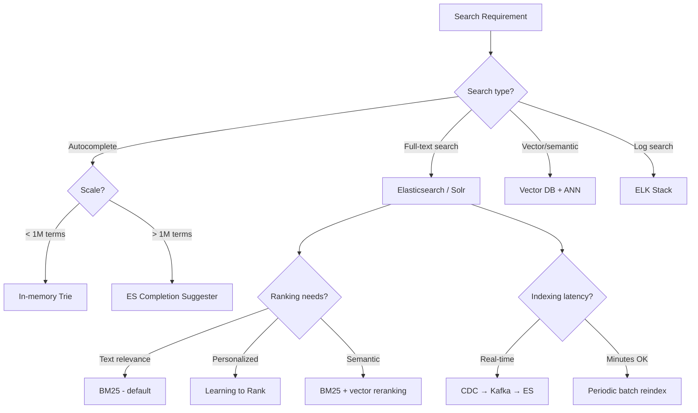

# Search Systems

---

## Why Search Matters in System Design

Search is one of the most common and most complex features in modern applications. Whether it's Google, Amazon product search, Slack message search, or autocomplete suggestions — every large-scale system has a search component. Interviewers love search questions because they touch on data structures, distributed systems, relevance ranking, and user experience.

---

## How Search Works: The Big Picture



Search systems have two main pipelines:
1. **Indexing pipeline** — processes documents and builds a searchable index (offline/near-real-time)
2. **Query pipeline** — processes user queries and retrieves ranked results (online, low-latency)

---

## Inverted Index

The inverted index is the foundational data structure behind full-text search. Instead of mapping documents to words (forward index), it maps **words to documents**.

### Forward Index vs Inverted Index

**Forward Index** (what a database does):

```
Doc 1 → ["the", "quick", "brown", "fox"]
Doc 2 → ["the", "lazy", "brown", "dog"]
Doc 3 → ["quick", "fox", "jumps", "over"]
```

To find all documents containing "fox", you must scan every document — O(N).

**Inverted Index** (what a search engine does):

```
"brown" → [Doc 1, Doc 2]
"dog"   → [Doc 2]
"fox"   → [Doc 1, Doc 3]
"jumps" → [Doc 3]
"lazy"  → [Doc 2]
"over"  → [Doc 3]
"quick" → [Doc 1, Doc 3]
"the"   → [Doc 1, Doc 2]
```

To find all documents containing "fox", you look up one entry — O(1).

### Building an Inverted Index



### Building an inverted index

=== "Python"

    ```python
    from collections import defaultdict
    from dataclasses import dataclass, field
    import re
    
    @dataclass
    class Posting:
        doc_id: int
        term_frequency: int
        positions: list[int] = field(default_factory=list)
    
    class InvertedIndex:
        STOP_WORDS = frozenset({
            'the', 'is', 'at', 'which', 'on', 'a', 'an', 'and', 'or',
            'but', 'in', 'of', 'to', 'for', 'with', 'as', 'by',
        })
    
        def __init__(self):
            self.index: dict[str, list[Posting]] = defaultdict(list)
            self.doc_store: dict[int, str] = {}
            self.doc_count = 0
    
        def add_document(self, doc_id: int, content: str) -> None:
            self.doc_store[doc_id] = content
            self.doc_count += 1
    
            tokens = self._tokenize(content)
            term_positions: dict[str, list[int]] = defaultdict(list)
    
            for pos, token in enumerate(tokens):
                term = self._normalize(token)
                if term and term not in self.STOP_WORDS:
                    term_positions[term].append(pos)
    
            for term, positions in term_positions.items():
                self.index[term].append(Posting(doc_id, len(positions), positions))
    
        def search(self, query: str) -> list[Posting]:
            term = self._normalize(query.strip())
            return self.index.get(term, [])
    
        def boolean_and(self, *terms: str) -> list[int]:
            if not terms:
                return []
            result_sets = [
                {p.doc_id for p in self.search(t)} for t in terms
            ]
            intersection = result_sets[0]
            for s in result_sets[1:]:
                intersection &= s
            return sorted(intersection)
    
        def _tokenize(self, text: str) -> list[str]:
            return re.findall(r'\w+', text.lower())
    
        def _normalize(self, token: str) -> str | None:
            if len(token) < 2:
                return None
            if token.endswith('ing') and len(token) > 5:
                return token[:-3]
            if token.endswith('ed') and len(token) > 4:
                return token[:-2]
            if token.endswith('s') and not token.endswith('ss'):
                return token[:-1]
            return token
    ```

=== "Java"

    ```java
    import java.util.*;
    import java.util.concurrent.ConcurrentHashMap;
    
    public class InvertedIndex {
    
        public record Posting(int docId, int termFrequency, List<Integer> positions) {}
    
        private final Map<String, List<Posting>> index = new ConcurrentHashMap<>();
        private final Map<Integer, String> docStore = new ConcurrentHashMap<>();
        private int docCount = 0;
    
        public void addDocument(int docId, String content) {
            docStore.put(docId, content);
            docCount++;
    
            String[] tokens = tokenize(content);
            Map<String, List<Integer>> termPositions = new HashMap<>();
    
            for (int i = 0; i < tokens.length; i++) {
                String term = normalize(tokens[i]);
                if (term != null && !isStopWord(term)) {
                    termPositions.computeIfAbsent(term, k -> new ArrayList<>()).add(i);
                }
            }
    
            for (Map.Entry<String, List<Integer>> entry : termPositions.entrySet()) {
                String term = entry.getKey();
                List<Integer> positions = entry.getValue();
                Posting posting = new Posting(docId, positions.size(), positions);
                index.computeIfAbsent(term, k -> new ArrayList<>()).add(posting);
            }
        }
    
        public List<Posting> search(String query) {
            String term = normalize(query.trim());
            return index.getOrDefault(term, Collections.emptyList());
        }
    
        public List<Integer> booleanAndSearch(String query1, String query2) {
            List<Posting> list1 = search(query1);
            List<Posting> list2 = search(query2);
            Set<Integer> docs1 = new HashSet<>();
            list1.forEach(p -> docs1.add(p.docId()));
            return list2.stream()
                .map(Posting::docId)
                .filter(docs1::contains)
                .toList();
        }
    
        private String[] tokenize(String text) {
            return text.toLowerCase().split("[\\s\\p{Punct}]+");
        }
    
        private String normalize(String token) {
            if (token == null || token.length() < 2) return null;
            // simple stemming: remove trailing 's', 'ing', 'ed'
            if (token.endsWith("ing") && token.length() > 5) {
                return token.substring(0, token.length() - 3);
            }
            if (token.endsWith("ed") && token.length() > 4) {
                return token.substring(0, token.length() - 2);
            }
            if (token.endsWith("s") && !token.endsWith("ss")) {
                return token.substring(0, token.length() - 1);
            }
            return token;
        }
    
        private static final Set<String> STOP_WORDS = Set.of(
            "the", "is", "at", "which", "on", "a", "an", "and", "or", "but",
            "in", "of", "to", "for", "with", "as", "by", "this", "that"
        );
    
        private boolean isStopWord(String term) {
            return STOP_WORDS.contains(term);
        }
    }
    ```

---

## Relevance Ranking

Retrieving matching documents is only half the problem. The other half is **ranking** them by relevance.

### TF-IDF (Term Frequency - Inverse Document Frequency)

TF-IDF measures how important a word is to a document within a collection.

```
TF(t, d) = (count of t in d) / (total terms in d)

IDF(t) = log(N / df(t))
         where N = total documents, df(t) = documents containing t

TF-IDF(t, d) = TF(t, d) × IDF(t)
```

**Intuition:**
- A word that appears frequently in a document (high TF) is probably relevant
- A word that appears in most documents (low IDF), like "the", is not discriminating
- TF-IDF balances these: high for words that are frequent in this document but rare overall

### BM25 (Best Matching 25)

BM25 is the successor to TF-IDF and the default ranking algorithm in Elasticsearch and Solr.

```
BM25(q, d) = Σ IDF(qi) × (f(qi, d) × (k1 + 1)) / (f(qi, d) + k1 × (1 - b + b × |d| / avgdl))
```

Where:
- `f(qi, d)` = frequency of query term qi in document d
- `|d|` = document length
- `avgdl` = average document length
- `k1` = term frequency saturation (typically 1.2)
- `b` = document length normalization (typically 0.75)

**BM25 improvements over TF-IDF:**
- Term frequency saturation (diminishing returns for repeated terms)
- Document length normalization (long documents don't unfairly dominate)
- Better empirical performance

### Java Example: BM25 Scorer

```java
import java.util.List;
import java.util.Map;

public class BM25Scorer {
    private final double k1;
    private final double b;
    private final double avgDocLength;
    private final int totalDocs;
    private final Map<String, Integer> documentFrequencies;

    public BM25Scorer(double k1, double b, double avgDocLength,
                       int totalDocs, Map<String, Integer> documentFrequencies) {
        this.k1 = k1;
        this.b = b;
        this.avgDocLength = avgDocLength;
        this.totalDocs = totalDocs;
        this.documentFrequencies = documentFrequencies;
    }

    public double score(List<String> queryTerms, Map<String, Integer> termFreqsInDoc,
                         int docLength) {
        double score = 0.0;
        for (String term : queryTerms) {
            int tf = termFreqsInDoc.getOrDefault(term, 0);
            int df = documentFrequencies.getOrDefault(term, 0);
            if (tf == 0 || df == 0) continue;

            double idf = Math.log((totalDocs - df + 0.5) / (df + 0.5) + 1.0);
            double tfNorm = (tf * (k1 + 1.0)) /
                (tf + k1 * (1.0 - b + b * docLength / avgDocLength));
            score += idf * tfNorm;
        }
        return score;
    }

    public static BM25Scorer withDefaults(double avgDocLength, int totalDocs,
                                           Map<String, Integer> docFreqs) {
        return new BM25Scorer(1.2, 0.75, avgDocLength, totalDocs, docFreqs);
    }
}
```

---

## Elasticsearch

Elasticsearch is the most widely used distributed search engine. Built on Apache Lucene, it provides full-text search, analytics, and near-real-time indexing.

### Architecture



### Key Concepts

| Concept | Description | RDBMS Equivalent |
|---------|-------------|-----------------|
| **Index** | Collection of documents | Database table |
| **Document** | A JSON record | Table row |
| **Field** | A key-value in a document | Column |
| **Shard** | A partition of an index (Lucene index) | Table partition |
| **Replica** | A copy of a shard for fault tolerance | Read replica |
| **Mapping** | Schema definition for fields | Table schema |
| **Analyzer** | Tokenizer + filters for text processing | N/A |

### How a Search Query Executes



This is a **scatter-gather** pattern:
1. **Scatter:** query is sent to all shards in parallel
2. **Local search:** each shard finds its top-K matches using its local index
3. **Gather:** coordinating node merges results, re-ranks globally, fetches full documents

### Elasticsearch vs Solr

| Factor | Elasticsearch | Solr |
|--------|--------------|------|
| **API** | RESTful JSON | REST + SolrJ |
| **Schema** | Schemaless (dynamic mapping) | Schema-based (schema.xml) |
| **Real-time** | Near-real-time by default | Requires explicit commit |
| **Scaling** | Designed for horizontal scale | Horizontal with SolrCloud |
| **Analytics** | Built-in aggregation framework | Faceting, pivot |
| **Ecosystem** | ELK stack (Elasticsearch, Logstash, Kibana) | Standalone |
| **Community** | Larger, more active | Mature, Apache Foundation |

---

## Autocomplete / Typeahead

Autocomplete is a search feature that suggests completions as the user types. It requires sub-50ms latency to feel responsive.

### Approaches

| Approach | Mechanism | Pros | Cons |
|----------|-----------|------|------|
| **Trie** | Prefix tree in memory | Very fast lookups | Memory-intensive for large vocabularies |
| **Completion Suggester** | Elasticsearch FST-based | Distributed, integrated with search | Less flexible than custom trie |
| **Prefix query** | Query-time prefix matching | Simple | Slow on large indexes |
| **Edge n-grams** | Index-time prefix tokenization | Fast queries, customizable | Larger index size |

### Java Example: Weighted Trie for Autocomplete

```java
import java.util.Collections;
import java.util.Comparator;
import java.util.HashMap;
import java.util.List;
import java.util.Map;
import java.util.PriorityQueue;

public class AutocompleteTrie {

    private static class TrieNode {
        final Map<Character, TrieNode> children = new HashMap<>();
        final PriorityQueue<Suggestion> topSuggestions =
            new PriorityQueue<>(Comparator.comparingLong(s -> s.weight));
        boolean isEnd = false;
        String fullTerm = null;
        long weight = 0;
        static final int MAX_SUGGESTIONS = 10;
    }

    public record Suggestion(String term, long weight) {}

    private final TrieNode root = new TrieNode();

    public void insert(String term, long weight) {
        TrieNode current = root;
        for (char c : term.toLowerCase().toCharArray()) {
            current = current.children.computeIfAbsent(c, k -> new TrieNode());
            updateTopSuggestions(current, term, weight);
        }
        current.isEnd = true;
        current.fullTerm = term;
        current.weight = weight;
    }

    private void updateTopSuggestions(TrieNode node, String term, long weight) {
        Suggestion suggestion = new Suggestion(term, weight);

        node.topSuggestions.removeIf(s -> s.term().equals(term));
        node.topSuggestions.offer(suggestion);

        while (node.topSuggestions.size() > TrieNode.MAX_SUGGESTIONS) {
            node.topSuggestions.poll(); // remove lowest weight
        }
    }

    public List<Suggestion> autocomplete(String prefix, int limit) {
        TrieNode current = root;
        for (char c : prefix.toLowerCase().toCharArray()) {
            current = current.children.get(c);
            if (current == null) return Collections.emptyList();
        }
        return current.topSuggestions.stream()
            .sorted(Comparator.comparingLong(Suggestion::weight).reversed())
            .limit(limit)
            .toList();
    }

    public static void main(String[] args) {
        AutocompleteTrie trie = new AutocompleteTrie();
        trie.insert("system design", 50000);
        trie.insert("system design interview", 30000);
        trie.insert("systems programming", 10000);
        trie.insert("systematic", 5000);

        List<Suggestion> results = trie.autocomplete("sys", 5);
        results.forEach(s -> System.out.printf("%-30s (weight: %d)%n", s.term(), s.weight()));
    }
}
```

### Go Example: Trie-Based Autocomplete

```go
package search

import (
	"sort"
	"strings"
	"sync"
)

type Suggestion struct {
	Term   string
	Weight int64
}

type trieNode struct {
	children       map[rune]*trieNode
	topSuggestions []Suggestion
	isEnd          bool
}

type AutocompleteTrie struct {
	root           *trieNode
	maxSuggestions int
	mu             sync.RWMutex
}

func NewAutocompleteTrie(maxSuggestions int) *AutocompleteTrie {
	return &AutocompleteTrie{
		root:           &trieNode{children: make(map[rune]*trieNode)},
		maxSuggestions: maxSuggestions,
	}
}

func (t *AutocompleteTrie) Insert(term string, weight int64) {
	t.mu.Lock()
	defer t.mu.Unlock()

	current := t.root
	for _, ch := range strings.ToLower(term) {
		if current.children[ch] == nil {
			current.children[ch] = &trieNode{children: make(map[rune]*trieNode)}
		}
		current = current.children[ch]
		t.updateTop(current, term, weight)
	}
	current.isEnd = true
}

func (t *AutocompleteTrie) updateTop(node *trieNode, term string, weight int64) {
	// remove existing entry for the same term
	filtered := node.topSuggestions[:0]
	for _, s := range node.topSuggestions {
		if s.Term != term {
			filtered = append(filtered, s)
		}
	}
	node.topSuggestions = append(filtered, Suggestion{Term: term, Weight: weight})

	sort.Slice(node.topSuggestions, func(i, j int) bool {
		return node.topSuggestions[i].Weight > node.topSuggestions[j].Weight
	})
	if len(node.topSuggestions) > t.maxSuggestions {
		node.topSuggestions = node.topSuggestions[:t.maxSuggestions]
	}
}

func (t *AutocompleteTrie) Search(prefix string, limit int) []Suggestion {
	t.mu.RLock()
	defer t.mu.RUnlock()

	current := t.root
	for _, ch := range strings.ToLower(prefix) {
		next, ok := current.children[ch]
		if !ok {
			return nil
		}
		current = next
	}

	if limit > len(current.topSuggestions) {
		limit = len(current.topSuggestions)
	}
	result := make([]Suggestion, limit)
	copy(result, current.topSuggestions[:limit])
	return result
}
```

---

## Search System Design Considerations

### Sharding Strategy for Search

| Strategy | How It Works | Trade-off |
|----------|-------------|-----------|
| **Document-based** | Each shard holds a subset of documents | Queries hit all shards (scatter-gather) |
| **Term-based** | Each shard holds a subset of terms | Queries hit fewer shards but hard to balance |
| **Time-based** | Each shard covers a time window | Great for logs/events, bad for product search |

### Near-Real-Time Indexing



**Change Data Capture (CDC)** streams database changes to Kafka, and an indexing service continuously updates Elasticsearch. Typical latency: 1-5 seconds from write to searchable.

### Handling Typos: Fuzzy Search

Fuzzy search uses **edit distance** (Levenshtein distance) to find terms similar to the query term:

```
"headphnes" → edit distance 1 from "headphones" → match!

Edit operations: insert, delete, substitute, transpose
```

Most search engines support fuzzy queries with configurable maximum edit distance (typically 1-2).

---

## Interview Decision Framework



!!! important
    When designing a search system in an interview, always address: (1) how data gets into the index (indexing pipeline), (2) how queries are executed (scatter-gather), (3) how results are ranked (BM25 + optional re-ranking), and (4) how the system scales (sharding, replication).

---

## Further Reading

| Topic | Resource | Why This Matters |
|-------|----------|-----------------|
| Elasticsearch: The Definitive Guide | [elastic.co/guide](https://www.elastic.co/guide/en/elasticsearch/reference/current/index.html) | Elasticsearch made distributed full-text search accessible by wrapping Apache Lucene in a RESTful API with automatic sharding, replication, and cluster management. The guide covers inverted index internals, analyzers (tokenization, stemming, synonyms), and query DSL — essential for understanding how search systems trade precision for recall and how shard allocation affects query latency. |
| Information Retrieval | [nlp.stanford.edu/IR-book](https://nlp.stanford.edu/IR-book/) | The Stanford IR textbook (Manning, Raghavan, Schütze) is the foundational reference for search system internals: how inverted indexes are constructed and compressed, tf-idf scoring, boolean and vector space models, and evaluation metrics (precision, recall, F1, MAP). It provides the theoretical framework that makes it possible to reason about *why* one search system returns better results than another. |
| BM25 Explained | [The Probabilistic Relevance Framework](https://www.staff.city.ac.uk/~sbrp622/papers/foundations_bm25_review.pdf) | BM25 (Best Matching 25) is the default ranking function in Elasticsearch, Solr, and most search engines. It improved on tf-idf by incorporating document length normalization and term frequency saturation (diminishing returns for repeated terms). This review paper explains the probabilistic derivation and the tunable parameters (k1, b) that control ranking behavior — knowledge needed to tune search relevance. |
| Lucene in Action | Manning Publications | Apache Lucene is the search library underlying Elasticsearch, Solr, and many other search systems. The book explains segment-based indexing (why Lucene writes immutable segments and periodically merges them — analogous to LSM trees), the analyzer chain (character filters → tokenizer → token filters), and near-real-time search. Understanding Lucene internals is essential for diagnosing search performance and relevance problems. |
| Trie Data Structure | [Wikipedia: Trie](https://en.wikipedia.org/wiki/Trie) | Tries (prefix trees) are the core data structure for search autocomplete: they enable O(m) prefix lookups (where m is query length) regardless of dictionary size. Understanding tries, compressed tries (Patricia/radix trees), and ternary search trees explains how autocomplete systems provide sub-millisecond suggestions from dictionaries of millions of terms. |
