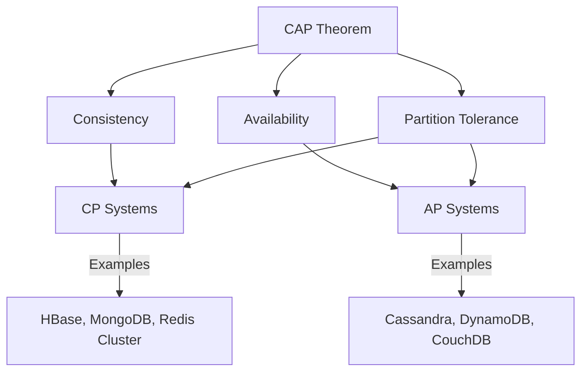
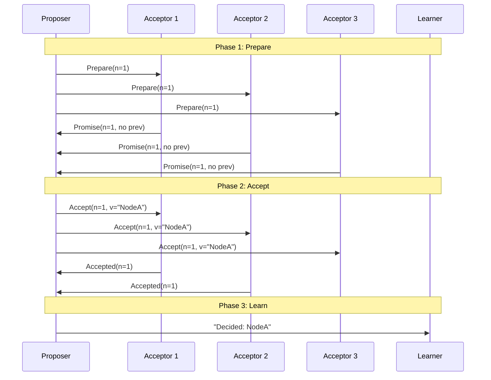
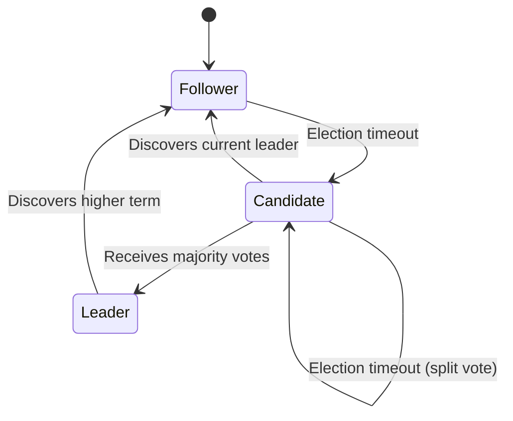
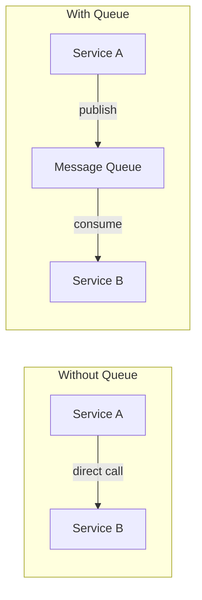
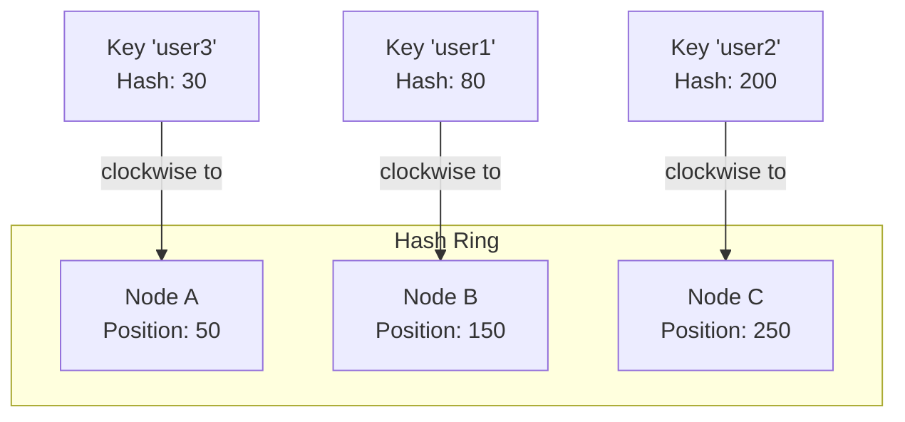
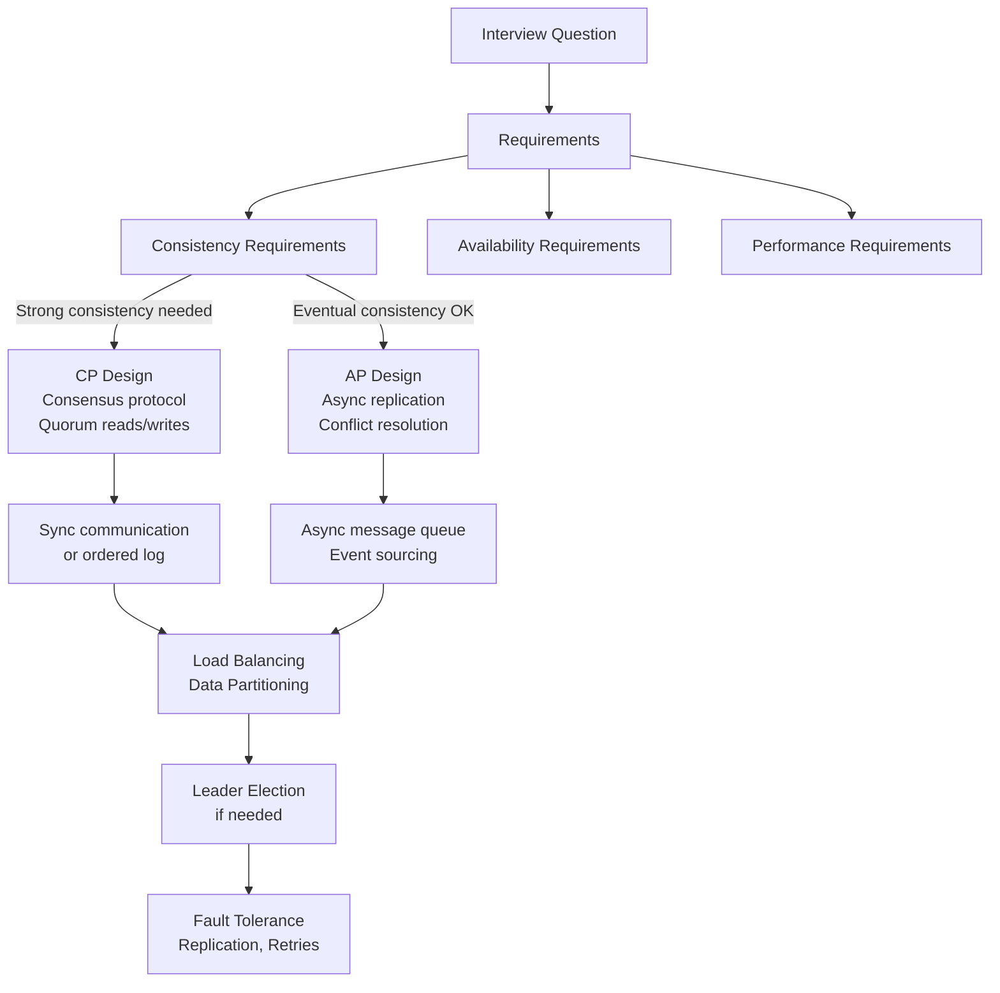

# Distributed Systems Concepts

---

## What is a Distributed System?

A distributed system is a collection of independent computers that appears to its users as a single coherent system. These machines communicate over a network to coordinate their actions and share data. Every large-scale application you use daily—Google Search, Netflix, Amazon—is a distributed system.

### Why Distributed Systems Exist

A single machine has hard limits: CPU cores, RAM, disk I/O, and network bandwidth. When your application outgrows one machine, you must spread work across multiple machines. This introduces powerful capabilities but also fundamental challenges.

| Challenge | Description |
|-----------|-------------|
| **Partial failure** | Some nodes can fail while others continue operating |
| **No global clock** | Machines cannot perfectly synchronize their clocks |
| **Network unreliability** | Messages can be lost, duplicated, delayed, or reordered |
| **Concurrency** | Multiple nodes may attempt conflicting operations simultaneously |

### The Eight Fallacies of Distributed Computing

Peter Deutsch and James Gosling identified assumptions that developers incorrectly make about distributed systems:

1. The network is reliable
2. Latency is zero
3. Bandwidth is infinite
4. The network is secure
5. Topology doesn't change
6. There is one administrator
7. Transport cost is zero
8. The network is homogeneous

!!! warning
    Every design decision in a distributed system must account for these realities. Ignoring any of them leads to brittle production systems.

---

## CAP Theorem

!!! note
    CAP theorem is also covered from a database perspective in [Databases](databases.md). This section focuses on the distributed systems angle.

The CAP theorem, proposed by Eric Brewer in 2000 and proven by Seth Gilbert and Nancy Lynch in 2002, states that a distributed data store can provide at most **two out of three** guarantees simultaneously:



### The Three Guarantees

**Consistency (C):** Every read receives the most recent write or an error. All nodes see the same data at the same time.

**Availability (A):** Every request receives a non-error response, without guarantee that it contains the most recent write.

**Partition Tolerance (P):** The system continues to operate despite network partitions (message loss or delay between nodes).

### Why You Must Choose

In a real distributed system, network partitions **will** happen. You cannot avoid them. So Partition Tolerance is non-negotiable. This means your real choice is between **Consistency** and **Availability** during a partition:

| Choice | Behavior During Partition | Example |
|--------|--------------------------|---------|
| **CP** | Reject requests to maintain consistency | A banking system that refuses writes rather than risk inconsistent account balances |
| **AP** | Accept requests but allow stale reads | A social media feed that shows slightly old posts rather than going offline |

### Java Example: Demonstrating CP vs AP Behavior

```java
import java.util.HashMap;
import java.util.List;
import java.util.Map;

/**
 * Demonstrates CP behavior: a distributed counter that rejects writes
 * when it cannot confirm consistency across replicas.
 */
public class CPCounter {
    private final List<ReplicaNode> replicas;
    private final int quorumSize;

    public CPCounter(List<ReplicaNode> replicas) {
        this.replicas = replicas;
        this.quorumSize = (replicas.size() / 2) + 1; // majority quorum
    }

    public boolean increment() throws ConsistencyException {
        int acks = 0;
        for (ReplicaNode replica : replicas) {
            try {
                replica.write(getCurrentValue() + 1);
                acks++;
            } catch (NetworkException e) {
                // replica unreachable — partition detected
            }
        }
        if (acks < quorumSize) {
            throw new ConsistencyException(
                "Cannot reach quorum (" + acks + "/" + quorumSize + "). " +
                "Rejecting write to maintain consistency."
            );
        }
        return true;
    }

    public int read() throws ConsistencyException {
        Map<Integer, Integer> valueCounts = new HashMap<>();
        for (ReplicaNode replica : replicas) {
            try {
                int val = replica.read();
                valueCounts.merge(val, 1, Integer::sum);
            } catch (NetworkException e) {
                // skip unreachable replica
            }
        }
        return valueCounts.entrySet().stream()
            .filter(e -> e.getValue() >= quorumSize)
            .map(Map.Entry::getKey)
            .findFirst()
            .orElseThrow(() -> new ConsistencyException("No quorum for read"));
    }
}

/**
 * Demonstrates AP behavior: always accepts reads/writes,
 * resolving conflicts later via last-write-wins.
 */
public class APCounter {
    private final List<ReplicaNode> replicas;

    public APCounter(List<ReplicaNode> replicas) {
        this.replicas = replicas;
    }

    public boolean increment() {
        long timestamp = System.nanoTime();
        int successCount = 0;
        for (ReplicaNode replica : replicas) {
            try {
                replica.writeWithTimestamp(getCurrentValue() + 1, timestamp);
                successCount++;
            } catch (NetworkException e) {
                // queue for anti-entropy repair later
                repairQueue.add(new PendingWrite(replica.id(), getCurrentValue() + 1, timestamp));
            }
        }
        // always succeeds — at least local node has the value
        return true;
    }

    public int read() {
        // read from any available replica, return whatever we get
        for (ReplicaNode replica : replicas) {
            try {
                return replica.read();
            } catch (NetworkException e) {
                continue;
            }
        }
        return localValue; // fallback to local state
    }
}
```

!!! note
    In interviews, always state which side of CAP your design prioritizes and **why**. For payment systems, choose CP. For social feeds, choose AP.

---

## Consistency Models

Beyond CAP, distributed systems offer a spectrum of consistency models that define what guarantees clients get when reading data.

### Strong Consistency (Linearizability)

Every read returns the most recent write. The system behaves as if there is only one copy of the data.

**How it works:** All writes must be propagated to a majority of nodes before acknowledging success. Reads must also contact a majority.

**Trade-off:** Higher latency. Every operation requires cross-node coordination.

**Use cases:** Financial transactions, inventory management, leader election.

### Eventual Consistency

If no new updates are made, all replicas will **eventually** converge to the same value. There is no bound on how long this takes.

**How it works:** Writes are accepted immediately and propagated asynchronously. Replicas may temporarily return stale data.

**Trade-off:** May return stale data. Requires conflict resolution strategies.

**Use cases:** DNS, social media likes/counters, shopping cart.

### Causal Consistency

Operations that are causally related are seen by all nodes in the same order. Concurrent operations (no causal relationship) may be seen in different orders.

**How it works:** Each operation carries a vector clock or version vector. A node only applies an operation after all operations it depends on have been applied.

**Use cases:** Collaborative editing, chat applications, comment threads.

### Comparison Table

| Model | Latency | Staleness | Complexity | Use Case |
|-------|---------|-----------|------------|----------|
| **Strong** | High | None | High | Banking, inventory |
| **Causal** | Medium | Limited | Medium | Chat, collaboration |
| **Eventual** | Low | Possible | Low | Social media, DNS |
| **Read-your-writes** | Medium | None for writer | Medium | User profiles |

### Java Example: Vector Clock for Causal Consistency

```java
import java.util.HashSet;
import java.util.Map;
import java.util.Set;
import java.util.concurrent.ConcurrentHashMap;

/**
 * Vector clock implementation for tracking causal ordering
 * of events across distributed nodes.
 */
public class VectorClock {
    private final Map<String, Long> clock;

    public VectorClock() {
        this.clock = new ConcurrentHashMap<>();
    }

    public VectorClock(Map<String, Long> clock) {
        this.clock = new ConcurrentHashMap<>(clock);
    }

    public void increment(String nodeId) {
        clock.merge(nodeId, 1L, Long::sum);
    }

    public void merge(VectorClock other) {
        for (Map.Entry<String, Long> entry : other.clock.entrySet()) {
            clock.merge(entry.getKey(), entry.getValue(), Math::max);
        }
    }

    /**
     * Returns true if this clock happened-before the other clock.
     * A happened-before B iff all entries in A are <= corresponding entries in B,
     * and at least one is strictly less.
     */
    public boolean happenedBefore(VectorClock other) {
        boolean atLeastOneLess = false;
        Set<String> allKeys = new HashSet<>(clock.keySet());
        allKeys.addAll(other.clock.keySet());

        for (String key : allKeys) {
            long thisVal = clock.getOrDefault(key, 0L);
            long otherVal = other.clock.getOrDefault(key, 0L);
            if (thisVal > otherVal) return false;
            if (thisVal < otherVal) atLeastOneLess = true;
        }
        return atLeastOneLess;
    }

    public boolean isConcurrentWith(VectorClock other) {
        return !this.happenedBefore(other) && !other.happenedBefore(this);
    }
}

// Usage in a distributed key-value store
public class CausalKVStore {
    private final Map<String, VersionedValue> store = new ConcurrentHashMap<>();
    private final VectorClock localClock = new VectorClock();
    private final String nodeId;

    public CausalKVStore(String nodeId) {
        this.nodeId = nodeId;
    }

    public void put(String key, String value) {
        localClock.increment(nodeId);
        store.put(key, new VersionedValue(value, new VectorClock(localClock)));
    }

    public VersionedValue get(String key) {
        return store.get(key);
    }

    public void applyRemoteWrite(String key, String value, VectorClock remoteClock) {
        VersionedValue existing = store.get(key);
        if (existing == null || existing.clock().happenedBefore(remoteClock)) {
            localClock.merge(remoteClock);
            localClock.increment(nodeId);
            store.put(key, new VersionedValue(value, new VectorClock(localClock)));
        } else if (remoteClock.isConcurrentWith(existing.clock())) {
            // conflict — resolve by deterministic rule (e.g., higher value wins)
            String resolved = value.compareTo(existing.value()) > 0 ? value : existing.value();
            localClock.merge(remoteClock);
            localClock.increment(nodeId);
            store.put(key, new VersionedValue(resolved, new VectorClock(localClock)));
        }
        // if remote happened-before existing, discard (stale write)
    }
}
```

---

## Distributed Consensus

When multiple nodes must agree on a single value (e.g., who is the leader, what is the committed state), they need a consensus protocol. This is one of the hardest problems in distributed systems.

### The Consensus Problem

**Input:** Each node proposes a value.
**Output:** All non-faulty nodes agree on the same value.

**Requirements:**
1. **Agreement:** All correct nodes decide on the same value
2. **Validity:** The decided value was proposed by some node
3. **Termination:** Every correct node eventually decides
4. **Integrity:** A node decides at most once

### Paxos

Invented by Leslie Lamport, Paxos is the foundational consensus protocol. It uses three roles:



**Phase 1 (Prepare):** Proposer sends a proposal number `n` to acceptors. Acceptors promise not to accept proposals with numbers less than `n`.

**Phase 2 (Accept):** If the proposer receives promises from a majority, it sends an accept request with the value. Acceptors accept if they haven't promised a higher number.

**Phase 3 (Learn):** Once a majority accepts, the value is chosen. Learners are informed.

### Raft

Raft was designed as an understandable alternative to Paxos. It decomposes consensus into three sub-problems:

1. **Leader Election:** One node is elected leader; it handles all client requests
2. **Log Replication:** The leader replicates its log entries to followers
3. **Safety:** If a server has applied a log entry at a given index, no other server will ever apply a different entry at that index



**Key concepts:**
- **Term:** A logical clock that increases monotonically. Each term has at most one leader.
- **Heartbeats:** The leader sends periodic heartbeats to prevent new elections.
- **Log:** An ordered list of commands. Consistency is maintained by replicating the leader's log.

### Java Example: Simplified Raft Leader Election

```java
import java.util.List;

public class RaftNode {
    enum State { FOLLOWER, CANDIDATE, LEADER }

    private final String nodeId;
    private final List<RaftNode> peers;
    private State state = State.FOLLOWER;
    private int currentTerm = 0;
    private String votedFor = null;
    private String leaderId = null;
    private long lastHeartbeat = System.currentTimeMillis();

    private static final long ELECTION_TIMEOUT_MIN = 150;
    private static final long ELECTION_TIMEOUT_MAX = 300;
    private static final long HEARTBEAT_INTERVAL = 50;

    public RaftNode(String nodeId, List<RaftNode> peers) {
        this.nodeId = nodeId;
        this.peers = peers;
    }

    public void tick() {
        switch (state) {
            case FOLLOWER:
                if (electionTimedOut()) {
                    startElection();
                }
                break;
            case CANDIDATE:
                if (electionTimedOut()) {
                    startElection(); // retry with new term
                }
                break;
            case LEADER:
                sendHeartbeats();
                break;
        }
    }

    private void startElection() {
        currentTerm++;
        state = State.CANDIDATE;
        votedFor = nodeId;
        resetElectionTimeout();

        int votesReceived = 1; // vote for self
        for (RaftNode peer : peers) {
            VoteResponse response = peer.requestVote(currentTerm, nodeId);
            if (response.granted()) {
                votesReceived++;
            }
        }

        int majority = (peers.size() + 1) / 2 + 1;
        if (votesReceived >= majority) {
            becomeLeader();
        }
    }

    public VoteResponse requestVote(int candidateTerm, String candidateId) {
        if (candidateTerm > currentTerm) {
            currentTerm = candidateTerm;
            state = State.FOLLOWER;
            votedFor = null;
        }

        if (candidateTerm == currentTerm &&
            (votedFor == null || votedFor.equals(candidateId))) {
            votedFor = candidateId;
            resetElectionTimeout();
            return new VoteResponse(currentTerm, true);
        }
        return new VoteResponse(currentTerm, false);
    }

    private void becomeLeader() {
        state = State.LEADER;
        leaderId = nodeId;
        sendHeartbeats();
    }

    private void sendHeartbeats() {
        for (RaftNode peer : peers) {
            peer.receiveHeartbeat(currentTerm, nodeId);
        }
    }

    public void receiveHeartbeat(int leaderTerm, String leaderId) {
        if (leaderTerm >= currentTerm) {
            currentTerm = leaderTerm;
            state = State.FOLLOWER;
            this.leaderId = leaderId;
            resetElectionTimeout();
        }
    }

    private boolean electionTimedOut() {
        return System.currentTimeMillis() - lastHeartbeat > getRandomTimeout();
    }

    private long getRandomTimeout() {
        return ELECTION_TIMEOUT_MIN +
            (long) (Math.random() * (ELECTION_TIMEOUT_MAX - ELECTION_TIMEOUT_MIN));
    }

    private void resetElectionTimeout() {
        lastHeartbeat = System.currentTimeMillis();
    }
}
```

### Paxos vs Raft Comparison

| Aspect | Paxos | Raft |
|--------|-------|------|
| **Understandability** | Notoriously difficult | Designed for clarity |
| **Leader** | No fixed leader (multi-proposer) | Single leader per term |
| **Phases** | Prepare → Accept → Learn | Election → Replication → Commit |
| **Log management** | Not specified in basic Paxos | Built into the protocol |
| **Real-world use** | Google Chubby, Apache ZooKeeper | etcd, CockroachDB, TiKV |
| **Performance** | Flexible but complex to optimize | Good with stable leader |

---

## Message Queues

Message queues decouple producers from consumers, enabling asynchronous communication between services. They are a cornerstone of distributed architectures.

### Why Message Queues?



**Without a queue:** Service A calls Service B directly. If B is slow or down, A blocks or fails. They are tightly coupled.

**With a queue:** Service A publishes a message and moves on. Service B consumes it when ready. If B is down, messages accumulate in the queue and are processed when B recovers.

### Key Benefits

| Benefit | Description |
|---------|-------------|
| **Decoupling** | Producers and consumers evolve independently |
| **Buffering** | Handles traffic spikes by absorbing bursts |
| **Reliability** | Messages persist even if consumers are down |
| **Scalability** | Add more consumers to handle higher throughput |
| **Ordering** | Some queues guarantee FIFO delivery within a partition |

### Message Delivery Guarantees

| Guarantee | Description | Trade-off |
|-----------|-------------|-----------|
| **At-most-once** | Message delivered 0 or 1 times | Fast, but messages can be lost |
| **At-least-once** | Message delivered 1 or more times | Reliable, but may produce duplicates |
| **Exactly-once** | Message delivered exactly 1 time | Ideal, but expensive and complex |

!!! tip
    In practice, most systems use **at-least-once** delivery with **idempotent consumers**. This gives reliability without the complexity of exactly-once semantics.

### Kafka vs RabbitMQ vs SQS

| Feature | Apache Kafka | RabbitMQ | Amazon SQS |
|---------|-------------|----------|------------|
| **Model** | Distributed log | Message broker | Managed queue |
| **Ordering** | Per partition | Per queue | Best-effort (FIFO variant available) |
| **Throughput** | Millions msg/sec | Tens of thousands msg/sec | Thousands msg/sec |
| **Retention** | Configurable (days/forever) | Until consumed | 14 days max |
| **Consumer model** | Pull (consumer polls) | Push (broker delivers) | Pull |
| **Use case** | Event streaming, log aggregation | Task queues, RPC | Simple async decoupling |
| **Replay** | Yes (consumers rewind offset) | No (once consumed, gone) | No |

### Java Example: Producer-Consumer with Message Queue Abstraction

```java
import java.util.ArrayList;
import java.util.Collections;
import java.util.List;
import java.util.Map;
import java.util.concurrent.ConcurrentHashMap;
import java.util.concurrent.locks.ReentrantLock;

/**
 * A simplified message queue that demonstrates core concepts:
 * partitioning, consumer groups, and offset management.
 */
public class SimpleMessageQueue {

    public static class Message {
        private final String key;
        private final String value;
        private final long timestamp;
        private final long offset;

        public Message(String key, String value, long offset) {
            this.key = key;
            this.value = value;
            this.timestamp = System.currentTimeMillis();
            this.offset = offset;
        }

        public String key() { return key; }
        public String value() { return value; }
        public long offset() { return offset; }
    }

    public static class Partition {
        private final int id;
        private final List<Message> log = new ArrayList<>();
        private final ReentrantLock lock = new ReentrantLock();
        private long nextOffset = 0;

        public Partition(int id) { this.id = id; }

        public long append(String key, String value) {
            lock.lock();
            try {
                Message msg = new Message(key, value, nextOffset);
                log.add(msg);
                return nextOffset++;
            } finally {
                lock.unlock();
            }
        }

        public List<Message> readFrom(long offset, int maxMessages) {
            lock.lock();
            try {
                if (offset >= log.size()) return Collections.emptyList();
                int end = (int) Math.min(offset + maxMessages, log.size());
                return new ArrayList<>(log.subList((int) offset, end));
            } finally {
                lock.unlock();
            }
        }
    }

    public static class Topic {
        private final String name;
        private final List<Partition> partitions;

        public Topic(String name, int numPartitions) {
            this.name = name;
            this.partitions = new ArrayList<>();
            for (int i = 0; i < numPartitions; i++) {
                partitions.add(new Partition(i));
            }
        }

        public long publish(String key, String value) {
            int partitionId = Math.abs(key.hashCode()) % partitions.size();
            return partitions.get(partitionId).append(key, value);
        }

        public Partition getPartition(int id) {
            return partitions.get(id);
        }

        public int numPartitions() { return partitions.size(); }
    }

    public static class ConsumerGroup {
        private final String groupId;
        private final Map<Integer, Long> committedOffsets = new ConcurrentHashMap<>();

        public ConsumerGroup(String groupId) {
            this.groupId = groupId;
        }

        public List<Message> poll(Topic topic, int partitionId, int maxMessages) {
            long offset = committedOffsets.getOrDefault(partitionId, 0L);
            return topic.getPartition(partitionId).readFrom(offset, maxMessages);
        }

        public void commit(int partitionId, long offset) {
            committedOffsets.put(partitionId, offset + 1);
        }
    }
}

// Usage
public class MessageQueueDemo {
    public static void main(String[] args) {
        var topic = new SimpleMessageQueue.Topic("orders", 4);
        var consumerGroup = new SimpleMessageQueue.ConsumerGroup("order-processors");

        // Producer publishes order events
        topic.publish("user-123", "{\"orderId\": \"ORD-001\", \"amount\": 99.99}");
        topic.publish("user-456", "{\"orderId\": \"ORD-002\", \"amount\": 149.99}");
        topic.publish("user-123", "{\"orderId\": \"ORD-003\", \"amount\": 29.99}");

        // Consumer reads from each partition
        for (int p = 0; p < topic.numPartitions(); p++) {
            var messages = consumerGroup.poll(topic, p, 10);
            for (var msg : messages) {
                System.out.printf("Partition %d | Offset %d | Key: %s | Value: %s%n",
                    p, msg.offset(), msg.key(), msg.value());
                consumerGroup.commit(p, msg.offset());
            }
        }
    }
}
```

---

## Distributed Hash Tables (DHTs)

A DHT distributes key-value pairs across a cluster of nodes so that any node can efficiently find the node responsible for a given key. The most widely used DHT technique in system design is **consistent hashing**.

### The Problem with Simple Hashing

With naive modular hashing (`server = hash(key) % numServers`), adding or removing a server causes almost all keys to be remapped:

```
Before (3 servers):  hash("user1") % 3 = 1  → Server 1
After  (4 servers):  hash("user1") % 4 = 2  → Server 2  (REMAPPED!)
```

If you have 1 million cached keys and add one server, ~750,000 keys get remapped, causing a massive cache miss storm.

### Consistent Hashing

Consistent hashing arranges servers on a virtual ring. Each key is assigned to the first server encountered when walking clockwise from the key's position on the ring.



**When a node is added:** Only the keys between the new node and its predecessor on the ring are remapped. On average, only `K/N` keys move (where K = total keys, N = total nodes).

**When a node is removed:** Only that node's keys move to the next node on the ring.

### Virtual Nodes

Physical nodes with uneven hash positions cause unbalanced load. Virtual nodes solve this by mapping each physical node to multiple positions on the ring:

| Physical Node | Virtual Nodes on Ring |
|---------------|----------------------|
| Node A | A-0 (pos 50), A-1 (pos 120), A-2 (pos 280) |
| Node B | B-0 (pos 80), B-1 (pos 190), B-2 (pos 310) |
| Node C | C-0 (pos 30), C-1 (pos 160), C-2 (pos 240) |

More virtual nodes → more even distribution of keys.

### Java Example: Consistent Hashing Implementation

```java
import java.util.*;
import java.util.concurrent.ConcurrentSkipListMap;
import java.security.MessageDigest;
import java.nio.charset.StandardCharsets;

public class ConsistentHashRing<T> {
    private final NavigableMap<Long, T> ring = new ConcurrentSkipListMap<>();
    private final int virtualNodes;
    private final MessageDigest md;

    public ConsistentHashRing(int virtualNodes) {
        this.virtualNodes = virtualNodes;
        try {
            this.md = MessageDigest.getInstance("MD5");
        } catch (Exception e) {
            throw new RuntimeException(e);
        }
    }

    public void addNode(T node) {
        for (int i = 0; i < virtualNodes; i++) {
            long hash = hash(node.toString() + "-vn-" + i);
            ring.put(hash, node);
        }
    }

    public void removeNode(T node) {
        for (int i = 0; i < virtualNodes; i++) {
            long hash = hash(node.toString() + "-vn-" + i);
            ring.remove(hash);
        }
    }

    public T getNode(String key) {
        if (ring.isEmpty()) throw new IllegalStateException("Ring is empty");
        long hash = hash(key);
        Map.Entry<Long, T> entry = ring.ceilingEntry(hash);
        if (entry == null) {
            entry = ring.firstEntry(); // wrap around the ring
        }
        return entry.getValue();
    }

    /**
     * Returns N distinct nodes for replication.
     */
    public List<T> getNodes(String key, int count) {
        if (ring.isEmpty()) throw new IllegalStateException("Ring is empty");
        List<T> nodes = new ArrayList<>();
        long hash = hash(key);

        NavigableMap<Long, T> tailMap = ring.tailMap(hash, true);
        Iterator<Map.Entry<Long, T>> it = tailMap.entrySet().iterator();

        while (nodes.size() < count) {
            if (!it.hasNext()) {
                it = ring.entrySet().iterator(); // wrap around
            }
            T node = it.next().getValue();
            if (!nodes.contains(node)) {
                nodes.add(node);
            }
        }
        return nodes;
    }

    private long hash(String input) {
        byte[] digest = md.digest(input.getBytes(StandardCharsets.UTF_8));
        return ((long) (digest[0] & 0xFF) << 24) |
               ((long) (digest[1] & 0xFF) << 16) |
               ((long) (digest[2] & 0xFF) << 8) |
               (digest[3] & 0xFF);
    }

    public static void main(String[] args) {
        ConsistentHashRing<String> ring = new ConsistentHashRing<>(150);
        ring.addNode("cache-server-1");
        ring.addNode("cache-server-2");
        ring.addNode("cache-server-3");

        System.out.println("user:1001 -> " + ring.getNode("user:1001"));
        System.out.println("user:1002 -> " + ring.getNode("user:1002"));
        System.out.println("user:1003 -> " + ring.getNode("user:1003"));

        // with replication factor of 2
        System.out.println("user:1001 replicas -> " + ring.getNodes("user:1001", 2));

        // adding a new node — only a fraction of keys move
        ring.addNode("cache-server-4");
        System.out.println("After adding server 4:");
        System.out.println("user:1001 -> " + ring.getNode("user:1001"));
    }
}
```

---

## Leader Election

In many distributed systems, one node must act as the **leader** (or primary) to coordinate operations. Leader election is the process of choosing that node.

### Why Leader Election?

- **Write coordination:** A single leader serializes writes to avoid conflicts
- **Task scheduling:** One node assigns work to others
- **Lease management:** The leader holds distributed locks

### Approaches to Leader Election

| Approach | Description | Used By |
|----------|-------------|---------|
| **Bully Algorithm** | Highest-ID node becomes leader | Simple systems |
| **Raft/Paxos** | Consensus-based election | etcd, ZooKeeper |
| **Lease-based** | Leader holds a time-limited lease | Google Chubby, DynamoDB |
| **ZooKeeper** | Ephemeral sequential znodes | Kafka, HBase, Hadoop |

### Java Example: Lease-Based Leader Election

```java
import java.util.concurrent.Executors;
import java.util.concurrent.ScheduledExecutorService;
import java.util.concurrent.TimeUnit;

/**
 * Lease-based leader election using a distributed lock store.
 * The leader must periodically renew its lease to remain leader.
 */
public class LeaseBasedLeaderElection {
    private final String nodeId;
    private final DistributedLockStore lockStore;
    private final long leaseDurationMs;
    private final long renewalIntervalMs;
    private volatile boolean isLeader = false;
    private final ScheduledExecutorService scheduler = 
        Executors.newSingleThreadScheduledExecutor();

    public LeaseBasedLeaderElection(String nodeId, DistributedLockStore lockStore,
                                     long leaseDurationMs) {
        this.nodeId = nodeId;
        this.lockStore = lockStore;
        this.leaseDurationMs = leaseDurationMs;
        this.renewalIntervalMs = leaseDurationMs / 3; // renew at 1/3 of lease duration
    }

    public void start() {
        scheduler.scheduleAtFixedRate(this::tryAcquireOrRenew,
            0, renewalIntervalMs, TimeUnit.MILLISECONDS);
    }

    private void tryAcquireOrRenew() {
        try {
            if (isLeader) {
                boolean renewed = lockStore.renewLease("leader-lock", nodeId, leaseDurationMs);
                if (!renewed) {
                    isLeader = false;
                    onLeadershipLost();
                }
            } else {
                boolean acquired = lockStore.tryAcquire("leader-lock", nodeId, leaseDurationMs);
                if (acquired) {
                    isLeader = true;
                    onLeadershipAcquired();
                }
            }
        } catch (Exception e) {
            if (isLeader) {
                isLeader = false;
                onLeadershipLost();
            }
        }
    }

    private void onLeadershipAcquired() {
        System.out.println("[" + nodeId + "] Became leader at term " + System.currentTimeMillis());
    }

    private void onLeadershipLost() {
        System.out.println("[" + nodeId + "] Lost leadership, stepping down");
    }

    public boolean isLeader() { return isLeader; }

    public void stop() {
        scheduler.shutdown();
        if (isLeader) {
            lockStore.release("leader-lock", nodeId);
            isLeader = false;
        }
    }
}
```

---

## Putting It All Together: Interview Framework

When a distributed systems question comes up in an interview, structure your answer around these layers:



### Decision Checklist for Interviews

| Question | If Yes | If No |
|----------|--------|-------|
| Does data need to be immediately consistent? | Strong consistency (CP) | Eventual consistency (AP) |
| Is there a natural partition key? | Shard by that key | Consider replication only |
| Do operations need ordering? | Use a log (Kafka) or consensus | Simple queue (SQS) |
| Is there a coordination bottleneck? | Use leader election | Peer-to-peer design |
| Can consumers be idempotent? | At-least-once delivery | Need exactly-once (complex) |
| Is hot-spot risk high? | Consistent hashing with vnodes | Simple hash partitioning |

!!! important
    In interviews, always discuss trade-offs. There is no universally "best" choice—only choices that fit specific requirements. State your assumptions clearly and explain why you chose one approach over another.

---

## Further Reading

| Topic | Resource | Why This Matters |
|-------|----------|-----------------|
| CAP Theorem | [Brewer's Conjecture (2000)](https://users.ece.cmu.edu/~adrian/731-sp04/readings/GL-cap.pdf) | Eric Brewer formalized the fundamental impossibility that a distributed system cannot simultaneously guarantee consistency, availability, and partition tolerance. Before this, engineers designed systems assuming all three were achievable. The paper forced the industry to make explicit trade-offs — every modern distributed database (Cassandra, DynamoDB, Spanner) is built around choosing CP or AP. |
| Raft | [In Search of an Understandable Consensus Algorithm](https://raft.github.io/raft.pdf) | Paxos was notoriously difficult to understand and implement correctly. Ongaro and Ousterhout designed Raft (2014) as an equivalent consensus protocol decomposed into leader election, log replication, and safety — each independently understandable. It became the backbone of etcd, CockroachDB, and TiKV because teams could implement it without subtle correctness bugs. |
| Paxos | [Paxos Made Simple](https://lamport.azurewebsites.net/pubs/paxos-simple.pdf) | Lamport's original consensus protocol (1998) solved the fundamental problem of getting multiple unreliable nodes to agree on a single value despite failures. It proved that consensus is achievable with a majority of functioning nodes, establishing the theoretical foundation for all replicated state machines (Chubby, ZooKeeper). This simplified version explains the two-phase prepare/accept mechanism. |
| Consistent Hashing | [Dynamo: Amazon's Highly Available Key-value Store](https://www.allthingsdistributed.com/files/amazon-dynamo-sosp2007.pdf) | Amazon built Dynamo (2007) to solve the "always writable" shopping cart problem during peak traffic — traditional databases couldn't guarantee availability under network partitions. The paper introduced a production architecture combining consistent hashing, vector clocks, sloppy quorums, and anti-entropy repair. It directly inspired Cassandra, Riak, and Voldemort, and defined the AP database category. |
| Vector Clocks | [Time, Clocks, and the Ordering of Events (Lamport)](https://lamport.azurewebsites.net/pubs/time-clocks.pdf) | Lamport's 1978 paper solved a fundamental problem: distributed machines have no shared clock, so "which event happened first?" has no global answer. He introduced logical clocks that establish a partial ordering of events using happens-before relationships, enabling causality tracking without synchronized physical clocks. This is the theoretical basis for conflict detection in replicated systems. |
