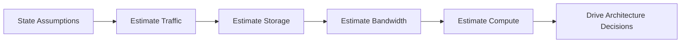

# Estimation and Capacity Planning

---

## Why Back-of-the-Envelope Estimation?

Every system design interview includes a step where you estimate the scale of the system. This is not about getting exact numbers—it is about demonstrating that you can think quantitatively, make reasonable assumptions, and use those estimates to drive architectural decisions.

An interviewer who hears "we'll need approximately 500GB of storage per year, so a single PostgreSQL instance is fine" will trust your design. An interviewer who hears "we need a lot of storage" will not.

### The Estimation Process



1. **State your assumptions clearly** — number of users, read/write ratio, data sizes
2. **Estimate traffic** — requests per second for reads and writes
3. **Estimate storage** — total data size over time
4. **Estimate bandwidth** — data transfer in/out per second
5. **Use results** — pick database, decide sharding, determine server count

---

## Essential Numbers Every Engineer Should Know

These are the reference numbers you should memorize for interviews. They provide the building blocks for all estimations.

### Latency Numbers

| Operation | Latency | Note |
|-----------|---------|------|
| L1 cache reference | 0.5 ns | |
| L2 cache reference | 7 ns | 14x L1 |
| Main memory reference | 100 ns | 200x L1 |
| SSD random read | 150 μs | 300,000x L1 |
| HDD seek | 10 ms | 20,000,000x L1 |
| Send 1 KB over 1 Gbps network | 10 μs | |
| Read 1 MB sequentially from memory | 250 μs | |
| Read 1 MB sequentially from SSD | 1 ms | |
| Read 1 MB sequentially from HDD | 20 ms | |
| Disk seek | 10 ms | |
| Round trip within same datacenter | 0.5 ms | |
| Round trip CA to Netherlands | 150 ms | |

### Data Size Reference

| Unit | Value | Example |
|------|-------|---------|
| 1 KB | 1,000 bytes | A short email |
| 1 MB | 1,000,000 bytes | A high-res photo |
| 1 GB | 10^9 bytes | A movie |
| 1 TB | 10^12 bytes | 1,000 movies |
| 1 PB | 10^15 bytes | 1,000,000 movies |

### Throughput Reference

| System | Typical Throughput |
|--------|-------------------|
| Single web server (REST) | 1,000 - 10,000 RPS |
| Single Redis instance | 100,000+ RPS |
| Single MySQL instance (simple queries) | 5,000 - 10,000 QPS |
| Single PostgreSQL instance | 5,000 - 15,000 QPS |
| Single Kafka broker | 200,000+ messages/sec |
| CDN edge node | 100,000+ RPS |
| Single Elasticsearch node | 5,000 - 10,000 search QPS |

### Useful Conversions

| Fact | Value |
|------|-------|
| Seconds in a day | 86,400 ≈ ~100,000 (use 10^5 for estimation) |
| Seconds in a month | ~2.5 million ≈ 2.5 × 10^6 |
| Seconds in a year | ~31.5 million ≈ 3 × 10^7 |
| 1 million requests/day | ~12 RPS |
| 100 million requests/day | ~1,200 RPS |
| 1 billion requests/day | ~12,000 RPS |

!!! tip
    Memorize the conversion: **1 million requests per day ≈ 12 requests per second**. This is the most useful number in system design interviews.

---

## Step-by-Step Estimation Framework

### Step 1: Define the Scale

Start by asking the interviewer (or stating your assumption) about the user base and usage patterns.

```
Users:
- DAU (Daily Active Users): 10 million
- Peak multiplier: 3x average (peak hour)
- Read/Write ratio: 10:1

Per-user behavior:
- Average reads per day per user: 20
- Average writes per day per user: 2
- Average data size per write: 500 bytes (metadata) + 2 KB (content)
```

### Step 2: Estimate Traffic (QPS)

```
Total reads/day  = 10M users × 20 reads  = 200M reads/day
Total writes/day = 10M users × 2 writes  = 20M writes/day

Average read QPS  = 200M / 86,400 ≈ 200M / 100K ≈ 2,000 QPS
Average write QPS = 20M / 86,400  ≈ 20M / 100K  ≈ 200 QPS

Peak read QPS  = 2,000 × 3 = 6,000 QPS
Peak write QPS = 200 × 3   = 600 QPS
```

### Step 3: Estimate Storage

```
Data per write = 500 bytes (metadata) + 2 KB (content) = 2.5 KB
Writes per day = 20M

Daily new data     = 20M × 2.5 KB = 50 GB/day
Monthly new data   = 50 GB × 30   = 1.5 TB/month
Yearly new data    = 1.5 TB × 12  = 18 TB/year
5-year projection  = 18 TB × 5    = 90 TB

With replication (3x) = 90 TB × 3 = 270 TB
With indexes (~20%)    = 270 TB × 1.2 = 324 TB
```

### Step 4: Estimate Bandwidth

```
Incoming (writes):
  = 200 QPS × 2.5 KB = 500 KB/s ≈ 4 Mbps (negligible)

Outgoing (reads):
  = 2,000 QPS × 5 KB (average response) = 10 MB/s ≈ 80 Mbps
  Peak: 80 Mbps × 3 = 240 Mbps
```

### Step 5: Estimate Compute

```
If one server handles 1,000 QPS:
  Read servers needed  = 6,000 / 1,000 = 6 servers (peak)
  Write servers needed = 600 / 1,000   = 1 server

With 30% headroom: 6 × 1.3 ≈ 8 read servers, 2 write servers
```

### Java Example: Estimation Calculator

```java
/**
 * Back-of-the-envelope estimation calculator for system design interviews.
 * Helps validate assumptions and derive infrastructure requirements.
 */
public class CapacityEstimator {

    public record TrafficEstimate(
        long avgReadQps,
        long avgWriteQps,
        long peakReadQps,
        long peakWriteQps
    ) {}

    public record StorageEstimate(
        long dailyGb,
        long monthlyTb,
        long yearlyTb,
        long fiveYearWithReplicationTb
    ) {}

    public record BandwidthEstimate(
        long inboundMbps,
        long outboundMbps,
        long peakOutboundMbps
    ) {}

    public record InfraEstimate(
        int readServers,
        int writeServers,
        int cacheServersGb,
        String databaseRecommendation
    ) {}

    private static final long SECONDS_PER_DAY = 86_400;

    private final long dau;
    private final int readsPerUserPerDay;
    private final int writesPerUserPerDay;
    private final long avgWriteSizeBytes;
    private final long avgReadResponseBytes;
    private final double peakMultiplier;
    private final int replicationFactor;

    public CapacityEstimator(long dau, int readsPerUserPerDay, int writesPerUserPerDay,
                              long avgWriteSizeBytes, long avgReadResponseBytes,
                              double peakMultiplier, int replicationFactor) {
        this.dau = dau;
        this.readsPerUserPerDay = readsPerUserPerDay;
        this.writesPerUserPerDay = writesPerUserPerDay;
        this.avgWriteSizeBytes = avgWriteSizeBytes;
        this.avgReadResponseBytes = avgReadResponseBytes;
        this.peakMultiplier = peakMultiplier;
        this.replicationFactor = replicationFactor;
    }

    public TrafficEstimate estimateTraffic() {
        long totalReadsPerDay = dau * readsPerUserPerDay;
        long totalWritesPerDay = dau * writesPerUserPerDay;

        long avgReadQps = totalReadsPerDay / SECONDS_PER_DAY;
        long avgWriteQps = totalWritesPerDay / SECONDS_PER_DAY;

        return new TrafficEstimate(
            avgReadQps,
            avgWriteQps,
            (long) (avgReadQps * peakMultiplier),
            (long) (avgWriteQps * peakMultiplier)
        );
    }

    public StorageEstimate estimateStorage() {
        long totalWritesPerDay = dau * writesPerUserPerDay;
        long dailyBytes = totalWritesPerDay * avgWriteSizeBytes;
        long dailyGb = dailyBytes / (1024L * 1024 * 1024);
        long monthlyTb = (dailyGb * 30) / 1024;
        long yearlyTb = monthlyTb * 12;
        long fiveYearTb = yearlyTb * 5 * replicationFactor;

        return new StorageEstimate(dailyGb, monthlyTb, yearlyTb, fiveYearTb);
    }

    public BandwidthEstimate estimateBandwidth() {
        TrafficEstimate traffic = estimateTraffic();

        long inboundBytesPerSec = traffic.avgWriteQps() * avgWriteSizeBytes;
        long outboundBytesPerSec = traffic.avgReadQps() * avgReadResponseBytes;
        long peakOutbound = (long) (outboundBytesPerSec * peakMultiplier);

        long inboundMbps = (inboundBytesPerSec * 8) / (1024 * 1024);
        long outboundMbps = (outboundBytesPerSec * 8) / (1024 * 1024);
        long peakMbps = (peakOutbound * 8) / (1024 * 1024);

        return new BandwidthEstimate(inboundMbps, outboundMbps, peakMbps);
    }

    public InfraEstimate estimateInfrastructure(int qpsPerServer) {
        TrafficEstimate traffic = estimateTraffic();

        int readServers = (int) Math.ceil(traffic.peakReadQps() * 1.3 / qpsPerServer);
        int writeServers = (int) Math.ceil(traffic.peakWriteQps() * 1.3 / qpsPerServer);

        // cache: assume 20% of daily data should be cached
        StorageEstimate storage = estimateStorage();
        int cacheGb = (int) (storage.dailyGb() * 0.2);

        String dbRecommendation;
        if (storage.yearlyTb() < 1) {
            dbRecommendation = "Single PostgreSQL with read replicas";
        } else if (storage.yearlyTb() < 10) {
            dbRecommendation = "Sharded PostgreSQL or MySQL cluster";
        } else {
            dbRecommendation = "Distributed database (Cassandra, CockroachDB, or DynamoDB)";
        }

        return new InfraEstimate(readServers, writeServers, cacheGb, dbRecommendation);
    }

    public void printFullEstimation() {
        System.out.println("=== Capacity Estimation ===");
        System.out.println("DAU: " + String.format("%,d", dau));
        System.out.println();

        TrafficEstimate traffic = estimateTraffic();
        System.out.println("--- Traffic ---");
        System.out.printf("Avg Read QPS:  %,d%n", traffic.avgReadQps());
        System.out.printf("Avg Write QPS: %,d%n", traffic.avgWriteQps());
        System.out.printf("Peak Read QPS: %,d%n", traffic.peakReadQps());
        System.out.printf("Peak Write QPS:%,d%n", traffic.peakWriteQps());
        System.out.println();

        StorageEstimate storage = estimateStorage();
        System.out.println("--- Storage ---");
        System.out.printf("Daily:    %,d GB%n", storage.dailyGb());
        System.out.printf("Monthly:  %,d TB%n", storage.monthlyTb());
        System.out.printf("Yearly:   %,d TB%n", storage.yearlyTb());
        System.out.printf("5yr (3x): %,d TB%n", storage.fiveYearWithReplicationTb());
        System.out.println();

        BandwidthEstimate bw = estimateBandwidth();
        System.out.println("--- Bandwidth ---");
        System.out.printf("Inbound:      %,d Mbps%n", bw.inboundMbps());
        System.out.printf("Outbound:     %,d Mbps%n", bw.outboundMbps());
        System.out.printf("Peak Outbound:%,d Mbps%n", bw.peakOutboundMbps());
        System.out.println();

        InfraEstimate infra = estimateInfrastructure(1000);
        System.out.println("--- Infrastructure ---");
        System.out.printf("Read servers:  %d%n", infra.readServers());
        System.out.printf("Write servers: %d%n", infra.writeServers());
        System.out.printf("Cache:         %d GB%n", infra.cacheServersGb());
        System.out.printf("Database:      %s%n", infra.databaseRecommendation());
    }

    public static void main(String[] args) {
        // Example: Design a URL shortener like TinyURL
        CapacityEstimator estimator = new CapacityEstimator(
            10_000_000,   // 10M DAU
            20,            // 20 reads/user/day (redirect lookups)
            2,             // 2 writes/user/day (new short URLs)
            2_500,         // 2.5 KB per write (URL + metadata)
            512,           // 512 bytes per redirect response (Location header)
            3.0,           // peak is 3x average
            3              // replication factor
        );
        estimator.printFullEstimation();
    }
}
```

---

## Worked Examples

### Example 1: Design a URL Shortener (TinyURL)

**Assumptions:**
- 100M new URLs created per month
- Read:Write ratio = 100:1 (each URL read 100 times on average)
- Average URL length: 100 characters = 100 bytes
- Short URL: 7 characters = 7 bytes
- Each record: ~500 bytes (long URL + short URL + metadata + timestamps)

**Traffic:**

```
Write QPS = 100M / (30 × 86,400) ≈ 100M / 2.5M ≈ 40 QPS
Read QPS  = 40 × 100 = 4,000 QPS
Peak Read QPS = 4,000 × 3 = 12,000 QPS
```

**Storage (5 years):**

```
Total URLs = 100M/month × 12 months × 5 years = 6 billion URLs
Storage    = 6B × 500 bytes = 3 TB
With replication (3x) = 9 TB
```

**Decision:** 9 TB is manageable for a sharded MySQL/PostgreSQL cluster. At 12K peak QPS for reads, we need a caching layer (Redis) to handle the hot URLs.

### Example 2: Design Twitter's Timeline

**Assumptions:**
- 300M DAU
- Average user: 10 timeline reads/day, 0.5 tweets/day
- Average tweet: 280 chars = ~500 bytes (with metadata: 1 KB)
- Average timeline: 200 tweets displayed

**Traffic:**

```
Timeline reads/day = 300M × 10 = 3 billion
Timeline QPS       = 3B / 86,400 ≈ 35,000 QPS
Peak QPS           = 35,000 × 3 = 105,000 QPS

Tweet writes/day   = 300M × 0.5 = 150M
Write QPS          = 150M / 86,400 ≈ 1,700 QPS
```

**Storage:**

```
Daily tweets     = 150M × 1 KB = 150 GB/day
Yearly           = 150 GB × 365 = 54 TB/year
5-year (3x repl) = 54 × 5 × 3 = 810 TB
```

**Bandwidth:**

```
Timeline response = 200 tweets × 1 KB = 200 KB
Outbound = 35,000 QPS × 200 KB = 7 GB/s ≈ 56 Gbps
Peak     = 56 × 3 = 168 Gbps
```

**Decisions:**
- 105K peak QPS → Need extensive caching (pre-computed timelines in Redis)
- 168 Gbps peak → CDN for media, cache for text
- 810 TB → Distributed storage, not single RDBMS
- Fan-out strategy: pre-compute for most users, lazy load for celebrities

### Example 3: Design a Chat System (WhatsApp)

**Assumptions:**
- 500M DAU
- Average user sends 40 messages/day
- Average message size: 100 bytes
- Group chats: average 50 members
- 20% of messages are to groups

**Traffic:**

```
Total messages/day = 500M × 40 = 20 billion messages/day
QPS = 20B / 86,400 ≈ 230,000 QPS

Group fanout: 20% of 20B = 4B messages × 50 members = 200B delivery events/day
Delivery QPS = 200B / 86,400 ≈ 2.3 million QPS (!)
```

**Storage:**

```
Daily = 20B × 100 bytes = 2 TB/day
Monthly = 60 TB
Yearly = 720 TB
5-year (3x) = 10.8 PB
```

**Decisions:**
- 2.3M delivery QPS → WebSocket connections, message queue (Kafka)
- 10.8 PB → No RDBMS can handle this; use HBase or Cassandra
- Connection management → Each server holds ~100K WebSocket connections → need ~5,000 servers for 500M connections

---

## Common Estimation Mistakes

| Mistake | Why It's Wrong | Fix |
|---------|---------------|-----|
| **Forgetting peak traffic** | Systems fail at peak, not average | Multiply by 2-5x for peak |
| **Ignoring replication** | Real systems replicate 3x | Always multiply storage by 3 |
| **Ignoring indexes** | Indexes add 20-30% storage overhead | Add 20% to storage estimate |
| **Using exact math** | Wastes interview time | Round aggressively: 86,400 ≈ 10^5 |
| **Forgetting metadata** | Timestamps, IDs add up | Add 30-50% overhead to raw data size |
| **Ignoring growth** | Systems must plan for 2-5 years | Always project forward |
| **Not stating assumptions** | Interviewer can't evaluate your reasoning | State every assumption explicitly |

---

## Estimation Cheat Sheet

Keep these quick formulas handy:

```
1 million req/day    ≈ 12 QPS
100 million req/day  ≈ 1,200 QPS
1 billion req/day    ≈ 12,000 QPS

1 QPS for 1 year at 1 KB/req ≈ 30 GB storage
1 QPS for 1 year at 1 MB/req ≈ 30 TB storage

Seconds/day:   86,400 ≈ 10^5
Seconds/month: 2.5M   ≈ 2.5 × 10^6
Seconds/year:  31.5M  ≈ 3 × 10^7

80/20 rule: 20% of data generates 80% of traffic
            → cache the top 20% for massive gains

Characters per tweet: 280
Average email size: 50 KB
Average photo (compressed): 200 KB - 2 MB
Average video (1 min, compressed): 10-50 MB
Average web page: 2-5 MB
```

---

## Powers of Two Reference

| Power | Value | Approximate | Common Name |
|-------|-------|-------------|-------------|
| 2^10 | 1,024 | ~1 thousand | 1 KB |
| 2^20 | 1,048,576 | ~1 million | 1 MB |
| 2^30 | 1,073,741,824 | ~1 billion | 1 GB |
| 2^40 | ~1.1 trillion | ~1 trillion | 1 TB |
| 2^50 | ~1.1 quadrillion | ~1 quadrillion | 1 PB |

---

## Interview Template

Use this template when the interviewer asks you to estimate:

```
1. CLARIFY SCALE
   - How many users? (DAU/MAU)
   - Read/write ratio?
   - Data retention period?

2. TRAFFIC
   - Reads/day = DAU × reads/user/day
   - Writes/day = DAU × writes/user/day
   - QPS = requests/day ÷ 86,400
   - Peak QPS = avg QPS × peak_multiplier

3. STORAGE
   - Per-record size = data + metadata + overhead
   - Daily = writes/day × record_size
   - Yearly = daily × 365
   - Total = yearly × years × replication_factor × 1.2 (indexes)

4. BANDWIDTH
   - Inbound = write_QPS × write_size
   - Outbound = read_QPS × response_size

5. INFRASTRUCTURE
   - Servers = peak_QPS ÷ QPS_per_server × 1.3 (headroom)
   - Cache = 20% of daily data (80/20 rule)
   - Database choice based on total storage + QPS
```

!!! important
    The numbers don't need to be exact. Interviewers care that you can: (1) make reasonable assumptions, (2) perform order-of-magnitude calculations, and (3) use the results to make architectural decisions. Always round aggressively and explain your reasoning.

---

## Further Reading

| Topic | Resource | Why This Matters |
|-------|----------|-----------------|
| Latency Numbers | [Jeff Dean's Numbers Everyone Should Know](https://colin-scott.github.io/personal_website/research/interactive_latency.html) | Jeff Dean (Google Fellow) compiled the canonical latency reference — L1 cache (0.5ns) to cross-continent RTT (150ms) — that anchors every back-of-the-envelope estimate. Knowing these orders of magnitude lets you instantly judge whether a design is feasible (e.g., a single-machine lookup at 1μs vs. a cross-region call at 150ms means 150,000× difference). |
| System Design Primer | [github.com/donnemartin/system-design-primer](https://github.com/donnemartin/system-design-primer) | A community-curated repository that organizes scalability patterns, estimation templates, and real-world architecture examples into one reference. Useful as a structured study companion for connecting individual concepts (caching, sharding, load balancing) into end-to-end system designs. |
| Capacity Planning | [High Scalability Blog](http://highscalability.com/) | Documents real architecture decisions from companies at scale — how Twitter handles 400K tweets/sec, how WhatsApp serves 2B users on Erlang, etc. These case studies provide the concrete numbers and architectural patterns needed to calibrate your own estimation intuition. |
| DDIA | Designing Data-Intensive Applications by Martin Kleppmann | The most comprehensive modern reference for distributed systems engineering. Kleppmann rigorously covers storage engines, replication, partitioning, consistency, and batch/stream processing with clear trade-off analysis. Chapters 1–2 provide the foundation for estimation thinking: understanding what bottlenecks (disk, network, CPU) dominate which workloads. |
