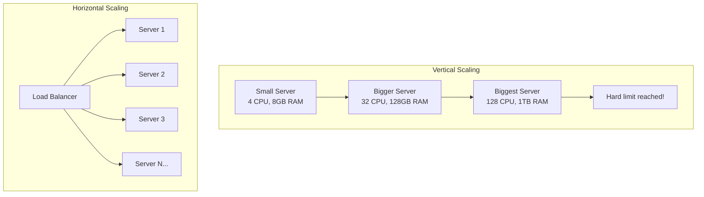
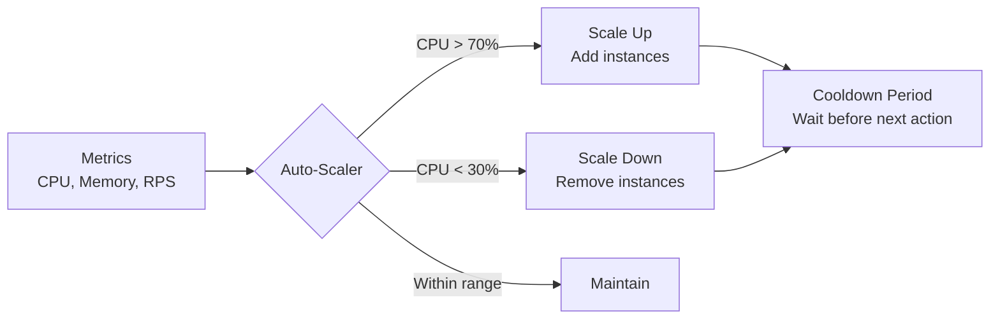
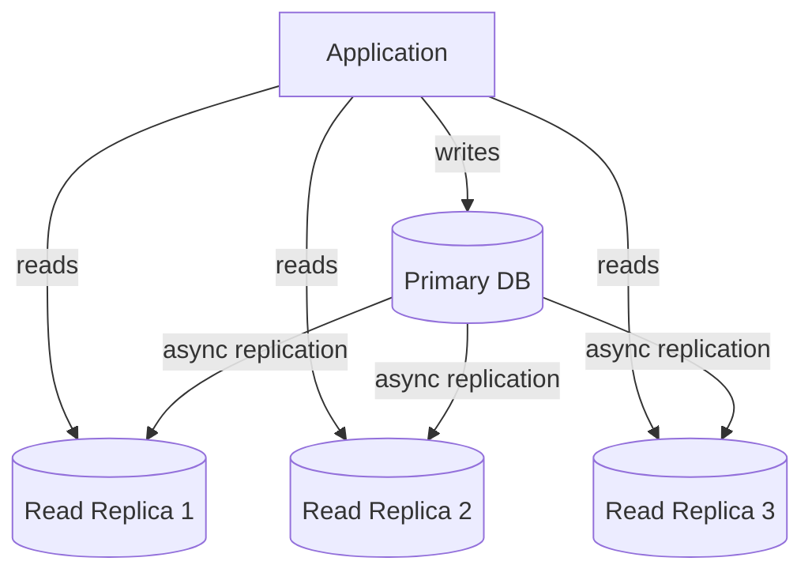
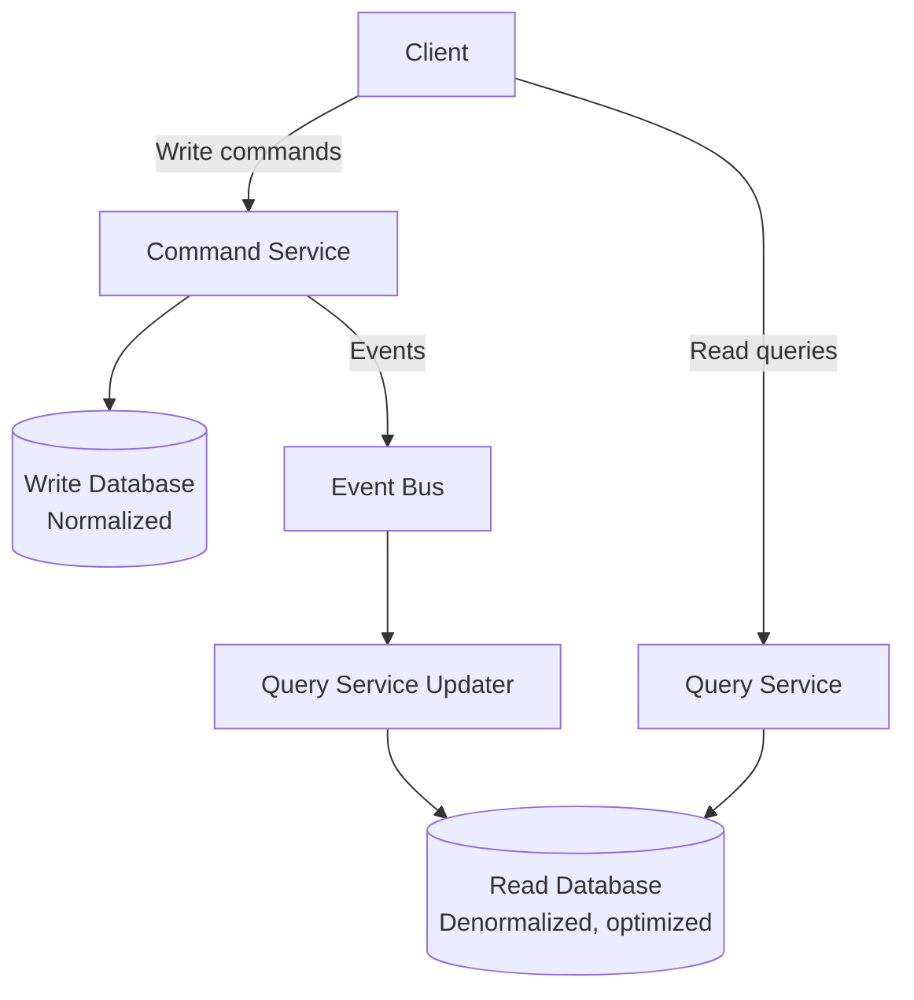
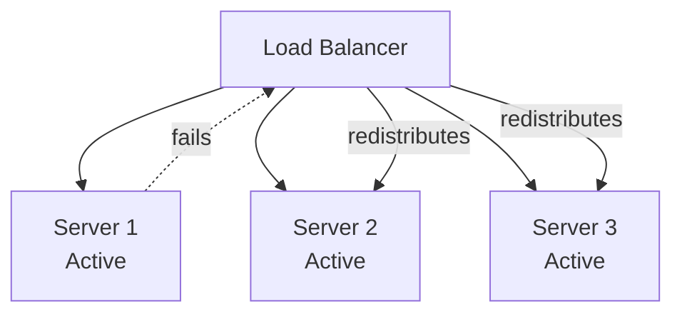
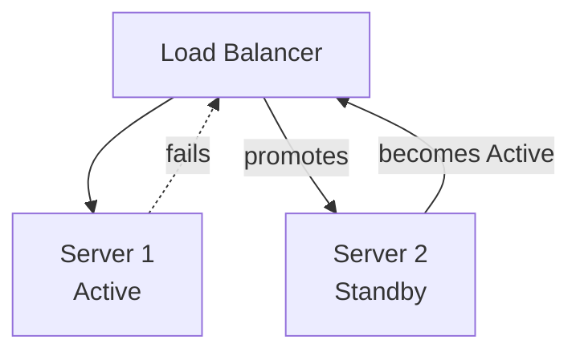
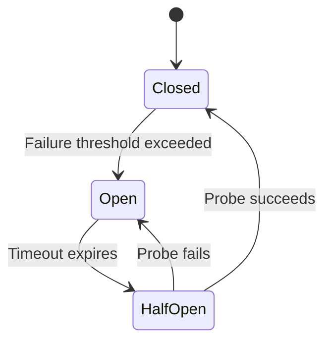
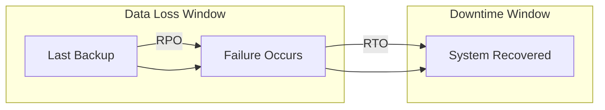
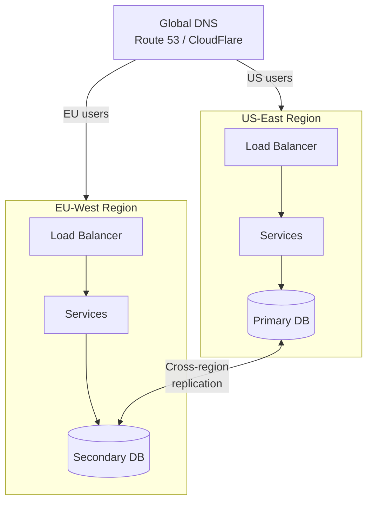
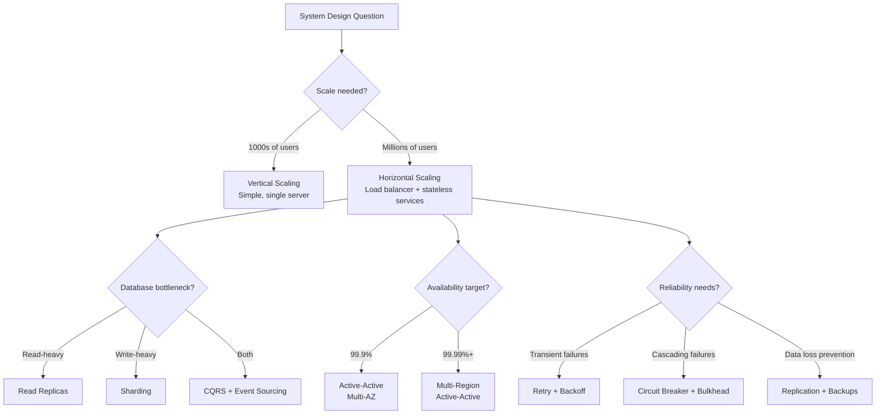

# Scalability, Availability, and Reliability

---

## Why These Three Matter Together

Scalability, availability, and reliability are the pillars of production-grade systems. They are deeply interconnected: a system that scales well but fails frequently is useless; a reliable system that cannot handle growth is expensive; an available system that drops data silently is dangerous.

In system design interviews, these concepts come up in every single question. When an interviewer says "design this for millions of users," they are asking about all three.

| Concept | Question It Answers | Metric |
|---------|--------------------|--------|
| **Scalability** | Can it handle growth? | Requests/sec, throughput, latency at load |
| **Availability** | Is it operational when users need it? | Uptime percentage (nines) |
| **Reliability** | Does it produce correct results consistently? | Error rate, data loss rate, MTBF |

---

## Scalability

Scalability is the ability of a system to handle increased load without proportionally increasing latency, errors, or cost.

### Defining "Load"

Before discussing how to scale, define **what** you're scaling for. Load can mean different things depending on the system:

| System | Primary Load Metric |
|--------|-------------------|
| Web server | Requests per second (RPS) |
| Database | Queries per second (QPS), connections |
| Message queue | Messages per second, consumer lag |
| Storage | Total data size, I/O operations |
| ML inference | Predictions per second, GPU utilization |

### Horizontal vs Vertical Scaling



| Factor | Vertical Scaling | Horizontal Scaling |
|--------|-----------------|-------------------|
| **Approach** | Add more power to existing machine | Add more machines |
| **Limit** | Hardware ceiling (finite CPU/RAM) | Practically unlimited |
| **Downtime** | Requires restart for hardware changes | Add/remove nodes live |
| **Complexity** | Simple (single machine) | Complex (distributed system) |
| **Cost curve** | Exponential (high-end hardware is expensive) | Linear (commodity servers) |
| **Data consistency** | Easy (single source of truth) | Requires coordination |
| **Use case** | Databases, stateful apps (short-term) | Stateless services, web servers |

!!! tip
    In interviews, always start with "we can scale vertically initially for simplicity, but for long-term growth, we need horizontal scaling." This shows pragmatism.

### Stateless vs Stateful Services

Horizontal scaling requires **stateless** services—any request can be handled by any server.

```java
import java.util.Map;
import java.util.concurrent.ConcurrentHashMap;
import org.springframework.data.redis.core.RedisTemplate;

// STATEFUL — hard to scale horizontally
public class StatefulSessionService {
    // session stored in server memory — request must go to same server
    private final Map<String, UserSession> sessions = new ConcurrentHashMap<>();

    public UserSession getSession(String sessionId) {
        return sessions.get(sessionId); // only works if request hits THIS server
    }
}

// STATELESS — scales horizontally
public class StatelessSessionService {
    private final RedisTemplate<String, UserSession> redis;

    public StatelessSessionService(RedisTemplate<String, UserSession> redis) {
        this.redis = redis;
    }

    public UserSession getSession(String sessionId) {
        return redis.opsForValue().get("session:" + sessionId);
        // works regardless of which server handles the request
    }
}
```

### Auto-Scaling

Auto-scaling automatically adjusts the number of running instances based on current load.



**Key parameters:**

| Parameter | Description | Example |
|-----------|-------------|---------|
| **Min instances** | Minimum always running | 2 (for availability) |
| **Max instances** | Upper bound to control cost | 50 |
| **Scale-up threshold** | When to add instances | CPU > 70% for 2 minutes |
| **Scale-down threshold** | When to remove instances | CPU < 30% for 10 minutes |
| **Cooldown** | Wait time between scaling actions | 5 minutes |

### Scaling Patterns

#### Database Read Replicas



Most applications are read-heavy (90%+ reads). Read replicas handle read traffic, reducing load on the primary database.

#### Database Sharding

When a single database cannot hold all data, distribute it across multiple databases (shards).

```java
import java.util.List;
import java.util.stream.Collectors;
import javax.sql.DataSource;
import org.springframework.jdbc.core.RowMapper;

/**
 * Shard router that determines which database shard holds a given user's data.
 */
public class ShardRouter {
    private final List<DataSource> shards;
    private final ConsistentHashRing<DataSource> ring;

    public ShardRouter(List<DataSource> shards) {
        this.shards = shards;
        this.ring = new ConsistentHashRing<>(150);
        shards.forEach(ring::addNode);
    }

    public DataSource getShardForUser(String userId) {
        return ring.getNode(userId);
    }

    public DataSource getShardByRange(long userId) {
        // range-based sharding
        int shardIndex = (int) (userId / 1_000_000) % shards.size();
        return shards.get(shardIndex);
    }

    // cross-shard query (expensive — avoid in hot paths)
    public <T> List<T> scatterGather(String query, RowMapper<T> mapper) {
        return shards.parallelStream()
            .flatMap(shard -> queryOnShard(shard, query, mapper).stream())
            .collect(Collectors.toList());
    }
}
```

#### CQRS (Command Query Responsibility Segregation)

Separate the write model (commands) from the read model (queries) to scale them independently.



---

## Availability

Availability is the proportion of time a system is operational and accessible to users.

### Measuring Availability: The "Nines"

| Availability | Downtime/Year | Downtime/Month | Downtime/Week |
|-------------|---------------|----------------|---------------|
| 99% (two nines) | 3.65 days | 7.31 hours | 1.68 hours |
| 99.9% (three nines) | 8.77 hours | 43.83 minutes | 10.08 minutes |
| 99.99% (four nines) | 52.60 minutes | 4.38 minutes | 1.01 minutes |
| 99.999% (five nines) | 5.26 minutes | 26.30 seconds | 6.05 seconds |

### Calculating System Availability

**Serial components** (all must work):

```
A_total = A1 × A2 × A3
```

If you have a web server (99.9%), application server (99.9%), and database (99.9%):
```
A = 0.999 × 0.999 × 0.999 = 0.997 (99.7%)
```
That's 26 hours of downtime per year!

**Parallel components** (any one working is sufficient):

```
A_total = 1 - (1 - A1) × (1 - A2)
```

Two load-balanced servers, each 99.9%:
```
A = 1 - (0.001 × 0.001) = 0.999999 (99.9999%)
```

!!! note
    This math shows why **redundancy** is essential. Adding a second instance dramatically improves availability even if each individual instance is only moderately reliable.

### Redundancy Patterns

#### Active-Active

All instances serve traffic simultaneously. If one fails, the others absorb its load.



**Pros:** Full utilization of all servers, no wasted capacity.
**Cons:** Requires stateless services or shared state.

#### Active-Passive (Failover)

One instance handles all traffic; a standby instance takes over on failure.



**Pros:** Simpler, the standby has the same state as the primary.
**Cons:** Wasted capacity (standby does nothing until failover).

### Health Checks and Failover

```java
import java.net.URI;
import java.net.http.HttpClient;
import java.net.http.HttpRequest;
import java.net.http.HttpResponse;
import java.time.Duration;
import java.time.Instant;
import java.util.Map;
import java.util.concurrent.ConcurrentHashMap;
import java.util.concurrent.Executors;
import java.util.concurrent.ScheduledExecutorService;
import java.util.concurrent.TimeUnit;
import java.util.stream.Collectors;

/**
 * Health check system that monitors service endpoints and triggers
 * failover when unhealthy thresholds are reached.
 */
public class HealthCheckMonitor {

    public enum HealthStatus { HEALTHY, DEGRADED, UNHEALTHY }

    public record ServiceEndpoint(
        String name,
        String url,
        int consecutiveFailures,
        HealthStatus status,
        Instant lastCheck
    ) {}

    private final Map<String, ServiceEndpoint> endpoints = new ConcurrentHashMap<>();
    private final int unhealthyThreshold;
    private final int degradedThreshold;
    private final ScheduledExecutorService scheduler;

    public HealthCheckMonitor(int degradedThreshold, int unhealthyThreshold,
                               Duration checkInterval) {
        this.degradedThreshold = degradedThreshold;
        this.unhealthyThreshold = unhealthyThreshold;
        this.scheduler = Executors.newScheduledThreadPool(4);
        scheduler.scheduleAtFixedRate(this::checkAll,
            0, checkInterval.toMillis(), TimeUnit.MILLISECONDS);
    }

    public void registerEndpoint(String name, String url) {
        endpoints.put(name, new ServiceEndpoint(name, url, 0, HealthStatus.HEALTHY, Instant.now()));
    }

    private void checkAll() {
        for (Map.Entry<String, ServiceEndpoint> entry : endpoints.entrySet()) {
            checkEndpoint(entry.getValue());
        }
    }

    private void checkEndpoint(ServiceEndpoint endpoint) {
        try {
            HttpResponse<String> response = httpClient.send(
                HttpRequest.newBuilder()
                    .uri(URI.create(endpoint.url() + "/health"))
                    .timeout(Duration.ofSeconds(5))
                    .GET()
                    .build(),
                HttpResponse.BodyHandlers.ofString()
            );

            if (response.statusCode() == 200) {
                endpoints.put(endpoint.name(), new ServiceEndpoint(
                    endpoint.name(), endpoint.url(), 0, HealthStatus.HEALTHY, Instant.now()
                ));
            } else {
                recordFailure(endpoint);
            }
        } catch (Exception e) {
            recordFailure(endpoint);
        }
    }

    private void recordFailure(ServiceEndpoint endpoint) {
        int failures = endpoint.consecutiveFailures() + 1;
        HealthStatus status;

        if (failures >= unhealthyThreshold) {
            status = HealthStatus.UNHEALTHY;
            triggerFailover(endpoint);
        } else if (failures >= degradedThreshold) {
            status = HealthStatus.DEGRADED;
        } else {
            status = HealthStatus.HEALTHY;
        }

        endpoints.put(endpoint.name(), new ServiceEndpoint(
            endpoint.name(), endpoint.url(), failures, status, Instant.now()
        ));
    }

    private void triggerFailover(ServiceEndpoint endpoint) {
        // remove from load balancer, alert on-call, attempt recovery
    }

    public Map<String, HealthStatus> getHealthReport() {
        return endpoints.entrySet().stream()
            .collect(Collectors.toMap(Map.Entry::getKey, e -> e.getValue().status()));
    }
}
```

---

## Reliability

Reliability means the system performs its intended function correctly and consistently over time. A system can be available (responding to requests) but unreliable (returning wrong data or losing writes).

### Key Reliability Metrics

| Metric | Definition | Formula |
|--------|-----------|---------|
| **MTBF** | Mean Time Between Failures | Total uptime / Number of failures |
| **MTTR** | Mean Time To Repair | Total downtime / Number of failures |
| **Error Rate** | Percentage of requests that fail | Failed requests / Total requests |
| **Durability** | Probability data survives over time | 99.999999999% (11 nines for S3) |

### Reliability Patterns

#### Retries with Exponential Backoff

When a transient failure occurs, retry with increasing wait times to avoid overwhelming the target.

```java
import java.util.function.Supplier;
import java.util.concurrent.ThreadLocalRandom;

public class RetryWithBackoff {
    private final int maxRetries;
    private final long initialDelayMs;
    private final long maxDelayMs;
    private final double jitterFactor;

    public RetryWithBackoff(int maxRetries, long initialDelayMs,
                             long maxDelayMs, double jitterFactor) {
        this.maxRetries = maxRetries;
        this.initialDelayMs = initialDelayMs;
        this.maxDelayMs = maxDelayMs;
        this.jitterFactor = jitterFactor;
    }

    public <T> T execute(Supplier<T> operation) throws Exception {
        Exception lastException = null;

        for (int attempt = 0; attempt <= maxRetries; attempt++) {
            try {
                return operation.get();
            } catch (TransientException e) {
                lastException = e;
                if (attempt < maxRetries) {
                    long delay = calculateDelay(attempt);
                    Thread.sleep(delay);
                }
            }
        }
        throw new RetriesExhaustedException(
            "Failed after " + (maxRetries + 1) + " attempts", lastException);
    }

    private long calculateDelay(int attempt) {
        long exponentialDelay = (long) (initialDelayMs * Math.pow(2, attempt));
        long boundedDelay = Math.min(exponentialDelay, maxDelayMs);

        // add jitter to prevent thundering herd
        double jitter = 1.0 + (ThreadLocalRandom.current().nextDouble() * 2 - 1) * jitterFactor;
        return (long) (boundedDelay * jitter);
    }
}

// Usage
RetryWithBackoff retry = new RetryWithBackoff(
    3,     // max retries
    100,   // initial delay: 100ms
    5000,  // max delay: 5s
    0.25   // 25% jitter
);

String result = retry.execute(() -> httpClient.call(serviceUrl));
// Delays: ~100ms, ~200ms, ~400ms (with jitter)
```

#### Circuit Breaker

Prevents cascading failures by stopping requests to a failing service.



```java
import java.util.function.Supplier;

public class CircuitBreaker {
    enum State { CLOSED, OPEN, HALF_OPEN }

    private State state = State.CLOSED;
    private int failureCount = 0;
    private int successCount = 0;
    private long lastFailureTime = 0;

    private final int failureThreshold;
    private final long openDurationMs;
    private final int halfOpenMaxProbes;

    public CircuitBreaker(int failureThreshold, long openDurationMs, int halfOpenMaxProbes) {
        this.failureThreshold = failureThreshold;
        this.openDurationMs = openDurationMs;
        this.halfOpenMaxProbes = halfOpenMaxProbes;
    }

    public <T> T execute(Supplier<T> operation) {
        if (state == State.OPEN) {
            if (System.currentTimeMillis() - lastFailureTime > openDurationMs) {
                state = State.HALF_OPEN;
                successCount = 0;
            } else {
                throw new CircuitBreakerOpenException(
                    "Circuit is OPEN. Try again in " +
                    (openDurationMs - (System.currentTimeMillis() - lastFailureTime)) + "ms"
                );
            }
        }

        try {
            T result = operation.get();
            onSuccess();
            return result;
        } catch (Exception e) {
            onFailure();
            throw e;
        }
    }

    private synchronized void onSuccess() {
        failureCount = 0;
        if (state == State.HALF_OPEN) {
            successCount++;
            if (successCount >= halfOpenMaxProbes) {
                state = State.CLOSED;
            }
        }
    }

    private synchronized void onFailure() {
        failureCount++;
        lastFailureTime = System.currentTimeMillis();
        if (failureCount >= failureThreshold) {
            state = State.OPEN;
        }
        if (state == State.HALF_OPEN) {
            state = State.OPEN;
        }
    }

    public State getState() { return state; }
}
```

#### Bulkhead Pattern

Isolate failures so a problem in one component does not bring down the entire system.

```java
import java.util.Map;
import java.util.concurrent.ArrayBlockingQueue;
import java.util.concurrent.Callable;
import java.util.concurrent.ConcurrentHashMap;
import java.util.concurrent.ExecutorService;
import java.util.concurrent.Future;
import java.util.concurrent.ThreadPoolExecutor;
import java.util.concurrent.TimeUnit;

/**
 * Thread pool bulkhead: each downstream service gets its own
 * thread pool, preventing one slow service from consuming
 * all threads and starving others.
 */
public class BulkheadManager {
    private final Map<String, ExecutorService> pools = new ConcurrentHashMap<>();

    public ExecutorService getPool(String serviceName, int poolSize) {
        return pools.computeIfAbsent(serviceName,
            name -> new ThreadPoolExecutor(
                poolSize / 2,       // core threads
                poolSize,            // max threads
                60L, TimeUnit.SECONDS,
                new ArrayBlockingQueue<>(poolSize * 2), // bounded queue
                new ThreadPoolExecutor.AbortPolicy()     // reject when full
            )
        );
    }

    public <T> Future<T> callService(String serviceName, Callable<T> task) {
        ExecutorService pool = getPool(serviceName, 10);
        return pool.submit(task);
    }
}

// Usage: payment service being slow doesn't affect user service
BulkheadManager bulkhead = new BulkheadManager();
Future<PaymentResult> payment = bulkhead.callService("payment-service", () -> paymentClient.charge());
Future<UserProfile> user = bulkhead.callService("user-service", () -> userClient.getProfile());
```

---

## Disaster Recovery

Disaster recovery (DR) ensures business continuity when catastrophic failures occur: data center outages, region failures, or data corruption.

### RPO and RTO

| Metric | Definition | Question It Answers |
|--------|-----------|-------------------|
| **RPO** (Recovery Point Objective) | Maximum acceptable data loss | "How much data can we afford to lose?" |
| **RTO** (Recovery Time Objective) | Maximum acceptable downtime | "How fast must we recover?" |



### DR Strategies

| Strategy | RPO | RTO | Cost | Description |
|----------|-----|-----|------|-------------|
| **Backup & Restore** | Hours | Hours | Low | Periodic backups, restore on failure |
| **Pilot Light** | Minutes | Minutes | Medium | Core services always running in DR region |
| **Warm Standby** | Seconds | Minutes | High | Scaled-down copy always running |
| **Multi-Region Active-Active** | Near-zero | Near-zero | Highest | Full deployment in multiple regions |

### Multi-Region Architecture



---

## Monitoring and Alerting

You cannot fix what you cannot observe. Monitoring is the foundation of operational reliability.

### The Four Golden Signals (Google SRE)

| Signal | What It Measures | Example |
|--------|-----------------|---------|
| **Latency** | Time to serve a request | p50, p95, p99 response times |
| **Traffic** | Amount of demand on the system | Requests per second |
| **Errors** | Rate of failed requests | 5xx errors, timeout rate |
| **Saturation** | How full the system is | CPU, memory, disk, queue depth |

### Java Example: Metrics Collection

```java
import io.micrometer.core.instrument.Counter;
import io.micrometer.core.instrument.Gauge;
import io.micrometer.core.instrument.MeterRegistry;
import io.micrometer.core.instrument.Timer;
import java.lang.management.ManagementFactory;
import java.util.concurrent.ThreadPoolExecutor;
import java.util.function.Supplier;

/**
 * Service-level metrics collector using Micrometer abstractions.
 */
public class ServiceMetrics {
    private final MeterRegistry registry;

    public ServiceMetrics(MeterRegistry registry) {
        this.registry = registry;
    }

    // Latency: track request duration
    public <T> T timeRequest(String endpoint, Supplier<T> operation) {
        Timer timer = Timer.builder("http.server.request.duration")
            .tag("endpoint", endpoint)
            .publishPercentiles(0.5, 0.95, 0.99)
            .register(registry);
        return timer.record(operation);
    }

    // Traffic: count requests
    public void recordRequest(String endpoint, int statusCode) {
        Counter.builder("http.server.requests.total")
            .tag("endpoint", endpoint)
            .tag("status", String.valueOf(statusCode))
            .register(registry)
            .increment();
    }

    // Errors: count failures
    public void recordError(String endpoint, String errorType) {
        Counter.builder("http.server.errors.total")
            .tag("endpoint", endpoint)
            .tag("error_type", errorType)
            .register(registry)
            .increment();
    }

    // Saturation: track resource usage
    public void registerSaturationGauges() {
        Gauge.builder("system.cpu.usage",
            () -> ManagementFactory.getOperatingSystemMXBean().getSystemLoadAverage())
            .register(registry);

        Gauge.builder("jvm.memory.used",
            () -> Runtime.getRuntime().totalMemory() - Runtime.getRuntime().freeMemory())
            .register(registry);

        Gauge.builder("thread.pool.active",
            () -> ((ThreadPoolExecutor) executorService).getActiveCount())
            .register(registry);
    }
}
```

---

## SLAs, SLOs, and SLIs

| Term | Definition | Example |
|------|-----------|---------|
| **SLI** (Service Level Indicator) | A metric that measures service behavior | p99 latency, error rate |
| **SLO** (Service Level Objective) | Target value for an SLI | p99 latency < 200ms, availability > 99.9% |
| **SLA** (Service Level Agreement) | Contract with consequences for missing SLO | "99.9% uptime or customer gets credits" |

```
SLI → measures → SLO → guarantees → SLA
```

**Example for an e-commerce platform:**

| Component | SLI | SLO | SLA |
|-----------|-----|-----|-----|
| Product Search | p95 latency | < 100ms | < 200ms |
| Checkout | Availability | 99.99% | 99.95% |
| Order Processing | Success rate | > 99.9% | > 99.5% |

!!! note
    SLOs should be tighter than SLAs. If your SLA promises 99.9%, set your internal SLO to 99.95%. This gives you an **error budget** to catch issues before breaching the SLA.

---

## Interview Decision Framework



### Quick Reference for Interviews

| When They Say... | Think About... |
|------------------|---------------|
| "Handle millions of users" | Horizontal scaling, load balancing, CDN |
| "Must be highly available" | Redundancy, failover, multi-AZ/multi-region |
| "Can't lose any data" | Synchronous replication, WAL, backups |
| "Handle traffic spikes" | Auto-scaling, queue buffering, circuit breaker |
| "What if a server crashes?" | Health checks, automatic failover, retry logic |
| "What if a data center goes down?" | Multi-region, DNS failover, cross-region replication |
| "How do you monitor this?" | Four golden signals, distributed tracing, alerting |

!!! important
    In interviews, always quantify your availability and scalability targets. Saying "we need 99.99% availability, which allows 52 minutes of downtime per year" is far more impressive than "it needs to be highly available."

---

## Further Reading

| Topic | Resource | Why This Matters |
|-------|----------|-----------------|
| Google SRE Book | [sre.google/sre-book](https://sre.google/sre-book/table-of-contents/) | Google codified two decades of operational excellence into this book. It introduced SLOs and error budgets as a way to balance reliability against feature velocity — instead of "zero downtime," teams get a measurable budget for acceptable failures. The chapters on cascading failures, load balancing, and distributed consensus are directly applicable to system design answers. |
| Designing Data-Intensive Applications | Martin Kleppmann (O'Reilly) | The definitive modern reference for understanding scalability trade-offs. Kleppmann covers replication (single-leader, multi-leader, leaderless), partitioning strategies, consistency models, and batch vs. stream processing — each with rigorous analysis of when to use what. Essential for moving beyond "just add more servers" to understanding *how* systems actually scale. |
| Chaos Engineering | [principlesofchaos.org](https://principlesofchaos.org/) | Netflix pioneered chaos engineering after their 2008 database corruption incident drove the migration to AWS. The discipline of intentionally injecting failures (Chaos Monkey, Chaos Kong) proved that systems must be tested under real failure conditions, not just designed for them. The principles define how to run controlled experiments on distributed systems to build confidence in resilience. |
| AWS Well-Architected: Reliability | [AWS Reliability Pillar](https://docs.aws.amazon.com/wellarchitected/latest/reliability-pillar/) | Amazon distilled lessons from operating the world's largest cloud infrastructure into a framework of best practices. The Reliability Pillar covers foundations (quotas, networking), change management (monitoring, scaling), and failure management (fault isolation, DR). Useful for translating abstract reliability concepts into concrete architectural decisions. |
| Circuit Breaker Pattern | [Martin Fowler](https://martinfowler.com/bliki/CircuitBreaker.html) | In distributed systems, a failing downstream service can cascade timeouts and exhaust connection pools across the entire call chain. Michael Nygard introduced the circuit breaker pattern (in *Release It!*) to "fail fast" — when a service exceeds a failure threshold, the circuit opens and returns errors immediately instead of waiting. Fowler's article explains the state machine (closed → open → half-open) and when to use it. |
