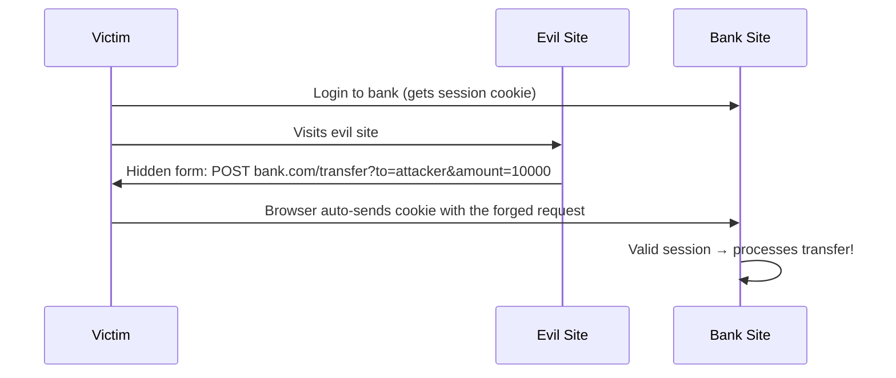
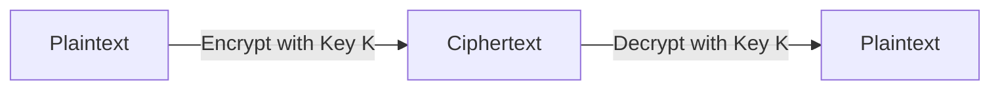
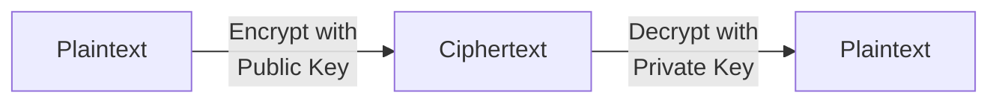
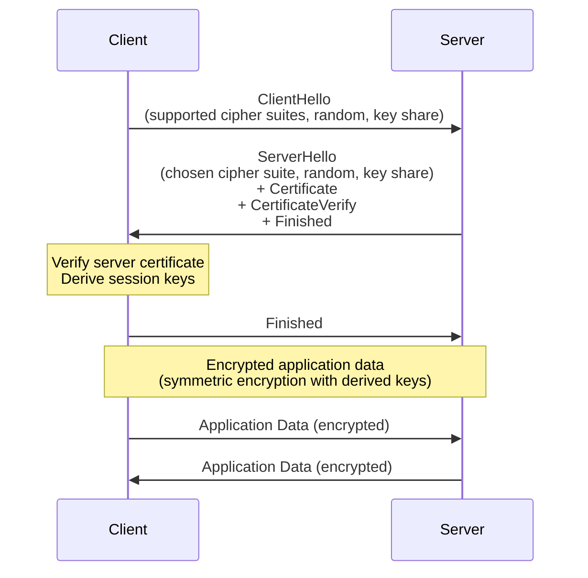
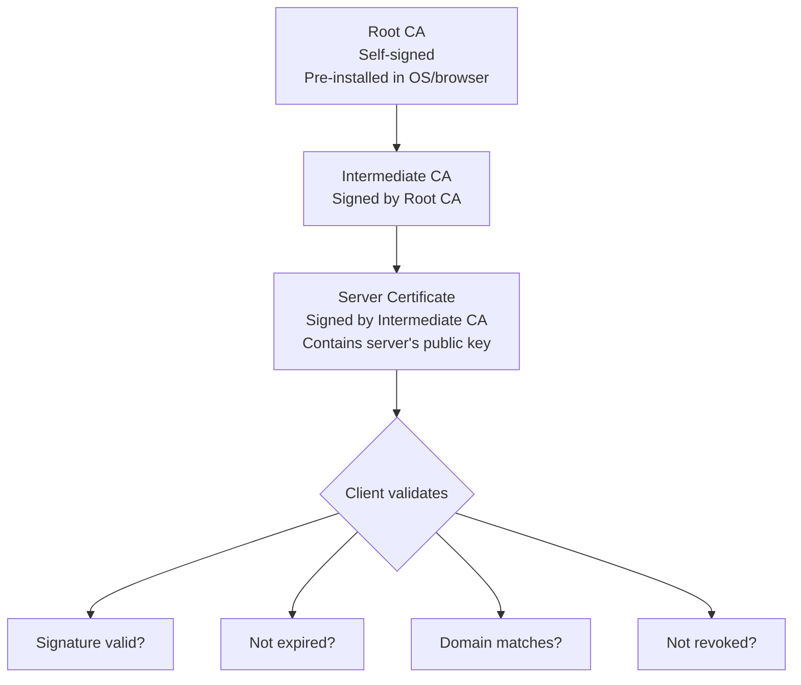
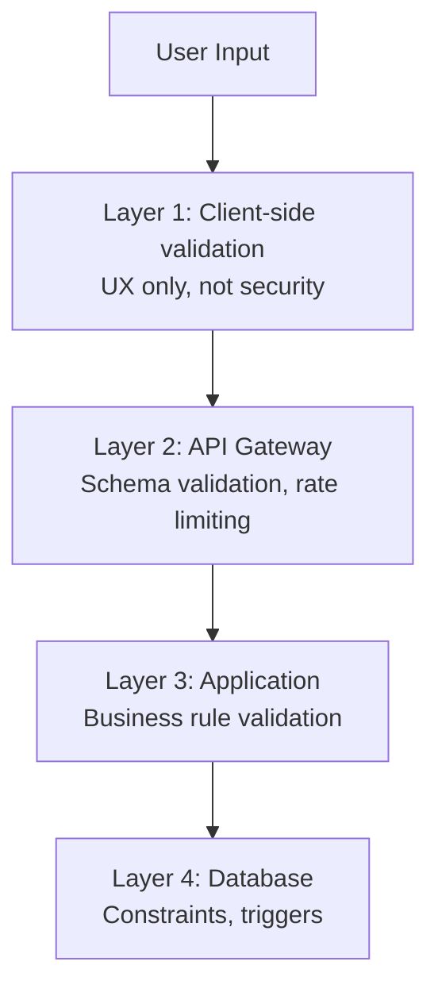
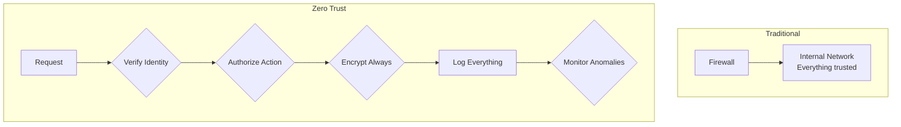
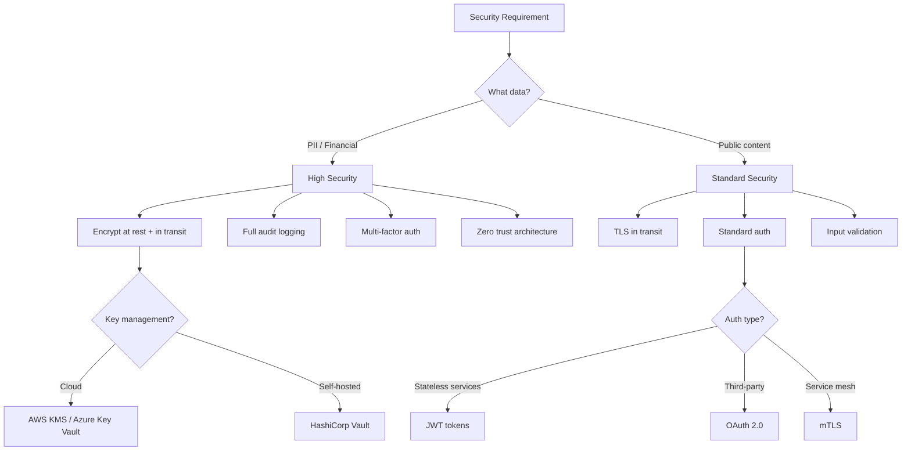

# Security

---

## Why Security in System Design?

Security is not a feature you bolt on at the end—it is a fundamental design constraint that shapes every architectural decision. In system design interviews, demonstrating security awareness separates senior candidates from junior ones.

An interviewer who hears you say "we should encrypt data at rest and in transit, validate all input at the boundary, and use short-lived tokens with least-privilege scopes" will immediately calibrate you as someone who builds production-grade systems.

### The CIA Triad

Every security discussion revolves around three properties:

| Property | Definition | Example |
|----------|-----------|---------|
| **Confidentiality** | Only authorized parties can access data | Encryption, access control |
| **Integrity** | Data cannot be modified without detection | Hashing, digital signatures |
| **Availability** | Systems remain accessible to authorized users | DDoS protection, redundancy |

---

## Common Vulnerabilities

Understanding attack vectors is essential for designing secure systems. These are the vulnerabilities interviewers expect you to know.

### SQL Injection

An attacker injects malicious SQL through user input, gaining unauthorized access to or modifying database data.

**Vulnerable code:**

```java
import org.springframework.jdbc.core.JdbcTemplate;

// NEVER DO THIS — concatenating user input into SQL
public User findUser(String username) {
    String query = "SELECT * FROM users WHERE username = '" + username + "'";
    return jdbcTemplate.queryForObject(query, userRowMapper);
}
// Input: ' OR '1'='1' --
// Becomes: SELECT * FROM users WHERE username = '' OR '1'='1' --'
// Returns ALL users
```

**Secure code:**

```java
import org.springframework.jdbc.core.JdbcTemplate;

// Use parameterized queries — the database treats input as data, not code
public User findUser(String username) {
    String query = "SELECT * FROM users WHERE username = ?";
    return jdbcTemplate.queryForObject(query, userRowMapper, username);
}
// Input: ' OR '1'='1' --
// Database searches for literal string: "' OR '1'='1' --"
// Returns nothing (correct behavior)
```

### Cross-Site Scripting (XSS)

An attacker injects malicious scripts into web pages viewed by other users.

**Types:**

| Type | Description | Example |
|------|-------------|---------|
| **Stored XSS** | Script saved in database, served to all visitors | Malicious comment on a blog post |
| **Reflected XSS** | Script in URL, reflected in response | Phishing link with script in query param |
| **DOM-based XSS** | Script executes via client-side JavaScript | Unsafe `innerHTML` assignment |

**Prevention:**

```java
import java.io.IOException;
import jakarta.servlet.Filter;
import jakarta.servlet.FilterChain;
import jakarta.servlet.ServletException;
import jakarta.servlet.ServletRequest;
import jakarta.servlet.ServletResponse;
import jakarta.servlet.http.HttpServletResponse;
import org.owasp.html.HtmlPolicyBuilder;
import org.owasp.html.PolicyFactory;

// Input sanitization utility
public class InputSanitizer {

    private static final PolicyFactory POLICY = new HtmlPolicyBuilder()
        .allowElements("b", "i", "em", "strong", "a")
        .allowUrlProtocols("https")
        .allowAttributes("href").onElements("a")
        .requireRelNofollowOnLinks()
        .toFactory();

    public static String sanitizeHtml(String untrustedInput) {
        return POLICY.sanitize(untrustedInput);
    }

    public static String escapeForHtml(String input) {
        if (input == null) return null;
        return input
            .replace("&", "&amp;")
            .replace("<", "&lt;")
            .replace(">", "&gt;")
            .replace("\"", "&quot;")
            .replace("'", "&#x27;");
    }
}

// Setting security headers in a filter
public class SecurityHeaderFilter implements Filter {
    @Override
    public void doFilter(ServletRequest req, ServletResponse resp, FilterChain chain)
            throws IOException, ServletException {
        HttpServletResponse httpResp = (HttpServletResponse) resp;
        httpResp.setHeader("Content-Security-Policy",
            "default-src 'self'; script-src 'self'; style-src 'self' 'unsafe-inline'");
        httpResp.setHeader("X-Content-Type-Options", "nosniff");
        httpResp.setHeader("X-Frame-Options", "DENY");
        httpResp.setHeader("X-XSS-Protection", "1; mode=block");
        httpResp.setHeader("Strict-Transport-Security", "max-age=31536000; includeSubDomains");
        chain.doFilter(req, resp);
    }
}
```

### Cross-Site Request Forgery (CSRF)

An attacker tricks a user's browser into making an unwanted request to a site where the user is authenticated.



**Prevention: Synchronizer Token Pattern**

```java
import java.nio.charset.StandardCharsets;
import java.security.MessageDigest;
import java.security.SecureRandom;
import java.util.Base64;

public class CsrfTokenManager {
    private final SecureRandom random = new SecureRandom();

    public String generateToken() {
        byte[] bytes = new byte[32];
        random.nextBytes(bytes);
        return Base64.getUrlEncoder().withoutPadding().encodeToString(bytes);
    }

    public boolean validateToken(String sessionToken, String requestToken) {
        if (sessionToken == null || requestToken == null) return false;
        return MessageDigest.isEqual(
            sessionToken.getBytes(StandardCharsets.UTF_8),
            requestToken.getBytes(StandardCharsets.UTF_8)
        );
    }
}
```

!!! tip
    Modern SPAs using JWT in `Authorization` headers (not cookies) are naturally CSRF-resistant because the attacker's site cannot read the token from localStorage.

---

## Encryption

Encryption transforms readable data (plaintext) into an unreadable format (ciphertext) using a key. Only entities with the correct key can reverse the process.

### Symmetric Encryption

The same key encrypts and decrypts the data.



| Algorithm | Key Size | Speed | Use Case |
|-----------|----------|-------|----------|
| **AES-256** | 256 bits | Fast | Data at rest, TLS payload |
| **ChaCha20** | 256 bits | Very fast | Mobile, IoT, TLS (alternative to AES) |
| **3DES** | 168 bits | Slow | Legacy systems (avoid in new designs) |

**Java Example: AES-256-GCM Encryption**

```java
import javax.crypto.Cipher;
import javax.crypto.KeyGenerator;
import javax.crypto.SecretKey;
import javax.crypto.spec.GCMParameterSpec;
import java.security.SecureRandom;

public class AesGcmEncryption {
    private static final int GCM_TAG_LENGTH = 128; // bits
    private static final int GCM_IV_LENGTH = 12;    // bytes

    public static SecretKey generateKey() throws Exception {
        KeyGenerator keyGen = KeyGenerator.getInstance("AES");
        keyGen.init(256);
        return keyGen.generateKey();
    }

    public static byte[] encrypt(byte[] plaintext, SecretKey key) throws Exception {
        byte[] iv = new byte[GCM_IV_LENGTH];
        new SecureRandom().nextBytes(iv);

        Cipher cipher = Cipher.getInstance("AES/GCM/NoPadding");
        cipher.init(Cipher.ENCRYPT_MODE, key, new GCMParameterSpec(GCM_TAG_LENGTH, iv));
        byte[] ciphertext = cipher.doFinal(plaintext);

        // prepend IV to ciphertext for decryption
        byte[] result = new byte[iv.length + ciphertext.length];
        System.arraycopy(iv, 0, result, 0, iv.length);
        System.arraycopy(ciphertext, 0, result, iv.length, ciphertext.length);
        return result;
    }

    public static byte[] decrypt(byte[] encryptedData, SecretKey key) throws Exception {
        byte[] iv = new byte[GCM_IV_LENGTH];
        System.arraycopy(encryptedData, 0, iv, 0, iv.length);

        byte[] ciphertext = new byte[encryptedData.length - iv.length];
        System.arraycopy(encryptedData, iv.length, ciphertext, 0, ciphertext.length);

        Cipher cipher = Cipher.getInstance("AES/GCM/NoPadding");
        cipher.init(Cipher.DECRYPT_MODE, key, new GCMParameterSpec(GCM_TAG_LENGTH, iv));
        return cipher.doFinal(ciphertext);
    }
}
```

### Asymmetric Encryption

Uses a key pair: a **public key** (shared freely) for encryption and a **private key** (kept secret) for decryption.



| Algorithm | Key Size | Use Case |
|-----------|----------|----------|
| **RSA** | 2048-4096 bits | TLS handshake, digital signatures, key exchange |
| **ECDSA** | 256-384 bits | TLS, cryptocurrency, mobile (smaller keys, same security) |
| **Ed25519** | 256 bits | SSH keys, code signing (modern, fast) |

**When to use which:**

| Scenario | Type | Reasoning |
|----------|------|-----------|
| Encrypting data in a database | Symmetric (AES) | Fast, key managed by your service |
| TLS handshake | Asymmetric (RSA/ECDH) | Exchange symmetric key securely |
| TLS data transfer | Symmetric (AES) | After handshake, fast bulk encryption |
| Digital signatures | Asymmetric (RSA/ECDSA) | Verify sender identity without sharing private key |
| Password storage | Neither — use **hashing** | Passwords should never be reversible |

---

## Hashing

A hash function maps arbitrary-size input to a fixed-size output (digest). Unlike encryption, hashing is a **one-way** operation—you cannot recover the original input from the hash.

### Properties of Cryptographic Hash Functions

| Property | Description |
|----------|-------------|
| **Deterministic** | Same input always produces the same output |
| **Fast to compute** | Generating a hash is computationally efficient |
| **Pre-image resistant** | Given a hash, infeasible to find the input |
| **Collision resistant** | Infeasible to find two inputs with the same hash |
| **Avalanche effect** | Small change in input produces completely different hash |

### Hash Functions Comparison

| Function | Output Size | Speed | Security | Use Case |
|----------|-------------|-------|----------|----------|
| **MD5** | 128 bits | Very fast | Broken | Checksums only (never for security) |
| **SHA-1** | 160 bits | Fast | Weak | Legacy systems (deprecate) |
| **SHA-256** | 256 bits | Fast | Strong | Data integrity, digital signatures |
| **SHA-3** | 256/512 bits | Moderate | Strong | When SHA-2 alternative needed |
| **bcrypt** | 184 bits | Intentionally slow | Strong | Password hashing |
| **Argon2** | Configurable | Intentionally slow | Strongest | Password hashing (modern) |

### Java Example: Secure Password Hashing

```java
import java.security.MessageDigest;
import java.util.Base64;
import javax.crypto.Mac;
import javax.crypto.SecretKey;
import org.springframework.security.crypto.bcrypt.BCryptPasswordEncoder;
import org.springframework.security.crypto.argon2.Argon2PasswordEncoder;

public class PasswordHasher {
    // bcrypt: industry standard, includes salt automatically
    private final BCryptPasswordEncoder bcrypt = new BCryptPasswordEncoder(12);

    // Argon2id: winner of Password Hashing Competition (2015)
    // memory-hard, resistant to GPU attacks
    private final Argon2PasswordEncoder argon2 = 
        Argon2PasswordEncoder.defaultsForSpringSecurity_v5_8();

    public String hashPassword(String rawPassword) {
        return argon2.encode(rawPassword);
    }

    public boolean verifyPassword(String rawPassword, String hashedPassword) {
        return argon2.matches(rawPassword, hashedPassword);
    }
}

// Data integrity verification
public class IntegrityVerifier {
    public static String sha256(byte[] data) throws Exception {
        MessageDigest digest = MessageDigest.getInstance("SHA-256");
        byte[] hash = digest.digest(data);
        StringBuilder hex = new StringBuilder();
        for (byte b : hash) {
            hex.append(String.format("%02x", b));
        }
        return hex.toString();
    }

    public static boolean verifyIntegrity(byte[] data, String expectedHash) throws Exception {
        return sha256(data).equals(expectedHash);
    }

    // HMAC for message authentication
    public static String hmacSha256(byte[] data, SecretKey key) throws Exception {
        Mac mac = Mac.getInstance("HmacSHA256");
        mac.init(key);
        byte[] hmac = mac.doFinal(data);
        return Base64.getEncoder().encodeToString(hmac);
    }
}
```

!!! warning
    Never store passwords in plaintext or with reversible encryption. Always use bcrypt, scrypt, or Argon2id with a unique salt per password.

---

## TLS/SSL

!!! note
    TLS is also introduced in [Networking](networking.md) in the context of HTTPS. This section covers the cryptographic details and certificate management.

TLS (Transport Layer Security) encrypts data in transit between client and server. SSL is its deprecated predecessor—when someone says "SSL" today, they almost always mean TLS.

### TLS Handshake (TLS 1.3)



**TLS 1.3 improvements over TLS 1.2:**

| Feature | TLS 1.2 | TLS 1.3 |
|---------|---------|---------|
| **Handshake round trips** | 2 RTT | 1 RTT (0-RTT for resumed) |
| **Cipher suites** | Many (some weak) | Only 5 strong suites |
| **Forward secrecy** | Optional | Mandatory |
| **Key exchange** | RSA or DHE | ECDHE only |

### Certificate Chain of Trust



### Mutual TLS (mTLS) for Service-to-Service

In a microservices architecture, mTLS ensures both the client and server authenticate each other:

```java
import javax.net.ssl.SSLContext;
import org.apache.hc.client5.http.classic.HttpClient;
import org.apache.hc.client5.http.impl.classic.HttpClients;
import org.apache.hc.core5.ssl.SSLContextBuilder;
import org.springframework.boot.web.client.RestTemplateBuilder;
import org.springframework.context.annotation.Bean;
import org.springframework.context.annotation.Configuration;
import org.springframework.core.io.ClassPathResource;
import org.springframework.http.client.HttpComponentsClientHttpRequestFactory;
import org.springframework.web.client.RestTemplate;

// Configuring mTLS in a Spring Boot service
@Configuration
public class MtlsConfig {

    @Bean
    public RestTemplate mtlsRestTemplate() throws Exception {
        SSLContext sslContext = SSLContextBuilder.create()
            .loadKeyMaterial(
                new ClassPathResource("client-keystore.p12").getURL(),
                "keystorePass".toCharArray(),
                "keyPass".toCharArray()
            )
            .loadTrustMaterial(
                new ClassPathResource("truststore.jks").getURL(),
                "truststorePass".toCharArray()
            )
            .build();

        HttpClient httpClient = HttpClients.custom()
            .setSSLContext(sslContext)
            .build();

        return new RestTemplateBuilder()
            .requestFactory(() -> new HttpComponentsClientHttpRequestFactory(httpClient))
            .build();
    }
}
```

---

## Input Validation

Every piece of data entering your system is potentially malicious. Validate at the boundary—before data reaches business logic or storage.

### Validation Strategy: Defense in Depth



### Java Example: Comprehensive Input Validation

```java
import java.util.ArrayList;
import java.util.List;
import java.util.regex.Pattern;

public class UserRegistrationValidator {

    private static final int MAX_NAME_LENGTH = 100;
    private static final int MAX_EMAIL_LENGTH = 254;
    private static final Pattern EMAIL_PATTERN = 
        Pattern.compile("^[a-zA-Z0-9._%+-]+@[a-zA-Z0-9.-]+\\.[a-zA-Z]{2,}$");
    private static final Pattern NAME_PATTERN = 
        Pattern.compile("^[\\p{L}\\p{M}' \\-]+$"); // unicode letters, marks, apostrophes

    public record ValidationResult(boolean valid, List<String> errors) {
        public static ValidationResult ok() { return new ValidationResult(true, List.of()); }
        public static ValidationResult fail(List<String> errors) {
            return new ValidationResult(false, errors);
        }
    }

    public ValidationResult validate(CreateUserRequest request) {
        List<String> errors = new ArrayList<>();

        // null checks
        if (request.name() == null || request.name().isBlank()) {
            errors.add("name: must not be blank");
        } else {
            if (request.name().length() > MAX_NAME_LENGTH) {
                errors.add("name: must not exceed " + MAX_NAME_LENGTH + " characters");
            }
            if (!NAME_PATTERN.matcher(request.name()).matches()) {
                errors.add("name: contains invalid characters");
            }
        }

        // email validation
        if (request.email() == null || request.email().isBlank()) {
            errors.add("email: must not be blank");
        } else {
            String normalizedEmail = request.email().trim().toLowerCase();
            if (normalizedEmail.length() > MAX_EMAIL_LENGTH) {
                errors.add("email: must not exceed " + MAX_EMAIL_LENGTH + " characters");
            }
            if (!EMAIL_PATTERN.matcher(normalizedEmail).matches()) {
                errors.add("email: must be a valid email address");
            }
        }

        // password strength
        if (request.password() == null || request.password().length() < 12) {
            errors.add("password: must be at least 12 characters");
        } else {
            if (!hasUppercase(request.password())) errors.add("password: must contain uppercase");
            if (!hasLowercase(request.password())) errors.add("password: must contain lowercase");
            if (!hasDigit(request.password())) errors.add("password: must contain a digit");
            if (!hasSpecial(request.password())) errors.add("password: must contain special char");
        }

        return errors.isEmpty() ? ValidationResult.ok() : ValidationResult.fail(errors);
    }

    private boolean hasUppercase(String s) { return !s.equals(s.toLowerCase()); }
    private boolean hasLowercase(String s) { return !s.equals(s.toUpperCase()); }
    private boolean hasDigit(String s) { return s.chars().anyMatch(Character::isDigit); }
    private boolean hasSpecial(String s) {
        return s.chars().anyMatch(c -> !Character.isLetterOrDigit(c));
    }
}
```

---

## Security Architecture Patterns

### Zero Trust Architecture

Traditional security uses a "castle and moat" model: strong perimeter, trusted interior. Zero Trust assumes no implicit trust—every request is verified.



**Zero Trust principles:**

1. **Never trust, always verify** — authenticate and authorize every request
2. **Least privilege** — grant minimum necessary permissions
3. **Assume breach** — design as if the attacker is already inside
4. **Micro-segmentation** — isolate services, limit blast radius
5. **Continuous monitoring** — detect anomalies in real-time

### Secrets Management

```java
import com.github.benmanes.caffeine.cache.Cache;
import com.github.benmanes.caffeine.cache.Caffeine;
import java.time.Duration;
import java.time.Instant;
import java.util.Base64;
import java.util.Map;
import java.security.SecureRandom;

/**
 * Secrets management abstraction that supports multiple backends.
 * In production, use HashiCorp Vault, AWS Secrets Manager, or Azure Key Vault.
 */
public interface SecretsManager {
    String getSecret(String key);
    void rotateSecret(String key);
}

public class VaultSecretsManager implements SecretsManager {
    private final VaultClient vaultClient;
    private final Cache<String, CachedSecret> cache;

    public VaultSecretsManager(VaultClient vaultClient) {
        this.vaultClient = vaultClient;
        this.cache = Caffeine.newBuilder()
            .expireAfterWrite(Duration.ofMinutes(5))
            .build();
    }

    @Override
    public String getSecret(String key) {
        CachedSecret cached = cache.getIfPresent(key);
        if (cached != null) return cached.value();

        VaultResponse response = vaultClient.logical()
            .read("secret/data/" + key);

        String value = response.getData().get("value").toString();
        cache.put(key, new CachedSecret(value, Instant.now()));
        return value;
    }

    @Override
    public void rotateSecret(String key) {
        cache.invalidate(key);
        vaultClient.logical().write("secret/data/" + key,
            Map.of("value", generateNewSecret()));
    }

    private String generateNewSecret() {
        byte[] bytes = new byte[32];
        new SecureRandom().nextBytes(bytes);
        return Base64.getEncoder().encodeToString(bytes);
    }
}
```

---

## Security Checklist for System Design Interviews

| Layer | Measures |
|-------|----------|
| **Transport** | TLS 1.3, certificate pinning, HSTS |
| **Authentication** | JWT with short expiry, refresh tokens, MFA |
| **Authorization** | RBAC or ABAC, least privilege, per-resource checks |
| **Input** | Validate all input, parameterized queries, sanitize output |
| **Data at rest** | AES-256-GCM, envelope encryption, key rotation |
| **Secrets** | Vault/KMS, never hardcode, rotate regularly |
| **Logging** | No PII in logs, audit trail, tamper-evident |
| **Network** | mTLS between services, network policies, WAF |
| **Dependencies** | SCA scanning, lock file, automated patching |
| **Monitoring** | Anomaly detection, rate limiting, alerting |

---

## Interview Decision Framework



!!! important
    In every system design interview, proactively mention security concerns. Don't wait to be asked. Stating "we need TLS for all communication, parameterized queries to prevent injection, and we should use a secrets manager for API keys" demonstrates production-ready thinking.

---

## Further Reading

| Topic | Resource |
|-------|----------|
| OWASP Top 10 | [owasp.org/www-project-top-ten](https://owasp.org/www-project-top-ten/) |
| TLS 1.3 | [RFC 8446](https://tools.ietf.org/html/rfc8446) |
| Zero Trust | [NIST SP 800-207](https://csrc.nist.gov/publications/detail/sp/800-207/final) |
| Password Hashing | [OWASP Password Storage Cheat Sheet](https://cheatsheetseries.owasp.org/cheatsheets/Password_Storage_Cheat_Sheet.html) |
| JWT Best Practices | [RFC 8725](https://tools.ietf.org/html/rfc8725) |
