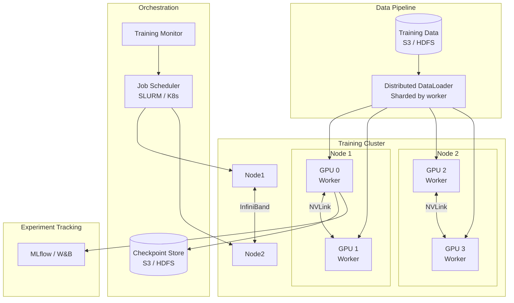
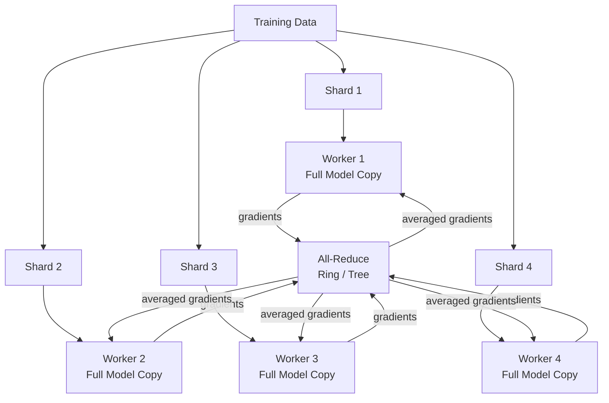
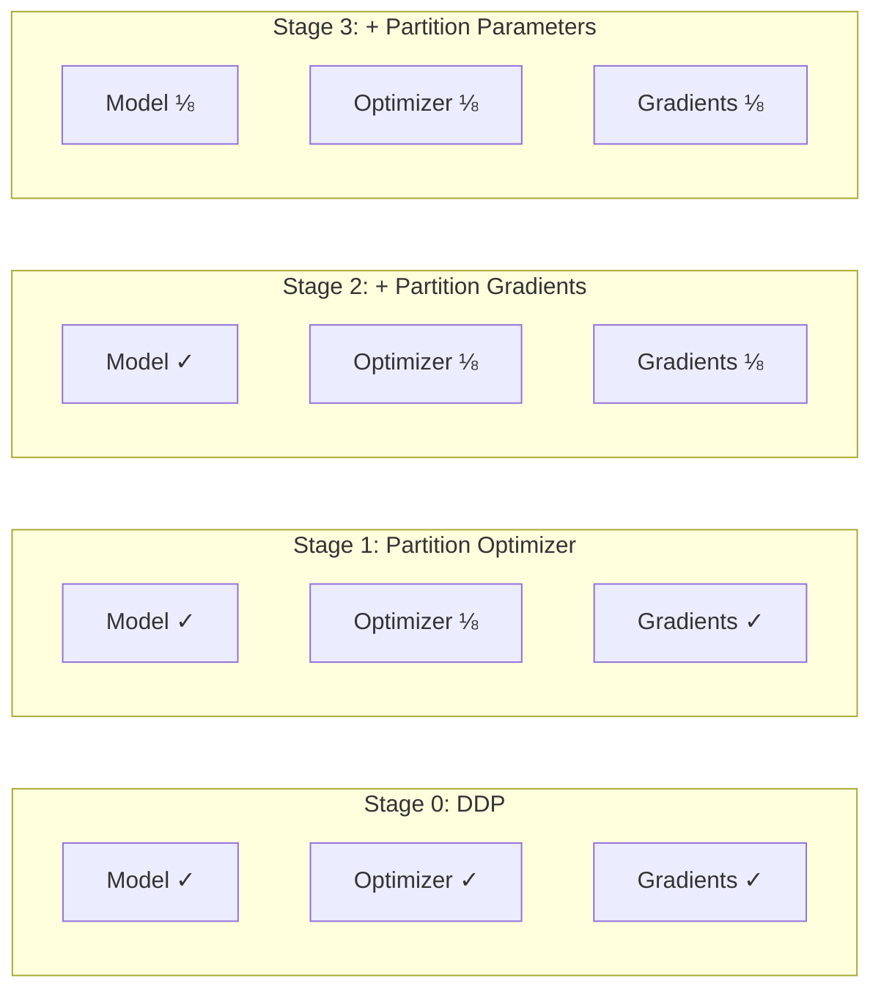
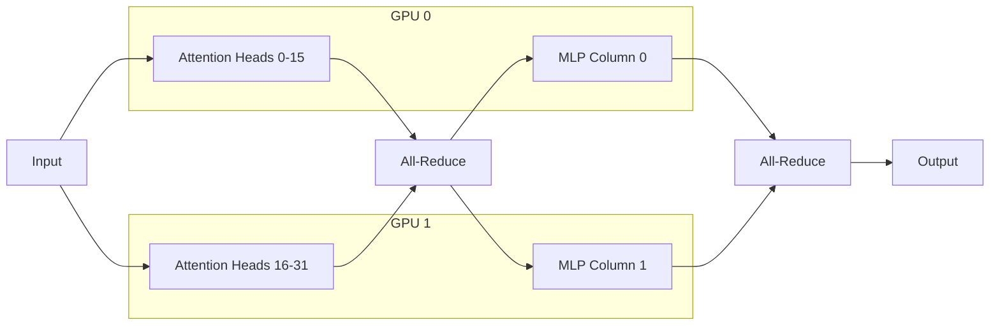
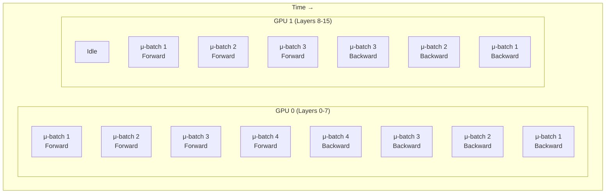

# Distributed Training

Design training infrastructure that scales deep learning across hundreds of GPUs — from data parallelism to model parallelism and parameter servers.

---

## Step 1: Requirements Clarification

### Why Distributed Training?

| Problem | Single GPU | Distributed |
|---------|-----------|-------------|
| **Model doesn't fit in memory** | Out of memory | Split model across GPUs |
| **Training takes weeks** | Wait | Parallelize data processing |
| **Need large batch sizes** | GPU memory limit | Aggregate across workers |
| **Rapid experimentation** | 1 run at a time | Multiple parallel experiments |

### Functional Requirements

| Requirement | Description |
|-------------|-------------|
| **Data parallelism** | Same model on each GPU, different data shards |
| **Model parallelism** | Split model layers/tensors across GPUs |
| **Pipeline parallelism** | Split model into stages, process micro-batches concurrently |
| **Mixed precision** | FP16/BF16 forward pass with FP32 master weights |
| **Checkpointing** | Save and resume training from any point |
| **Fault tolerance** | Continue training when workers fail |
| **Experiment tracking** | Log metrics, hyperparameters, and artifacts |

### Non-Functional Requirements

| Requirement | Target |
|-------------|--------|
| **Scaling efficiency** | > 85% linear scaling up to 64 GPUs |
| **Communication overhead** | < 15% of total training time |
| **Checkpoint frequency** | Every 15 minutes |
| **Recovery time** | < 5 minutes from worker failure |
| **GPU utilization** | > 90% during training |

---

## Step 2: Back-of-Envelope Estimation

### Training a 7B Parameter Model

```
Model size (FP32):          7B × 4 bytes = 28 GB
Model size (BF16):          7B × 2 bytes = 14 GB
Optimizer states (Adam):    7B × 8 bytes = 56 GB  (momentum + variance)
Gradients (BF16):           7B × 2 bytes = 14 GB
Activations (per layer):    ~2-8 GB (depends on batch size, seq len)

Total memory per GPU (single):
  Model + optimizer + gradients + activations ≈ 100+ GB
  → Doesn't fit on A100-80GB without parallelism

With ZeRO Stage 3 (sharding everything):
  Per GPU (8 GPUs): (28 + 56 + 14) / 8 + activations ≈ 15 GB + activations
  → Fits on A100-40GB with batch size 4
```

### Training Time Estimation

```
Dataset:                    1T tokens
Tokens per second (single A100): ~3,000 (7B model, BF16)
Single GPU time:            1T / 3,000 = 333M seconds ≈ 3,858 days

With 64 A100 GPUs:
  Ideal (linear):           3,858 / 64 ≈ 60 days
  Realistic (85% efficiency): ~70 days

With 512 H100 GPUs:
  Tokens/sec per H100:      ~10,000
  Total throughput:          512 × 10,000 = 5.12M tok/s
  Time:                     1T / 5.12M = 195,312s ≈ 2.3 days
```

### Communication Costs

```
All-Reduce (ring):
  Data per GPU:             28 GB (model gradients, FP16 = 14 GB)
  Ring bandwidth (NVLink):  600 GB/s
  All-reduce time (8 GPUs): 2 × (N-1)/N × 14 GB / 600 GB/s ≈ 41ms
  Inter-node (400Gbps IB):  2 × 14 GB / 50 GB/s ≈ 560ms

Communication-to-compute ratio:
  Forward + backward (A100): ~500ms per step
  Communication:             41ms (intra-node) to 560ms (inter-node)
  Overhead:                  8% (intra) to 53% (inter without overlap)
  → Must overlap communication with computation
```

---

## Step 3: High-Level Architecture



---

## Step 4: Data Parallelism

Data parallelism is the most common strategy: each GPU holds a **complete copy** of the model, processes a different shard of data, and synchronizes gradients after each step.



### PyTorch DDP Implementation

```python
import torch
import torch.nn as nn
import torch.distributed as dist
from torch.nn.parallel import DistributedDataParallel as DDP
from torch.utils.data import DataLoader, DistributedSampler
import os
import logging

logger = logging.getLogger(__name__)


def setup_distributed():
    """Initialize distributed process group."""
    dist.init_process_group(backend="nccl")
    local_rank = int(os.environ["LOCAL_RANK"])
    torch.cuda.set_device(local_rank)
    return local_rank


def cleanup_distributed():
    dist.destroy_process_group()


class DistributedTrainer:
    """Data-parallel training with PyTorch DDP."""

    def __init__(
        self,
        model: nn.Module,
        train_dataset,
        val_dataset=None,
        learning_rate: float = 1e-4,
        batch_size_per_gpu: int = 32,
        gradient_accumulation_steps: int = 1,
    ):
        self.local_rank = setup_distributed()
        self.world_size = dist.get_world_size()
        self.global_rank = dist.get_rank()
        self.is_main = self.global_rank == 0

        self.model = model.cuda(self.local_rank)
        self.model = DDP(self.model, device_ids=[self.local_rank])

        self.effective_batch_size = (
            batch_size_per_gpu * self.world_size * gradient_accumulation_steps
        )
        self.grad_accum_steps = gradient_accumulation_steps

        self.optimizer = torch.optim.AdamW(
            self.model.parameters(), lr=learning_rate
        )

        self.train_sampler = DistributedSampler(
            train_dataset,
            num_replicas=self.world_size,
            rank=self.global_rank,
            shuffle=True,
        )
        self.train_loader = DataLoader(
            train_dataset,
            batch_size=batch_size_per_gpu,
            sampler=self.train_sampler,
            num_workers=4,
            pin_memory=True,
            prefetch_factor=2,
        )

        if self.is_main:
            logger.info(
                "Distributed training: %d GPUs, effective batch size: %d",
                self.world_size, self.effective_batch_size,
            )

    def train_epoch(self, epoch: int) -> dict[str, float]:
        self.model.train()
        self.train_sampler.set_epoch(epoch)
        total_loss = 0.0
        num_steps = 0

        self.optimizer.zero_grad()

        for step, batch in enumerate(self.train_loader):
            inputs = {k: v.cuda(self.local_rank) for k, v in batch.items()}

            with torch.amp.autocast("cuda", dtype=torch.bfloat16):
                outputs = self.model(**inputs)
                loss = outputs.loss / self.grad_accum_steps

            loss.backward()

            if (step + 1) % self.grad_accum_steps == 0:
                torch.nn.utils.clip_grad_norm_(self.model.parameters(), 1.0)
                self.optimizer.step()
                self.optimizer.zero_grad()
                num_steps += 1

            total_loss += loss.item() * self.grad_accum_steps

        avg_loss = total_loss / max(len(self.train_loader), 1)

        loss_tensor = torch.tensor([avg_loss], device=f"cuda:{self.local_rank}")
        dist.all_reduce(loss_tensor, op=dist.ReduceOp.AVG)

        return {"avg_loss": loss_tensor.item(), "steps": num_steps}

    def save_checkpoint(self, path: str, epoch: int, metrics: dict):
        if not self.is_main:
            return

        checkpoint = {
            "epoch": epoch,
            "model_state": self.model.module.state_dict(),
            "optimizer_state": self.optimizer.state_dict(),
            "metrics": metrics,
        }
        torch.save(checkpoint, path)
        logger.info("Checkpoint saved: %s (epoch %d)", path, epoch)

    def load_checkpoint(self, path: str) -> int:
        map_location = f"cuda:{self.local_rank}"
        checkpoint = torch.load(path, map_location=map_location)
        self.model.module.load_state_dict(checkpoint["model_state"])
        self.optimizer.load_state_dict(checkpoint["optimizer_state"])
        logger.info("Checkpoint loaded: %s (epoch %d)", path, checkpoint["epoch"])
        return checkpoint["epoch"]


# Launch: torchrun --nproc_per_node=4 --nnodes=2 --node_rank=0 \
#          --master_addr=node0 --master_port=29500 train.py
```

---

## Step 5: ZeRO (Zero Redundancy Optimizer)

ZeRO eliminates memory redundancy by partitioning optimizer states, gradients, and model parameters across GPUs instead of replicating them.

### ZeRO Stages

| Stage | What's Partitioned | Memory per GPU (7B model, 8 GPUs) |
|-------|-------------------|-----------------------------------|
| **Stage 0 (DDP)** | Nothing — full replication | 28 + 56 + 14 = 98 GB |
| **Stage 1** | Optimizer states | 28 + 7 + 14 = 49 GB |
| **Stage 2** | + Gradients | 28 + 7 + 1.75 = 36.75 GB |
| **Stage 3** | + Model parameters | 3.5 + 7 + 1.75 = 12.25 GB |



### DeepSpeed ZeRO Implementation

```python
import deepspeed
import torch
import torch.nn as nn
from torch.utils.data import DataLoader, DistributedSampler
import json
import logging

logger = logging.getLogger(__name__)


DEEPSPEED_CONFIG = {
    "train_batch_size": 256,
    "train_micro_batch_size_per_gpu": 8,
    "gradient_accumulation_steps": 4,

    "optimizer": {
        "type": "AdamW",
        "params": {
            "lr": 1e-4,
            "betas": [0.9, 0.95],
            "weight_decay": 0.1,
        },
    },

    "scheduler": {
        "type": "WarmupDecayLR",
        "params": {
            "warmup_min_lr": 0,
            "warmup_max_lr": 1e-4,
            "warmup_num_steps": 2000,
            "total_num_steps": 100000,
        },
    },

    "bf16": {"enabled": True},

    "zero_optimization": {
        "stage": 3,
        "offload_optimizer": {"device": "cpu", "pin_memory": True},
        "offload_param": {"device": "none"},
        "overlap_comm": True,
        "contiguous_gradients": True,
        "reduce_bucket_size": 5e8,
        "stage3_prefetch_bucket_size": 5e8,
        "stage3_param_persistence_threshold": 1e6,
        "gather_16bit_weights_on_model_save": True,
    },

    "gradient_clipping": 1.0,

    "activation_checkpointing": {
        "partition_activations": True,
        "contiguous_memory_optimization": True,
    },

    "wall_clock_breakdown": True,
}


class DeepSpeedTrainer:
    """Training with DeepSpeed ZeRO for large model training."""

    def __init__(self, model: nn.Module, train_dataset, config: dict | None = None):
        self.config = config or DEEPSPEED_CONFIG

        self.model_engine, self.optimizer, self.train_loader, self.scheduler = (
            deepspeed.initialize(
                model=model,
                config=self.config,
                training_data=train_dataset,
            )
        )

        self.local_rank = self.model_engine.local_rank
        self.global_rank = self.model_engine.global_rank
        self.is_main = self.global_rank == 0

        if self.is_main:
            logger.info(
                "DeepSpeed initialized: ZeRO stage %d, world size %d",
                self.config["zero_optimization"]["stage"],
                self.model_engine.world_size,
            )

    def train_step(self, batch: dict) -> float:
        inputs = {k: v.to(self.model_engine.device) for k, v in batch.items()}

        outputs = self.model_engine(**inputs)
        loss = outputs.loss

        self.model_engine.backward(loss)
        self.model_engine.step()

        return loss.item()

    def train_epoch(self, epoch: int) -> dict[str, float]:
        self.model_engine.train()
        total_loss = 0.0
        num_steps = 0

        for batch in self.train_loader:
            loss = self.train_step(batch)
            total_loss += loss
            num_steps += 1

            if self.is_main and num_steps % 100 == 0:
                avg = total_loss / num_steps
                logger.info("Epoch %d, step %d, loss: %.4f", epoch, num_steps, avg)

        return {"avg_loss": total_loss / max(num_steps, 1), "steps": num_steps}

    def save_checkpoint(self, path: str, tag: str):
        self.model_engine.save_checkpoint(path, tag=tag)
        if self.is_main:
            logger.info("Checkpoint saved: %s/%s", path, tag)

    def load_checkpoint(self, path: str, tag: str = None):
        _, client_state = self.model_engine.load_checkpoint(path, tag=tag)
        if self.is_main:
            logger.info("Checkpoint loaded: %s", path)
        return client_state
```

---

## Step 6: Model Parallelism

When a model is too large for a single GPU (even with ZeRO), we split the model itself across GPUs.

### Tensor Parallelism vs Pipeline Parallelism

| Approach | How It Works | Communication | Best For |
|----------|-------------|---------------|---------|
| **Tensor parallelism** | Split individual layers (attention heads, MLP columns) | All-reduce per layer (high bandwidth required) | Intra-node (NVLink) |
| **Pipeline parallelism** | Split sequential layers into stages | Point-to-point between stages | Inter-node |
| **Expert parallelism** | Different experts on different GPUs (MoE) | All-to-all for routing | Mixture-of-Experts models |

### Tensor Parallelism



```python
import torch
import torch.nn as nn
import torch.distributed as dist
from typing import Optional


class ColumnParallelLinear(nn.Module):
    """Splits weight matrix column-wise across GPUs.
    
    Each GPU holds W[:, start:end] and computes a partial output.
    Results are gathered via all-gather.
    """

    def __init__(
        self,
        in_features: int,
        out_features: int,
        world_size: int,
        rank: int,
        bias: bool = True,
    ):
        super().__init__()
        assert out_features % world_size == 0
        self.out_per_partition = out_features // world_size
        self.rank = rank
        self.world_size = world_size

        self.linear = nn.Linear(in_features, self.out_per_partition, bias=bias)

    def forward(self, x: torch.Tensor) -> torch.Tensor:
        local_output = self.linear(x)
        return local_output  # gather in the next layer


class RowParallelLinear(nn.Module):
    """Splits weight matrix row-wise. Each GPU holds W[start:end, :]
    and receives the corresponding partition of the input."""

    def __init__(
        self,
        in_features: int,
        out_features: int,
        world_size: int,
        rank: int,
        bias: bool = True,
    ):
        super().__init__()
        assert in_features % world_size == 0
        self.in_per_partition = in_features // world_size
        self.rank = rank
        self.world_size = world_size

        self.linear = nn.Linear(self.in_per_partition, out_features, bias=bias)

    def forward(self, x: torch.Tensor) -> torch.Tensor:
        local_output = self.linear(x)
        dist.all_reduce(local_output, op=dist.ReduceOp.SUM)
        return local_output


class TensorParallelTransformerLayer(nn.Module):
    """A transformer layer split across GPUs using tensor parallelism."""

    def __init__(
        self,
        hidden_size: int,
        num_heads: int,
        world_size: int,
        rank: int,
    ):
        super().__init__()
        self.hidden_size = hidden_size
        assert num_heads % world_size == 0

        self.ln1 = nn.LayerNorm(hidden_size)
        self.ln2 = nn.LayerNorm(hidden_size)

        self.qkv = ColumnParallelLinear(
            hidden_size, 3 * hidden_size, world_size, rank
        )
        self.attn_out = RowParallelLinear(
            hidden_size, hidden_size, world_size, rank
        )

        self.mlp_up = ColumnParallelLinear(
            hidden_size, 4 * hidden_size, world_size, rank
        )
        self.mlp_down = RowParallelLinear(
            4 * hidden_size, hidden_size, world_size, rank
        )

        self.heads_per_partition = num_heads // world_size
        self.head_dim = hidden_size // num_heads

    def forward(self, x: torch.Tensor) -> torch.Tensor:
        residual = x
        x = self.ln1(x)

        qkv = self.qkv(x)
        q, k, v = qkv.chunk(3, dim=-1)

        bsz, seq_len, _ = q.shape
        q = q.view(bsz, seq_len, self.heads_per_partition, self.head_dim).transpose(1, 2)
        k = k.view(bsz, seq_len, self.heads_per_partition, self.head_dim).transpose(1, 2)
        v = v.view(bsz, seq_len, self.heads_per_partition, self.head_dim).transpose(1, 2)

        attn = torch.nn.functional.scaled_dot_product_attention(q, k, v)
        attn = attn.transpose(1, 2).contiguous().view(bsz, seq_len, -1)
        x = self.attn_out(attn) + residual

        residual = x
        x = self.ln2(x)
        x = self.mlp_up(x)
        x = torch.nn.functional.gelu(x)
        x = self.mlp_down(x) + residual

        return x
```

### Pipeline Parallelism



```python
import torch
import torch.nn as nn
from typing import Optional
from dataclasses import dataclass
import logging

logger = logging.getLogger(__name__)


@dataclass
class PipelineConfig:
    num_stages: int = 4
    num_micro_batches: int = 8
    micro_batch_size: int = 4


class PipelineStage(nn.Module):
    """A stage in the pipeline — a subset of consecutive model layers."""

    def __init__(self, layers: nn.ModuleList, stage_id: int):
        super().__init__()
        self.layers = layers
        self.stage_id = stage_id

    def forward(self, x: torch.Tensor) -> torch.Tensor:
        for layer in self.layers:
            x = layer(x)
        return x


class GPipeScheduler:
    """GPipe-style pipeline scheduler: all forwards, then all backwards."""

    def __init__(self, config: PipelineConfig):
        self.config = config

    def generate_schedule(self) -> list[tuple[str, int, int]]:
        """Returns list of (action, stage_id, micro_batch_id)."""
        schedule = []

        for mb in range(self.config.num_micro_batches):
            for stage in range(self.config.num_stages):
                schedule.append(("forward", stage, mb))

        for mb in reversed(range(self.config.num_micro_batches)):
            for stage in reversed(range(self.config.num_stages)):
                schedule.append(("backward", stage, mb))

        return schedule


class OneFOneBScheduler:
    """1F1B pipeline schedule: interleaves forward and backward for better memory."""

    def __init__(self, config: PipelineConfig):
        self.config = config

    def generate_schedule(self) -> list[tuple[str, int, int]]:
        schedule = []
        num_stages = self.config.num_stages
        num_mb = self.config.num_micro_batches

        for stage in range(num_stages):
            warmup_steps = num_stages - stage - 1

            for mb in range(warmup_steps):
                if mb < num_mb:
                    schedule.append(("forward", stage, mb))

            for mb in range(warmup_steps, num_mb):
                schedule.append(("forward", stage, mb))
                backward_mb = mb - warmup_steps
                if backward_mb >= 0:
                    schedule.append(("backward", stage, backward_mb))

            for mb in range(max(0, num_mb - warmup_steps), num_mb):
                schedule.append(("backward", stage, mb))

        return schedule
```

---

## Step 7: Communication Primitives

### All-Reduce Algorithms

| Algorithm | Bandwidth Cost | Latency Cost | Best For |
|-----------|---------------|--------------|---------|
| **Ring all-reduce** | 2(N-1)/N × M | 2(N-1) × α | Large messages, many GPUs |
| **Tree all-reduce** | 2 × M | 2 log(N) × α | Small messages |
| **Recursive halving-doubling** | M | log(N) × α | Medium messages |
| **NCCL** (NVIDIA) | Auto-selects | Auto-selects | Always (on NVIDIA) |

```python
import torch
import torch.distributed as dist
import time
import logging
from dataclasses import dataclass

logger = logging.getLogger(__name__)


@dataclass
class CommProfile:
    operation: str
    data_size_mb: float
    duration_ms: float
    bandwidth_gbps: float


class CommunicationProfiler:
    """Profiles distributed communication performance."""

    def __init__(self, rank: int, world_size: int):
        self.rank = rank
        self.world_size = world_size

    def profile_all_reduce(
        self, size_mb: float, num_warmup: int = 5, num_trials: int = 20
    ) -> CommProfile:
        num_elements = int(size_mb * 1024 * 1024 / 4)  # FP32
        tensor = torch.randn(num_elements, device="cuda")

        for _ in range(num_warmup):
            dist.all_reduce(tensor)
        torch.cuda.synchronize()

        start = time.perf_counter()
        for _ in range(num_trials):
            dist.all_reduce(tensor)
        torch.cuda.synchronize()
        elapsed = (time.perf_counter() - start) / num_trials

        algo_data = 2 * (self.world_size - 1) / self.world_size * size_mb
        bandwidth = algo_data / elapsed / 1024  # GB/s

        profile = CommProfile(
            operation="all_reduce",
            data_size_mb=size_mb,
            duration_ms=elapsed * 1000,
            bandwidth_gbps=bandwidth,
        )

        if self.rank == 0:
            logger.info(
                "All-reduce: %.1f MB in %.2f ms (%.1f GB/s)",
                size_mb, elapsed * 1000, bandwidth,
            )

        return profile

    def profile_all_to_all(
        self, size_mb: float, num_trials: int = 20
    ) -> CommProfile:
        per_gpu = int(size_mb * 1024 * 1024 / 4 / self.world_size)
        send = torch.randn(self.world_size * per_gpu, device="cuda")
        recv = torch.empty_like(send)

        send_list = list(send.chunk(self.world_size))
        recv_list = list(recv.chunk(self.world_size))

        torch.cuda.synchronize()
        start = time.perf_counter()
        for _ in range(num_trials):
            dist.all_to_all(recv_list, send_list)
        torch.cuda.synchronize()
        elapsed = (time.perf_counter() - start) / num_trials

        return CommProfile(
            operation="all_to_all",
            data_size_mb=size_mb,
            duration_ms=elapsed * 1000,
            bandwidth_gbps=size_mb / elapsed / 1024,
        )
```

---

## Step 8: Mixed Precision Training

Mixed precision uses FP16/BF16 for forward/backward passes while maintaining FP32 master weights for numerical stability.

```python
import torch
import torch.nn as nn
from torch.amp import autocast, GradScaler
import logging

logger = logging.getLogger(__name__)


class MixedPrecisionTrainer:
    """Training with automatic mixed precision (AMP)."""

    def __init__(
        self,
        model: nn.Module,
        optimizer: torch.optim.Optimizer,
        use_bf16: bool = True,
        max_grad_norm: float = 1.0,
    ):
        self.model = model
        self.optimizer = optimizer
        self.max_grad_norm = max_grad_norm
        self.dtype = torch.bfloat16 if use_bf16 else torch.float16

        self.scaler = GradScaler(enabled=not use_bf16)
        self.use_bf16 = use_bf16

    def train_step(self, batch: dict) -> float:
        self.optimizer.zero_grad()

        with autocast("cuda", dtype=self.dtype):
            outputs = self.model(**batch)
            loss = outputs.loss

        if self.use_bf16:
            loss.backward()
            torch.nn.utils.clip_grad_norm_(
                self.model.parameters(), self.max_grad_norm
            )
            self.optimizer.step()
        else:
            self.scaler.scale(loss).backward()
            self.scaler.unscale_(self.optimizer)
            torch.nn.utils.clip_grad_norm_(
                self.model.parameters(), self.max_grad_norm
            )
            self.scaler.step(self.optimizer)
            self.scaler.update()

        return loss.item()


class ActivationCheckpointing:
    """Trade compute for memory by recomputing activations during backward."""

    @staticmethod
    def apply(model: nn.Module, check_fn=None):
        """Wrap model layers with activation checkpointing.
        
        Reduces activation memory from O(L) to O(sqrt(L))
        at the cost of ~33% more compute.
        """
        from torch.utils.checkpoint import checkpoint

        original_forward = {}

        for name, module in model.named_modules():
            if check_fn and not check_fn(module):
                continue

            if isinstance(module, nn.TransformerEncoderLayer):
                original_forward[name] = module.forward

                def make_checkpointed(orig_fn):
                    def checkpointed_forward(*args, **kwargs):
                        return checkpoint(orig_fn, *args, use_reentrant=False, **kwargs)
                    return checkpointed_forward

                module.forward = make_checkpointed(module.forward)

        logger.info(
            "Activation checkpointing applied to %d layers", len(original_forward)
        )
```

---

## Step 9: Fault Tolerance & Checkpointing

```python
import torch
import torch.distributed as dist
import os
import time
import signal
from pathlib import Path
from dataclasses import dataclass
import logging

logger = logging.getLogger(__name__)


@dataclass
class CheckpointConfig:
    save_dir: str
    save_interval_steps: int = 500
    save_interval_minutes: int = 15
    max_checkpoints: int = 3
    async_save: bool = True


class FaultTolerantTrainer:
    """Training loop with automatic checkpointing and recovery."""

    def __init__(
        self,
        model,
        optimizer,
        scheduler,
        config: CheckpointConfig,
    ):
        self.model = model
        self.optimizer = optimizer
        self.scheduler = scheduler
        self.config = config
        self.global_step = 0
        self._last_checkpoint_time = time.time()

        signal.signal(signal.SIGTERM, self._handle_signal)
        signal.signal(signal.SIGUSR1, self._handle_signal)

    def _handle_signal(self, signum, frame):
        logger.warning("Signal %d received, saving emergency checkpoint", signum)
        self.save_checkpoint(tag="emergency")
        if signum == signal.SIGTERM:
            raise SystemExit("SIGTERM received")

    def should_checkpoint(self) -> bool:
        step_trigger = (
            self.global_step > 0
            and self.global_step % self.config.save_interval_steps == 0
        )
        time_trigger = (
            time.time() - self._last_checkpoint_time
            > self.config.save_interval_minutes * 60
        )
        return step_trigger or time_trigger

    def save_checkpoint(self, tag: str | None = None):
        rank = dist.get_rank() if dist.is_initialized() else 0
        if rank != 0:
            return

        tag = tag or f"step_{self.global_step}"
        save_path = Path(self.config.save_dir) / tag

        checkpoint = {
            "global_step": self.global_step,
            "model_state": (
                self.model.module.state_dict()
                if hasattr(self.model, "module")
                else self.model.state_dict()
            ),
            "optimizer_state": self.optimizer.state_dict(),
            "scheduler_state": self.scheduler.state_dict() if self.scheduler else None,
            "rng_state": torch.cuda.get_rng_state(),
        }

        save_path.mkdir(parents=True, exist_ok=True)
        torch.save(checkpoint, save_path / "checkpoint.pt")
        self._last_checkpoint_time = time.time()

        self._cleanup_old_checkpoints()
        logger.info("Checkpoint saved: %s", save_path)

    def load_latest_checkpoint(self) -> bool:
        save_dir = Path(self.config.save_dir)
        if not save_dir.exists():
            return False

        checkpoints = sorted(
            save_dir.iterdir(),
            key=lambda p: p.stat().st_mtime,
            reverse=True,
        )

        for ckpt_dir in checkpoints:
            ckpt_path = ckpt_dir / "checkpoint.pt"
            if ckpt_path.exists():
                try:
                    checkpoint = torch.load(ckpt_path, map_location="cuda")
                    state = checkpoint["model_state"]

                    if hasattr(self.model, "module"):
                        self.model.module.load_state_dict(state)
                    else:
                        self.model.load_state_dict(state)

                    self.optimizer.load_state_dict(checkpoint["optimizer_state"])
                    if self.scheduler and checkpoint.get("scheduler_state"):
                        self.scheduler.load_state_dict(checkpoint["scheduler_state"])

                    self.global_step = checkpoint["global_step"]

                    if checkpoint.get("rng_state") is not None:
                        torch.cuda.set_rng_state(checkpoint["rng_state"])

                    logger.info(
                        "Resumed from checkpoint: %s (step %d)",
                        ckpt_dir.name, self.global_step,
                    )
                    return True
                except Exception as e:
                    logger.warning("Failed to load %s: %s", ckpt_path, e)
                    continue

        return False

    def _cleanup_old_checkpoints(self):
        save_dir = Path(self.config.save_dir)
        checkpoints = sorted(
            [d for d in save_dir.iterdir() if d.is_dir() and d.name != "emergency"],
            key=lambda p: p.stat().st_mtime,
        )

        while len(checkpoints) > self.config.max_checkpoints:
            oldest = checkpoints.pop(0)
            import shutil
            shutil.rmtree(oldest)
            logger.info("Removed old checkpoint: %s", oldest.name)
```

---

## Step 10: Scaling Efficiency & Profiling

### Scaling Laws

| GPUs | Ideal Speedup | Realistic Speedup | Efficiency |
|------|--------------|-------------------|------------|
| 1 | 1× | 1× | 100% |
| 8 | 8× | 7.2× | 90% |
| 32 | 32× | 27× | 84% |
| 64 | 64× | 51× | 80% |
| 256 | 256× | 179× | 70% |
| 1024 | 1024× | 614× | 60% |

### Key Bottlenecks

| Bottleneck | Symptom | Solution |
|-----------|---------|----------|
| **Communication** | GPU idle during all-reduce | Overlap comm with compute |
| **Data loading** | GPU starved, low utilization | Multi-worker loaders, prefetch |
| **Memory** | OOM at larger batch sizes | ZeRO, activation checkpointing |
| **Stragglers** | One slow GPU delays all | Homogeneous hardware, load balancing |
| **Bubble** | Idle time in pipeline stages | 1F1B schedule, more micro-batches |

```python
import torch
import time
from dataclasses import dataclass, field
import logging

logger = logging.getLogger(__name__)


@dataclass
class TrainingProfile:
    forward_ms: float = 0.0
    backward_ms: float = 0.0
    communication_ms: float = 0.0
    data_loading_ms: float = 0.0
    optimizer_ms: float = 0.0
    total_ms: float = 0.0

    @property
    def compute_pct(self) -> float:
        if self.total_ms == 0:
            return 0
        return (self.forward_ms + self.backward_ms) / self.total_ms * 100

    @property
    def comm_pct(self) -> float:
        if self.total_ms == 0:
            return 0
        return self.communication_ms / self.total_ms * 100

    def summary(self) -> str:
        return (
            f"Forward: {self.forward_ms:.1f}ms ({self.forward_ms/self.total_ms*100:.0f}%) | "
            f"Backward: {self.backward_ms:.1f}ms ({self.backward_ms/self.total_ms*100:.0f}%) | "
            f"Comm: {self.communication_ms:.1f}ms ({self.comm_pct:.0f}%) | "
            f"Data: {self.data_loading_ms:.1f}ms | "
            f"Optimizer: {self.optimizer_ms:.1f}ms | "
            f"Total: {self.total_ms:.1f}ms"
        )


class TrainingProfiler:
    """Profiles training step breakdown for optimization."""

    def __init__(self):
        self._profiles: list[TrainingProfile] = []

    def profile_step(self, model, data_loader_iter, optimizer) -> TrainingProfile:
        profile = TrainingProfile()
        torch.cuda.synchronize()

        t0 = time.perf_counter()
        batch = next(data_loader_iter)
        batch = {k: v.cuda() for k, v in batch.items()}
        torch.cuda.synchronize()
        profile.data_loading_ms = (time.perf_counter() - t0) * 1000

        t1 = time.perf_counter()
        with torch.amp.autocast("cuda", dtype=torch.bfloat16):
            outputs = model(**batch)
            loss = outputs.loss
        torch.cuda.synchronize()
        profile.forward_ms = (time.perf_counter() - t1) * 1000

        t2 = time.perf_counter()
        loss.backward()
        torch.cuda.synchronize()
        profile.backward_ms = (time.perf_counter() - t2) * 1000

        t3 = time.perf_counter()
        optimizer.step()
        optimizer.zero_grad()
        torch.cuda.synchronize()
        profile.optimizer_ms = (time.perf_counter() - t3) * 1000

        profile.total_ms = (time.perf_counter() - t0) * 1000
        profile.communication_ms = max(
            0,
            profile.total_ms - profile.forward_ms - profile.backward_ms
            - profile.data_loading_ms - profile.optimizer_ms,
        )

        self._profiles.append(profile)
        return profile

    def get_average_profile(self, last_n: int = 50) -> TrainingProfile:
        recent = self._profiles[-last_n:]
        if not recent:
            return TrainingProfile()

        n = len(recent)
        return TrainingProfile(
            forward_ms=sum(p.forward_ms for p in recent) / n,
            backward_ms=sum(p.backward_ms for p in recent) / n,
            communication_ms=sum(p.communication_ms for p in recent) / n,
            data_loading_ms=sum(p.data_loading_ms for p in recent) / n,
            optimizer_ms=sum(p.optimizer_ms for p in recent) / n,
            total_ms=sum(p.total_ms for p in recent) / n,
        )
```

---

## Step 11: Training Infrastructure Comparison

| Feature | PyTorch DDP | DeepSpeed | Megatron-LM | FSDP | Ray Train |
|---------|------------|-----------|-------------|------|-----------|
| **Data parallelism** | Yes | Yes (ZeRO) | Yes | Yes | Yes |
| **Tensor parallelism** | Manual | Yes | Yes (native) | No | Via Megatron |
| **Pipeline parallelism** | Manual | Yes | Yes (native) | No | Via DeepSpeed |
| **ZeRO optimization** | No | Stage 1/2/3 | No | FSDP ≈ ZeRO-3 | Via DeepSpeed |
| **CPU offloading** | No | Yes | No | Yes | Via DeepSpeed |
| **Mixed precision** | AMP | Native | Native | AMP | Via backend |
| **Checkpointing** | Manual | Built-in | Built-in | Sharded | Built-in |
| **Best for** | Simple DDP | Large models, research | Mega-scale LLMs | PyTorch-native | Multi-framework |

---

## Step 12: Interview Checklist

### What Interviewers Look For

| Area | Key Questions |
|------|--------------|
| **Strategy selection** | Data vs model vs pipeline parallelism — when each? |
| **Memory math** | Can you estimate GPU memory for a 70B model? |
| **Communication** | All-reduce cost? How to overlap with compute? |
| **ZeRO** | What does each stage partition? Memory savings? |
| **Mixed precision** | Why BF16 over FP16? Loss scaling? |
| **Fault tolerance** | How to handle a GPU failure mid-training? |
| **Scaling** | Why doesn't efficiency scale linearly? Bottlenecks? |

### Common Pitfalls

!!! warning
    1. **Not doing the memory math** — know exactly how much memory model, optimizer, gradients, and activations consume
    2. **Ignoring communication overhead** — inter-node bandwidth is 10-100× lower than NVLink; it dominates at scale
    3. **Wrong parallelism strategy** — tensor parallelism across nodes is terrible; use it only within a node
    4. **No activation checkpointing** — a free 3-4× activation memory reduction at 33% compute cost
    5. **Forgetting about data loading** — GPU-starved pipelines waste expensive compute

### Sample Interview Dialogue

> **Interviewer:** How would you train a 70B parameter model?
>
> **Candidate:** A 70B model in BF16 takes 140 GB just for parameters. With Adam optimizer states (2× params in FP32 = 560 GB) and gradients (140 GB), we need ~840 GB total — far more than any single GPU.
>
> I'd use a 3D parallelism strategy:
> - **Tensor parallelism (TP=8)** within each node (8× A100-80GB connected via NVLink at 600 GB/s) — splits each attention and MLP layer across 8 GPUs
> - **Pipeline parallelism (PP=4)** across 4 nodes — splits the 80 transformer layers into 4 stages of 20 layers each
> - **Data parallelism (DP=4)** across the remaining dimension — 4 copies of the pipeline processing different data shards
>
> Total: 8 × 4 × 4 = 128 GPUs. With 1F1B pipeline scheduling and 8 micro-batches, the pipeline bubble is minimal.
>
> For efficiency, I'd use BF16 training (no loss scaler needed), activation checkpointing (√L memory), and NCCL with overlap of communication and backward pass computation. Realistic efficiency: ~75-80% at 128 GPUs.
>
> Checkpointing every 15 minutes to S3 via asynchronous save. On worker failure, the job restarts from the latest checkpoint — we lose at most 15 minutes of training.
