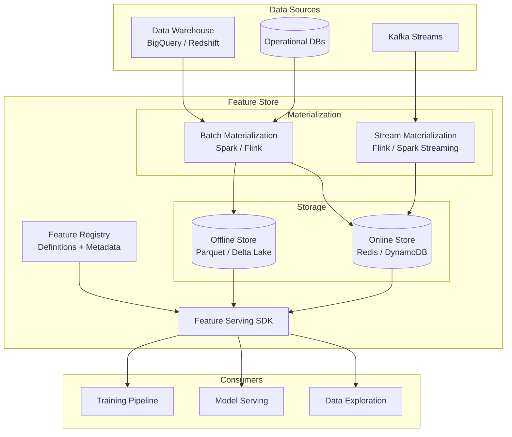
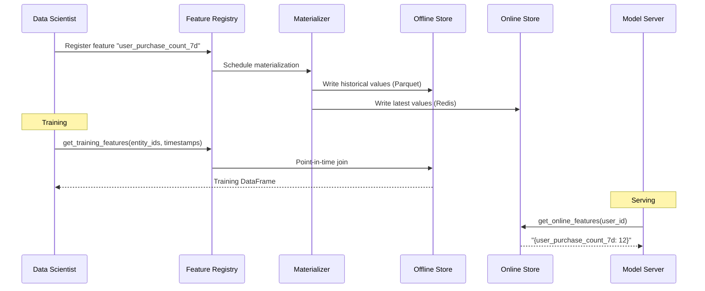
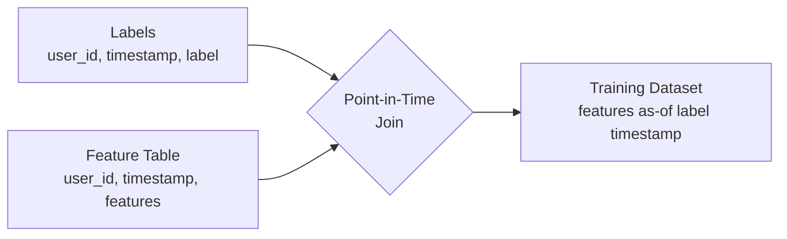

# Feature Store Design

Design a centralized feature management platform that ensures consistency between training and serving while enabling feature reuse across teams.

---

## Step 1: Requirements Clarification

### What Problem Does a Feature Store Solve?

In production ML systems, teams repeatedly encounter the same pain points:

| Problem | Without Feature Store | With Feature Store |
|---------|----------------------|-------------------|
| **Train-serve skew** | Different code computes features for training vs inference → silent accuracy loss | Single feature definition used everywhere |
| **Duplicate effort** | Every team re-implements "user_avg_order_value" | Central catalog → register once, reuse everywhere |
| **Point-in-time correctness** | Accidentally leaking future data into training (label leakage) | Automatic point-in-time joins |
| **Serving latency** | Compute features on-the-fly at inference → high latency | Pre-materialized online store (Redis/DynamoDB) |
| **Feature discovery** | "Does anyone have user churn features?" → Slack archaeology | Searchable registry with metadata |

### Functional Requirements

| Requirement | Description |
|-------------|-------------|
| **Feature registration** | Define features with schemas, owners, descriptions |
| **Offline store** | Historical features for training (columnar: Parquet, Delta Lake) |
| **Online store** | Low-latency feature retrieval for inference (key-value: Redis, DynamoDB) |
| **Materialization** | Scheduled pipelines that compute and write features to both stores |
| **Point-in-time joins** | Correctly join features as of a historical timestamp |
| **Feature versioning** | Track changes, deprecations, lineage |
| **Feature serving API** | Unified SDK for training and inference |

### Non-Functional Requirements

| Requirement | Target |
|-------------|--------|
| **Online read latency** | P99 < 10ms for 50 features |
| **Offline throughput** | Process 1B+ rows for training datasets |
| **Freshness** | Streaming features < 1 min; batch < 1 hour |
| **Availability** | 99.9% for online store |
| **Consistency** | Exact same feature values in training and serving |

---

## Step 2: Back-of-Envelope Estimation

### Scale Assumptions

```
ML teams:                    20
Total registered features:   5,000 across 200 feature groups
Entities tracked:            100M users, 10M items
Features per entity:         ~50 (avg)

Online store:
  Read QPS:                  50,000 (peak: 150K)
  Features per read:         30-50
  Single read payload:       ~2 KB
  Total online store size:   100M entities × 50 features × 8 bytes = ~40 GB

Offline store:
  Historical data:           2 years × 100M entities × 50 features
  Storage:                   ~100 TB (compressed Parquet)
  Training dataset generation: 10 per day, avg 1B rows each

Materialization:
  Batch jobs:                200 feature groups × 1/hour = 200 jobs/hour
  Streaming features:        50 groups via Kafka → online store
```

### Latency Budget

```
Feature serving (online):
  Network round-trip:        2ms
  Online store lookup:       3ms (Redis cluster)
  Serialization:             1ms
  Total:                     ~6ms per request (well within 10ms P99)
```

---

## Step 3: High-Level Architecture





---

## Step 4: Feature Definition & Registry

The feature registry is the metadata backbone. Every feature has a typed definition, owner, lineage, and SLA.

```python
from dataclasses import dataclass, field
from datetime import timedelta
from enum import Enum
from typing import Any


class ValueType(Enum):
    INT64 = "int64"
    FLOAT64 = "float64"
    STRING = "string"
    BOOL = "bool"
    BYTES = "bytes"
    INT64_LIST = "int64_list"
    FLOAT64_LIST = "float64_list"
    STRING_LIST = "string_list"
    EMBEDDING = "embedding"


class DataSourceType(Enum):
    BATCH = "batch"      # BigQuery, Hive, S3
    STREAM = "stream"    # Kafka, Kinesis


@dataclass
class Entity:
    """The primary key for feature lookups."""
    name: str
    value_type: ValueType
    description: str = ""

    def __post_init__(self):
        if not self.name.isidentifier():
            raise ValueError(f"Entity name must be a valid identifier: {self.name}")


@dataclass
class Feature:
    name: str
    value_type: ValueType
    description: str = ""
    default_value: Any = None
    tags: dict[str, str] = field(default_factory=dict)


@dataclass
class FeatureView:
    """A logical group of features computed from a single data source."""
    name: str
    entities: list[Entity]
    features: list[Feature]
    source: "DataSource"
    ttl: timedelta = timedelta(hours=1)
    owner: str = ""
    description: str = ""
    tags: dict[str, str] = field(default_factory=dict)
    online: bool = True
    offline: bool = True


@dataclass
class DataSource:
    name: str
    source_type: DataSourceType
    path: str  # table name, topic name, S3 path
    timestamp_field: str = "event_timestamp"
    created_timestamp_field: str = ""


# --- Example: E-commerce Feature Definitions ---

user_entity = Entity(
    name="user_id",
    value_type=ValueType.INT64,
    description="Unique user identifier",
)

item_entity = Entity(
    name="item_id",
    value_type=ValueType.INT64,
    description="Unique item/product identifier",
)

user_purchase_source = DataSource(
    name="user_purchases",
    source_type=DataSourceType.BATCH,
    path="analytics.user_purchase_aggregates",
    timestamp_field="computed_at",
)

user_activity_stream = DataSource(
    name="user_activity_stream",
    source_type=DataSourceType.STREAM,
    path="events.user_activity",
    timestamp_field="event_time",
)

user_features = FeatureView(
    name="user_purchase_features",
    entities=[user_entity],
    features=[
        Feature("purchase_count_7d", ValueType.INT64, "Purchases in last 7 days"),
        Feature("purchase_count_30d", ValueType.INT64, "Purchases in last 30 days"),
        Feature("avg_order_value_30d", ValueType.FLOAT64, "Avg order value (30d)"),
        Feature("total_spend_lifetime", ValueType.FLOAT64, "All-time spend"),
        Feature("favorite_category", ValueType.STRING, "Most purchased category"),
        Feature("days_since_last_purchase", ValueType.INT64, "Recency"),
    ],
    source=user_purchase_source,
    ttl=timedelta(hours=1),
    owner="ml-platform-team",
    description="User purchase behavior features for recommendation and churn models",
)

user_realtime_features = FeatureView(
    name="user_session_features",
    entities=[user_entity],
    features=[
        Feature("pages_viewed_session", ValueType.INT64, "Pages viewed in current session"),
        Feature("cart_value", ValueType.FLOAT64, "Current cart value"),
        Feature("time_on_site_seconds", ValueType.INT64, "Session duration"),
        Feature("last_search_query", ValueType.STRING, "Most recent search"),
    ],
    source=user_activity_stream,
    ttl=timedelta(minutes=5),
    owner="ml-platform-team",
    online=True,
    offline=False,  # streaming features not stored offline
)
```

---

## Step 5: Offline Store & Point-in-Time Joins

The offline store provides historical feature values for training. The critical challenge is **point-in-time correctness**: for each training example at time `t`, we must use feature values as they existed at time `t` — never future data.

### Point-in-Time Join



| Naive Join | Point-in-Time Join |
|-----------|-------------------|
| Join on user_id only | Join on user_id AND feature_timestamp ≤ label_timestamp |
| Uses latest feature values | Uses feature values as of label time |
| **Leaks future data** | **Correct — no leakage** |

### Implementation

```python
from datetime import datetime
from dataclasses import dataclass
import logging

logger = logging.getLogger(__name__)


@dataclass
class FeatureRequest:
    feature_view: str
    features: list[str]


class OfflineStore:
    """Offline feature store with point-in-time correct joins using Spark."""

    def __init__(self, spark_session, warehouse_path: str):
        self.spark = spark_session
        self.warehouse_path = warehouse_path

    def get_historical_features(
        self,
        entity_df,  # DataFrame with entity_id + event_timestamp columns
        feature_requests: list[FeatureRequest],
    ):
        """Point-in-time join: for each entity at each timestamp, retrieve
        feature values as they existed at that time."""
        result = entity_df

        for req in feature_requests:
            feature_table = self._load_feature_table(req.feature_view)
            result = self._point_in_time_join(
                result, feature_table, req.features
            )

        return result

    def _point_in_time_join(self, entity_df, feature_df, feature_columns):
        """
        For each row in entity_df (entity_id, event_timestamp), find the
        latest feature row where feature_timestamp <= event_timestamp.
        
        SQL equivalent:
            SELECT e.*, f.feature_1, f.feature_2
            FROM entity_df e
            LEFT JOIN (
                SELECT *, ROW_NUMBER() OVER (
                    PARTITION BY entity_id
                    ORDER BY feature_timestamp DESC
                ) as rn
                FROM feature_df
                WHERE feature_timestamp <= e.event_timestamp
            ) f ON e.entity_id = f.entity_id AND f.rn = 1
        """
        from pyspark.sql import functions as F
        from pyspark.sql.window import Window

        joined = entity_df.join(
            feature_df,
            on="entity_id",
            how="left",
        ).filter(
            F.col("feature_timestamp") <= F.col("event_timestamp")
        )

        window = Window.partitionBy("entity_id", "event_timestamp").orderBy(
            F.col("feature_timestamp").desc()
        )

        ranked = joined.withColumn("_rank", F.row_number().over(window))
        result = ranked.filter(F.col("_rank") == 1).drop("_rank", "feature_timestamp")

        select_cols = entity_df.columns + feature_columns
        return result.select(*select_cols)

    def _load_feature_table(self, feature_view: str):
        path = f"{self.warehouse_path}/{feature_view}"
        return self.spark.read.parquet(path)

    def materialize_offline(
        self,
        feature_view: str,
        source_query: str,
        partition_col: str = "ds",
    ):
        """Compute features from source and write to offline store."""
        df = self.spark.sql(source_query)

        output_path = f"{self.warehouse_path}/{feature_view}"
        df.write.partitionBy(partition_col).mode("overwrite").parquet(output_path)

        row_count = df.count()
        logger.info(
            "Materialized %s: %d rows to %s", feature_view, row_count, output_path
        )
        return row_count
```

---

## Step 6: Online Store & Serving

The online store provides low-latency feature lookups at inference time. Redis is the most common choice for its sub-millisecond reads.

```python
import redis
import json
import time
import logging
from dataclasses import dataclass
from typing import Any

logger = logging.getLogger(__name__)


@dataclass
class OnlineStoreConfig:
    redis_url: str = "redis://localhost:6379"
    key_prefix: str = "fs"
    default_ttl_seconds: int = 86400
    max_batch_size: int = 100


class RedisOnlineStore:
    """Redis-backed online feature store with batch retrieval."""

    def __init__(self, config: OnlineStoreConfig):
        self.config = config
        self.redis = redis.Redis.from_url(
            config.redis_url, decode_responses=True
        )

    def _feature_key(self, feature_view: str, entity_id: str) -> str:
        return f"{self.config.key_prefix}:{feature_view}:{entity_id}"

    def get_online_features(
        self,
        feature_view: str,
        entity_ids: list[str],
        features: list[str],
    ) -> list[dict[str, Any]]:
        """Batch fetch features for multiple entities using Redis pipeline."""
        start = time.monotonic()
        pipe = self.redis.pipeline(transaction=False)

        for entity_id in entity_ids:
            key = self._feature_key(feature_view, entity_id)
            if features:
                pipe.hmget(key, *features)
            else:
                pipe.hgetall(key)

        raw_results = pipe.execute()
        elapsed_ms = (time.monotonic() - start) * 1000

        results = []
        for i, raw in enumerate(raw_results):
            if features:
                row = {}
                for j, feat in enumerate(features):
                    val = raw[j] if raw else None
                    row[feat] = self._deserialize(val) if val else None
                results.append(row)
            else:
                results.append(
                    {k: self._deserialize(v) for k, v in raw.items()} if raw else {}
                )

        logger.debug(
            "Online fetch: %d entities, %d features, %.1fms",
            len(entity_ids), len(features), elapsed_ms,
        )
        return results

    def write_features(
        self,
        feature_view: str,
        entity_id: str,
        features: dict[str, Any],
        ttl_seconds: int | None = None,
    ):
        key = self._feature_key(feature_view, entity_id)
        serialized = {k: self._serialize(v) for k, v in features.items()}
        pipe = self.redis.pipeline()
        pipe.hset(key, mapping=serialized)
        pipe.expire(key, ttl_seconds or self.config.default_ttl_seconds)
        pipe.execute()

    def write_batch(
        self,
        feature_view: str,
        records: list[tuple[str, dict[str, Any]]],
        ttl_seconds: int | None = None,
    ):
        """Bulk write features for many entities."""
        pipe = self.redis.pipeline(transaction=False)
        ttl = ttl_seconds or self.config.default_ttl_seconds

        for entity_id, features in records:
            key = self._feature_key(feature_view, entity_id)
            serialized = {k: self._serialize(v) for k, v in features.items()}
            pipe.hset(key, mapping=serialized)
            pipe.expire(key, ttl)

        pipe.execute()
        logger.info(
            "Batch write: %d records to %s", len(records), feature_view
        )

    @staticmethod
    def _serialize(value: Any) -> str:
        if isinstance(value, (list, dict)):
            return json.dumps(value)
        return str(value)

    @staticmethod
    def _deserialize(value: str) -> Any:
        try:
            return json.loads(value)
        except (json.JSONDecodeError, TypeError):
            try:
                return float(value)
            except ValueError:
                return value
```

---

## Step 7: Stream Materialization

For real-time features (e.g., "items viewed in last 5 minutes"), we need stream processing to continuously update the online store.

```python
import time
import logging
from dataclasses import dataclass, field
from typing import Any, Callable
from collections import defaultdict

logger = logging.getLogger(__name__)


@dataclass
class WindowConfig:
    window_size_seconds: int
    slide_size_seconds: int


@dataclass
class StreamFeatureConfig:
    feature_view: str
    entity_key: str
    aggregations: dict[str, str]  # feature_name → agg_type ("count", "sum", "avg", "max")
    window: WindowConfig
    source_topic: str


class StreamMaterializer:
    """Processes Kafka events to compute and write real-time features."""

    def __init__(self, kafka_consumer, online_store):
        self.consumer = kafka_consumer
        self.online_store = online_store
        self._windows: dict[str, list[dict]] = defaultdict(list)

    async def process_stream(self, config: StreamFeatureConfig):
        """Main loop: consume events, compute windowed aggregations, update online store."""
        logger.info(
            "Starting stream materialization for %s from %s",
            config.feature_view, config.source_topic,
        )

        async for event in self.consumer.subscribe(config.source_topic):
            entity_id = event[config.entity_key]
            timestamp = event.get("event_time", time.time())

            window_key = f"{config.feature_view}:{entity_id}"
            self._windows[window_key].append(
                {"timestamp": timestamp, "data": event}
            )

            self._evict_expired(window_key, config.window, timestamp)

            features = self._compute_aggregations(
                self._windows[window_key], config.aggregations, event
            )

            self.online_store.write_features(
                config.feature_view, entity_id, features, ttl_seconds=config.window.window_size_seconds * 2
            )

    def _evict_expired(self, window_key: str, window: WindowConfig, now: float):
        cutoff = now - window.window_size_seconds
        self._windows[window_key] = [
            e for e in self._windows[window_key] if e["timestamp"] >= cutoff
        ]

    @staticmethod
    def _compute_aggregations(
        window_events: list[dict],
        aggregations: dict[str, str],
        current_event: dict,
    ) -> dict[str, Any]:
        features = {}
        for feature_name, agg_type in aggregations.items():
            source_field = feature_name.rsplit("_", 1)[0]  # e.g., "page_views_count" → "page_views"
            values = [
                e["data"].get(source_field, 0)
                for e in window_events
                if e["data"].get(source_field) is not None
            ]

            if agg_type == "count":
                features[feature_name] = len(window_events)
            elif agg_type == "sum":
                features[feature_name] = sum(values)
            elif agg_type == "avg":
                features[feature_name] = sum(values) / max(len(values), 1)
            elif agg_type == "max":
                features[feature_name] = max(values) if values else 0
            elif agg_type == "min":
                features[feature_name] = min(values) if values else 0
            elif agg_type == "last":
                features[feature_name] = current_event.get(source_field)

        return features


# --- Example configuration ---

session_features_config = StreamFeatureConfig(
    feature_view="user_session_features",
    entity_key="user_id",
    aggregations={
        "page_views_count": "count",
        "cart_additions_sum": "sum",
        "click_count_count": "count",
        "session_revenue_sum": "sum",
        "max_product_price_max": "max",
    },
    window=WindowConfig(window_size_seconds=1800, slide_size_seconds=60),
    source_topic="events.user_activity",
)
```

---

## Step 8: Feature Versioning & Lineage

Features evolve over time. A robust feature store tracks every change and understands upstream dependencies.

```python
from dataclasses import dataclass, field
from datetime import datetime
from enum import Enum
from typing import Any


class ChangeType(Enum):
    CREATED = "created"
    SCHEMA_CHANGE = "schema_change"
    LOGIC_CHANGE = "logic_change"
    DEPRECATED = "deprecated"
    DELETED = "deleted"


@dataclass
class FeatureVersion:
    version: int
    change_type: ChangeType
    description: str
    schema: dict[str, str]  # feature_name → type
    transformation_hash: str  # hash of the computation logic
    created_at: datetime = field(default_factory=datetime.utcnow)
    created_by: str = ""


@dataclass
class FeatureLineage:
    feature_view: str
    upstream_sources: list[str]         # tables, topics, other feature views
    downstream_models: list[str]        # models consuming these features
    transformation_sql: str = ""
    transformation_code: str = ""


class FeatureVersionManager:
    """Tracks feature versions and detects breaking changes."""

    def __init__(self, metadata_store):
        self.store = metadata_store

    async def register_version(
        self,
        feature_view: str,
        schema: dict[str, str],
        transformation_hash: str,
        created_by: str,
    ) -> FeatureVersion:
        current = await self.store.get_latest_version(feature_view)

        if current is None:
            version = FeatureVersion(
                version=1,
                change_type=ChangeType.CREATED,
                description="Initial registration",
                schema=schema,
                transformation_hash=transformation_hash,
                created_by=created_by,
            )
        else:
            change_type = self._classify_change(current, schema, transformation_hash)
            breaking = change_type == ChangeType.SCHEMA_CHANGE

            if breaking:
                downstream = await self.store.get_downstream_models(feature_view)
                if downstream:
                    raise ValueError(
                        f"Breaking schema change affects models: {downstream}. "
                        f"Create a new feature view or coordinate migration."
                    )

            version = FeatureVersion(
                version=current.version + 1,
                change_type=change_type,
                description=f"Auto-detected {change_type.value}",
                schema=schema,
                transformation_hash=transformation_hash,
                created_by=created_by,
            )

        await self.store.save_version(feature_view, version)
        return version

    @staticmethod
    def _classify_change(
        current: FeatureVersion,
        new_schema: dict[str, str],
        new_hash: str,
    ) -> ChangeType:
        if current.schema != new_schema:
            return ChangeType.SCHEMA_CHANGE
        if current.transformation_hash != new_hash:
            return ChangeType.LOGIC_CHANGE
        return ChangeType.CREATED  # no actual change
```

---

## Step 9: Feature Store with Feast (Production Example)

[Feast](https://feast.dev/) is the most widely adopted open-source feature store. Here's a production-ready configuration:

```python
from datetime import timedelta
from feast import Entity, Feature, FeatureView, FileSource, Field
from feast.types import Float64, Int64, String


user = Entity(
    name="user_id",
    join_keys=["user_id"],
    description="Unique customer identifier",
)

user_purchase_source = FileSource(
    path="s3://feature-store/user_purchases/",
    timestamp_field="event_timestamp",
    created_timestamp_column="created_at",
)

user_purchase_features = FeatureView(
    name="user_purchase_features",
    entities=[user],
    ttl=timedelta(days=1),
    schema=[
        Field(name="purchase_count_7d", dtype=Int64),
        Field(name="purchase_count_30d", dtype=Int64),
        Field(name="avg_order_value", dtype=Float64),
        Field(name="total_spend", dtype=Float64),
        Field(name="favorite_category", dtype=String),
        Field(name="days_since_last_purchase", dtype=Int64),
    ],
    online=True,
    source=user_purchase_source,
    tags={"team": "ml-platform", "domain": "ecommerce"},
)
```

```python
from feast import FeatureStore
import pandas as pd


class FeastFeatureService:
    """Wrapper around Feast for training and serving."""

    def __init__(self, repo_path: str = "."):
        self.store = FeatureStore(repo_path=repo_path)

    def get_training_features(
        self,
        entity_df: pd.DataFrame,
        feature_refs: list[str],
    ) -> pd.DataFrame:
        """Retrieve historical features with point-in-time correctness.
        
        entity_df must contain:
          - entity columns (e.g., "user_id")
          - "event_timestamp" column
        """
        training_df = self.store.get_historical_features(
            entity_df=entity_df,
            features=feature_refs,
        ).to_df()

        return training_df

    def get_online_features(
        self,
        entity_rows: list[dict],
        feature_refs: list[str],
    ) -> dict[str, list]:
        """Retrieve latest features for online serving."""
        response = self.store.get_online_features(
            entity_rows=entity_rows,
            features=feature_refs,
        )
        return response.to_dict()

    def materialize(self, start_date, end_date):
        """Materialize features from offline to online store."""
        self.store.materialize(start_date=start_date, end_date=end_date)


# --- Usage example ---
#
# service = FeastFeatureService("./feature_repo")
#
# # Training
# entity_df = pd.DataFrame({
#     "user_id": [1, 2, 3],
#     "event_timestamp": pd.to_datetime(["2024-01-15", "2024-01-15", "2024-01-15"]),
# })
# training_data = service.get_training_features(
#     entity_df,
#     ["user_purchase_features:purchase_count_7d",
#      "user_purchase_features:avg_order_value"],
# )
#
# # Serving
# online_features = service.get_online_features(
#     [{"user_id": 123}],
#     ["user_purchase_features:purchase_count_7d",
#      "user_purchase_features:avg_order_value"],
# )
```

---

## Step 10: Feature Store Comparison

| Feature | Feast | Tecton | Databricks Feature Store | Vertex AI Feature Store |
|---------|-------|--------|--------------------------|------------------------|
| **Open source** | Yes | No (SaaS) | No | No |
| **Offline store** | Parquet, BigQuery, Redshift | Delta Lake, Snowflake | Delta Lake | BigQuery |
| **Online store** | Redis, DynamoDB, SQLite | DynamoDB, Redis | Cosmos DB | Bigtable |
| **Streaming** | Contrib (Spark, Flink) | Native (Rift) | Structured Streaming | Dataflow |
| **Point-in-time** | Yes | Yes | Yes | Yes |
| **Monitoring** | Basic | Advanced (drift, freshness) | Unity Catalog | Built-in |
| **Best for** | Teams wanting control | Enterprise with strict SLAs | Databricks shops | GCP-native |

---

## Step 11: Scaling Strategies

### Online Store Scaling

| Challenge | Solution |
|-----------|----------|
| **High read QPS** | Redis Cluster with read replicas |
| **Large feature sets** | Partition by entity type across clusters |
| **Hot entities** | Local cache (LRU) in serving pods |
| **Cross-region** | Redis with active-active replication |

### Offline Store Scaling

| Challenge | Solution |
|-----------|----------|
| **Large training sets** | Partitioned Parquet on S3/GCS; Spark parallel reads |
| **Point-in-time joins** | Pre-sort by entity + timestamp; bucketed joins |
| **Many feature views** | Parallel materialization with Airflow DAGs |
| **Schema evolution** | Delta Lake / Iceberg for schema-on-read |

```python
from dataclasses import dataclass


@dataclass
class FeatureStoreSLA:
    online_read_p99_ms: float = 10.0
    offline_materialization_max_hours: float = 1.0
    feature_freshness_max_minutes: float = 60.0
    availability_target: float = 0.999
    max_train_serve_skew_pct: float = 0.01


class FeatureStoreHealthChecker:
    """Validates feature store meets SLAs."""

    def __init__(self, sla: FeatureStoreSLA, metrics_client):
        self.sla = sla
        self.metrics = metrics_client

    async def check_health(self) -> dict[str, bool]:
        online_p99 = await self.metrics.get("online_read_latency_p99_ms")
        freshness = await self.metrics.get("feature_freshness_minutes")
        availability = await self.metrics.get("online_store_availability")
        skew = await self.metrics.get("train_serve_skew_pct")

        return {
            "online_latency_ok": online_p99 <= self.sla.online_read_p99_ms,
            "freshness_ok": freshness <= self.sla.feature_freshness_max_minutes,
            "availability_ok": availability >= self.sla.availability_target,
            "skew_ok": skew <= self.sla.max_train_serve_skew_pct,
        }
```

---

## Step 12: Interview Checklist

### What Interviewers Look For

| Area | Key Questions |
|------|--------------|
| **Motivation** | Why not just compute features in the model server? |
| **Train-serve skew** | How do you guarantee same values in training and serving? |
| **Point-in-time** | How do you prevent label leakage in training data? |
| **Online vs offline** | Which store for which use case? Trade-offs? |
| **Freshness** | How fresh are real-time features? What's the lag? |
| **Versioning** | How do you handle feature schema changes? |
| **Scale** | How to handle 100K QPS reads? 100M entities? |
| **Monitoring** | How to detect stale features or train-serve skew? |

### Common Pitfalls

!!! warning
    1. **Ignoring train-serve skew** — this is the #1 reason feature stores exist; don't skip it
    2. **No point-in-time correctness** — leads to inflated offline metrics that don't reproduce in production
    3. **Over-engineering** — not every team needs a full feature store; start with a shared feature table
    4. **Ignoring feature freshness** — a 1-hour-old "cart_value" is useless for real-time personalization
    5. **No monitoring** — stale features silently degrade model performance

### Sample Interview Dialogue

> **Interviewer:** Design a feature store for a recommendation system serving 50K QPS.
>
> **Candidate:** I'd design a dual-store architecture. The offline store uses partitioned Parquet on S3, read by Spark for training — this handles the 100M+ user feature history. The online store uses a Redis Cluster sized for 50K QPS: with 30 features per read at ~2KB each, that's 100MB/s throughput — well within a 3-node Redis cluster.
>
> The critical design point is train-serve consistency. I'd use Feast-style feature views where a single Python definition generates both the batch SQL for the offline store and the key schema for Redis. Materialization runs hourly via Airflow; streaming features (session-level) flow through Flink into Redis with sub-minute freshness.
>
> For point-in-time correctness, training datasets are built with an AS-OF join: for each label timestamp, I fetch the latest feature values where `feature_timestamp <= label_timestamp`. This prevents leaking future data.
>
> To monitor, I'd compute a daily train-serve skew report: sample production feature reads, compare distributions against the offline store values for the same entities using KS tests. Alert if any feature drifts beyond threshold.
