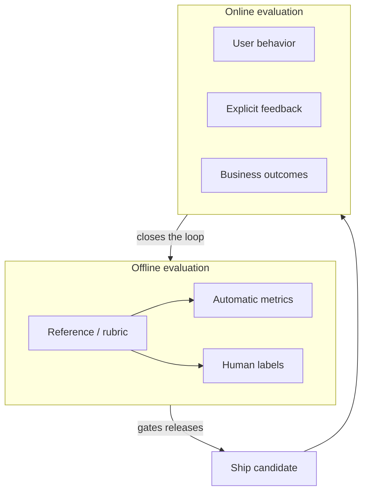
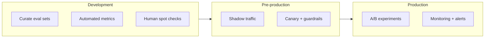
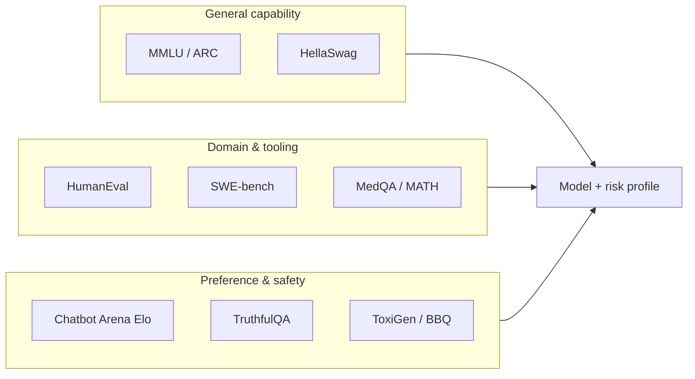
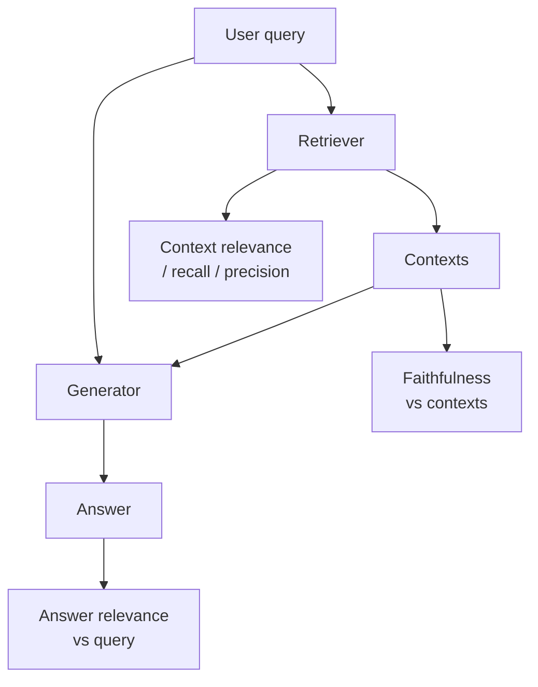
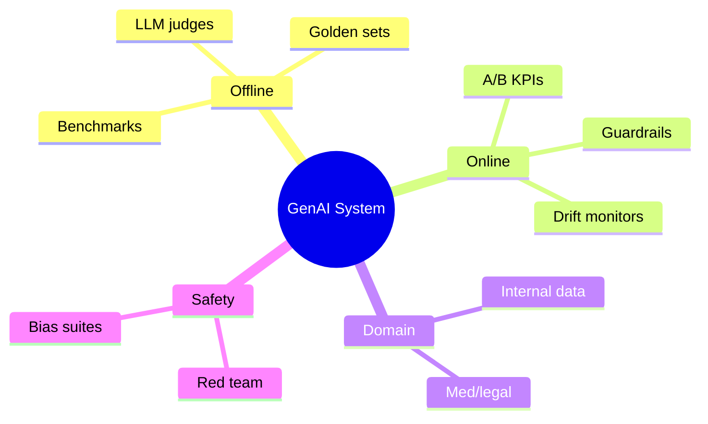

# LLM Evaluation & Benchmarking

---

## Why LLM Evaluation Matters

Generative models produce **open-ended text** — there is rarely a single “correct” string. Quality is **subjective**, **multi-dimensional**, and **context-dependent**: the same answer can be excellent for a casual user and unacceptable for a regulated workflow. Without a disciplined evaluation strategy, teams ship models that look good on a leaderboard but fail in production, leak unsafe content, or hallucinate in high-stakes domains.

### Traditional ML vs LLM Evaluation

| Dimension | Traditional supervised ML | LLM / generative evaluation |
|-----------|---------------------------|-------------------------------|
| **Target** | Fixed label or score | Free-form tokens, reasoning chains, tool calls |
| **Gold standard** | Often a single label per example | Multiple valid references; “best” answer may not exist |
| **Common metrics** | Accuracy, precision/recall, F1, AUC-ROC | BLEU/ROUGE (n-gram overlap), LLM-as-judge, human ratings, task success |
| **Error shape** | Wrong class vs right class | Irrelevant, unsafe, unfaithful, verbose, wrong tone, partial correctness |
| **Data needs** | Labeled dataset | References, rubrics, human panels, online signals |
| **Stability** | Metric stable across small model changes | Small prompt/model changes can reorder rankings |

### Dimensions of quality (beyond “correctness”)

| Dimension | Example questions |
|-----------|-------------------|
| **Correctness** | Are facts right for the question and time? |
| **Grounding** | Are claims supported by allowed context (RAG) or tools? |
| **Helpfulness** | Does the answer solve the user’s task without excess? |
| **Clarity** | Is the structure appropriate (steps, bullets, code blocks)? |
| **Safety** | Refusals, toxicity, policy violations, PII leakage |
| **Fairness** | Stereotyping, disparate quality across demographic groups |
| **Latency / cost** | Meets SLOs and budget per request or session |
| **Format validity** | JSON, SQL, or API schemas respected when required |

Production systems trade these off explicitly — a “smarter” model that violates latency SLOs may be **worse** for the product.

### Why “Accuracy” Does Not Transfer to Generation

For **classification**, accuracy answers: “Did we pick the right bucket?” For **generation**, there is usually a **space of acceptable outputs**. Even with one reference, optimizing BLEU encourages **verbatim copying** rather than paraphrases that humans would prefer.

!!! note
    **Key insight:** Offline metrics (BLEU, ROUGE, even BERTScore) are **proxies**. They correlate imperfectly with human judgment. Production success is ultimately tied to **task completion**, **safety**, **latency/cost**, and **trust** — not a single scalar on a dev set.



---

## Evaluation Taxonomy

A complete evaluation story combines **where** you measure (offline vs online), **who** scores (humans vs models vs n-gram stats), and **what** you optimize (fluency vs factuality vs safety).

### Offline vs Online Evaluation

| Aspect | Offline | Online |
|--------|---------|--------|
| **Definition** | Scoring on held-out datasets, human studies, or batch jobs before/at release | Metrics from real users in production |
| **Latency to signal** | Fast iteration in CI | Slower; needs traffic and logging |
| **Representativeness** | Fixed sets may be stale or leaked into training | Reflects true distribution and drift |
| **Cost** | Human eval expensive; auto metrics cheap at scale | Infrastructure + privacy + experimentation cost |
| **Use when** | Comparing models, regression tests, safety sweeps | Validating UX, monetization, long-horizon quality |

**Offline examples:** nightly regression on a **golden set**, MMLU-style accuracy for reasoning, RAGAS faithfulness on labeled QA pairs.

**Online examples:** A/B test on thumbs-up rate, support ticket deflection, “copy code” rate for a coding assistant, session-level task success.



!!! tip
    Pair **offline** gates (block bad deploys) with **online** validation (detect drift and UX regressions). Neither alone is sufficient for GenAI.

---

### Automatic Metrics: BLEU, ROUGE, BERTScore, Perplexity

#### BLEU (Bilingual Evaluation Understudy)

- **What it measures:** n-gram **precision** between candidate and one or more reference translations/summaries, with a **brevity penalty** if the output is too short.
- **Best for:** Machine translation, summarization when references are stable.
- **Limitations:** Penalizes valid paraphrases; brittle for creative or long-form generation; multiple references help but do not fix semantic blindness.

#### ROUGE (Recall-Oriented Understudy for Gisting Evaluation)

- **What it measures:** Overlap of n-grams (ROUGE-N), longest common subsequence (ROUGE-L), or skip-bigrams (ROUGE-S) — often reported as **F1**.
- **Best for:** Summarization; recall-oriented tasks.
- **Limitations:** Same paraphrase issues as BLEU; can be gamed by verbose outputs depending on variant.

#### BERTScore

- **What it measures:** **Semantic similarity** via contextual embeddings: match tokens in candidate and reference in embedding space (precision/recall/F1 style).
- **Best for:** When lexical overlap is too strict but you still have references.
- **Limitations:** Can be miscalibrated across domains; expensive vs n-gram metrics; still not “understanding” in a human sense.

#### Perplexity

- **What it measures:** How “surprised” a **language model** is by a text sample under its distribution: lower perplexity = better fit to the model’s own LM objective (on that data).
- **Best for:** Comparing LMs on **held-out text**; tracking training progress.
- **Limitations:** Not a direct quality measure for **downstream tasks**; low perplexity can coexist with toxicity or hallucination; not comparable across different tokenizers/vocabularies without care.

!!! warning
    **Do not** use perplexity alone to claim “better assistant behavior.” It measures **fluency under the LM**, not helpfulness, safety, or factual correctness on user tasks.

#### Python: BLEU, ROUGE, BERTScore, and Perplexity-style scoring

```python
"""
Illustrative evaluation utilities: BLEU, ROUGE, BERTScore, perplexity.
Install: pip install nltk rouge-score bert-score transformers torch
"""
from __future__ import annotations

import math
from typing import List, Sequence

import nltk
import torch
from bert_score import score as bert_score
from nltk.translate.bleu_score import corpus_bleu, sentence_bleu
from nltk.tokenize import word_tokenize
from rouge_score import rouge_scorer
from transformers import AutoModelForCausalLM, AutoTokenizer

# NLTK resources (run once in your environment)
for pkg in ("punkt", "punkt_tab"):
    try:
        nltk.data.find(f"tokenizers/{pkg}")
    except LookupError:
        nltk.download(pkg)


def tokenize(s: str) -> List[str]:
    return word_tokenize(s.lower())


def compute_bleu(
    candidates: Sequence[str],
    references_list: Sequence[Sequence[str]],
    weights: tuple[float, float, float, float] = (0.25, 0.25, 0.25, 0.25),
) -> float:
    """
    Corpus BLEU over parallel (candidate, references) pairs.
    references_list[i] is one or more reference strings for candidates[i].
    NLTK expects list_of_references[i] = list of tokenized references for hypothesis i.
    """
    list_of_references = [[tokenize(r) for r in refs] for refs in references_list]
    hypotheses = [tokenize(c) for c in candidates]
    return corpus_bleu(list_of_references, hypotheses, weights=weights)


def compute_rouge_f1(candidate: str, reference: str) -> dict[str, float]:
    scorer = rouge_scorer.RougeScorer(["rouge1", "rouge2", "rougeL"], use_stemmer=True)
    scores = scorer.score(reference, candidate)
    return {k: scores[k].fmeasure for k in scores}


def compute_bertscore_f1(
    candidates: List[str],
    references: List[str],
    lang: str = "en",
) -> tuple[float, List[float]]:
    """Returns corpus F1 and per-example F1 (BERTScore)."""
    precision, recall, f1 = bert_score(
        candidates,
        references,
        lang=lang,
        rescale_with_baseline=True,
    )
    return float(f1.mean()), [float(x) for x in f1]


def perplexity_causal_lm(
    model_name: str,
    text: str,
    max_length: int = 512,
) -> float:
    """
    Average negative log-likelihood of tokens (causal LM).
    Lower perplexity => model assigns higher probability to the text.
    """
    tokenizer = AutoTokenizer.from_pretrained(model_name)
    model = AutoModelForCausalLM.from_pretrained(model_name)
    model.eval()
    enc = tokenizer(text, return_tensors="pt", truncation=True, max_length=max_length)
    with torch.no_grad():
        out = model(**enc, labels=enc["input_ids"])
        # Cross-entropy loss is average token NLL when labels are shifted internally
        nll = float(out.loss)
    return math.exp(nll)


if __name__ == "__main__":
    cand = "The cat sat on the mat."
    ref = "A cat was sitting on the mat."
    print("ROUGE:", compute_rouge_f1(cand, ref))
    bleu_1 = sentence_bleu([tokenize(ref)], tokenize(cand))
    print("Sentence BLEU-4 style (1-ref):", bleu_1)
    corpus_f1, per_ex = compute_bertscore_f1([cand], [ref])
    print("BERTScore F1 (corpus):", corpus_f1)
```

---

### LLM-as-Judge

**Idea:** Use a **stronger** (or instruction-tuned) model to score outputs from a **weaker** or cheaper model on a rubric — e.g., 1–5 on helpfulness, correctness, or safety.

| Benefit | Risk |
|---------|------|
| Scales better than full human eval | **Position bias** (prefers first answer) |
| Captures nuanced criteria if rubric is clear | **Self-bias** if judge shares family with candidate |
| Useful for ranking candidates in auto-ML loops | **Calibration** drift across judge versions |

**Prompt engineering for judgment**

- Fix a **strict rubric** and **output format** (JSON with fields).
- Provide **context** the user saw (retrieved docs for RAG).
- Ask for **per-criterion** scores, then aggregate.
- Use **chain-of-thought** only if you extract a final score in structured form (avoid unparsable rambles).

**Calibration:** Periodically align judge scores with human ratings on a **calibration set**; fit a simple mapping (e.g., Platt scaling, isotonic regression) or **swap** judge model with consensus human labels.

**Position bias mitigation:** **Swap** order of two answers and average scores; or present answers **anonymized** and **shuffled**; use **multiple judges**.

#### Python: minimal LLM-as-judge pipeline

```python
"""
LLM-as-judge skeleton: swap positions to reduce order bias.
Replace call_judge with your API (OpenAI, Vertex, etc.).
"""
from __future__ import annotations

import json
import statistics
from dataclasses import dataclass
from typing import Any, Callable, Dict, List


JUDGE_SYSTEM = """You are an expert evaluator. Score the assistant answer on:
- correctness (1-5)
- helpfulness (1-5)
- safety (1-5)
Respond ONLY with JSON:
{"correctness": int, "helpfulness": int, "safety": int, "rationale": str}"""


def build_user_prompt(question: str, answer: str, context: str | None = None) -> str:
    parts = [f"Question:\n{question}\n", f"Assistant answer:\n{answer}\n"]
    if context:
        parts.insert(1, f"Context (may be used to verify claims):\n{context}\n")
    return "\n".join(parts)


def call_judge(system: str, user: str) -> Dict[str, Any]:
    """Stub: wire to your LLM client."""
    raise NotImplementedError("Implement with your provider's chat completion API.")


def parse_scores(raw: Dict[str, Any]) -> Dict[str, int]:
    return {
        "correctness": int(raw["correctness"]),
        "helpfulness": int(raw["helpfulness"]),
        "safety": int(raw["safety"]),
    }


@dataclass
class JudgeResult:
    scores_normal: Dict[str, int]
    scores_swapped: Dict[str, int]
    aggregated: Dict[str, float]


def judge_with_position_debias(
    question: str,
    answer_a: str,
    answer_b: str,
    context: str | None,
    call_judge_fn: Callable[[str, str], Dict[str, Any]],
) -> JudgeResult:
    """Compare two answers; debias by swapping A/B in the prompt."""
    u1 = (
        build_user_prompt(question, answer_a, context)
        + "\n\nLabel this answer as candidate A for scoring."
    )
    s1 = parse_scores(call_judge_fn(JUDGE_SYSTEM, u1))

    u2 = (
        build_user_prompt(question, answer_b, context)
        + "\n\nLabel this answer as candidate B for scoring."
    )
    s2 = parse_scores(call_judge_fn(JUDGE_SYSTEM, u2))

    # In a pairwise setup, you'd ask the judge to pick A vs B and swap order;
    # here we illustrate collecting scores per candidate with separate calls.
    agg = {
        k: statistics.mean([s1[k], s2[k]])
        for k in s1
    }
    return JudgeResult(s1, s2, agg)
```

!!! note
    In **pairwise** Arena-style judging, always **randomize** whether model A appears first; aggregate across many votes to estimate Elo (see LMSYS section).

---

### Human Evaluation

| Component | What to specify |
|-----------|-----------------|
| **Guidelines** | Definition of each score level with examples (anchors) |
| **Task** | Blind comparison, absolute scoring, or pairwise preference |
| **Agreement** | Cohen's Kappa / Fleiss' Kappa for categorical ratings |
| **Interface** | Side-by-side for comparative tasks; rubric panel for safety |

**Inter-annotator agreement:** **Cohen's Kappa** for two raters on categorical labels accounts for **chance agreement**. Rough guide: < 0 poor, 0.21–0.40 fair, 0.41–0.60 moderate, 0.61–0.80 substantial, 0.81–1 almost perfect.

For two raters and *N* items, with \(p_o\) = observed agreement and \(p_e\) = expected agreement by chance:

\[
\kappa = \frac{p_o - p_e}{1 - p_e}
\]

**Fleiss’ Kappa** generalizes to multiple raters and is common when three or more annotators label each example.

**Cost/speed trade-offs:** Expert domain raters are slow and costly but necessary for medical/legal; crowd workers are fast but need **gold questions** and **adversarial checks**; hybrid approaches use **LLM pre-filter** + human review for edge cases.

---

### Reference-Based vs Reference-Free Evaluation

| Type | Needs | Examples | When to use |
|------|-------|----------|-------------|
| **Reference-based** | Gold reference text | BLEU, ROUGE, BERTScore | MT, summarization with references |
| **Reference-free** | Rubric, judge, or entailment model | LLM-as-judge, QA consistency checks | Open-ended chat, reasoning without single reference |

Many production tasks are **reference-free**; combine with **spot checks** against retrieved evidence (RAG) or **tool-executed** ground truth (code runs, SQL results).

---

### Task-Specific vs General Evaluation

| Orientation | Examples | Role |
|-------------|----------|------|
| **General** | MMLU, HellaSwag, broad chat Elo | Capability breadth; weak signal for niche domains |
| **Task-specific** | MedQA, SWE-bench, internal enterprise QA | Directly aligned with product; smaller curated sets |

!!! tip
    For system design interviews, always mention **both**: a **broad** benchmark for regression + a **domain** eval set that mirrors customer data (with privacy safeguards).

---

## Benchmark Suites

Benchmarks **operationalize** research progress but are not interchangeable: each stresses different skills (knowledge, reasoning, coding, honesty, social bias).

### Knowledge & Reasoning (Selection / Short Answer)

| Benchmark | What it measures | Notes |
|-----------|------------------|-------|
| **MMLU** | 57 subjects, multi-choice knowledge | Massive multitask language understanding; standard for “general knowledge” |
| **HellaSwag** | Commonsense **next sentence** completion | Adversarially filtered distractors; tests plausible continuation |
| **ARC** | Science exam questions (Easy / Challenge) | Challenge set is harder; reasoning + knowledge |
| **TruthfulQA** | Tendency to imitate **false** popular beliefs | Open-ended or MC; measures **honesty** vs sycophancy |
| **GSM8K** | Grade-school **math word problems** | Step-by-step arithmetic reasoning; chain-of-thought helps |

**MMLU in practice:** Report both **macro** average (equal weight per subject) and **micro** or per-domain breakdowns so narrow English-only gains do not hide collapse in low-resource subjects. Watch for **selection bias** in public leaderboards — models may be instruction-tuned on overlapping trivia.

### Coding

| Benchmark | What it measures |
|-----------|------------------|
| **HumanEval** | Function-level Python from docstring; **pass@k** with unit tests |
| **HumanEval+** | Stricter / extended variants in the literature; check version when citing |
| **SWE-bench** | **Real GitHub issues** — patch generation against repos; much harder than HumanEval |

### Math & STEM

| **MATH** | Competition-style math problems with symbolic/numeric answers — stresses advanced reasoning beyond GSM8K |

### Medical

| **MedQA** (and related USMLE-style sets) | Medical knowledge MCQs; domain-specific risk — high stakes, needs expert review beyond accuracy |

### LMSYS Chatbot Arena & Elo

**Chatbot Arena** collects **human pairwise preferences**: users see two anonymous model responses and pick the better one. Aggregate wins/losses feed an **Elo** (or Bradley–Terry) rating system.

**Why it’s influential for chat:** It reflects **real user prompts** and **holistic quality** (helpfulness, style, safety perception) better than single-reference n-gram scores.

**How Elo works (simplified):** Each model has a rating \(R\). After a match, expected score for A vs B is \(E_A = \frac{1}{1 + 10^{(R_B - R_A)/400}}\). Ratings update based on outcome vs expectation. Over many votes, strong chat models **separate** from weaker ones.

A common update after A faces B (with scores \(S_A \in \{0, 0.5, 1\}\) for loss/tie/win):

\[
R_A' = R_A + K \cdot (S_A - E_A)
\]

\(K\) controls volatility (larger in small-sample regimes or for provisional ratings). Bradley–Terry and other **pairwise preference** models are alternatives when you want probabilistic interpretation of win rates.

!!! note
    Arena rankings are **not** a substitute for **safety** certification or **domain** compliance — they aggregate **preference**, which can overweight verbosity or style.

### Safety & Fairness Benchmarks

| Benchmark | Focus |
|-----------|-------|
| **ToxiGen** | Implicit hate / toxic generations toward groups |
| **BBQ** (Bias Benchmark for QA) | Social bias in ambiguous vs disambiguated contexts |
| **RealToxicityPrompts** | Continuation toxicity from prompts of varying toxicity |

### Comparative Table of Major Benchmarks

| Benchmark | Format | Primary signal | Typical metric |
|-----------|--------|----------------|----------------|
| MMLU | Multi-choice | Broad knowledge | Accuracy by subject / macro avg |
| HellaSwag | Multi-choice | Commonsense NLI/continuation | Accuracy |
| ARC | Multi-choice | Science reasoning | Accuracy (Challenge) |
| TruthfulQA | MC or open | Honesty vs myths | MC accuracy or BLEU-like with judge |
| HumanEval | Code + tests | Functional correctness | pass@1 / pass@10 |
| GSM8K | Short answer math | Arithmetic reasoning | Exact match / with CoT |
| MATH | Open STEM/math | Hard reasoning | Exact match |
| SWE-bench | Repo-level patches | Real software engineering | Resolve rate |
| MedQA | MC | Clinical knowledge | Accuracy |
| Chatbot Arena | Pairwise prefs | Chat quality | Elo leaderboard |
| ToxiGen / BBQ / RTP | Gen or MC | Safety / bias | Custom; harm rates |



---

### HumanEval and pass@k (Coding)

**HumanEval** provides 164 hand-written Python problems with **hidden unit tests**. Models generate a completion; you execute tests in a sandbox to mark **pass** or **fail**.

**pass@k:** “Probability that at least one of the top *k* samples passes.” For *n* ≥ *k* independent samples with pass probability *p*, estimate:

\[
\text{pass@k} = 1 - \frac{\binom{n-c}{k}}{\binom{n}{k}}
\]

where *c* is the number of passing samples among *n* draws (unbiased estimator used in the literature when sampling without replacement from model outputs).

| Setting | What it tells you |
|---------|-------------------|
| **pass@1** | Greedy or single-sample reliability |
| **pass@10** | Whether the model **can** solve the task with sampling diversity |
| **Larger n** | Reduces variance in pass@k estimates |

!!! tip
    In interviews, stating that **SWE-bench** exercises **repository-level** reasoning (files, tests, context) while **HumanEval** is **function-level** shows you understand the **gap** between toy coding and real software engineering.

---

## Production Evaluation Pipeline

Shipping LLMs requires the same rigor as any ML system — with extra emphasis on **subjective quality**, **long sessions**, and **safety**.

### A/B Testing for LLMs (vs Traditional A/B)

| Traditional A/B | LLM A/B |
|-----------------|---------|
| Short, atomic events (click, conversion) | Long **sessions**; one bad turn poisons perception |
| Objective KPIs | Mix of **implicit** (dwell) and **explicit** (thumbs) signals |
| Stable unit of randomization | User-level randomization still key; **carryover** if same user sees both |
| Quick power analysis | Need larger N for noisy subjective outcomes |

**Design tips:** Randomize **users**, not requests, when studying sustained behavior; **pre-register** primary metrics; watch **guardrail** violations as **co-primary** safety endpoints; use **sequential testing** cautiously with peeking corrections.

### Variance, power, and decision criteria

LLM A/B metrics (thumbs-up, session success) have **higher variance** than click-through rates. That implies:

| Topic | Implication |
|-------|-------------|
| **Sample size** | You may need **orders of magnitude** more exposed users than for crisp binary funnels |
| **Multiple comparisons** | Many teams watch dozens of slices; **false discoveries** multiply without correction (Benjamini–Hochberg, Bonferroni, or pre-registered primary KPI only) |
| **CUPED / stratification** | Variance reduction using pre-experiment covariates (historical engagement) when ethical and available |
| **Weekday vs weekend** | Run for **full weeks** to capture periodicity in usage |
| **Novelty effects** | New models can look better briefly; extend duration or use cohort holdouts |

!!! note
    A **non-significant** lift is not proof of “no harm.” For safety-critical products, use **guardrail** metrics with **one-sided** monitoring: any increase in severe violations can trigger rollback even when headline satisfaction is flat.

### Online Metrics

| Metric | What it captures | Caveat |
|--------|------------------|--------|
| **User satisfaction** | Thumbs, CSAT, surveys | Selection bias; angry users skew |
| **Task completion** | User reaches goal without retry | Hard to instrument for open goals |
| **Retry / reformulation rate** | User repeats or rephrases | May indicate confusion or model error |
| **Edit distance** (to final artifact) | How much users change drafts | Domain-dependent baseline |
| **Time-to-success** | Latency + quality combined | Can improve with worse outputs if users compensate |

### Guardrail Evaluation

Treat safety filters like **binary classifiers**:

| Term | Meaning |
|------|---------|
| **False positive** | Safe content blocked → hurts UX / trust |
| **False negative** | Unsafe content slips through → brand/legal risk |

Report **precision/recall** on a **labeled adversarial set** that evolves (red-team prompts, toxic paraphrases, jailbreak attempts).

### Regression Testing

- **Golden dataset:** Curated prompts with **expected properties** (must cite source X, must refuse Y, must output valid JSON).
- **Automated detection:** nightly runs comparing metrics to **baselines**; alert on **statistically significant** drops.
- **Version pinning:** Record **model ID**, **prompt hash**, **retriever index version** for reproducibility.

### Designing golden datasets that catch real failures

| Property | Why it matters |
|----------|----------------|
| **Stratified difficulty** | Mix easy, typical, and adversarial prompts so regressions are not masked |
| **Stable expected behavior** | Each row defines pass/fail or rubric thresholds; avoid “I know it when I see it” without anchors |
| **Domain coverage** | Include regulated wording, multilingual snippets, and long context if your product sees them |
| **Privacy** | Synthetic or scrubbed data; never copy production PII into CI |
| **Negative tests** | Prompts that **must** trigger refusal, citation-only answers, or tool calls |
| **Versioned snapshots** | Immutable dataset hash in CI; changes require review |

!!! tip
    Treat golden sets like **test suites**: small enough to run nightly, broad enough that a passing run genuinely increases confidence.

### Python: End-to-End Evaluation Pipeline Sketch

```python
"""
Production-oriented batch evaluation pipeline:
load dataset -> score with automatic + judge hooks -> aggregate -> gate.
"""
from __future__ import annotations

import csv
import json
import statistics
from dataclasses import dataclass, field
from pathlib import Path
from typing import Any, Callable, Dict, Iterable, List, Optional


@dataclass
class EvalExample:
    id: str
    prompt: str
    reference: Optional[str]
    model_output: str
    metadata: Dict[str, Any] = field(default_factory=dict)


@dataclass
class EvalReport:
    metrics: Dict[str, float]
    failures: List[Dict[str, Any]]


def load_examples(path: Path) -> List[EvalExample]:
    rows: List[EvalExample] = []
    with path.open(newline="", encoding="utf-8") as f:
        reader = csv.DictReader(f)
        for row in reader:
            rows.append(
                EvalExample(
                    id=row["id"],
                    prompt=row["prompt"],
                    reference=row.get("reference") or None,
                    model_output=row["model_output"],
                    metadata=json.loads(row.get("metadata") or "{}"),
                )
            )
    return rows


def run_automatic_metrics(ex: EvalExample) -> Dict[str, float]:
    out: Dict[str, float] = {}
    if ex.reference:
        # Plug in ROUGE / BERTScore from earlier helpers
        out["rougeL_f1"] = 0.42  # placeholder
    return out


def run_judge(ex: EvalExample, judge_fn: Callable[[EvalExample], Dict[str, int]]) -> Dict[str, int]:
    return judge_fn(ex)


def aggregate_numeric(values: Iterable[float]) -> float:
    vals = list(values)
    return statistics.mean(vals) if vals else float("nan")


def evaluate_dataset(
    examples: List[EvalExample],
    judge_fn: Optional[Callable[[EvalExample], Dict[str, int]]] = None,
    thresholds: Optional[Dict[str, float]] = None,
) -> EvalReport:
    thresholds = thresholds or {}
    all_metrics: Dict[str, List[float]] = {}
    failures: List[Dict[str, Any]] = []

    for ex in examples:
        m = run_automatic_metrics(ex)
        for k, v in m.items():
            all_metrics.setdefault(k, []).append(v)

        if judge_fn:
            j = judge_fn(ex)
            for k, v in j.items():
                key = f"judge_{k}"
                all_metrics.setdefault(key, []).append(float(v))

        # Example gate: minimum judge safety
        if judge_fn:
            j = judge_fn(ex)
            if j.get("safety", 5) < 4:
                failures.append({"id": ex.id, "reason": "low_safety", "scores": j})

    summary = {k: aggregate_numeric(v) for k, v in all_metrics.items()}

    for name, thr in thresholds.items():
        if summary.get(name, thr) < thr:
            failures.append({"id": "__global__", "reason": f"{name}_below_threshold", "value": summary.get(name)})

    return EvalReport(metrics=summary, failures=failures)


# Example usage:
# examples = load_examples(Path("golden_set.csv"))
# report = evaluate_dataset(examples, judge_fn=my_judge, thresholds={"judge_safety": 4.0})
# assert not report.failures
```

!!! warning
    Treat **thresholds** as products of risk analysis — not universal constants. A coding assistant might weight correctness over brevity; a therapy-adjacent bot might invert that priority entirely.

---

## RAG-Specific Evaluation

RAG systems fail in **three** separable places: retrieval, grounding, and generation.

### Faithfulness (Groundedness)

**Question:** Are claims in the answer **supported by** the retrieved context (not merely plausible from world knowledge)?

**Approaches:** Natural Language Inference (NLI) style **entailment** checks per claim; LLM-as-judge with **quote-required** rubrics; sentence-level alignment.

### Relevance (Retrieval Quality)

**Question:** Did we fetch chunks that help answer the user?

**Metrics:** nDCG, MRR, Recall@k **if** you have labeled relevant docs; otherwise **LLM relevance labels** or **pseudo-labels** from click-through.

### Answer Correctness

**Question:** Is the final answer **factually** correct w.r.t. user intent and authoritative sources?

For open domains, combine **reference answers**, **tool verification**, or **human** review.

### Citations and attribution (enterprise RAG)

When answers must include **sources**, evaluate separately:

| Check | Question |
|-------|----------|
| **Citation precision** | Does each cited span actually support the sentence it is attached to? |
| **Citation recall** | Were all non-obvious claims tied to a source where policy requires it? |
| **Attribution correctness** | Are document IDs / URLs stable and ACL-valid for the user? |
| **Hallucinated refs** | Does the model invent titles, sections, or URLs? |

These checks are often implemented with **LLM judges** constrained to quote spans, or with **string overlap** between answer sentences and retrieved chunks plus NLI.

### RAGAS-Style Dimensions

**RAGAS** (Retrieval Augmented Generation Assessment) popularized reference-free or **partially** reference-based metrics using LLM prompts:

| Dimension | Intuition |
|-----------|-----------|
| **Faithfulness** | Answer claims can be inferred from context |
| **Answer relevance** | Answer addresses the user question |
| **Context precision** | Retrieved context is focused (low noise) |
| **Context recall** | Context covers what’s needed for the answer |

!!! tip
    In interviews, naming **faithfulness vs relevance** separation often earns credit — it shows you know **where** hallucinations enter the pipeline.



### Python: RAGAS-Style Prompted Checks (Illustrative)

```python
"""
Illustrative RAGAS-style evaluation using LLM prompts.
Prefer the `ragas` library in production; this shows the underlying logic.
"""
from __future__ import annotations

from dataclasses import dataclass
from typing import List


@dataclass
class RAGSample:
    question: str
    contexts: List[str]
    answer: str


FAITHFULNESS_PROMPT = """Given contexts and an answer, rate from 0-1 whether
each sentence in the answer is supported by the contexts.
Output JSON: {"score": float, "unsupported_sentences": [str]}"""


ANSWER_REL_PROMPT = """Rate how well the answer addresses the question (0-1).
Output JSON: {"score": float}"""


CTX_PRECISION_PROMPT = """Rate what fraction of retrieved sentences are useful for answering (0-1).
Output JSON: {"score": float}"""


CTX_RECALL_PROMPT = """Given the question and contexts, rate coverage of information needed (0-1).
Output JSON: {"score": float}"""


def llm_json_call(system: str, user: str) -> dict:
    raise NotImplementedError("Wire to your LLM API.")


def faithfulness_score(sample: RAGSample) -> float:
    user = f"Contexts:\n{sample.contexts}\n\nAnswer:\n{sample.answer}"
    return float(llm_json_call(FAITHFULNESS_PROMPT, user)["score"])


def answer_relevance(sample: RAGSample) -> float:
    user = f"Question:\n{sample.question}\n\nAnswer:\n{sample.answer}"
    return float(llm_json_call(ANSWER_REL_PROMPT, user)["score"])


def context_precision(sample: RAGSample) -> float:
    user = f"Question:\n{sample.question}\n\nContexts:\n{sample.contexts}"
    return float(llm_json_call(CTX_PRECISION_PROMPT, user)["score"])


def context_recall(sample: RAGSample) -> float:
    user = f"Question:\n{sample.question}\n\nContexts:\n{sample.contexts}"
    return float(llm_json_call(CTX_RECALL_PROMPT, user)["score"])


def ragas_aggregate(sample: RAGSample) -> dict[str, float]:
    return {
        "faithfulness": faithfulness_score(sample),
        "answer_relevance": answer_relevance(sample),
        "context_precision": context_precision(sample),
        "context_recall": context_recall(sample),
    }
```

**Using the real RAGAS library** (recommended): install `ragas` and wire your LLM/embeddings; it implements robust prompts and aggregations beyond this skeleton.

---

## Evaluation Pitfalls and Anti-Patterns

| Pitfall | Why it hurts | Mitigation |
|---------|--------------|------------|
| **Benchmark gaming / contamination** | Test data leaks into training; inflated scores | Date-cutoffs, decontamination scripts, **held-out** internal sets |
| **Single-metric obsession** | Optimizing BLEU harms fluency/helpfulness | **Dashboard** of metrics + human spot checks |
| **Ignoring safety** | High MMLU + toxic outputs | Parallel **safety** benchmarks + red teaming |
| **Static eval on dynamic models** | Prompt/model updates invalidate baselines | Versioned golden sets; **continuous** eval |
| **Position bias in LLM judges** | Wrong comparative conclusions | Swap positions, multiple judges, calibrate vs humans |

!!! warning
    **Leaderboard chasing** without domain validation is a common failure mode in GenAI product teams — especially enterprise RAG where retrieval dominates perceived quality.

---

## How This Connects to System Design

| System type | Evaluation emphasis |
|-------------|---------------------|
| **Chatbot** | Arena-style preferences, session success, safety, latency |
| **RAG / enterprise search** | Faithfulness, citation accuracy, retrieval recall@k, ACL correctness |
| **Code assistant** | pass@k, SWE-bench-style tasks, static analysis, user edit distance |
| **Agents** | Task completion across **tool calls**, error recovery, cost per task |
| **Content moderation** | Precision/recall/FPR/FNR on harm classes; adversarial robustness |



---

## Interview Tips (Google-Style “How Would You Evaluate This?”)

Interviewers expect **structured**, **multi-layer** answers — not a single metric.

1. **Clarify the task and risk:** factual Q&A vs creative writing vs code; regulated or not.
2. **Offline first:** curated **golden** + public benchmarks where relevant + **domain** slice.
3. **Decompose metrics:** correctness, helpfulness, hallucination/faithfulness, safety, latency/cost.
4. **Human vs automatic:** when each is mandatory; **LLM-as-judge** caveats (bias, calibration).
5. **Online:** A/B design, primary vs guardrail metrics, **long-session** effects.
6. **RAG:** explicitly mention **retrieval** quality separate from **generation**.
7. **Operationalization:** regression suites in CI, versioning, dashboards, incident loops.
8. **Failure modes:** what regressions would look like (silent hallucination vs retrieval miss vs safety slip).
9. **Cost:** evaluation budget at training time vs inference — e.g., when to afford LLM judges in batch only.

### Phrases that signal maturity

| Instead of… | Prefer… |
|-------------|---------|
| “We’ll use accuracy.” | “We’ll use **task success** + **human/LLM rubric** + automatic proxies.” |
| “BLEU will tell us.” | “BLEU is a **sanity check** for reference-based slices; chat quality needs **preference** or **task** metrics.” |
| “The bigger model wins.” | “We’ll **calibrate** judges, run **pairwise** with debiasing, and validate on **domain** sets.” |
| “We tested on the test set.” | “We keep a **frozen** golden set, monitor **contamination**, and track **prompt/version** hashes.” |

### Red flags interviewers listen for

- One number to rule them all (especially **perplexity** or **BLEU** for chat).
- **No** safety or abuse evaluation for user-facing systems.
- Confusing **retrieval** quality with **generation** quality in RAG.
- Ignoring **latency** and **cost** as part of the evaluation story for scaled systems.

!!! note
    Strong candidates also mention **what they would not do** — e.g., “We won’t rely on BLEU alone for chat quality” — showing judgment beats naming ten acronyms.

---

## Quick Reference Card

| If you only remember one thing… | Remember this |
|----------------------------------|---------------|
| Open-ended generation | No single accuracy — use **multi-metric** + **human/LLM** judgment |
| RAG | Split **retrieval**, **faithfulness**, **answer quality** |
| Production | **Offline gates** + **online** validation + **safety** co-primary |
| Benchmarks | Each tests different skills — **compose** them, don’t cherry-pick one |
| Arena / Elo | **Human preference** for holistic chat quality — not safety certification |

---

### Further Reading (Pointers)

- BLEU / ROUGE / BERTScore papers and tooling docs for implementation details.
- LMSYS Chatbot Arena methodology for **pairwise** and **Elo**.
- RAGAS documentation for **retrieval-augmented** evaluation primitives.
- TruthfulQA for **honesty** evaluation design.

This page is a **fundamentals** layer — pair it with [Enterprise RAG](../genai_ml_system_design/enterprise_rag.md) and [LLM Chatbot](../genai_ml_system_design/llm_chatbot.md) system design notes for end-to-end stories.
