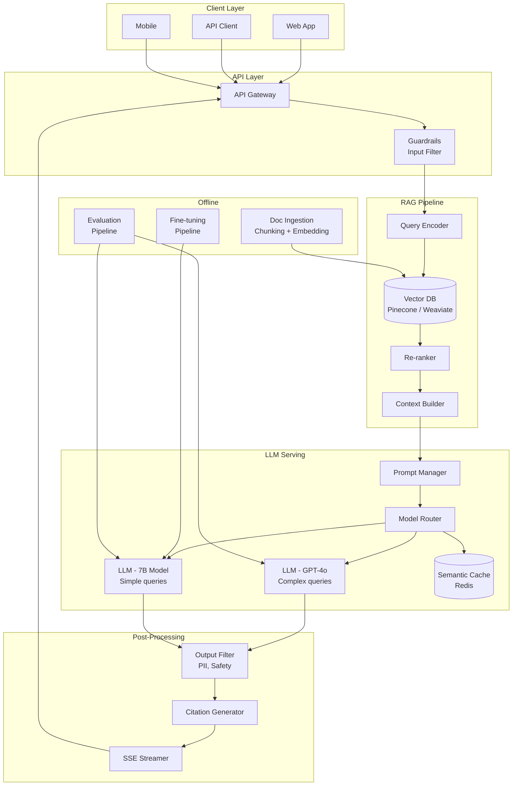
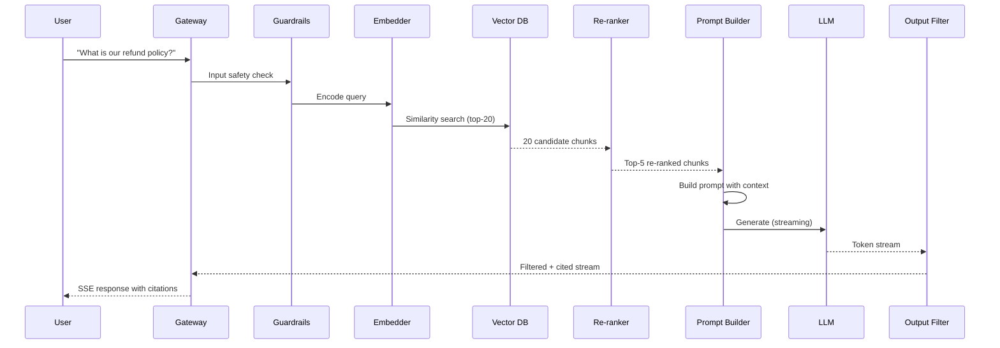
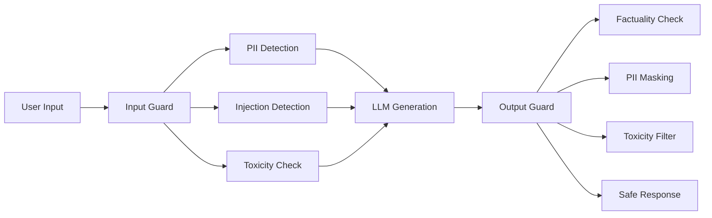

# Large Language Model Systems

Design production systems powered by LLMs — from prompt engineering and fine-tuning to RAG architectures, vector databases, and serving at scale.

---

## Step 1: Requirements Clarification

### LLM System Design Landscape

| System Type | Example | Key Challenge |
|-------------|---------|---------------|
| **Chatbot / Assistant** | Customer support, coding agent | Latency, context management, safety |
| **RAG Application** | Enterprise search, knowledge base Q&A | Retrieval quality, chunking, grounding |
| **Content Generation** | Marketing copy, code generation | Quality control, cost, rate limiting |
| **Classification / Extraction** | Sentiment, entity extraction, summarization | Accuracy, consistency, structured output |
| **Agent / Tool-use** | Autonomous task completion | Planning, tool orchestration, error recovery |

### Functional Requirements

| Requirement | Description |
|-------------|-------------|
| **Inference API** | Low-latency text generation via streaming responses |
| **RAG pipeline** | Retrieve relevant context from knowledge base before generation |
| **Prompt management** | Version, test, and deploy prompt templates |
| **Fine-tuning** | Adapt base models to domain-specific tasks |
| **Guardrails** | Content filtering, PII detection, hallucination mitigation |
| **Evaluation** | Automated quality assessment of LLM outputs |

### Non-Functional Requirements

| Requirement | Target |
|-------------|--------|
| **Latency** | Time-to-first-token < 500ms; streaming throughput > 30 tokens/s |
| **Throughput** | 1,000+ concurrent users |
| **Cost** | < $0.01 per query (for high-volume applications) |
| **Accuracy** | > 90% factual correctness (RAG-grounded) |
| **Safety** | Zero tolerance for PII leakage, harmful content |

---

## Step 2: Back-of-Envelope Estimation

### Traffic

```
Daily active users:         1M
Queries per user/day:       5
Total daily queries:        5M
QPS (average):              5M / 86,400 ≈ 58
QPS (peak, 5x):             ~290
Concurrent sessions:        ~1,000 (avg session = 5 min)
```

### Compute (GPU)

```
Avg tokens per response:    500
Generation speed (A100):    ~50 tokens/s per request
Time per request:           500 / 50 = 10 seconds
GPU seconds per day:        5M × 10 = 50M GPU-seconds ≈ 578 GPU-days

With batching (4 concurrent):
  Effective throughput:     ~12 req/s per A100
  GPUs needed (peak):      290 / 12 ≈ 25 A100 GPUs

KV cache memory per request:
  7B model, 2048 context:   ~1 GB
  70B model, 4096 context:  ~8 GB
```

### RAG Storage

```
Knowledge base documents:   10M
Avg document size:          2 KB
Chunks per document:        5 (avg)
Total chunks:               50M
Embedding dim:              1536 (OpenAI) or 768 (open-source)
Vector storage:             50M × 1536 × 4 bytes = ~300 GB
Metadata + text:            50M × 2 KB = ~100 GB
Total index size:           ~400 GB
```

### Cost

```
Self-hosted (25 × A100):    25 × $3/hr × 24 = $1,800/day
API-based (GPT-4):          5M × 1K tokens × $0.03/1K = $150K/day
API-based (GPT-4o-mini):    5M × 1K tokens × $0.00015/1K = $750/day
Self-hosted 7B model:       25 × $1.5/hr × 24 = $900/day
```

---

## Step 3: High-Level Architecture





---

## Step 4: Prompt Engineering

### Prompt Architecture

| Technique | When to Use | Example |
|-----------|-------------|---------|
| **Zero-shot** | Simple tasks, capable models | "Classify this email as spam or not" |
| **Few-shot** | Need consistent format | Provide 3 examples before the query |
| **Chain-of-thought** | Reasoning tasks | "Think step by step..." |
| **ReAct** | Tool-use agents | Thought → Action → Observation loop |
| **System prompt** | Persona, constraints, format | Role definition + rules |

```python
from dataclasses import dataclass, field
from typing import Any
from string import Template
import json
import hashlib


@dataclass
class PromptTemplate:
    name: str
    version: str
    system_prompt: str
    user_template: str
    output_schema: dict[str, Any] | None = None
    few_shot_examples: list[dict[str, str]] = field(default_factory=list)
    tags: dict[str, str] = field(default_factory=dict)

    @property
    def template_hash(self) -> str:
        payload = f"{self.system_prompt}{self.user_template}{json.dumps(self.few_shot_examples)}"
        return hashlib.sha256(payload.encode()).hexdigest()[:12]

    def render(self, **kwargs) -> list[dict[str, str]]:
        messages = [{"role": "system", "content": self.system_prompt}]

        for example in self.few_shot_examples:
            messages.append({"role": "user", "content": example["input"]})
            messages.append({"role": "assistant", "content": example["output"]})

        user_content = Template(self.user_template).safe_substitute(**kwargs)
        messages.append({"role": "user", "content": user_content})

        return messages


class PromptRegistry:
    """Version-controlled prompt management."""

    def __init__(self, store):
        self.store = store

    async def register(self, template: PromptTemplate) -> PromptTemplate:
        existing = await self.store.get(template.name, template.version)
        if existing and existing.template_hash == template.template_hash:
            return existing
        await self.store.save(template)
        return template

    async def get_production(self, name: str) -> PromptTemplate:
        return await self.store.get_production(name)

    async def promote(self, name: str, version: str):
        await self.store.set_production(name, version)


# --- Example prompts ---

rag_qa_prompt = PromptTemplate(
    name="rag_qa",
    version="v3",
    system_prompt=(
        "You are a helpful assistant that answers questions based on the provided context. "
        "Rules:\n"
        "1. Only answer based on the provided context. If the context doesn't contain "
        "the answer, say 'I don't have enough information to answer that.'\n"
        "2. Cite your sources using [1], [2], etc. corresponding to the context chunks.\n"
        "3. Be concise. Aim for 2-3 sentences unless the question requires more detail.\n"
        "4. Never make up information. Never hallucinate."
    ),
    user_template=(
        "Context:\n$context\n\n"
        "Question: $question\n\n"
        "Answer based on the context above:"
    ),
)

classification_prompt = PromptTemplate(
    name="intent_classifier",
    version="v2",
    system_prompt=(
        "You are an intent classifier. Classify the user message into exactly one category. "
        "Respond with only the category name, nothing else."
    ),
    user_template="Categories: $categories\n\nMessage: $message\n\nCategory:",
    few_shot_examples=[
        {"input": "Categories: billing, technical, general\n\nMessage: My card was charged twice\n\nCategory:", "output": "billing"},
        {"input": "Categories: billing, technical, general\n\nMessage: App crashes on login\n\nCategory:", "output": "technical"},
    ],
)
```

---

## Step 5: Retrieval-Augmented Generation (RAG)

### RAG Pipeline Deep Dive

RAG grounds LLM responses in factual documents, dramatically reducing hallucination. The pipeline has three stages: **Indexing** (offline), **Retrieval** (online), and **Generation** (online).

### Document Ingestion & Chunking

```python
from dataclasses import dataclass, field
from typing import Any
import hashlib
import re


@dataclass
class Document:
    doc_id: str
    content: str
    metadata: dict[str, Any] = field(default_factory=dict)
    source: str = ""


@dataclass
class Chunk:
    chunk_id: str
    doc_id: str
    content: str
    metadata: dict[str, Any] = field(default_factory=dict)
    embedding: list[float] | None = None
    token_count: int = 0


class DocumentChunker:
    """Splits documents into overlapping chunks for embedding."""

    def __init__(
        self,
        chunk_size: int = 512,
        chunk_overlap: int = 50,
        min_chunk_size: int = 100,
    ):
        self.chunk_size = chunk_size
        self.chunk_overlap = chunk_overlap
        self.min_chunk_size = min_chunk_size

    def chunk_document(self, document: Document) -> list[Chunk]:
        """Semantic-aware chunking: split on paragraphs first, then by size."""
        paragraphs = self._split_paragraphs(document.content)
        chunks = []
        current_text = ""
        current_start = 0

        for para in paragraphs:
            if len(current_text) + len(para) > self.chunk_size and current_text:
                chunks.append(self._create_chunk(
                    document, current_text, len(chunks)
                ))
                overlap_text = current_text[-self.chunk_overlap:]
                current_text = overlap_text + para
            else:
                current_text += ("\n\n" if current_text else "") + para

        if len(current_text) >= self.min_chunk_size:
            chunks.append(self._create_chunk(document, current_text, len(chunks)))

        return chunks

    def _create_chunk(self, doc: Document, text: str, index: int) -> Chunk:
        chunk_id = hashlib.md5(f"{doc.doc_id}:{index}:{text[:50]}".encode()).hexdigest()
        return Chunk(
            chunk_id=chunk_id,
            doc_id=doc.doc_id,
            content=text.strip(),
            metadata={**doc.metadata, "chunk_index": index, "source": doc.source},
            token_count=len(text.split()),
        )

    @staticmethod
    def _split_paragraphs(text: str) -> list[str]:
        paragraphs = re.split(r"\n\s*\n", text)
        return [p.strip() for p in paragraphs if p.strip()]


class RecursiveChunker:
    """Recursively splits using multiple separators — preserves semantic units."""

    def __init__(
        self,
        chunk_size: int = 512,
        chunk_overlap: int = 50,
        separators: list[str] | None = None,
    ):
        self.chunk_size = chunk_size
        self.chunk_overlap = chunk_overlap
        self.separators = separators or ["\n\n", "\n", ". ", " "]

    def split(self, text: str) -> list[str]:
        return self._recursive_split(text, self.separators)

    def _recursive_split(self, text: str, separators: list[str]) -> list[str]:
        if len(text) <= self.chunk_size:
            return [text] if text.strip() else []

        if not separators:
            return self._force_split(text)

        sep = separators[0]
        parts = text.split(sep)
        chunks = []
        current = ""

        for part in parts:
            candidate = (current + sep + part) if current else part
            if len(candidate) <= self.chunk_size:
                current = candidate
            else:
                if current:
                    chunks.append(current)
                if len(part) > self.chunk_size:
                    chunks.extend(self._recursive_split(part, separators[1:]))
                    current = ""
                else:
                    current = part

        if current:
            chunks.append(current)

        return [c for c in chunks if c.strip()]

    def _force_split(self, text: str) -> list[str]:
        return [
            text[i:i + self.chunk_size]
            for i in range(0, len(text), self.chunk_size - self.chunk_overlap)
        ]
```

### Embedding & Vector Storage

```python
import numpy as np
from dataclasses import dataclass
from typing import Any
import asyncio
import logging

logger = logging.getLogger(__name__)


@dataclass
class EmbeddingConfig:
    model_name: str = "text-embedding-3-small"
    dimension: int = 1536
    batch_size: int = 100
    normalize: bool = True


class EmbeddingService:
    """Generates embeddings with batching and caching."""

    def __init__(self, model_client, cache, config: EmbeddingConfig):
        self.client = model_client
        self.cache = cache
        self.config = config

    async def embed_texts(self, texts: list[str]) -> list[list[float]]:
        uncached = []
        uncached_indices = []
        results = [None] * len(texts)

        for i, text in enumerate(texts):
            cached = await self.cache.get(f"emb:{self._hash(text)}")
            if cached is not None:
                results[i] = cached
            else:
                uncached.append(text)
                uncached_indices.append(i)

        if uncached:
            for batch_start in range(0, len(uncached), self.config.batch_size):
                batch = uncached[batch_start:batch_start + self.config.batch_size]
                embeddings = await self.client.embed(
                    batch, model=self.config.model_name
                )

                for j, emb in enumerate(embeddings):
                    idx = uncached_indices[batch_start + j]
                    if self.config.normalize:
                        emb = self._normalize(emb)
                    results[idx] = emb
                    await self.cache.set(
                        f"emb:{self._hash(uncached[batch_start + j])}", emb, ttl=86400
                    )

        return results

    @staticmethod
    def _normalize(vector: list[float]) -> list[float]:
        arr = np.array(vector)
        norm = np.linalg.norm(arr)
        if norm > 0:
            arr = arr / norm
        return arr.tolist()

    @staticmethod
    def _hash(text: str) -> str:
        import hashlib
        return hashlib.md5(text.encode()).hexdigest()
```

### Retrieval & Re-ranking

```python
from dataclasses import dataclass, field
from typing import Any
import logging

logger = logging.getLogger(__name__)


@dataclass
class RetrievalResult:
    chunk_id: str
    content: str
    score: float
    metadata: dict[str, Any] = field(default_factory=dict)


class RAGRetriever:
    """Multi-stage retrieval: vector search → re-rank → filter."""

    def __init__(
        self,
        vector_store,
        embedding_service,
        reranker=None,
        top_k_retrieve: int = 20,
        top_k_final: int = 5,
    ):
        self.vector_store = vector_store
        self.embedder = embedding_service
        self.reranker = reranker
        self.top_k_retrieve = top_k_retrieve
        self.top_k_final = top_k_final

    async def retrieve(
        self,
        query: str,
        filters: dict[str, Any] | None = None,
    ) -> list[RetrievalResult]:
        query_embedding = (await self.embedder.embed_texts([query]))[0]

        candidates = await self.vector_store.search(
            vector=query_embedding,
            top_k=self.top_k_retrieve,
            filters=filters,
        )

        if self.reranker and len(candidates) > self.top_k_final:
            candidates = await self.reranker.rerank(
                query=query,
                documents=[c.content for c in candidates],
                top_k=self.top_k_final,
            )
        else:
            candidates = candidates[:self.top_k_final]

        return candidates

    def build_context(
        self,
        results: list[RetrievalResult],
        max_tokens: int = 3000,
    ) -> str:
        context_parts = []
        total_tokens = 0

        for i, result in enumerate(results, 1):
            chunk_tokens = len(result.content.split())
            if total_tokens + chunk_tokens > max_tokens:
                break

            source = result.metadata.get("source", "unknown")
            context_parts.append(f"[{i}] (Source: {source})\n{result.content}")
            total_tokens += chunk_tokens

        return "\n\n---\n\n".join(context_parts)
```

---

## Step 6: Vector Databases

### Vector DB Comparison

| Feature | Pinecone | Weaviate | Qdrant | Milvus | pgvector |
|---------|----------|----------|--------|--------|----------|
| **Type** | Managed SaaS | Self-hosted / Cloud | Self-hosted / Cloud | Self-hosted | PostgreSQL extension |
| **Index types** | Proprietary | HNSW | HNSW, IVF | IVF, HNSW, DiskANN | IVF, HNSW |
| **Filtering** | Metadata filters | GraphQL + vector | Payload filters | Attribute filters | SQL WHERE |
| **Scale** | Billions | Millions | Billions | Billions | Millions |
| **Hybrid search** | Sparse + dense | BM25 + vector | Sparse + dense | Sparse + dense | Full-text + vector |
| **Best for** | Zero-ops teams | Schema-rich data | Performance-focused | Large-scale ML | Postgres-native apps |

### Vector Store Implementation

```python
from dataclasses import dataclass, field
from typing import Any
import numpy as np
import logging

logger = logging.getLogger(__name__)


@dataclass
class VectorRecord:
    id: str
    vector: list[float]
    metadata: dict[str, Any] = field(default_factory=dict)
    text: str = ""


class VectorStoreClient:
    """Abstraction over vector database operations."""

    def __init__(self, provider: str, config: dict[str, Any]):
        self.provider = provider
        self._client = self._create_client(provider, config)

    def _create_client(self, provider: str, config: dict):
        if provider == "pinecone":
            import pinecone
            pc = pinecone.Pinecone(api_key=config["api_key"])
            return pc.Index(config["index_name"])
        elif provider == "qdrant":
            from qdrant_client import QdrantClient
            return QdrantClient(url=config["url"], api_key=config.get("api_key"))
        elif provider == "weaviate":
            import weaviate
            return weaviate.connect_to_local(
                host=config.get("host", "localhost"),
                port=config.get("port", 8080),
            )
        else:
            raise ValueError(f"Unsupported provider: {provider}")

    async def upsert(self, records: list[VectorRecord], namespace: str = ""):
        if self.provider == "pinecone":
            vectors = [
                {"id": r.id, "values": r.vector, "metadata": {**r.metadata, "text": r.text}}
                for r in records
            ]
            self._client.upsert(vectors=vectors, namespace=namespace)

        elif self.provider == "qdrant":
            from qdrant_client.models import PointStruct
            points = [
                PointStruct(
                    id=r.id,
                    vector=r.vector,
                    payload={**r.metadata, "text": r.text},
                )
                for r in records
            ]
            self._client.upsert(collection_name=namespace or "default", points=points)

    async def search(
        self,
        vector: list[float],
        top_k: int = 10,
        filters: dict[str, Any] | None = None,
        namespace: str = "",
    ) -> list[dict[str, Any]]:
        if self.provider == "pinecone":
            filter_dict = self._build_pinecone_filter(filters) if filters else None
            results = self._client.query(
                vector=vector,
                top_k=top_k,
                filter=filter_dict,
                include_metadata=True,
                namespace=namespace,
            )
            return [
                {"id": m.id, "score": m.score, "metadata": m.metadata}
                for m in results.matches
            ]

        elif self.provider == "qdrant":
            from qdrant_client.models import Filter, FieldCondition, MatchValue
            qdrant_filter = None
            if filters:
                conditions = [
                    FieldCondition(key=k, match=MatchValue(value=v))
                    for k, v in filters.items()
                ]
                qdrant_filter = Filter(must=conditions)

            results = self._client.search(
                collection_name=namespace or "default",
                query_vector=vector,
                limit=top_k,
                query_filter=qdrant_filter,
            )
            return [
                {"id": str(r.id), "score": r.score, "metadata": r.payload}
                for r in results
            ]

        return []

    @staticmethod
    def _build_pinecone_filter(filters: dict) -> dict:
        conditions = {}
        for key, value in filters.items():
            if isinstance(value, list):
                conditions[key] = {"$in": value}
            else:
                conditions[key] = {"$eq": value}
        return conditions
```

---

## Step 7: Fine-Tuning LLMs

### When to Fine-Tune vs. Prompt

| Approach | Best For | Cost | Iteration Speed |
|----------|----------|------|-----------------|
| **Prompt engineering** | General tasks, prototyping | Low (no training) | Minutes |
| **Few-shot prompting** | Format consistency | Low-medium (longer prompts) | Minutes |
| **RAG** | Knowledge-intensive tasks | Medium (index maintenance) | Hours |
| **Fine-tuning** | Domain-specific language, consistent format, cost reduction | High (GPU training) | Days |
| **Full pre-training** | Custom tokenizer, new language | Very high | Weeks |

### Fine-Tuning Pipeline

```python
from dataclasses import dataclass, field
from typing import Any
import json
import logging

logger = logging.getLogger(__name__)


@dataclass
class FineTuneConfig:
    base_model: str = "meta-llama/Llama-3-8b"
    learning_rate: float = 2e-5
    num_epochs: int = 3
    batch_size: int = 4
    gradient_accumulation_steps: int = 4
    max_seq_length: int = 2048
    lora_r: int = 16
    lora_alpha: int = 32
    lora_dropout: float = 0.05
    warmup_ratio: float = 0.1
    weight_decay: float = 0.01
    bf16: bool = True


@dataclass
class TrainingExample:
    instruction: str
    input_text: str
    output: str
    metadata: dict[str, Any] = field(default_factory=dict)

    def to_chat_format(self) -> list[dict[str, str]]:
        messages = [
            {"role": "system", "content": self.instruction},
        ]
        if self.input_text:
            messages.append({"role": "user", "content": self.input_text})
        messages.append({"role": "assistant", "content": self.output})
        return messages


class FineTuningPipeline:
    """Orchestrates LoRA fine-tuning with evaluation gates."""

    def __init__(self, config: FineTuneConfig):
        self.config = config

    def prepare_dataset(
        self, examples: list[TrainingExample], val_ratio: float = 0.1
    ) -> tuple[list, list]:
        """Split and format for training."""
        import random
        random.shuffle(examples)
        split_idx = int(len(examples) * (1 - val_ratio))
        train = examples[:split_idx]
        val = examples[split_idx:]

        logger.info("Dataset: %d train, %d validation", len(train), len(val))
        return train, val

    def train(self, train_data: list, val_data: list) -> dict[str, Any]:
        """Fine-tune with LoRA using HuggingFace + PEFT."""
        from transformers import (
            AutoModelForCausalLM,
            AutoTokenizer,
            TrainingArguments,
            Trainer,
        )
        from peft import LoraConfig, get_peft_model, TaskType

        tokenizer = AutoTokenizer.from_pretrained(self.config.base_model)
        tokenizer.pad_token = tokenizer.eos_token

        model = AutoModelForCausalLM.from_pretrained(
            self.config.base_model,
            torch_dtype="auto",
            device_map="auto",
        )

        lora_config = LoraConfig(
            task_type=TaskType.CAUSAL_LM,
            r=self.config.lora_r,
            lora_alpha=self.config.lora_alpha,
            lora_dropout=self.config.lora_dropout,
            target_modules=["q_proj", "k_proj", "v_proj", "o_proj"],
        )

        model = get_peft_model(model, lora_config)

        trainable = sum(p.numel() for p in model.parameters() if p.requires_grad)
        total = sum(p.numel() for p in model.parameters())
        logger.info(
            "Trainable params: %d / %d (%.2f%%)",
            trainable, total, trainable / total * 100,
        )

        training_args = TrainingArguments(
            output_dir="./fine_tuned_model",
            num_train_epochs=self.config.num_epochs,
            per_device_train_batch_size=self.config.batch_size,
            gradient_accumulation_steps=self.config.gradient_accumulation_steps,
            learning_rate=self.config.learning_rate,
            warmup_ratio=self.config.warmup_ratio,
            weight_decay=self.config.weight_decay,
            bf16=self.config.bf16,
            evaluation_strategy="steps",
            eval_steps=100,
            save_steps=200,
            logging_steps=10,
            load_best_model_at_end=True,
            metric_for_best_model="eval_loss",
        )

        trainer = Trainer(
            model=model,
            args=training_args,
            train_dataset=self._tokenize(train_data, tokenizer),
            eval_dataset=self._tokenize(val_data, tokenizer),
        )

        result = trainer.train()

        return {
            "train_loss": result.training_loss,
            "train_runtime": result.metrics.get("train_runtime"),
            "trainable_params_pct": trainable / total * 100,
        }

    def _tokenize(self, examples, tokenizer):
        from torch.utils.data import Dataset as TorchDataset

        class ChatDataset(TorchDataset):
            def __init__(self, data, tok, max_len):
                self.data = data
                self.tok = tok
                self.max_len = max_len

            def __len__(self):
                return len(self.data)

            def __getitem__(self, idx):
                ex = self.data[idx]
                messages = ex.to_chat_format()
                text = self.tok.apply_chat_template(messages, tokenize=False)
                encoded = self.tok(
                    text, truncation=True, max_length=self.max_len,
                    padding="max_length", return_tensors="pt",
                )
                encoded["labels"] = encoded["input_ids"].clone()
                return {k: v.squeeze(0) for k, v in encoded.items()}

        return ChatDataset(examples, tokenizer, self.config.max_seq_length)
```

---

## Step 8: LLM Serving & Optimization

### Serving Architecture

| Component | Purpose | Tool |
|-----------|---------|------|
| **Inference engine** | Optimized token generation | vLLM, TGI, TensorRT-LLM |
| **KV cache** | Reuse past attention computations | PagedAttention (vLLM) |
| **Continuous batching** | Process requests as they arrive | vLLM, TGI |
| **Quantization** | Reduce model size (16-bit → 4-bit) | GPTQ, AWQ, GGUF |
| **Speculative decoding** | Use small draft model to predict tokens | Medusa, lookahead |

```python
from dataclasses import dataclass, field
from typing import Any, AsyncGenerator
import time
import logging

logger = logging.getLogger(__name__)


@dataclass
class LLMRequest:
    prompt: str | list[dict[str, str]]
    max_tokens: int = 512
    temperature: float = 0.7
    top_p: float = 0.9
    stop_sequences: list[str] = field(default_factory=list)
    stream: bool = True
    request_id: str = ""


@dataclass
class LLMResponse:
    text: str
    tokens_generated: int
    model: str
    latency_ms: float
    time_to_first_token_ms: float
    tokens_per_second: float
    finish_reason: str  # "stop", "length", "error"


class LLMServingEngine:
    """Multi-backend LLM serving with streaming, caching, and fallback."""

    def __init__(self, primary_client, fallback_client=None, semantic_cache=None):
        self.primary = primary_client
        self.fallback = fallback_client
        self.cache = semantic_cache

    async def generate(self, request: LLMRequest) -> LLMResponse:
        if self.cache:
            cached = await self.cache.lookup(request.prompt)
            if cached:
                return LLMResponse(
                    text=cached,
                    tokens_generated=len(cached.split()),
                    model="cache",
                    latency_ms=1.0,
                    time_to_first_token_ms=1.0,
                    tokens_per_second=0,
                    finish_reason="stop",
                )

        start = time.monotonic()
        try:
            response = await self.primary.generate(request)
        except Exception as e:
            logger.warning("Primary LLM failed: %s, trying fallback", e)
            if self.fallback:
                response = await self.fallback.generate(request)
            else:
                raise

        if self.cache and response.finish_reason == "stop":
            await self.cache.store(request.prompt, response.text)

        return response

    async def generate_stream(
        self, request: LLMRequest
    ) -> AsyncGenerator[str, None]:
        """Stream tokens as they're generated (Server-Sent Events)."""
        request.stream = True
        first_token_time = None
        start = time.monotonic()
        token_count = 0

        try:
            async for token in self.primary.stream(request):
                if first_token_time is None:
                    first_token_time = time.monotonic()
                    ttft = (first_token_time - start) * 1000
                    logger.debug("TTFT: %.1fms", ttft)
                token_count += 1
                yield token
        except Exception as e:
            logger.error("Streaming error: %s", e)
            raise

        elapsed = (time.monotonic() - start) * 1000
        logger.info(
            "Stream complete: %d tokens in %.0fms (%.1f tok/s)",
            token_count, elapsed, token_count / (elapsed / 1000) if elapsed > 0 else 0,
        )


class ModelRouter:
    """Routes queries to appropriate models based on complexity."""

    def __init__(self, models: dict[str, Any], classifier=None):
        self.models = models
        self.classifier = classifier

    async def route(self, request: LLMRequest) -> str:
        """Select model based on query complexity."""
        if self.classifier:
            complexity = await self.classifier.classify(request.prompt)
        else:
            complexity = self._heuristic_classify(request.prompt)

        if complexity == "simple":
            return "small"   # 7B model — fast, cheap
        elif complexity == "medium":
            return "medium"  # 70B model — balanced
        else:
            return "large"   # GPT-4o / Claude — high quality

    @staticmethod
    def _heuristic_classify(prompt) -> str:
        text = prompt if isinstance(prompt, str) else str(prompt)
        word_count = len(text.split())
        has_reasoning = any(
            kw in text.lower()
            for kw in ["analyze", "compare", "explain why", "step by step", "trade-off"]
        )
        if has_reasoning or word_count > 500:
            return "complex"
        elif word_count > 100:
            return "medium"
        return "simple"


class SemanticCache:
    """Cache LLM responses by semantic similarity of prompts."""

    def __init__(self, embedding_service, vector_store, similarity_threshold: float = 0.95):
        self.embedder = embedding_service
        self.store = vector_store
        self.threshold = similarity_threshold

    async def lookup(self, prompt) -> str | None:
        text = prompt if isinstance(prompt, str) else json.dumps(prompt)
        embedding = (await self.embedder.embed_texts([text]))[0]
        results = await self.store.search(vector=embedding, top_k=1)

        if results and results[0]["score"] >= self.threshold:
            return results[0]["metadata"].get("response")
        return None

    async def store(self, prompt, response: str):
        text = prompt if isinstance(prompt, str) else json.dumps(prompt)
        embedding = (await self.embedder.embed_texts([text]))[0]
        import hashlib
        record_id = hashlib.md5(text.encode()).hexdigest()
        await self.store.upsert([{
            "id": record_id,
            "vector": embedding,
            "metadata": {"prompt": text, "response": response},
        }])
```

---

## Step 9: Guardrails & Safety



```python
import re
from dataclasses import dataclass, field
from enum import Enum
from typing import Any
import logging

logger = logging.getLogger(__name__)


class GuardAction(Enum):
    ALLOW = "allow"
    BLOCK = "block"
    MODIFY = "modify"
    FLAG = "flag"


@dataclass
class GuardResult:
    action: GuardAction
    original: str
    modified: str = ""
    reasons: list[str] = field(default_factory=list)
    scores: dict[str, float] = field(default_factory=dict)


class InputGuardrails:
    """Validates and sanitizes user input before sending to LLM."""

    PII_PATTERNS = {
        "email": r"[a-zA-Z0-9._%+-]+@[a-zA-Z0-9.-]+\.[a-zA-Z]{2,}",
        "phone": r"\b\d{3}[-.]?\d{3}[-.]?\d{4}\b",
        "ssn": r"\b\d{3}-\d{2}-\d{4}\b",
        "credit_card": r"\b(?:\d{4}[-\s]?){3}\d{4}\b",
    }

    INJECTION_PATTERNS = [
        r"ignore\s+(previous|above|all)\s+(instructions|prompts)",
        r"you\s+are\s+now\s+(?:a|an)\s+",
        r"system\s*:\s*",
        r"<\|(?:im_start|im_end|system)\|>",
        r"###\s*(?:instruction|system)",
    ]

    def check(self, text: str) -> GuardResult:
        reasons = []

        for pii_type, pattern in self.PII_PATTERNS.items():
            if re.search(pattern, text):
                reasons.append(f"PII detected: {pii_type}")

        for pattern in self.INJECTION_PATTERNS:
            if re.search(pattern, text, re.IGNORECASE):
                return GuardResult(
                    action=GuardAction.BLOCK,
                    original=text,
                    reasons=[f"Prompt injection attempt: {pattern}"],
                )

        if len(text) > 50_000:
            return GuardResult(
                action=GuardAction.BLOCK,
                original=text,
                reasons=["Input exceeds maximum length"],
            )

        if reasons:
            masked = self._mask_pii(text)
            return GuardResult(
                action=GuardAction.MODIFY,
                original=text,
                modified=masked,
                reasons=reasons,
            )

        return GuardResult(action=GuardAction.ALLOW, original=text)

    def _mask_pii(self, text: str) -> str:
        result = text
        for pii_type, pattern in self.PII_PATTERNS.items():
            result = re.sub(pattern, f"[REDACTED_{pii_type.upper()}]", result)
        return result


class OutputGuardrails:
    """Validates LLM outputs for safety and accuracy."""

    def __init__(self, toxicity_classifier=None, factuality_checker=None):
        self.toxicity = toxicity_classifier
        self.factuality = factuality_checker

    async def check(
        self,
        output: str,
        context: list[str] | None = None,
    ) -> GuardResult:
        reasons = []
        scores = {}

        masked = self._mask_pii_in_output(output)
        if masked != output:
            reasons.append("PII found in output")

        if self.toxicity:
            tox_score = await self.toxicity.score(output)
            scores["toxicity"] = tox_score
            if tox_score > 0.7:
                return GuardResult(
                    action=GuardAction.BLOCK,
                    original=output,
                    reasons=["High toxicity score"],
                    scores=scores,
                )

        if self.factuality and context:
            fact_score = await self.factuality.check(output, context)
            scores["factuality"] = fact_score
            if fact_score < 0.5:
                reasons.append("Low factuality score — potential hallucination")

        if reasons:
            return GuardResult(
                action=GuardAction.FLAG if "PII" not in str(reasons) else GuardAction.MODIFY,
                original=output,
                modified=masked,
                reasons=reasons,
                scores=scores,
            )

        return GuardResult(action=GuardAction.ALLOW, original=output, scores=scores)

    def _mask_pii_in_output(self, text: str) -> str:
        for pii_type, pattern in InputGuardrails.PII_PATTERNS.items():
            text = re.sub(pattern, f"[REDACTED]", text)
        return text
```

---

## Step 10: LLM Evaluation

```python
from dataclasses import dataclass, field
from typing import Any
import logging

logger = logging.getLogger(__name__)


@dataclass
class EvalCase:
    query: str
    expected_answer: str = ""
    context: list[str] = field(default_factory=list)
    metadata: dict[str, Any] = field(default_factory=dict)


@dataclass
class EvalResult:
    case: EvalCase
    generated_answer: str
    scores: dict[str, float] = field(default_factory=dict)
    passed: bool = False


class LLMEvaluator:
    """Evaluates LLM quality across multiple dimensions."""

    def __init__(self, llm_client, embedding_service):
        self.llm = llm_client
        self.embedder = embedding_service

    async def evaluate(self, cases: list[EvalCase], llm_under_test) -> dict[str, Any]:
        results = []
        for case in cases:
            generated = await llm_under_test.generate(case.query)

            scores = {}

            if case.context:
                scores["groundedness"] = await self._check_groundedness(
                    generated, case.context
                )
                scores["context_relevance"] = await self._check_context_relevance(
                    case.query, case.context
                )

            if case.expected_answer:
                scores["answer_similarity"] = await self._semantic_similarity(
                    generated, case.expected_answer
                )

            scores["answer_relevance"] = await self._check_answer_relevance(
                case.query, generated
            )

            passed = all(v >= 0.7 for v in scores.values())
            results.append(EvalResult(
                case=case, generated_answer=generated, scores=scores, passed=passed,
            ))

        pass_rate = sum(1 for r in results if r.passed) / max(len(results), 1)
        avg_scores = {}
        for key in results[0].scores if results else []:
            avg_scores[key] = sum(r.scores.get(key, 0) for r in results) / len(results)

        return {
            "pass_rate": pass_rate,
            "total_cases": len(cases),
            "passed": sum(1 for r in results if r.passed),
            "avg_scores": avg_scores,
            "results": results,
        }

    async def _check_groundedness(self, answer: str, context: list[str]) -> float:
        """Check if the answer is grounded in the provided context (LLM-as-judge)."""
        prompt = (
            f"Given the context below, rate how well the answer is supported by the context. "
            f"Score from 0.0 (not grounded) to 1.0 (fully grounded). "
            f"Return ONLY a float.\n\n"
            f"Context:\n{'---'.join(context)}\n\n"
            f"Answer:\n{answer}\n\n"
            f"Groundedness score:"
        )
        score_text = await self.llm.generate(prompt)
        try:
            return float(score_text.strip())
        except ValueError:
            return 0.5

    async def _semantic_similarity(self, text_a: str, text_b: str) -> float:
        import numpy as np
        embeddings = await self.embedder.embed_texts([text_a, text_b])
        a, b = np.array(embeddings[0]), np.array(embeddings[1])
        return float(np.dot(a, b) / (np.linalg.norm(a) * np.linalg.norm(b)))

    async def _check_answer_relevance(self, query: str, answer: str) -> float:
        return await self._semantic_similarity(query, answer)

    async def _check_context_relevance(self, query: str, context: list[str]) -> float:
        scores = []
        for chunk in context:
            score = await self._semantic_similarity(query, chunk)
            scores.append(score)
        return sum(scores) / max(len(scores), 1)
```

---

## Step 11: LLM Deployment & Scaling

### Scaling Strategies

| Strategy | Description | When |
|----------|-------------|------|
| **vLLM** | PagedAttention + continuous batching | Default for self-hosted |
| **Quantization** | AWQ/GPTQ 4-bit → 4x memory reduction | Cost-sensitive |
| **Tensor parallelism** | Split model across GPUs | Model > single GPU memory |
| **Pipeline parallelism** | Split layers across GPUs | Very large models (70B+) |
| **Multi-LoRA** | Serve multiple fine-tuned adapters on one base model | Multi-tenant |
| **Speculative decoding** | Small draft model predicts, large model verifies | Latency-critical |

```python
from dataclasses import dataclass
import logging

logger = logging.getLogger(__name__)


@dataclass
class LLMDeploymentConfig:
    model_name: str
    gpu_type: str = "A100-80GB"
    num_gpus: int = 1
    tensor_parallel_size: int = 1
    max_model_len: int = 4096
    quantization: str | None = None  # "awq", "gptq", None
    gpu_memory_utilization: float = 0.90
    max_num_batched_tokens: int = 8192
    max_num_seqs: int = 256


class LLMCapacityPlanner:
    """Estimates GPU requirements for LLM serving."""

    MODEL_SIZES = {
        "7b": {"params_gb": 14, "kv_cache_per_token_mb": 0.5},
        "13b": {"params_gb": 26, "kv_cache_per_token_mb": 0.8},
        "70b": {"params_gb": 140, "kv_cache_per_token_mb": 2.5},
        "405b": {"params_gb": 810, "kv_cache_per_token_mb": 8.0},
    }

    GPU_MEMORY = {
        "A100-40GB": 40,
        "A100-80GB": 80,
        "H100-80GB": 80,
        "A10G-24GB": 24,
        "L4-24GB": 24,
    }

    def estimate(self, config: LLMDeploymentConfig) -> dict[str, float]:
        model_key = self._classify_model_size(config.model_name)
        model_info = self.MODEL_SIZES.get(model_key, self.MODEL_SIZES["7b"])

        model_memory = model_info["params_gb"]
        if config.quantization in ("awq", "gptq"):
            model_memory *= 0.25  # 4-bit quantization

        kv_per_seq = (
            model_info["kv_cache_per_token_mb"] * config.max_model_len / 1024
        )
        total_kv = kv_per_seq * config.max_num_seqs

        total_memory = model_memory + total_kv
        gpu_memory = self.GPU_MEMORY.get(config.gpu_type, 80)
        available = gpu_memory * config.gpu_memory_utilization

        min_gpus = max(1, int(total_memory / available) + 1)

        return {
            "model_memory_gb": model_memory,
            "kv_cache_per_seq_gb": kv_per_seq,
            "total_kv_cache_gb": total_kv,
            "total_memory_gb": total_memory,
            "min_gpus": min_gpus,
            "recommended_tensor_parallel": min_gpus,
            "fits_single_gpu": total_memory <= available,
        }

    @staticmethod
    def _classify_model_size(model_name: str) -> str:
        name = model_name.lower()
        if "405b" in name:
            return "405b"
        elif "70b" in name:
            return "70b"
        elif "13b" in name:
            return "13b"
        return "7b"
```

---

## Step 12: Interview Checklist

### What Interviewers Look For

| Area | Key Questions |
|------|--------------|
| **Architecture** | RAG vs fine-tuning vs prompt engineering — when? |
| **RAG** | Chunking strategy, embedding model, retrieval quality |
| **Serving** | How to handle 1K concurrent users? KV cache? Batching? |
| **Cost** | API vs self-hosted break-even? Quantization trade-offs? |
| **Safety** | How to prevent prompt injection? Hallucination mitigation? |
| **Evaluation** | How to measure LLM quality? Groundedness, relevance? |
| **Scaling** | Tensor parallelism, model routing, multi-LoRA? |

### Common Pitfalls

!!! warning
    1. **No retrieval** — using raw LLM without grounding leads to hallucination
    2. **Wrong chunk size** — too small loses context; too large dilutes relevance
    3. **No guardrails** — prompt injection and PII leakage are real production risks
    4. **Ignoring latency** — users expect streaming; time-to-first-token matters more than total latency
    5. **Over-engineering** — start with API-based models before self-hosting
    6. **No evaluation** — shipping without quality measurement is flying blind

### Sample Interview Dialogue

> **Interviewer:** Design a customer support chatbot using LLMs for a company with 10M knowledge base articles.
>
> **Candidate:** I'd build a RAG-based system. Let me walk through the architecture.
>
> **Indexing (offline):** Chunk the 10M articles using recursive splitting at ~512 tokens with 50-token overlap. Embed with a model like `text-embedding-3-small` (1536 dims). Store in Qdrant with HNSW indexing — at 50M chunks × 1536 dims, that's ~300GB, fitting on a single high-memory node or a small Qdrant cluster.
>
> **Query flow (online):** Embed the user query → retrieve top-20 chunks from Qdrant → re-rank with a cross-encoder to select top-5 → build the prompt with context and system instructions → stream the response from a self-hosted Llama 3 8B via vLLM.
>
> **Why Llama 3 8B over GPT-4o?** At 5M queries/day, API cost would be ~$750/day (GPT-4o-mini) vs ~$900/day self-hosted — comparable, but self-hosted gives us data privacy, lower latency, and fine-tuning capability. I'd use 4-bit AWQ quantization to fit the model on 2× A10G GPUs.
>
> **Safety:** Input guardrails check for PII and prompt injection before the LLM. Output guardrails mask any PII and check groundedness — if the answer isn't supported by retrieved context, we respond with "I don't have enough information" rather than hallucinate.
>
> **Evaluation:** Weekly automated eval on a golden dataset of 500 Q&A pairs, measuring groundedness (LLM-as-judge), answer relevance (semantic similarity), and context relevance. Alert if pass rate drops below 85%.
