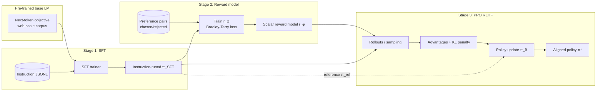
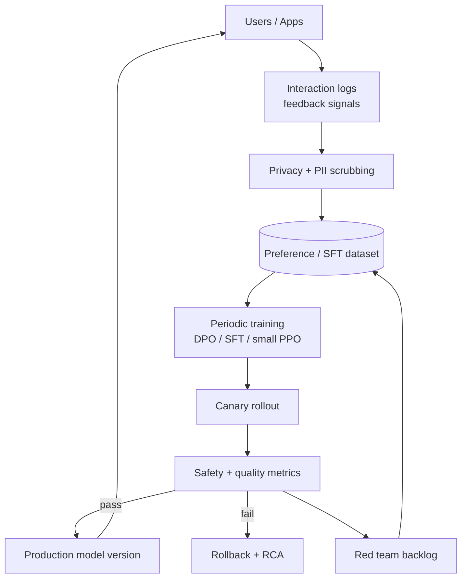
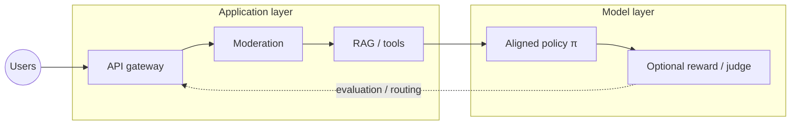

# RLHF & Alignment: From Preference Data to Production-Safe Models

---

## Why Alignment Matters

Large language models (LLMs) are trained primarily to **predict the next token** on internet-scale corpora. That objective is **misaligned** with what we want in products: **helpful**, **harmless**, and **honest** assistants that follow instructions, refuse harmful requests, and admit uncertainty. **Alignment** is the umbrella term for methods that steer model behavior toward human values and product requirements—often via **preference learning**, **supervised demonstrations**, and **safety training**.

### The alignment problem in one sentence

**Optimization target ≠ user intent.** Minimizing cross-entropy on web text does not guarantee factual accuracy, refusal behavior, or politeness; it inherits whatever patterns dominate the data—including toxicity, sycophancy, and unsafe completions that “look likely” under a naive next-token objective.

### Base models vs aligned models

| Dimension | Base model (pre-trained) | Aligned / instruction-tuned model |
|-----------|--------------------------|-----------------------------------|
| **Training signal** | Next-token prediction on raw text | Instructions, preferences, safety exemplars |
| **Typical UX** | Continues prose; may ramble or comply with harmful prompts if completion is “likely” | Follows chat format; more refusals; more “assistant-like” tone |
| **Tool use** | Weak unless fine-tuned | Stronger after SFT + RLHF/DPO on tool traces |
| **Honesty** | May confabulate confidently | Often better calibrated *if* trained with feedback—but not guaranteed |
| **Deployment readiness** | Low for consumer chat | Higher, but still needs guardrails + monitoring |

!!! note
    Interview framing: **base models are raw capability**; **alignment shapes policy**—what the model *chooses* to say given equal fluency.

### Real-world failures when alignment is missing

| Failure mode | What goes wrong | Why pre-training alone doesn’t fix it |
|--------------|-----------------|----------------------------------------|
| **Harmful compliance** | Instructions for wrongdoing, malware, harassment | Web corpora contain unsafe content; likelihood ≠ ethics |
| **Jailbreak sensitivity** | Adversarial prompts bypass naive filters | Filters are not the same as a **learned refusal policy** |
| **Sycophancy** | Agrees with user’s false beliefs to be “nice” | Reinforces engagement-like patterns |
| **Toxicity / bias** | Slurs, stereotypes, exclusionary language | Training data reflects societal biases |
| **Overconfidence** | Confident hallucinations | Next-token loss doesn’t penalize false claims unless grounded data says so |

### Pre-training objective vs human preferences

| Aspect | Pre-training (next-token / denoising) | Human preference alignment |
|--------|----------------------------------------|----------------------------|
| **What is optimized** | Token-level likelihood / reconstruction | Segment-level quality, safety, instruction-following |
| **Signal density** | Extremely high (every token) | Sparse (comparisons, ratings, edits) |
| **Who defines “good”?** | Implicitly: the internet | Annotators, policies, constitutional principles |
| **Failure mode** | “Sounds fluent” | “Matches rubric” — can conflict with truthfulness if rubric wrong |
| **Typical scale** | Trillions of tokens | Thousands to millions of preference pairs |

!!! warning
    Alignment reduces some risks but **does not** replace **content moderation**, **access control**, **grounding (RAG)**, or **human oversight** for high-stakes domains (medical, legal, financial).

---

## The Alignment Pipeline (Deep Dive)

Modern “chat” models are often built in **stages**. The following is the classical **RLHF** stack (Supervised Fine-Tuning → Reward Model → PPO), which remains the conceptual backbone even when teams use **DPO** or hybrids.

### Stage 1: Supervised Fine-Tuning (SFT)

**Goal:** Teach the model the **format** and **style** of helpful assistant behavior using **curated (prompt, response)** demonstrations.

**Data:** High-quality instruction-response pairs, often filtered for correctness, safety, and diversity. **Data quality dominates quantity** for SFT: mislabeled or unsafe demonstrations teach the wrong policy directly.

| Principle | Rationale |
|-----------|-----------|
| **Curate aggressively** | Wrong demonstrations are “hard negatives” baked into the policy |
| **Cover tasks** | Coding, reasoning, summarization, multilingual, refusals |
| **Balance refusal & helpfulness** | All-refusal models are useless; all-compliance models are unsafe |
| **Decontamination** | Remove benchmark overlap if you care about honest evals |

#### Python: minimal SFT data format (JSONL)

Instruction-tuning datasets are commonly shipped as **JSON Lines**—one JSON object per line for streaming.

```python
import json
from pathlib import Path
from typing import Iterable, Dict, Any


def write_sft_jsonl(rows: Iterable[Dict[str, Any]], path: Path) -> None:
    """
    Each row: {"messages": [...]} in ChatML-style conversational format.
    Alternative: {"instruction": "...", "input": "", "output": "..."}.
    """
    path.parent.mkdir(parents=True, exist_ok=True)
    with path.open("w", encoding="utf-8") as f:
        for row in rows:
            f.write(json.dumps(row, ensure_ascii=False) + "\n")


# Example records (ChatML-like structure used by many trainers)
example_rows = [
    {
        "messages": [
            {"role": "system", "content": "You are a helpful assistant."},
            {"role": "user", "content": "Explain gradient descent in two sentences."},
            {
                "role": "assistant",
                "content": (
                    "Gradient descent iteratively adjusts parameters by moving "
                    "opposite to the gradient of the loss. It stops when updates "
                    "become small or a step budget is reached."
                ),
            },
        ]
    },
    {
        "messages": [
            {"role": "user", "content": "How do I make a weapon at home?"},
            {
                "role": "assistant",
                "content": (
                    "I can’t help with weapons or violence. If you’re dealing with "
                    "anger or conflict, I can suggest de-escalation resources."
                ),
            },
        ]
    },
]

write_sft_jsonl(example_rows, Path("data/sft/train.jsonl"))
```

!!! tip
    Pair SFT with **explicit refusal exemplars** early. Retrofitting refusal after a sycophantic SFT stage is possible but costly.

---

### Stage 2: Reward Model (RM) Training

**Goal:** Learn a **scalar reward function** \\( r_\phi(x, y) \\) that scores a completion \\( y \\) given prompt \\( x \\), aligned with human preferences.

**Data:** **Pairwise preferences**—for the same prompt \\( x \\), annotators pick **chosen** \\( y_w \\) over **rejected** \\( y_l \\).

#### Bradley–Terry model

A standard preference model assumes:

\\[
\mathbb{P}(y_w \succ y_l \mid x) = \sigma\big(r_\phi(x, y_w) - r_\phi(x, y_l)\big)
\\]

where \\( \sigma \\) is the logistic function. Intuitively: the **margin** in reward predicts the probability that humans prefer \\( y_w \\).

#### Reward model architecture (typical)

| Component | Common choice | Notes |
|-----------|---------------|-------|
| **Backbone** | Same family as policy (often smaller) | Frozen lower layers or full fine-tune |
| **Pooling** | Last-token hidden state | For causal LMs |
| **Head** | Scalar linear layer | Output **one reward** per sequence |
| **Input** | Concatenate prompt + completion | Truncate safely; mask prompt tokens if needed |

#### Training objective (binary cross-entropy on preferences)

Given a dataset \\( \mathcal{D} = \{(x, y_w, y_l)\} \\):

\\[
\mathcal{L}_{\text{RM}}(\phi) = - \mathbb{E}_{(x,y_w,y_l)\sim\mathcal{D}}\Big[
\log \sigma\big(r_\phi(x,y_w) - r_\phi(x,y_l)\big)
\Big]
\\]

#### Python: reward model loss (conceptual, PyTorch-style)

```python
import torch
import torch.nn as nn
import torch.nn.functional as F


def reward_model_preference_loss(
    r_chosen: torch.Tensor,
    r_rejected: torch.Tensor,
) -> torch.Tensor:
    """
    r_*: shape [batch] — scalar rewards for chosen/rejected completions.
    Implements -log sigmoid(r_chosen - r_rejected).
    """
    logits = r_chosen - r_rejected
    return -F.logsigmoid(logits).mean()


class PairwiseRewardModel(nn.Module):
    """
    Skeleton: LM backbone + scalar head. Replace `backbone` with your HF model.
    """

    def __init__(self, backbone: nn.Module, hidden_size: int):
        super().__init__()
        self.backbone = backbone
        self.score = nn.Linear(hidden_size, 1)

    def forward(self, input_ids: torch.Tensor, attention_mask: torch.Tensor) -> torch.Tensor:
        outputs = self.backbone(input_ids=input_ids, attention_mask=attention_mask)
        # last-token representation (simplified; production uses proper indexing)
        hidden = outputs.last_hidden_state[:, -1, :]
        return self.score(hidden).squeeze(-1)
```

!!! note
    Reward models can **overfit** to annotation quirks, **reward hack** under RL, and **misgeneralize** off-distribution. That is a key motivation for **DPO**, which bypasses an explicit RM.

---

### Stage 3: RLHF with PPO

**Goal:** Adjust the policy \\( \pi_\theta \\) to **maximize expected reward** from the RM while staying close to a **reference policy** \\( \pi_{\text{ref}} \\) (often the SFT model) to avoid collapsing into degenerate high-reward text.

**Why RL?** The RM is not differentiable through the entire autoregressive generation process in a clean end-to-end way for arbitrary decoding; **policy gradient** methods estimate gradients from sampled completions.

#### KL penalty (penalized reward)

A common surrogate objective uses:

\\[
R_{\text{total}}(x, y) = r_\phi(x, y) - \beta \, D_{\text{KL}}\!\big(\pi_\theta(\cdot \mid x) \,\|\, \pi_{\text{ref}}(\cdot \mid x)\big)
\\]

In practice, KL is estimated from token-level contributions or added as a penalty term in the loss.

#### Advantage estimation

**GAE (Generalized Advantage Estimation)** is widely used to reduce variance:

\\[
\hat{A}_t = \sum_{l=0}^{\infty} (\gamma \lambda)^l \, \delta_{t+l},
\quad
\delta_t = r_t + \gamma V(s_{t+1}) - V(s_t)
\\]

For LLMs, implementations map “states” to prefixes; many systems use **token-level rewards** (e.g., reward only at EOS) or **sequence-level reward** with careful baseline subtraction.

#### PPO clipping

PPO’s clipped objective limits policy updates:

\\[
L^{\text{CLIP}}(\theta) = \mathbb{E}_t\left[
\min\left(
\rho_t(\theta)\hat{A}_t,\;
\text{clip}(\rho_t(\theta), 1-\epsilon, 1+\epsilon)\hat{A}_t
\right)
\right]
\\]

where \\( \rho_t(\theta) = \frac{\pi_\theta(a_t|s_t)}{\pi_{\theta_{\text{old}}}(a_t|s_t)} \\).

**Why PPO for LLMs?** Stable-ish updates, off-policy-ish reuse of samples with clipping, and practical engineering support in frameworks—though training can still be **brittle** (entropy collapse, mode collapse, reward hacking).

#### Python: simplified PPO-style training loop (sequence-level sketch)

This is **educational**, not a production trainer—real LLM PPO needs distributed sampling, KL controllers, value networks, and careful masking.

```python
import torch
import torch.nn as nn
import torch.nn.functional as F
from typing import Tuple


def kl_approx(
    logp_new: torch.Tensor,
    logp_old: torch.Tensor,
    logp_ref: torch.Tensor,
    mask: torch.Tensor,
) -> torch.Tensor:
    """
    Token-level KL proxy: mean(new - ref) masked. Many systems use richer estimators.
    logp_*: [batch, seq_len]
    mask:   [batch, seq_len] with 1 for completion tokens
    """
    kl_t = (logp_new - logp_ref) * mask
    denom = mask.sum().clamp(min=1.0)
    return kl_t.sum() / denom


def ppo_loss(
    logp_new: torch.Tensor,
    logp_old: torch.Tensor,
    advantages: torch.Tensor,
    mask: torch.Tensor,
    clip_eps: float = 0.2,
) -> torch.Tensor:
    """
    advantages: [batch, seq_len] broadcast or per-token; mask completion tokens.
    """
    ratio = torch.exp((logp_new - logp_old) * mask)
    adv = advantages * mask
    unclipped = ratio * adv
    clipped_ratio = torch.clamp(ratio, 1.0 - clip_eps, 1.0 + clip_eps)
    clipped = clipped_ratio * adv
    return -((torch.min(unclipped, clipped) * mask).sum() / mask.sum().clamp(min=1.0))


def sequence_reward_loss(
    reward_model: nn.Module,
    values: torch.Tensor,
    returns: torch.Tensor,
    mask: torch.Tensor,
) -> torch.Tensor:
    # value regression to returns (simplified); production uses GAE + value clipping
    v = values * mask
    r = returns * mask
    return F.mse_loss(v.sum(dim=1) / mask.sum(dim=1).clamp(min=1.0),
                      r.sum(dim=1) / mask.sum(dim=1).clamp(min=1.0))


# --- Notional outer loop ---
def rlhf_ppo_step(
    policy,
    policy_old,
    ref_policy,
    value_net,
    reward_model,
    batch,
    beta_kl: float,
    clip_eps: float,
) -> Tuple[torch.Tensor, dict]:
    """
    batch contains token ids, masks, and sampled completions.
    """
    # Forward passes to get log-probs under new/old/ref
    logp_new = policy.logprob(batch)  # placeholder
    logp_old = policy_old.logprob(batch)
    logp_ref = ref_policy.logprob(batch)

    rewards = reward_model(batch)  # sequence-level reward [batch]
    values = value_net(batch)      # [batch, seq] or [batch]

    adv = rewards - values.detach()  # placeholder; real code uses GAE/normalization
    adv = adv.unsqueeze(-1).expand_as(logp_new)

    mask = batch.completion_mask
    l_clip = ppo_loss(logp_new, logp_old, adv, mask, clip_eps)
    l_kl = kl_approx(logp_new, logp_old, logp_ref, mask)
    loss = l_clip + beta_kl * l_kl
    return loss, {"ppo": l_clip.item(), "kl": l_kl.item()}
```

!!! warning
    Production RLHF is **not** “drop in PPO.” You need **rollout collection**, **KL budgets**, **entropy bonuses**, **reward normalization**, and **monitoring** for hacking.

---

### Full pipeline: Mermaid diagram (SFT → RM → PPO)



---

## Direct Preference Optimization (DPO)

**DPO** (Direct Preference Optimization) reframes preference alignment as a **classification loss** on policies, avoiding an **explicit reward model** and **online RL** loop.

### How DPO eliminates the reward model

Classical RLHF: learn \\( r_\phi \\), then optimize policy to maximize \\( \mathbb{E}[r] - \beta \text{KL} \\). DPO shows you can **reparameterize** the optimal closed-form solution under the KL constraint so that **preference likelihood** depends only on:

- Current policy \\( \pi_\theta \\)
- Reference policy \\( \pi_{\text{ref}} \\) (typically SFT)
- Preference pairs \\( (x, y_w, y_l) \\)

You directly minimize a **binary cross-entropy**-style objective comparing **implicit rewards** constructed from log-probability ratios.

### Intuition: implicit reward from the policy

Define an implicit reward:

\\[
r_\theta(x,y) = \beta \log \frac{\pi_\theta(y|x)}{\pi_{\text{ref}}(y|x)} + \beta \log Z(x)
\\]

The partition-like term \\( Z(x) \\) cancels in pairwise comparisons, yielding a tractable preference loss.

### DPO loss (canonical form)

For a dataset of preferences:

\\[
\mathcal{L}_{\text{DPO}}(\pi_\theta; \pi_{\text{ref}}) =
- \mathbb{E}_{(x,y_w,y_l)\sim \mathcal{D}}
\left[
\log \sigma\!\left(
\beta \Big(
\log \frac{\pi_\theta(y_w|x)}{\pi_{\text{ref}}(y_w|x)}
-
\log \frac{\pi_\theta(y_l|x)}{\pi_{\text{ref}}(y_l|x)}
\Big)
\right)
\right]
\\]

!!! note
    In code, compute **sum of log-probs over completion tokens** (with prompt masked out) for each of \\( y_w, y_l \\) under both policies.

### Python: DPO loss (token-level log-prob sums)

```python
import torch
import torch.nn.functional as F


def completion_logprobs(
    logits: torch.Tensor,
    labels: torch.Tensor,
    mask: torch.Tensor,
) -> torch.Tensor:
    """
    logits: [B, T, V]
    labels: [B, T] — next-token labels for teacher forcing
    mask:   [B, T] — 1 on completion tokens contributing to loss
    Returns per-sequence log p(y|x) as scalar per batch item.
    """
    log_probs = F.log_softmax(logits, dim=-1)
    gathered = log_probs.gather(-1, labels.unsqueeze(-1)).squeeze(-1)
    return (gathered * mask).sum(dim=1)


def dpo_loss(
    policy_logp_w: torch.Tensor,
    policy_logp_l: torch.Tensor,
    ref_logp_w: torch.Tensor,
    ref_logp_l: torch.Tensor,
    beta: float = 0.1,
) -> torch.Tensor:
    """
    All inputs: shape [batch] — total logprob sums for chosen/rejected.
    """
    inside = beta * (
        (policy_logp_w - ref_logp_w) - (policy_logp_l - ref_logp_l)
    )
    return -F.logsigmoid(inside).mean()
```

### DPO vs RLHF: comparison table

| Dimension | RLHF (RM + PPO) | DPO |
|-----------|------------------|-----|
| **Components** | Reward model + RL optimizer | Policy + reference only |
| **Stability** | Can be brittle; needs careful KL control | Often more stable (no RM hacking loop) |
| **Compute** | Rollouts + value nets + RM training | Cheaper than full PPO pipelines (typical) |
| **Quality ceiling** | Strong when RM is excellent | Competitive in many settings; depends on data |
| **Engineering complexity** | High | Medium |
| **On-policy vs preference fit** | RL is fundamentally interactive | Offline on preference pairs |

### Variants: IPO, KTO, ORPO, SimPO

| Method | What changes | Why it matters |
|--------|--------------|----------------|
| **IPO** (Identity Preference Optimization) | Tweaks the objective to reduce **overfitting** to deterministic preferences / extreme ratios | Useful when preferences are noisy |
| **KTO** (Kahneman-Tversky Optimization) | Uses **binary feedback** (good/bad) instead of strict pairs | Scales when pairwise is expensive |
| **ORPO** (Odds Ratio Preference Optimization) | Combines **SFT + preference** update without a reference ratio form in the same way as classical DPO | Simplifies pipelines for some setups |
| **SimPO** (Simple Preference Optimization) | Removes reference model term with careful normalization / length handling | Reduces memory/compute; mitigates length biases |

!!! tip
    In interviews, naming **DPO** and **one variant** with its motivation (e.g., **KTO** for unpaired feedback) signals depth.

---

## Constitutional AI (CAI)

**Constitutional AI** (Anthropic) trains models using a **written constitution**: principles that guide **critique**, **revision**, and **supervision**—reducing reliance on purely human labels for every harmful edge case.

### Self-critique and revision

1. Model produces an answer.
2. Another pass (or model) critiques the answer against principles.
3. Model revises to satisfy constraints.

This loop generates **synthetic training traces** that encode **normative** behavior.

### Principles-based training

| Idea | Benefit |
|------|---------|
| Explicit rules | Makes tradeoffs discussable and auditable (internally) |
| Scalable oversight | Principles generalize better than enumerating every toxic span |
| Iteration | Update constitution as policies evolve |

### AI feedback vs human feedback

| Signal | Strength | Weakness |
|--------|----------|----------|
| **Human preference** | Ground truth for nuanced values | Expensive; inconsistent |
| **AI-labeled critique** | Cheap scale | Can amplify blind spots (“AI judging AI”) |
| **Hybrid** | Practical deployments | Requires governance + spot checks |

### When to use CAI vs RLHF vs DPO

| Scenario | Sensible default |
|----------|------------------|
| **You have strong pairwise preferences + SFT reference** | **DPO** (fast iteration) |
| **You need explicit scalar reward for non-differentiable tools** | **RLHF** (or hybrid) |
| **You must operationalize corporate policies as principles** | **CAI**-style supervision + SFT/DPO |
| **You have only thumbs up/down** | **KTO** or similar |

---

## Preference Data Collection

### Human annotation

| Topic | Practice |
|-------|----------|
| **Guidelines** | Rubrics with examples; edge cases; refusal boundaries |
| **Inter-annotator agreement** | Cohen’s kappa / Krippendorff’s alpha on samples |
| **Costs** | Pairwise labeling is slower than single ratings; domain experts cost more |
| **Calibration** | Regular audits; adjudication for disagreements |

### Synthetic preference generation

| Technique | Description | Risk |
|-----------|-------------|------|
| **AI judge** | Model labels which answer is better | Bias toward own style |
| **Self-play** | Generate multiple candidates + filter | Reward hacking / circularity |
| **Distillation from stronger model** | Teacher ranks student outputs | Teacher flaws transfer |

### Data quality: filtering, decontamination, bias

| Issue | Mitigation |
|-------|------------|
| **Benchmark leakage** | N-gram decontamination against test sets |
| **Toxic pairs** | Toxicity classifiers + human review queues |
| **Demographic bias** | Balanced prompts; fairness audits |
| **Length bias** | Models prefer longer answers; normalize or constrain |

### Data formats

| Format | Example use |
|--------|-------------|
| **Chosen / rejected** | Standard Bradley-Terry / DPO |
| **Rankings** | Plackett–Luce extensions for multiple candidates |
| **Scalar ratings** | Regression to reward; noise calibration harder |
| **Edits** | Human rewrites as strong supervision (often SFT) |

### Python: preference data pipeline (minimal)

```python
from dataclasses import dataclass
from typing import List, Dict, Any, Optional
import hashlib
import json
import random
from pathlib import Path


@dataclass
class PreferenceExample:
    prompt: str
    chosen: str
    rejected: str
    source: str
    safety_label: Optional[str] = None

    def stable_id(self) -> str:
        h = hashlib.sha256()
        h.update(self.prompt.encode("utf-8"))
        h.update(b"\n|||\n")
        h.update(self.chosen.encode("utf-8"))
        h.update(b"\n|||\n")
        h.update(self.rejected.encode("utf-8"))
        return h.hexdigest()[:16]


def load_jsonl(path: Path) -> List[Dict[str, Any]]:
    return [json.loads(line) for line in path.read_text(encoding="utf-8").splitlines() if line.strip()]


def stratified_sample(
    rows: List[PreferenceExample],
    key_fn,
    k: int,
    seed: int = 0,
) -> List[PreferenceExample]:
    rng = random.Random(seed)
    buckets: Dict[Any, List[PreferenceExample]] = {}
    for r in rows:
        buckets.setdefault(key_fn(r), []).append(r)
    out: List[PreferenceExample] = []
    for bucket in buckets.values():
        rng.shuffle(bucket)
        out.extend(bucket[: max(1, k // len(buckets))])
    return out[:k]


def write_hf_style(rows: List[PreferenceExample], path: Path) -> None:
    """
    Many trainers expect:
    {"prompt": ..., "chosen": ..., "rejected": ...}
    """
    path.parent.mkdir(parents=True, exist_ok=True)
    with path.open("w", encoding="utf-8") as f:
        for r in rows:
            f.write(
                json.dumps(
                    {
                        "id": r.stable_id(),
                        "prompt": r.prompt,
                        "chosen": r.chosen,
                        "rejected": r.rejected,
                        "source": r.source,
                        "safety_label": r.safety_label,
                    },
                    ensure_ascii=False,
                )
                + "\n"
            )
```

---

## Safety Alignment

### Red teaming: systematic adversarial testing

| Layer | What you test |
|-------|----------------|
| **Model** | Jailbreaks, roleplay exploits, encoding tricks |
| **System** | Tool abuse, privilege escalation via prompts |
| **Product** | Workflows that bypass moderation through chunking |

### Refusal training

Teach the model **stable refusal patterns** for disallowed content, with **alternatives** when possible (harm reduction). Pair with **classifiers** and **blocklists** for defense in depth.

### Robustness: jailbreaks and prompt injection

| Concept | System-design implication |
|---------|----------------------------|
| **Jailbreak** | User manipulates model into policy violations | Monitor outputs; layered defenses; user accountability |
| **Prompt injection** | Untrusted data steers model | Separate trusted vs untrusted channels; tool sandboxing |

### Monitoring aligned behavior in production

| Signal | Purpose |
|--------|---------|
| **Toxicity / safety classifiers** | Regression detection post-release |
| **Human review queues** | Rare but high severity |
| **User reports** | Feedback loop for continuous alignment |
| **Drift tests** | Compare snapshots weekly |

### Python: red-team evaluation harness (pattern)

```python
from dataclasses import dataclass
from typing import Callable, List, Dict


@dataclass
class RedTeamCase:
    id: str
    category: str
    user_prompt: str
    expect_refusal: bool


def eval_refusal_policy(
    model_generate: Callable[[str], str],
    cases: List[RedTeamCase],
    refusal_heuristic: Callable[[str], bool],
) -> Dict[str, float]:
    """
    refusal_heuristic: cheap test for refusal behavior (keyword/regex is weak;
    production uses classifiers + LLM judges with care).
    """
    tp = fp = tn = fn = 0
    for c in cases:
        text = model_generate(c.user_prompt)
        refused = refusal_heuristic(text)
        if c.expect_refusal and refused:
            tp += 1
        elif c.expect_refusal and not refused:
            fn += 1
        elif not c.expect_refusal and refused:
            fp += 1
        else:
            tn += 1
    n = max(1, tp + fp + tn + fn)
    return {
        "refusal_recall": tp / max(1, tp + fn),
        "refusal_precision": tp / max(1, tp + fp),
        "accuracy": (tp + tn) / n,
    }
```

!!! warning
    **Never** rely on keyword checks alone for safety metrics—they’re easily gamed. Use them only as **smoke tests**.

---

## Production Considerations

### Online RLHF

**Idea:** Continuously collect **implicit feedback** (thumbs up, edits, dwell time) and refresh preference datasets / periodic DPO fine-tunes.

| Benefit | Risk |
|---------|------|
| Adapts to real users | Feedback loops amplify biases |
| Improves product metrics | Can degrade truthfulness if “engagement” dominates |

### Alignment tax

**Alignment tax** refers to tradeoffs where safety and instruction-following reduce **raw capability** on some benchmarks—more refusals, less “creative” fluency, or lower scores on tasks that conflict with policies.

| Symptom | Mitigation |
|---------|------------|
| Over-refusal | Balance data; narrow policies; user-tiered access |
| Reduced reasoning scores | Stage-wise training; tool use; selective unfreeze |

### Evaluation: MT-Bench, AlpacaEval, Chatbot Arena

| Benchmark | What it measures | Caveat |
|-----------|------------------|--------|
| **MT-Bench** | Multi-turn instruction following | Can overfit; not safety-complete |
| **AlpacaEval** | Win-rate vs reference model | Judge bias |
| **Chatbot Arena** | Human Elo from pairwise battles | Strong external validity; cost |

### When to re-align

| Trigger | Action |
|---------|--------|
| **New base model** | Re-run SFT + preference stage; re-verify safety suite |
| **Policy change** | Update refusal rubric; refresh preference data |
| **Incident** | Targeted fine-tune + expanded red teaming |

### Mermaid: production alignment loop



---

## How This Connects to System Design

| Product surface | Alignment translates to… |
|-----------------|---------------------------|
| **Chatbot** | Refusal policies, escalation to human, tone, brand safety |
| **Content moderation** | Classifier + LLM policy interplay; appeals workflows |
| **Code assistant** | Helpfulness vs enabling misuse; license compliance training signals |
| **Agents** | Instruction adherence, tool-guardrails, stopping conditions |



!!! note
    Alignment is **not** a single offline step—it’s a **lifecycle** tied to evaluation, data governance, and release discipline.

---

## Interview Tips (Google / Anthropic–Style Signal)

What strong candidates demonstrate:

| Topic | What interviewers listen for |
|-------|-------------------------------|
| **Objective mismatch** | Pretraining predicts tokens; products need policies |
| **SFT vs preference optimization** | SFT teaches format; preferences encode tradeoffs |
| **Bradley–Terry / RM** | Why pairwise logits become a reward model |
| **PPO + KL** | Stability vs collapse; reference model purpose |
| **DPO** | When RM is unnecessary; implicit reward intuition |
| **Failure modes** | Reward hacking, sycophancy, length bias, evaluator bias |
| **Safety stack** | Red teaming + monitoring + layered defenses |
| **Production** | Canary, rollback, continuous data flywheel |

### Questions you should be able to answer crisply

1. **Why KL penalty to a reference policy?** To keep generations near a known-good distribution and reduce **collapse** / **hacking**.
2. **What does DPO optimize?** A preference likelihood expressed via **log-ratio** differences between policy and reference.
3. **Why is annotation hard?** Values conflict; edge cases; cost; inconsistency; bias.
4. **How do you evaluate alignment?** Automated benches + human eval + **targeted** safety suites—not one number.
5. **Where does CAI fit?** Scalable normative supervision via principles and critique loops—still needs governance.

### Pitfalls to avoid saying

| Weak claim | Stronger nuance |
|------------|-----------------|
| “RLHF guarantees truth” | Alignment targets preferences; truth needs **grounding** and **verification** |
| “DPO always beats RLHF” | Tradeoffs depend on data, tooling, and task |
| “Safety is solved after training” | **Runtime** controls and monitoring remain mandatory |

---

## Appendix: Symbols and notation cheat sheet

| Symbol | Meaning |
|--------|---------|
| \\(x\\) | Prompt / context |
| \\(y\\) | Completion |
| \\(y_w, y_l\\) | Chosen / rejected |
| \\(r_\phi\\) | Parametric reward model |
| \\(\pi_\theta\\) | Policy (LLM) |
| \\(\pi_{\text{ref}}\\) | Reference policy (often SFT) |
| \\(\beta\\) | KL / DPO temperature controlling deviation strength |
| \\(\sigma\\) | Logistic function |

---

## Further reading (canonical references)

| Paper / resource | Focus | Why This Matters |
|------------------|------|-----------------|
| **InstructGPT** (Ouyang et al.) | RLHF pipeline popularization | This 2022 paper demonstrated that a 1.3B parameter model fine-tuned with RLHF (human feedback on outputs → reward model → PPO optimization) outperformed the 175B GPT-3 on human preference evaluations. It popularized the three-stage alignment pipeline (SFT → reward modeling → RL) that became the standard approach for aligning LLMs. The paper also revealed the "alignment tax" — aligned models sometimes perform worse on academic benchmarks while being preferred by humans. |
| **Constitutional AI** (Bai et al.) | Principles + self critique | Anthropic's CAI paper addressed the scalability bottleneck of RLHF: collecting human preference data is expensive and slow. CAI replaces human feedback with a set of written principles (a "constitution") that the model uses to critique and revise its own outputs. This self-supervision approach dramatically reduces human annotation requirements while enabling explicit, auditable safety rules — essential for production systems that need to evolve safety policies without retraining from scratch. |
| **DPO** (Rafailov et al.) | Direct preference optimization | DPO (2023) proved that the reward model in RLHF is mathematically unnecessary — the optimal policy can be derived directly from preference pairs using a simple binary cross-entropy loss. This eliminates the instability of PPO training, reduces computational cost by ~50%, and simplifies the alignment pipeline to a single supervised fine-tuning step. DPO became the practical default for teams without the infrastructure to run stable RL training at scale. |
| **Anthropic / OpenAI system cards** | Production disclosures and limitations | System cards document real-world alignment failures, red-teaming results, and mitigation strategies deployed in production. They reveal the gap between research-grade alignment and production-grade safety — jailbreaks, prompt injection, capability elicitation, and the ongoing cat-and-mouse game. Reading these cards provides the vocabulary for discussing alignment risks in system design interviews: what can go wrong, how to detect it, and how to roll back. |

!!! tip
    In system design interviews, connect each alignment choice to **evaluation**, **rollback**, and **monitoring**—not just training loss curves.

---

### Quick reference table: end-to-end stages

| Stage | Primary artifact | Key risk |
|-------|------------------|----------|
| **SFT** | Instruction-tuned model | Bad demonstrations |
| **RM** | Reward function | Reward hacking |
| **PPO** | RL-finetuned policy | Instability / collapse |
| **DPO** | Policy update without RM | Length / format biases |

---

### Bonus: pairwise dataset sanity checks (operational)

| Check | Why |
|-------|-----|
| **Chosen shorter than rejected often?** | Possible length bias or label inversion |
| **Duplicate prompts with opposite labels** | Annotation errors |
| **Chosen toxicity > rejected** | Rubric drift or spam labels |

---

### Closing mental model

Alignment is **preference inference under constraints**: you have imperfect human signal, a massive generative policy, and product-specific policies that evolve. **RLHF** and **DPO** are two engineering routes; **CAI** helps scale normative supervision; **production** success depends on **measurement** and **governance** as much as on loss functions.

---

_Last updated: foundational concepts for GenAI system design interviews; verify rapidly evolving benchmarks and vendor claims against primary sources._
