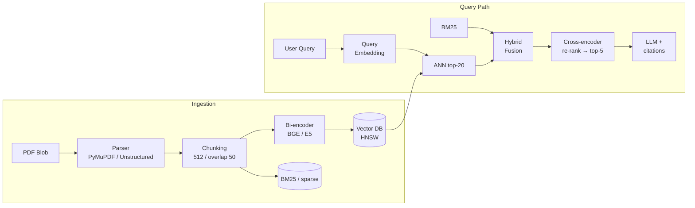
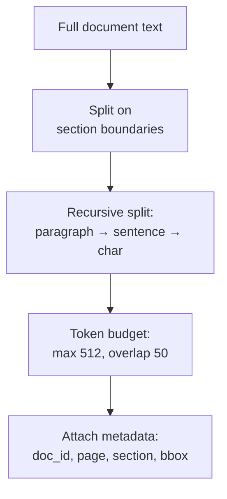
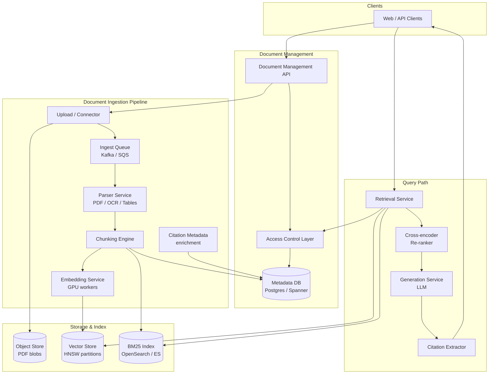
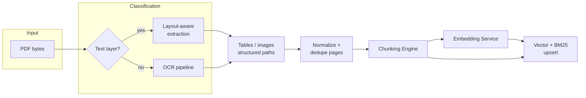
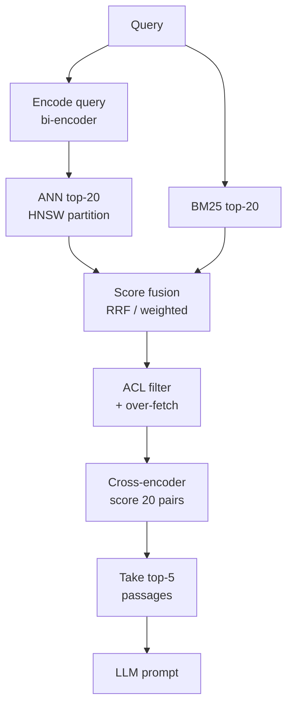
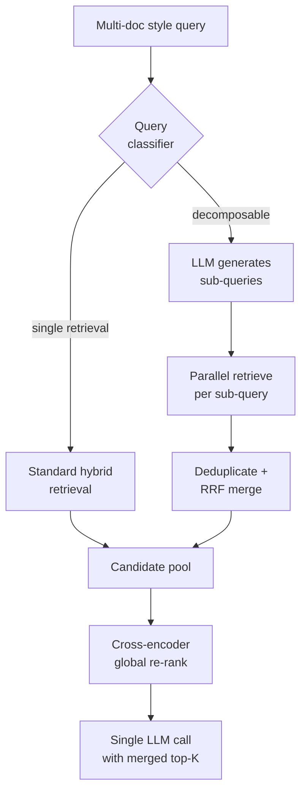
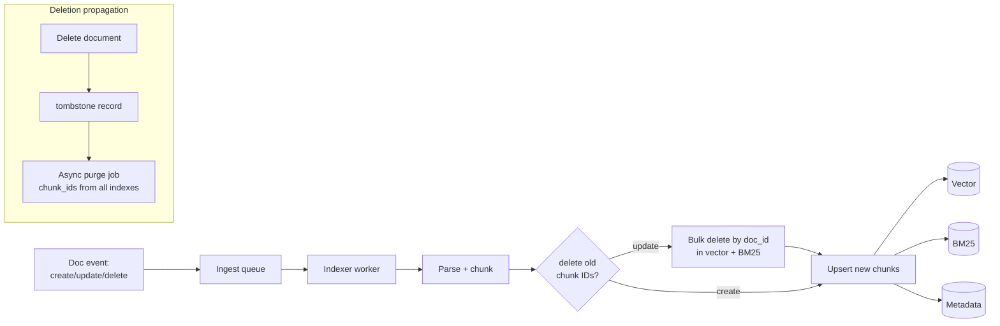

# Design a Document Q&A System for 10,000+ PDFs

---

## What We're Building

A **document-grounded question answering** system over a large corpus of PDFs — think internal research libraries, legal discovery, compliance manuals, or technical specification archives. Users ask natural language questions; the system retrieves the most relevant passages from thousands of PDFs, re-ranks them, and generates answers with **explicit citations** (document, page, section).

**The key difference from a generic chatbot:** Answers must be attributable to specific PDF regions. PDFs add pain: scanned pages, multi-column layouts, embedded tables, figures, and mixed fonts break naive "read the file as text" pipelines.

### Why This Problem Is Hard

| Challenge | Description |
|-----------|-------------|
| **PDF is a presentation format, not semantic text** | Text order, headers, and tables often require layout-aware parsing or OCR |
| **Scale across documents** | 10K+ PDFs implies millions of chunks; ANN search, ACL filtering, and freshness must compose |
| **Retrieval vs. reasoning** | Multi-document questions need either fusion retrieval or orchestrated sub-queries before generation |
| **Non-text modalities** | Tables and images carry information that plain text extraction loses without structure or vision |
| **Access control** | Per-document permissions must be enforced *before* or *immediately after* retrieval — leaks are unacceptable |
| **Index lifecycle** | Adds, updates, and deletes must propagate to vector, sparse, and metadata indexes consistently |

### Real-World Scale

| Metric | Scale |
|--------|-------|
| **PDF documents** | 10,000–50,000 (single tenant); 100K+ (multi-tenant archive) |
| **Total pages** | 5M–20M (avg 200–400 pages per PDF) |
| **Chunks (512 tokens, overlap)** | ~15M–60M (depends on information density) |
| **Queries per day** | 50K–200K (enterprise knowledge product) |
| **Concurrent users** | 1K–10K peak |
| **Ingestion rate** | 100–2,000 new/updated PDFs per day |
| **End-to-end latency target** | < 3–5 s (retrieval + re-rank + LLM) |
| **Embedding dimensions** | 768–1024 (BGE, E5-class bi-encoders) |

!!! warning
    Interviewers often probe **failure modes**: scanned PDFs, wrong reading order, tables rendered as garbage text, and "the right answer spread across three documents." Show you understand **parsing, chunking, hybrid retrieval, and multi-hop / multi-doc strategies** — not only "embed and call GPT."

---

## Key Concepts Primer

### End-to-End RAG over PDFs



### Bi-Encoder vs. Cross-Encoder

| Model class | Training | Query-time cost | Best for |
|-------------|----------|-----------------|----------|
| **Bi-encoder** (BGE, E5) | Contrastive; query/doc encoded independently | Low — single forward pass per side; batch-friendly | First-stage retrieval (ANN) |
| **Cross-encoder** (e.g., MS MARCO–style) | Joint encoding of (query, passage) pairs | High — O(passages × forward passes) | Re-ranking top-K after ANN |

```python
# Conceptual: bi-encoder produces fixed vectors; cross-encoder scores pairs.
import torch
import torch.nn.functional as F


def cosine_sim(a: torch.Tensor, b: torch.Tensor) -> torch.Tensor:
    return F.cosine_similarity(a.unsqueeze(0), b.unsqueeze(0))


class BiEncoderRetrieval:
    def __init__(self, query_tower, doc_tower):
        self.query_tower = query_tower
        self.doc_tower = doc_tower

    def encode_query(self, text: str) -> torch.Tensor:
        return F.normalize(self.query_tower(text), dim=-1)

    def encode_docs(self, texts: list[str]) -> torch.Tensor:
        return F.normalize(self.doc_tower(texts), dim=-1)


class CrossEncoderReranker:
    """Scores (query, passage) jointly — too expensive for full corpus."""

    def __init__(self, model):
        self.model = model

    def score_pairs(self, query: str, passages: list[str]) -> list[float]:
        pairs = [(query, p) for p in passages]
        logits = self.model(pairs)  # batch forward
        return logits.tolist()
```

### Chunking and Overlap (Intuition)

**Recursive character splitting** with **512-token chunks** and **50-token overlap** preserves local context across boundaries while keeping vectors within model limits. **Section-aware** splitting (headings from parser or heuristic rules) reduces mid-sentence cuts.



### HNSW at a Glance

**Hierarchical Navigable Small World (HNSW)** builds a multi-layer graph for approximate nearest neighbor search. Key knobs: `M` (max edges per node), `efConstruction` (build quality), `efSearch` (query accuracy vs. latency).

!!! tip
    For **partitioned corpora** (per collection or tenant), maintain **separate HNSW graphs or namespaces** in the vector store so a query scoped to one library does not scan unrelated vectors — smaller graphs mean better latency and recall.

---

## Step 1: Requirements Clarification

### Questions to Ask

| Question | Why It Matters |
|----------|----------------|
| Are PDFs mostly digital text or scanned images? | Chooses PyMuPDF path vs. OCR / vision pipeline |
| Single vs. multiple collections / tenants? | Sharding, partitioning, and ACL model |
| Required citation granularity? | Page-level vs. bounding-box vs. table cell |
| Compliance / data residency? | On-prem embeddings vs. cloud APIs |
| Max acceptable latency? | Whether you can afford cross-encoder + large context |
| Who can see which documents? | Per-doc ACLs, RBAC, ABAC |
| Do users ask single-doc or synthesis questions? | Multi-doc retrieval and prompt strategy |
| Languages? | Multilingual encoders and tokenizers |

### Functional Requirements

| Requirement | Priority | Description |
|-------------|----------|-------------|
| Ingest PDFs at scale | Must have | Upload or connector-driven ingestion with deduplication |
| Text + table + image handling | Must have | Structured extraction; OCR / VLM fallback for scans |
| Semantic search over chunks | Must have | Dense embeddings + metadata filters |
| Natural language answers | Must have | LLM generation grounded in retrieved chunks |
| Citations | Must have | Document title, page, section (and optional bbox) |
| Hybrid retrieval | Should have | BM25 + dense for keyword + semantic coverage |
| Cross-encoder re-ranking | Should have | top-20 → top-5 before generation |
| Multi-document answers | Should have | Fuse evidence from 2+ PDFs when needed |
| Incremental index updates | Should have | New PDFs indexed without full rebuild |
| Access control | Must have | Enforce per-document permissions on every query path |

### Non-Functional Requirements

| Requirement | Target | Rationale |
|-------------|--------|-----------|
| **P95 query latency** | < 4 s | Includes retrieval, re-rank, and ~500-token generation |
| **Ingestion freshness** | < 5–15 min | Business users expect near-real-time for new docs |
| **Retrieval recall@20** | > 90% (eval set) | Wrong retrieval cannot be fixed downstream |
| **Faithfulness / grounding** | > 93% on sampled eval | Regulatory and trust requirements |
| **Availability** | 99.9% | Read path degrades gracefully if LLM slow |
| **Durability** | No silent doc loss | Ingest pipeline idempotency + dead-letter queue |

### API Design

```python
# POST /v1/collections/{collection_id}/documents
{
    "source": "s3://bucket/reports/2024/q3-financial.pdf",
    "document_id": "doc-fin-2024-q3",       # optional client id; else server-generated
    "title": "Q3 2024 Financial Report",
    "acl_principal_ids": ["group:finance", "user:auditor-42"],
    "parse_profile": "financial_pdf_v2",    # hints for table detection
    "metadata": {"fiscal_year": 2024, "region": "NA"}
}

# POST /v1/query
{
    "collection_id": "col-research",
    "query": "How did gross margin compare to Q2 and what drove the change?",
    "conversation_id": null,
    "filters": {
        "document_ids": null,
        "metadata": {"fiscal_year": 2024}
    },
    "retrieval": {
        "ann_top_k": 20,
        "rerank_top_k": 5,
        "hybrid_alpha": 0.5
    },
    "generation": {
        "max_answer_tokens": 1024,
        "citation_format": "numeric"
    }
}

# Response
{
    "answer": "Gross margin improved to 41.2% in Q3 from 38.7% in Q2, primarily due to lower input costs in the packaging line and favorable mix toward higher-margin SKUs [1][2].",
    "citations": [
        {
            "ref": 1,
            "document_id": "doc-fin-2024-q3",
            "title": "Q3 2024 Financial Report",
            "page": 14,
            "section": "MD&A — Gross Margin",
            "chunk_id": "chunk-abc123",
            "snippet": "Gross margin increased to 41.2% compared to 38.7% in Q2..."
        },
        {
            "ref": 2,
            "document_id": "doc-ops-packaging-2024",
            "title": "Packaging Cost Initiative",
            "page": 3,
            "section": "Summary",
            "chunk_id": "chunk-def456",
            "snippet": "Year-to-date packaging unit costs declined 6% vs H1..."
        }
    ],
    "retrieval_debug": {
        "ann_candidates": 20,
        "after_acl_filter": 18,
        "after_rerank": 5
    },
    "latency_ms": 3200
}
```

---

## Step 2: Back-of-Envelope Estimation

### Traffic

```
Assumptions:
  PDFs indexed:                    12,000
  Avg pages per PDF:               250  → 3M pages
  Avg tokens per page (extracted): 400  → 1.2B tokens raw
  Chunks (512 tokens, ~15% overhead from overlap): 1.2B / 460 ≈ 2.6M chunks

Queries per day:                  80,000
Average QPS:                      80_000 / 86_400 ≈ 0.93
Peak QPS (×8 business hours focus): ~8–15
```

### Storage

```
Chunk text + metadata (~800 bytes avg):
  2.6M × 800 B ≈ 2.1 GB

Embeddings (1024-dim float32):
  2.6M × 1024 × 4 B ≈ 10.6 GB

HNSW overhead (often 1.5–2× vector data):
  ~16–22 GB in RAM working set per full index (order-of-magnitude)

BM25 inverted index (compressed):
  ~2–6 GB depending on vocabulary and stemming

Original PDF storage (S3 / GCS):
  12K × 3 MB avg ≈ 36 GB (+ versions)
```

### Compute

```
Initial embedding (cold corpus):
  2.6M chunks / 256 batch / 50 encode/sec/GPU ≈ few GPU-days (order-of-magnitude; model dependent)

Steady-state ingestion: 500 PDFs/day × 200 chunks/PDF = 100K new chunks/day
  At 2ms/chunk on GPU batching → ~200 s GPU time/day (plus OCR tail)

Per query:
  1 × query embedding
  1 × ANN (partitioned HNSW)
  20 × cross-encoder forward (batched to 1–2 GPU calls)
  1 × LLM completion (dominant latency)
```

### Cost (Rough Monthly Order-of-Magnitude)

| Component | Assumption | ~USD / month |
|-----------|------------|----------------|
| Object storage for PDFs | 50 GB @ $0.023/GB | ~2–5 |
| Vector DB (managed, 3-node) | HA deployment | 1.5K–4K |
| GPU for embeddings + re-rank | Shared T4/L4 pool | 2K–8K |
| LLM inference (proprietary API) | 80K q/day × 2K tokens | Highly variable (10K–50K+) |
| OCR / VLM for scans | 10% of pages need OCR | +GPU or API line item |

!!! note
    In an interview, **show the latency budget** explicitly: ANN + re-rank + LLM. Argue **partitioning** and **caching query embeddings** for repeat queries to protect the tail.

---

## Step 3: High-Level Design



### Component Responsibilities

| Component | Role |
|-----------|------|
| **Document Management API** | Register documents, versions, collections, ACL bindings, ingest triggers |
| **Access Control Layer** | Resolves user → principals; filters chunk IDs or applies post-filter with over-fetch |
| **Parser Service** | PDF text (PyMuPDF), layout-aware parsing (Unstructured), OCR (Tesseract / cloud), optional **multimodal** captioning for figures |
| **Chunking Engine** | Recursive splits with token caps, overlap, section/table awareness |
| **Embedding Service** | Batch bi-encoder inference (BGE-large-en-v1.5, E5-mistral, etc.) with queue backpressure |
| **Vector Store** | HNSW (or IVF-PQ) **per collection** or tenant shard; stores embedding + chunk metadata |
| **Retrieval Service** | Hybrid dense + BM25, ANN top-20, ACL-aware filtering, optional query expansion |
| **Re-ranker** | Cross-encoder scores candidates → top-5 for context window |
| **Generation Service** | Prompt assembly, LLM call, streaming optional |
| **Citation Extractor** | Validates `[n]` references, maps to chunk metadata; optional NLI grounding check |

### Document Ingestion Pipeline



---

## Step 4: Deep Dive

### 4.1 PDF Parsing Strategies (PyMuPDF vs. Unstructured vs. Multimodal)

| Approach | Strengths | Weaknesses |
|----------|-----------|------------|
| **PyMuPDF (fitz)** | Fast, good text extraction for many digital PDFs | Weak on complex layouts; reading order can be wrong |
| **Unstructured / layout models** | Better headings, tables, reading order | Heavier deps; slower |
| **OCR (Tesseract, cloud)** | Scanned PDFs | Noise, cost, latency |
| **Multimodal VLM** | Figures, charts, screenshots | Expensive; needs guardrails for PII |

```python
# PDF parsing and text extraction (illustrative)
from dataclasses import dataclass

import fitz  # PyMuPDF


@dataclass
class PageBlock:
    page_number: int
    text: str
    bbox: tuple[float, float, float, float] | None
    block_type: str  # "paragraph", "table", "image_caption"


def extract_pages_pymupdf(path: str) -> list[PageBlock]:
    doc = fitz.open(path)
    blocks: list[PageBlock] = []
    for i, page in enumerate(doc):
        text = page.get_text("text")
        blocks.append(PageBlock(i + 1, text.strip(), None, "paragraph"))
    return blocks


# Unstructured (pseudo-import — API varies by version)
# from unstructured.partition.pdf import partition_pdf
# elements = partition_pdf(filename=path, infer_table_structure=True, strategy="hi_res")
# → iterate Table, Title, NarrativeText elements for section-aware chunking
```

**Production pattern:** run a **fast path** (PyMuPDF + heuristics). If text entropy is low or page is image-dominant, **escalate** to hi-res Unstructured + OCR queue.

### 4.2 Chunking Algorithms: Recursive, Semantic, Table-Aware

```python
from typing import Iterator

from transformers import AutoTokenizer


class RecursiveChunker:
    """512-token chunks with 50-token overlap; prefers paragraph → sentence boundaries."""

    def __init__(
        self,
        model_id: str = "BAAI/bge-large-en-v1.5",
        chunk_tokens: int = 512,
        overlap_tokens: int = 50,
    ):
        self.tok = AutoTokenizer.from_pretrained(model_id)
        self.chunk_tokens = chunk_tokens
        self.overlap_tokens = overlap_tokens
        self.separators = ["\n\n", "\n", ". ", " ", ""]

    def _encode_len(self, text: str) -> int:
        return len(self.tok.encode(text, add_special_tokens=False))

    def split(self, text: str, section: str | None = None) -> Iterator[dict]:
        def _split_recursive(s: str, seps: list[str]) -> list[str]:
            if self._encode_len(s) <= self.chunk_tokens:
                return [s]
            if not seps:
                # hard cut by tokens
                ids = self.tok.encode(s, add_special_tokens=False)
                parts = []
                step = self.chunk_tokens - self.overlap_tokens
                for start in range(0, len(ids), step):
                    sub = ids[start : start + self.chunk_tokens]
                    parts.append(self.tok.decode(sub))
                return parts
            sep = seps[0]
            splits = s.split(sep) if sep else [s]
            out: list[str] = []
            buf = ""
            for part in splits:
                cand = part if not buf else buf + sep + part
                if self._encode_len(cand) <= self.chunk_tokens:
                    buf = cand
                else:
                    if buf:
                        out.extend(_split_recursive(buf, seps[1:]))
                    buf = part
            if buf:
                out.extend(_split_recursive(buf, seps[1:]))
            return out

        for chunk_text in _split_recursive(text, self.separators):
            yield {"text": chunk_text, "section": section}


# Table-aware: emit one chunk per serialized table + surrounding caption, do not interleave with prose.
def table_chunks(table_markdown: str, page: int, doc_id: str) -> dict:
    return {
        "text": table_markdown,
        "metadata": {"doc_id": doc_id, "page": page, "modality": "table"},
    }
```

**Semantic chunking** (optional upgrade): embed sentences or paragraphs; merge until cosine similarity to running centroid drops below threshold — better for heterogeneous PDFs at higher compute cost.

### 4.3 Embedding Model Selection, Batching, and HNSW Configuration

| Model family | Typical dims | Notes |
|--------------|--------------|-------|
| **BGE** | 1024 (large) | Strong general retrieval; instruction variants for asymmetric query-doc |
| **E5** | 1024 | Prefixes `query:` / `passage:` matter at inference |

```python
import torch
from sentence_transformers import SentenceTransformer


def batch_embed(texts: list[str], model_name: str, batch_size: int = 64) -> torch.Tensor:
    model = SentenceTransformer(model_name, device="cuda" if torch.cuda.is_available() else "cpu")
    embeddings = model.encode(
        texts,
        batch_size=batch_size,
        convert_to_tensor=True,
        normalize_embeddings=True,
        show_progress_bar=False,
    )
    return embeddings
```

**HNSW (conceptual config):**

| Parameter | Typical range | Effect |
|-----------|---------------|--------|
| **M** | 16–64 | Higher → better recall, more memory |
| **efConstruction** | 200–800 | Build quality |
| **efSearch** | 64–256 | Query-time accuracy vs. latency |

!!! tip
    **Partition** the index by `collection_id` (or tenant). Each partition holds fewer points → lower `efSearch` for same recall, **and** ACL scoping can skip whole partitions.

### 4.4 Retrieval, Hybrid Fusion, and Cross-Encoder Re-Ranking



```python
def reciprocal_rank_fusion(rank_lists: list[list[str]], k: int = 60) -> list[str]:
    scores: dict[str, float] = {}
    for ranked in rank_lists:
        for i, doc_id in enumerate(ranked):
            scores[doc_id] = scores.get(doc_id, 0.0) + 1.0 / (k + i + 1)
    return sorted(scores, key=lambda d: scores[d], reverse=True)


class HybridRetriever:
    def __init__(self, vector_index, bm25_index, alpha: float = 0.5):
        self.vector_index = vector_index
        self.bm25_index = bm25_index
        self.alpha = alpha

    def retrieve(
        self,
        query: str,
        query_vector: list[float],
        collection_id: str,
        ann_k: int = 20,
    ) -> list[str]:
        dense_ids = self.vector_index.search(query_vector, ann_k, namespace=collection_id)
        sparse_ids = self.bm25_index.search(query, ann_k, collection_id=collection_id)
        return reciprocal_rank_fusion([dense_ids, sparse_ids])
```

**Cross-encoder re-ranking** (Python):

```python
from sentence_transformers import CrossEncoder


class CrossEncoderReranker:
    def __init__(self, model_name: str = "cross-encoder/ms-marco-MiniLM-L-6-v2"):
        self.model = CrossEncoder(model_name)

    def rerank(self, query: str, passages: list[str], top_k: int = 5) -> list[tuple[int, float]]:
        pairs = [[query, p] for p in passages]
        scores = self.model.predict(pairs)
        ranked = sorted(range(len(passages)), key=lambda i: scores[i], reverse=True)
        return [(i, float(scores[i])) for i in ranked[:top_k]]
```

**Java example — batch re-rank HTTP worker (sketch):**

```java
// Pseudo-production: call internal ONNX/TorchServe re-rank service with HTTP/2 batching.
public final class RerankClient {
    public record ScoredChunk(String chunkId, float score) {}

    public List<ScoredChunk> rerank(String query, List<String> passages) {
        var req = new RerankRequest(query, passages);
        RerankResponse resp = httpClient.post("/v1/rerank", req);
        return resp.topK(5);
    }
}
```

### 4.5 Citation-Grounded Generation and Citation Extraction

```python
import re
from dataclasses import dataclass


@dataclass
class Chunk:
    chunk_id: str
    text: str
    document_id: str
    page: int
    section: str | None


SYSTEM = """You answer using ONLY the provided passages. Every factual claim must end with a numeric citation like [1] referring to the passage index. If passages disagree, say so."""


def build_prompt(query: str, chunks: list[Chunk]) -> str:
    parts = []
    for i, c in enumerate(chunks, start=1):
        parts.append(
            f"[{i}] doc={c.document_id} page={c.page} section={c.section or 'n/a'}\n{c.text}"
        )
    ctx = "\n\n".join(parts)
    return f"{SYSTEM}\n\nPASSAGES:\n{ctx}\n\nQUESTION: {query}\nANSWER:"


_CITATION_RE = re.compile(r"\[(\d+)\]")


def extract_citations(answer: str, chunks: list[Chunk]) -> list[dict]:
    refs = {int(m.group(1)) for m in _CITATION_RE.finditer(answer)}
    out = []
    for r in sorted(refs):
        if 1 <= r <= len(chunks):
            c = chunks[r - 1]
            out.append(
                {
                    "ref": r,
                    "chunk_id": c.chunk_id,
                    "document_id": c.document_id,
                    "page": c.page,
                    "section": c.section,
                }
            )
    return out
```

**Optional:** run lightweight **NLI** (premise = cited passage, hypothesis = atomic claim) to drop unsupported sentences before returning to the client.

### 4.6 Multi-Document Query Resolution

Users often ask questions that **require evidence from multiple PDFs** (compare Q2 vs. Q3; policy + exception memo).



**Go sketch — parallel retrieval fan-out:**

```go
type SubQuery struct {
    Text string
}

func RetrieveParallel(ctx context.Context, subs []SubQuery, ret Retriever) ([]Chunk, error) {
    g, ctx := errgroup.WithContext(ctx)
    chunks := make([][]Chunk, len(subs))
    for i, sq := range subs {
        i, sq := i, sq
        g.Go(func() error {
            c, err := ret.Hybrid(ctx, sq.Text, 20)
            chunks[i] = c
            return err
        })
    }
    if err := g.Wait(); err != nil {
        return nil, err
    }
    return mergeDedup(chunks), nil
}
```

### 4.7 Table and Image Understanding

| Modality | Strategy | Embedding |
|----------|----------|-----------|
| **Tables** | HTML/Markdown serialization + row IDs; optional row-level chunks for wide tables | Same bi-encoder on text; or **late interaction** for large tables |
| **Images / charts** | VLM caption → text chunk; or **image embedding** (CLIP) in separate index with fusion | Dual index + score fusion at query time |

!!! warning
    **Caption-only** approaches hallucinate chart values. For numeric Q&A, prefer **extracted table cells** or **tool-assisted** chart parsing (e.g., plot data extraction) when accuracy is critical.

### 4.8 Access Control, Incremental Index Updates, and Deletion Propagation

**ACL patterns:**

| Strategy | Mechanism | Trade-off |
|----------|-----------|-----------|
| **Metadata filter** | Store `allowed_principal_ids` on chunk; filter in vector DB | Needs native filtered ANN; index churn on ACL change |
| **Post-filter + over-fetch** | Retrieve 5–10× K; drop unauthorized | Simple; watch recall when corpus is highly restricted |
| **Partition by clearance** | Separate indexes per level | Strong isolation; operational complexity |



**Incremental index update (Python):**

```python
class IncrementalIndexer:
    def __init__(self, vector_index, bm25_index, chunk_store):
        self.vector_index = vector_index
        self.bm25_index = bm25_index
        self.chunk_store = chunk_store

    def reindex_document(self, doc_id: str, new_chunks: list[dict], embeddings: list[list[float]]):
        old_ids = self.chunk_store.list_chunk_ids(doc_id)
        if old_ids:
            self.vector_index.delete(ids=old_ids)
            self.bm25_index.delete(ids=old_ids)
        for ch, emb in zip(new_chunks, embeddings):
            self.vector_index.upsert(id=ch["chunk_id"], vector=emb, metadata=ch["metadata"])
            self.bm25_index.upsert(id=ch["chunk_id"], text=ch["text"], metadata=ch["metadata"])
        self.chunk_store.replace_document_chunks(doc_id, [c["chunk_id"] for c in new_chunks])

    def delete_document(self, doc_id: str):
        old_ids = self.chunk_store.list_chunk_ids(doc_id)
        self.vector_index.delete(ids=old_ids)
        self.bm25_index.delete(ids=old_ids)
        self.chunk_store.delete_document(doc_id)
```

---

## Step 5: Scaling & Production

### Failure Handling

| Failure | Mitigation |
|---------|------------|
| **Embedding backlog** | Autoscale GPU workers; shed load with 429 + retry-after |
| **Vector partition hot** | Shard by hash(doc_id) within collection |
| **OCR timeouts** | Dead-letter queue; partial publish with "low confidence" flag |
| **LLM outage** | Return ranked passages + snippets without synthesis |
| **Stale ACL** | Fail closed; prefer denying access over leaking |

### Monitoring

| Signal | Why |
|--------|-----|
| **Ingest lag (p95)** | Freshness SLA |
| **OCR escalation rate** | Corpus quality / scanner issues |
| **ANN recall@K (offline)** | Regression on embedding or index changes |
| **Cross-encoder score distribution** | Detect drift / domain mismatch |
| **Citation parse errors** | Prompt or model formatting regressions |
| **ACL filter drop ratio** | Tunes over-fetch multiplier |

### Trade-offs

| Decision | A | B | Recommendation |
|----------|---|---|----------------|
| **Parsing** | Speed (PyMuPDF) | Quality (Unstructured + OCR) | Tiered pipeline with escalation |
| **Chunking** | Fixed recursive | Semantic | Recursive + section hints; semantic for hard corpora |
| **Index** | One global HNSW | Partitioned by collection | Partitioned for latency + ACL |
| **Multi-doc** | Single retrieval | Sub-query decomposition | Classify query; decompose when comparative |
| **Images** | Skip | VLM captions | Captions + separate image index if product needs visuals |

---

## Interview Tips

!!! tip
    **Strong answers explicitly cover:** (1) PDF → text failure modes, (2) hybrid retrieval justification, (3) why cross-encoder after ANN, (4) multi-doc strategies, (5) incremental + delete semantics, (6) ACL enforcement point in the stack.

**Common follow-ups:**

- Why not embed entire PDFs instead of chunks? (context limits, retrieval precision, cost)
- How do you evaluate retrieval vs. generation quality separately?
- What happens when two chunks contradict each other?
- How would you support **100M** chunks? (sharding, disk ANN, quantization, two-stage retrieval)
- When is a **VLM** worth the cost vs. OCR + tables only?

---

## Hypothetical Interview Transcript

!!! note
    Simulated 45-minute Google-style system design conversation (abbreviated for readability; pacing: requirements → HLD → deep dives → trade-offs).

---

**Interviewer:** Design a Q&A system over more than ten thousand PDFs. Users should get answers with citations to the document and page.

**Candidate:** I will clarify a few things. Are these mostly text-based PDFs or scanned? Do we need per-document access control? What latency and compliance constraints should I assume?

**Interviewer:** Mix of digital and scanned. Yes, per-document ACLs. Target under four seconds end-to-end. Data must stay in our cloud account.

**Candidate:** Got it. I would split the system into **ingestion** and **query**. Ingestion: store raw PDFs in object storage, enqueue work, run a **parser service** that tries a fast text extraction path and escalates to **OCR** and layout-aware parsing when needed. We extract **tables** as structured text chunks and optionally run a **VLM** for figures if the product needs chart Q&A. A **chunking engine** produces around **512-token** segments with **50-token overlap**, respecting **section boundaries** where we detect headings. Each chunk carries metadata: `document_id`, `page`, `section`, and ACL principals.

We batch-encode chunks with a **bi-encoder** like **BGE** or **E5**, and store vectors in a **partitioned HNSW** index — one partition per **collection** to keep graphs small and queries fast. We also maintain **BM25** for hybrid retrieval.

**Interviewer:** Walk me through the query path.

**Candidate:** Embed the query with the same bi-encoder. Run **ANN top-20** inside the right partition and **BM25 top-20**, fuse with **reciprocal rank fusion**. Apply **ACL filtering** — I would post-filter with **over-fetch** unless the vector database supports efficient metadata filters native to HNSW. Then **re-rank** the union with a **cross-encoder** down to **top-5**. Build a prompt listing those five passages with numeric labels, and ask the LLM to answer with **[1]…[5]** citations. A **citation extractor** maps those back to pages and document IDs; optionally NLI checks critical claims.

**Interviewer:** Why hybrid retrieval for PDFs specifically?

**Candidate:** Dense retrieval handles paraphrases and concepts — useful when users do not remember exact wording. But PDFs often contain **SKU codes, legal cites, model numbers, and acronyms** where **exact token match** still wins. BM25 also helps when embeddings under-represent rare strings. Hybrid typically improves recall compared to either alone.

**Interviewer:** How do you handle a question that combines two documents?

**Candidate:** I would add a lightweight **query classifier**. If the question is comparative or explicitly references multiple time periods or products, an LLM or rules produce **sub-queries**. Each sub-query retrieves in parallel; we **deduplicate** chunks, **merge** with RRF, then **cross-encoder re-rank globally** once so the LLM sees the single best five-passage context. If we still see low scores, we widen K or ask a clarifying question.

**Interviewer:** Incremental updates?

**Candidate:** Every document version gets a stable `document_id` with monotonic version. On update, the worker lists existing **chunk_ids** for that doc, **deletes** them from vector and BM25 stores, then **upserts** new chunks and embeddings in one logical transaction or with idempotent retries. Deletes tombstone the document and an async job ensures **all indexes purge** related chunk IDs — vector, sparse, metadata — to avoid orphans.

**Interviewer:** Tables and images?

**Candidate:** Tables: extract as **Markdown/HTML** per table, chunk separately from prose, maybe row-sliced chunks for very wide tables. Images: default path is **VLM captions** stored as text chunks linked to figure IDs; for numeric chart Q&A I would push for **structured extraction** because captions alone can be unreliable.

**Interviewer:** How would you test quality?

**Candidate:** Offline **golden sets** with labeled relevant passages for recall@K and MRR. Online: sample answers for **groundedness** checks, track **citation validity**, and monitor **abstention rate** when scores are low. Separate dashboards for **ingest errors** and **OCR escalation** to catch corpus issues early.

**Interviewer:** Sounds good. That wraps this section.

---

## Summary

This design delivers **citation-grounded Q&A** over **10,000+ PDFs** by combining: (1) a **tiered parsing pipeline** (PyMuPDF, Unstructured, OCR, optional VLM) for text, tables, and images; (2) **recursive, section-aware chunking** with **512 / 50** token settings; (3) **bi-encoder embeddings** stored in **partitioned HNSW** vector indexes with rich metadata; (4) **hybrid BM25 + dense retrieval**, **ANN top-20**, **cross-encoder re-rank to top-5**; (5) **LLM generation** with **citation extraction**; (6) **multi-document query routing** via decomposition when needed; (7) **incremental reindexing and deletion propagation**; and (8) a **document management API** with an **access control layer** enforced on the query path. Master the **latency budget**, **index partitioning**, and **failure modes of PDFs** to stand out in a system design interview.
