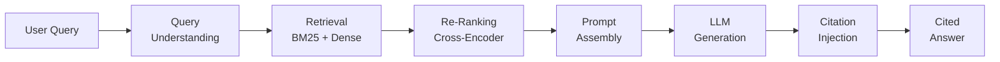
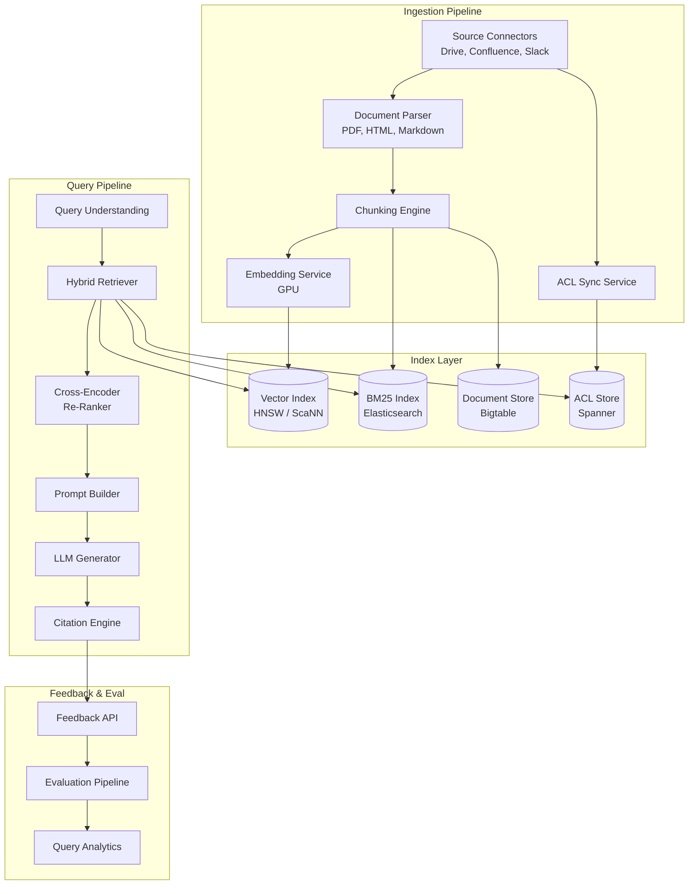
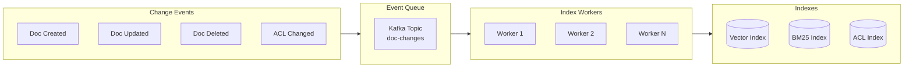

# Design an Enterprise RAG System

---

## What We're Building

A **Retrieval-Augmented Generation (RAG)** system for enterprise knowledge bases — think Google's internal knowledge search, Notion AI, or Glean. The system answers natural language questions by retrieving relevant documents from a company's knowledge base and generating grounded, cited answers using an LLM.

**The key difference from a chatbot:** Every claim must be traceable to a source document. Hallucination is not just annoying — it's a business risk.

### Why RAG Beats Fine-Tuning for Enterprise

| Approach | Pros | Cons |
|----------|------|------|
| **Fine-tuning** | Fast inference, no retrieval latency | Stale knowledge, expensive retraining, hallucination |
| **RAG** | Up-to-date knowledge, citations, ACL-aware | Retrieval latency, chunking complexity |
| **RAG + Fine-tuning** | Best quality + grounding | Most complex, highest cost |

!!! warning
    "Just fine-tune" is the wrong answer for enterprise. Documents change daily, access controls matter, and auditability (citations) is mandatory. RAG is the right foundation.

### Real-World Scale

| Metric | Scale |
|--------|-------|
| **Documents** | 10M–100M (wiki pages, PDFs, Slack, Docs, code) |
| **Users** | 100K employees |
| **Queries/day** | 500K |
| **Data sources** | 15+ (Google Drive, Confluence, Slack, Jira, GitHub, etc.) |
| **Update frequency** | Thousands of document changes per hour |
| **Access control** | Per-document ACLs with group inheritance |

---

## Key Concepts Primer

### The RAG Pipeline



### Chunking Strategies

Documents must be split into chunks for embedding. Chunking quality directly determines retrieval quality.

| Strategy | How It Works | Best For |
|----------|-------------|----------|
| **Fixed-size** | Split every 512 tokens with overlap | Simple, baseline |
| **Recursive** | Split by paragraph → sentence → word | Structured text |
| **Semantic** | Group sentences by embedding similarity | Varied documents |
| **Document-aware** | Respect headers, sections, tables | Technical docs, wikis |
| **Parent-child** | Embed small chunks, retrieve parent context | Long documents |

```python
class SemanticChunker:
    """Split document into semantically coherent chunks."""
    
    def __init__(self, embedding_model, max_chunk_tokens: int = 512, 
                 similarity_threshold: float = 0.75):
        self.embedding_model = embedding_model
        self.max_chunk_tokens = max_chunk_tokens
        self.similarity_threshold = similarity_threshold
    
    def chunk(self, document: str) -> list[Chunk]:
        sentences = self._split_sentences(document)
        embeddings = self.embedding_model.encode(sentences)
        
        chunks = []
        current_chunk = [sentences[0]]
        current_tokens = self._count_tokens(sentences[0])
        
        for i in range(1, len(sentences)):
            similarity = self._cosine_similarity(embeddings[i - 1], embeddings[i])
            sentence_tokens = self._count_tokens(sentences[i])
            
            if (
                similarity >= self.similarity_threshold
                and current_tokens + sentence_tokens <= self.max_chunk_tokens
            ):
                current_chunk.append(sentences[i])
                current_tokens += sentence_tokens
            else:
                chunks.append(Chunk(text=" ".join(current_chunk), token_count=current_tokens))
                current_chunk = [sentences[i]]
                current_tokens = sentence_tokens
        
        if current_chunk:
            chunks.append(Chunk(text=" ".join(current_chunk), token_count=current_tokens))
        
        return chunks
```

### Hybrid Retrieval (BM25 + Dense)

Neither sparse nor dense retrieval alone is sufficient:

| Method | Strengths | Weaknesses |
|--------|-----------|------------|
| **BM25 (sparse)** | Exact keyword match, rare terms | Misses synonyms, no semantic understanding |
| **Dense (embedding)** | Semantic similarity, synonyms | Struggles with rare terms, entity names |
| **Hybrid** | Best of both | More complex, needs score fusion |

```python
class HybridRetriever:
    """Combine BM25 and dense retrieval with Reciprocal Rank Fusion."""
    
    def __init__(self, bm25_index, vector_index, reranker, k: int = 60):
        self.bm25 = bm25_index
        self.dense = vector_index
        self.reranker = reranker
        self.k = k
    
    def retrieve(self, query: str, user_acl: set[str], top_k: int = 10) -> list[ScoredChunk]:
        bm25_results = self.bm25.search(query, top_k=self.k)
        
        query_embedding = self.dense.encode(query)
        dense_results = self.dense.search(query_embedding, top_k=self.k)
        
        fused = self._reciprocal_rank_fusion(bm25_results, dense_results)
        
        acl_filtered = [r for r in fused if r.acl_groups.intersection(user_acl)]
        
        reranked = self.reranker.rerank(query, acl_filtered[:30])
        
        return reranked[:top_k]
    
    def _reciprocal_rank_fusion(self, *result_lists, k: int = 60) -> list[ScoredChunk]:
        scores: dict[str, float] = {}
        chunk_map: dict[str, ScoredChunk] = {}
        
        for results in result_lists:
            for rank, chunk in enumerate(results):
                scores[chunk.id] = scores.get(chunk.id, 0) + 1.0 / (k + rank + 1)
                chunk_map[chunk.id] = chunk
        
        sorted_ids = sorted(scores, key=scores.get, reverse=True)
        return [chunk_map[cid] for cid in sorted_ids]
```

---

## Step 1: Requirements Clarification

### Questions to Ask

| Question | Why It Matters |
|----------|----------------|
| How many data sources? | Determines connector complexity |
| Document types? | PDF, wiki, Slack, code — different parsing |
| Access control model? | Per-doc ACLs? Group-based? Role-based? |
| Freshness requirement? | Minutes? Hours? Near-real-time? |
| Answer quality bar? | Must cite sources? Confidence threshold? |
| Multi-language? | Multilingual embeddings needed? |

### Functional Requirements

| Requirement | Priority | Description |
|-------------|----------|-------------|
| Natural language Q&A | Must have | Answer questions using knowledge base |
| Citations | Must have | Every claim links to source document |
| Access control | Must have | Users only see docs they have access to |
| Multi-source ingestion | Must have | Google Drive, Confluence, Slack, etc. |
| Near-real-time updates | Should have | New/edited docs searchable within minutes |
| Conversational follow-ups | Should have | Multi-turn refinement of answers |
| Feedback collection | Nice to have | Thumbs up/down on answers |
| Analytics dashboard | Nice to have | Popular queries, gaps, source quality |

### Non-Functional Requirements

| Requirement | Target | Rationale |
|-------------|--------|-----------|
| **End-to-end latency** | < 3 seconds | Users won't wait longer |
| **Retrieval recall@10** | > 85% | Must find the right document |
| **Faithfulness** | > 95% | Answers must be grounded in retrieved docs |
| **Availability** | 99.9% | Enterprise-grade SLA |
| **Freshness** | < 15 min | Document changes reflected quickly |

### API Design

```python
# POST /v1/ask
{
    "query": "What is our parental leave policy?",
    "conversation_id": "conv-123",   # optional, for follow-ups
    "filters": {
        "sources": ["confluence", "google-drive"],
        "date_range": {"after": "2024-01-01"}
    },
    "max_sources": 5
}

# Response
{
    "answer": "Our parental leave policy provides 18 weeks of paid leave for all new parents. This applies to both birth and adoptive parents, effective from the date of birth or placement. [1][2]",
    "citations": [
        {
            "id": 1,
            "title": "Parental Leave Policy 2024",
            "source": "confluence",
            "url": "https://wiki.internal/hr/parental-leave",
            "snippet": "...18 weeks of fully paid parental leave...",
            "relevance_score": 0.94
        },
        {
            "id": 2,
            "title": "Benefits FAQ",
            "source": "google-drive",
            "url": "https://drive.google.com/d/abc123",
            "snippet": "...applies to birth and adoptive parents...",
            "relevance_score": 0.87
        }
    ],
    "confidence": 0.91,
    "conversation_id": "conv-123"
}
```

---

## Step 2: Back-of-Envelope Estimation

### Traffic

```
Employees:                    100K
Queries per employee/day:     5
Total daily queries:          500K
QPS (average):                500K / 86,400 ≈ 6
QPS (peak, 5x):               ~30
```

### Ingestion

```
Total documents:              10M
Avg document size:            3 KB of text (after extraction)
Chunks per document:          6 (avg, 512-token chunks)
Total chunks:                 60M

New/updated docs per hour:    2,000
Re-embedding rate:            2,000 × 6 chunks × 1ms = 12s of GPU time/hour
```

### Storage

```
Embeddings (768-dim, float32):
  60M × 768 × 4 bytes = ~184 GB

Chunk text + metadata:
  60M × 1 KB = 60 GB

BM25 inverted index:
  ~20 GB (term → posting list)

Total vector index:            ~264 GB (fits on 1-2 machines with HNSW)

Document store:               10M × 3 KB = 30 GB
ACL index:                    10M × 200 bytes = 2 GB
```

### Latency Budget

```
Query understanding:           50ms
BM25 retrieval:               20ms
Dense retrieval (ANN):        30ms
Fusion + ACL filtering:       10ms
Re-ranking (cross-encoder):   100ms (batch of 30 chunks)
Prompt assembly:              10ms
LLM generation (500 tokens):  2,000ms
Citation post-processing:     30ms
─────────────────────────────
Total:                        ~2,250ms  ✓ (under 3s budget)
```

---

## Step 3: High-Level Design



---

## Step 4: Deep Dive

### 4.1 Ingestion Pipeline

```mermaid
flowchart LR
    subgraph src["Data Sources"]
        GDrive[Google Drive]
        Confluence[Confluence]
        Slack[Slack]
        GitHub[GitHub]
        Jira[Jira]
    end

    subgraph conn["Connector Layer"]
        CDC[Change Data<br/>Capture]
        Webhook[Webhook<br/>Listeners]
        Poller[Periodic<br/>Poller]
    end

    subgraph proc["Processing Pipeline"]
        Extract[Text<br/>Extraction]
        Dedup[Deduplication]
        Chunk[Chunking]
        Embed[Embedding<br/>Generation]
        ACL[ACL<br/>Resolution]
    end

    subgraph stor["Storage"]
        VDB[(Vector DB)]
        Search[(Search Index)]
        Meta[(Metadata Store)]
    end

    src --> conn --> proc --> stor
```



**Connector design per source:**

| Source | Update Mechanism | Parsing Challenge |
|--------|-----------------|-------------------|
| **Google Drive** | Push notifications API + periodic crawl | PDF, Docs, Sheets (different parsers) |
| **Confluence** | Webhook on page update | HTML with macros, nested pages |
| **Slack** | Events API (real-time) | Thread structure, attachments |
| **GitHub** | Webhooks on push/PR | Code + markdown, repo structure |
| **Jira** | Webhooks on issue update | Structured fields + free text |

```python
class IngestionPipeline:
    """Process a document update event into indexed chunks."""
    
    async def process_document(self, event: DocumentEvent):
        raw_content = await self.connector.fetch(event.source, event.doc_id)
        
        text = self.parser.extract_text(raw_content, format=event.format)
        metadata = self.parser.extract_metadata(raw_content)
        
        acl_groups = await self.acl_resolver.resolve(event.source, event.doc_id)
        
        chunks = self.chunker.chunk(text, metadata=metadata)
        
        embeddings = await self.embedding_service.encode_batch(
            [c.text for c in chunks]
        )
        
        old_chunk_ids = await self.doc_store.get_chunk_ids(event.doc_id)
        
        async with self.transaction() as tx:
            await tx.delete_chunks(old_chunk_ids)
            for chunk, embedding in zip(chunks, embeddings):
                chunk.doc_id = event.doc_id
                chunk.acl_groups = acl_groups
                chunk.embedding = embedding
                await tx.upsert_chunk(chunk)
            await tx.upsert_document_metadata(event.doc_id, metadata)
        
        await self.vector_index.refresh(event.doc_id)
        await self.bm25_index.refresh(event.doc_id)
```

### 4.2 ACL-Aware Retrieval

The hardest enterprise requirement. Users must only see documents they have access to.

```python
class ACLAwareRetriever:
    """Retrieval with access control enforcement."""
    
    def retrieve(self, query: str, user: User, top_k: int = 10) -> list[ScoredChunk]:
        user_groups = self.acl_service.get_user_groups(user.id)
        
        candidates = self.hybrid_retriever.retrieve(query, top_k=100)
        
        authorized = []
        for chunk in candidates:
            if self._check_access(chunk.acl_groups, user_groups):
                authorized.append(chunk)
            if len(authorized) >= top_k * 3:
                break
        
        reranked = self.reranker.rerank(query, authorized[:30])
        return reranked[:top_k]
    
    def _check_access(self, doc_acl: set[str], user_groups: set[str]) -> bool:
        return bool(doc_acl.intersection(user_groups))
```

**ACL enforcement strategies:**

| Strategy | Pros | Cons |
|----------|------|------|
| **Pre-filter** (filter in vector DB query) | Fast, scales | Requires ACL-aware index; complex |
| **Post-filter** (retrieve broadly, filter after) | Simple implementation | Over-fetches; low recall if many restricted docs |
| **Per-user index** | Perfect precision | Enormous storage; impractical at scale |
| **Group-partitioned index** | Good balance | Cold start for new groups |

!!! tip
    At Google scale, the recommended approach is **post-filter with over-fetch**: retrieve 5-10x more candidates than needed, filter by ACL, then re-rank the survivors. This works when < 50% of docs are restricted for any given user.

### 4.3 Query Understanding

```python
class QueryUnderstanding:
    """Transform raw user query into optimized retrieval queries."""
    
    async def process(self, query: str, conversation: list[dict] | None) -> QueryPlan:
        if conversation:
            query = await self._resolve_coreferences(query, conversation)
        
        intent = await self._classify_intent(query)
        
        retrieval_queries = await self._generate_retrieval_queries(query)
        
        filters = self._extract_filters(query)
        
        return QueryPlan(
            original_query=query,
            resolved_query=query,
            intent=intent,
            retrieval_queries=retrieval_queries,
            filters=filters,
        )
    
    async def _resolve_coreferences(self, query: str, conversation: list[dict]) -> str:
        """Resolve pronouns and references using conversation context.
        
        'What about for engineers?' → 'What is the parental leave policy for engineers?'
        """
        recent_context = conversation[-4:]
        prompt = f"""Given this conversation:
{recent_context}

Rewrite this follow-up to be self-contained:
"{query}"

Rewritten query:"""
        return await self.small_llm.generate(prompt, max_tokens=100)
    
    async def _generate_retrieval_queries(self, query: str) -> list[str]:
        """Generate multiple retrieval queries for better recall.
        
        'PTO policy for APAC' → [
            'PTO policy for APAC',
            'paid time off Asia Pacific',
            'vacation days policy APAC region',
            'leave policy international employees'
        ]
        """
        prompt = f"""Generate 3 alternative search queries for: "{query}"
Each should use different words but same meaning. One line each."""
        alternatives = await self.small_llm.generate(prompt, max_tokens=200)
        return [query] + alternatives.strip().split("\n")[:3]
```

### 4.4 Prompt Assembly and Citation

```python
class PromptBuilder:
    """Assemble the RAG prompt with retrieved context."""
    
    SYSTEM_PROMPT = """You are an enterprise knowledge assistant. Answer questions 
using ONLY the provided context. Follow these rules:
1. Cite every claim using [1], [2], etc. matching the source numbers below.
2. If the context doesn't contain enough information, say "I don't have enough 
   information to answer this fully" and explain what's missing.
3. Never make up information not in the provided context.
4. If sources conflict, mention the conflict and cite both sources."""

    def build(self, query: str, chunks: list[ScoredChunk], 
              conversation: list[dict] | None = None) -> list[dict]:
        context_block = self._format_context(chunks)
        
        messages = [{"role": "system", "content": self.SYSTEM_PROMPT}]
        
        if conversation:
            messages.extend(conversation[-6:])
        
        user_message = f"""Context:
{context_block}

Question: {query}

Provide a comprehensive answer with citations [1], [2], etc."""
        
        messages.append({"role": "user", "content": user_message})
        return messages
    
    def _format_context(self, chunks: list[ScoredChunk]) -> str:
        sections = []
        for i, chunk in enumerate(chunks, 1):
            sections.append(
                f"[{i}] Source: {chunk.title} ({chunk.source})\n"
                f"URL: {chunk.url}\n"
                f"Content: {chunk.text}\n"
            )
        return "\n---\n".join(sections)


class CitationEngine:
    """Extract and validate citations from LLM output."""
    
    def process(self, answer: str, chunks: list[ScoredChunk]) -> CitedAnswer:
        citations = self._extract_citation_refs(answer)
        
        validated_citations = []
        for ref_num in citations:
            if 1 <= ref_num <= len(chunks):
                chunk = chunks[ref_num - 1]
                if self._verify_grounding(answer, chunk.text, ref_num):
                    validated_citations.append(Citation(
                        ref=ref_num,
                        title=chunk.title,
                        url=chunk.url,
                        snippet=self._extract_relevant_snippet(answer, chunk.text, ref_num),
                        score=chunk.score,
                    ))
        
        return CitedAnswer(
            text=answer,
            citations=validated_citations,
            confidence=self._compute_confidence(answer, validated_citations),
        )
    
    def _verify_grounding(self, answer: str, source_text: str, ref_num: int) -> bool:
        """Check that the cited claim is actually supported by the source."""
        claim = self._extract_claim_for_ref(answer, ref_num)
        return self.nli_model.entails(premise=source_text, hypothesis=claim)
```

### 4.5 Evaluation Pipeline

```python
class RAGEvaluator:
    """Evaluate RAG system quality across multiple dimensions."""
    
    def evaluate(self, query: str, answer: str, 
                 retrieved_chunks: list[ScoredChunk],
                 ground_truth: str | None = None) -> EvalResult:
        return EvalResult(
            faithfulness=self._eval_faithfulness(answer, retrieved_chunks),
            relevance=self._eval_relevance(query, answer),
            retrieval_quality=self._eval_retrieval(query, retrieved_chunks, ground_truth),
            citation_quality=self._eval_citations(answer, retrieved_chunks),
        )
    
    def _eval_faithfulness(self, answer: str, chunks: list[ScoredChunk]) -> float:
        """Is the answer grounded in the retrieved context? (0-1)
        
        Method: Decompose answer into atomic claims, check each against context.
        """
        claims = self.claim_decomposer.decompose(answer)
        context = " ".join(c.text for c in chunks)
        
        supported = sum(
            1 for claim in claims
            if self.nli_model.entails(premise=context, hypothesis=claim)
        )
        return supported / len(claims) if claims else 0.0
    
    def _eval_relevance(self, query: str, answer: str) -> float:
        """Does the answer address the query? (0-1)"""
        prompt = f"""Rate how well this answer addresses the question (0-10):
Question: {query}
Answer: {answer}
Score (0-10):"""
        score = float(self.judge_llm.generate(prompt, max_tokens=5))
        return score / 10.0
    
    def _eval_retrieval(self, query: str, chunks: list[ScoredChunk], 
                        ground_truth: str | None) -> dict:
        """Retrieval quality metrics."""
        if not ground_truth:
            return {"note": "no ground truth available"}
        
        relevant = [c for c in chunks if self._is_relevant(c, ground_truth)]
        k = len(chunks)
        return {
            "recall_at_k": len(relevant) / max(1, self._count_relevant_total(query)),
            "precision_at_k": len(relevant) / k,
            "mrr": 1.0 / (chunks.index(relevant[0]) + 1) if relevant else 0.0,
        }
```

**Evaluation metrics summary:**

| Metric | What It Measures | Target | Method |
|--------|-----------------|--------|--------|
| **Faithfulness** | Is answer grounded in context? | > 95% | NLI per claim |
| **Answer relevance** | Does it address the query? | > 85% | LLM-as-judge |
| **Retrieval recall@10** | Did we find the right docs? | > 85% | vs human labels |
| **Citation precision** | Are citations accurate? | > 90% | NLI verification |
| **Hallucination rate** | Claims not in context? | < 5% | 1 - faithfulness |

### 4.6 Incremental Index Updates



**Update strategies:**

| Strategy | Latency | Complexity | When to Use |
|----------|---------|------------|-------------|
| **Inline update** | Seconds | Low | < 100 updates/min |
| **Micro-batch** | 1-5 min | Medium | 100-10K updates/min |
| **Full rebuild** | Hours | Low | Nightly for consistency |
| **Hybrid** | Minutes + nightly | Medium | Production recommendation |

---

## Step 5: Scaling & Production

### Failure Handling

| Failure | Detection | Recovery |
|---------|-----------|----------|
| **Embedding service down** | Health check | Queue updates; serve from stale index |
| **Vector DB unavailable** | Timeout | Fall back to BM25-only retrieval |
| **LLM overloaded** | Queue depth > 100 | Return "retrieved sources" without LLM answer |
| **Source connector failure** | Crawl error rate > 10% | Alert; use last-known-good index |
| **ACL sync lag** | Freshness check | Fail closed (deny access to unsynced docs) |

### Monitoring

| Metric | Alert Threshold |
|--------|----------------|
| **End-to-end latency P95** | > 5s |
| **Retrieval recall** | < 80% (sampled eval) |
| **Faithfulness score** | < 90% (sampled eval) |
| **Index freshness** | > 30 min behind |
| **ACL sync lag** | > 15 min |
| **"I don't know" rate** | > 30% (indicates index gaps) |

### Trade-offs

| Decision | Option A | Option B | Recommendation |
|----------|----------|----------|----------------|
| **Chunking** | Fixed 512 tokens | Semantic chunking | Semantic for quality; fixed as fallback |
| **Embedding model** | OpenAI (1536-dim) | Open-source (768-dim) | Open-source for data privacy; OpenAI for quick start |
| **ACL enforcement** | Pre-filter in vector DB | Post-filter | Post-filter with over-fetch (simpler, safer) |
| **Retrieval** | Dense only | Hybrid BM25 + dense | Hybrid always (5-15% recall improvement) |
| **Reranker** | Skip | Cross-encoder | Cross-encoder (significant quality boost, 100ms cost) |
| **"Don't know"** | Always answer | Abstain when uncertain | Abstain (enterprise users prefer "I don't know" over wrong answers) |

---

## Interview Tips

!!! tip
    **What Google interviewers look for in RAG design:**
    1. "How do you handle access control?" — This separates enterprise RAG from toy RAG
    2. "How do you know the answer is correct?" — Evaluation methodology, faithfulness checking
    3. "What happens when a document is updated?" — Incremental indexing pipeline
    4. "Why not just fine-tune?" — Understanding of when RAG vs fine-tuning is appropriate
    5. "How do you handle multi-turn conversations?" — Query rewriting, context management

---

## Hypothetical Interview Transcript

!!! note
    This transcript simulates a 45-minute Google L5/L6 system design round. The interviewer is a Staff Engineer on the Cloud AI team.

---

**Interviewer:** Design a system that lets employees search their company's internal knowledge base using natural language and get AI-generated answers with citations. Think Glean or Google's internal search.

**Candidate:** Great problem. Let me start with clarifying questions. How many data sources are we integrating? Are we talking about a single company or a multi-tenant platform? What's the access control model — is every document visible to everyone, or are there per-document permissions?

**Interviewer:** Let's say 10–15 data sources — Google Drive, Confluence, Slack, Jira, GitHub. Single company with 100K employees. Per-document access controls with group-based permissions.

**Candidate:** Understood. So roughly 10 million documents, 100K users, maybe 500K queries per day. The access control requirement is critical — this is what separates enterprise RAG from a simple demo.

Let me outline the two main subsystems: an **ingestion pipeline** that continuously indexes documents, and a **query pipeline** that retrieves and generates answers.

For ingestion: each data source needs a connector. Some support webhooks (Confluence, Slack), others need periodic polling (some Drive APIs). When a document changes, we extract text — which means different parsers for PDFs, HTML, Markdown, etc. — chunk it into ~512-token segments, generate embeddings, and store them in a vector index. Critically, we also sync the ACL for each document — which groups have access.

For query: the user submits a natural language question. We run hybrid retrieval — both BM25 for keyword matching and dense retrieval for semantic matching. We fuse the results using Reciprocal Rank Fusion, filter by the user's access groups, re-rank with a cross-encoder, then assemble a prompt with the top chunks and send it to an LLM for answer generation with citations.

**Interviewer:** Let's dig into the retrieval. Why hybrid? Why not just dense retrieval?

**Candidate:** Dense retrieval alone fails on two common enterprise query types.

First, **exact entity names**. If someone searches for "PROJ-4521 deployment status," dense retrieval might return documents about deployments in general but miss the specific Jira ticket. BM25 will find it because it matches the exact token "PROJ-4521."

Second, **rare technical terms**. If someone searches for an internal acronym like "GSLB configuration," the embedding model might not have seen this term during training. BM25 handles this naturally.

Conversely, BM25 alone fails on semantic queries like "how do I request time off?" when the document says "PTO request process." Dense retrieval bridges synonyms.

Hybrid with RRF gives us the best of both. In my experience, hybrid retrieval improves recall@10 by 10-15% over either method alone.

**Interviewer:** Good. Now, access control. How do you actually enforce it in the retrieval path?

**Candidate:** This is the hardest part of enterprise RAG. There are three approaches:

**Pre-filtering** — encode ACL groups as metadata in the vector index and filter during the ANN search. This is the most efficient but is hard to implement correctly. Not all vector DBs support efficient filtered search, and ACL changes require re-indexing.

**Post-filtering** — retrieve more candidates than needed (say 100 instead of 10), filter by the user's group memberships, then re-rank the survivors. This is simpler to implement and handles ACL changes instantly (just update the ACL store). The risk is low recall if many top candidates are filtered out.

**Hybrid approach** — post-filter with adaptive over-fetch. If a user has access to most documents, fetch 2x. If they have restricted access, fetch 10x. We monitor the "filter ratio" and adjust.

I'd recommend post-filtering for V1 because it's simpler and ACL changes take effect immediately. For a user with 100K employees where most documents are team-internal, typically 30-50% of candidates survive the ACL filter, so fetching 3-5x is sufficient.

One critical safety principle: if we're unsure about a document's ACL — say the sync is lagging — we must **fail closed** and deny access. Showing a user a document they shouldn't see is far worse than missing a result.

**Interviewer:** How do you make sure the LLM's answer is actually grounded in the retrieved documents? Hallucination is a big concern.

**Candidate:** Defense in depth, at multiple stages:

**Prompt engineering.** The system prompt explicitly instructs: "Answer ONLY using the provided context. Cite every claim. If you don't have enough information, say so." This is necessary but not sufficient.

**Citation verification.** After the LLM generates an answer, we decompose it into atomic claims — "parental leave is 18 weeks," "it applies to adoptive parents." For each claim, we run an NLI (Natural Language Inference) model to check if the cited source actually entails that claim. If a claim isn't supported, we either remove it or flag it as uncertain.

**Abstention.** If fewer than 2 relevant chunks score above a confidence threshold after re-ranking, we proactively say "I don't have enough information" instead of generating a potentially hallucinated answer. Users prefer honesty over confident wrong answers.

**Continuous evaluation.** We sample 1% of production queries and run them through our evaluation pipeline. We track faithfulness (% of claims grounded in context), answer relevance, and citation accuracy. Any drop below our thresholds triggers an alert.

**Interviewer:** How do you handle document updates? If someone edits a wiki page, how quickly is that reflected?

**Candidate:** Our ingestion pipeline is event-driven. When a wiki page is updated, Confluence sends a webhook. Our connector service receives it, fetches the updated content, re-parses and re-chunks the document, generates new embeddings, and atomically replaces the old chunks in both the vector index and BM25 index.

The latency breakdown: webhook delivery ~1s, fetch + parse ~2s, chunking ~500ms, embedding generation ~1s (batch of 6 chunks), index update ~500ms. Total: about 5 seconds from edit to searchable.

For sources that don't support webhooks, we run periodic crawlers — every 5-15 minutes — that check for changes using last-modified timestamps or ETags.

There's an important consistency question: what if a user queries while an update is in progress? I'd use a versioned approach — the old chunks remain in the index until the new chunks are fully committed. We swap atomically. This means a query might see slightly stale content for a few seconds, but it will never see a partially-indexed document.

**Interviewer:** Last question. How would you evaluate whether this system is actually useful to employees?

**Candidate:** I'd measure at three levels:

**Retrieval quality** — for a golden set of query-document pairs (labeled by human annotators), measure recall@10 and MRR. Target: recall@10 > 85%. We'd build this golden set by sampling real queries and having domain experts identify the correct source documents.

**Answer quality** — faithfulness (are claims grounded?), relevance (does it address the query?), and citation accuracy. We'd use a combination of NLI models and LLM-as-judge scoring on a daily sample. Target: faithfulness > 95%.

**User satisfaction** — thumbs up/down on answers (target: > 70% thumbs up), click-through rate on citations (are users actually checking sources?), and repeat usage rate (are people coming back?).

**Knowledge gap detection** — queries where we return "I don't know" are gold. They tell us which documents are missing from the knowledge base. I'd surface a weekly report to knowledge managers: "These 50 questions were asked but couldn't be answered. Consider creating documentation for these topics."

**Interviewer:** Great depth, especially on the ACL enforcement and evaluation. That's a wrap.
