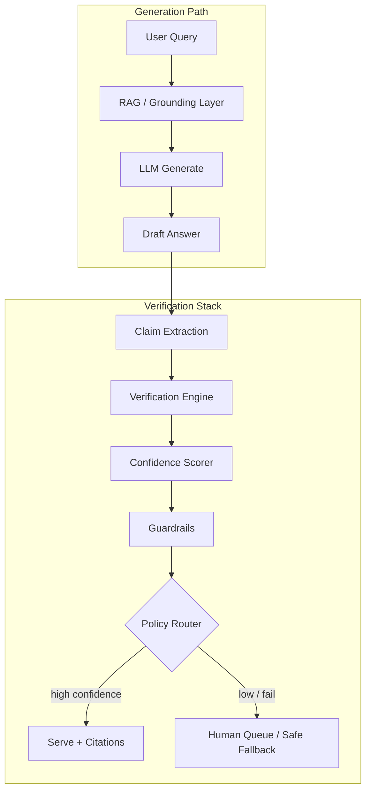
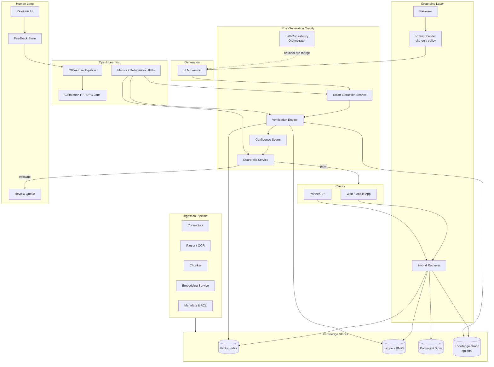
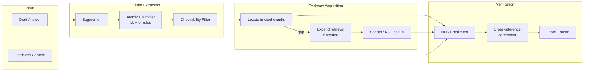
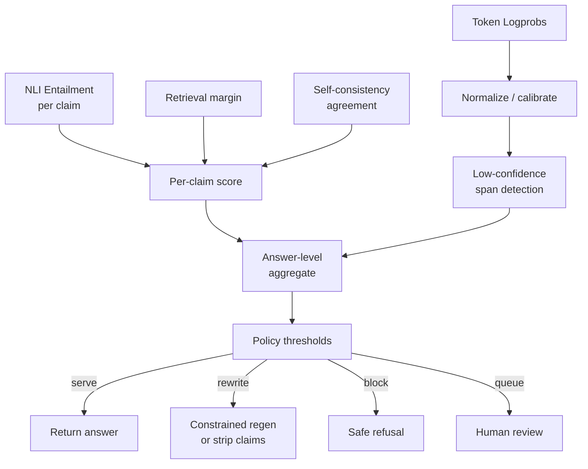
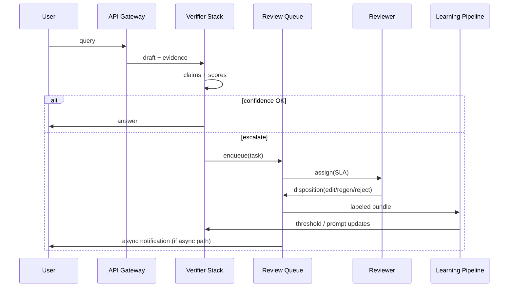

# Design a System to Detect and Prevent LLM Hallucinations

---

## What We're Building

A **customer-facing generative AI product** (support assistant, copilot, or Q&A surface) where **wrong but confident answers** create legal, reputational, and user-trust risk. We need an **end-to-end reliability layer** that **detects**, **prevents where possible**, and **contains** hallucinations — not a single trick, but **defense in depth**: grounding with citations, statistical checks, fact verification, calibrated confidence, guardrails, human review, and continuous measurement.

**Scope:** The system sits **around** the LLM — ingestion for knowledge, retrieval for grounding, post-generation verification, routing to humans when uncertain, and feedback loops into models and prompts.

### Why This Problem Is Hard

| Challenge | Description |
|-----------|-------------|
| **Open-ended outputs** | Unlike classification, every completion can introduce new unsupported claims |
| **Plausible fluency** | Models sound authoritative even when wrong; users over-trust fluent text |
| **No single oracle** | Ground truth is partial (KB stale), expensive (human labels), or absent (novel queries) |
| **Latency vs. depth** | Strong verification (search, NLI, multi-sample) adds hundreds of ms to seconds |
| **Calibration mismatch** | Token probabilities are often **poorly calibrated** for “truth”; low perplexity ≠ factual |
| **Long contexts** | More retrieved text increases grounding opportunity **and** contradiction / lost-in-middle risk |
| **Adversarial & edge cases** | Jailbreaks, leading questions, and domain drift break naive guardrails |
| **Measurement** | “Hallucination rate” must be **defined**, **sampled**, and **decomposed** (intrinsic vs. extrinsic) |

### Real-World Scale

| Metric | Scale (illustrative enterprise / consumer product) |
|--------|-----------------------------------------------------|
| **Generations / day** | 5M–50M (support bot, copilot, or in-app assistant) |
| **Peak generation QPS** | 200–2,000 (regional peaks 3–5× average) |
| **Knowledge documents** | 1M–20M chunks in vector + lexical indexes |
| **Human reviewers (FTE-equivalent)** | 50–500 (queue depth SLA-driven) |
| **Verification calls (NLI + search)** | 2–10× claim count per answer on strict tiers |
| **Target end-to-end latency (P95)** | 2–8 s (tiered: fast path vs. high-assurance path) |
| **False omission tolerance** | Low for regulated answers; product accepts more “I don’t know” in high-risk intents |

!!! warning
    **No single technique eliminates hallucination.** Interviews reward candidates who articulate **layered controls**, **explicit abstention**, **measurable residual risk**, and **when to spend** compute vs. human time.

---

## Key Concepts Primer

### Hallucination Types (Useful Taxonomy)

| Type | Definition | Typical mitigation |
|------|------------|-------------------|
| **Intrinsic** | Contradicts user prompt or retrieved context | Grounding prompts, NLI vs. context, citation enforcement |
| **Extrinsic** | Not supported by world / KB | Search, KG lookup, fact-check pipeline, abstain |
| **Confabulation** | Fabricated specifics (names, numbers, URLs) | Regex/structured validators, allowlists, retrieval-first for facts |



### Grounding via RAG and Citations

**Grounding** ties each substantive statement to **evidence spans** in retrieved documents. **Citations** are the UX and audit layer; **NLI or entailment** checks are the enforcement layer.

!!! tip
    In production, separate **“model cited a source”** from **“source entails the claim.”** Citation markers are easy to game; **automatic claim–evidence verification** catches silent hallucinations.

### Self-Consistency

**Self-consistency:** sample **N** independent answers (different temperatures or prompts), then **compare** — e.g., vote on claims, measure pairwise ROUGE/BERTScore, or ask a judge model. High disagreement ⇒ **epistemic uncertainty** ⇒ downgrade confidence or escalate.

### Fact-Checking Pipeline (Claims → Verify)

1. **Segment** answer into sentences or **atomic claims** (subject–predicate–object style or short propositions).  
2. For each claim, **retrieve** candidate evidence (KB, web search API, KG).  
3. **Classify** support: **supported / refuted / not enough evidence** (NLI, retrieval score threshold, or LLM judge with constraints).  
4. **Aggregate** into answer-level decision: block, rewrite, add disclaimer, or route to human.

### Confidence from Log Probabilities

**Token logprobs** sum (or average per token) to a **sequence score**. Useful as a **cheap signal**, not a calibrated probability of truth.

Common aggregates:

- **Mean log-likelihood per token:** \(\frac{1}{T} \sum_t \log p(x_t \mid x_{<t})\)
- **Min-token logprob:** flags **single-token** brittleness (rare entities)
- **Per-span aggregation:** highlight low-confidence spans for UI or downstream NLI

!!! note
    Open/closed-book behavior differs: low logprob may mean “model is guessing” or “model is memorizing an incorrect fact confidently.” Always combine with **external verification** for high-stakes claims.

### Guardrails

| Class | Example |
|-------|---------|
| **Regex / grammar** | Block fake phone formats, invented SKUs when schema known |
| **Structured KB** | “If product_id not in catalog API → do not assert price” |
| **LLM judge** | Second pass: “Is this claim entailed by CONTEXT?” (costly; use on sampled or risky intents) |

### Human-in-the-Loop (HITL)

Queue **tasks** with: draft answer, risk score, intent, user tier, SLA, and **evidence bundle** (retrieved chunks, verification outputs). Review outcomes feed **supervised data** for calibration, prompt tuning, and **fine-tuning**.

### Calibration and “I Don’t Know”

**Fine-tuning / preference optimization** (DPO, RLHF) can reward **abstention** when evidence is weak — e.g., train on (question, context, correct refusal) pairs. Combine with **policy**: if `max(verification_score) < τ`, return templated refusal instead of creative completion.

---

## Step 1: Requirements Clarification

### Questions to Ask

| Question | Why It Matters |
|----------|----------------|
| Which **domains** (medical, legal, shopping, internal IT)? | Drives risk tiering and evidence sources |
| Is **web search** allowed for verification? | Latency, compliance, and licensing |
| **Latency SLA** by intent? | Determines which checks run inline vs. async |
| **Languages** and locales? | NLI models, search indexes, reviewer pools |
| **Audit / retention** requirements? | Logging of prompts, claims, and reviewer actions |
| **User-visible behavior** on failure? | Silent downgrade vs. explicit “we’re checking” |
| **Knowledge freshness**? | KG vs. search vs. crawl; stale KB ⇒ extrinsic hallucinations |
| **Attack model** (jailbreak, prompt injection)? | Input sanitization, tool isolation |

### Functional Requirements

| Requirement | Priority | Description |
|-------------|----------|-------------|
| RAG grounding + citations | Must have | Retrieve evidence; require citation markers for factual intents |
| Claim extraction | Must have | Decompose answer into checkable units |
| Verification vs. KB / search | Must have | Support / refute / unknown per claim |
| Confidence scoring | Must have | Answer- and span-level scores for routing |
| Self-consistency (optional path) | Should have | N-sample check for high-risk or low-margin decisions |
| Guardrails (regex + LLM) | Must have | Block known failure patterns; consistency checks |
| Human review queue | Must have | Escalate low-confidence or policy triggers |
| Feedback loop | Should have | Reviewer labels → eval sets → training / prompts |
| Calibration / abstention policy | Should have | Template refusals when evidence insufficient |
| Hallucination rate metrics | Must have | Online proxies + offline gold sets |

### Non-Functional Requirements

| Requirement | Target | Rationale |
|-------------|--------|-----------|
| P95 latency (standard tier) | 2–4 s | Competitive UX for chat |
| P95 latency (high-assurance tier) | 6–12 s acceptable | Deep verification + optional HITL async |
| Verification precision | High on “block” path | False blocks erode trust; tune thresholds |
| Availability | 99.9%+ | Degrade to safe answers if verifiers fail |
| Cost per answer | Bounded | Cap NLI/search calls per request; cache results |
| Privacy | Region / tenant isolation | Evidence bundles may contain PII |

### API Design

```python
# POST /v1/assist
# Request
{
    "session_id": "sess-8f3a",
    "user_id": "usr-1029",
    "tenant_id": "acme-corp",
    "query": "What is the warranty period for SKU-4491 in the EU?",
    "tier": "standard",  # standard | high_assurance
    "locale": "en-GB",
    "allow_web_verify": false,
    "stream": true
}

# Response (non-streaming aggregate; streaming sends deltas + final envelope)
{
    "answer": "For SKU-4491, the EU warranty is 24 months from date of purchase...",
    "citations": [
        {"id": 1, "doc_id": "pol-warranty-2024", "span": "EU commercial warranty: 24 months...", "url": "..."}
    ],
    "claims": [
        {
            "id": "c1",
            "text": "EU warranty for SKU-4491 is 24 months from purchase.",
            "verification": "supported",
            "evidence_ids": [1],
            "scores": {"nli_entailment": 0.94, "retrieval": 0.88}
        }
    ],
    "confidence": {
        "answer": 0.91,
        "low_confidence_spans": [{"start": 120, "end": 145, "token_min_logprob": -8.2}]
    },
    "routing": "served",
    "self_consistency": {"n_samples": 5, "pairwise_agreement": 0.86},
    "review_task_id": null,
    "policy_flags": []
}
```

---

## Step 2: Back-of-Envelope Estimation

### Traffic

```
Daily generations:              10,000,000
Avg peak factor:                4×
Seconds per day:                86,400

Average QPS:                    10M / 86,400 ≈ 116
Peak QPS:                       ~460

High-assurance tier:            10% of traffic → ~46 peak QPS
Claims per answer (avg):        4
NLI inferences / answer (std):  4 claims × 2 passages avg = 8
Peak NLI calls / sec (std):     460 × 8 ≈ 3,700 (batched on GPU)
```

### Storage

```
Chunk store (text + metadata):   5M chunks × 1.5 KB ≈ 7.5 GB
Vector index (768-dim float32):  5M × 768 × 4 B ≈ 15 GB
Verification cache (hot):        1M entries × 2 KB ≈ 2 GB (TTL 24–72h)
Human review metadata + bundles: 500K tasks × 50 KB ≈ 25 GB / month (compressed, tiered)

Audit log (sampled payloads):     Assume 200 GB / month → cold storage after 7 days
```

### Compute

```
LLM generation:                  Dominated by GPU serving fleet (separate sizing)
NLI / entailment model:          4–8 ms / pair on GPU at batch 32 → 3.7K QPS needs
                                 ~15–30 GPU workers (with batching + queueing)

Search / KG:                     Mostly network + CPU; cache cuts repeat queries by 40–60%
Self-consistency (N=5):          5× LLM cost for that path — reserve for ≤10% of traffic
```

### Cost (Rough Monthly, Illustrative)

| Component | Assumption | Order of magnitude |
|-----------|------------|-------------------|
| LLM tokens | 10M answers × 800 out + 2K in | Largest line item; varies by model |
| NLI GPU | 30× A10G equivalent @ partial util | $15K–$50K |
| Search API | 20M queries × $0.001 | $20K |
| Human review | 2% escalated × 2 min × loaded wage | $80K–$400K (highly variable) |

!!! note
    **Human review** often dominates **fully loaded** cost. The design should **minimize** escalations via good retrieval and calibrated routing — not eliminate them.

---

## Step 3: High-Level Design

### Architecture Overview



### Component Responsibilities

| Component | Role |
|-----------|------|
| **Ingestion pipeline** | Keeps KB fresh; versioned chunks; ACLs; dedup |
| **Grounding layer** | Retrieves evidence; builds constrained prompts; optional query decomposition |
| **LLM service** | Produces draft with citation scaffolding |
| **Claim extraction** | Sentence/claim segmentation + NER-style predicates for checkability |
| **Verification engine** | NLI vs. retrieved passages, KG triple match, search corroboration |
| **Confidence scorer** | Fuses logprobs, verifier scores, retrieval margin, self-consistency |
| **Guardrails** | Regex, allowlists, injection checks, final LLM judge (tiered) |
| **Human review queue** | SLA-based assignment; structured disposition codes |
| **Feedback loop** | Gold errors → prompts, thresholds, and training |

---

## Step 4: Deep Dive

### 4.1 Data Models

```python
from __future__ import annotations

from dataclasses import dataclass, field
from enum import Enum
from typing import Literal


class VerificationLabel(str, Enum):
    SUPPORTED = "supported"
    REFUTED = "refuted"
    INSUFFICIENT = "insufficient_evidence"


@dataclass
class EvidenceSpan:
    doc_id: str
    chunk_id: str
    text: str
    score: float


@dataclass
class Claim:
    id: str
    text: str
    char_span: tuple[int, int]
    entities: list[str] = field(default_factory=list)


@dataclass
class ClaimVerification:
    claim_id: str
    label: VerificationLabel
    evidence: list[EvidenceSpan]
    nli_scores: dict[str, float]  # e.g. entailment, neutral, contradiction


@dataclass
class AnswerArtifact:
    request_id: str
    query: str
    draft_text: str
    citations: list[EvidenceSpan]
    claims: list[Claim]
    verifications: list[ClaimVerification]
    token_logprobs: list[float] | None
    routing: Literal["served", "rewritten", "blocked", "human_pending"]
```

### 4.2 Claim Extraction and Verification Pipeline



**Algorithms (claim extraction):**

1. **Syntactic split** on sentence boundaries (spaCy, blingfire, or language-specific).  
2. **Atomic claimification:** small LLM prompt: “Split into self-contained factual claims; one JSON per line.”  
3. **Checkability filter:** drop opinions (“I think”), pure pleasantries, and claims already marked as **direct quotes** from user.  
4. **NLI:** premise = concatenated top-k evidence strings; hypothesis = claim; label = argmax(entailment, neutral, contradiction).

```python
# Claim extraction + NLI verification (Python)
from typing import Protocol


class NLIHead(Protocol):
    def predict(self, premise: str, hypothesis: str) -> dict[str, float]:
        """Returns class probabilities, keys: entailment, neutral, contradiction."""
        ...


def segment_sentences(text: str) -> list[str]:
    # Production: use a robust NLP library; placeholder splits on .?!
    import re

    return [s.strip() for s in re.split(r"(?<=[.!?])\s+", text) if s.strip()]


def claims_from_sentences(sentences: list[str], llm_decompose) -> list[str]:
    """Optionally break compound sentences into atomic claims via LLM."""
    atomic: list[str] = []
    for s in sentences:
        sub = llm_decompose(s)  # returns list[str]
        atomic.extend(sub)
    return atomic


def verify_claim(
    claim: str,
    evidence_block: str,
    nli: NLIHead,
    entailment_threshold: float = 0.7,
    contradiction_threshold: float = 0.5,
) -> tuple[VerificationLabel, dict[str, float]]:
    probs = nli.predict(premise=evidence_block[:8000], hypothesis=claim)
    ent = probs.get("entailment", 0.0)
    con = probs.get("contradiction", 0.0)

    if con >= contradiction_threshold:
        return VerificationLabel.REFUTED, probs
    if ent >= entailment_threshold:
        return VerificationLabel.SUPPORTED, probs
    return VerificationLabel.INSUFFICIENT, probs
```

**Java example — verification orchestration sketch (service layer):**

```java
public record ClaimVerificationResult(
    String claimId,
    String label,
    double entailment,
    double contradiction
) {}

public final class VerificationService {
    private final NliClient nli;
    private final EvidenceRetriever retriever;

    public ClaimVerificationResult verify(String claim, String tenantId) {
        var evidence = retriever.fetchTopK(claim, tenantId, 5);
        String premise = String.join("\n", evidence.passages());
        var p = nli.score(premise, claim);
        String label = p.contradiction() >= 0.5 ? "refuted"
            : p.entailment() >= 0.7 ? "supported"
            : "insufficient_evidence";
        return new ClaimVerificationResult(
            hashClaim(claim), label, p.entailment(), p.contradiction());
    }
}
```

**Go example — circuit breaker wrapper for NLI RPC:**

```go
type NLIClient interface {
	Score(ctx context.Context, premise, hypothesis string) (Probs, error)
}

type BreakerNLI struct {
	inner  NLIClient
	cb     *CircuitBreaker // counts failures, opens circuit
	fallback Probs         // return neutral on open circuit
}

func (b *BreakerNLI) Score(ctx context.Context, premise, hypothesis string) (Probs, error) {
	if b.cb.State() == Open {
		return b.fallback, nil
	}
	p, err := b.inner.Score(ctx, premise, hypothesis)
	if err != nil {
		b.cb.RecordFailure()
		return b.fallback, err
	}
	b.cb.RecordSuccess()
	return p, nil
}
```

### 4.3 Verification Strategies

| Strategy | When to use | Pros | Cons |
|----------|-------------|------|------|
| **Cited-chunk NLI** | Default; claim maps to `[n]` | Fast, uses already-fetched evidence | Misses if citation wrong or missing |
| **Expanded retrieval** | Low entailment on cited chunk | Improves recall | Extra latency; may pull wrong doc |
| **KG triple lookup** | Structured facts (SKU, policy IDs) | High precision | Coverage gaps; maintenance |
| **Search corroboration** | Extrinsic facts; fresh data | Broad coverage | Noise, ranking bias, compliance |
| **Cross-reference** | High stakes | Multiple independent sources agree | Cost; agreement ≠ truth (echo chamber) |

**Cross-reference check:** map claim to normalized **fact fingerprint** (entities + relation type). Require ≥2 independent URLs or ≥1 KG fact + 1 document for **auto-approve** tier.

### 4.4 Confidence Scoring

**Fusion formula (illustrative):** combine verifier, retrieval, and (optional) self-consistency into a single score in `[0,1]`.

Let:

- \(e^*\) = max entailment probability over evidence passages for the claim  
- \(r^*\) = max retrieval / reranker score for the best passage  
- \(a\) = pairwise agreement among N self-consistency samples (fraction of claim-level matches)  
- \(m\) = min normalized token logprob over answer span (mapped to `[0,1]` via sigmoid)

Example:

\[
\text{conf}_{\text{claim}} = 0.45 \cdot e^* + 0.25 \cdot r^* + 0.20 \cdot a + 0.10 \cdot m
\]

Answer-level confidence: **harmonic mean** (punishes one weak claim) or **min** over claims for strict intents.

```python
import math


def sigmoid(x: float) -> float:
    return 1.0 / (1.0 + math.exp(-x))


def token_confidence_from_logprobs(logprobs: list[float]) -> float:
    """Map average logprob to [0,1] — tune scale on held-out data."""
    if not logprobs:
        return 0.5
    avg_lp = sum(logprobs) / len(logprobs)
    # Example calibration: assume avg_lp typically in [-0.5, -8]
    return sigmoid((avg_lp + 3.0) / 2.0)


def span_min_token_flag(
    tokens: list[str],
    logprobs: list[float],
    threshold: float = -6.0,
) -> list[tuple[int, int]]:
    """Return token index ranges where logprob below threshold."""
    bad: list[tuple[int, int]] = []
    for i, lp in enumerate(logprobs):
        if lp < threshold:
            bad.append((i, i + 1))
    return bad


def fuse_claim_confidence(
    entailment: float,
    retrieval: float,
    consistency_agreement: float,
    token_conf: float,
    weights: tuple[float, float, float, float] = (0.45, 0.25, 0.20, 0.10),
) -> float:
    w_e, w_r, w_a, w_t = weights
    return w_e * entailment + w_r * retrieval + w_a * consistency_agreement + w_t * token_conf
```

### 4.5 Confidence Scoring Flow



### 4.6 Self-Consistency Checker

```python
import hashlib
from collections import Counter


def normalize_claim_text(c: str) -> str:
    return " ".join(c.lower().split())


def self_consistency_vote(
    samples: list[str],
    claim_extractor,
    nli: NLIHead,
    context: str,
) -> dict:
    """samples: N independent model answers (same prompt, T>0 or diverse prompts)."""
    claim_sets: list[set[str]] = []
    for s in samples:
        claims = claim_extractor(s)
        claim_sets.append({normalize_claim_text(c) for c in claims})

    # Simple agreement: how often each normalized claim appears across samples
    counts: Counter[str] = Counter()
    for cs in claim_sets:
        for c in cs:
            counts[c] += 1

    n = len(samples)
    agreement = {c: counts[c] / n for c in counts}

    # Verify only claims that appear in majority of samples (cost saving)
    verified = {}
    for c, ratio in agreement.items():
        if ratio < 0.5:
            continue
        label, probs = verify_claim(c, context, nli)
        verified[c] = {"support_ratio": ratio, "label": label, "nli": probs}

    pairwise = sum(agreement.values()) / max(1, len(agreement))
    return {"per_claim": verified, "mean_support_ratio": pairwise}
```

### 4.7 Guardrails Service

```python
import re
from dataclasses import dataclass


@dataclass
class GuardrailResult:
    ok: bool
    reasons: list[str]


class GuardrailPipeline:
    def __init__(self, patterns: list[tuple[str, str]], llm_judge=None):
        # (name, regex) — e.g. inventing URLs when domain allowlist enforced
        self.patterns = [(n, re.compile(p)) for n, p in patterns]
        self.llm_judge = llm_judge

    def check(self, answer: str, context: str, intent: str) -> GuardrailResult:
        reasons: list[str] = []
        for name, rx in self.patterns:
            if rx.search(answer):
                reasons.append(f"regex_hit:{name}")

        if self.llm_judge and intent in {"medical", "legal"}:
            verdict = self.llm_judge(
                f"CONTEXT:\n{context[:6000]}\n\nANSWER:\n{answer}\n"
                "Reply ONLY yes/no: Is every factual claim entailed by CONTEXT?"
            )
            if "no" in verdict.lower():
                reasons.append("llm_judge:not_entailed")

        return GuardrailResult(ok=len(reasons) == 0, reasons=reasons)
```

### 4.8 Fact Verification Pipeline (End-to-End)

```python
class FactVerificationPipeline:
    def __init__(
        self,
        retriever,
        nli: NLIHead,
        search=None,
        kg=None,
    ):
        self.retriever = retriever
        self.nli = nli
        self.search = search
        self.kg = kg

    def run(self, query: str, draft: str, citations: list[EvidenceSpan], tenant: str):
        sentences = segment_sentences(draft)
        claims = []
        for s in sentences:
            claims.extend(atomic_claims_heuristic(s))  # or LLM

        results = []
        for claim in claims:
            block = "\n".join(c.text for c in citations)
            label, probs = verify_claim(claim, block, self.nli)

            if label == VerificationLabel.INSUFFICIENT and self.search:
                hits = self.search.query(claim, tenant=tenant)
                label2, probs2 = verify_claim(claim, "\n".join(h.text for h in hits[:3]), self.nli)
                label, probs = label2, probs2

            if self.kg and looks_structured(claim):
                triple_match = self.kg.lookup(claim)
                if triple_match.conflicts:
                    label = VerificationLabel.REFUTED

            results.append((claim, label, probs))
        return results


def looks_structured(claim: str) -> bool:
    return bool(re.search(r"\bSKU-\d+\b|\bpolicy\s+id\b", claim, re.I))
```

### 4.9 Human-in-the-Loop Workflow



**Queue priorities:** `priority = risk_tier * (1 - confidence) * business_value` with **WDRR** scheduling so low-value traffic cannot starve regulated intents.

### 4.10 Caching and Circuit Breakers

| Cache key | TTL | Invalidation |
|-----------|-----|--------------|
| `(tenant, normalized_claim, evidence_version)` | 24–72 h | KB bump / doc version |
| NLI logits for `(premise_hash, hypothesis_hash)` | 7 d | Model version change |
| Search results for `claim_fingerprint` | 1–6 h | freshness SLO |

**Circuit breakers:** per dependency (NLI GPU, search API, KG). On open circuit: **fail closed** for “auto-approve” (downgrade to refusal or human queue), never **fail open** to unverified claims for high-risk intents.

---

## Step 5: Scaling & Production

### Failure Handling

| Failure | Detection | Mitigation |
|---------|-----------|------------|
| NLI service timeout | p99 latency SLO breach | Skip to retrieval-only score; escalate |
| Search quota exceeded | 429 / error rate | KG-only path; cached answers |
| Retrieval empty | recall probe | Template “no evidence”; no free-form facts |
| LLM streaming abort | partial JSON | Discard partial; retry or safe apology |
| Review queue backlog | depth / age | Auto-message; widen abstention; staff shift |

### Monitoring

| Metric | Description |
|--------|-------------|
| **Hallucination proxy rate** | Fraction of answers with any `REFUTED` or high-contradiction claim |
| **Abstention rate** | Refusals / total (track by intent) |
| **Escalation rate** | Human queue inserts / total |
| **Time-to-resolution (HITL)** | P95 reviewer latency |
| **NLI / search error budget** | Burn rate for circuit breakers |
| **Self-consistency spread** | Distribution of pairwise disagreement (drift alert) |
| **Citation–claim alignment** | % claims with valid citation index |

### Trade-offs

| Decision | Option A | Option B | Guidance |
|----------|----------|----------|----------|
| Verification depth | Always full pipeline | Tier by intent | **Tiered** is standard |
| Self-consistency | Every request | High-risk only | Control cost |
| LLM judge guardrail | Always on | Sampled / escalations only | Balance cost & recall |
| User experience | Block silently | Explain uncertainty | Regulated domains favor **transparency** |
| Metric definition | Single “hallscore” | Decomposed KPIs | **Decomposed** drives actionable fixes |

### Production Measurement of Hallucination Rate

**Offline (gold set):**

- Human annotators label each claim: *factual / unsupported / contradicted* vs. evidence set.  
- Report **claim-level precision/recall** for “supported” and **answer-level** strict pass (all claims supported).

**Online (without labels):**

- **NLI-based proxy:** rate of `INSUFFICIENT` or `REFUTED` after full verification.  
- **User signals:** thumbs down + “incorrect” reason; reviewer sampling.  
- **Contrast sets:** periodic **red-team** prompts with known answers.

\[
\text{hallucination\_proxy} \approx \frac{\#\text{answers with ≥1 refuted or high-risk insufficient}}{\#\text{answers}}
\]

!!! warning
    **Proxy metrics drift** when NLI or retrieval changes. Version models and **re-calibrate thresholds** on a fixed eval suite every release.

---

## Interview Tips

!!! tip
    **Strong answers often hit these follow-up themes:**
    1. **Defense in depth** — which layer catches which failure mode?  
    2. **Calibration honesty** — logprobs are not probabilities of truth; what do you combine them with?  
    3. **Cost cap** — how many NLI/search calls per request? Caching keys?  
    4. **Product policy** — when do you refuse vs. show with disclaimer vs. human?  
    5. **Evaluation** — separate retrieval failures from generation hallucinations.  
    6. **Latency** — async HITL vs. synchronous blocking.  
    7. **Security** — prompt injection via retrieved docs poisoning verification context.

**Common follow-up questions:**

- How do you handle **conflicting sources**?  
- What if the **user asks for a guess**?  
- How do you **A/B test** a new verifier without harming users?  
- **Multilingual** — one NLI model or per locale?  
- How do you **prove** improvement to legal/compliance?

---

## Hypothetical Interview Transcript

!!! note
    Simulated **45-minute** Google-style system design conversation. Candidate is targeting L5/L6; focus is reliability, metrics, and trade-offs.

---

**Interviewer:** Design a system that detects and prevents hallucinations in a customer-facing LLM product. You can assume we already have an LLM and some kind of knowledge base.

**Candidate:** I’ll treat “hallucination” as **unsupported or contradicted factual claims** in model outputs, relative to **allowed evidence** — retrieved docs, KG, or approved search — depending on policy. I’ll walk through **defense in depth**: grounding, automatic verification, confidence routing, guardrails, humans, and measurement.

First, clarifying questions: What **domains** matter — are we in regulated advice? Is **web search** allowed as evidence? What **latency** do we need for the default path, and do we have a **high-assurance** mode? Also, single-tenant enterprise vs. consumer scale?

**Interviewer:** Mix of **shopping support** and **internal policy Q&A**. Web search is allowed only for shopping SKU facts, not for HR policy. P95 **3 seconds** on default; we can go async for human review. Think **10M generations per day**.

**Candidate:** Got it. I’ll split **routing by intent**: policy answers use **enterprise KB + citations only**; shopping uses **KB + product API + optional search** for freshness.

At a high level: **ingestion** keeps chunked text, embeddings, and metadata fresh. On each request, a **grounding layer** retrieves evidence and builds a **strict prompt**: answer only from context, cite sources, abstain if missing. The model produces a **draft**. Then a **claim extraction** step splits the answer into checkable claims. For each claim, a **verification engine** runs **NLI** against the cited passages first; if entailment is low, we **expand retrieval** or call **search** (shopping) or **KG** for structured attributes. A **confidence scorer** fuses entailment scores, retrieval margin, optional **self-consistency** across a few samples on high-risk queries, and **token logprobs** mostly for **highlighting uncertain spans**, not as a sole truth signal. **Guardrails** catch structured issues — fake URL patterns, SKU formats that don’t exist in catalog API — before we serve. If overall confidence is below policy thresholds, we **rewrite** with stricter instructions, **block** with a safe template, or enqueue **human review** with the evidence bundle.

**Interviewer:** Why not rely on **RAG and citations** alone?

**Candidate:** Citations reduce **unsourced** hallucinations but don’t guarantee **faithfulness**. Models miscite, blend chunks, or paraphrase into something **not entailed**. So we need **post-hoc verification** — at least **NLI** between each atomic claim and the evidence we think supports it. That’s the standard enterprise pattern beyond “please cite your sources.”

**Interviewer:** Explain **self-consistency** and when you’d use it.

**Candidate:** We **sample N** completions — different temperature or prompt jitter — extract claims from each, and measure **agreement**. If the model is **epistemically uncertain**, independent samples often **disagree** on specifics. I’d use this only on **high-risk** or **low-margin** classifications because it’s **N×** generation cost. It’s a useful signal to combine with NLI, not replace external verification.

**Interviewer:** How do **log probabilities** fit in?

**Candidate:** They’re **cheap** from the inference engine. I’d compute **per-token** logprobs, flag **low minima** or **low average** spans for UI shading and for **down-weighting** in a fused confidence score. But many models are **overconfident** on false facts, so I would **never** gate compliance-critical decisions on logprobs alone — only as one feature alongside NLI and retrieval strength.

**Interviewer:** Walk me through the **human review** path.

**Candidate:** When fused confidence is below τ, or guardrails fire, or NLI finds **contradiction**, we create a **review task**: user query, draft answer, extracted claims with verifier outputs, retrieved passages, and **model versions**. Reviewers pick a **disposition**: approve as-is, **edit**, replace with template, or **escalate** to policy. Outcomes feed an **offline eval** set and **threshold tuning**. For UX, if we’re async, we return: “We’re double-checking this” with a ticket id; for sync low-latency paths, we might **refuse** immediately instead of blocking the user for minutes.

**Interviewer:** How do you **measure** hallucinations in production?

**Candidate:** Three layers: **offline** human-labeled claim judgments on a frozen golden set — report precision/recall of supported claims and strict answer pass rate. **Online proxies**: rate of **refuted** or **high-contradiction** claims after verification, **abstention** rate by intent, and **user** thumbs-down with reason codes. **Red-team** suites with known facts to catch regressions. I’d version verifier models and **re-tune thresholds** when NLI changes, because proxies **drift**.

**Interviewer:** What about **failures** in the verifier stack?

**Candidate:** **Circuit breakers** on NLI and search. For **high-risk** intents, **fail closed**: if we can’t verify, we **don’t** present speculative facts — we fall back to **human queue** or **safe refusal**. For low-risk chitchat, we might **fail open** to a generic answer without factual assertions — policy-dependent. Caches keyed by **claim hash + evidence version** save cost and stabilize latency.

**Interviewer:** Mention **fine-tuning** briefly.

**Candidate:** We can **DPO/RLHF** toward **calibrated abstention**: reward the model for saying **“not enough information”** when retrieval scores are weak or when a verifier head — possibly distilled from NLI — predicts low support. That **reduces** blatant confabulation but **doesn’t remove** the need for the external stack; it aligns the prior with our policy.

**Interviewer:** Sounds good. Biggest **trade-off**?

**Candidate:** **Automation vs. human cost**. Aggressive verification and HITL improve **correctness** but hurt **latency and margin**. The product win is **tiered assurance**: default fast path with solid NLI on cited chunks; deeper checks only when **intent** or **user value** warrants it — and **metrics** that prove each layer actually moves hallucination proxies down.

**Interviewer:** Thanks — that’s a wrap.

---

## Summary

This design frames **hallucination control** as a **layered production system**: **RAG grounding** and **citations** set the evidentiary perimeter; **claim extraction** and **NLI-based verification** enforce **faithfulness** to that perimeter; **search, KG, and cross-reference** address **extrinsic** facts where allowed; **self-consistency** and **token logprobs** add **cheap uncertainty signals**; **guardrails** catch **structured** failure modes; **human-in-the-loop** handles **residual risk** and supplies **labeled feedback**; **calibration-oriented training** aligns the generator with **abstention** policies. **Circuit breakers**, **caching**, and **intent-based tiering** keep the system **available and affordable**. Finally, **decomposed metrics** — offline human eval, online verifier proxies, and red-team regressions — make **hallucination rate** **measurable** and **actionable** over time.
