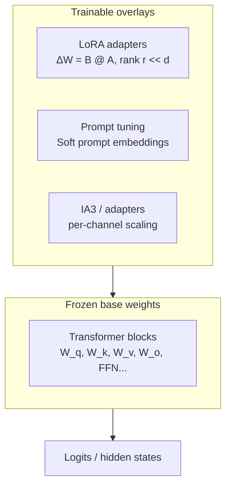
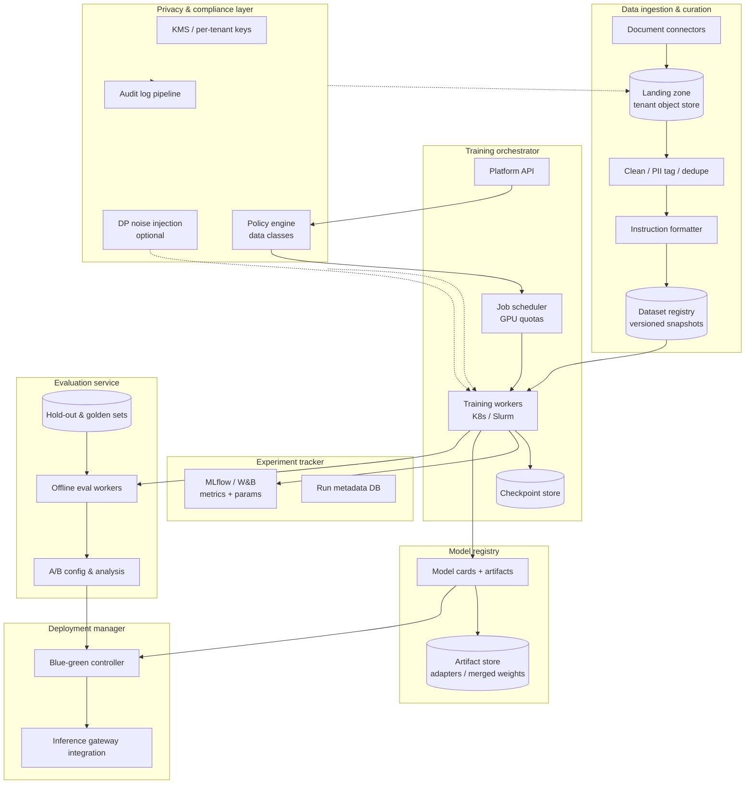
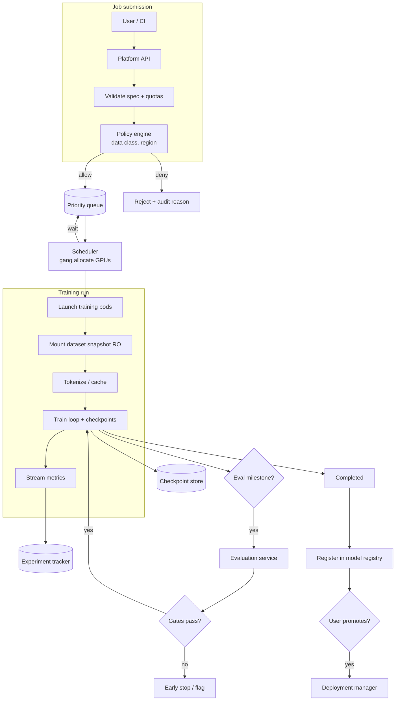
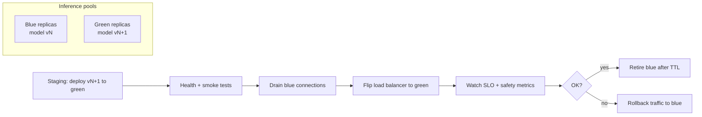
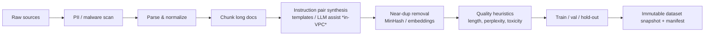
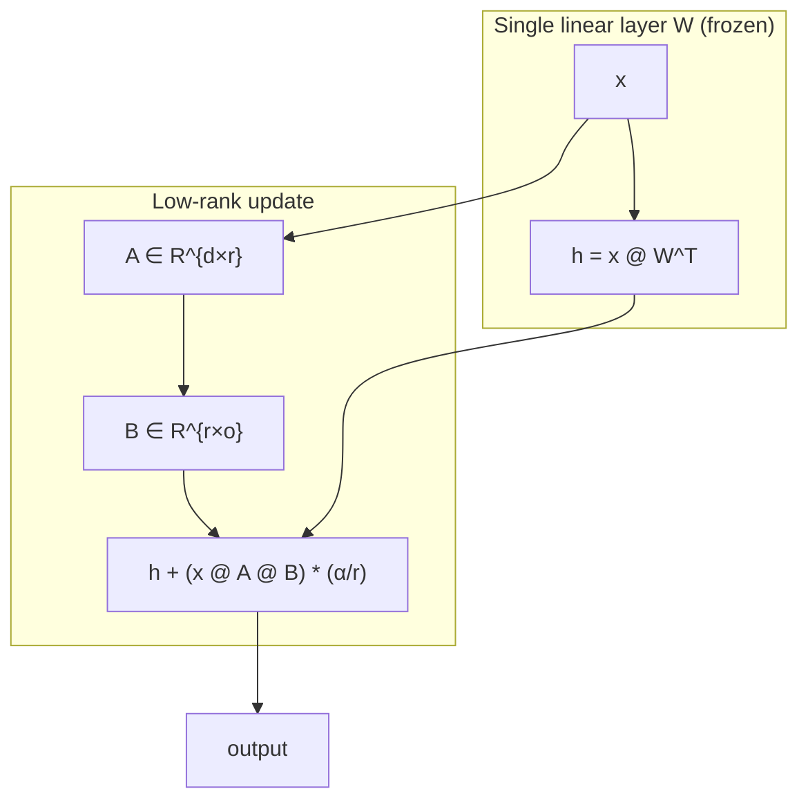
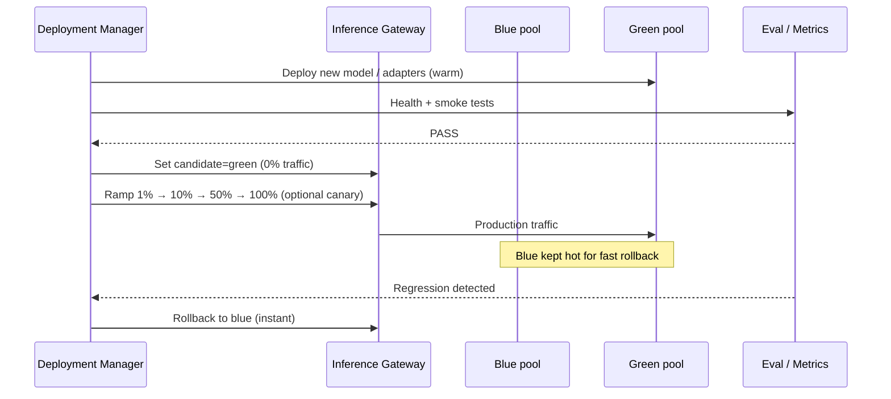

# Design an LLM Fine-Tuning Platform for Private Enterprise Data

---

## What We're Building

A **secure, end-to-end platform** that lets enterprises fine-tune large language models on proprietary data that must never leave their trust boundary. The system covers data ingestion and curation, method selection (full fine-tuning vs parameter-efficient tuning), distributed training orchestration, evaluation against baselines, experiment and model versioning, privacy controls (including optional differential privacy), and zero-downtime deployment of new model weights or LoRA adapters.

**This is how regulated industries ship domain-specific LLMs** without sending raw documents to third-party trainers or leaking memorized secrets at inference time.

### Why This Problem Is Hard

| Challenge | Why It Hurts |
|-----------|----------------|
| **Data sovereignty** | Legal and policy require data and gradients to stay in-region / in-VPC; naive “upload to OpenAI” violates contracts. |
| **Quality vs. privacy** | Strong anonymization or DP noise reduces utility; weak controls risk memorization and extraction attacks. |
| **Compute cost** | Full fine-tuning multi-billion-parameter models needs clusters; wrong method choice burns millions in GPU-hours. |
| **Reproducibility** | Without dataset + code + hyperparameter versioning, you cannot audit “what model answered this query?” |
| **Evaluation** | Generic benchmarks mislead; domain metrics and A/B tests against the base model are non-trivial to run safely. |
| **Deployment safety** | Swapping weights without downtime or rollback paths can break production assistants overnight. |
| **Catastrophic forgetting** | Domain tuning can destroy general capabilities users still rely on. |

### Real-World Scale

| Metric | Scale |
|--------|-------|
| **Enterprises on platform** | 50–500 tenants (VPC-isolated) |
| **Curated instruction examples** | 100K–10M pairs per major fine-tune |
| **Raw documents before curation** | 1M–100M (wikis, tickets, PDFs, code) |
| **Concurrent training jobs** | 10–200 (mix of LoRA and full FT) |
| **Largest single job** | 8–512 GPUs, hours to days |
| **Serving QPS (post-deploy)** | 100–50K (via separate inference tier) |
| **Audit log volume** | 1M–100M events/day (ingestion, train, deploy) |

---

## Key Concepts Primer

### Instruction Tuning vs. Continued Pretraining

| Phase | What Changes | Typical Data |
|-------|----------------|--------------|
| **Continued pretraining (CPT)** | Next-token prediction on raw text | Large unlabeled corpora |
| **Instruction fine-tuning (SFT)** | Conditional generation: follow instructions | `(instruction, input?, response)` triples |
| **Preference alignment (DPO/RLHF)** | Reward or preference model | Chosen/rejected pairs |

Enterprise platforms most often emphasize **SFT** (and sometimes **DPO**) because behavior is controllable and evaluable per task.

### Parameter-Efficient Fine-Tuning (PEFT) Family



| Method | Trainable Params | GPU Memory | When to Use |
|--------|------------------|------------|-------------|
| **Full fine-tuning** | 100% | Highest | Small models or you own the whole stack |
| **LoRA** | ~0.1–2% | Medium | Default for 7B–70B in enterprise |
| **QLoRA** | ~0.1–2% | Low (4-bit base) | Cost-constrained; watch eval regressions |
| **Prompt tuning** | <<0.01% | Lowest | Very small data or rapid iteration only |

### Differential Privacy (DP-SGD) Intuition

```
Non-private SGD:     gradient = average(grad per example)
DP-SGD:              gradient = average(grad) + Gaussian_noise(scale ∝ sensitivity / ε)

ε (epsilon):         privacy budget — smaller = more private, noisier updates
δ (delta):           probability of failure of the guarantee

Trade-off:           Lower ε → more noise → slower convergence, worse final loss
```

### Blue-Green vs. Canary for LLM Serving

| Strategy | Traffic switch | Risk profile |
|----------|----------------|--------------|
| **Blue-green** | 0% or 100% per replica pool | Fast rollback; binary comparison |
| **Canary** | Gradual % to new model | Smoother risk; needs metric gates |
| **Shadow** | Old serves user; new runs for metrics only | Zero user risk; 2× inference cost |

---

## Step 1: Requirements Clarification

### Questions to Ask

| Question | Why It Matters |
|----------|----------------|
| Must data **never** leave VPC, or is a **BAA-covered** cloud fine-tuner acceptable? | Chooses managed vs. self-hosted training |
| Base model: **open weights** (Llama, Mistral) or **API-only** base? | Affects whether full FT is even possible |
| Target **latency/throughput** at inference? | Adapter vs. merged weights; GPU pool sizing |
| **Regime**: HIPAA, GDPR, FedRAMP? | Logging, retention, DP, encryption standards |
| Do users need **general** capabilities preserved? | Forgetting mitigation, replay data mix |
| Who approves **production promotion**? | RBAC, change management, audit trail |
| **Evaluation**: human labels, LLM-as-judge, or automated task suites? | Build eval service contracts |

### Functional Requirements

| Requirement | Priority | Description |
|-------------|----------|-------------|
| Ingest raw enterprise documents | Must have | Connectors + landing zone in tenant storage |
| Curate SFT pairs | Must have | Clean, dedupe, format, quality filters |
| Choose method (full / LoRA / QLoRA / prompt) | Must have | Policy defaults + expert overrides |
| Schedule training on tenant GPUs | Must have | Orchestrator + quotas |
| Track datasets, code, hyperparams | Must have | Experiment tracker + model registry |
| Offline + online evaluation | Must have | Hold-out sets, domain metrics, A/B |
| Promote model with **zero downtime** | Must have | Blue-green (or canary) deployment manager |
| Audit all data and train access | Must have | Immutable logs, SIEM export |
| Optional DP training | Should have | ε, δ budgets per tenant |
| Multi-tenant SaaS | Should have | Strong isolation (account + VPC + KMS) |

### Non-Functional Requirements

| Requirement | Target | Rationale |
|-------------|--------|-----------|
| **Data residency** | 100% in tenant boundary | Contractual |
| **Training job recovery** | Resume from last checkpoint < 15 min RTO | GPU failures are common |
| **Reproducibility** | Same artifact hash → bit-identical or documented nondeterminism | Audit |
| **Deploy rollback** | < 2 min to previous green | Safety |
| **Control plane availability** | 99.9% | Scheduling and compliance |
| **Eval latency (batch)** | Scale with parallel workers; P95 job < 1 hr for 10K prompts | CI/CD for models |

### API Design

```python
# POST /v1/tenants/{tenant_id}/datasets
# Register a new raw dataset snapshot (metadata only; bytes already in tenant bucket).
{
    "dataset_name": "support_tickets_q1_2026",
    "storage_uri": "s3://tenant-vpc-abc/raw/support_q1/",
    "format_hint": "jsonl",
    "pii_scan_status": "passed",
    "checksum_sha256": "a1b2...",
    "data_classification": "confidential"
}

# POST /v1/tenants/{tenant_id}/curation-jobs
{
    "source_dataset_id": "ds-88421",
    "recipe_id": "instruction_pair_v3",
    "dedupe_strategy": "minhash_lsh",
    "output_bucket": "s3://tenant-vpc-abc/curated/",
    "filters": {"min_token_length": 20, "max_toxicity_score": 0.15}
}

# POST /v1/tenants/{tenant_id}/training-jobs
{
    "name": "legal_assistant_lora_v4",
    "base_model_id": "registry/llama-3-70b-instruct",
    "train_dataset_version": "dsv-12",
    "method": "lora",
    "lora_config": {"r": 64, "alpha": 128, "target_modules": ["q_proj", "v_proj"]},
    "qlora": true,
    "gpu_pool": "tenant-gpu-pool-1",
    "hyperparameters": {"lr": 2e-4, "epochs": 2, "max_seq_len": 4096},
    "dp": {"enabled": false},
    "evaluation_suite_id": "eval-legal-v2",
    "experiment_tags": {"cost_center": "legal-ai"}
}

# POST /v1/tenants/{tenant_id}/deployments
{
    "training_job_id": "tj-99102",
    "strategy": "blue_green",
    "inference_deployment": "prod-llm-gw-west",
    "traffic_switch": {"type": "instant", "drain_seconds": 120},
    "rollback_on_regression": true,
    "metric_gates": {"win_rate_vs_base_min": 0.52, "toxicity_max_delta": 0.01}
}
```

---

## Step 2: Back-of-Envelope Estimation

### Traffic (Control Plane)

```
Tenants:                         200
Training job submissions / tenant / month: 4
Monthly jobs:                    800
Daily average:                   ~27 new jobs/day
Peak (end of quarter):          3× → ~80 jobs/day

API calls (orchestration + UI):  ~50 per job lifecycle
Daily control-plane requests:    80 × 50 = 4,000 (excluding polling)
```

### Storage

```
Raw documents (avg tenant):      5 TB
Curated SFT JSONL:               1–10% of raw after filtering → 50–500 GB
Checkpoints (70B QLoRA):         ~15–40 GB per checkpoint (adapters + optimizer states)
Full FT checkpoints (70B):       ~400+ GB per step snapshot (fp16 weights + optimizer)

Retention policy:                Keep last 5 checkpoints + best eval + 90-day logs
Per-tenant storage growth:       ~2–20 TB/year (depends on full vs LoRA)
```

### Compute

```
QLoRA on 70B, single node 8×A100 80GB:
  Effective batch via grad accumulation: 128
  Tokens/sec (order of magnitude):       ~1.5K–4K (highly implementation-dependent)
  1B tokens epoch:                       ~70–260 GPU-hours

Full fine-tuning 70B (multi-node):
  64×A100 cluster MFU ~45%:                ~10–50× more GPU-hours than QLoRA for same tokens

Rule of thumb for interviews: LoRA/QLoRA reduces trainable compute **and** optimizer memory
superlinearly vs. full FT; wall-clock still dominated by forward passes through full model.
```

### Cost (Illustrative)

```
GPU list price (cloud, on-demand):     $2–4 / GPU-hour (A100 class)

Single QLoRA job (70B, 2B tokens, 8 GPUs, 48 wall hours):
  8 × 48 × $3 ≈ $1,150

Full FT comparable coverage (same tokens, 64 GPUs, 120 hours):
  64 × 120 × $3 ≈ $23,000+

Annual (800 jobs, 70% LoRA/QLoRA, 30% heavier runs avg $5k):
  560 × $1.2k + 240 × $5k ≈ $1.9M/year GPU (excluding storage, egress, FTE)
```

!!! tip
    In interviews, tie cost to **method choice** (QLoRA vs. full), **checkpoint frequency** (storage + I/O tax), and **eval frequency** (inference spend). Executives care about **$/quality gain**, not FLOPs.

---

## Step 3: High-Level Design



### Component Descriptions

| Component | Responsibility |
|-----------|------------------|
| **Data ingestion & curation pipeline** | Moves raw data only inside VPC; parses formats; removes PII or tags it; deduplicates; builds instruction-response pairs; writes versioned curated datasets. |
| **Training orchestrator** | Validates policies; schedules GPU jobs; mounts datasets read-only; manages retries, spot/preemptible handling, and checkpoint cadence. |
| **Model registry** | Stores pointers to weights/adapters, training provenance, eval summaries, and promotion state (staging vs. production). |
| **Evaluation service** | Runs batch inference on frozen prompts; computes domain metrics; powers gates before deployment; supports shadow and A/B. |
| **Deployment manager** | Coordinates blue-green pools with the inference tier; drains connections; verifies health; rolls back on metric regression. |
| **Privacy & compliance layer** | KMS encryption at rest, VPC endpoints, optional DP-SGD hooks, centralized audit logging, and data-class policies (e.g., “no HR data in shared pools”). |
| **Experiment tracker** | Records hyperparameters, dataset hashes, library versions, and learning curves for every run — the audit trail for “why does this model behave differently?” |

### Training orchestration flow



### Managed service vs. self-hosted stacks

| Layer | Managed (examples) | Self-hosted (examples) |
|-------|-------------------|-------------------------|
| **Orchestration** | Vertex AI Pipelines, Azure ML jobs | Kubernetes + Volcano / Ray Train |
| **Training code** | Custom job containers | **Axolotl**, **TRL** (SFT/DPO), NeMo, Megatron-LM |
| **Weights** | Provider hosts base; tuning in-region | Weights in tenant bucket; air-gapped possible |
| **Pros** | Faster time-to-value, SLAs | Full VPC control, no data egress |
| **Cons** | Less flexibility; trust boundary shifts | You own CUDA, drivers, NCCL, security patches |

!!! note
    Interviewers often probe **where the gradient is computed** relative to **customer data**. A crisp answer: “Gradients touch private activations; therefore training workers must sit in the **same trust zone** as the dataset, unless we use **federated** or **homomorphic** approaches — which are rare at LLM scale today.”

### Blue-green deployment flow (control plane)



---

## Step 4: Deep Dive

### 4.1 Data Curation Pipeline (Formatting, Dedupe, Quality)



**Instruction formatting (Python)** — canonical chat template for SFT:

```python
from dataclasses import dataclass
from typing import Any


@dataclass(frozen=True)
class SFTExample:
    instruction: str
    input_text: str | None
    response: str
    metadata: dict[str, Any]


def format_alpaca_style(ex: SFTExample) -> dict[str, str]:
    """Human-readable instruction block; tokenizer.apply_chat_template preferred in training."""
    if ex.input_text:
        prompt = (
            f"### Instruction:\n{ex.instruction}\n\n"
            f"### Input:\n{ex.input_text}\n\n"
            f"### Response:\n"
        )
    else:
        prompt = f"### Instruction:\n{ex.instruction}\n\n### Response:\n"
    return {"prompt": prompt, "completion": ex.response}


def to_messages_for_chat_model(ex: SFTExample) -> list[dict[str, str]]:
    user_content = ex.instruction if not ex.input_text else f"{ex.instruction}\n\n{ex.input_text}"
    return [
        {"role": "user", "content": user_content},
        {"role": "assistant", "content": ex.response},
    ]
```

**Near-duplicate detection** — MinHash + LSH scales to tens of millions of rows; embeddings + FAISS is heavier but catches paraphrases.

```python
import hashlib
import random


def _token_shingles(text: str, k: int = 5) -> set[str]:
    toks = text.lower().split()
    return {" ".join(toks[i : i + k]) for i in range(max(0, len(toks) - k + 1))}


def minhash_signature(shingles: set[str], dim: int, seed: int = 42) -> list[int]:
    """Toy MinHash — production uses optimized libraries (datasketch, LSH)."""
    rng = random.Random(seed)
    sig = []
    for _ in range(dim):
        a = rng.randint(1, 2**32 - 1)
        b = rng.randint(0, 2**32 - 1)

        def h(shingle: str) -> int:
            x = int(hashlib.md5((str(a) + shingle).encode()).hexdigest(), 16)
            return (a * x + b) % 2**32

        sig.append(min((h(s) for s in shingles), default=2**32))
    return sig


def estimated_jaccard(sig_a: list[int], sig_b: list[int]) -> float:
    return sum(x == y for x, y in zip(sig_a, sig_b)) / len(sig_a)
```

### 4.2 Method Selection: Full FT vs LoRA / QLoRA vs Prompt Tuning

| Method | Pros | Cons |
|--------|------|------|
| **Full fine-tuning** | Maximum capacity to absorb domain | Costly; catastrophic forgetting risk; heavy ops |
| **LoRA** | Cheap iteration; small artifacts; easy A/B | May underfit highly skewed domains if rank too low |
| **QLoRA** | Fits large models on fewer GPUs | Risk of instability; careful tuning of NF4 + double quant |
| **Prompt tuning** | Tiny storage | Weak on deep domain retuning; often insufficient alone |

**LoRA adapter architecture (Mermaid)**



### 4.3 LoRA Configuration, Gradient Accumulation, and Checkpoints

```python
# Conceptual Hugging Face PEFT + Transformers style (simplified)

from dataclasses import dataclass


@dataclass
class LoRAConfig:
    r: int = 64
    lora_alpha: int = 128
    target_modules: tuple[str, ...] = ("q_proj", "k_proj", "v_proj", "o_proj")
    lora_dropout: float = 0.05
    bias: str = "none"
    task_type: str = "CAUSAL_LM"


def training_step_batch(
    model,
    batch,
    optimizer,
    scaler,
    grad_accum_steps: int,
    micro_step: int,
):
    """Gradient accumulation: backward every micro-batch, step every N micro-batches."""
    loss = model(**batch).loss / grad_accum_steps
    scaler.scale(loss).backward()
    if (micro_step + 1) % grad_accum_steps == 0:
        scaler.step(optimizer)
        scaler.update()
        optimizer.zero_grad(set_to_none=True)
    return float(loss.detach()) * grad_accum_steps
```

**Checkpoint policy:** save **adapter-only** checkpoints every N steps; full optimizer state for resume; export **merged** weights only for environments that cannot load PEFT at inference.

**Training loop with accumulation and checkpointing (Python)**

```python
from pathlib import Path
from typing import Any

import torch
from torch.cuda.amp import GradScaler, autocast


def train_epoch(
    model: torch.nn.Module,
    dataloader,
    optimizer: torch.optim.Optimizer,
    scheduler,
    *,
    device: torch.device,
    grad_accum_steps: int = 8,
    log_every: int = 10,
    checkpoint_every: int = 500,
    checkpoint_dir: Path | None = None,
    global_step: int = 0,
) -> int:
    scaler = GradScaler()
    model.train()
    optimizer.zero_grad(set_to_none=True)
    micro = 0
    running_loss = 0.0

    for batch in dataloader:
        batch = {k: v.to(device) for k, v in batch.items()}
        with autocast(dtype=torch.bfloat16):
            out = model(**batch)
            loss = out.loss / grad_accum_steps

        scaler.scale(loss).backward()
        running_loss += float(loss.detach()) * grad_accum_steps
        micro += 1

        if micro % grad_accum_steps == 0:
            scaler.unscale_(optimizer)
            torch.nn.utils.clip_grad_norm_(model.parameters(), max_norm=1.0)
            scaler.step(optimizer)
            scaler.update()
            optimizer.zero_grad(set_to_none=True)
            scheduler.step()
            global_step += 1

            if global_step % log_every == 0:
                print(f"step={global_step} loss={running_loss / log_every:.4f}")
                running_loss = 0.0

            if checkpoint_dir and global_step % checkpoint_every == 0:
                save_checkpoint(checkpoint_dir, global_step, model, optimizer, scheduler)

    return global_step


def save_checkpoint(
    dirpath: Path,
    step: int,
    model: torch.nn.Module,
    optimizer: torch.optim.Optimizer,
    scheduler,
) -> None:
    dirpath.mkdir(parents=True, exist_ok=True)
    payload: dict[str, Any] = {
        "step": step,
        "optimizer": optimizer.state_dict(),
        "scheduler": scheduler.state_dict(),
    }
    # PEFT: often model.save_pretrained(dir) for adapters only
    torch.save(payload, dirpath / f"trainer_state_step_{step}.pt")
    model.save_pretrained(dirpath / f"adapter_step_{step}")
```

```python
class CheckpointManager:
    """Async upload + retention for large sharded checkpoints."""

    def __init__(self, backend, keep_last: int = 5, keep_best: bool = True):
        self.backend = backend
        self.keep_last = keep_last
        self.keep_best = keep_best

    def save(self, local_path: str, remote_prefix: str, step: int, is_best: bool):
        self.backend.upload_async(local_path, f"{remote_prefix}/step_{step}/")
        self.backend.prune_old(remote_prefix, keep=self.keep_last)
        if is_best:
            self.backend.tag(f"{remote_prefix}/step_{step}/", alias="best")
```

### 4.4 QLoRA: Memory-Efficient Fine-Tuning

```python
# Illustrative BitsAndBytes + PEFT (patterns only — versions vary by stack)

def build_qlora_model(load_in_4bit: bool = True):
    from transformers import BitsAndBytesConfig, AutoModelForCausalLM, AutoTokenizer
    from peft import LoraConfig, get_peft_model, prepare_model_for_kbit_training

    bnb_config = BitsAndBytesConfig(
        load_in_4bit=load_in_4bit,
        bnb_4bit_use_double_quant=True,
        bnb_4bit_quant_type="nf4",
        bnb_4bit_compute_dtype="bfloat16",
    )
    model = AutoModelForCausalLM.from_pretrained(
        "meta-llama/Meta-Llama-3-70B-Instruct",
        quantization_config=bnb_config,
        device_map="auto",
    )
    model = prepare_model_for_kbit_training(model)
    peft_config = LoraConfig(
        r=64,
        lora_alpha=16,
        lora_dropout=0.05,
        bias="none",
        task_type="CAUSAL_LM",
        target_modules=["q_proj", "v_proj", "k_proj", "o_proj"],
    )
    return get_peft_model(model, peft_config)
```

!!! warning
    QLoRA can **look** great on training loss yet regress on **long-context** or **tool-use** behavior. Always run **domain eval** and a slice of **general capability** tests before promotion.

### 4.5 Model Merging and Catastrophic Forgetting Prevention

**Merge strategies**

| Strategy | Description | Use when |
|----------|-------------|----------|
| **Linear / task arithmetic** | Weighted sum of LoRA deltas | Small number of adapters; experimental |
| **TIES / DARE** | Sparsify and merge conflicting updates | Multi-task adapter fusion |
| **No merge** | Serve adapter stack at inference | Fast rollback; multi-tenant adapters |

**Forgetting mitigation**

- Mix **general instruction** data (5–30% of steps) with domain data.
- Use **LoRA on higher layers only** sometimes preserves broader behavior (empirical; validate).
- **Elastic Weight Consolidation (EWC)** and **replay buffers** — heavier; mention in interviews for research depth.
- **Separate adapters** per domain instead of one monolithic fine-tune.

```python
def merge_lora_into_base(base_model, peft_model):
    """Production pattern: export merged fp16 for vLLM/TGI that expect a single weight file."""
    merged = peft_model.merge_and_unload()
    return merged
```

### 4.6 Training Orchestration and Experiment Tracking

Runs must record: `dataset_manifest_sha`, `base_model_id`, `git_commit`, library versions, `seed`, LoRA config, effective batch size, LR schedule, and **hardware topology**.

**MLflow-style run metadata (Python)**

```python
import mlflow


def log_training_run(
    params: dict,
    dataset_version: str,
    base_model: str,
    metrics: dict[str, float],
    artifact_path: str,
):
    mlflow.set_experiment("enterprise-llm-finetune")
    with mlflow.start_run():
        mlflow.log_params(params)
        mlflow.log_param("dataset_version", dataset_version)
        mlflow.log_param("base_model", base_model)
        mlflow.set_tags(
            {
                "tenant": params.get("tenant_id", ""),
                "policy_tier": params.get("policy_tier", ""),
            }
        )
        mlflow.log_metrics(metrics)
        mlflow.log_artifact(artifact_path)  # e.g. merged adapter or eval JSON
```

**Weights & Biases** is often preferred for **live dashboards** during long runs; **MLflow** integrates cleanly with **on-prem** artifact stores. Many teams mirror critical metadata to **both** for redundancy.

**Java** — structured audit event to an immutable log (many enterprises standardize on JVM for compliance sinks):

```java
// Illustrative: emit training start event to enterprise audit bus
public record TrainingStartedEvent(
    String tenantId,
    String jobId,
    String datasetVersionId,
    String baseModelId,
    String submittedBy,
    long unixEpochMs
) {}

public void emitTrainingStarted(TrainingStartedEvent e) {
    auditClient.publish("ml.training.started", e); // WORM storage / Kafka → SIEM
}
```

### 4.7 Evaluation Service and A/B Testing Against Base

```python
import statistics
from dataclasses import dataclass


@dataclass
class EvalPrompt:
    id: str
    messages: list[dict[str, str]]
    reference: str | None  # optional for ROUGE/BLEU; often absent in enterprise


def win_rate_vs_base(
    judge_scores_base: list[float],
    judge_scores_candidate: list[float],
) -> float:
    """Pairwise comparison using an LLM-as-judge or human rubric score."""
    assert len(judge_scores_base) == len(judge_scores_candidate)
    wins = sum(c > b for b, c in zip(judge_scores_base, judge_scores_candidate))
    return wins / len(judge_scores_base)


def toxicity_delta(base_scores: list[float], cand_scores: list[float]) -> float:
    return statistics.mean(cand_scores) - statistics.mean(base_scores)
```

**A/B design:** hash `user_id` or `session_id` to **sticky** assignment; run **shadow** first (candidate not shown) to validate latency and safety classifiers.

### 4.8 Privacy Layer and Differential Privacy Training

- **Network:** private subnets, no public IPs on training nodes, VPC endpoints to object storage.
- **Encryption:** customer-managed keys (CMK) for buckets and checkpoint volumes.
- **Logging:** redact prompts in hot logs; store only hashes/truncations unless explicitly allowed.

**DP-SGD sketch (Python)** — interview-level clarity over production completeness:

```python
import torch

def dp_clip_gradients_(parameters, max_norm: float):
    torch.nn.utils.clip_grad_norm_(parameters, max_norm)


def add_gaussian_noise_to_grads_(parameters, noise_multiplier: float, max_norm: float):
    """After clipping, sensitivity per step is bounded by max_norm (classic DP-SGD analysis)."""
    for p in parameters:
        if p.grad is None:
            continue
        noise = torch.normal(
            mean=0.0,
            std=noise_multiplier * max_norm,
            size=p.grad.shape,
            device=p.grad.device,
            dtype=p.grad.dtype,
        )
        p.grad.add_(noise)
```

!!! note
    Production DP requires **careful accounting** (privacy ledger), **secure aggregation** in distributed settings, and often **Opacus** / **JAX DP** libraries — not hand-rolled noise. Mention **(ε, δ)** reporting to compliance.

### 4.9 Blue-Green Deployment Controller



**Python controller (simplified)**

```python
from enum import Enum


class Pool(str, Enum):
    BLUE = "blue"
    GREEN = "green"


class BlueGreenController:
    def __init__(self, gateway_client):
        self.gw = gateway_client

    def promote(self, active: Pool, standby: Pool, new_model_ref: str):
        self.gw.deploy_to_pool(standby, new_model_ref)
        self.gw.wait_healthy(standby, timeout_s=600)
        self.gw.drain_pool(active, grace_s=120)
        self.gw.flip_traffic(from_pool=active, to_pool=standby)
        return standby  # new active

    def rollback(self, revert_to: Pool):
        self.gw.flip_traffic_to(revert_to)
```

**Go** — atomic flip with optimistic concurrency on the routing config:

```go
type TrafficSplit struct {
	BluePct int `json:"blue_pct"`
	GreenPct int `json:"green_pct"`
	ModelBlue string `json:"model_blue"`
	ModelGreen string `json:"model_green"`
}

func (c *GatewayClient) FlipToGreen(ctx context.Context, cfg TrafficSplit) error {
	if cfg.BluePct+cfg.GreenPct != 100 {
		return ErrInvalidSplit
	}
	return c.PutRouting(ctx, cfg, c.currentVersion+1)
}
```

---

## Step 5: Scaling & Production

### Failure Handling

| Failure | Detection | Recovery |
|---------|-----------|----------|
| **GPU OOM mid-run** | CUDA OOM exception | Lower seq len / micro-batch; resume from checkpoint |
| **Node preemption** | SIGTERM from scheduler | Checkpoint + requeue on different nodes |
| **Corrupt checkpoint** | Load mismatch / hash fail | Fall back to previous step; alert |
| **Data connector stall** | Lag alarm on ingestion cursor | Retry with backoff; pause training jobs using stale manifest |
| **Eval worker crash** | Job timeout | Idempotent eval shards; partial retry |
| **Bad deployment** | SLO breach / safety spike | Auto rollback to blue |

### Monitoring

| Metric | Alert Threshold |
|--------|----------------|
| **Training loss divergence** | > 3× running median |
| **Eval win-rate vs. base** | Drops below gate after promotion |
| **GPU utilization** | < 40% for > 1 hr (cost) |
| **Checkpoint upload failures** | Any in 24 hr |
| **DP budget consumed** | ε over tenant monthly cap |
| **Inference p95 latency** | > SLO after model swap |

### Trade-offs

| Decision | Option A | Option B | Recommendation |
|----------|----------|----------|----------------|
| **Training stack** | Managed (Azure OpenAI FT, Vertex) | Self-hosted (Axolotl, TRL, NeMo) | Managed for speed; self-hosted for strict VPC |
| **Artifact at inference** | Merged full weights | LoRA hot-swapped | Merged for max throughput; LoRA for multi-tenant flexibility |
| **Dedupe** | MinHash (cheap) | Embedding ANN (strong) | MinHash at scale; embed for high-stakes dedupe |
| **Eval** | LLM-as-judge | Human labels | Judge for volume; humans for calibration |
| **DP** | Strong ε | No DP + strict access | Regulated tenants: DP or federated alternatives |

---

## Interview Tips

!!! tip
    **Strong-hire signals for this problem:**
    1. You separate **data plane** (VPC training) from **control plane** (scheduling, metadata) and state where bytes are allowed to flow.
    2. You explain **why LoRA is not “free quality”** — rank, targets, and eval gaps vs. full FT.
    3. You describe **reproducibility** as a first-class artifact (dataset manifest + code + seeds).
    4. You connect **deployment** to **inference reality** (merged vs. adapter, KV-cache, GPU memory).
    5. You discuss **memorization** and **DP** as a **utility–privacy Pareto frontier**, not a checkbox.

**Common follow-up questions:**

- How do you prevent **PII leakage** in fine-tuned weights?
- When would you choose **RAG** instead of fine-tuning, or **both**?
- How do you do **distributed LoRA** training for very large batches?
- What is your **incident response** if a promoted model starts leaking training data?
- How do you **version prompts** separately from **model weights**?
- What changes if the base model is **API-only** (no weight access)?

---

## Hypothetical Interview Transcript

!!! note
    This transcript simulates a 45-minute Google L5/L6 system design round. The interviewer is a Staff Engineer on the Cloud AI / Vertex-style platform team.

---

**Interviewer:** Design a system for enterprises to fine-tune LLMs on private data. They cannot send raw documents outside their VPC. Walk me through your approach.

**Candidate:** I will clarify a few constraints first. Are we assuming the enterprise has **access to base model weights** inside the VPC — for example open models like Llama — or only API inference from a provider? Do they need **SOC2-style audit trails** and optional **differential privacy**, and what is the order of magnitude for data — millions of documents or billions of tokens?

**Interviewer:** Assume open weights can be licensed and run inside their VPC. They need full audit logs, and some tenants want DP. Data is in the hundreds of millions of tokens, with periodic refreshes.

**Candidate:** Great. I would decompose into six major services: **ingestion and curation**, **training orchestration**, **experiment tracking and model registry**, **evaluation**, **deployment manager**, and a cross-cutting **privacy and compliance layer**.

Raw data lands in **tenant-owned object storage** in a private subnet. Connectors — whether batch ETL from Snowflake or crawlers from SharePoint — only write inside that boundary. The curation pipeline parses, normalizes, optionally redacts PII, **deduplicates** near-duplicates with MinHash or embedding clustering, and formats rows into **instruction–response** pairs. The output is an **immutable snapshot** with a cryptographic manifest; the training job references that version, not a mutable folder.

**Interviewer:** How do you decide between full fine-tuning and LoRA?

**Candidate:** Default to **QLoRA or LoRA** for 7B–70B class models because the trainable parameter count and optimizer memory dominate cost. Full fine-tuning is reserved for smaller models, research settings, or when evaluation proves LoRA cannot reach the domain metric with reasonable rank.

Trade-offs: LoRA gives **small artifacts** — sometimes tens to hundreds of megabytes — which makes **blue-green** and **per-tenant adapters** practical. Full FT maximizes capacity but increases **catastrophic forgetting** risk and checkpoint storage. I would expose both in the API but encode **organizational policy defaults**.

**Interviewer:** Expand on catastrophic forgetting. How do you mitigate it operationally?

**Candidate:** Three operational levers:

First, **data mixing**: keep a slice of high-quality general instructions in every epoch — often five to twenty percent — so the model does not collapse to narrow patterns.

Second, **adapter strategy**: multiple smaller domain adapters may forget less than one aggressive full fine-tune; serving can compose adapters if the inference stack supports it.

Third, **evaluation gates**: before promotion, run not only domain tests but a **general capability slice** — math, coding, safety refusals — to detect regression vs. the base model.

**Interviewer:** Describe the training orchestration flow end-to-end.

**Candidate:** The user submits a `training_job` spec referencing `base_model_id`, `dataset_version_id`, method, hyperparameters, and optional DP budget. The **policy engine** checks classification rules — for example HR data cannot run on shared GPU pools. The **scheduler** places the job on a tenant-scoped cluster with gang scheduling for multi-GPU jobs.

Workers pull the **frozen snapshot** read-only, stream shards, and log metrics to **MLflow or Weights & Biases** in the VPC. Checkpoints go to encrypted object storage with **KMS keys**. Periodic checkpoints are asynchronous to reduce wall-clock overhead. On failure, the job resumes from the last consistent checkpoint.

**Interviewer:** How does evaluation work before we expose the model to users?

**Candidate:** The **evaluation service** maintains **hold-out sets**: a domain-specific labeled set where possible, plus **LLM-as-judge** rubrics calibrated against human labels quarterly. For each candidate, we batch-generate responses and compute **win-rate against the base model** on paired prompts, toxicity deltas, and task-specific metrics like JSON schema validity for agent-style outputs.

Before traffic moves, I like **shadow mode**: the production model serves users while the candidate runs on mirrored traffic for metrics only. Then **blue-green**: warm the green pool with the new weights or merged model, run smoke tests, flip traffic with drain timeouts, keep blue hot for instant rollback.

**Interviewer:** Walk me through blue-green at the gateway.

**Candidate:** The **deployment manager** instructs the **inference gateway** to deploy the new artifact to the green pool. Health checks include latency, error rate, and GPU memory fit. We shift traffic with a short **drain** so in-flight SSE streams complete. If post-flip SLOs or safety classifiers regress beyond thresholds, we **flip back** to blue — the controller stores the last known-good reference.

**Interviewer:** Where does differential privacy fit, and what is the catch?

**Candidate:** DP-SGD adds calibrated noise to gradients and clips per-example contributions so the training run satisfies an **(ε, δ)** guarantee. The catch is **utility loss** and **longer training** — you may need more data and epochs. Operationally, we maintain a **privacy ledger** per tenant, cap ε per month, and require DP for certain data classes by policy — not optional for those tenants.

**Interviewer:** Managed service vs. self-hosted?

**Candidate:** **Managed** — Azure OpenAI custom models, Vertex AI tuning — reduces operational burden when contractual data boundaries allow provider-side training in the right region. **Self-hosted** — Axolotl, TRL, NeMo — when the hard requirement is that **weights and data never leave the VPC**. Many enterprises use **hybrid**: orchestration control plane SaaS, but workers in the customer VPC via private link.

**Interviewer:** How do you optimize cost?

**Candidate:** Prefer **QLoRA** and **adapter-only checkpoints**; use **spot instances** with checkpointing; **right-size** sequence length caps for the task; cache tokenized datasets; avoid over-evaluating with huge judge models — use smaller judges for screening and large judges for final gates. **Merge** only once for fleets that cannot serve PEFT.

**Interviewer:** Security angle — how do you know an engineer did not exfiltrate the dataset during training?

**Candidate:** Defense in depth: **RBAC** so only break-glass roles can SSH to worker nodes; **egress deny** by default on training subnets with allowlists for artifact buckets only; **immutable audit** of every data mount and checkpoint path; **DLP** scanning on outbound email and object-store policies. For the highest tiers, we use **confidential computing** or **air-gapped** clusters — expensive, but some contracts require it.

**Interviewer:** And if someone asks for **federated learning** instead of centralizing data?

**Candidate:** Federated is compelling when **data cannot be aggregated** — for example, hospitals. For LLMs, cross-device FL at billion-parameter scale is still largely **research**; practical enterprise patterns today are **per-site VPC training** with **centralized orchestration APIs** that never copy raw rows to the vendor, or **smaller local adapters** synced upward. I would be honest about **maturity** vs. **marketing**.

**Interviewer:** Strong coverage across data, training, eval, deployment, and security. Let's wrap.

---

## Summary

| Pillar | Takeaway |
|--------|----------|
| **Data plane** | **VPC-only** landing, **curation → versioned snapshots**, dedupe + quality filters |
| **Methods** | Default **LoRA/QLoRA**; **full FT** when justified; **prompt tuning** rarely sufficient alone |
| **Training** | **Orchestrated** jobs, **async checkpoints**, **experiment tracking** tied to dataset + code hashes |
| **Evaluation** | **Hold-out**, **domain metrics**, **A/B vs base**, **shadow** before traffic |
| **Deployment** | **Blue-green** (or canary) with **fast rollback**; **merged vs adapter** is a serving trade-off |
| **Privacy** | **KMS**, **audit logs**, optional **DP-SGD** with **ε budgeting** |
| **Forgetting** | **Data mixing**, **adapter strategies**, **general-capability regression tests** |

!!! note
    Practice drawing **five diagrams** from memory: **HLD**, **curation pipeline**, **training flow**, **LoRA on a linear layer**, and **blue-green sequence**. If you can explain **one** DP trade-off and **one** cost lever crisply, you will stand out.
