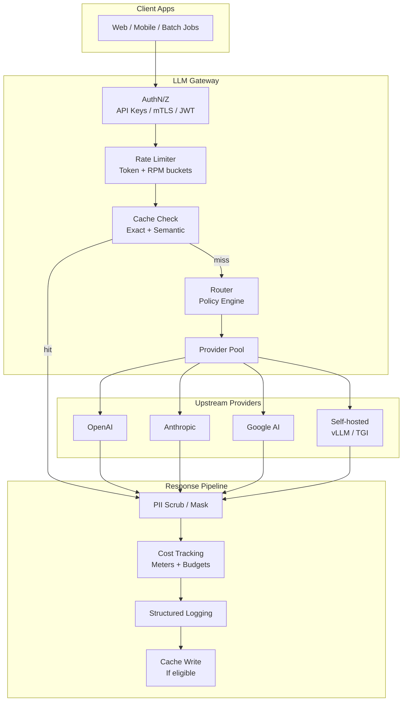
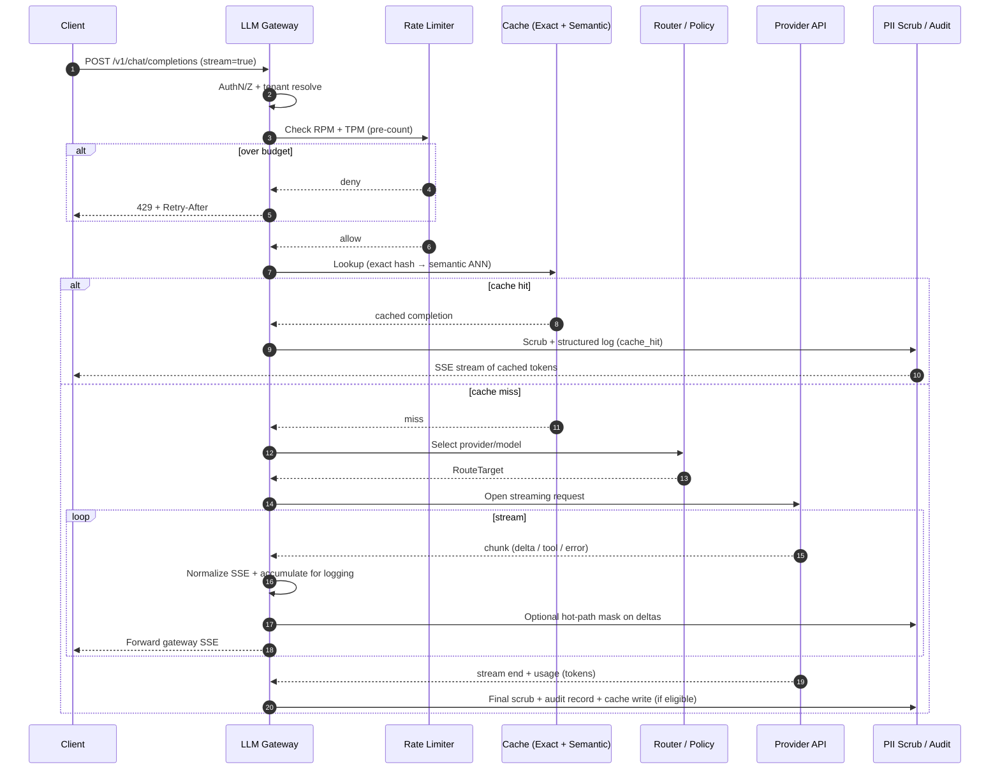
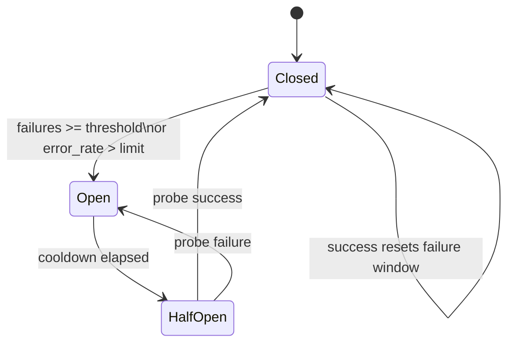

# Design an LLM Gateway / AI Proxy

---

## What We're Building

Design an **LLM gateway** (also called an **AI proxy**): a control plane that sits between your applications and one or more **LLM providers**. It is not “just HTTP forwarding.” It is an **API gateway specialized for generative traffic** — the same way a payment gateway understands cards, fraud, and settlement, an LLM gateway understands **tokens, models, safety, cost, and compliance**.

**What the gateway owns end-to-end:**

| Concern | What “good” looks like |
|---------|------------------------|
| **Unified API** | One contract for apps; swap vendors without rewrites |
| **Routing** | Pick model/provider by policy: cost, latency, capability |
| **Semantic caching** | Reuse answers for *similar* prompts, not only identical strings |
| **Rate limiting** | Fairness and blast-radius control in **token** units, not just HTTP QPS |
| **Fallback** | Degrade gracefully when a vendor errors, rate-limits, or degrades |
| **Cost & chargeback** | Per-tenant spend, budgets, attribution to products/teams |
| **Observability** | Latency, errors, cache hits, $/1K tokens — with PII-safe logs |

### Why It Matters (Interview Framing)

| Stakeholder | Pain without a gateway | What the gateway fixes |
|-------------|------------------------|-------------------------|
| **Product engineering** | N provider SDKs, divergent schemas | One client, stable interface |
| **FinOps / leadership** | Surprise cloud bills | Budgets, alerts, chargeback |
| **Security / compliance** | Prompts leak PII to logs & vendors | Scrubbing, retention, audit trail |
| **SRE / platform** | Cascading vendor outages | Circuit breakers, failover, SLO dashboards |
| **ML / applied science** | No A/B routing between models | Policy engine + experimentation hooks |

### Real-World Examples

| Example | Role |
|---------|------|
| **[LiteLLM](https://github.com/BerriAI/litellm)** | Open-source proxy with unified interface and provider routing |
| **[Portkey](https://portkey.ai/)** | Gateway with observability, guardrails, and multi-provider routing |
| **Internal proxies (Google, Meta, large banks)** | Central governance: keys, policy, spend caps, logging — often *mandatory* for production |

!!! note
    In interviews, treat the gateway as **policy + economics + reliability** for LLM traffic. The HTTP path is the easy part; **tokens, embeddings, streaming, and compliance** are the differentiators.

---

## Key Concepts Primer

### Semantic Caching

**Exact-match caching** keys on the full prompt string. **Semantic caching** keys on **meaning**: embed the request (or a canonical representation), search a vector index for **near-duplicates**, and return a cached completion when similarity exceeds a threshold.

| Aspect | Detail |
|--------|--------|
| **Why** | Paraphrases and template-filled prompts repeat “the same question” constantly |
| **Trade-off** | Risk of returning a wrong cached answer if similarity is too loose |
| **Mitigation** | Similarity threshold, TTL, tenant isolation, optional “soft hit” with disclaimer |

### Model Routing

**Model routing** selects *which* model and *which* provider serves a request under constraints:

- **Cost vs quality**: cheaper model for low-risk tasks; frontier model for high-stakes generation  
- **Latency SLA**: route to regionally close endpoints or smaller models when p99 matters  
- **Capability matching**: tool-use, JSON mode, long context, multilingual — route to models that actually support the feature  
- **Load balancing**: spread traffic across keys, accounts, or replicas to avoid hot partitions  

Often implemented as a **routing policy engine** (YAML/OPA rules + weights + experiments).

### Fallback Chains

A **fallback chain** defines order: **primary → secondary → tertiary** provider/model. Triggers include HTTP 5xx, 429, timeout, empty response, or policy violations. Combine with **per-provider circuit breakers** so you do not hammer a sick endpoint.

### Token-Level Rate Limiting

Providers rate-limit in **tokens per minute (TPM)** and **requests per minute (RPM)**. A gateway should enforce **tenant budgets in token units** (and optionally request counts), because two “one request” calls can differ by 100× in tokens.

### Prompt/Response Logging and PII Scrubbing

Production systems log for **debugging, audit, and cost attribution**. Raw prompts often contain **PII** (emails, phone numbers, names, IDs). The gateway applies **detection + masking** *before* persistence or export, with **retention policies** and **access controls** for security/compliance teams.

### Cost Attribution and Chargeback

Every request should carry **tenant** (and optionally **team, product, environment**). The gateway records **provider, model, input/output tokens**, applies **list or negotiated pricing**, and aggregates for **chargeback** dashboards and **budget alerts**.

### Token Counting vs Request-Based Limits

Providers bill and throttle in **tokens** (often **TPM** / **TPD**), not HTTP calls. Two `POST /chat/completions` requests can be **100× apart** in tokens (one-line FAQ vs 50-page RAG dump). **Request-based (RPM) limits** catch abuse and connection storms but **do not** approximate cost or fairness when payload sizes vary.

| Dimension | Request-based (RPM) | Token-based (TPM) |
|-----------|---------------------|-------------------|
| **What it bounds** | Call frequency | Work units consumed upstream |
| **Fairness** | Two users with same RPM can have wildly different spend | Aligns with provider meters and $ |
| **When both matter** | Burst of tiny calls can still DDOS an API | Long prompts need **input** TPM; long answers need **output** caps |

**Pre-counting:** Use the **provider’s tokenizer** when available (e.g. `tiktoken` for OpenAI-compatible models), or a **cheap heuristic** (chars/4) only for **admission control** — reconcile with **actual** usage from the response for billing.

```python
from __future__ import annotations

import tiktoken


def count_message_tokens(
    messages: list[dict[str, str]],
    model: str = "gpt-4o",
) -> int:
    """
    Approximate input tokens for rate-limit admission.
    Map model name to encoding; fall back to cl100k_base for unknown IDs.
    """
    try:
        enc = tiktoken.encoding_for_model(model)
    except KeyError:
        enc = tiktoken.get_encoding("cl100k_base")

    # Provider-specific chat templates differ; this pattern matches common OpenAI-style framing.
    num_tokens = 0
    for m in messages:
        num_tokens += 4  # message overhead (approximate)
        num_tokens += len(enc.encode(m.get("content") or ""))
    num_tokens += 2  # assistant priming
    return num_tokens


def tpm_bucket_key(tenant_id: str, window_start_epoch: int) -> str:
    return f"rl:tpm:{tenant_id}:{window_start_epoch}"
```

!!! note
    **Interview nuance:** Say you use **estimated** tokens for *reject/admit* and **actual** tokens from the provider response for **billing** — mismatches happen when the provider’s tokenizer differs slightly from yours.

### Streaming Proxy Challenges

**SSE relay:** Browsers and mobile clients often consume **Server-Sent Events** (`text/event-stream`). The gateway must **parse** provider-specific chunk formats (OpenAI `data: {...}\n\n`, Anthropic event types), **re-emit** a **single** internal schema, and handle **keep-alives**, **mid-stream errors**, and **connection drops** without corrupting JSON lines.

| Challenge | What breaks | Mitigation |
|-----------|-------------|------------|
| **Chunk fragmentation** | Half a JSON delta across TCP packets | Buffer until parseable; normalize `delta` fields |
| **Provider error mid-stream** | HTTP 200 then error object in-stream | Map to one error event; close cleanly |
| **Caching / logging** | No single “response body” until stream ends | **Accumulate** assistant text (and tool call args) in a **stream buffer** with **size cap**; flush to async log/cache worker |
| **Backpressure** | Slow client blocks gateway threads | Bounded queues; drop or pause upstream read per policy |

**Partial response accumulation:** Maintain `accumulated_text`, `tool_call_buffers[id]`, and `finish_reason`. Only **after** `[DONE]` (or equivalent) can you run **semantic cache write**, **full PII scan**, and **exact token counts** for some providers.

### Model Capability Matrix (Illustrative)

Capabilities diverge by **model id** and **API version**. The gateway should treat this as **data** (config / registry), not hardcoded `if` chains.

| Capability | Typical support | Gateway implication |
|------------|-----------------|---------------------|
| **Function / tool calling** | Frontier chat models; not all small models | Route away or reject if `tools` non-empty |
| **Vision (multimodal)** | Separate model families / `vision` flags | Validate `image_url` messages against registry |
| **JSON mode / constrained output** | Provider-specific (`response_format`, `tool` tricks) | Adapter maps unified flag → provider params |
| **Long context (>128K)** | Model-specific | Split RAG or route to long-context SKU |
| **Streaming + tools** | Most modern APIs | Merge parallel tool call deltas in adapter |

!!! tip
    In interviews, mention a **capability registry** versioned with your **unified API** — when a team requests `json_mode=true`, the router **filters** to models where `json_mode=true` is **verified** for that provider’s API revision.

---

## Step 1: Requirements

### Functional Requirements

| ID | Requirement | Notes |
|----|-------------|-------|
| **F1** | **Unified API** across providers (OpenAI, Anthropic, Google, self-hosted) | Normalize schemas, errors, streaming |
| **F2** | **Intelligent routing** by policy (cost, latency, capability, experiments) | Pluggable rules; safe defaults |
| **F3** | **Semantic caching** for eligible prompts | Opt-in per route; tenant-isolated keys |
| **F4** | **Rate limiting per tenant** in token (and request) dimensions | Burst + sustained; optional per-model limits |
| **F5** | **Fallback** on provider failure / saturation | Configurable chains; idempotency where possible |
| **F6** | **Cost tracking and budgets** | Real-time counters; soft/hard enforcement |
| **F7** | **Prompt/response logging** with **PII detection** | Redact before storage; configurable verbosity |

### Non-Functional Requirements

| NFR | Target | Rationale |
|-----|--------|-----------|
| **Added latency (gateway overhead)** | **&lt; 20 ms** p99 on cache miss, excluding upstream LLM time | Apps already pay TTFT + generation; gateway must stay “in the noise” |
| **Availability** | **99.99%** for the gateway control plane | Degraded mode: passthrough or cached responses where safe |
| **Throughput** | **10K req/s** aggregate | Horizontal scale; stateless request path where possible |

!!! warning
    **Clarify in the interview:** “10K req/s” is **gateway requests**, not 10K concurrent GPU streams. Upstream provider limits still cap *effective* throughput; the gateway’s job is to **shape, route, and fail gracefully**.

---

## Step 2: Estimation

### Request Volume (Illustrative)

Assume **10K req/s** peak gateway traffic, **50%** of traffic eligible for semantic cache, **40%** semantic hit rate on eligible traffic (tuned conservatively).

| Quantity | Formula | Result |
|----------|---------|--------|
| Peak RPS | Given | 10,000/s |
| Cache-eligible RPS | 50% × 10K | 5,000/s |
| Semantic hits | 40% × 5K | 2,000/s |
| Upstream LLM calls (approx.) | 10K − 2K | **8,000/s** |

### Token Costs Across Providers (Order-of-Magnitude)

Pricing moves constantly; use **relative** reasoning in interviews. Example **blended** assumptions for rough monthly math:

| Assumption | Value |
|------------|-------|
| Avg input tokens / request | 1,500 |
| Avg output tokens / request | 500 |
| Mix | 70% “cheap” route @ $0.50 / 1M in + $1.50 / 1M out; 30% “premium” @ 3× |

Rough **effective $/request** stays in **fractions of a cent to a few cents** at this token mix — which is why **routing + caching** matter at scale.

### Cache Hit Rates

| Cache tier | Expected hit rate (indicative) | When it helps most |
|------------|-------------------------------|-------------------|
| Exact match (normalized prompt hash) | 5–20% | Templated ops, repeated system prompts |
| Semantic (ANN on embeddings) | 15–40% (if eligible) | Support bots, FAQs, internal assistants |

### Storage for Logs

| Input | Example |
|-------|---------|
| Metadata per request | ~1–4 KB (ids, model, tokens, latency, route decisions) |
| Redacted prompt/response snippets | 0–32 KB depending on policy |
| Daily requests (10K/s peak ≠ flat 24h) | Use **average RPS × day**; e.g. **~500M–1B** events/day at high sustained load |

At **2 KB average** per log event → **~1–2 TB/day** raw — requires **tiered storage** (hot Kafka/Clickhouse, cold object store), **sampling** for debug logs, and **PII minimization**.

---

## Step 3: High-Level Design

### Architecture (Mermaid)



### Streaming Request Lifecycle (Sequence)



### Request Path (Narrative)

1. **Authenticate** the caller → resolve **tenant**, quotas, and routing profile.  
2. **Rate limit** using token estimates (pre-count with cheap tokenizer) + request count.  
3. **Cache lookup**: exact key first, then semantic ANN if enabled.  
4. **Route** to a provider/model using policy (cost, SLA, capability).  
5. **Execute** with timeouts, retries, and fallback chain.  
6. **Response pipeline**: scrub PII, meter costs, emit logs, **write cache** for eligible responses.

---

## Step 4: Deep Dive

### 4.1 Unified API Layer

**Goal:** Expose **one** internal API (`POST /v1/chat/completions` style) and **adapt** to OpenAI, Anthropic Messages, Google Generative AI, and self-hosted OpenAI-compatible servers.

**Design points:**

- **Message normalization** — map `system/user/assistant/tool` roles to a canonical list; strip unsupported fields per provider.  
- **Streaming translation** — consume provider SSE/WebSocket deltas; re-emit a **single** gateway SSE format.  
- **Tool/function call normalization** — align JSON schemas; map `tool_calls` IDs across turns; handle parallel tool calls.  

```python
from __future__ import annotations

from dataclasses import dataclass, field
from enum import Enum
from typing import Any, AsyncIterator, Literal


class Role(str, Enum):
    SYSTEM = "system"
    USER = "user"
    ASSISTANT = "assistant"
    TOOL = "tool"


@dataclass
class ToolSpec:
    name: str
    description: str
    parameters: dict[str, Any]  # JSON Schema subset


@dataclass
class UnifiedMessage:
    role: Role
    content: str
    tool_call_id: str | None = None
    tool_calls: list[dict[str, Any]] | None = None


@dataclass
class UnifiedRequest:
    tenant_id: str
    model_hint: str | None
    messages: list[UnifiedMessage]
    tools: list[ToolSpec] = field(default_factory=list)
    stream: bool = False
    temperature: float | None = None
    max_tokens: int | None = None
    metadata: dict[str, str] = field(default_factory=dict)


class ProviderAdapter:
    """Translate UnifiedRequest / stream chunks for a concrete provider."""

    name: str

    def estimate_tokens(self, req: UnifiedRequest) -> int:
        """Cheap heuristic or tiktoken-like encoder for rate limiting."""
        joined = "\n".join(m.content for m in req.messages)
        return max(1, len(joined) // 4)

    def to_provider_payload(self, req: UnifiedRequest) -> dict[str, Any]:
        raise NotImplementedError

    async def stream(
        self, req: UnifiedRequest
    ) -> AsyncIterator[dict[str, Any]]:
        """Yield normalized delta events: {'type':'delta','text':...} or tool deltas."""
        raise NotImplementedError
        yield  # pragma: no cover - async generator


class OpenAICompatAdapter(ProviderAdapter):
    name = "openai_compat"

    def to_provider_payload(self, req: UnifiedRequest) -> dict[str, Any]:
        return {
            "model": req.model_hint,
            "messages": [
                {
                    "role": m.role.value,
                    "content": m.content,
                    **({"tool_calls": m.tool_calls} if m.tool_calls else {}),
                    **({"tool_call_id": m.tool_call_id} if m.tool_call_id else {}),
                }
                for m in req.messages
            ],
            "tools": [{"type": "function", "function": t.__dict__} for t in req.tools],
            "stream": req.stream,
            "temperature": req.temperature,
            "max_tokens": req.max_tokens,
        }


def merge_tool_streams(
    events: list[dict[str, Any]],
) -> list[dict[str, Any]]:
    """Example hook: normalize parallel tool_call deltas per provider quirks."""
    return events
```

!!! tip
    Mention **idempotency keys** for mutating side-effects (rare in pure completion) and **request fingerprinting** for deduplication — interviewers like operational maturity.

---

### 4.2 Intelligent Model Routing

**Route dimensions:**

| Dimension | Example signal | Action |
|-----------|----------------|--------|
| **Cost optimization** | `tenant_tier=basic` | Prefer small / open-weight endpoints |
| **Latency SLA** | `deadline_ms=800` | Route to closest region + smaller model |
| **Capability** | `tools.nonempty` | Only models with verified tool support |
| **Load balancing** | per-key RPM pressure | Choose key with headroom |
| **Experiments** | A/B flag | 5% traffic to challenger model |

```python
from dataclasses import dataclass
from typing import Protocol


@dataclass(frozen=True)
class RouteTarget:
    provider: str
    model: str
    region: str
    credential_ref: str  # vault pointer, not raw secret


class RoutingContext:
    def __init__(self, tenant_id: str, sla_ms: int | None, features: set[str]):
        self.tenant_id = tenant_id
        self.sla_ms = sla_ms
        self.features = features


class RoutingPolicyEngine(Protocol):
    def select(self, req: UnifiedRequest, ctx: RoutingContext) -> RouteTarget: ...


class DefaultPolicyEngine:
    """Ordered rules: constraints first, then cost, then latency."""

    def __init__(self, rules: list[dict]):
        self.rules = rules

    def select(self, req: UnifiedRequest, ctx: RoutingContext) -> RouteTarget:
        if "tools" in ctx.features and req.tools:
            return RouteTarget(
                provider="anthropic",
                model="claude-3-5-sonnet-20241022",
                region="us-central1",
                credential_ref="vault://anthropic/prod",
            )
        if ctx.sla_ms is not None and ctx.sla_ms < 1000:
            return RouteTarget(
                provider="gcp_vertex",
                model="gemini-1.5-flash-001",
                region="us-east1",
                credential_ref="vault://gcp/vertex",
            )
        return RouteTarget(
            provider="openai",
            model="gpt-4o-mini",
            region="us-east-1",
            credential_ref="vault://openai/prod",
        )
```

---

### 4.3 Semantic Caching

**Pipeline:** canonicalize prompt → **embed query** (same or smaller embedding model) → **ANN search** (FAISS, ScaNN, pgvector) → if **score ≥ threshold**, return cached completion; else miss.

#### Embedding pipeline and cosine similarity

1. **Normalize text for embedding** — collapse whitespace, optionally strip boilerplate, optionally **remove system prompt** from the embedding string if you cache “user intent” only (see below).  
2. **Encode** to a dense vector \(e \in \mathbb{R}^d\) with a **fixed** embedding model version (`embed_model_id`).  
3. **ANN** retrieves top‑k neighbors; **re-rank** with exact **cosine similarity** on the candidate set if your ANN returns approximate scores.  
4. **Decision:** accept hit iff \(\cos(e, e') \ge \tau\) **and** metadata gates pass.

For **L2-normalized** vectors, cosine similarity equals the **dot product**. Threshold \(\tau\) trades **recall** vs **precision**:

| \(\tau\) (cosine) | Typical effect |
|-------------------|----------------|
| **0.97–0.99** | Conservative; fewer wrong-cache incidents; lower $ savings |
| **0.90–0.96** | Common band for internal assistants; monitor false-hit rate |
| **&lt; 0.90** | Risky unless domain is narrow (single intent class) |

Tune using **offline** labeled pairs (paraphrase → same answer?) plus **online** shadow scoring: log “would-have-hit” without serving.

#### Cache warming strategies

| Strategy | When | Caveat |
|----------|------|--------|
| **FAQ / doc ingestion** | Known question bank | Refresh when source docs change |
| **Replay from warehouse** | High-$ historical prompts | Privacy review; sample, don’t dump PII |
| **Synthetic paraphrases** | Expand coverage | Can amplify bad answers if not validated |
| **Per-tenant bootstrap** | New tenant onboarding | Seed from approved templates only |

#### Partial prompt matching and system prompt normalization

Users paste different **system** instructions around the same **user** question. Options:

- **Embed user-only** for support-style bots where system is static per tenant.  
- **Canonicalize system**: trim, stable ordering of tool definitions, replace volatile dates with placeholders.  
- **Two-stage key**: `hash(system_normalized) + ANN(user)` so you do not collapse different policies into one bucket.

#### Invalidation and model version changes

Store **`cache_schema_version`**, **`embed_model_id`**, and **`completion_model_id`** (or provider revision) on each entry. On **model upgrade** (behavior shift), bump **`completion_model_id`** in the **namespace** or **global epoch** so old vectors do not serve under a new model contract. Pair with **TTL** and **manual purge** for regulated tenants.

**Invalidation summary:** TTL (e.g. 24h), **per-tenant** namespaces, **explicit epoch** on model/embedder change, optional **event-driven** purge when upstream knowledge bases change.

#### Full cache lookup + store pipeline (Python)

Combine **exact hash**, **cosine similarity**, **metadata gates**, and **similarity score** for observability.

```python
from __future__ import annotations

import hashlib
import math
import time
from dataclasses import dataclass
from typing import Any, Protocol


class Embedder(Protocol):
    model_id: str

    async def encode(self, text: str) -> list[float]


class VectorIndex(Protocol):
    async def get_exact(self, key: str) -> CacheEntry | None: ...
    async def ann_search(
        self, vector: list[float], top_k: int, namespace: str
    ) -> list["Neighbor"]: ...
    async def upsert(self, namespace: str, key: str, entry: CacheEntry) -> None: ...


@dataclass
class Neighbor:
    key: str
    score: float  # cosine or ANN distance mapped to similarity
    entry: CacheEntry


@dataclass
class CacheEntry:
    embedding: list[float]
    completion: str
    completion_model_id: str
    embed_model_id: str
    created_ts: float
    ttl_sec: int
    tools_present: bool
    metadata: dict[str, Any]


def cosine_similarity(a: list[float], b: list[float]) -> float:
    dot = sum(x * y for x, y in zip(a, b, strict=True))
    na = math.sqrt(sum(x * x for x in a))
    nb = math.sqrt(sum(y * y for y in b))
    if na == 0 or nb == 0:
        return 0.0
    return dot / (na * nb)


def normalize_messages_for_cache(messages: list[UnifiedMessage]) -> str:
    """Example: embed last user turn only; extend to full-dialog hashing as needed."""
    for m in reversed(messages):
        if m.role.value == "user":
            return " ".join(m.content.split())
    return ""


def stable_system_fingerprint(messages: list[UnifiedMessage]) -> str:
    sys_chunks = [m.content for m in messages if m.role.value == "system"]
    joined = "\n".join(sorted(s.strip() for s in sys_chunks))
    return hashlib.sha256(joined.encode("utf-8")).hexdigest()[:16]


class SemanticCachePipeline:
    def __init__(
        self,
        embedder: Embedder,
        index: VectorIndex,
        similarity_threshold: float = 0.93,
        min_margin: float = 0.02,
    ):
        self.embedder = embedder
        self.index = index
        self.similarity_threshold = similarity_threshold
        self.min_margin = min_margin  # best - second_best

    def exact_key(
        self, tenant_id: str, sys_fp: str, messages: list[UnifiedMessage]
    ) -> str:
        body = "\n".join(f"{m.role}:{m.content}" for m in messages)
        digest = hashlib.sha256(body.encode("utf-8")).hexdigest()
        return f"{tenant_id}:{sys_fp}:{digest}"

    async def lookup(
        self,
        tenant_id: str,
        req: UnifiedRequest,
        route_model_id: str,
    ) -> tuple[str | None, dict[str, float]]:
        """
        Returns (completion or None, scores for telemetry).
        """
        sys_fp = stable_system_fingerprint(req.messages)
        user_text = normalize_messages_for_cache(req.messages)
        ex_key = self.exact_key(tenant_id, sys_fp, req.messages)
        scores: dict[str, float] = {}

        if hit := await self.index.get_exact(ex_key):
            if self._fresh(hit) and hit.completion_model_id == route_model_id:
                scores["exact"] = 1.0
                return hit.completion, scores
            if hit.completion_model_id != route_model_id:
                scores["exact_stale_model"] = 1.0

        q_emb = await self.embedder.encode(user_text)
        neighbors = await self.index.ann_search(
            q_emb, top_k=8, namespace=f"{tenant_id}:{sys_fp}"
        )
        reranked: list[tuple[float, Neighbor]] = []
        for n in neighbors:
            sim = cosine_similarity(q_emb, n.entry.embedding)
            reranked.append((sim, n))
        reranked.sort(key=lambda t: t[0], reverse=True)

        if len(reranked) < 1:
            return None, scores

        best_sim, best = reranked[0]
        second = reranked[1][0] if len(reranked) > 1 else 0.0
        scores["best_cosine"] = best_sim
        scores["margin"] = best_sim - second

        gates_ok = (
            best.entry.tools_present == bool(req.tools)
            and best.entry.embed_model_id == self.embedder.model_id
            and best.entry.completion_model_id == route_model_id
        )
        if (
            gates_ok
            and self._fresh(best.entry)
            and best_sim >= self.similarity_threshold
            and (best_sim - second) >= self.min_margin
        ):
            return best.entry.completion, scores

        return None, scores

    def _fresh(self, entry: CacheEntry) -> bool:
        return (time.time() - entry.created_ts) < entry.ttl_sec

    async def store(
        self,
        tenant_id: str,
        req: UnifiedRequest,
        completion: str,
        route_model_id: str,
        accumulated_from_stream: bool,
    ) -> None:
        if accumulated_from_stream is False and req.stream:
            return
        sys_fp = stable_system_fingerprint(req.messages)
        user_text = normalize_messages_for_cache(req.messages)
        emb = await self.embedder.encode(user_text)
        entry = CacheEntry(
            embedding=emb,
            completion=completion,
            completion_model_id=route_model_id,
            embed_model_id=self.embedder.model_id,
            created_ts=time.time(),
            ttl_sec=86_400,
            tools_present=bool(req.tools),
            metadata={},
        )
        ex_key = self.exact_key(tenant_id, sys_fp, req.messages)
        await self.index.upsert(namespace=f"{tenant_id}:{sys_fp}", key=ex_key, entry=entry)
```

**Partial match scoring:** combine **cosine similarity**, **margin vs runner-up**, and **metadata gates** (tools, embedder id, completion model id) to avoid wrong answers and **stale** completions after upgrades.

---

### 4.4 Rate Limiting and Cost Control

Use **token bucket** or **leaky bucket** per tenant per window, separately for **input** and **output** if needed. **Budgets** live in a low-latency store (Redis) with periodic sync to billing warehouse.

```python
import time
from dataclasses import dataclass


@dataclass
class TenantBudget:
    tenant_id: str
    max_tokens_per_minute: int
    max_requests_per_minute: int
    monthly_usd_cap: float


class TokenRateLimiter:
    def __init__(self, redis):
        self.r = redis

    def _keys(self, tenant_id: str) -> tuple[str, str]:
        minute = int(time.time() // 60)
        return (
            f"rl:tokens:{tenant_id}:{minute}",
            f"rl:reqs:{tenant_id}:{minute}",
        )

    def allow(self, tenant: TenantBudget, estimated_tokens: int) -> bool:
        tk_key, rq_key = self._keys(tenant.tenant_id)
        pipe = self.r.pipeline()
        pipe.incrby(tk_key, estimated_tokens)
        pipe.expire(tk_key, 120)
        pipe.incr(rq_key)
        pipe.expire(rq_key, 120)
        token_count, _, req_count, _ = pipe.execute()

        if token_count > tenant.max_tokens_per_minute:
            return False
        if req_count > tenant.max_requests_per_minute:
            return False
        return True


class CostTracker:
    def __init__(self, pricebook: dict[tuple[str, str], tuple[float, float]]):
        """
        pricebook[(provider,model)] = (usd_per_1k_input, usd_per_1k_output)
        """
        self.pricebook = pricebook

    def usd(self, provider: str, model: str, in_tok: int, out_tok: int) -> float:
        pin, pout = self.pricebook.get((provider, model), (0.0, 0.0))
        return (in_tok / 1000.0) * pin + (out_tok / 1000.0) * pout
```

**Alerts:** asynchronous workers compare **rolling spend** vs **budget** → Slack/PagerDuty **soft warn** at 80%, **hard block** at 100% if policy requires.

---

### 4.5 Fallback and Resilience

**Patterns:**

- **Circuit breaker** per provider/region: open after error rate &gt; threshold; **half-open** probes before full recovery.  
- **Automatic failover** to next hop in chain when breaker open or HTTP 429/5xx.  
- **Retries** with exponential backoff + jitter only for **idempotent** safe failures — **respect a retry budget** so one bad tenant cannot amplify load.  
- **Health scoring** from rolling latency/error metrics to deprioritize unhealthy endpoints.  
- **Streaming** failures need special casing: you generally **cannot** safely retry mid-stream without idempotent generation or user-visible duplication.

#### Circuit breaker state machine



#### Provider health scoring (weighted error rate + latency)

Maintain a rolling window per **(provider, region, model)**. Example **score** in \([0,100]\) — higher is healthier:

\[
\text{health} = 100 \cdot \bigl( w_e \cdot (1 - \text{err\_rate}) + w_l \cdot (1 - \min(1, \frac{p95}{SLO\_ms})) \bigr)
\]

- **err_rate:** fraction of failed requests (5xx, timeouts, stream abort) in the window.  
- **p95:** gateway-observed latency to first token or full response, depending on policy.  
- **Weights:** e.g. \(w_e = 0.6\), \(w_l = 0.4\) when errors dominate; increase \(w_l\) for latency-sensitive routes.

Use **health** to **sort** fallback chains and to **shed** load (send only a fraction of traffic to sub-threshold endpoints).

```python
from __future__ import annotations

import random
import time
from dataclasses import dataclass, field
from enum import Enum


class BreakerState(str, Enum):
    CLOSED = "closed"
    OPEN = "open"
    HALF_OPEN = "half_open"


@dataclass
class CircuitBreaker:
    """
    Counts consecutive failures in CLOSED; OPEN after threshold.
    HALF_OPEN allows a single trial request; success -> CLOSED, failure -> OPEN.
    """

    failure_threshold: int = 5
    cool_down_sec: int = 30
    half_open_max_attempts: int = 1
    failure_count: int = 0
    opened_at: float | None = None
    state: BreakerState = BreakerState.CLOSED
    half_open_in_flight: int = 0

    def allow(self, now: float | None = None) -> bool:
        t = time.time() if now is None else now
        if self.state == BreakerState.CLOSED:
            return True
        if self.state == BreakerState.OPEN:
            assert self.opened_at is not None
            if t - self.opened_at <= self.cool_down_sec:
                return False
            self.state = BreakerState.HALF_OPEN
            self.half_open_in_flight = 0
        if self.state == BreakerState.HALF_OPEN:
            if self.half_open_in_flight < self.half_open_max_attempts:
                self.half_open_in_flight += 1
                return True
            return False
        return True

    def record_success(self) -> None:
        self.failure_count = 0
        self.opened_at = None
        self.half_open_in_flight = 0
        self.state = BreakerState.CLOSED

    def record_failure(self) -> None:
        if self.state == BreakerState.HALF_OPEN:
            self.state = BreakerState.OPEN
            self.opened_at = time.time()
            self.half_open_in_flight = 0
            return
        self.failure_count += 1
        if self.failure_count >= self.failure_threshold:
            self.state = BreakerState.OPEN
            self.opened_at = time.time()


@dataclass
class ProviderHealthTracker:
    window_sec: int = 120
    w_err: float = 0.6
    w_lat: float = 0.4
    slo_ms: float = 2000.0
    latencies_ms: list[float] = field(default_factory=list)
    errors: int = 0
    total: int = 0
    window_start: float = field(default_factory=time.time)

    def record(self, latency_ms: float, ok: bool) -> None:
        now = time.time()
        if now - self.window_start > self.window_sec:
            self._roll_window(now)
        self.total += 1
        if ok:
            self.latencies_ms.append(latency_ms)
        else:
            self.errors += 1

    def _roll_window(self, now: float) -> None:
        self.latencies_ms.clear()
        self.errors = 0
        self.total = 0
        self.window_start = now

    def score(self) -> float:
        if self.total == 0:
            return 100.0
        err_rate = self.errors / self.total
        p95 = percentile(self.latencies_ms, 95) if self.latencies_ms else 0.0
        lat_penalty = min(1.0, p95 / self.slo_ms) if self.slo_ms else 0.0
        return 100.0 * (self.w_err * (1.0 - err_rate) + self.w_lat * (1.0 - lat_penalty))


def percentile(sorted_vals: list[float], p: float) -> float:
    if not sorted_vals:
        return 0.0
    xs = sorted(sorted_vals)
    k = (len(xs) - 1) * (p / 100.0)
    f = int(k)
    c = min(f + 1, len(xs) - 1)
    return xs[f] + (k - f) * (xs[c] - xs[f])


def exp_backoff_sleep(attempt: int, base_ms: int = 50, cap_ms: int = 2000) -> None:
    sleep_ms = min(cap_ms, base_ms * 2**attempt)
    time.sleep(sleep_ms / 1000.0 + random.random() * 0.05)
```

#### Streaming failover mid-response

| Challenge | Why it hurts | Practical strategies |
|-----------|--------------|----------------------|
| **No idempotent stream** | Retrying duplicates partial tokens to the user | **Buffer** until first sentence / tool boundary **or** fail the stream and **restart non-streaming** with a “retrying…” UX |
| **Client already rendered** | New provider may contradict partial text | Prefer **fail closed** for regulated flows; **append correction** only with product approval |
| **Different tokenization** | Cannot resume byte-for-byte | **Abort** stream; send structured error with `retry_hint=non_stream` |
| **Billing** | Partial usage on A + full on B | Attribute **partial tokens** to A; complete on B; reconcile in **metering** layer |

**Strategies:** maintain a **generation_id**; only allow failover **before** first byte; after first byte, **truncate** and retry only if product accepts **replacement completion**; for **tool calls**, fail if partial JSON was already sent.

#### Retry budget management

```python
from dataclasses import dataclass


@dataclass
class RetryBudget:
    max_attempts: int = 2
    attempts_used: int = 0

    def can_retry(self) -> bool:
        return self.attempts_used < self.max_attempts

    def consume(self) -> bool:
        if not self.can_retry():
            return False
        self.attempts_used += 1
        return True
```

Attach a **RetryBudget** per **request_id** (and optionally per **tenant** global token bucket). **Do not retry** if `not budget.consume()` — surface **429/503** with actionable `retry_after_ms`. Combine with **jitter** so thundering herds do not synchronize.

---

### 4.6 Observability and Compliance

**Telemetry:** structured logs with `trace_id`, `tenant_id`, `provider`, `model`, `route_policy_id`, `cache_status` (`hit_exact`, `hit_semantic`, `miss`), `latency_ms`, `in_tokens`, `out_tokens`, `usd_estimate`.

**PII:** run **NER/regex + LLM-assisted classifiers** in an async path for full payloads; **always** run fast regex for obvious patterns on the hot path.

```python
import re
from dataclasses import dataclass


@dataclass
class PIIMatch:
    label: str
    start: int
    end: int


class PIIDetector:
    EMAIL = re.compile(r"\b[\w.+-]+@[\w.-]+\.[A-Za-z]{2,}\b")

    def detect(self, text: str) -> list[PIIMatch]:
        matches: list[PIIMatch] = []
        for m in self.EMAIL.finditer(text):
            matches.append(PIIMatch("EMAIL", m.start(), m.end()))
        return matches

    def mask(self, text: str) -> str:
        def repl(m: re.Match[str]) -> str:
            return "[EMAIL]"

        return self.EMAIL.sub(repl, text)


@dataclass
class AuditRecord:
    trace_id: str
    tenant_id: str
    provider: str
    model: str
    tokens_in: int
    tokens_out: int
    usd: float
    cache: str
    prompt_redacted: str
    completion_redacted: str
```

**Dashboards:** p50/p95/p99 **gateway overhead**, **$/1K tokens** by tenant, **error budget** per provider, **cache hit ratio**, **breaker open time**.

---

## Step 5: Scaling & Production

### Failure Handling

| Failure | Mitigation |
|---------|------------|
| Gateway region down | Multi-region active-active; DNS / anycast; sticky sessions not required if stateless |
| Redis / limiter down | Fail-open vs fail-closed per tenant class; local in-memory soft limits |
| Embedding service slow | Async semantic cache off hot path; degrade to exact-only |
| Provider hard outage | Circuit breaker + fallback chain; queue batch jobs if async acceptable |

### Monitoring & SLOs

- **SLO:** p99 gateway overhead &lt; 20 ms (excluding LLM).  
- **Error budget** on 5xx from gateway itself vs provider errors (tag separately).  
- **Synthetic probes** per provider/model every minute.

### Trade-Offs (What Interviewers Expect)

| Choice | Upside | Downside |
|--------|--------|----------|
| **Strong semantic cache** | Huge $ savings | Stale or wrong answers if thresholds sloppy |
| **Aggressive PII scrubbing** | Compliance | Possible information loss for debugging |
| **Fail-closed on budget overage** | Cost control | Product friction — need soft limits |
| **Rich logs** | Great audits | Storage cost; needs sampling & retention tiers |

---

## Hypothetical Interview Transcript

**Setting:** 45-minute system design loop. **Candidate** (L5/L6). **Interviewer:** **Alex**, Staff Engineer on **Cloud AI Platform**.

---

**Alex:** Let’s design an **LLM gateway** — a single internal endpoint our product teams call instead of wiring OpenAI, Anthropic, Vertex, and self-hosted stacks directly. It has to be **multi-tenant**, **cost-aware**, and **safe**. How do you open?

**Candidate:** I’d start with **clarifications**: peak **RPS**, mix of **streaming vs batch**, **compliance** tier (HIPAA, EU residency), whether **prompts may contain PII**, and whether we need **chargeback** to teams or products. I’d separate **data plane** — request path through auth, limits, routing, providers — from **control plane** — policies, pricebooks, model registry, cache TTLs — updated asynchronously so the hot path stays lean.

**Alex:** Assume **10K gateway RPS** peak, **60% streaming**, finance and healthcare tenants on the same cluster but **logical isolation** required. Does that change your first diagram?

**Candidate:** Yes — I’d draw **edge → gateway pool → Redis** for budgets/limiters → **optional cache tier** → **provider adapters**. I’d show **tenant_id** on every hop and **no shared mutable state** inside gateway pods. For healthcare, I’d call out **encryption in transit**, **audit logging**, and **region pinning** as non-negotiable overlays on the same core.

**Alex:** Walk me through **routing** and **caching** together — they interact, right?

**Candidate:** **Routing** picks **provider, model, region, credential** under constraints: tools requested → only models with **verified** tool support; SLA deadline → smaller or regional model; cost tier → prefer cheaper SKU. **Caching** sits **before** the expensive hop: **exact hash** of normalized messages first, then **semantic ANN** on an embedding of the user turn (or full dialog, policy-dependent). On **hit**, we skip the provider entirely for that completion; on **miss**, we execute the routed target and optionally **write** to cache if the response is eligible.

**Alex:** Why not embed the **entire** conversation every time?

**Candidate:** Cost and noise. Long chats dilute the vector; **last user turn + stable system fingerprint** is a common compromise. For agents with heavy **tool** traces, you might embed **user intent** only and gate cache hits on **tool parity** — if tools differ, you refuse semantic hits.

**Alex:** Deep dive on **semantic similarity**. How do you pick a **threshold**, and how do you know it’s not lying?

**Candidate:** Cosine similarity on **L2-normalized** embeddings is standard. I’d start conservative — **0.93–0.97** depending on domain — and require **margin** against the second neighbor so you don’t pick ambiguous ties. Offline, I’d evaluate **labeled paraphrase sets**; online, I’d **shadow-score** “would have hit” without serving and track **human thumbs-down** on cached answers. If **false positives** spike, raise threshold or **narrow eligibility** — e.g. disable semantic cache for regulated intents.

**Alex:** **Invalidation** when we upgrade **GPT-4.1** to **4.2** — what breaks?

**Candidate:** Behavior shifts even at the same API name. I’d include **`completion_model_id`** in the cache namespace or maintain a **global epoch** that flips on model change. Same for **embedding model** swaps — vectors aren’t comparable across embedders, so you **re-embed or cold-start** that tier. Pair with **TTL** and manual purge for tenants under change control.

**Alex:** **Cache warming** — isn’t that just “preload FAQs”?

**Candidate:** FAQs are one lever. There’s also **curated paraphrases**, **synthetic QA** with review, and **sampled replay** from a warehouse — with privacy review. I’d avoid blind replay of production prompts containing PII unless **redacted**. For new tenants, **template bootstrapping** from approved content is safer than copying prod traffic.

**Alex:** **System prompt** varies; users paste junk. How does **partial matching** not explode?

**Candidate:** **Normalize** whitespace and strip volatile timestamps where possible. Optionally **hash** normalized system text separately and scope ANN to **`tenant + system_fingerprint`**. That stops “same question, different system policy” collisions. If two system prompts differ materially, they should **not** share a semantic bucket.

**Alex:** Where does the **embedding service** live relative to the gateway — same pod?

**Candidate:** Usually **not**. I’d run it as a **sidecar or small regional service** with autoscaling. If embedding adds tens of milliseconds, you either **async** semantic lookup off the critical path for ultra-low SLA routes — fall back to exact-only — or **batch** embeds for non-latency-sensitive workloads. Never block the **synchronous** path on a **cold** embedder without timeouts.

**Alex:** **pgvector** vs **managed vector DB** — pick one for v1.

**Candidate:** **pgvector** if we already operate Postgres at scale and can tolerate **ANN** latency under a few ms with proper indexes — simpler ops. A **managed** vector store wins when we need **multi-million** vectors per tenant, **sub-ms** ANN at high QPS, or **managed** replication. I’d prototype on **pgvector**, load-test, then migrate hot tenants if we hit **recall** or **latency** walls.

**Alex:** Back to the **architecture** — how do apps **authenticate**?

**Candidate:** **API keys** scoped to tenant, or **OAuth2** client credentials for first-party services; **mTLS** for service-to-service in regulated environments. The gateway resolves **tenant → policy profile → limits**. I’d avoid passing **raw provider keys** to clients — the gateway holds **vaulted** credentials and **rotates** them.

**Alex:** **Idempotency** — two retries submit the same prompt twice; do we double-bill?

**Candidate:** For **completions**, providers are not strictly idempotent unless they support **request IDs**. I’d expose **`client_request_id`** to the gateway, hash it with tenant for **short TTL dedupe** in Redis — return the **same completion** if a duplicate lands within the window. Billing should still reflect **actual** provider usage; dedupe is a **UX** and **cost** guardrail, not a substitute for provider guarantees.

**Alex:** Let’s go deep on **streaming**. What’s hard about being an **SSE relay**?

**Candidate:** Providers emit different **chunk shapes** — OpenAI `delta`, Anthropic event types — and **tool call JSON** may arrive in slices. The gateway must **parse**, **buffer until JSON-safe**, re-emit a **single** internal SSE schema, and handle **mid-stream errors** — sometimes HTTP 200 with an error object. You also need **backpressure** so a slow mobile client does not stall upstream reads indefinitely.

**Alex:** Where do **caching and full logging** happen if there is no final body until EOF?

**Candidate:** You **accumulate** assistant text and tool args in bounded buffers; on completion, you run **PII scrub** for persistence, **token metering** from provider usage fields, and **cache write** if policy allows. Hot path might only do **light regex**; heavier classifiers run **async**. Streaming means you **cannot** cheaply cache mid-flight without risking partial wrong answers — usually **write-after-complete**.

**Alex:** How do you **unit-test** streaming adapters when every vendor’s fixtures differ?

**Candidate:** **Golden files** per provider — recorded **chunk sequences** — replay through the adapter and assert **canonical** events. **Property tests** on **JSON tool fragments** — concatenated deltas must parse. **Fuzz** weird chunk boundaries. Integration tests hit **provider sandboxes** on a schedule, not every PR.

**Alex:** **Cost control** in a **multi-tenant** world — what do you meter?

**Candidate:** **Per tenant** — and optionally **team / product** dimensions from headers. Meter **input tokens, output tokens**, map to **USD** via a **pricebook**, enforce **TPM/RPM** token buckets, and maintain **monthly budget counters** in Redis with **async** reconciliation to a warehouse. **Alerts** at 80% soft warn; **hard block** only if business wants hard stops versus friction.

**Alex:** A tenant hits **budget** mid-day during a marketing launch — kill traffic?

**Candidate:** Product decision. Platformically I’d support **soft deny** — allow with **throttled** throughput or **downgraded model** — versus **hard deny**. I’d never silently switch models without **headers** or **audit** trails indicating **degraded tier**.

**Alex:** **Billing reconciliation** — Redis says one thing; Snowflake says another. Who wins?

**Candidate:** **Provider invoices** and **logged usage** are the **source of truth** for finance. Gateway meters are **real-time signals** for **gating** and **alerts**; nightly jobs **reconcile** deltas — pricing changes, tokenizer drift, retries. Discrepancies beyond tolerance **page** FinOps. Tenants see **estimated** vs **finalized** charges in the UI.

**Alex:** **Noisy neighbor** — one tenant spikes TPM and starves others on shared Redis.

**Candidate:** **Per-tenant** buckets with **guaranteed minimum** headroom for premium tiers, **weighted fair queuing** at the gateway edge for extreme cases, and **separate Redis clusters** for largest customers. **Observability** on **limiter wait time** per tenant catches abuse early.

**Alex:** **Provider outage mid-stream** — can you **fail over** to another vendor?

**Candidate:** Rarely cleanly. After bytes hit the user, **retrying** risks **duplicate** or **contradictory** text. Best practice: **failover before first token** using health scores and circuit breakers. Mid-stream, prefer **abort** with a structured error and **non-streaming retry** on a backup, or **product UX** that shows “retrying” with explicit replacement. For **tool calls**, if partial JSON went out, failover is **unsafe** — fail closed.

**Alex:** Speak **circuit breaker** — when does it **open**, and how does it **recover**?

**Candidate:** Per **provider/region** track failures and latency. After **N** failures or high error rate, **open** — fast-fail locally. After **cooldown**, transition to **half-open** and allow **one probe**; success **closes**, failure **reopens**. That stops hammering a sick endpoint while giving recovery a path.

**Alex:** **Retries** — unlimited?

**Candidate:** No — attach a **retry budget** per request and **jitter** backoff. Don’t retry **non-idempotent** side effects; for LLMs, treat **streaming** as non-retryable unless you have **generation IDs** and provider support. Expose **429/503** with **`retry_after`** when budget is exhausted.

**Alex:** **Cache poisoning** — what’s the threat model?

**Candidate:** If someone **pollutes** embeddings with a wrong completion, similar queries **inherit** the error. Mitigations: **tenant isolation**, **write gates** only after **PII scan**, optional **human review** for corpora caches, **canary** reads after writes, and **versioned** cache epochs on policy change. Monitor **sudden drift** in downstream quality metrics.

**Alex:** **PII** and **audit** — regulators will ask **who saw what**.

**Candidate:** Store **structured metadata** on every call: `trace_id`, `tenant_id`, `model`, `route`, `tokens`, **`cache_status`**, **`redaction_profile`**. Payloads: **minimize** by default; **mask** emails, phone, IDs on hot path; deeper **NER** async. **Access** to raw prompts is **RBAC** with **justification** logging. Retention tiers — hot for days, cold for years in **immutable** store for audits.

**Alex:** **Sampling** — do you log **every** prompt at full fidelity?

**Candidate:** **No** by default. **100%** structured metadata; **payload** sampling — e.g. 1–5% for debug — with **tenant opt-in** for higher verbosity during incidents. **Errors** might capture **more** context but still **masked**. Reduces **storage** and **exposure surface**.

**Alex:** **Cross-border** — EU user, US provider. What do you log where?

**Candidate:** **Data residency** policy decides. If prompts **cannot** leave the EU, route to **EU-approved** endpoints and store **audit** in **EU** buckets. If they **may** transit with **DPA** in place, still **minimize** what hits US analytics. The gateway tags **`data_region`** on every record for **query scoping**.

**Alex:** How do you **evaluate** whether the gateway is “working”?

**Candidate:** **North stars:** **$/successful task**, **p95 time-to-first-token**, **error rate** split gateway vs provider, **cache hit rate** with **false-positive** sampling, **budget compliance**, and **customer-reported** quality. **Synthetic probes** per provider/model. **SLO** on **gateway overhead** excluding LLM — e.g. **p99 &lt; 20 ms** on miss path. **Experimentation** hooks to measure **routing** changes with **guardrails**.

**Alex:** **Distributed tracing** — one span or many?

**Candidate:** **Many** — `auth`, `rate_limit`, `cache_lookup`, `embed`, `router`, `provider_ttfb`, `stream_pump`, `scrub`, `meter`. Propagate **`trace_id`** to **provider headers** where supported. Tag **cache_outcome** and **fallback_generation** so you can slice **p99** by path. Avoid **giant** spans on the entire LLM call — it hides gateway overhead.

**Alex:** **False negatives** in semantic cache — users pay more but get the same answer they could have cached. How do you detect that?

**Candidate:** **Shadow** hits — compare **embed similarity** to served responses without returning cache — track **regret** in $. **Periodic** audits: sample high-similarity misses and **auto-promote** rules if safe. It’s a **business** trade-off: aggressive cache saves money but risks wrong answers.

**Alex:** **Security** angle — keys, data in flight?

**Candidate:** **Terminate TLS** at the gateway or edge, **WAF**, **mTLS** to providers where supported. **API keys** in vault, **short-lived** credentials, **per-tenant** key routing. **No secrets** in logs. **Field-level** encryption for sensitive metadata if required.

**Alex:** You mentioned **10K RPS** — where does it **bottleneck**?

**Candidate:** Often **Redis** for limits, **embedding QPS** for semantic cache, or **egress** to providers. Mitigate with **sharding** tenant keys, **batching** Redis, **async** embedding on a separate pool, and **regional** gateway fleets close to tenants and providers.

**Alex:** Last stretch — **multi-region**. Does semantic cache replicate globally?

**Candidate:** Tricky. **Read-local** replicas reduce latency but complicate **invalidation**. I’d prefer **namespace per region** with **async** replication only for **non-controversial** entries, or **route** users to a **home region** for cache coherence. **Compliance** may forbid cross-border **prompt** storage altogether.

**Alex:** If you had **one** week before launch, what do you **load test**?

**Candidate:** **Limiter correctness** under burst, **cache stampede** on hot keys, **SSE** churn with slow clients, **failover** drills with provider **blackholes**, and **Redis** failure modes — **fail-open** vs **fail-closed** per tenant class.

**Alex:** **Runbooks** — provider posts “elevated errors” on status page. What’s **first**?

**Candidate:** Confirm with **internal metrics** — not every brownout is global. **Raise** circuit sensitivity temporarily, **drain** traffic to secondary routes, **communicate** to tenants if **latency SLO** is at risk. Post-mortem: did **health scores** lag reality — tune windows.

**Alex:** **Feature flags** — can a PM turn on **semantic cache** for one tenant at midnight?

**Candidate:** **Yes**, via **control plane** — but **flag** should roll out with **percentage** canary and **automatic** rollback on **error-rate** or **quality** regressions tied to **cache hits**. **No** unguarded global toggles for **cost-saving** features that affect correctness.

**Alex:** Closing — what would **you** ask us?

**Candidate:** How do you balance **central governance** with **team-owned** routing policies today — and where have **policy mistakes** burned you in prod?

**Alex:** We bias to **safe defaults** and **policy-as-code** with **audit** — teams propose routes within **approved model lists** and **spend caps**. The painful incidents were **semantic cache** thresholds tuned on dev data that didn’t match prod distributions — we now **shadow-test** and **per-tenant** thresholds for big customers. Thanks — this was a solid Staff-level pass through the stack.

---

!!! tip
    In your own mock interviews, practice drawing **one** end-to-end diagram in under two minutes, then spend time on **routing + economics + failure** — that is where Staff-level signal shows up.
