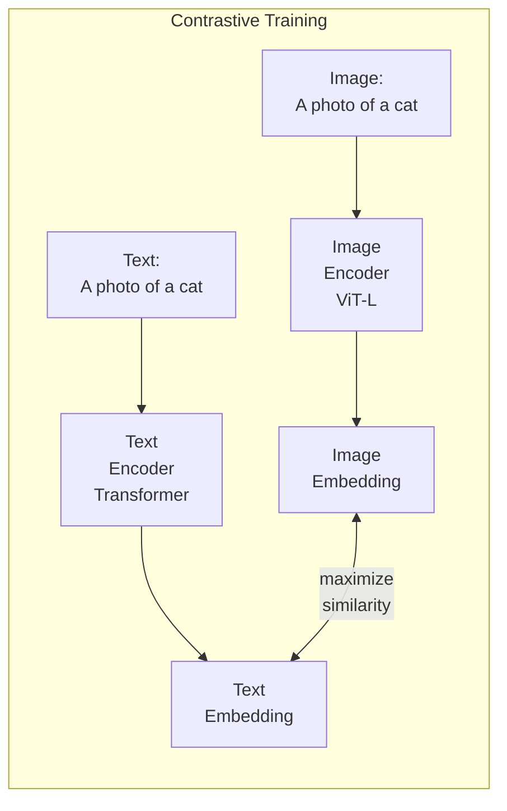
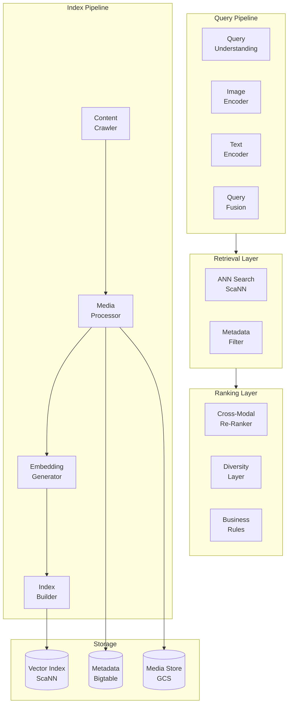

# Design a Multi-Modal Search System

---

## What We're Building

A multi-modal search system — like Google Lens, Google Multi-Search, or Pinterest Lens — that lets users search across modalities: upload an image and ask "where can I buy this?", search for products by photo, combine image + text queries, or search video content by description.

**The key insight:** Users don't think in modalities. They think in *intent*. A multi-modal search system must understand intent across text, image, video, and audio simultaneously.

### Search Modes

| Mode | Input | Output | Example |
|------|-------|--------|---------|
| **Text → Image** | Text query | Matching images | "red vintage car on mountain road" |
| **Image → Image** | Photo | Similar images | Upload shoe photo → similar shoes |
| **Image + Text → Results** | Photo + refinement | Refined results | Photo of dress + "in blue" |
| **Image → Text** | Photo | Identification | Photo of plant → species name |
| **Text → Video** | Text query | Video segments | "soccer goal celebration" |
| **Audio → Text** | Voice/audio | Matching content | Hum a tune → song name |

### Real-World Scale

| Metric | Scale |
|--------|-------|
| **Indexed images** | 10B+ |
| **Indexed videos** | 1B+ (frames/segments) |
| **Queries per day** | 500M+ |
| **Embedding dimensions** | 768–1024 |
| **Index size** | Tens of TBs |
| **Latency target** | < 300ms end-to-end |

### Why This Is Hard

| Challenge | Description |
|-----------|-------------|
| **Cross-modal alignment** | Image of "cat" and text "cat" must map to same embedding region |
| **Scale** | ANN search over 10B+ vectors at sub-100ms latency |
| **Multi-query fusion** | Image + text must combine meaningfully, not just concatenate |
| **Diverse intent** | "Find this product" vs "what is this?" vs "more like this" |
| **Freshness** | New products, trending content must be searchable quickly |
| **Quality at the tail** | Rare objects, niche queries, non-English content |

---

## Key Concepts Primer

### CLIP / SigLIP — Contrastive Language-Image Pre-training

The foundation of multi-modal search. CLIP trains an image encoder and a text encoder **jointly** so that matching image-text pairs have high cosine similarity:



```python
import torch
import torch.nn.functional as F


class CLIPModel:
    """Simplified CLIP for multi-modal embedding."""
    
    def __init__(self, image_encoder, text_encoder, projection_dim=768):
        self.image_encoder = image_encoder
        self.text_encoder = text_encoder
        self.image_projection = torch.nn.Linear(image_encoder.dim, projection_dim)
        self.text_projection = torch.nn.Linear(text_encoder.dim, projection_dim)
    
    def encode_image(self, image: torch.Tensor) -> torch.Tensor:
        features = self.image_encoder(image)
        projected = self.image_projection(features)
        return F.normalize(projected, dim=-1)
    
    def encode_text(self, text_tokens: torch.Tensor) -> torch.Tensor:
        features = self.text_encoder(text_tokens)
        projected = self.text_projection(features)
        return F.normalize(projected, dim=-1)
    
    def similarity(self, image_emb: torch.Tensor, text_emb: torch.Tensor) -> torch.Tensor:
        return (image_emb @ text_emb.T) * self.logit_scale.exp()
```

**Key property:** Because image and text embeddings live in the **same vector space**, you can:
- Search images using text queries (text → image)
- Search using image queries (image → image)
- Combine image + text embeddings for multi-modal queries

### ANN Index Structures

For 10B+ vectors, exact nearest-neighbor search is prohibitive. Approximate methods trade recall for speed:

| Method | Build Time | Query Time | Memory | Recall@10 |
|--------|-----------|------------|--------|-----------|
| **Flat (brute force)** | O(1) | O(n) | 1x | 100% |
| **IVF (Inverted File)** | O(n) | O(n/k) | 1x + overhead | 95-99% |
| **HNSW** | O(n log n) | O(log n) | 1.5-2x | 97-99% |
| **ScaNN** | O(n) | O(n/k) | 0.5x (quantized) | 95-99% |
| **DiskANN** | O(n) | O(log n) + disk | 0.1x in RAM | 95-99% |

**Google's ScaNN** (Scalable Nearest Neighbors) is optimized for production:
1. **Partitioning** — k-means tree to reduce search space
2. **Quantization** — asymmetric hashing compresses vectors
3. **Rescoring** — re-rank top candidates with full precision

### Late Interaction Models (ColPali, ColBERT)

Instead of compressing an entire document/image into a single vector, late interaction retains **per-token/per-patch embeddings** and computes fine-grained similarity:

```
Single-vector approach:
  Image → [768-dim vector]        Text → [768-dim vector]
  Similarity = dot product of 2 vectors

Late interaction approach:
  Image → [196 × 768 matrix]      Text → [20 × 768 matrix]
  (one vector per image patch)     (one vector per text token)
  Similarity = MaxSim(image_patches, text_tokens)
  
MaxSim = sum over text tokens of max similarity to any image patch

Advantage: Captures spatial and fine-grained matching
Disadvantage: Higher storage and compute cost
```

---

## Step 1: Requirements Clarification

### Questions to Ask

| Question | Why It Matters |
|----------|----------------|
| Which modalities? | Image, text, video, audio — each needs different encoders |
| Search modes? | Text→image only, or also image→image, multi-modal? |
| Result types? | Products, web images, user content? |
| Freshness? | How quickly must new content be searchable? |
| Personalization? | Should results consider user history? |
| Geographic/language scope? | Multi-language queries? Region-specific results? |

### Functional Requirements

| Requirement | Priority | Description |
|-------------|----------|-------------|
| Text-to-image search | Must have | Find images matching text descriptions |
| Image-to-image search | Must have | Find visually similar images |
| Multi-modal search | Must have | Image + text refinement queries |
| Object identification | Should have | "What is this?" from a photo |
| Video search | Should have | Find relevant video segments |
| Real-time indexing | Should have | New content searchable within minutes |
| Personalization | Nice to have | Results influenced by user preferences |

### Non-Functional Requirements

| Requirement | Target | Rationale |
|-------------|--------|-----------|
| **End-to-end latency** | < 300ms | Responsive search experience |
| **Recall@10** | > 90% | Must find relevant results |
| **Throughput** | 10K queries/sec | Peak search traffic |
| **Index freshness** | < 15 min | New products must be discoverable |
| **Availability** | 99.99% | Core search infrastructure |

### API Design

```python
# POST /v1/search
{
    "query": {
        "text": "in blue color",            # optional text query
        "image": "<base64_or_url>",         # optional image query
        "modality_weights": {               # optional: how to blend
            "text": 0.4,
            "image": 0.6
        }
    },
    "filters": {
        "content_type": ["product", "web_image"],
        "category": "fashion",
        "price_range": {"min": 20, "max": 200}
    },
    "result_type": "image",
    "top_k": 20,
    "include_metadata": true
}

# Response
{
    "results": [
        {
            "id": "img-abc123",
            "url": "https://cdn.example.com/products/blue-dress.jpg",
            "title": "Navy Blue A-Line Dress",
            "score": 0.92,
            "metadata": {
                "source": "product_catalog",
                "category": "fashion/dresses",
                "price": 89.99
            }
        }
    ],
    "query_understanding": {
        "detected_objects": ["dress"],
        "inferred_intent": "product_search",
        "color_refinement": "blue"
    },
    "total_results": 1847,
    "latency_ms": 187
}
```

---

## Step 2: Back-of-Envelope Estimation

### Traffic

```
Search queries/day:           200M
Peak QPS:                     200M / 86400 × 3 ≈ 7,000
Image queries (need encoding): 40% = 2,800/s
Text-only queries:            60% = 4,200/s
```

### Index Size

```
Total indexed items:          10B
Embedding dimensions:         768

Vector storage (float32):     10B × 768 × 4 bytes = 30.7 TB
Quantized (int8):             10B × 768 × 1 byte = 7.7 TB
With PQ (64 bytes/vector):    10B × 64 = 640 GB  ← fits in memory cluster

Metadata per item:            200 bytes × 10B = 2 TB
Thumbnail cache:              10B × 5 KB avg = 50 TB (CDN)
```

### Compute

```
Image encoding (ViT-L):
  Per image: ~20ms on A100
  At 2,800/s: 2,800 × 0.02 = 56 GPU-seconds/s → 56 A100 GPUs
  With batching (batch=32): 56 / 4 ≈ 14 A100 GPUs

Text encoding:
  Per query: ~5ms on A100
  At 7,000/s: negligible (handled by CPU or shared GPU)

ANN search (ScaNN, 10B vectors):
  Per query: ~5ms (partitioned, quantized)
  At 7,000/s: ~200 CPU cores (distributed across index shards)

Re-ranking:
  Cross-encoder on top 100: ~30ms per query on GPU
  At 7,000/s: ~210 GPU-seconds/s → requires batching, ~50 GPUs
```

### Latency Budget

```
Image encoding:               20ms (GPU)
Text encoding:                5ms (GPU)  
Query fusion:                 2ms (CPU)
ANN search (ScaNN):           10ms (distributed)
Post-filter (metadata):       5ms
Re-ranking (top 100):         30ms (GPU)
Result assembly:              5ms
Network overhead:             20ms
─────────────────────────────
Total:                        ~97ms (well under 300ms budget)
```

---

## Step 3: High-Level Design



---

## Step 4: Deep Dive

### 4.1 Query Understanding and Fusion

```python
class MultiModalQueryProcessor:
    """Process and fuse multi-modal queries."""
    
    def __init__(self, image_encoder, text_encoder, fusion_model):
        self.image_encoder = image_encoder
        self.text_encoder = text_encoder
        self.fusion_model = fusion_model
    
    async def process_query(self, query: SearchQuery) -> FusedQueryEmbedding:
        intent = await self._classify_intent(query)
        
        embeddings = {}
        
        if query.image:
            preprocessed = self._preprocess_image(query.image)
            
            detected_objects = await self.object_detector.detect(preprocessed)
            ocr_text = await self.ocr_engine.extract(preprocessed)
            
            img_embedding = self.image_encoder.encode(preprocessed)
            embeddings["image"] = img_embedding
        
        if query.text:
            expanded_text = query.text
            if query.image and ocr_text:
                expanded_text = f"{query.text} {ocr_text}"
            
            txt_embedding = self.text_encoder.encode(expanded_text)
            embeddings["text"] = txt_embedding
        
        fused = self._fuse_embeddings(embeddings, query.modality_weights, intent)
        
        return FusedQueryEmbedding(
            embedding=fused,
            intent=intent,
            detected_objects=detected_objects if query.image else [],
            ocr_text=ocr_text if query.image else None,
        )
    
    def _fuse_embeddings(self, embeddings: dict, weights: dict | None,
                          intent: QueryIntent) -> torch.Tensor:
        """Fuse multi-modal embeddings based on intent and weights."""
        if len(embeddings) == 1:
            return list(embeddings.values())[0]
        
        if weights:
            fused = sum(
                w * embeddings[mod] for mod, w in weights.items() if mod in embeddings
            )
            return F.normalize(fused, dim=-1)
        
        if intent == QueryIntent.REFINE_BY_TEXT:
            fused = 0.6 * embeddings["image"] + 0.4 * embeddings["text"]
        elif intent == QueryIntent.IDENTIFY_OBJECT:
            fused = 0.8 * embeddings["image"] + 0.2 * embeddings.get("text", 0)
        else:
            fused = 0.5 * embeddings["image"] + 0.5 * embeddings["text"]
        
        return F.normalize(fused, dim=-1)
    
    async def _classify_intent(self, query: SearchQuery) -> QueryIntent:
        """Classify search intent from the query signals."""
        if query.image and not query.text:
            return QueryIntent.VISUAL_SIMILARITY
        if query.text and not query.image:
            return QueryIntent.TEXT_SEARCH
        if query.image and query.text:
            text_lower = query.text.lower()
            if any(w in text_lower for w in ["what is", "identify", "tell me about"]):
                return QueryIntent.IDENTIFY_OBJECT
            if any(w in text_lower for w in ["in blue", "cheaper", "similar but"]):
                return QueryIntent.REFINE_BY_TEXT
            return QueryIntent.MULTI_MODAL
        return QueryIntent.TEXT_SEARCH
```

### 4.2 Distributed Vector Index

```python
class ShardedVectorIndex:
    """Distributed ANN index sharded across multiple machines."""
    
    def __init__(self, num_shards: int, replicas_per_shard: int):
        self.num_shards = num_shards
        self.replicas_per_shard = replicas_per_shard
        self.shard_clients = self._init_shard_clients()
    
    async def search(self, query_embedding: torch.Tensor, top_k: int = 100,
                     filters: dict | None = None) -> list[SearchResult]:
        """Scatter-gather search across all shards."""
        per_shard_k = top_k * 2
        
        shard_futures = [
            self._search_shard(shard_id, query_embedding, per_shard_k, filters)
            for shard_id in range(self.num_shards)
        ]
        
        shard_results = await asyncio.gather(*shard_futures)
        
        all_results = []
        for results in shard_results:
            all_results.extend(results)
        
        all_results.sort(key=lambda r: r.score, reverse=True)
        return all_results[:top_k]
    
    async def _search_shard(self, shard_id: int, query: torch.Tensor,
                            top_k: int, filters: dict | None) -> list[SearchResult]:
        """Search a single shard with replica selection."""
        replica = self._select_replica(shard_id)
        try:
            return await replica.search(query, top_k, filters)
        except Exception:
            backup = self._select_backup_replica(shard_id, exclude=replica)
            return await backup.search(query, top_k, filters)
    
    def _shard_assignment(self, item_id: str) -> int:
        return hash(item_id) % self.num_shards
```

**Sharding strategy:**

| Strategy | Pros | Cons |
|----------|------|------|
| **Random hash** | Even distribution, simple | Every shard searched for every query |
| **Cluster-based** | Prune irrelevant shards | Uneven load; cluster quality matters |
| **Hybrid** | Coarse clustering + hash within | Best balance |

For 10B vectors at 768 dimensions:
- 256 shards, each holding ~39M vectors
- 3 replicas per shard for fault tolerance
- Each shard fits in ~30 GB RAM (with PQ compression)
- 256 × 3 = 768 machines for the vector index

### 4.3 Indexing Pipeline


```python
class IndexingPipeline:
    """Process and index new content for multi-modal search."""
    
    async def index_item(self, item: ContentItem) -> IndexRecord:
        existing = await self.dedup_store.check(item.content_hash)
        if existing:
            return existing
        
        processed = await self._process_media(item)
        
        embedding = await self.embedding_service.encode_image(processed.image)
        
        quality = self._assess_quality(embedding, processed)
        if quality.score < 0.3:
            return IndexRecord(indexed=False, reason="low_quality")
        
        metadata = IndexMetadata(
            item_id=item.id,
            source=item.source,
            detected_objects=processed.objects,
            ocr_text=processed.ocr_text,
            colors=processed.dominant_colors,
            category=processed.predicted_category,
            timestamp=item.created_at,
        )
        
        await self.vector_index.add(item.id, embedding, metadata)
        await self.metadata_store.put(item.id, metadata)
        
        return IndexRecord(indexed=True, item_id=item.id)
    
    async def _process_media(self, item: ContentItem) -> ProcessedMedia:
        image = self._resize_and_normalize(item.raw_image)
        
        objects, ocr_text, colors = await asyncio.gather(
            self.object_detector.detect(image),
            self.ocr_engine.extract(image),
            self._extract_colors(image),
        )
        
        return ProcessedMedia(
            image=image,
            objects=objects,
            ocr_text=ocr_text,
            dominant_colors=colors,
        )
```

### 4.4 Re-Ranking with Cross-Modal Scoring

```python
class CrossModalReranker:
    """Re-rank ANN candidates with fine-grained cross-modal scoring."""
    
    def __init__(self, cross_encoder):
        self.cross_encoder = cross_encoder  # Late-interaction or cross-attention model
    
    async def rerank(self, query: FusedQueryEmbedding, 
                     candidates: list[SearchResult], top_k: int = 20) -> list[SearchResult]:
        """Re-rank candidates using expensive cross-modal scoring."""
        if query.intent == QueryIntent.IDENTIFY_OBJECT:
            scored = await self._rerank_identification(query, candidates)
        else:
            scored = await self._rerank_similarity(query, candidates)
        
        diversified = self._apply_diversity(scored, top_k)
        
        return diversified
    
    async def _rerank_similarity(self, query: FusedQueryEmbedding,
                                  candidates: list[SearchResult]) -> list[SearchResult]:
        """Cross-encoder re-ranking for similarity search."""
        candidate_images = await self._fetch_images(candidates)
        
        scores = await self.cross_encoder.score_batch(
            query_embedding=query.embedding,
            candidate_images=candidate_images,
            query_text=query.original_text,
        )
        
        for candidate, score in zip(candidates, scores):
            candidate.score = 0.3 * candidate.score + 0.7 * score
        
        candidates.sort(key=lambda r: r.score, reverse=True)
        return candidates
    
    def _apply_diversity(self, results: list[SearchResult], 
                          top_k: int) -> list[SearchResult]:
        """MMR-style diversification to avoid redundant results."""
        selected = [results[0]]
        remaining = results[1:]
        
        while len(selected) < top_k and remaining:
            best_idx = -1
            best_score = -float("inf")
            
            for i, candidate in enumerate(remaining):
                relevance = candidate.score
                max_sim = max(
                    self._similarity(candidate.embedding, s.embedding)
                    for s in selected
                )
                mmr = 0.7 * relevance - 0.3 * max_sim
                
                if mmr > best_score:
                    best_score = mmr
                    best_idx = i
            
            selected.append(remaining.pop(best_idx))
        
        return selected
```

### 4.5 Video Search — Temporal Segmentation

```python
class VideoSearchIndexer:
    """Index video content for temporal multi-modal search."""
    
    FRAMES_PER_SECOND = 1   # Sample 1 frame per second
    SEGMENT_DURATION = 10   # 10-second segments
    
    async def index_video(self, video: Video) -> list[VideoSegment]:
        frames = self._extract_keyframes(video)
        
        audio_transcript = await self.speech_to_text.transcribe(video.audio)
        
        segments = self._create_segments(frames, audio_transcript, video.duration)
        
        for segment in segments:
            frame_embeddings = await self.image_encoder.encode_batch(segment.frames)
            segment.visual_embedding = frame_embeddings.mean(dim=0)
            
            if segment.transcript:
                segment.text_embedding = self.text_encoder.encode(segment.transcript)
                segment.embedding = F.normalize(
                    0.6 * segment.visual_embedding + 0.4 * segment.text_embedding,
                    dim=-1,
                )
            else:
                segment.embedding = segment.visual_embedding
            
            await self.vector_index.add(
                f"{video.id}_seg{segment.index}",
                segment.embedding,
                metadata={
                    "video_id": video.id,
                    "start_time": segment.start_time,
                    "end_time": segment.end_time,
                    "transcript": segment.transcript,
                },
            )
        
        return segments
```

### 4.6 Online Learning and Index Updates

```python
class OnlineIndexUpdater:
    """Handle real-time index updates for new and changed content."""
    
    async def handle_update(self, event: ContentEvent):
        if event.type == "create":
            embedding = await self.embedding_service.encode(event.content)
            await self.vector_index.add(event.item_id, embedding, event.metadata)
            
        elif event.type == "update":
            embedding = await self.embedding_service.encode(event.content)
            await self.vector_index.update(event.item_id, embedding, event.metadata)
            
        elif event.type == "delete":
            await self.vector_index.delete(event.item_id)
    
    async def refresh_stale_embeddings(self):
        """Re-encode items when the embedding model is updated."""
        stale_items = await self.metadata_store.get_items_with_old_model_version(
            current_version=self.model_version
        )
        
        for batch in self._batch(stale_items, size=256):
            contents = await self._fetch_contents(batch)
            new_embeddings = await self.embedding_service.encode_batch(contents)
            
            for item, embedding in zip(batch, new_embeddings):
                await self.vector_index.update(item.id, embedding)
                await self.metadata_store.update_model_version(
                    item.id, self.model_version
                )
```

---

## Step 5: Scaling & Production

### Failure Handling

| Failure | Detection | Recovery |
|---------|-----------|----------|
| **Index shard down** | Health check | Route to replica; alert if all replicas fail |
| **Embedding GPU failure** | Timeout | Queue queries; serve from cache |
| **Stale index** | Freshness lag > 30 min | Alert; serve from last-known-good |
| **Model quality regression** | Eval metrics drop | Rollback to previous model version |
| **Traffic spike** | QPS > 2x normal | Shed load on re-ranking; serve ANN-only |

### Monitoring

| Metric | Alert Threshold |
|--------|----------------|
| **Search latency P95** | > 500ms |
| **Recall@10** | < 85% (sampled eval) |
| **Index freshness** | > 30 min behind |
| **Shard balance** | > 20% imbalance |
| **Embedding encoding latency** | > 50ms per image |
| **Error rate** | > 0.1% |

### Trade-offs

| Decision | Option A | Option B | Recommendation |
|----------|----------|----------|----------------|
| **Embedding model** | CLIP ViT-B (fast, 512-dim) | SigLIP ViT-L (accurate, 1024-dim) | ViT-L for quality; ViT-B for latency-sensitive |
| **Index type** | HNSW (high recall) | ScaNN (lower memory) | ScaNN for 10B+ scale; HNSW for < 1B |
| **Quantization** | Float32 (exact) | PQ 64-byte (approx) | PQ with rescoring (4x memory savings) |
| **Re-ranking** | Skip | Cross-encoder top 100 | Cross-encoder (significant quality lift) |
| **Video indexing** | Keyframe-only | Segment + transcript | Segment + transcript for comprehensiveness |

---

## Hypothetical Interview Transcript

!!! note
    This transcript simulates a 45-minute Google L5/L6 system design round. The interviewer is a Staff Engineer on the Google Lens / Visual Search team.

---

**Interviewer:** Design a multi-modal search system. Users can search with text, images, or both — like Google Lens combined with Google Image Search. How would you approach this?

**Candidate:** Great question. Let me start with some clarifications. What are the primary modalities — text and image, or also video and audio? What's the corpus size — millions or billions of indexed items? And what's the primary use case — product search, general web image search, or object identification?

**Interviewer:** Text and images primarily, with video as a stretch goal. 10 billion indexed images, mix of products and web images. All use cases — product search, visual similarity, and "what is this?"

**Candidate:** 10 billion images is a massive index. Let me think about this in three layers: how we **encode** queries and documents into a shared embedding space, how we **index and retrieve** at this scale, and how we **rank** for quality.

**The foundation is a CLIP-family model** — like SigLIP — that jointly trains image and text encoders so that matching image-text pairs have similar embeddings. This gives us a unified 768-dimensional vector space where a photo of a cat and the text "a cat" are close together. This single insight enables all our search modes: text queries search through image embeddings, image queries find similar image embeddings, and multi-modal queries blend both.

For the index, at 10 billion vectors with 768 dimensions, storing float32 would be ~30 TB — too much for in-memory serving. We need **product quantization** (PQ) to compress each vector from 3,072 bytes (768 × 4) down to ~64 bytes. That brings us to ~640 GB, which we can shard across ~256 machines with replicas. I'd use Google's ScaNN library for the ANN search — it does quantized search followed by exact rescoring of the top candidates.

For ranking, the ANN results are approximate. A cross-modal re-ranker — which does finer-grained scoring by comparing patch-level image features with token-level text features — boosts quality significantly. This is more expensive, so we only apply it to the top 100 ANN candidates.

**Interviewer:** Walk me through what happens when a user points their phone at a pair of shoes and adds the text "in red."

**Candidate:** This is a multi-modal refinement query — the most interesting case. Let me trace it:

1. **Image encoding.** The shoe photo is resized, normalized, and passed through the SigLIP image encoder. This produces a 768-dim embedding that captures "this is an athletic shoe, white, specific brand style." Takes ~20ms on a GPU.

2. **Text encoding.** The text "in red" is encoded to a 768-dim text embedding. This captures the color modification intent. ~5ms.

3. **Query understanding.** We classify the intent. Image + short modifier text → this is a `REFINE_BY_TEXT` intent. We also run object detection on the image — detecting "shoe" — which helps us understand the product category.

4. **Embedding fusion.** We combine the image and text embeddings. For refinement queries, I'd weight the image more heavily — say 60% image, 40% text — because the user wants "shoes like this but in red," not "anything red." The fused vector is L2-normalized.

5. **ANN search.** The fused embedding is sent to all 256 index shards in parallel. Each shard searches its ~39M vectors and returns the top 200 candidates. We merge across shards using a priority queue, keeping the top 1000 globally. ~10ms.

6. **Metadata filtering.** If the user has category filters (shoes, price range), we apply them post-retrieval. We may also infer the category from the detected object ("shoe") and boost results in that category.

7. **Re-ranking.** The top 100 candidates go through a cross-modal re-ranker that does finer-grained scoring — comparing image patches of each candidate with the query. It asks: "does this shoe look similar AND is it red?" ~30ms.

8. **Diversification.** We apply MMR (Maximal Marginal Relevance) to ensure the top 20 results aren't all the same shoe from different angles. We want diversity in brand, style, and price.

9. **Result assembly.** Attach metadata (title, price, source URL, thumbnails) and return. Total latency: ~100ms.

**Interviewer:** Good. You mentioned 10 billion images and product quantization. How do you handle the quality vs. memory tradeoff?

**Candidate:** Product quantization introduces approximation error — we're searching over compressed representations. The key technique is **asymmetric distance computation with rescoring.**

Here's how it works: we compress all **index vectors** using PQ (lossy), but the **query vector stays in full precision**. The distance computation is asymmetric — full-precision query against compressed index vectors. This is more accurate than compressing both.

Then, for the top 1000 ANN candidates, we **rescore** using the full-precision original vectors. We store the full vectors on disk (SSD), not in memory. The rescore step reads ~1000 × 3KB = 3MB from disk, which takes ~2ms on NVMe SSD. This brings recall@10 from ~90% (PQ only) to ~98% (PQ + rescore).

The memory math:
- PQ at 64 bytes/vector × 10B = 640 GB in RAM (the searchable index)
- Full vectors on SSD: 30 TB (for rescoring)
- With 3 replicas and 256 shards: each shard holds 2.5 GB of PQ data in RAM + 120 GB on SSD

This is well within the capacity of modern servers with 32 GB RAM and 1 TB NVMe.

**Interviewer:** How do you handle the case where the user's query image contains text — like a photo of a book cover or a restaurant sign?

**Candidate:** Great edge case. The image encoder alone will capture the visual appearance of the text (font, layout) but won't reliably "read" it. We need OCR.

Our processing pipeline runs OCR on every query image as a parallel branch. If OCR detects text — like "The Great Gatsby" on a book cover — we append it to the text modality. So the query becomes: image embedding (visual similarity to the book) + text embedding ("The Great Gatsby" from OCR + any user-typed text).

For the index side, we also run OCR during indexing and store the extracted text as metadata. This means we can do keyword matching on OCR text in addition to the embedding search — like a hybrid retrieval approach.

In practice, OCR text is incredibly valuable for product search. A photo of a product label, a restaurant menu, or a business card — the text content is often more important than the visual features. I'd weight OCR text heavily when detected: something like 40% image + 40% OCR text + 20% user text.

**Interviewer:** How do you evaluate multi-modal search quality?

**Candidate:** Multi-modal evaluation is harder than single-modal because ground truth is more subjective. I'd use a three-tier approach:

**Tier 1: Automated metrics on curated datasets.** We build a golden set of ~10K queries (image-only, text-only, and multi-modal) with human-labeled relevant results. We compute Recall@K, NDCG@K, and MRR on this set daily. This catches regressions quickly.

**Tier 2: Side-by-side evaluation.** For model upgrades, we show human raters the top 10 results from the old model and the new model side by side. They rate which set is better. We need a win rate > 55% with statistical significance to ship.

**Tier 3: Online metrics.** In production, we measure click-through rate (did the user click a result?), reformulation rate (did the user modify their query — suggesting dissatisfaction?), and time-to-click. For product search specifically: add-to-cart rate for results from visual search.

One important nuance: different search modes need different evaluation. For "what is this?" queries, correctness matters (did we identify the right species of plant?). For "find similar," diversity and relevance both matter. For product search, commercial intent metrics (CTR, conversion) are primary.

We segment our evaluation by query type and track each independently. A model that improves product search by 5% but degrades identification accuracy by 10% needs careful analysis before shipping.

**Interviewer:** Great depth across the system. That's a wrap.
