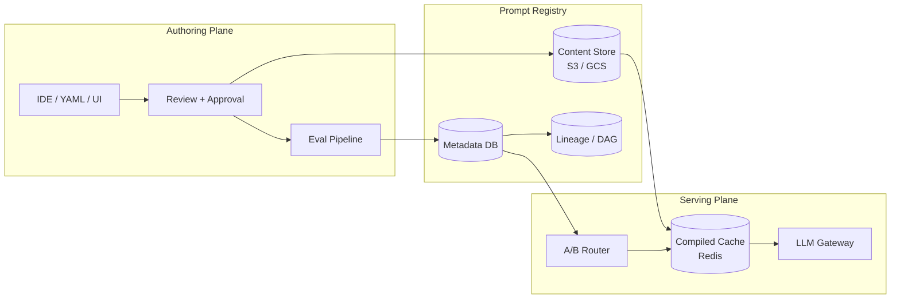
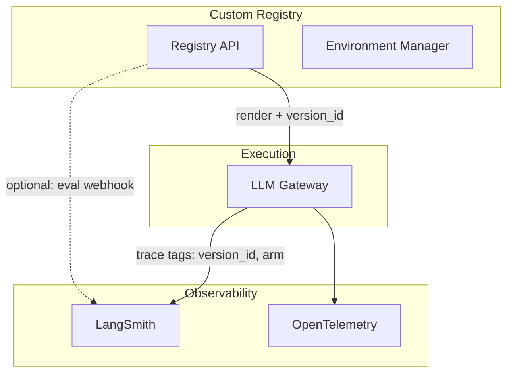
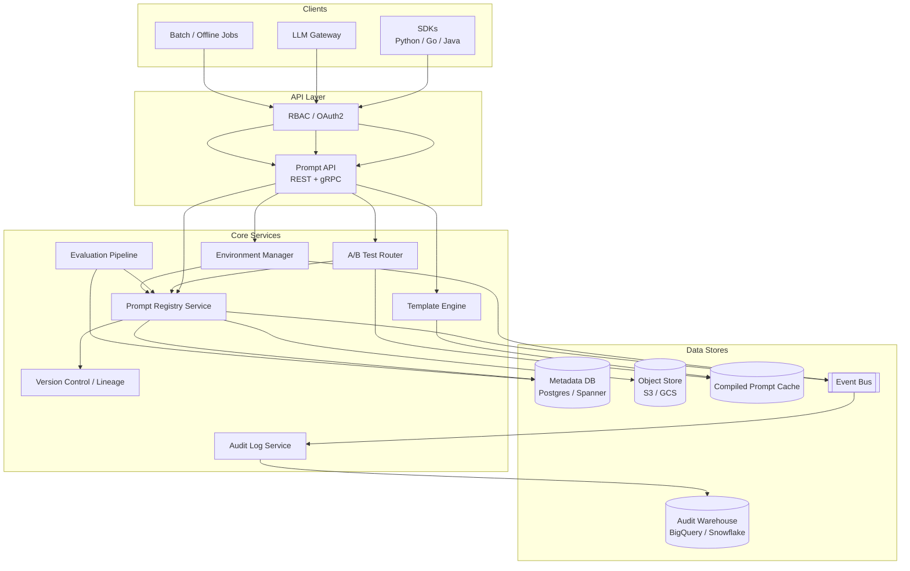
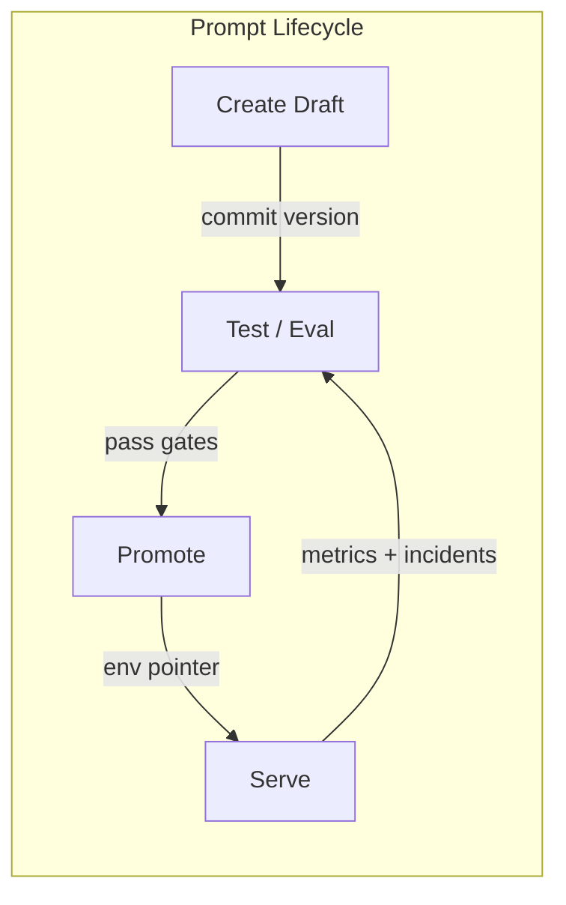
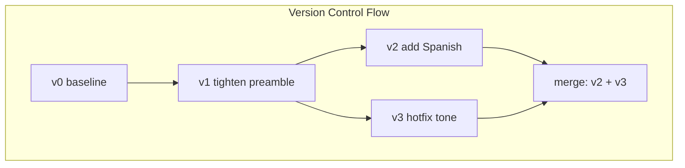
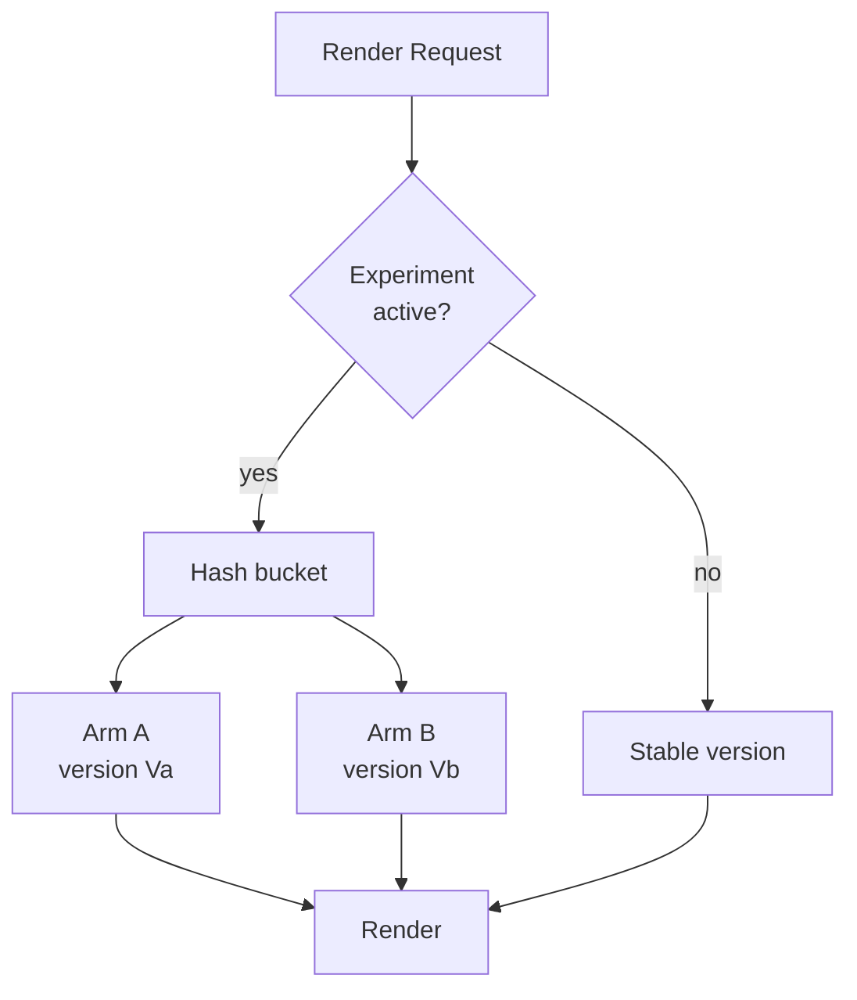
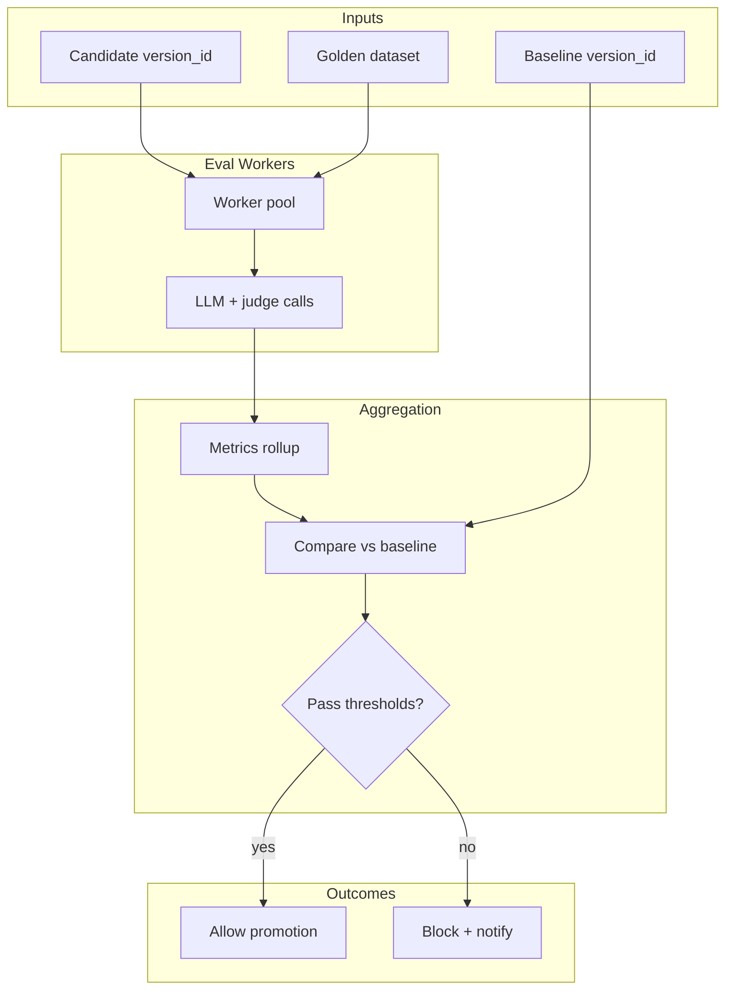
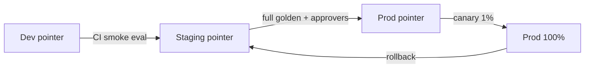

# Design a Prompt Management and Versioning System

---

## What We're Building

Design a **Prompt Management and Versioning System** — a **control plane for LLM prompts** analogous to a **model registry**, but for **natural-language programs**: templates, variables, few-shot examples, composition chains, and lifecycle governance. Applications do not hardcode prompts in repos; they resolve **immutable prompt versions** at runtime, with **A/B experiments**, **golden-set evaluation gates**, **environment promotion** (dev → staging → prod), **audit trails**, and **one-click rollback**.

**What the platform owns end-to-end:**

| Concern | What “good” looks like |
|---------|------------------------|
| **Prompt registry** | Single source of truth; namespaced prompts with semantic versioning |
| **Templating** | Jinja-style variables, validation, and safe rendering |
| **Versioning** | Linear tags + optional DAG (fork/merge); few-shots versioned with the template |
| **Evaluation** | Every candidate version runs against a **golden dataset** before promotion |
| **Serving** | Low-latency **compiled prompt** cache; traffic split for experiments |
| **Governance** | RBAC, audit log, approvals, and environment gates |

### Why This Problem Is Hard

| Challenge | Why it hurts | What breaks if ignored |
|-----------|--------------|-------------------------|
| **Non-determinism** | Same prompt + model can vary; “correct” is fuzzy | Silent regressions in production |
| **Entanglement** | Prompt text, few-shots, tools, and model params co-change | Rollback one knob without the others → worse than before |
| **Composition** | Chained prompts and sub-prompt imports create implicit DAGs | Partial updates leave inconsistent graphs |
| **Scale of change** | Hundreds of teams edit prompts weekly | Merge conflicts, untracked hotfixes in code |
| **Evaluation cost** | Golden-set LLM evals are expensive and slow | Teams skip gates → quality drift |
| **Latency** | Fetch + render + validate on every request | TTFT budget blown on “just loading the prompt” |

### Real-World Scale

| Metric | Scale (illustrative enterprise) |
|--------|----------------------------------|
| **Registered prompts** | 5K–50K logical prompts (names) |
| **Versions / month** | 20K–200K new immutable versions |
| **Active production versions** | 1–3 per prompt (canary + stable) |
| **Render / resolve QPS** | 2K–20K/s at peak (batched with inference gateway) |
| **Golden examples / prompt** | 50–2K labeled or rubric-scored cases |
| **Concurrent A/B experiments** | 50–500 overlapping (tenant-scoped) |
| **Environments** | dev, staging, prod (+ optional sandbox) |
| **Audit events / day** | 500K–5M (reads + writes + promotions) |

!!! note
    In interviews, separate **authoring time** (Git-like UX, PRs, eval jobs) from **serving time** (sub-10 ms cache hit path). Most designs fail by putting Postgres round-trips on the hot path.

---

## Key Concepts Primer

### Prompt Registry vs Model Registry

| Dimension | Model registry | Prompt registry |
|-----------|----------------|-----------------|
| **Artifact** | Weights, tokenizer, metrics | Template + metadata + few-shots + params |
| **Immutability** | Version = blob hash | Version = content hash + lineage id |
| **Runtime** | Load once per replica | Resolve per request (with cache) |
| **Evaluation** | Benchmark accuracy | LLM-as-judge, rubrics, task metrics |



### Templating (Jinja-Style)

**Goals:** Variable substitution, optional conditionals, strict **allowlists** for variables (no arbitrary code execution), and **schema validation** of inputs before render.

| Concept | Purpose |
|---------|---------|
| **StrictEnvironment** | Disable dangerous Jinja features |
| **JSON Schema for variables** | Reject bad payloads at the boundary |
| **Precompile** | Turn template → bytecode once per version |

### Few-Shot Versioning

Few-shot examples are **first-class data**: they ship with the same **version id** as the system/user template. Changing a single example creates a **new immutable version**, not an in-place edit.

### Prompt Composition and Chaining

**Composition** = include/extend (“prompt A imports snippet B”). **Chaining** = multi-step graphs (planner → retriever → answer). The registry stores **nodes** and **edges**; the runtime **topologically sorts** and executes with shared variable scope (with explicit namespacing).

### A/B Testing and Traffic Splitting

Use **deterministic hashing** (e.g., `hash(user_id || prompt_name) % 10000`) for sticky assignment, plus **server-side overrides** for internal testers. Metrics: task success, judge score, latency, token cost, safety flags.

### Evaluation Gates

**Offline:** run version `v'` on golden set → aggregate metrics → compare to baseline `v`. **Promotion:** only if thresholds pass (and optionally human approval). **Online:** shadow traffic or small canary before full rollout.

### Tools Landscape

| Tool | Role |
|------|------|
| **LangSmith** | Tracing, datasets, eval runs; pairs well with LangChain apps |
| **Prompt flow (Azure / OSS patterns)** | DAG authoring + eval hooks in enterprise Azure stacks |
| **Custom registry** | Full control: RBAC, audit, multi-cloud, proprietary eval |

### LangSmith, Prompt flow, and a Custom Registry

| Layer | LangSmith / Prompt flow strength | Custom registry strength |
|-------|----------------------------------|---------------------------|
| **AuthZ / tenancy** | Project-scoped | Row-level, cell-based, SOX workflows |
| **Environment pointers** | Often app-config adjacent | First-class `dev/staging/prod` with approvals |
| **Tracing** | Excellent spans + datasets | Emit `version_id` tags from your SDK |
| **Eval storage** | Hosted runs | Your golden data in warehouse + policy |

**Practical split:** Use the **custom registry** as the **source of truth** for immutable `version_id` and promotion; **sync or tag** runs in LangSmith so debugging stays one click away. Prompt flow–style DAGs can **call** your render API as a node so toolchains stay portable.



```python
# Minimal mental model: prompt version = content-addressed document
from dataclasses import dataclass
from typing import Any


@dataclass(frozen=True)
class PromptVersionRef:
    prompt_name: str
    version_id: str  # immutable, e.g. sha256:... or ulid

    def cache_key(self, env: str) -> str:
        return f"prompt:{self.prompt_name}:{self.version_id}:{env}"
```

!!! tip
    Say **“immutable version, mutable alias”**: `production` points to `v_2026_04_08_001`, and rollback is **pointer move** + cache purge, not rewriting history.

---

## Step 1: Requirements Clarification

### Questions to Ask

| Question | Why it matters |
|----------|----------------|
| Who authors prompts — engineers only or PMs/designers too? | UX, guardrails, and RBAC complexity |
| Do prompts include **tools/schemas** and **model default params**? | Schema versioning coupled to prompt version |
| Is **sticky** A/B assignment required per user/session? | Router design and hash bucketing |
| What **eval** exists today — human labels, rubrics, automatic judges? | Cost and latency of gates |
| Multi-tenant or single company? | Isolation, noisy neighbor, billing |
| Regulatory needs (SOX, HIPAA)? | Audit granularity and retention |
| Latency budget for **resolve + render**? | Cache tiers and precompilation |
| Do we need **prompt signing** or **tamper evidence**? | Compliance-heavy customers |

### Functional Requirements

| ID | Requirement | Notes |
|----|-------------|-------|
| **F1** | **Central prompt registry** with names, namespaces, descriptions | Like model registry browse UI + API |
| **F2** | **Immutable versions** for template + variables schema + few-shots + linked assets | No in-place mutation |
| **F3** | **Jinja-style templating** with validated variables | Fail closed on missing/extra keys |
| **F4** | **Composition** (includes) and **chaining** (DAG execution spec) | Cycle detection at publish time |
| **F5** | **A/B routing** between versions with configurable weights | Sticky assignment + overrides |
| **F6** | **Golden dataset evaluation** before promotion | Batch jobs + thresholds |
| **F7** | **Environment promotion** dev → staging → prod with gates | Approvals + CI hooks |
| **F8** | **One-click rollback** of environment pointer | Audit + cache invalidation |
| **F9** | **Audit trail** — who / what / when / why | Append-only event store |
| **F10** | **SDK + HTTP API** for fetch-render or fetch-only | Language-agnostic clients |

### Non-Functional Requirements

| NFR | Target | Rationale |
|-----|--------|-----------|
| **Resolve latency (p99)** | **&lt; 5 ms** cached; **&lt; 50 ms** cold with regional cache | On critical path before LLM |
| **Registry API availability** | **99.95%** | Degraded: last-known-good bundle |
| **Durability** | **No silent loss** of versions; object store + DB replication | Compliance and reproducibility |
| **Audit retention** | **7 years** (configurable) | Enterprise policy |
| **Throughput** | **10K resolve QPS** with horizontal scale | Shard by prompt name hash |

### API Design

```python
# POST /v1/prompts/{namespace}/{name}/versions — create new immutable version
{
  "template": "Answer briefly in {{ language }}.\n\nContext:\n{{ context }}\n\nQ: {{ question }}",
  "variable_schema": {
    "type": "object",
    "required": ["language", "context", "question"],
    "properties": {
      "language": {"type": "string", "enum": ["en", "es"]},
      "context": {"type": "string", "maxLength": 32000},
      "question": {"type": "string", "maxLength": 4096}
    },
    "additionalProperties": false
  },
  "few_shot_examples": [
    {"role": "user", "content": "..."},
    {"role": "assistant", "content": "..."}
  ],
  "metadata": {
    "owner_team": "search-ranking",
    "model_defaults": {"model": "gpt-4o", "temperature": 0.2},
    "tags": ["prod-candidate"]
  },
  "composition": {
    "includes": [
      {"alias": "style", "version_id": "sha256:1a2b3c..."}
    ]
  },
  "changelog": "Tighten safety preamble; add Spanish support."
}

# 201 Response
{
  "version_id": "sha256:9f3c2b1a...",
  "created_at": "2026-04-08T12:00:00Z",
  "lineage_parent": "sha256:8d2e..."
}

# POST /v1/render — hot path (often called by gateway)
{
  "ref": {"namespace": "acme", "name": "support.answer", "environment": "production"},
  "variables": {
    "language": "en",
    "context": "...",
    "question": "Why was I charged twice?"
  },
  "experiment_key": "user-12345"   # optional, for sticky A/B
}

# 200 Response
{
  "resolved_version_id": "sha256:9f3c2b1a...",
  "messages": [
    {"role": "system", "content": "..."},
    {"role": "user", "content": "..."},
    {"role": "assistant", "content": "..."},
    {"role": "user", "content": "Why was I charged twice?"}
  ],
  "experiment_arm": "A"
}
```

---

## Step 2: Back-of-Envelope Estimation

### Traffic

```
Authors (engineers + PMs):          2,000
Prompt edits per author per month:  10  (many small tweaks)
New versions per month:             20,000

Serving:
Dependent services:                 400 microservices using the registry
Requests per service peak:          50 RPS (some burst higher)
Aggregate resolve+render QPS:       400 × 50 = 20,000/s peak

Assume 90% cache hit at edge (Redis) after warm:
Origin reads:                       2,000/s
Registry metadata QPS (cold):       ~2K/s (batched)
```

### Storage

```
Template + few-shots avg compressed:     8 KB
Metadata row:                              1 KB
Versions per month:                      20,000
Monthly version storage:                 20K × 9 KB ≈ 180 MB / month
Annual:                                  ~2.2 GB (negligible vs object store)

Audit events:
Events per day:                          2,000,000
Avg event size (JSON):                   500 B
Per day:                                 ~1 GB/day → ~350 GB/year before compaction

Golden datasets:
Prompts with active goldens:             2,000
Examples per prompt:                     200
Avg example (input+output+labels):       2 KB
Total:                                   2K × 200 × 2 KB ≈ 800 MB (metadata + blobs separate)
```

### Compute

```
Evaluation batch job:
New versions needing full eval/day:      500
Examples per version:                    200
LLM calls per example (1 generation + 1 judge): 2
Total LLM calls/day:                     500 × 200 × 2 = 200,000 calls

At 2 Hz per worker effective (latency + rate limits):
Workers needed (8h window):              200K / (2 × 28,800) ≈ 4 workers minimum
Budget generously:                       50–200 autoscaled eval workers
```

### Cost (Order-of-Magnitude)

| Item | Assumption | ~Monthly |
|------|------------|----------|
| **Object storage** | 50M GET, 5M PUT, 500 GB | $ hundreds |
| **Metadata DB** | 10K RU/s equivalent multi-region | $5K–$20K |
| **Redis cluster** | 6 nodes, HA | $3K–$10K |
| **Eval LLM** | 200K judge+gen calls/day @ blended $0.002 | ~$12K |
| **Engineering** | 8–12 FTE platform | dominant |

**Savings levers:** (1) **bundle** object storage GETs — one manifest per version instead of N includes; (2) **dedupe** blobs by **content hash** across namespaces where policy allows; (3) **replay** production traces into eval only for **changed** prompt families.

### Network Egress (Registry ↔ Services)

```
Assume 20K render QPS peak, 90% cache hit → 2K origin fetches/s
Avg bundle size (metadata + template + few-shots pointer): 4 KB
Egress to app clusters: 2K × 4 KB = 8 MB/s ≈ 691 GB/day if sustained peak

Mitigation: co-locate registry read path in same region/VPC; gRPC + zstd; push bundles to regional cache on promotion.
```

!!! warning
    **Eval cost dominates** if every micro-edit triggers a 200-example LLM sweep. Mitigate with **tiered gates**: smoke (10 cases) on every commit, full golden only on promotion to staging/prod.

---

## Step 3: High-Level Design



**Component responsibilities:**

| Component | Responsibility |
|-----------|----------------|
| **Prompt registry service** | CRUD for logical prompts, namespaces, immutable versions, attachments |
| **Template engine** | Parse Jinja, validate variables, render messages; precompile |
| **Version control backend** | Parent pointers, tags, branches; DAG export; semantic diff metadata |
| **A/B test router** | Bucket assignment, experiment definitions, overlap rules |
| **Evaluation pipeline** | Schedule runs, aggregate metrics, gate promotions |
| **Environment manager** | Maps `environment → resolved version` with approvals |
| **Audit log service** | Durable append-only stream; query for compliance |
| **SDK/API layer** | Idiomatic fetch, render, local cache hooks |



---

## Step 4: Deep Dive

### 4.1 Prompt Schema (Template, Variables, Metadata, Few-Shots)

| Field | Purpose |
|-------|---------|
| `template` | Jinja source for system/user blocks or message array builder |
| `variable_schema` | JSON Schema; reject before render |
| `few_shot_examples` | Ordered list; hashed with template |
| `metadata` | Owner, model defaults, safety class, PII tier |
| `composition` | Includes / extends with pinned child versions |

```python
from __future__ import annotations

import hashlib
import json
from dataclasses import dataclass
from typing import Any

import jsonschema
from jinja2.sandbox import SandboxedEnvironment


@dataclass(frozen=True)
class PromptVersion:
    prompt_name: str
    version_id: str
    template: str
    variable_schema: dict[str, Any]
    few_shot_examples: list[dict[str, str]]
    metadata: dict[str, Any]

    def content_fingerprint(self) -> str:
        payload = {
            "template": self.template,
            "few_shot_examples": self.few_shot_examples,
            "variable_schema": self.variable_schema,
        }
        canonical = json.dumps(payload, sort_keys=True, separators=(",", ":"))
        return hashlib.sha256(canonical.encode()).hexdigest()


def render_prompt(pv: PromptVersion, variables: dict[str, Any]) -> str:
    jsonschema.validate(instance=variables, schema=pv.variable_schema)
    env = SandboxedEnvironment(autoescape=False)
    tmpl = env.from_string(pv.template)
    return tmpl.render(**variables)
```

### 4.2 Version DAG and Lineage

Each version stores `parents: list[version_id]`. **Fork** = multiple children from one parent; **merge** = version with two parents (like Git). The registry rejects **cycles** in composition graphs.



**Java sketch — lineage record (immutability in DB):**

```java
public record PromptLineage(
    String versionId,
    List<String> parentIds,
    String author,
    Instant createdAt,
    String changelog,
    Map<String, String> labels // e.g. build_id=...
) {}
```

**Go sketch — content-addressed blob key layout (object store):**

```go
// Blob layout: s3://prompt-artifacts/{sha256[0:2]}/{sha256}/bundle.json
func ArtifactKey(contentSHA256 string) string {
    if len(contentSHA256) < 2 {
        return contentSHA256
    }
    return contentSHA256[0:2] + "/" + contentSHA256 + "/bundle.json"
}
```

### 4.3 Semantic Diff Engine

**Goal:** Summarize *what changed* between versions for reviewers and auditors — not just line diff.

| Signal | Technique |
|--------|-----------|
| **Text** | Myers diff on template; highlight new variables |
| **Few-shots** | Set diff on hashed examples; flag order changes |
| **Variables** | JSON Schema diff (required fields added = breaking) |
| **Semantic (optional)** | Embed template + few-shots; cosine distance as *risk score* |

```go
// Go: breaking-change heuristic for JSON Schema (illustrative)
func SchemaBreakingChange(old, new map[string]interface{}) bool {
    oldReq := requiredSet(old)
    newReq := requiredSet(new)
    // New required key -> breaking for existing callers
    for k := range newReq {
        if !oldReq[k] {
            return true
        }
    }
    return false
}
```

### 4.4 A/B Testing Traffic Routing

**Sticky bucketing:** `bucket = hash(experiment_salt + key) % N`. **Overlapping experiments:** layered buckets only if product defines orthogonality; otherwise **priority list** (first match wins).



```python
from __future__ import annotations

import hashlib
from dataclasses import dataclass


@dataclass(frozen=True)
class ExperimentArm:
    version_id: str
    weight_bps: int  # basis points, sum to 10_000


@dataclass(frozen=True)
class Experiment:
    name: str
    salt: str
    arms: tuple[ExperimentArm, ...]

    def choose(self, subject_key: str) -> str:
        h = hashlib.sha256(f"{self.salt}:{subject_key}".encode()).hexdigest()
        slot = int(h[:8], 16) % 10_000
        acc = 0
        for arm in self.arms:
            acc += arm.weight_bps
            if slot < acc:
                return arm.version_id
        return self.arms[-1].version_id


def ab_router(
    stable_version: str,
    experiment: Experiment | None,
    experiment_key: str | None,
) -> str:
    if experiment is None or not experiment_key:
        return stable_version
    return experiment.choose(experiment_key)
```

### 4.5 Evaluation Metrics Collection

| Metric | Description |
|--------|-------------|
| **Task success** | Exact match / JSON validity / tool call correctness |
| **Judge score** | LLM-as-judge with rubric (1–5) |
| **Regression vs baseline** | Δ judge, Δ success rate |
| **Safety** | Policy classifier violation rate |
| **Cost** | Mean tokens per example |

```python
from __future__ import annotations

from dataclasses import dataclass
from statistics import mean
from typing import Callable


@dataclass
class GoldenExample:
    example_id: str
    variables: dict
    reference_output: str | None
    rubric: str | None


@dataclass
class EvalResult:
    example_id: str
    model_output: str
    score: float


def run_golden_eval(
    examples: list[GoldenExample],
    render_and_call: Callable[[GoldenExample], EvalResult],
) -> dict[str, float]:
    results = [render_and_call(ex) for ex in examples]
    return {
        "mean_score": mean(r.score for r in results),
        "count": float(len(results)),
    }
```



### 4.6 Rollback Mechanism

Rollback = **move environment pointer** to prior `version_id` + **invalidate caches** + **emit audit event**. No deletion of history.

```python
from __future__ import annotations

from dataclasses import dataclass


@dataclass
class EnvironmentPointer:
    namespace: str
    prompt_name: str
    environment: str
    current_version_id: str
    previous_version_id: str | None


def rollback(
    ptr: EnvironmentPointer,
    target_version_id: str,
    actor: str,
    reason: str,
) -> EnvironmentPointer:
    # Persist atomically in transaction; enqueue cache purge event
    return EnvironmentPointer(
        namespace=ptr.namespace,
        prompt_name=ptr.prompt_name,
        environment=ptr.environment,
        current_version_id=target_version_id,
        previous_version_id=ptr.current_version_id,
    )
```

### 4.7 Environment Promotion Pipeline



| Gate | Typical checks |
|------|----------------|
| **Dev → Staging** | Schema valid, unit tests, 10-example smoke LLM eval |
| **Staging → Prod** | Full golden, safety scan, on-call approval |
| **Prod canary** | Automated SLO compare 30–120 min |

### 4.8 Access Control and Caching Strategy

**RBAC:** `prompt:read`, `prompt:write`, `prompt:promote`, `experiment:configure`. **Tenant isolation:** namespace prefix + row-level security.

**Caching:**

| Layer | Key | TTL |
|-------|-----|-----|
| **Edge Redis** | `sha256(version_id + schema_hash)` → compiled template | 24h |
| **Application L1** | in-process LRU of last N versions | minutes |
| **CDN (optional)** | read-only `GET /bundles/{version_id}` | immutable forever |

**Invalidation:** On pointer move or rollback, publish **`PURGE:{namespace}:{name}:{env}`** to all cache nodes.

### 4.9 Prompt Composition and Chain Bundling

At **publish** time, resolve `includes` recursively (pinned refs only), detect **cycles**, and produce a **bundle manifest** stored beside the version. At **serve** time, the hot path loads **one** bundle id.

```python
from __future__ import annotations

from dataclasses import dataclass
from typing import Callable


@dataclass(frozen=True)
class IncludeRef:
    alias: str
    version_id: str


@dataclass
class PromptBundle:
    root_version_id: str
    included: tuple[IncludeRef, ...]
    merged_template: str
    merged_few_shots: tuple[dict[str, str], ...]


def build_bundle(
    root_id: str,
    fetch_version: Callable[[str], dict],
    _seen: frozenset[str] | None = None,
) -> PromptBundle:
    """Depth-first include resolution; raises on cycle or missing pin."""
    seen = _seen or frozenset()
    if root_id in seen:
        raise ValueError(f"composition cycle at {root_id}")
    seen = seen | {root_id}
    node = fetch_version(root_id)
    includes: list[IncludeRef] = []
    chunks: list[str] = []
    shots: list[dict[str, str]] = list(node.get("few_shot_examples", []))

    for inc in node.get("composition", {}).get("includes", []):
        child_vid = inc["version_id"]  # must be pinned immutable id, not a floating label
        ref = IncludeRef(alias=inc["alias"], version_id=child_vid)
        includes.append(ref)
        child = build_bundle(child_vid, fetch_version, seen)
        includes.extend(child.included)
        chunks.append(f"<!-- begin:{ref.alias} -->\n{child.merged_template}\n<!-- end:{ref.alias} -->")
        shots.extend(child.merged_few_shots)

    merged_template = "\n\n".join(chunks + [node["template"]])
    return PromptBundle(
        root_version_id=root_id,
        included=tuple(includes),
        merged_template=merged_template,
        merged_few_shots=tuple(shots),
    )
```

**Chaining (runtime orchestration sketch):** each step name maps to a `version_id` and `output_key`; an executor passes a **shared context** dict. Steps may be synchronous LLM calls or async tool nodes — the registry still **versions the prompt text** per node.

```java
// Java: chain step definition stored as JSON-serializable record
public record ChainStep(
    String stepId,
    String promptVersionId,
    String outputBinding,   // e.g. "ctx.summary"
    java.util.List<String> readBindings
) {}
```

### 4.10 SDK Client Usage Example

```python
from promptregistry_sdk import PromptClient, RenderRequest

client = PromptClient(base_url="https://prompts.internal", api_key="...")

req = RenderRequest(
    namespace="acme",
    name="billing.faq",
    environment="production",
    variables={
        "language": "en",
        "context": doc_context,
        "question": user_question,
    },
    experiment_key=user.id,
)

res = client.render(req)
messages = res.messages
arm = res.experiment_arm
# Forward `messages` to LLM gateway with res.resolved_version_id for tracing
```

---

## Step 5: Scaling & Production

### Failure Handling

| Failure | Detection | Recovery |
|---------|-----------|----------|
| **Metadata DB slow** | p99 > 200 ms | Serve from **regional read replica**; degrade to cached bundle |
| **Object store outage** | 5xx from blob GET | Use **replicated cache** only if policy allows; else fail closed |
| **Cache stampede** | Thundering herd on new version | **Singleflight** + jittered TTL |
| **Eval workers stuck** | Queue age | Partial reports + **block promotion** automatically |
| **A/B misconfig** | Weights ≠ 100% | Reject config; fallback to stable |
| **Rollback during incident** | Human trigger | Pointer swap + **broadcast invalidation** |

### Monitoring

| Metric | Alert |
|--------|-------|
| **Render p99** | &gt; 20 ms |
| **Cache hit rate** | &lt; 85% (after warm) |
| **Eval regression** | Δ judge &lt; −3% vs baseline |
| **Audit ingest lag** | &gt; 5 min |
| **Experiment assignment skew** | χ² test fails vs configured weights |

### Trade-offs

| Decision | Option A | Option B | Recommendation |
|----------|----------|----------|----------------|
| **Storage** | DB blobs | Object store + pointer | Object store for large few-shots |
| **Templating** | Full Jinja | Minimal `str.format` | Sandboxed Jinja + strict schema |
| **A/B** | Stateless hash | Server-side assignment store | Hash for scale; store for rare compliance |
| **Eval frequency** | Every commit | Only on promotion | Tiered to control cost |
| **Composition** | Runtime includes | Compile-time bundle | **Compile-time** for predictable latency |
| **Truth source** | Registry only | Git + sync | **Git as source** + registry as **deployment plane** is common hybrid |

!!! warning
    If prompts can contain **secrets**, you failed modeling — inject secrets **outside** the template from a vault at render time, never store them in versioned prompt text.

---

## Interview Tips

!!! tip
    **Strong signals for senior candidates:**
    1. **Immutability + pointer rollback** — same mental model as releases, not Google Docs edits.
    2. **Separate compile vs render** — precompile templates; validate variables cheaply.
    3. **Tiered evaluation** — smoke vs full golden; eval cost awareness.
    4. **Sticky A/B** — hash bucketing and statistical monitoring.
    5. **Composition cycles** — detect at publish, not at runtime.
    6. **Cross-system tracing** — propagate `version_id` to LangSmith / OpenTelemetry spans.

**Common follow-ups:**

- How do you version **tools** and **JSON schemas** attached to a prompt?
- What if two teams want different **production** pointers for the same logical prompt? (Namespaces or **deployment cells**.)
- How do you prevent **PII** from landing in few-shot examples? (DLP scan at commit, classification tags.)
- **Multi-region:** async replication vs global Spanner — consistency vs latency?
- **Hotfix path:** break-glass promote with automatic post-incident audit ticket?

---

## Hypothetical Interview Transcript

!!! note
    This transcript simulates a **45-minute** Google-style system design round. The interviewer is a Staff Engineer on an **AI Platform** team.

---

**Interviewer:** Design a prompt management and versioning system for a company with hundreds of teams using LLMs in production. Think model registry, but for prompts — including experiments and rollback.

**Candidate:** I will treat this as two planes: **authoring** where prompts evolve with review and evaluation, and **serving** where inference services need a **fast, deterministic** way to get the right immutable version and rendered messages. Can I assume multi-tenant namespaces and three environments: dev, staging, production?

**Interviewer:** Yes. Tens of thousands of prompt versions per month and high QPS at render time.

**Candidate:** Core components: a **prompt registry** for metadata, an **object store** for large payloads like big few-shot packs, a **template engine** with **JSON Schema** validation, an **environment manager** that maps `(namespace, name, env)` to a **current version id**, an **A/B router** on top of that pointer, an **evaluation pipeline** that gates promotions, and an **append-only audit** stream. On the hot path, **Redis** holds **precompiled** templates keyed by `version_id`.

**Interviewer:** Draw the data model in one sentence per entity.

**Candidate:** **Logical prompt** is `(namespace, name)`. **Version** is an immutable row: `version_id`, parent lineage, changelog, references to blobs. **Environment pointer** is `(namespace, name, env) → current_version_id`. **Experiment** is a layer that overrides resolution for a slice of traffic. **Audit event** is append-only with before/after pointers for promotions.

**Interviewer:** Why immutable versions instead of editing in place?

**Candidate:** Reproducibility. An LLM trace without a frozen prompt is not debuggable. Immutability gives us **diffs**, **rollback**, and **A/B** that actually compares two known artifacts. Mutable prompts recreate the “works on my machine” problem at model scale.

**Interviewer:** Teams will complain that every typo burns a new version id.

**Candidate:** That is intentional friction — we still give them **fast drafts** in dev with auto-save, but **promotion** only references immutable ids. For ergonomics, the UI groups versions and shows **semantic diff** plus “promote this draft” in one click. The id churn stays in metadata; storage is cheap because we **content-address** blobs.

**Interviewer:** Walk me through lifecycle from edit to production.

**Candidate:** Author creates a new version — template + variable schema + few-shots + metadata. CI runs **schema checks** and a **smoke eval** on a tiny golden slice. On merge to the release branch, we run **full golden** in staging. If metrics beat or meet thresholds, an approver promotes the **staging pointer**, then **production** via canary: 1% traffic to the new version, watch task success and judge scores, then ramp. If anything regresses, **rollback** moves the pointer to the previous `version_id` and we **purge** cache keys for that prompt/environment.

**Interviewer:** How does A/B assignment work without blowing up caching?

**Candidate:** First, **resolve version id** — stable or experiment arm — using a **deterministic hash** of a stable key like `user_id` and an experiment salt so users stay sticky. Then render. Cache is keyed by **`version_id`**, not by experiment name, so each arm’s compiled template is cached independently. The router only adds microsecond-level work.

**Interviewer:** Two experiments overlap — same prompt, different owners.

**Candidate:** Default policy: **ordered precedence** — product defines a stack; first matching experiment wins. Alternative for mature orgs: **orthogonal layers** with factorial design, but that needs real traffic and power analysis. I would not claim orthogonality without analytics support.

**Interviewer:** What’s in your prompt schema?

**Candidate:** `template` string in **sandboxed Jinja**, `variable_schema` as JSON Schema for inputs, ordered `few_shot_examples` versioned with the template, optional `includes` with **pinned child versions** so composition is not “latest” wildcard. Optional `model_defaults` — but the gateway may override. Everything participates in a **content hash**; the stored `version_id` is that fingerprint.

**Interviewer:** How do you handle prompt **composition** and **chaining**?

**Candidate:** **Composition** is static includes resolved at **bundle build** time — we flatten into an ordered message list or a single template with sections, so runtime work stays small. **Chaining** is a **DAG** of steps stored as JSON — each node references a prompt version and output bindings. We **topologically sort** at publish and reject cycles. Execution can live in a workflow engine, but the registry is the **versioned spec** source.

**Interviewer:** Evaluation is expensive. How do you keep costs sane?

**Candidate:** **Tiered gates**: 10-example smoke on every version, full 500–2000-example run only for staging→prod. Use **sampling** for judges — not every example needs a heavyweight rubric. Cache eval results per `version_id` so retries do not double spend. Block promotion if **any** safety classifier regression exceeds tolerance.

**Interviewer:** Audit requirements?

**Candidate:** Every **write**: who, what version id, from where, changelog text, parent ids. Every **promotion** and **rollback**: old pointer, new pointer, approver, ticket id. We ship events to Kafka → warehouse for **7-year** retention queries. No updates, only **compensating events**.

**Interviewer:** Failure modes?

**Candidate:** If metadata DB is degraded, serve **last-known-good bundles** from Redis where policy allows, else fail closed for high-risk prompts. If object store is down, you cannot cold-miss — that is why **regional replication** and **cache warming** on promotion matter. **Stampede** on viral prompt changes — **singleflight** per cache key.

**Interviewer:** You said fail open to cache — compliance team says never.

**Candidate:** Then we **tier prompts**: low-risk FAQ can degrade to cache; **high-risk** (medical, financial) returns **503** with alert if origin is unhealthy. The tier is in **metadata**, not a runtime guess.

**Interviewer:** How does this relate to **LangSmith** or **Prompt flow**?

**Candidate:** Those shine at **tracing, datasets, and experiment UI**. Our registry is the **system of record** for **authorization, environment pointers, and cross-service contracts**. In practice, integrate: on each render, emit `version_id` to LangSmith tags; eval jobs pull golden sets from the same warehouse; optional UI deep links.

**Interviewer:** Security?

**Candidate:** RBAC on namespaces, **no secrets** in templates — inject from vault at render. **DLP** scan few-shots on upload. **Sandboxed** templates to prevent code execution. For compliance, **signed bundles** optional.

**Interviewer:** Nice. One last thing — **semantic diff** for reviewers?

**Candidate:** Start with structural diff: template text, few-shot hashes, schema required-field changes flagged **breaking**. Add **embedding distance** between serialized prompt bundles as a **risk signal**, not a gate by itself — enough to sort the review queue.

**Interviewer:** Multi-region — writer in us-central, readers in eu-west?

**Candidate:** **Metadata** on globally replicated store or **leader + async replicas** with **tunable RPO**. **Blobs** in regional buckets with **cross-region replication** for hot versions only. **Render path** is **region-local cache** filled on promotion fan-out. Europeans never hit us-central on steady state.

**Interviewer:** That covers it — any questions for me?

**Candidate:** How do you unify this with **model** lifecycle today — single portal or separate registries?

**Interviewer:** We’ll save that for another round.

---

## Summary

| Pillar | Takeaway |
|--------|----------|
| **Registry** | **Immutable versions** + **mutable environment pointers**; content-addressed blobs |
| **Templating** | **Sandboxed Jinja** + **JSON Schema** validation; **precompile** for hot path |
| **Experiments** | **Sticky hash** bucketing; cache by **`version_id`** per arm |
| **Evaluation** | **Tiered** golden runs; gate **promotion**, not every keystroke |
| **Operations** | **Rollback** = pointer swap + **cache purge**; **Kafka audit** to warehouse |
| **Composition** | **Compile-time includes**; **DAG** chains validated **acyclic** at publish |
| **Ecosystem** | **LangSmith / Prompt flow** for observability and datasets; **registry** for governance |

!!! note
    In interviews, draw **lifecycle**, **A/B routing**, and **promotion gates** — three diagrams that separate you from “we store prompts in GitHub.”
