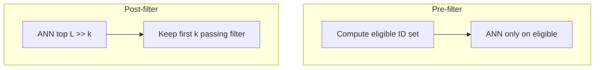
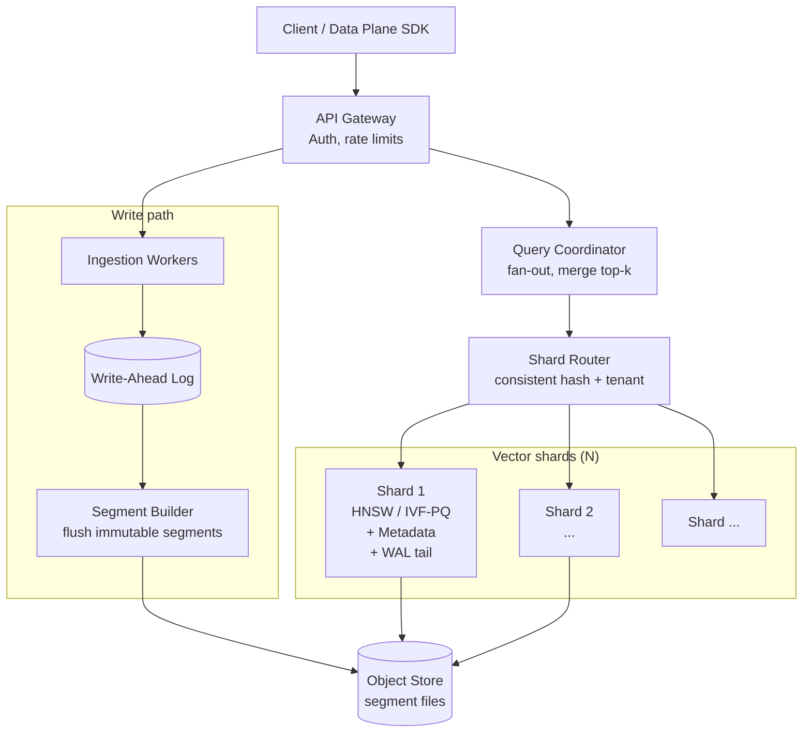
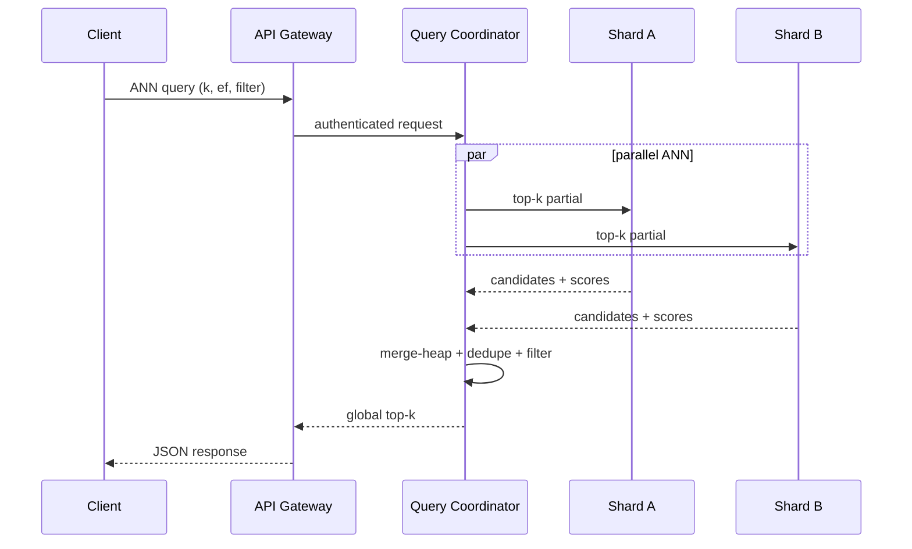

# Design a Vector Database

---

## What We're Building

Design a **vector database** purpose-built for AI workloads: **similarity search at scale** over **billions** of high-dimensional embeddings. Think **[Pinecone](https://www.pinecone.io/)**, **[Weaviate](https://weaviate.io/)**, **[Qdrant](https://qdrant.tech/)**, **[Milvus](https://milvus.io/)**, **[pgvector](https://github.com/pgvector/pgvector)** with ANN extensions, or **Google Cloud Vertex AI Vector Search** — systems where **nearest neighbor retrieval** is the primary access pattern, not row lookups by primary key alone.

**This is not “Postgres with a float array column.”** We are designing **index structures**, **approximate search**, **quantization**, **sharding in embedding space**, and **hybrid retrieval** (vectors + structured filters) under strict latency SLOs.

### Real-World Scale (Hypothetical Production Service)

| Dimension | Representative scale |
|-----------|----------------------|
| **Total vectors** | 1B–100B+ (multi-tenant SaaS, global RAG corpora) |
| **Dimensions per vector** | 128 (small sentence models) to 4096 (frontier embedding APIs) |
| **Peak query QPS** | 10K–500K+ (aggregated across tenants) |
| **P99 search latency** | Single-digit to low tens of ms (excluding network RTT) |
| **Ingestion** | Millions of vectors/hour during bulk re-embed jobs |
| **Metadata predicates** | Tenant ID, ACL, doc type, time range — combined with ANN |

!!! note
    Interviewers reward **clarity on ANN vs exact search**, **recall/latency trade-offs**, and **how filters interact with vector indexes** — not buzzwords about “AI-native storage.”

### Why Traditional Databases Struggle (Comparison)

| Capability | Relational / document DB | Purpose-built vector DB |
|------------|-------------------------|-------------------------|
| **Access pattern** | B-tree / hash on scalar keys | k-NN in high-dimensional metric space |
| **Exact k-NN** | Linear scan or unacceptable index size | Needs **ANN** (HNSW, IVF-PQ, diskANN-class) |
| **Distance computation** | Not a first-class primitive | Cosine / L2 / IP at billions of points |
| **Memory pressure** | Row-oriented buffers | **Graph + quantized codes** dominate RAM |
| **Hybrid filter + vector** | Two indexes poorly fused | **Pre-filter**, **post-filter**, or **native hybrid** plans |
| **Embedding model churn** | Schema change | **Re-embedding + re-index** as an operational workflow |

---

## Key Concepts Primer

This section is the **backbone** of the interview: you must explain **embeddings**, **metrics**, **ANN**, and at least one **index family** (HNSW + IVF-PQ) with enough depth to derive **latency, recall, and cost**.

### Vector Embeddings: Meaning as Geometry

A **vector embedding** is a fixed-length array of floats \\(\mathbf{x} \in \mathbb{R}^d\\) produced by an encoder (e.g., transformer pooling, CLIP image tower). **Semantically similar** inputs map to **nearby** points under a chosen distance — not because the model “stores meaning” literally, but because training (contrastive, supervised, or generative) **aligns geometry** with downstream similarity tasks.

| Topic | Detail |
|-------|--------|
| **Dimensionality \\(d\\)** | Higher \\(d\\) can separate finer concepts but increases **storage**, **compute per distance**, and **curse of dimensionality** for naive structures |
| **Normalization** | Many text embeddings are **L2-normalized** so **cosine distance** relates to Euclidean geometry on the sphere |
| **Model coupling** | Vectors from **different models** are generally **not comparable** — index is tied to **one embedding contract** per collection |

**Trade-off (interview soundbite):** *“We pick \\(d\\) from the model card and capacity planning — not from the database. The DB must handle 128–4096 dims efficiently.”*

### Distance Metrics: Cosine, L2, Inner Product

Let \\(\mathbf{x}, \mathbf{y} \in \mathbb{R}^d\\). Common choices:

**1. Cosine similarity** (for L2-normalized vectors, often **dot product** suffices):

\[
\text{cos\_sim}(\mathbf{x}, \mathbf{y}) = \frac{\mathbf{x} \cdot \mathbf{y}}{\|\mathbf{x}\| \, \|\mathbf{y}\|}
\]

**Cosine distance** (not a metric in strict sense but used): \\(1 - \text{cos\_sim}\\).

**2. Squared Euclidean (L2²)** — avoids `sqrt` and preserves ordering vs L2:

\[
\|\mathbf{x} - \mathbf{y}\|_2^2 = \sum_{i=1}^{d}(x_i - y_i)^2
\]

**3. Inner product** (maximum dot product for retrieval):

\[
\text{IP}(\mathbf{x}, \mathbf{y}) = \mathbf{x} \cdot \mathbf{y}
\]

If vectors are **L2-normalized**, ranking by **cosine** ≡ ranking by **dot product** ≡ ranking by **squared Euclidean** on the unit sphere (monotone transforms).

```python
import numpy as np


def cosine_similarity(x: np.ndarray, y: np.ndarray) -> float:
    x = np.asarray(x, dtype=np.float64)
    y = np.asarray(y, dtype=np.float64)
    denom = np.linalg.norm(x) * np.linalg.norm(y)
    if denom == 0.0:
        return 0.0
    return float(np.dot(x, y) / denom)


def l2_squared(x: np.ndarray, y: np.ndarray) -> float:
    d = np.asarray(x, dtype=np.float64) - np.asarray(y, dtype=np.float64)
    return float(np.dot(d, d))


def inner_product(x: np.ndarray, y: np.ndarray) -> float:
    return float(np.dot(np.asarray(x, dtype=np.float64), np.asarray(y, dtype=np.float64)))
```

| Use when | Metric |
|----------|--------|
| Text semantic search with **normalized** embeddings | **Cosine** / **dot product** |
| Raw feature vectors, **unnormalized** | **L2** (or L2²) |
| **Maximize alignment** (some recommender setups) | **Inner product** |
| **Quantization / SIMD** kernels often implemented | **L2²** or **IP** (vendor-specific) |

!!! tip
    State explicitly: **“We fix one metric per index; mixing models/metrics without re-indexing is invalid.”**

### Exact vs Approximate Nearest Neighbor (ANN)

**Exact k-NN:** return the \\(k\\) true nearest neighbors — typically **O(nd)** per query with a linear scan, or heavy structures that **do not scale** to billions of points in high \\(d\\).

**ANN:** return **approximate** neighbors **much faster** by **pruning** the search space. You trade **recall** (fraction of true top-\\(k\\) found) for **latency** and **index size**.

```python
import numpy as np


def recall_at_k(true_neighbors: set[int], retrieved: list[int], k: int) -> float:
    """Fraction of ground-truth top-k present in retrieved k' (often k'=k)."""
    retrieved_k = set(retrieved[:k])
    return len(true_neighbors & retrieved_k) / float(len(true_neighbors))


def brute_force_topk(
    query: np.ndarray,
    database: np.ndarray,
    k: int,
    metric: str = "cosine",
) -> tuple[np.ndarray, np.ndarray]:
    """Ground truth for evaluation (small N only)."""
    if metric == "cosine":
        q = query / np.linalg.norm(query)
        db = database / np.linalg.norm(database, axis=1, keepdims=True)
        scores = db @ q
        idx = np.argpartition(-scores, kth=k - 1)[:k]
        idx = idx[np.argsort(-scores[idx])]
        return idx, scores[idx]
    if metric == "l2sq":
        diff = database - query
        scores = -np.sum(diff * diff, axis=1)
        idx = np.argpartition(-scores, kth=k - 1)[:k]
        idx = idx[np.argsort(-scores[idx])]
        return idx, scores[idx]
    raise ValueError(metric)
```

**Recall/latency curve (conceptual):** increasing `ef_search` (HNSW), `nprobe` (IVF), or bits per code (PQ) **improves recall** at the cost of **more distance computations** and **memory bandwidth** — typically a **concave** trade-off: first increments of `ef`/`nprobe` buy large recall gains; later increments yield diminishing returns at higher latency.

### HNSW (Hierarchical Navigable Small World)

**HNSW** builds a **multi-layer proximity graph**. Upper layers are **sparse** (long jumps); lower layers are **dense** (fine navigation). Search starts at the **top layer**, greedily moves to the nearest neighbor, drops to the next layer, repeats until layer 0, then **local search** expands a candidate set.

**Key ideas:**

| Idea | Role |
|------|------|
| **Layer assignment** | Each node gets a **random level** \\(l\\) (geometric distribution) — few nodes in high layers |
| **Greedy search** | At each layer, walk to **closer** neighbors until no improvement |
| **ef_construction / ef_search** | **Beam width** for candidate list — higher → better graph / recall, more CPU |

**ASCII sketch (layers):**

```
Layer 2:     [A]-------------------[B]          (few nodes, long edges)
                  \
Layer 1:       [C]---[D]-----[E]                (medium density)
                    \    \    \
Layer 0:   ... [F][G][H][I][J][K][L] ...         (all nodes, short edges)
```

**Traversal (simplified):** enter at **entry point** at top layer; at layer \\(L\\), greedy descend; at layer 0, maintain **dynamic list** of `ef` closest candidates using the neighbor graph.

```python
from __future__ import annotations

import heapq
from typing import Dict, List, Set, Tuple


def l2_sq(a: List[float], b: List[float]) -> float:
    return sum((x - y) ** 2 for x, y in zip(a, b))


def greedy_descend(
    q: List[float],
    vectors: Dict[int, List[float]],
    neighbors_at_layer: Dict[int, Dict[int, List[int]]],
    entry: int,
    from_layer: int,
    down_to_layer: int,
) -> int:
    """
    Greedy search from entry: at each layer, repeatedly move to any neighbor closer to q
    until no improvement (standard HNSW upper-layer routing).
    neighbors_at_layer[layer][node_id] -> neighbor ids at that layer.
    """
    curr = entry
    for lc in range(from_layer, down_to_layer, -1):
        layer_map = neighbors_at_layer.get(lc, {})
        while True:
            best_d = l2_sq(q, vectors[curr])
            nxt = curr
            for nb in layer_map.get(curr, []):
                d = l2_sq(q, vectors[nb])
                if d < best_d:
                    best_d, nxt = d, nb
            if nxt == curr:
                break
            curr = nxt
    return curr


def search_layer_ef(
    q: List[float],
    vectors: Dict[int, List[float]],
    layer0_neighbors: Dict[int, List[int]],
    entry: int,
    ef: int,
) -> List[Tuple[float, int]]:
    """
    Layer-0 best-first search: maintain 'ef' closest candidates (dynamic list).
    Uses a min-heap of (distance, node) as candidate queue (simplified vs full hnswlib).
    """
    visited: Set[int] = set()
    candidates: List[Tuple[float, int]] = []
    w: List[Tuple[float, int]] = []

    def push_cand(d: float, nid: int) -> None:
        heapq.heappush(candidates, (d, nid))

    ep = entry
    d0 = l2_sq(q, vectors[ep])
    visited.add(ep)
    push_cand(d0, ep)
    heapq.heappush(w, (-d0, ep))

    while candidates:
        d_c, c = heapq.heappop(candidates)
        if not w:
            break
        worst = -w[0][0]
        if d_c > worst and len(w) >= ef:
            break
        for e in layer0_neighbors.get(c, []):
            if e in visited:
                continue
            visited.add(e)
            de = l2_sq(q, vectors[e])
            if len(w) < ef:
                heapq.heappush(w, (-de, e))
                push_cand(de, e)
            elif de < -w[0][0]:
                heapq.heappop(w)
                heapq.heappush(w, (-de, e))
                push_cand(de, e)
    return sorted((-a, b) for a, b in w)
```

!!! warning
    The above **teaches mechanics**; production HNSW (e.g., **hnswlib**, **FAISS**) uses **heuristic neighbor selection**, **batch inserts**, and **highly optimized** distance kernels. In interviews, say you would **delegate core search to a battle-tested library** and focus on **distribution, sharding, and durability**.

### IVF (Inverted File Index)

**IVF** partitions vectors into **clusters** (often **k-means** centroids). At query time, you probe only **nprobe** nearest **centroids** — not the full dataset.

| Concept | Description |
|---------|-------------|
| **Centroids** | \\(n_{\text{list}}\\) cluster centers \\(\{\mu_j\}\\) |
| **Inverted lists** | Each cluster \\(j\\) stores **ids** of vectors assigned to it |
| **nprobe** | How many lists to visit — **higher** → better recall, slower |

```python
import numpy as np


def kmeans_train(data: np.ndarray, nlist: int, iters: int = 20, seed: int = 0) -> np.ndarray:
    """Lloyd k-means for IVF centroids (Faiss uses faster variants + GPU)."""
    rng = np.random.default_rng(seed)
    n, d = data.shape
    c = data[rng.choice(n, size=nlist, replace=False)].copy()
    for _ in range(iters):
        a = np.argmin(((data[:, None, :] - c[None, :, :]) ** 2).sum(axis=2), axis=1)
        for j in range(nlist):
            m = a == j
            if np.any(m):
                c[j] = data[m].mean(axis=0)
    return c


def assign_to_lists(
    data: np.ndarray,
    centroids: np.ndarray,
) -> tuple[np.ndarray, list[list[int]]]:
    dist2 = ((data[:, None, :] - centroids[None, :, :]) ** 2).sum(axis=2)
    assign = np.argmin(dist2, axis=1)
    inverted: list[list[int]] = [[] for _ in range(len(centroids))]
    for i, j in enumerate(assign.tolist()):
        inverted[j].append(i)
    return assign, inverted


def query_ivf_lists(
    query: np.ndarray,
    centroids: np.ndarray,
    nprobe: int,
) -> list[int]:
    q = query.reshape(1, -1)
    dist2 = ((centroids - q) ** 2).sum(axis=1)
    return np.argpartition(dist2, nprobe - 1)[:nprobe].tolist()
```

**nprobe trade-off:** `nprobe=1` is fast but misses if the query sits between clusters; `nprobe≈√nlist` is a common starting point for high recall.

### Product Quantization (PQ)

**PQ** splits each vector into **m** subvectors of dimension **d_sub = d/m**. Each subspace has a **codebook** of **k** centroids (typically **256** → **1 byte** per subspace).

**Training:** run k-means **independently** on each subspace’s slice of training vectors.

**Encoding:** each subvector is replaced by the **nearest codebook entry index** (1 byte if k=256).

**Asymmetric distance query (ADC):** for query \\(\mathbf{q}\\), precompute **partial distances** to **all codebook entries** per subspace, then approximate:

\[
\|\mathbf{q} - \mathbf{x}\|^2 \approx \sum_{s=1}^{m} \| \mathbf{q}_s - \mathbf{c}_{s, b_s(\mathbf{x})} \|^2
\]

where \\(b_s(\mathbf{x})\\) is the PQ code in subspace \\(s\\).

**Worked micro-example (numbers):**

- \\(d=4\\), **m=2** subspaces, **k=2** codes per subspace (toy).
- Codebook 0: centroids \\((0,0)\\), \\((1,0)\\); Codebook 1: \\((0,1)\\), \\((1,1)\\).
- Vector \\(\mathbf{x}=(0.1, 0.1, 0.9, 0.8)\\): sub0 \\((0.1,0.1)\\) → nearest \\((0,0)\\); sub1 \\((0.9,0.8)\\) → nearest \\((1,1)\\) → codes \\((0,1)\\).

```python
import numpy as np


def pq_train(data: np.ndarray, m: int, ks: int = 256, iters: int = 12, seed: int = 0) -> list[np.ndarray]:
    """Independent k-means per subspace — same structure as IVFPQIndex.train in §4.3."""
    n, d = data.shape
    assert d % m == 0
    dsub, rng = d // m, np.random.default_rng(seed)
    books: list[np.ndarray] = []
    for s in range(m):
        sl = data[:, s * dsub : (s + 1) * dsub]
        cb = sl[rng.choice(n, size=ks, replace=False)].copy()
        for _ in range(iters):
            a = np.argmin(((sl[:, None, :] - cb[None, :, :]) ** 2).sum(axis=2), axis=1)
            for j in range(ks):
                mm = a == j
                if np.any(mm):
                    cb[j] = sl[mm].mean(axis=0)
        books.append(cb)
    return books


def pq_encode(data: np.ndarray, codebooks: list[np.ndarray]) -> np.ndarray:
    m = len(codebooks)
    n, d = data.shape
    dsub = d // m
    codes = np.zeros((n, m), dtype=np.uint8)
    for s, cb in enumerate(codebooks):
        sl = data[:, s * dsub : (s + 1) * dsub]
        dist2 = ((sl[:, None, :] - cb[None, :, :]) ** 2).sum(axis=2)
        codes[:, s] = np.argmin(dist2, axis=1).astype(np.uint8)
    return codes


def adc_l2sq(query: np.ndarray, codes: np.ndarray, codebooks: list[np.ndarray]) -> np.ndarray:
    m = len(codebooks)
    d = query.size
    dsub = d // m
    partial = []
    for s, cb in enumerate(codebooks):
        qz = query[s * dsub : (s + 1) * dsub]
        dist2 = np.sum((cb - qz) ** 2, axis=1)
        partial.append(dist2)
    partial = np.stack(partial, axis=1)
    n = codes.shape[0]
    approx = np.zeros(n, dtype=np.float64)
    for s in range(m):
        approx += partial[s][codes[:, s]]
    return approx
```

### Scalar Quantization vs Product Quantization

| Aspect | **Scalar (SQ / int8)** | **Product Quantization (PQ)** |
|--------|------------------------|-------------------------------|
| **Representation** | Per-dimension scale/zero-point → **int8** | **Subvector indices** into codebooks |
| **Compression** | ~4× from float32 | Often **much higher** (bytes per vector) |
| **Distance error** | Uniform per-dimension error | **Structured** quantization error |
| **Query speed** | Fast dot products with SIMD | **ADC table lookups** + accumulators |
| **Best when** | Need **simple** lossy storage, good SIMD | **Massive** corpora, memory-bound ANN |

!!! note
    **IVF + PQ** is the classic **memory-efficient** recipe: IVF reduces candidates; PQ scores them cheaply. **HNSW** often wins on **recall/latency** when RAM is available.

### Hybrid Search: Vector + Metadata Filters

| Strategy | Mechanism | Pros | Cons |
|----------|-----------|------|------|
| **Post-filter** | ANN top-`ef` → apply SQL-like filter | Simple | May return **<k** after filter |
| **Pre-filter** | Restrict candidate set **before** ANN | Correct k | Filter **selectivity** can hurt recall if too aggressive |
| **Native hybrid** | Bitmap/roaring sets **intersected** with graph expansion | Balanced | Implementation complexity |

**Pre-filter vs post-filter (interview diagram):**



---

## Step 1: Requirements

### Functional Requirements

| Requirement | Detail |
|---------------|--------|
| **Vector CRUD** | Insert, update, delete vectors with stable **string IDs** |
| **Batch upsert** | High-throughput **bulk** loads for embedding pipelines |
| **ANN query** | top-\\(k\\) with **metric** (cosine / L2 / IP), **ef**, **nprobe** |
| **Metadata filters** | Equality, range, **AND/OR** — combined with vector search |
| **Multi-tenancy** | **Tenant isolation** — logical namespaces / collections |
| **Namespaces** | Per-tenant **logical partitions** (projects, environments) |

### Non-Functional Requirements

| NFR | Target |
|-----|--------|
| **Search latency** | **P99 < 10 ms** server-side for hot indices (excluding cross-region RTT) |
| **Availability** | **99.99%** — replicated shards, fault domains |
| **Scale** | **Billions** of vectors per **region**; horizontal shard growth |
| **Vector dimensions** | **128–4096** floats (fp32 or fp16 storage options) |
| **Durability** | **Durable writes** — WAL + object storage for segments |
| **Consistency** | At least **read-your-writes** within a **primary**; replicas **eventual** |

!!! tip
    Tie **P99 < 10ms** to **in-memory hot set + ANN parameters** — not to “faster CPUs” alone.

---

## Step 2: Estimation

### Storage per Vector

| Component | Calculation | Example @ 4096 dims |
|-----------|-------------|---------------------|
| **Raw fp32 vector** | \\(d \times 4\\) bytes | \\(4096 \times 4 = 16\\) KB |
| **fp16 vector** | \\(d \times 2\\) | 8 KB |
| **Metadata** | ~64–256 B + variable payload | Depends on schema |
| **HNSW graph** | **M** edges/node × pointers + levels | Often **multiple ×** raw vector RAM |

**1B vectors × 16 KB ≈ 16 TB** raw fp32 payload — **before** index overhead.

### Index Overhead (Order-of-Magnitude)

| Structure | Rule of thumb |
|-----------|----------------|
| **HNSW** | **2–10×** vector memory (graph + visited structures + redundancy) |
| **IVF-PQ** | **PQ codes** (m bytes) + **inverted lists** + centroids |
| **WAL / segments** | Short-term **append** files before compaction |

### Memory for HNSW

**M=16** graphs store **neighbor ids** + **levels** + **vectors** (often **tens of bytes per edge** + vector bytes) — **pure in-memory HNSW** at **billions** of points usually implies **sharding**, **PQ/SQ**, or **diskANN**-style external graphs.

---

## Step 3: High-Level Design

### Architecture (Write vs Read Path)



**Read path (fan-out / merge):**



**Flow:** **Writes** → ingestion → **WAL** → memtable → flushed **immutable segments** in **object storage** with background index **merge**; **reads** → **Query Coordinator** → parallel per-shard **ANN** → **merge-heap** for global top-\\(k\\).

!!! note
    Separate **write path** (optimized for throughput + sequential I/O) from **read path** (optimized for **latency** + **parallelism**).

---

## Step 4: Deep Dive

### 4.1 Write Path (WAL, Batch Upsert, Index Building)

**Durability:** every upsert is **append-only** to **WAL** (replicated) before ack (or group commit). **Crash recovery** replays WAL.

**Batch upsert:** buffer **N** vectors or **T** ms — amortize **index insertion** cost and **reduce lock contention**.

**Rebuild vs incremental:**

| Mode | When | Pros | Cons |
|------|------|------|------|
| **Incremental insert** | Steady streaming | Low latency to searchable | **Graph drift** (HNSW), fragmentation |
| **Segment rebuild** | Bulk load / major version | **Optimal** index quality | **High** temporary cost |
| **Merge / compaction** | LSM-style | Balance | Complexity |

**Segment management:** immutable **segments** with **versioned** index files; **tombstones** for deletes; periodic **compaction** merges small segments.

```python
from __future__ import annotations

import json
import time
from dataclasses import dataclass, field
from pathlib import Path
from typing import Dict, List


@dataclass
class WalRecord:
    ts: float
    op: str  # "upsert" | "delete"
    id: str
    payload: Dict


class WriteAheadLog:
    def __init__(self, directory: Path) -> None:
        self.directory = directory
        self.directory.mkdir(parents=True, exist_ok=True)
        self.log_path = directory / "wal.jsonl"
        self._fp = self.log_path.open("a", encoding="utf-8")

    def append(self, record: WalRecord) -> None:
        self._fp.write(json.dumps({"ts": record.ts, "op": record.op, "id": record.id, "payload": record.payload}) + "\n")
        self._fp.flush()

    def replay(self) -> List[WalRecord]:
        out: List[WalRecord] = []
        if not self.log_path.exists():
            return out
        for line in self.log_path.read_text(encoding="utf-8").splitlines():
            d = json.loads(line)
            out.append(WalRecord(ts=d["ts"], op=d["op"], id=d["id"], payload=d["payload"]))
        return out


@dataclass
class MutableMemTable:
    vectors: Dict[str, List[float]] = field(default_factory=dict)
    tombstones: set[str] = field(default_factory=set)

    def upsert_batch(self, items: Dict[str, List[float]]) -> int:
        self.vectors.update(items)
        return len(items)

    def delete(self, vid: str) -> None:
        self.tombstones.add(vid)
        self.vectors.pop(vid, None)


@dataclass
class SegmentPlanner:
    max_vectors_per_segment: int = 50_000

    def should_flush(self, mem: MutableMemTable) -> bool:
        live = len(mem.vectors) - len(mem.tombstones)
        return live >= self.max_vectors_per_segment


def ingest_batch(
    wal: WriteAheadLog,
    mem: MutableMemTable,
    planner: SegmentPlanner,
    batch: Dict[str, List[float]],
) -> str:
    for vid, vec in batch.items():
        wal.append(WalRecord(ts=time.time(), op="upsert", id=vid, payload={"dim": len(vec)}))
    mem.upsert_batch(batch)
    if planner.should_flush(mem):
        return "flush_scheduled"
    return "buffered"
```

### 4.2 HNSW Index Implementation (Layers, Greedy Search, Insert)

Below is a **more complete educational** implementation focusing on **level sampling**, **greedy search at layer**, and **select neighbors** (simplified). Prefer **hnswlib** in production.

```python
from __future__ import annotations

import math
import random
from heapq import heappush, heappop
from typing import Dict, List, Set, Tuple


def l2_sq_f32(a: List[float], b: List[float]) -> float:
    s = 0.0
    for i in range(len(a)):
        d = a[i] - b[i]
        s += d * d
    return s


class HNSWIndex:
    def __init__(self, dim: int, m: int = 16, ef_construction: int = 128) -> None:
        self.dim = dim
        self.m = m
        self.ef_construction = ef_construction
        self.max_m = m
        self.max_m0 = m * 2
        self.data: List[List[float]] = []
        self.levels: List[int] = []
        self.graph: List[Dict[int, List[int]]] = []
        self.entry_point: int | None = None

    def _random_level(self) -> int:
        ml = int(1 / math.log(2.0))
        lvl = 0
        while random.random() < 0.5 and lvl < ml:
            lvl += 1
        return lvl

    def _search_base(
        self,
        q: List[float],
        ep: int,
        ef: int,
        lc: int,
    ) -> List[Tuple[float, int]]:
        visited: Set[int] = set()
        candidates: List[Tuple[float, int]] = []
        w: List[Tuple[float, int]] = []
        dist = l2_sq_f32(q, self.data[ep])
        heappush(candidates, (dist, ep))
        heappush(w, (-dist, ep))
        visited.add(ep)
        while candidates:
            d, c = heappop(candidates)
            furthest = -w[0][0] if w else float("inf")
            if d > furthest:
                break
            for e in self.graph[c].get(lc, []):
                if e in visited:
                    continue
                visited.add(e)
                de = l2_sq_f32(q, self.data[e])
                if len(w) < ef:
                    heappush(w, (-de, e))
                    heappush(candidates, (de, e))
                elif de < -w[0][0]:
                    heappop(w)
                    heappush(w, (-de, e))
                    heappush(candidates, (de, e))
        return sorted((-x[0], x[1]) for x in w)

    def insert(self, vec: List[float]) -> int:
        if len(vec) != self.dim:
            raise ValueError("dim mismatch")
        new_id = len(self.data)
        self.data.append(vec)
        self.levels.append(self._random_level())
        self.graph.append({})
        if self.entry_point is None:
            self.entry_point = new_id
            return new_id
        ep = self.entry_point
        L = max(self.levels[self.entry_point], self.levels[new_id])
        dist = l2_sq_f32(vec, self.data[ep])
        for lc in range(L, self.levels[new_id], -1):
            changed = True
            while changed:
                changed = False
                for nb in self.graph[ep].get(lc, []):
                    nd = l2_sq_f32(vec, self.data[nb])
                    if nd < dist:
                        ep, dist, changed = nb, nd, True
        for lc in range(min(self.levels[new_id], L), -1, -1):
            neighbors = self._search_base(vec, ep, self.ef_construction, lc)
            neigh_ids = [i for _, i in neighbors[: self.m]]
            self.graph[new_id][lc] = list(dict.fromkeys(neigh_ids))
            for nb in neigh_ids:
                self.graph[nb].setdefault(lc, [])
                if nb != new_id and new_id not in self.graph[nb][lc]:
                    self.graph[nb][lc].append(new_id)
                if len(self.graph[nb][lc]) > self.max_m0:
                    self.graph[nb][lc] = self.graph[nb][lc][: self.max_m0]
            if neigh_ids:
                ep = neigh_ids[0]
        if self.levels[new_id] > self.levels[self.entry_point]:
            self.entry_point = new_id
        return new_id

    def search(self, q: List[float], k: int, ef: int) -> List[Tuple[float, int]]:
        if self.entry_point is None:
            return []
        ep = self.entry_point
        dist = l2_sq_f32(q, self.data[ep])
        Ltop = max(self.levels)
        for lc in range(Ltop, 0, -1):
            changed = True
            while changed:
                changed = False
                for nb in self.graph[ep].get(lc, []):
                    nd = l2_sq_f32(q, self.data[nb])
                    if nd < dist:
                        ep, dist, changed = nb, nd, True
        res = self._search_base(q, ep, max(ef, k), 0)
        return res[:k]
```

### 4.3 IVF-PQ Index Implementation (Training, Encoding, ADC)

```python
import numpy as np


def _lloyd(X: np.ndarray, k: int, iters: int, rng: np.random.Generator) -> np.ndarray:
    c = X[rng.choice(X.shape[0], size=k, replace=False)].copy()
    for _ in range(iters):
        a = np.argmin(((X[:, None, :] - c[None, :, :]) ** 2).sum(axis=2), axis=1)
        for j in range(k):
            m = a == j
            if np.any(m):
                c[j] = X[m].mean(axis=0)
    return c


class IVFPQIndex:
    def __init__(self, d: int, nlist: int, m: int, ks: int = 256) -> None:
        if d % m != 0:
            raise ValueError("d must divide m")
        self.d = d
        self.nlist = nlist
        self.m = m
        self.ks = ks
        self.centroids: np.ndarray | None = None
        self.codebooks: list[np.ndarray] | None = None
        self.inverted: list[list[int]] | None = None
        self.codes: np.ndarray | None = None
        self.vectors: np.ndarray | None = None

    def train(self, train_vectors: np.ndarray, seed: int = 0) -> None:
        n, d = train_vectors.shape
        rng = np.random.default_rng(seed)
        self.centroids = _lloyd(train_vectors, self.nlist, 20, rng)
        assign = np.argmin(((train_vectors[:, None, :] - self.centroids[None, :, :]) ** 2).sum(axis=2), axis=1)
        inverted: list[list[int]] = [[] for _ in range(self.nlist)]
        for i, j in enumerate(assign.tolist()):
            inverted[j].append(i)
        self.inverted = inverted
        dsub = d // self.m
        codebooks: list[np.ndarray] = []
        for s in range(self.m):
            sl = train_vectors[:, s * dsub : (s + 1) * dsub]
            codebooks.append(_lloyd(sl, self.ks, 15, rng))
        self.codebooks = codebooks
        codes = np.zeros((n, self.m), dtype=np.uint8)
        for s, cb in enumerate(codebooks):
            sl = train_vectors[:, s * dsub : (s + 1) * dsub]
            codes[:, s] = np.argmin(((sl[:, None, :] - cb[None, :, :]) ** 2).sum(axis=2), axis=1).astype(np.uint8)
        self.codes = codes
        self.vectors = train_vectors.astype(np.float32)

    def search(self, query: np.ndarray, k: int, nprobe: int) -> tuple[np.ndarray, np.ndarray]:
        assert self.centroids is not None and self.codebooks is not None
        assert self.inverted is not None and self.codes is not None
        q = query.astype(np.float64)
        dist2c = np.sum((self.centroids - q) ** 2, axis=1)
        lists = np.argpartition(dist2c, nprobe - 1)[:nprobe]
        d = q.size
        dsub = d // self.m
        partial_tables: list[np.ndarray] = []
        for s, cb in enumerate(self.codebooks):
            qz = q[s * dsub : (s + 1) * dsub]
            partial_tables.append(np.sum((cb - qz) ** 2, axis=1))
        scores: list[tuple[float, int]] = []
        for li in lists.tolist():
            for idx in self.inverted[li]:
                approx = 0.0
                row = self.codes[idx]
                for s in range(self.m):
                    approx += partial_tables[s][int(row[s])]
                scores.append((approx, idx))
        scores.sort(key=lambda x: x[0])
        top = scores[:k]
        idx = np.array([t[1] for t in top], dtype=np.int64)
        vals = np.array([t[0] for t in top], dtype=np.float64)
        return idx, vals
```

### 4.4 Hybrid Search with Metadata Filtering

**Bitmap / roaring** indexes over **eligible** document IDs enable **set intersections** cheaply. **Score fusion:** retrieve **top L** from ANN + **top L** from BM25 then **weighted merge** (common in hybrid RAG).

```python
from __future__ import annotations

from typing import Callable, Dict, List, Set, Tuple


def post_filter(
    ann_hits: List[Tuple[str, float]],
    pred: Callable[[str], bool],
    k: int,
) -> List[Tuple[str, float]]:
    """ANN over-fetch then filter — may return fewer than k hits."""
    out: List[Tuple[str, float]] = []
    for doc_id, score in ann_hits:
        if pred(doc_id):
            out.append((doc_id, score))
        if len(out) >= k:
            break
    return out


def pre_filter_with_bitmap(
    eligible: Set[str],
    ann_fn: Callable[[int], List[Tuple[str, float]]],
    k: int,
    ef: int,
) -> List[Tuple[str, float]]:
    """ann_fn(ef) should respect eligibility (filtered graph expansion or list scan)."""
    return [(i, s) for i, s in ann_fn(ef) if i in eligible][:k]


def reciprocal_rank_fusion(rank_lists: List[List[str]], k: int = 60, topn: int = 10) -> List[str]:
    scores: Dict[str, float] = {}
    for rlist in rank_lists:
        for rank, doc in enumerate(rlist):
            scores[doc] = scores.get(doc, 0.0) + 1.0 / (k + rank + 1)
    return [d for d, _ in sorted(scores.items(), key=lambda x: -x[1])[:topn]]
```

### 4.5 Sharding and Replication

**Vector-space-aware sharding:** partition by **LSH** or **cluster id** so each shard is **coherent** in embedding space — can improve locality but **skew** when queries cross boundaries.

**Hash-based sharding:** by `tenant_id` + `doc_id` — **even load**; every query may hit **all shards** unless **routing hints** (e.g., tenant pinned to shard set).

```python
from __future__ import annotations

import hashlib
from typing import Iterable, List, Sequence


def shard_of(doc_id: str, num_shards: int) -> int:
    h = hashlib.blake2b(doc_id.encode("utf-8"), digest_size=8).digest()
    return int.from_bytes(h, "big") % num_shards


def route_query_tenant(tenant_id: str, shard_map: dict[str, Sequence[int]], num_shards: int) -> List[int]:
    """Pin tenant to a subset of shards for caching & isolation."""
    return list(shard_map.get(tenant_id, range(num_shards)))


def quorum_read(replica_results: List[List[str]], k: int) -> List[str]:
    """Merge top-k from replicas — vector DBs usually query primaries or consistent secondaries."""
    scores: dict[str, float] = {}
    for lst in replica_results:
        for rank, doc in enumerate(lst):
            scores[doc] = scores.get(doc, 0.0) + 1.0 / (1 + rank)
    return [d for d, _ in sorted(scores.items(), key=lambda x: -x[1])[:k]]
```

**Consistency:** **single-writer primary** per shard + **async replicas** for search; **strong** consistency optional via **read from primary** or **version checks**.

### 4.6 Memory Management and Quantization

**Memory-mapped segments:** map **read-only** index files from **SSD** — OS page cache **warms** hot regions.

**Tiered storage:**

| Tier | Holds | Latency |
|------|-------|---------|
| **Hot** | Working set vectors + top of graph | **Lowest** |
| **Warm** | Full index on **NVMe** | **ms** |
| **Cold** | **Object store** (S3/GCS) segments | **10s–minutes** restore |

```python
from __future__ import annotations

import mmap
import os
from pathlib import Path

import numpy as np


def mmap_float32_matrix(path: Path, rows: int, cols: int) -> mmap.mmap:
    expected = rows * cols * 4
    fd = os.open(path, os.O_RDONLY)
    mm = mmap.mmap(fd, expected, access=mmap.ACCESS_READ)
    os.close(fd)
    return mm


def read_row_f32(mm: mmap.mmap, row: int, cols: int) -> np.ndarray:
    """Zero-copy view into mmap-backed row-major fp32 matrix."""
    off = row * cols * 4
    raw = mm[off : off + cols * 4]
    return np.frombuffer(raw, dtype=np.float32, count=cols)


def materialize_for_query(mm: mmap.mmap, row_ids: list[int], cols: int) -> np.ndarray:
    """Stack rows for batched numpy distance ops (copies — touches pages for cache warmup)."""
    return np.stack([read_row_f32(mm, r, cols).copy() for r in row_ids], axis=0)
```

### 4.7 Multi-Tenancy and Namespace Isolation

| Model | Isolation | Ops |
|-------|-----------|-----|
| **Tenant-per-index** | Strong **noisy-neighbor** isolation | **More** indices, **higher** baseline RAM |
| **Shared index + tenant field** | **Cheaper** | Must **filter** every query; risk of **leaks** if bugs |

**Noisy neighbor mitigation:** **per-tenant QPS**, **CPU scheduling**, **separate shard pools** for premium tiers.

```python
from __future__ import annotations

import time


class TokenBucket:
    def __init__(self, rate: float, burst: float) -> None:
        self.rate = rate
        self.burst = burst
        self.tokens = burst
        self.last = time.monotonic()

    def allow(self) -> bool:
        now = time.monotonic()
        self.tokens = min(self.burst, self.tokens + (now - self.last) * self.rate)
        self.last = now
        if self.tokens >= 1.0:
            self.tokens -= 1.0
            return True
        return False


def schedule_query(tenant: str, buckets: dict[str, TokenBucket]) -> bool:
    return buckets[tenant].allow()
```

### 4.8 Indexing Pipeline (Bulk, Compaction, Model Change)

```python
from __future__ import annotations

from typing import Callable, Iterable, List


def build_pipeline(
    records: Iterable[dict],
    embed_fn: Callable[[str], List[float]],
    flush_every: int,
) -> int:
    buf: list[dict] = []
    count = 0
    for r in records:
        r["vector"] = embed_fn(r["text"])
        buf.append(r)
        if len(buf) >= flush_every:
            count += len(buf)
            buf.clear()
    if buf:
        count += len(buf)
    return count


def should_reindex_on_model_change(old_version: str, new_version: str) -> bool:
    return old_version != new_version


def compact_segments(sizes: List[int], max_segment_mb: int = 512) -> int:
    """Return number of compaction jobs if small segments accumulate."""
    return sum(1 for s in sizes if s < max_segment_mb // 4)
```

**Embedding model upgrade:** **dual-write** new embeddings to a **shadow index**, **A/B** query traffic, measure **recall@k** and **CTR**, then **cut over** — **never** mix vectors from two models in one **metric index**.

---

## Step 5: Scaling & Production

### Failure Handling

| Failure | Mitigation |
|---------|------------|
| **Shard node loss** | **Replica promotion**; **reroute** queries |
| **Corrupt segment** | **Checksum** + **rebuild** from WAL / backup |
| **Hot key / tenant** | **Sharding** + **rate limits** + **dedicated pools** |
| **Region outage** | **Multi-region** async replication; **read** from healthy region |

**Monitoring (representative):** **p50/p95/p99** latency, **recall@k** vs brute force on samples, **QPS/shard**, **insert lag**, **index build** duration, **memory/SSD/object** usage by tier.

**Trade-offs (summary):** **HNSW** — best **recall/latency** when RAM exists, but **heavy**; **IVF-PQ** — **capacity**, needs **nprobe/PQ** tuning; **post-filter** — simple, can return **<k**; **pre-filter** — exact **k**, can **hurt recall**; **strong consistency** — simpler semantics, **higher** write cost.

## Interview Tips

!!! tip
    **Google-style follow-ups:** **ef_search** vs recall/latency; rebuild vs incremental **HNSW**; **embedding upgrades**; **recall@k** measurement — plus **shadow indices**, **mergeable segments**, and **nprobe/nlist/PQ m**.

!!! warning
    **Do not** claim **O(log N)** **exact** nearest neighbor for arbitrary high-dimensional data — **ANN** is the realistic contract at billion scale.

---

## Hypothetical Interview Transcript

!!! note
    **45-minute** Google L5/L6-style system design. Interviewer: **Staff Engineer**, **Vertex AI Vector Search**-adjacent team.

**Interviewer:** Design a vector database for AI — billions of vectors, millisecond search. Where do you start?

**Candidate:** First **workload and SLOs**: dimension range, QPS, **P99 latency**, single- vs multi-tenant. Then split **durability/ingestion** (append-heavy **WAL**, segments) from **read path** **ANN** (random access on graphs or IVF lists). At **1B × 1024-dim**, **exact** k-NN is out; you need **ANN**. Postgres + pgvector is fine until you hit **single-node limits**, **filter fusion**, and **memory bandwidth** — purpose-built systems separate these concerns.

**Interviewer:** **Distance metrics**, **HNSW** vs **IVF-PQ**, and **hybrid** filters — go.

**Candidate:** Text stacks usually use **cosine** or **dot** on **L2-normalized** vectors (ordering ties to **L2²** on the sphere); **IP** when vectors are not normalized. **One metric per index**; **never** mix **embedding models** without **re-embedding**. **HNSW**: multi-layer graph, greedy upper layers, **ef** search at layer 0 — high **recall/latency** when the graph fits **RAM**. **IVF** probes **nprobe** **k-means** lists; **PQ** scores with **ADC**. **IVF-PQ** is the **capacity** play; **HNSW** wins when RAM allows or with **diskANN**-style extensions. **Hybrid**: **post-filter** (over-fetch **L≫k**, risk **<k** hits), **pre-filter** (correct **k**, risk bad recall if too selective), or **native** filtered ANN + **bitmaps**; **RRF** with **BM25** when hybrid RAG.

**Interviewer:** **Sharding**, **memory tiers**, **consistency**, **model upgrades**, **eval**, **cost**, **failure**, **multi-tenant noise**.

**Candidate:** **Sharding**: **hash** by doc for balance (wide fan-out) vs **vector-aware** partitions for locality (skew risk) — often **hash within tenant** + **replicas** + **dedicated pools** for hot tenants. **Memory**: **PQ/SQ**, **diskANN**, **mmap** warm segments, **cold** in object store, **compaction** after deletes. **Consistency**: **WAL** + **primary** writes, **async replicas** for search; **read-your-writes** via **primary** or **version**; global strong consistency is rare. **Model upgrade**: **new index version**, **shadow** re-embed, **recall@k** + product metrics, then cutover — **no** mixing vectors in one metric space. **Eval**: **recall@k** vs brute force on samples; production **replay**. **Cost**: IVF-PQ, shard **right-sizing**, **shared** index + **tenant** filter for small customers, **batch** ingest, **regional** query locality. **Failure**: replay **WAL**, **checksum** segments, rebuild from **inputs + WAL**; **quorum** on WAL. **Noisy neighbor**: **per-tenant** **token buckets**, **fair** scheduling, isolation **pools**, **alerts** on tenant **p99**.

**Interviewer:** Good — **index structures**, **hybrid**, **sharding**, **consistency**, **upgrades**, and **eval** are covered. Let’s stop here.
