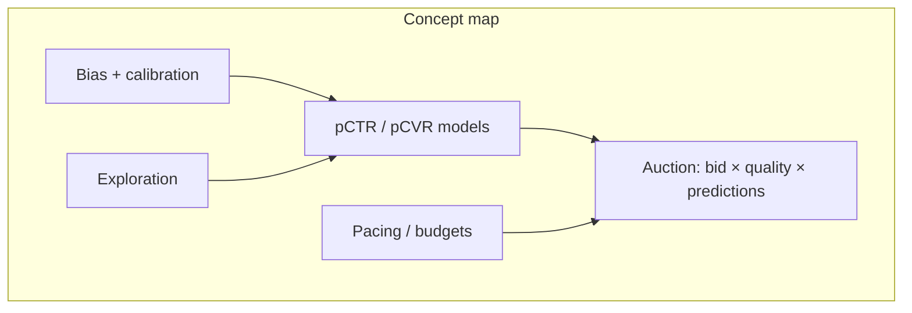
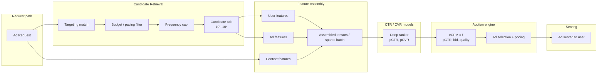
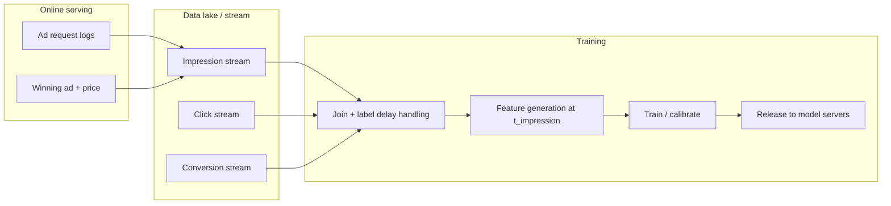
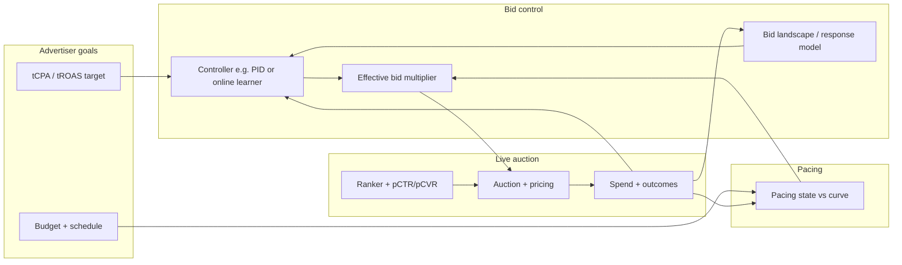
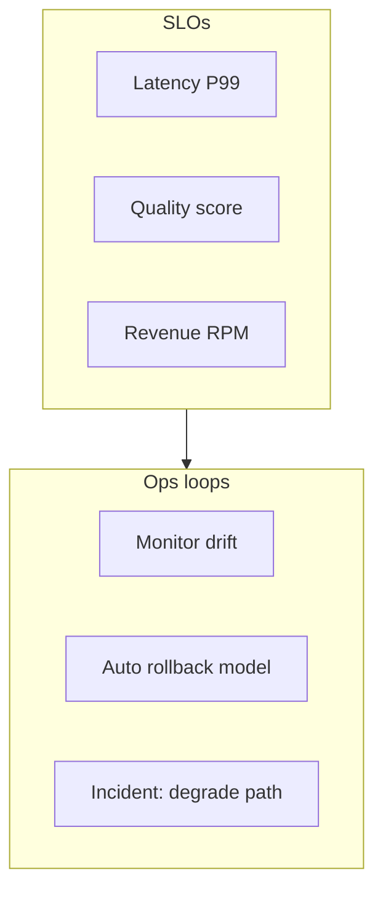

# Design an Ads Ranking System

---

## What We're Building

We are designing an **ads ranking system** that selects and ranks advertisements to show users in response to a page view, search query, or feed load. The system must combine **machine learning** (predicting engagement and value), **economics** (auctions and pricing), and **systems engineering** (latency, scale, freshness). This stack is the **core revenue engine** for Google (Search and Display), Meta (Feed and Stories), Amazon (Sponsored Products), and many other ad-supported platforms.

### Real-world scale (order-of-magnitude anchors)

| Dimension | Approximate scale (public / industry estimates) |
|-----------|------------------------------------------------|
| **Ad auctions per day** | On the order of **tens of billions** globally across major networks; **single-digit billions** often cited for large individual surfaces |
| **Annual digital ad revenue (Google)** | On the order of **$200B+** in recent years (company filings — exact year varies) |
| **Latency budget** | End-to-end **tens of milliseconds** for the auction + ranking path at peak |
| **Candidates per request** | **Hundreds to thousands** retrieved; **dozens** deeply scored |

!!! note
    Interview numbers should be **back-of-envelope**. The goal is to show you understand **orders of magnitude**, **bottlenecks** (retrieval, feature fetch, model inference, auction math), and **trade-offs** (revenue vs latency vs advertiser satisfaction).

### Why ads ranking is among the most impactful ML systems

| Reason | Explanation |
|--------|---------------|
| **Direct revenue tie** | Small lifts in **CTR**, **CVR**, or **auction efficiency** translate to massive dollars at scale |
| **High-frequency decisions** | Every impression is an **online decision** with a fresh feature vector and budget state |
| **Multi-objective** | Platform revenue, **advertiser ROI**, **user experience**, and **policy compliance** must coexist |
| **Cold start forever** | New campaigns, creatives, and landing pages constantly enter the system |

!!! tip
    In interviews, connect **pCTR × bid** (expected revenue per impression) to **business metrics**, and separate **retrieval** (cheap, broad) from **ranking** (accurate, narrow).

---

## ML Concepts Primer

### Click-through rate (CTR) and conversion rate (CVR)

| Concept | Definition | Typical use |
|---------|------------|-------------|
| **CTR** | \(P(\text{click} \mid \text{impression}, \text{context})\) | Optimize clicks; top-of-funnel |
| **CVR** | \(P(\text{conversion} \mid \text{click}, \text{context})\) | Optimize purchases, signups, app installs |
| **pCVR** | Predicted CVR from a model | Combined with pCTR for **expected conversions per impression** |

**Expected value per impression (simplified):**

\[
\text{eCPM}_{\text{value}} \propto \text{pCTR} \times \text{pCVR} \times \text{value\_per\_conversion}
\]

(Real systems add **attribution windows**, **incrementality**, and **fraud** filters.)

### pCTR × bid and auction mechanics

| Term | Meaning |
|------|---------|
| **Bid** | What the advertiser is willing to pay (per click, per conversion, or per mille depending on campaign type) |
| **eCPM / score** | A **ranking score** combining predicted engagement and bid, e.g. **pCTR × bid** for CPC campaigns in a CPM-normalized form |
| **Reserve** | Minimum price or minimum quality to enter the auction |
| **Quality score** | Platform-side adjustment (relevance, landing page quality) — often multiplicative with bid |

**Second-price vs first-price (conceptual):**

| Auction style | Winner pays | Strategic note |
|---------------|-------------|----------------|
| **Second-price (single slot)** | Second-highest bid (classic Vickrey intuition) | Truthful bidding under simplified assumptions |
| **Generalized Second-Price (GSP)** | Price derived from next competitor’s bid (common in sponsored search) | Not fully truthful; advertisers shade bids |
| **First-price** | Own bid | Incentivizes bid shading; prevalent in many display contexts |

!!! warning
    Production systems differ by **ad format**, **market**, and **year**. Say **“we’d validate auction type with PM / economics team”** rather than asserting one global rule.

### Feature engineering for ads

| Category | Examples | Notes |
|----------|----------|--------|
| **User features** | Demographics, coarse interests, recent queries, device | Privacy / consent regimes matter |
| **Ad features** | Advertiser ID, campaign, creative, keywords, category | **Sparse**, high cardinality |
| **Context features** | Page URL, app, geo, time, placement size, slot position | **Position** is special (bias) |
| **Cross features** | User × category, query × keyword match type | Huge space → **hashing** or **embeddings** |

### Calibration

**Calibration** means predicted probabilities match empirical frequencies (e.g. among ads with pCTR 0.05, ~5% actually click). Miscalibrated scores break **expected value** ranking and **auto-bidding**.

### Position bias

Users click **top slots** more even when lower ads would be more relevant. Models trained on raw logs **overweight** top positions unless you correct (IPS, propensity models, unbiased data collection).

### Explore / exploit for new ads

New creatives have **little data**. You must **explore** (show sometimes to learn) while **exploiting** (show high eCPM ads). Bandits (**Thompson Sampling**, **epsilon-greedy**) and **exploration budgets** are standard interview topics.

### Multi-task and multi-objective learning (brief)

Production systems often predict **several heads** from shared representations:

| Head | Label | Typical loss |
|------|-------|----------------|
| **pCTR** | Click on impression | Binary cross-entropy |
| **pCVR** | Conversion after click | Binary cross-entropy (click-conditioned data) |
| **Dwell / bounce** | Engagement proxy | Regression or classification |

**Shared bottom** (embeddings + lower MLP) with **task-specific tops** reduces training cost and improves data efficiency — at the cost of **task interference** (one head hurts another), managed via **loss weighting** or **gradNorm-style** balancing.

### Invalid traffic and abuse (IVT)

| Layer | Examples |
|-------|----------|
| **Before auction** | Bot detection, rate limits, **publisher quality** |
| **After click** | Refund logic, **conversion fraud** |

ML rankers should not **optimize on fraudulent clicks** — labels are often **filtered** using **rules + models** before training.



---

## Step 1: Requirements Clarification

### Questions to ask the interviewer

| Question | Why it matters |
|----------|----------------|
| **Objective** | Maximize revenue, conversions, ROAS, or a blend with UX quality? |
| **Ad format** | Search vs display vs video — features and auctions differ |
| **Billing model** | CPC, CPM, CPA, oCPM — changes labels and optimization |
| **Attribution** | Click-only vs view-through vs multi-touch |
| **Privacy / region** | GDPR, ATT — limits tracking and feature richness |
| **Latency SLO** | Drives model complexity and caching strategy |

### Functional requirements

| Area | Requirement |
|------|-------------|
| **Candidate retrieval** | Given a request, produce a **large candidate set** matching **targeting** (keywords, audiences, geo) |
| **CTR / CVR prediction** | Score candidates with **fresh models** and **fresh features** |
| **Ranking by expected value** | Combine **pCTR**, **pCVR**, **bid**, **quality**, **constraints** into a **rank score** |
| **Serve within latency budget** | Return winning ad(s) under **P99 latency** |
| **Auction mechanics** | Run **pricing** consistent with product rules (GSP-like, first-price, reserves) |
| **Budgets and pacing** | Respect **daily/lifetime budgets**; **smooth spend** across the day |

### Non-functional requirements

| NFR | Example target | Notes |
|-----|----------------|--------|
| **Latency** | **&lt; 50ms** end-to-end for the ads path (hypothetical exercise) | Split budget: retrieval, features, inference, auction |
| **Throughput** | **1M+ auctions/sec** at global scale (aggregated clusters) | Regional sharding, load balancing |
| **Model freshness** | **&lt; 1 hour** for many production systems (some faster) | Near-line training, streaming features |
| **Availability** | 99.9%+ | Degrade to simpler ranker or cached scores |

### Metrics

**Online (live traffic):**

| Metric | Role |
|--------|------|
| **Revenue** | RPM, total $ — north star for the ads business |
| **CTR** | Health of matching; watch for **bad clicks** |
| **Advertiser ROI / ROAS** | Long-term ecosystem health |
| **Coverage / delivery** | Are budgets pacing correctly? |

**Offline (modeling):**

| Metric | Role |
|--------|------|
| **AUC / PR-AUC** | Discrimination of click vs non-click |
| **Log loss** | Proper scoring rule; pairs with calibration |
| **Calibration (ECE, reliability diagrams)** | Align pCTR with reality for auction math |

!!! note
    Tie offline metrics to **business**: a 0.001 AUC lift at billion-scale impressions is enormous — but only if **calibration** and **bias correction** hold.

---

## Step 2: Back-of-Envelope Estimation

### Auction volume

| Quantity | Example assumption | Result |
|----------|-------------------|--------|
| Impressions | **50B / day** in a hypothetical global network | ~**578K / sec** average |
| Peak multiplier | **3×** average | ~**1.7M auctions / sec** peak (order of magnitude for “1M+”) |
| Regions | **10** regions | ~**170K / sec** per region peak (rough shard size) |

### Feature store size (rough)

| Item | Estimate |
|------|----------|
| **Active ads** | \(10^8\) creatives (upper tier) |
| **Features per ad** | Hundreds of dense + sparse IDs |
| **User feature footprint** | KB-scale per user for heavy personalization; much smaller for anonymous |
| **QPS to feature store** | One read path per **candidate batch** × fanout — **high**; needs **caching** and **batch RPC** |

### Model inference budget

If **P99 = 50ms** total and fixed overhead (RPC, serialization) = **15ms**, **35ms** remains for ML:

| Stage | Budget |
|-------|--------|
| Feature assembly (parallel) | 10–20ms |
| **Neural forward** (GPU / optimized CPU) | 5–15ms |
| Calibration + ensemble | 1–3ms |
| Auction compute | &lt; 1ms per candidate set at scale (optimized) |

!!! tip
    Show you’d **measure** with distributed tracing; numbers are **hypotheses** to structure discussion.

---

## Step 3: High-Level Design



!!! warning
    At scale, **retrieval** and **feature fetch** often dominate — not the neural net alone. Call out **parallelism** and **candidate reduction** explicitly.

### Offline training and logging (companion path)

The **online** path scores a request in milliseconds; the **offline** path ingests **impression / click / conversion** logs for training. These are **decoupled** systems with **shared schemas** and strict **feature parity** checks.



!!! note
    **Point-in-time correctness**: features in training must match what was **knowable** at impression time — no **future** clicks in the feature vector.

---

## Step 4: Deep Dive

### 4.1 Candidate retrieval and targeting

**Goal:** From billions of ads, produce **thousands** of candidates cheaply.

| Mechanism | Idea |
|-----------|------|
| **Inverted index** | Map **targeting key** → list of ad IDs (keyword → ads, geo → ads, audience segment → ads) |
| **Conjunctions** | AND of criteria stored as **structured postings**; intersect posting lists |
| **Budget pre-filter** | Drop ads **already exhausted** or **severely throttled** before heavy scoring |

**Inverted index sketch (conceptual):**

```python
from collections import defaultdict
from typing import Dict, Iterable, List, Set


class AdTargetingIndex:
    """Toy inverted index: targeting_dimension -> value -> set(ad_id)."""

    def __init__(self) -> None:
        self._postings: Dict[str, Dict[str, Set[int]]] = defaultdict(lambda: defaultdict(set))

    def add_ad(self, ad_id: int, targeting: Dict[str, Iterable[str]]) -> None:
        for dimension, values in targeting.items():
            for value in values:
                self._postings[dimension][value].add(ad_id)

    def retrieve(self, query_context: Dict[str, str]) -> Set[int]:
        sets: List[Set[int]] = []
        for dimension, value in query_context.items():
            if dimension in self._postings and value in self._postings[dimension]:
                sets.append(self._postings[dimension][value])
        if not sets:
            return set()
        out = set.intersection(*sets) if len(sets) > 1 else set(sets[0])
        return out
```

**Budget pacing:** Spend should be **smooth** across the day to avoid **early exhaustion** or **undelivery**.

```python
def pacing_multiplier(spend_so_far_today: float, expected_spend_by_now: float) -> float:
    """Scale bid or eligibility: <1 if ahead of schedule, >1 if behind."""
    if expected_spend_by_now <= 0:
        return 1.0
    ratio = spend_so_far_today / expected_spend_by_now
    if ratio > 1.1:
        return 0.5  # throttle
    if ratio < 0.9:
        return 1.1  # slightly boost eligibility (within safety caps)
    return 1.0
```

**Frequency capping:** Track **impressions per user per ad** in a low-latency store (e.g. Redis-like) with TTL.

```python
def under_freq_cap(impressions_for_ad_user: int, max_impressions: int) -> bool:
    return impressions_for_ad_user < max_impressions
```

!!! note
    Real retrieval also uses **approximate** methods, **sharding**, and **negative targeting** — the interview win is **data structures + latency**, not perfect pseudocode.

---

### 4.2 Feature engineering

| Type | Examples |
|------|----------|
| **User** | Age bucket, gender (if allowed), interests, recent queries (hashed), app usage |
| **Ad** | Advertiser, campaign, creative hash, category, keyword tokens |
| **Context** | Device, hour-of-day, placement ID, page category |
| **Cross** | User segment × ad category — **explodes** cardinality |

**Hashing for crosses (Murmur-style in spirit):**

```python
def cross_feature_hash(user_bucket: str, ad_category: str, num_bins: int = 1 << 20) -> int:
    import hashlib

    raw = f"{user_bucket}|x|{ad_category}".encode()
    h = int(hashlib.md5(raw).hexdigest(), 16)
    return h % num_bins
```

**Real-time features** (recent clicks, session depth) require **streaming** pipelines with **low-latency** serving — often **seconds** of staleness is acceptable if documented.

```python
def build_sparse_example(
    user_features: dict,
    ad_features: dict,
    context_features: dict,
    cross_pairs: list[tuple[str, str]],
    hash_bins: int,
) -> dict:
    """Assemble a dict of feature_name -> index for embedding lookup + hashed crosses."""
    example = {}
    for namespace, feats in [
        ("u", user_features),
        ("a", ad_features),
        ("c", context_features),
    ]:
        for k, v in feats.items():
            example[f"{namespace}_{k}"] = hash(f"{namespace}|{k}|{v}") % hash_bins
    for ua, ub in cross_pairs:
        if ua in user_features and ub in ad_features:
            key = f"uxa|{ua}|{ub}|{user_features[ua]}|{ad_features[ub]}"
            example[key] = hash(key) % hash_bins
    return example
```

!!! tip
    Mention **embedding tables** for high-cardinality IDs (advertiser, campaign) and **shared embeddings** between similar entities when privacy allows.

---

### 4.3 CTR prediction model

**Typical evolution (interview narrative):**

| Era | Model | Notes |
|-----|-------|--------|
| 1 | **Logistic regression** on hashed features | Baseline, fast, interpretable |
| 2 | **GBDT** (XGBoost / LightGBM) | Strong on heterogeneous tabular data |
| 3 | **Deep models** with **embeddings** | Capture sparse interactions |
| 4 | **DCN / DeepFM / DLRM** | Explicit crosses + deep nets; DLRM is a common reference architecture |

| Model | Core idea | Interview one-liner |
|-------|-----------|----------------------|
| **DCN** | Cross layers + deep MLP | **Explicit** bounded-degree feature crosses |
| **DeepFM** | FM-style pairwise + deep | **Low-order** + **high-order** interactions |
| **DLRM** | Embeddings + MLP + dot interactions | Industry standard reference for **large sparse** ads |

**Logistic regression baseline (weighted):**

```python
import math
from typing import Sequence


def sigmoid(z: float) -> float:
    return 1.0 / (1.0 + math.exp(-z))


def train_lr_sgd(
    examples: Sequence[tuple[dict[str, float], int]],
    lr: float = 0.01,
    epochs: int = 3,
) -> dict[str, float]:
    """Toy: sparse linear model with manual feature dict + SGD on log loss."""
    weights: dict[str, float] = {}
    for _ in range(epochs):
        for feats, y in examples:
            z = sum(weights.get(k, 0.0) * v for k, v in feats.items())
            p = sigmoid(z)
            err = p - float(y)
            for k, v in feats.items():
                weights[k] = weights.get(k, 0.0) - lr * err * v
    return weights
```

**Embedding + MLP sketch (simplified “DLRM-like” slice):**

```python
import torch
import torch.nn as nn


class ToyCTRModel(nn.Module):
    def __init__(self, vocab_sizes: dict[str, int], embedding_dim: int = 16):
        super().__init__()
        self.embeddings = nn.ModuleDict(
            {name: nn.Embedding(vs, embedding_dim) for name, vs in vocab_sizes.items()}
        )
        total_dim = embedding_dim * len(vocab_sizes)
        self.mlp = nn.Sequential(
            nn.Linear(total_dim, 256),
            nn.ReLU(),
            nn.Linear(256, 64),
            nn.ReLU(),
            nn.Linear(64, 1),
        )

    def forward(self, batch: dict[str, torch.Tensor]) -> torch.Tensor:
        embs = [self.embeddings[name](batch[name]) for name in self.embeddings]
        x = torch.cat(embs, dim=-1)
        logits = self.mlp(x).squeeze(-1)
        return torch.sigmoid(logits)
```

**Training pipeline (batch + near-line):**

```python
def training_step(model, batch, criterion):
    """batch has labels 0/1 for click."""
    preds = model(batch["features"])
    loss = criterion(preds, batch["labels"].float())
    return loss
```

**DeepFM-style pairwise interaction (vectorized dot for one pair of fields):**

```python
import torch
import torch.nn as nn


class PairwiseDotProduct(nn.Module):
    """e_i for user field, e_j for ad field — captures 2nd-order crosses."""

    def __init__(self, dim: int):
        super().__init__()
        self.proj_u = nn.Linear(dim, dim, bias=False)
        self.proj_a = nn.Linear(dim, dim, bias=False)

    def forward(self, user_emb: torch.Tensor, ad_emb: torch.Tensor) -> torch.Tensor:
        u = self.proj_u(user_emb)
        a = self.proj_a(ad_emb)
        return (u * a).sum(dim=-1, keepdim=True)
```

- **Negative sampling:** Impressions without clicks dominate — **downsample negatives** or **reweight** to stabilize training.
- **Freshness:** Hourly or faster **retraining** or **online learning** for high-churn ads.

!!! warning
    **Inference** at scale often uses **distillation** from a large teacher to a small student, or **quantization** — mention for production credibility.

---

### 4.4 Auction mechanics

**Second-price intuition (single item):** Highest bidder wins but pays the **second-highest** bid (classic sealed-bid story).

**GSP (sponsored search, simplified):** Ads ranked by **score** (e.g. bid × quality). Pricing ties to **next** advertiser’s bid so that **incentive alignment** is studied via **Nash equilibrium** literature — not full truthfulness.

```python
def rank_score(bid: float, pctr: float, quality: float) -> float:
    """Ad rank score — illustrative; platforms use proprietary quality."""
    return bid * quality * pctr  # eCPM-style ranking for CPC in CPM terms


def gsp_price_next_bid(rank_scores: list[float], bids: list[float], slot_idx: int) -> float:
    """Toy: price influenced by next competitor — real GSP is slot-specific."""
    if slot_idx + 1 >= len(rank_scores):
        return bids[slot_idx] * 0.5  # reserve / minimum
    return min(bids[slot_idx], bids[slot_idx + 1] + 1e-6)
```

**First-price (display-style sketch):** winner pays **their bid** (often adjusted for quality/currency); advertisers **shade** bids below true value.

```python
def first_price_charge(winning_bid: float, quality_score: float, reserve: float) -> float:
    """Illustrative — real systems add fees, currency, and floor logic."""
    return max(reserve, winning_bid * quality_score)
```

**Multi-slot ordering (toy):** sort by **rank_score** descending; assign slots 0..K-1; prices from **next** competitor’s externality in GSP formulations — implementation details vary by product.

```python
def assign_slots(ads: list[dict]) -> list[dict]:
    """Each ad has rank_score, bid, ad_id — return sorted list with slot index."""
    ranked = sorted(ads, key=lambda x: x["rank_score"], reverse=True)
    for i, row in enumerate(ranked):
        row["slot"] = i
    return ranked
```

**VCG:** Charges externality on others — **efficient** in theory but **less common** in large display due to complexity and transparency.

| Concept | Role |
|---------|------|
| **Reserve price** | Floor for publisher revenue |
| **Quality score** | Penalize irrelevant ads — improves UX and long-term revenue |

!!! note
    Tie **quality score** to **predicted engagement** and **landing page signals** — interviewers like **multi-sided** reasoning.

#### Multi-slot GSP walkthrough (worked example)

In **multi-slot GSP**, advertisers are sorted by a **rank score** (e.g. expected revenue per impression). Each winner pays a **CPC** (or per-action price) derived from the **next** competitor’s externality — *not* simply “second bid” in dollars, because **quality** and **predicted CTR** enter both **ranking** and **minimum bid to retain position**.

**Setup:** 5 advertisers compete for **3** sponsored slots on one query. Let **bid** \(b_i\) be max CPC in currency units, **quality** \(q_i\) aggregate relevance / landing-page factors (platform-defined, positive), and **pCTR** \(p_i\) the model’s click probability for this \((\text{ad}, \text{query})\) pair. Define the **rank score** (eCPM-style, CPC normalized):

\[
\text{score}_i = b_i \cdot q_i \cdot p_i
\]

| Advertiser | \(b_i\) | \(q_i\) | \(p_i\) | \(\text{score}_i = b_i q_i p_i\) |
|------------|--------:|--------:|--------:|--------------------------------:|
| **A1** | 4.00 | 1.00 | 0.050 | **0.2000** |
| **A2** | 3.50 | 0.90 | 0.060 | **0.1890** |
| **A3** | 6.00 | 0.50 | 0.055 | **0.1650** |
| **A4** | 2.00 | 1.10 | 0.070 | **0.1540** |
| **A5** | 5.00 | 0.40 | 0.045 | **0.0900** |

**Sort** by \(\text{score}_i\) descending → slot order: **A1 (slot 0), A2 (slot 1), A3 (slot 2)**; A4 and A5 do not win a slot.

**GSP CPC pricing (standard externality form):** for the advertiser in **slot** \(k\) with index \(i\) among the sorted winners, let \(j\) be the advertiser who would occupy that slot if \(i\) were removed (the **next** competitor in the total ordering). A common GSP CPC formula is the **minimum bid** needed to *just* keep the slot, holding others fixed:

\[
\text{CPC}_i = \frac{\text{score}_{j}}{\,q_i \cdot p_i\,}
\]

Here \(\text{score}_{j}\) is the rank score of the **first loser** relative to the winner list — i.e. for three slots, the fourth-highest score overall (A4) sets the externality for the last winner, and similarly the next score down sets each higher slot.

Using the full ordering **A1, A2, A3, A4, A5**:

| Winner slot | Advertiser | Next relevant score for pricing | Denominator \(q_i p_i\) | **CPC\(_i\)** |
|-------------|------------|----------------------------------|-------------------------|---------------|
| 0 | A1 | \(\text{score}_{\text{A2}} = 0.1890\) | \(1.00 \times 0.050 = 0.050\) | \(0.1890 / 0.050 = \mathbf{3.78}\) |
| 1 | A2 | \(\text{score}_{\text{A3}} = 0.1650\) | \(0.90 \times 0.060 = 0.054\) | \(0.1650 / 0.054 \approx \mathbf{3.06}\) |
| 2 | A3 | \(\text{score}_{\text{A4}} = 0.1540\) | \(0.50 \times 0.055 = 0.0275\) | \(0.1540 / 0.0275 \approx \mathbf{5.60}\) |

**Interpretation:** A3 pays the highest **CPC** among winners here because its **quality × pCTR** is weak — to *stay* in slot 2, it must compensate with a high per-click price. **Platform revenue** on the page (ignoring reserves) is \(\sum_i \text{CPC}_i \cdot p_i\) in **expected cost per impression** terms for CPC billing (exact cashflow depends on auction instance and accounting).

!!! tip
    In interviews, state clearly: **rank score** uses **predictions** (\(p_i\)); **GSP** maps the **next** score into a **CPC** using the winner’s **\(q_i p_i\)** — this couples **ML** and **mechanism**.

#### VCG: marginal contribution pricing

**VCG** (Vickrey–Clarke–Groves) charges each winner their **externality**: how much **others’ total welfare** would drop if this bidder disappeared.

Let **social welfare** of an allocation be \(\sum \text{value}\) of assigned bidders (in a simplified model, **value** might be \(\text{score}\) or utility). For bidder \(i\), the VCG payment is:

\[
p_i^{\text{VCG}} = W_{-i} - W_{-i}^{*}(i \text{ excluded})
\]

where \(W_{-i}\) is optimal welfare of **other** bidders when \(i\) participates and \(W_{-i}^{*}\) is optimal welfare of others when \(i\) is **removed** and slots re-optimized.

**Tiny numeric sketch (single slot, values = bids, truthfulness intuition):** three bidders, values \(v_1=10, v_2=7, v_3=4\). One item. Efficient allocation: give item to bidder 1.

- Welfare of others **with** bidder 1 present (winner): others get 0 → \(W_{-1}=0\).
- If bidder 1 **removed**, best other is bidder 2 with value 7 → \(W_{-1}^{*}=7\).

VCG price for bidder 1: \(p_1 = 7 - 0 = 7\) (classic second-price). Bidder 2, if they won in another construction, would pay **externality** on bidder 3, etc.

**Multi-slot VCG** assigns slots to maximize \(\sum v_{i,s}\) (values per slot) and charges each winner the harm to others — **efficient** and **truthful** under private values, but **harder to explain** to advertisers and **heavier to compute** at billion-QPS than GSP. That is why **GSP-style** rules remain common in search, while **VCG** appears in theory courses and some **niche** markets.

#### First-price vs second-price: incentives and equilibrium

| Mechanism | Winner pays | Strategic behavior |
|-----------|-------------|--------------------|
| **Second-price / Vickrey (single item)** | Next price | **Dominant strategy:** bid true value (private values, independence) |
| **GSP (multi-slot)** | Derived from next score | **Not** truthful; **Nash equilibrium** typically involves **bid shading** relative to value |
| **First-price (FP)** | Own bid (often scaled by quality) | **Shade** aggressively; equilibrium bids **below** value; sensitive to **competition** and **uncertainty** |

**Equilibrium intuition:** In FP, if everyone bids truthfully, you overpay — so bids adjust downward until **best-response** stability. In SP, truth-telling is stable in simple single-item models — but **GSP** is **not** SP when multiple slots exist, so **auction design + auto-bids** jointly determine empirical outcomes.

!!! warning
    Production **hybrid** rules (reserves, floors, first-price layers in open auctions, quality thresholds) mean **“the”** auction is rarely pure textbook GSP or pure FP — say you’d **verify** with **ads economics** / **product** docs.

#### Reserve price: mechanism and revenue

A **reserve** \(r\) is a **minimum** winning score or **minimum CPC** floor. Effects:

| Effect | Notes |
|--------|--------|
| **Revenue** | Can **increase** publisher revenue when competition is thin (extracts more from high-valuation winners) |
| **Efficiency** | May **exclude** low-value ads → fewer filled impressions |
| **Advertiser UX** | Sudden jumps near reserve → **calibration** of bid simulators matters |

Reserves interact with **quality**: a **score reserve** \(\text{score}_i \ge r_s\) differs from a **CPC floor** after dividing by \(q_i p_i\).

**Reference implementation — multi-slot GSP with quality and pCTR:**

```python
from __future__ import annotations

from dataclasses import dataclass
from typing import List, Sequence, Tuple


@dataclass(frozen=True)
class AdCandidate:
    ad_id: str
    max_cpc: float  # bid (currency / click)
    quality: float  # > 0
    pctr: float  # in (0, 1]


def rank_score(ad: AdCandidate) -> float:
    return ad.max_cpc * ad.quality * ad.pctr


def multislot_gsp_cpc(
    ads: Sequence[AdCandidate],
    num_slots: int,
    score_reserve: float = 0.0,
) -> Tuple[List[Tuple[AdCandidate, int, float]], List[AdCandidate]]:
    """
    Sort by rank score, take top `num_slots` as winners.
    GSP CPC for winner in slot k uses the (k+1)-th highest score in the *full* list
    as externality (next competitor's rank score), divided by q*p of the winner.
    """
    ordered = sorted(ads, key=rank_score, reverse=True)
    scores = [rank_score(a) for a in ordered]

    winners: List[Tuple[AdCandidate, int, float]] = []
    for slot in range(min(num_slots, len(ordered))):
        w = ordered[slot]
        next_score = scores[slot + 1] if slot + 1 < len(scores) else score_reserve
        eff = max(next_score, score_reserve)
        denom = max(w.quality * w.pctr, 1e-9)
        cpc = eff / denom
        winners.append((w, slot, cpc))

    losers = ordered[len(winners) :]
    return winners, losers


def expected_cost_per_impression(cpc: float, pctr: float) -> float:
    """Advertiser expected payment per impression under CPC (toy, no fraud)."""
    return cpc * pctr


if __name__ == "__main__":
    demo = [
        AdCandidate("A1", 4.0, 1.0, 0.05),
        AdCandidate("A2", 3.5, 0.9, 0.06),
        AdCandidate("A3", 6.0, 0.5, 0.055),
        AdCandidate("A4", 2.0, 1.1, 0.07),
        AdCandidate("A5", 5.0, 0.4, 0.045),
    ]
    w, losers = multislot_gsp_cpc(demo, num_slots=3, score_reserve=0.0)
    for ad, slot, cpc in w:
        ecpm = expected_cost_per_impression(cpc, ad.pctr)
        print(f"slot {slot}: {ad.ad_id} CPC={cpc:.4f} E[cost/imp]={ecpm:.5f}")
```

!!! note
    This matches the **worked table** above when `score_reserve=0`: next score is the next row’s \(\text{score}\). Setting **`score_reserve`** models a **publisher floor** on **externality** from the competitor below the last visible slot.

---

### 4.5 Budget pacing and delivery

**Smooth delivery:** Target **uniform spend rate** vs **optimal** (may front-load for performance) — product decision.

```python
def time_of_day_curve(hour: int) -> float:
    """Toy: expected fraction of daily traffic seen by this hour (0-23)."""
    # Triangular peak midday — illustrative only
    return min(1.0, (hour + 1) / 24.0 * 1.2)


def pacing_eligible(
    hour: int,
    spend_today: float,
    daily_budget: float,
) -> bool:
    expected_fraction = time_of_day_curve(hour)
    if spend_today > daily_budget * max(expected_fraction, 0.05):
        return False
    return True
```

**Throttling:** Reduce **auction participation** or **lower effective bid** when ahead of schedule.

**Spend optimization:** For **tCPA** / **tROAS**, automated bidding adjusts bids — **separate** from the ranker but **constrained** by pacing.

!!! tip
    Mention **shadow traffic** and **budget safety** — never blow past **daily caps** due to race conditions without reconciliation.

---

### 4.6 Training pipeline

| Challenge | Mitigation |
|-----------|------------|
| **Log volume** | Sample, **importance weight**, or **stratify** by campaign |
| **Delayed conversions** | Wait **attribution window** before labeling conversions |
| **Label leakage** | Features must be **causally available** at impression time |
| **Imbalance** | Negative sampling, **focal loss**, or **class weights** |

```python
ATTRIBUTION_WINDOW_SEC = 7 * 24 * 3600


def conversion_label(impression_ts: float, conversion_ts: float | None) -> int | None:
    """None = not yet observable (exclude from training or delay batch)."""
    if conversion_ts is None:
        return None
    if 0 <= conversion_ts - impression_ts <= ATTRIBUTION_WINDOW_SEC:
        return 1
    return 0
```

**Negative sampling (toy):**

```python
import random


def sample_batch(impressions: list[dict], neg_ratio: int = 10) -> list[dict]:
    positives = [x for x in impressions if x["clicked"]]
    negatives = [x for x in impressions if not x["clicked"]]
    random.shuffle(negatives)
    negatives = negatives[: len(positives) * neg_ratio]
    return positives + negatives
```

!!! warning
    **Delayed labels** mean **training-serving skew** — monitor **age of data** in features vs labels.

---

### 4.7 Position bias and calibration

**Position bias:** Clicks concentrate at **top slots**. Naive models **learn position as a feature** and **hurt** new placements.

**Mitigations:**

| Approach | Idea |
|----------|------|
| **Inverse propensity scoring (IPS)** | Reweight clicks by \(1 / P(\text{observed position})\) |
| **Unbiased data** | Randomized **exploration** slots (expensive) |
| **Position as input only at inference** | Train with **debiased** labels or **two-stage** model |

**IPS-style weight (illustrative):**

```python
def ips_weight(clicked: bool, propensity_observed_position: float) -> float:
    if propensity_observed_position <= 0:
        return 0.0
    if clicked:
        return 1.0 / propensity_observed_position
    return 0.0  # often handled with negative weighting schemes in full IPS
```

**Calibration — isotonic regression:**

```python
def apply_isotonic(preds: list[float], calibrator: dict[float, float]) -> list[float]:
    """calibrator maps pred quantile buckets to calibrated values — toy."""
    out = []
    for p in preds:
        keys = sorted(calibrator.keys())
        nearest = min(keys, key=lambda k: abs(k - p))
        out.append(calibrator[nearest])
    return out
```

**Expected Calibration Error (ECE)** — bucket predictions by pCTR and compare to empirical CTR:

```python
def expected_calibration_error(preds: list[float], labels: list[int], bins: int = 10) -> float:
    import numpy as np

    p = np.array(preds)
    y = np.array(labels)
    edges = np.linspace(0, 1, bins + 1)
    ece = 0.0
    for i in range(bins):
        m = (p >= edges[i]) & (p < edges[i + 1])
        if not np.any(m):
            continue
        conf = float(p[m].mean())
        acc = float(y[m].mean())
        ece += abs(acc - conf) * float(np.mean(m))
    return ece
```

---

### 4.8 Exploration for new ads

**Cold start:** New creatives have **unreliable** pCTR and **high variance**.

| Method | Mechanism |
|--------|-----------|
| **Epsilon-greedy** | With prob \(\epsilon\), show **explore** ad; else **exploit** best eCPM |
| **Thompson Sampling** | Sample from **posterior** over CTR; balances exploration naturally |
| **Exploration budget** | Cap **impressions** reserved for exploration per campaign |

**Epsilon-greedy:**

```python
import random


def epsilon_greedy_select(
    candidates: list[dict],
    epsilon: float,
    score_fn,
) -> dict:
    if random.random() < epsilon:
        return random.choice(candidates)
    return max(candidates, key=lambda c: score_fn(c))
```

**Beta-Bernoulli Thompson Sampling (toy):**

```python
import random


def thompson_sample_arm(beta_params: list[tuple[float, float]]) -> int:
    """beta_params: list of (alpha, beta) per arm."""
    samples = [random.betavariate(a, b) for a, b in beta_params]
    return max(range(len(samples)), key=lambda i: samples[i])


def update_beta(prior: tuple[float, float], clicked: bool) -> tuple[float, float]:
    a, b = prior
    if clicked:
        return a + 1, b
    return a, b + 1
```

!!! tip
    Connect exploration to **guardrails**: **brand safety**, **policy**, and **max spend** per explore slot.

---

### 4.9 Auto-bidding and smart campaigns

**Smart campaigns** and **automated bidding** move optimization from static **manual CPC** to **closed-loop** control: the platform adjusts **effective bids** (or **bid multipliers**) so that **delivery**, **cost**, and **value** targets stay on track across **time-of-day**, **competition**, and **model drift**.

#### Target CPA (tCPA)

**Goal:** Spend the budget while achieving **cost per acquisition** \(\approx\) **target CPA** \(c^\*\), where an **acquisition** is a conversion the advertiser cares about (purchase, lead, install).

| Component | Role |
|-----------|------|
| **Conversion model** | pCVR (and **delayed** conversion modeling) |
| **Bid controller** | Maps error \(( \text{CPA}_{\text{obs}} - c^\* )\) to **bid delta** |
| **Pacing** | Ensures **spend rate** matches **budget curve** — separate but **coupled** to bids |

**Control intuition:** If **observed CPA** over the last window is **above** target (too expensive), **lower** effective bids; if **below**, **raise** bids to capture volume — subject to **budget** and **inventory** constraints.

!!! warning
    **Non-stationarity:** competitors, seasonality, and **creative fatigue** change the **bid → CPA** mapping — controllers need **guards** (max step size, min/max bid floors).

#### Target ROAS (return on ad spend)

**Goal:** Maximize **conversion value** while maintaining **value / spend** \(\approx\) **target ROAS** \(\rho^\*\).

| Quantity | Meaning |
|----------|---------|
| **Bid signal** | Often tied to **predicted conversion value** × **pCVR** / **CPA** target |
| **Value optimization** | Requires **value labels** (or **predicted LTV**) — sparser than binary conversions |

tROAS is **value-weighted**: two clicks are not interchangeable if **expected order value** differs.

#### Bid landscape estimation

**Bid landscape** = mapping from **bid** (or multiplier) to **outcomes**: **impressions**, **clicks**, **cost**, **conversions**.

| Approach | Idea |
|----------|------|
| **Parametric curve** | Fit **S-curve** or **log-linear** model from **historical** (bid, volume) buckets |
| **Simulation / replay** | Offline counterfactual using **logged** propensities (IPS-style caution) |
| **Shaded exploration** | Tiny **randomized** bid perturbations to **refresh** slope estimates |

Interview phrase: **“We need the local derivative \(d(\text{CPA})/d(\text{bid})\) or \(d(\text{spend})/d(\text{bid})\) to tune auto-bids without oscillation.”**

#### Auction ↔ pacing feedback loop

| Direction | Effect |
|-----------|--------|
| **Auction outcomes** (CPC, clears, losses) | Update **spend accounting** and **CPA estimates** |
| **Pacing** | **Throttles** participation or **scales** effective bid to hit **delivery curve** |
| **Auto-bid** | Adjusts **bid** to hit **tCPA/tROAS** — can fight pacing if mis-tuned → **product** integrates both |



#### tCPA optimization — PID-style controller (toy)

**PID** (proportional–integral–derivative) is a **common engineering baseline**: **P** reacts to current CPA error, **I** removes steady-state offset (persistent “too expensive”), **D** dampens oscillation when CPA **spikes**.

```python
from __future__ import annotations

from dataclasses import dataclass, field


@dataclass
class PIDState:
    integral: float = 0.0
    prev_error: float | None = None


@dataclass
class TCPAController:
    """Toy: adjust log-bid multiplier to steer observed CPA toward target_cpa."""

    target_cpa: float
    kp: float = 0.15
    ki: float = 0.02
    kd: float = 0.05
    log_bid_multiplier: float = 0.0
    state: PIDState = field(default_factory=PIDState)
    log_min: float = -1.5
    log_max: float = 1.5

    def step(self, observed_cpa_window: float, dt_hours: float = 1.0) -> float:
        if observed_cpa_window <= 0:
            observed_cpa_window = self.target_cpa
        # Positive error => CPA too high => lower bids
        err = (observed_cpa_window - self.target_cpa) / max(self.target_cpa, 1e-6)
        self.state.integral += err * dt_hours
        deriv = 0.0 if self.state.prev_error is None else (err - self.state.prev_error) / max(dt_hours, 1e-6)
        self.state.prev_error = err
        delta = -(self.kp * err + self.ki * self.state.integral + self.kd * deriv)
        self.log_bid_multiplier = max(
            self.log_min, min(self.log_max, self.log_bid_multiplier + delta)
        )
        return float(10 ** self.log_bid_multiplier)


# Online learning variant: stochastic gradient on squared CPA error w.r.t. log multiplier
def tcpa_sgd_step(log_mult: float, lr: float, observed_cpa: float, target: float) -> float:
    err = observed_cpa - target
    grad = 2 * err * 1.0  # chain rule on toy identity mapping
    return log_mult - lr * grad
```

!!! note
    Production systems add **constraints** (min ROAS, max CPC), **per-segment** landscapes, and **exploration** — the interview win is **closed-loop** structure, not PID tuning constants.

---

### 4.10 Privacy-preserving ads

Modern **ads interviews** increasingly expect fluency in **identity deprecation**, **on-device** computation, and **aggregate** measurement — not just **GDPR** one-liners.

#### Cookie deprecation and identity

| Shift | Impact on ads |
|-------|----------------|
| **Third-party cookie loss** | Weaker **cross-site** user graphs → **retargeting** and **frequency** across sites harder |
| **App tracking transparency (ATT)** | **iOS** limits IDFA-style signals for **measurement** and **app** remarketing |
| **First-party data** | **Advertiser** CRM + **publisher** login become **more** valuable (with consent) |

#### Privacy Sandbox (browser APIs — concepts)

| API | Role |
|-----|------|
| **Topics API** | Browser infers **coarse interest topics** on-device; sites **read** limited topic history for **contextual-ish** targeting without **per-site** tracking |
| **Protected Audience API (FLEDGE)** | **On-device** auction among **interest groups** previously joined — supports **remarketing-style** use cases with **restricted** cross-site data flow |
| **Attribution Reporting API (ARA)** | **Conversion measurement** with **noise**, **delays**, and **limits** — **no** raw cross-site identifiers in reports |

!!! warning
    Names and details **evolve** — cite **“Privacy Sandbox documentation”** and **principles** in interviews rather than pinning a single deprecated acronym.

#### Differential privacy for aggregate measurement

**DP** adds **calibrated noise** to **aggregates** (campaign totals, cohort conversions) so **individual** rows are **plausibly deniable**. Trade-off: **utility** vs **privacy budget** — too much noise **hurts** optimization and **reporting**.

#### On-device inference for targeting

| Idea | Benefit |
|------|---------|
| **Local models** | Score **candidate ads** or **topics** without shipping **raw** history to the network |
| **Federated** updates | Improve **global** models without centralizing **per-user** interaction logs |

#### Federated learning (FL) for ad models

**FL** trains models where **gradients** or **updates** come from **many devices** with **aggregation** + **DP** — useful for **keyboard / browser** cohorts. Constraints: **communication**, **stragglers**, **non-IID** data — **not** a drop-in replacement for **datacenter** training on full logs.

#### Conversion measurement without cross-site tracking (ARA-style)

| Property | Interview talking point |
|----------|-------------------------|
| **Event-level vs aggregate** | Platforms move toward **noisy**, **delayed**, **capped** reports |
| **Attribution windows** | Still matter for **labels** — aligns with **delayed conversion** modeling in ML |

#### Trade-offs: privacy vs personalization vs revenue

| Axis | Tension |
|------|---------|
| **Privacy ↑** | **Signal ↓** → **CTR/CVR** models less sharp; **RPM** pressure unless compensated |
| **Personalization** | Needs **signals** — move to **contextual**, **first-party**, **on-device**, **cohort** |
| **Revenue** | **Publisher** and **advertiser** both need **measurable** outcomes — **aggregate noisy** metrics + **modeled** lift |

!!! tip
    Strong L5/L6 answer: **“We separate **targeting eligibility** (what’s allowed to run) from **auction value** (pCTR × bid) and invest in **calibrated** models on **available** signals plus **incrementality** studies for **true** ROI.”**

---

## Step 5: Scaling and Production

### Failure handling

| Failure | Mitigation |
|---------|------------|
| **Feature store timeout** | Serve **default** features; **fallback** to cached user vector |
| **Model service down** | **Cascade** to simpler model (linear / GBDT) or **last-known** scores |
| **Index shard loss** | **Replica** + **partial results** with quality degradation flags |
| **Hot keys** (mega-advertiser) | **Shard** by ad ID; **isolate** in cache layers |
| **Thundering herd** on deploy | **Canary**, **shadow** traffic, **retry budgets** |

### Capacity and cost

| Knob | Effect |
|------|--------|
| **Candidate limit** | Lower K → less compute, may hurt recall |
| **Model size** | Smaller student → cheaper GPU/CPU |
| **Feature TTL** | Longer cache → fewer store reads, staler features |
| **Region placement** | Co-locate ranker with **index** and **billing** where possible |

### Monitoring

| Area | Signals |
|------|---------|
| **Latency** | P50/P95/P99 per stage (retrieval, features, model, auction) |
| **Calibration** | ECE drift, reliability curves |
| **Business** | RPM, CTR, advertiser churn, invalid traffic |
| **Data** | **Feature coverage**, **null rate**, **distribution shift** |
| **Safety** | Policy violations per million impressions, **appeal rate** |

### Chaos and load testing

| Practice | Purpose |
|----------|---------|
| **Fault injection** | Kill a model shard; verify **fallback** path |
| **Load test** at **2× peak** | Find **queueing** before peak season |
| **Replay** production logs | Regression-test **latency** and **score** stability |

### Trade-offs

| Trade-off | Tension |
|-----------|---------|
| **Accuracy vs latency** | Bigger models vs stricter budgets |
| **Revenue vs UX** | Aggressive ads vs fatigue, **policy** |
| **Exploration vs stability** | Learning vs short-term RPM |
| **Freshness vs cost** | Hourly retrain vs **continuous** |



---

## Interview Tips

| Do | Don’t |
|----|--------|
| Draw **retrieval → features → rank → auction** | Jump to “we use a Transformer on all ads globally” |
| Separate **pCTR**, **bid**, **quality**, **pacing** | Conflate **auto-bidding** with **ranking** |
| Discuss **calibration** and **position bias** | Ignore **advertiser** and **user** sides |
| Give **latency budgets** and **fallbacks** | Hand-wave **scale** |
| Mention **GSP / second-price** at high level | Claim one auction fits all products |

**Strong closing phrases:**

- “We’d **offline** evaluate AUC/logloss and **calibration**, then **online** A/B test **RPM** and **advertiser ROI** with guardrails.”
- “**Cold start** is handled with **exploration budgets** and **hierarchical** priors at advertiser level.”
- “**Failure mode**: feature timeout → **degrade** to cached features or simpler model, never **empty** the ad slot without policy intent.”

!!! note
    Practice **one** whiteboard path: **1M QPS** → **regional** → **shard by user** → **parallel retrieval** → **batch inference** → **auction on top-K**.

### Common follow-up questions

| Question | Strong answer direction |
|----------|-------------------------|
| How do you handle **new ads**? | **Exploration budget**, **hierarchical** priors (account → campaign → ad), **multi-armed bandits** |
| How do you **unbias** clicks? | **IPS**, **propensity** models, **randomized** exploration slots (costly) |
| **Why calibration** if AUC is high? | Auctions and **auto-bidding** need **correct probabilities**, not just order |
| **GSP vs first-price**? | Depends on product; **incentives** and **transparency** differ |
| How to **scale embeddings**? | **Sharding** by ID, **CPU/GPU** hybrid, **quantization**, **distillation** |
| **Privacy** (e.g. no user ID)? | **Contextual** features only, **on-device** signals, **aggregated** cohorts |

### End-to-end latency budget (example breakdown)

| Stage | P99 budget (ms) | Notes |
|-------|-----------------|--------|
| Routing + auth | 2–5 | Edge |
| Retrieval | 5–15 | Parallel index shards |
| Feature fetch | 8–20 | Batch RPC, cache |
| Model inference | 5–15 | GPU batch or CPU INT8 |
| Auction + policy | 1–3 | Must be deterministic / auditable |
| **Total** | **25–50** | Align with NFR |

---

## Summary

| Layer | Takeaway |
|-------|----------|
| **Product** | Ads ranking = **ML + economics + systems** |
| **ML** | **pCTR/pCVR**, **embeddings**, **calibration**, **bias** |
| **Economics** | **eCPM**, **GSP/first-price**, **reserves**, **quality** |
| **Systems** | **Inverted index**, **feature store**, **&lt;50ms** path, **pacing** |

This walkthrough is intentionally dense: use it as a **checklist** in mock interviews and expand only the sections your target company emphasizes (e.g. **auction theory** vs **large-scale training**).

---

## Hypothetical interview transcript (≈45 minutes)

**Setting:** Staff-level system design on **sponsored search–style ads**. **Interviewer:** Staff Engineer on the **Google Ads** serving / ranking side. **Candidate:** L5/L6 experienced ML engineer. Dialogue is **illustrative**, not proprietary.

### Opening (5 min)

**Interviewer:** Let’s design the system that picks which ads to show for a query and how we charge. Start with goals and constraints.

**Candidate:** I’ll separate **user**, **advertiser**, and **platform** objectives. We want **relevant** ads, **profitable** auctions, and **latency** on the order of tens of milliseconds. I’d clarify **billing** — CPC vs tCPA — and **geo / policy** constraints.

**Interviewer:** Assume **CPC** billing with a **quality score** in the rank function. Where does ML sit?

**Candidate:** **pCTR** is the main click model; we may also have **pCVR** for downstream optimization. The **auction** usually ranks on something like **expected revenue per impression**, e.g. **pCTR × max CPC × quality**, then runs **GSP-style** pricing.

### CTR architecture (12 min)

**Interviewer:** Walk through **serving** for one request.

**Candidate:** **Retrieval** from an **inverted index** keyed by keywords, negatives, geo — maybe **thousands** of candidates. **Feature assembly**: user, query, ad, context — **batch** RPC to a **feature store**. **Deep ranker** scores **pCTR**; we take **top-K** into the **auction**. Parallelism is critical: **retrieval** and **features** often dominate latency.

**Interviewer:** Where does the **model** run?

**Candidate:** **Regional** **GPU** or **high-core** **CPU** pools **co-located** with **index** shards where possible. **Batching** across candidates in a request amortizes **kernel** launch. **Fallback**: **linear** or **GBDT** if the **neural** path **timeouts**.

**Interviewer:** How do you represent **query–ad** interaction?

**Candidate:** **Hashed crosses** for sparse pairs, **embeddings** for high-cardinality IDs — **query tokens** crossed with **keyword** or **creative** embeddings in a **DLRM-like** architecture. We might add **transformer** layers for **query encoding** if latency allows, or **distill** to a smaller student.

**Interviewer:** **Multi-task** heads?

**Candidate:** Often **pCTR** plus **auxiliary** tasks — **dwell**, **bounce**, **long-term** quality — to improve **representation**. **Loss weighting** matters; **gradNorm**-style balancing if **heads** fight.

**Interviewer:** What’s in the **negative sampling** story?

**Candidate:** Impressions without clicks dominate. We **downsample negatives** or **reweight** so the model doesn’t collapse. We must preserve **calibration** after reweighting — sometimes **post-hoc calibration** or **proper** loss weighting.

**Interviewer:** **Training data** — **click** only?

**Candidate:** **Impression** logs with **delayed** **click** join. **Position** and **selection bias** mean naive logs aren’t **IID** — we discuss **IPS** or **randomized** **exploration** for **unbiased** learning when stakes are high.

### Feature engineering depth (6 min)

**Interviewer:** Give me **three** concrete features and why they help or hurt.

**Candidate:** (1) **Exact match** between query and keyword — strong signal but sparse. (2) **Advertiser ID embedding** — helps **cold** ads via **hierarchy**, but risks **memorization**. (3) **Slot position** — improves fit but causes **position bias**; I’d rather **debias** training than blindly feed position.

**Interviewer:** **Privacy** on **user** features?

**Candidate:** **Consent** gates **personalized** fields; otherwise **coarse** **geo**, **device**, **context** only. **No** raw **PII** in **logs** — **hashed** buckets.

**Interviewer:** How do you handle **new ads**?

**Candidate:** **Exploration budget**, **hierarchical priors** from account/campaign, **Thompson** or **epsilon-greedy** on eligible traffic, capped by **policy** and **spend** limits.

**Interviewer:** **Frequency capping** — where does it live?

**Candidate:** **Before** or **after** deep scoring depending on cost — often **pre-auction** **filter** with a **low-latency** **store** (**Redis**-like) keyed by **user × ad**.

### Auction design (8 min)

**Interviewer:** Why **GSP** instead of **first-price**?

**Candidate:** Historically **GSP** gave **transparent** pricing tied to the **next** competitor and a large literature on **equilibrium**. **First-price** is common elsewhere; bidders **shade**. In practice we’d say **product** chooses rules per surface — I wouldn’t claim one global auction.

**Interviewer:** Walk through **multi-slot** intuition in one sentence.

**Candidate:** Sort by **rank score**, allocate **slots** in order; **CPC** for each winner uses the **next** **score** **externality**, divided by **quality × pCTR** so **minimum bid** to retain **slot** is well-defined.

**Interviewer:** **Reserve** price?

**Candidate:** **Floor** on **score** or **CPC** — raises **revenue** when **competition** is thin but can **suppress** **fill**; **trade-off** between **RPM** and **auction** **depth**.

**Interviewer:** Where does **quality score** enter **price**?

**Candidate:** It affects **rank** and often the **minimum bid** needed to maintain position — **ML** and **mechanism** are coupled. Mis-calibrated **pCTR** shifts **who wins**, not just side payments.

**Interviewer:** **VCG** ever?

**Candidate:** **Efficient** and **truthful** in theory — **expensive** to explain and **compute** at scale. **Interesting** for **niche** markets; **GSP**-style rules dominate **search** **display** **hybrids** in practice.

### Budget pacing (5 min)

**Interviewer:** Tie **pacing** to the auction.

**Candidate:** **Pacing** tracks **spend vs time-of-day curve**. If we’re **ahead** of schedule, we **throttle** participation or **lower** effective bid multipliers; if **behind**, we **boost** within caps. **Race conditions** across servers mean we need **conservative** budgets and **reconciliation**.

**Interviewer:** How do you **estimate** “expected spend by now”?

**Candidate:** **Historical** **traffic** **shape** by **hour-of-week**, **seasonality**, and **campaign** **type** — **not** uniform. **Safety margin** so we don’t **exhaust** at **noon**.

**Interviewer:** Does **auto-bidding** fight pacing?

**Candidate:** Yes if mis-integrated. **tCPA** controllers adjust bids using **observed CPA**; **pacing** adjusts delivery — they need **shared state** and **priorities** so we don’t oscillate.

**Interviewer:** **Bid landscape** for **tCPA**?

**Candidate:** We need **local** **sensitivity** of **spend** and **conversions** to **bid** — **historical** buckets or **controlled** **perturbations**. **Wrong slope** → **hunt** or **stall**.

### Position bias & evaluation (6 min)

**Interviewer:** Say your **offline AUC** looks great but **online** RPM is flat.

**Candidate:** Could be **calibration** drift, **selection bias** in logs, **non-stationary** traffic, or **position** — model **learned placement** not relevance. I’d check **ECE**, **reliability curves**, **slice** by **head/tail** queries, and **counterfactual** exploration where feasible.

**Interviewer:** **Online** metrics beyond **RPM**?

**Candidate:** **Advertiser** **ROI**, **coverage**, **policy** **violations**, **latency** **SLOs**. **Long-term**: **churn** — if we **extract** short-term **revenue** but **burn** **trust**, **LTV** drops.

**Interviewer:** **Interleaving** vs **A/B**?

**Candidate:** **Interleaving** can be **sensitive** for **ranking** **changes** with **paired** **exposure**; **A/B** for **full** **system** **launches** including **latency** and **pacing** **effects**.

**Interviewer:** Expand on **calibration**.

**Candidate:** Among impressions with **pCTR ≈ 0.05**, empirical CTR should be **~5%**. If we’re **overconfident**, we **overrank** bad ads — **auction** and **auto-bid** break. **Isotonic** or **Platt** scaling, **temperature**, or **distribution** matching in training.

**Interviewer:** **Position** **bias** fix?

**Candidate:** **IPS** **reweighting**, **propensity** of **observed** **slot**, or **randomized** **slot** **assignments** in **small** **fractions** of **traffic** — **expensive** but **gold** for **unbiased** **labels**.

### Privacy (5 min)

**Interviewer:** Third-party cookies are **gone** in many browsers — what changes?

**Candidate:** Less **cross-site** identity for **frequency** and **attribution**. We lean on **contextual** signals, **first-party** data with consent, **Topics**-style **coarse** interests, and **on-device** pieces of **Protected Audience**. **Measurement** moves to **noisy**, **delayed** **aggregate** reports — **labels** for **CVR** become harder; we invest in **modeling** and **incrementality**.

**Interviewer:** **Differential** **privacy** on **reports**?

**Candidate:** **Noise** protects **individuals** but **blurs** **small** **campaigns** — **product** must **communicate** **uncertainty** to **advertisers**. **Tension** with **optimization** **precision**.

**Interviewer:** **Federated** **learning**?

**Candidate:** Useful when **raw** **logs** **can’t** **centralize** — **aggregate** **updates** with **DP**. **Not** a **full** **replacement** for **datacenter** **training** at **ads** **scale**; **hybrid** **story**.

**Interviewer:** **Attribution** **Reporting** **API** in one line?

**Candidate:** **Conversion** **measurement** **without** **per-user** **cross-site** **identifiers** — **delayed**, **noisy**, **capped** — **feeds** **aggregate** **ML** **labels**, not **perfect** **joins**.

### Probing follow-ups: calibration & delayed conversions (4 min)

**Interviewer:** **Delayed conversions** — how do you train **pCVR**?

**Candidate:** **Wait** the **attribution window** for batch labels, or use **partial labels** with **hazard** models / **survival** framing. **Training-serving skew** if features at click time don’t match **delayed** conversion time — we log **timestamps** and **backfill**.

**Interviewer:** **Imputation** for **recent** **clicks** **without** **labels** yet?

**Candidate:** **Exclude** from **supervised** **loss** until **window** **closes**, or **model** **expected** **conversion** **probability** **over** **time** — **engineering** **cost** vs **bias** **trade-off**.

**Interviewer:** **Click fraud** and **IVT**?

**Candidate:** **Pre-auction** filters — rate limits, **bot** scores, **publisher** quality. **Post-click** invalidation for billing. **Training** should **downweight** or **exclude** **suspicious** clicks so we don’t **optimize** fraud.

**Interviewer:** **Conversion** **fraud**?

**Candidate:** **Partner** **signals**, **velocity** **checks**, **duplicate** **suppression**. **Hurts** **advertisers** and **platform** **trust** — **separate** **models** from **CTR** **fraud** because **economics** differ.

### Probing follow-ups: invalid traffic depth (3 min)

**Interviewer:** How do you **evaluate** fraud detectors without **hurting** real advertisers?

**Candidate:** **Precision/recall** on **labeled** sets, **shadow** mode, **gradual** rollout, **appeals** pipeline. Business metric: **refund rate** vs **false positives** on **legitimate** small advertisers.

### Closing (1 min)

**Interviewer:** One thing you’d **monitor** week one after a **model** launch?

**Candidate:** **Calibration** drift and **pacing** error — they show up before **long-term** advertiser churn. And **latency** P99 by stage so we don’t **starve** retrieval.

**Interviewer:** Good. That’s time — any questions for me?

**Candidate:** How do you **balance** **exploration** for new creatives against **RPM** in **production** — is there a **global** explore budget per **surface**?

**Interviewer:** There’s usually a **budget** and **safety** layers — details vary by **format**. Thanks for the structured walkthrough.

!!! note
    Use this transcript as a **timing** template: **architecture** first, then **economics**, **bias**, **privacy**, and **sharp** follow-ups — typical for **staff** loops.
