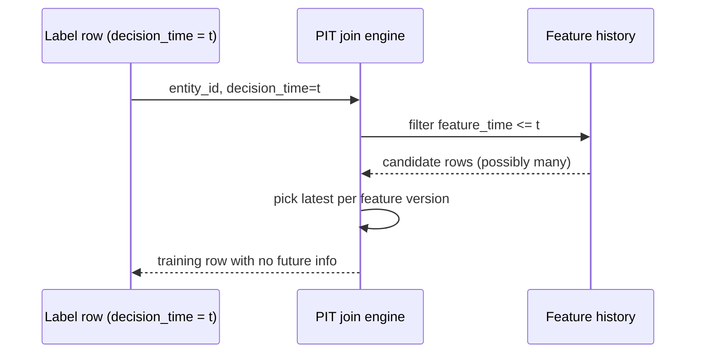
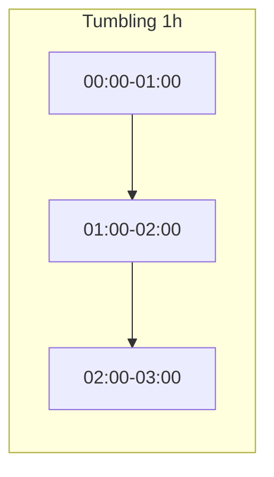
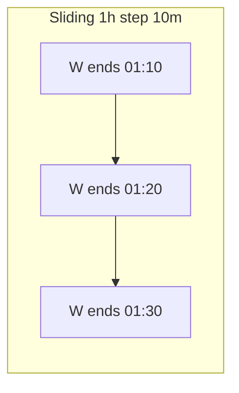
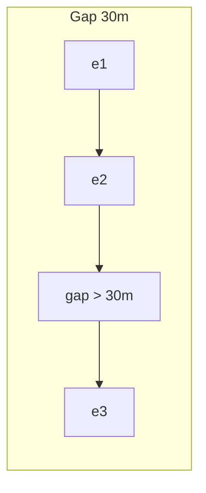
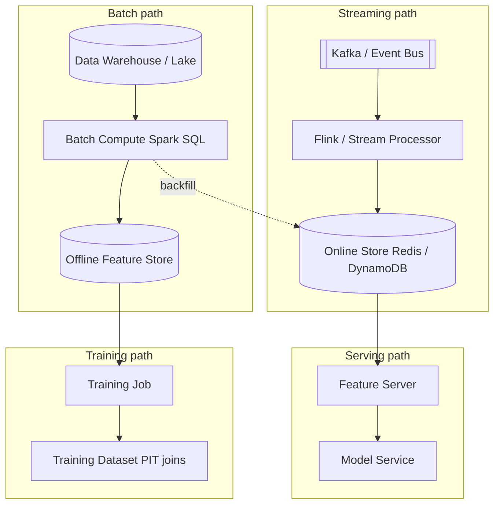

# Design a Real-time Feature Platform

---

## What We're Building

We are designing a **real-time feature platform**: a system that **computes**, **stores**, **versions**, and **serves** machine learning features at **sub-millisecond to low-single-digit millisecond** latency for online inference, while providing **consistent offline datasets** for training via **point-in-time (PIT) correct joins**. Think **Feast**, **Tecton**, **Databricks Feature Store**, or large-scale internal platforms at hyperscalers.

!!! note
    **Why this matters:** **Train–serve skew** is often the **#1 silent killer** of production ML. The model learns from one distribution of features in training and sees a different distribution (or semantics) at serving time—**AUC drops**, **calibration breaks**, and **business metrics regress** without an obvious “bug” in model code.

### The problem in one sentence

**Features** are the bridge between raw data and models. If that bridge is **inconsistent**, **stale**, or **leaky**, every downstream system—ranking, fraud, recommendations—inherits the damage.

### Scale anchors (interview-grade back-of-envelope)

| Dimension | Order of magnitude | Notes |
|-----------|-------------------|--------|
| **Feature lookups per day** | **Billions** | Every ranking/fraud request may fetch **tens to hundreds** of features across **many** entity keys |
| **Distinct features in catalog** | **Thousands to tens of thousands** | Sparse namespaces (user × ad × geo) explode **effective** cardinality even when “named” features are fewer |
| **Entities (users, items, sessions)** | **10⁷–10⁹+** | Sharded KV stores; hot keys are unavoidable |
| **Online serving SLO** | **P99 &lt; 5 ms** for feature **fetch + assembly** (platform slice); end-to-end budgets are tighter at some companies | Often dominated by **network + fan-out**, not CPU |
| **Streaming event throughput** | **Millions of events/sec** (aggregate across products) | Partitioned logs; **per-key** ordering matters for correctness |

!!! tip
    In interviews, separate **(a)** *feature definition correctness* (PIT, semantics), **(b)** *freshness* (SLA by use case), and **(c)** *serving performance* (batching, index design, cache). Platforms fail in different ways at each layer.

### Why train–serve skew dominates incident postmortems

| Failure mode | Symptom | Typical root cause |
|--------------|---------|-------------------|
| **Different aggregation windows** | Sudden AUC drop after deploy | Training used 7-day sum; serving used rolling 24h |
| **Different null handling** | Calibration drift | Offline imputed 0; online used “missing” sentinel |
| **Time travel mistakes** | Offline metrics amazing; online bad | Future events leaked into training labels/features |
| **Schema drift** | Silent NaNs / type coercion | Producer changed JSON schema; serving still old parser |

### Reference architectures (Feast, Tecton, hyperscaler platforms)

| Platform pattern | What it optimizes | Typical building blocks | Interview talking point |
|------------------|-------------------|-------------------------|-------------------------|
| **Feast (open source)** | Interoperability across clouds; **registry + offline/online** split | Parquet / warehouse offline; Redis / Dynamo **online**; optional **push** sources | Great for **standardizing** definitions; teams still own **compute** quality |
| **Tecton (managed)** | **Managed** streaming + **declarative** features + SLAs | Spark/Flink under the hood; **materialization** jobs; **monitoring** | Trade **vendor coupling** for faster time-to-correctness |
| **Internal “Google-scale” platforms** | Global **low tail latency** + **strong governance** | Custom control planes; **colocated** caches; **provenance** everywhere | Emphasize **SRE**, **blast radius**, and **tenancy** |

!!! tip
    **Sub-millisecond** reads usually require **in-memory** or **NVMe-local** hot tiers, **batching**, and **avoiding Python** on the critical path for assembly—often **C++/Rust** microservices with generated clients.

### Sub-millisecond serving: what actually has to be true

| Requirement | Rationale |
|-------------|-----------|
| **Working set fits RAM** (or ultra-fast tier) | Disk lookups break single-digit ms P99 at scale |
| **Stable key encoding** | Avoid per-request string churn; prefer compact IDs |
| **Client-side batching** | Amortize RTT across many keys per request |
| **Deterministic fallbacks** | Missing features must match **training** defaults |

---

## ML Concepts Primer

### Feature types: batch vs streaming vs on-demand

| Type | Definition | How it is computed | Typical latency to serve | Examples |
|------|------------|---------------------|----------------------------|----------|
| **Batch / offline** | Aggregates over large historical windows | Scheduled jobs (Spark, SQL warehouse) materialize tables | **Read precomputed** values (microseconds if local) | User 30-day spend; item popularity last 7 days |
| **Streaming / near-real-time** | Updates from event streams with windows | Flink / Kafka Streams / Beam; stateful per key | **Milliseconds to seconds** freshness | Session click count last 10 min; rolling fraud velocity |
| **On-demand** | Computed at request time from **fresh** inputs or **small** subgraphs | Request path code + optional caches | **Single-digit ms** if bounded work | Cross of (query embedding · item embedding); short graph walk |

!!! warning
    **“Real-time” is not one thing.** Fraud needs **sub-second** feature freshness; homepage recommendations may tolerate **minutes**; some batch features update **daily** but are still business-critical.

#### Latency requirements (illustrative)

| Use case | Freshness target | Why |
|----------|------------------|-----|
| **Card-not-present fraud** | **1–10 s** (sometimes faster) | Attack patterns evolve within minutes |
| **Feed ranking** | **30 s–15 min** | Session intent changes; still amortized over many impressions |
| **Search ranking** | **Minutes** (query features) + **hours** (doc stats) | Mixed cadence is normal |
| **User profile** | **Hours** | Demographics, stable preferences |

---

### Train–serve skew: definition, danger, concrete example

**Train–serve skew** means the **joint distribution** of \((x, \text{context})\) at training time differs from production **in ways the model is not robust to**—often because **feature code paths diverged**.

#### Concrete degradation story (simplified)

Suppose a click model uses `user_click_count_7d`.

- **Training:** Built from offline daily snapshots with **deduplication** across devices → mean count **12**.
- **Serving:** Incremental stream **double-counts** clicks after a consumer restart (at-least-once delivery) → mean count **18**.

The model learned weights assuming **12** as a “typical high-engagement user.” At serving, the same user looks “even more engaged,” pushing scores **nonlinearly** through logits and **miscalibrating** click probabilities.

| Metric | Before fix | After skew introduced |
|--------|------------|------------------------|
| Offline AUC | 0.82 | 0.82 (unchanged—training eval is “wrong world”) |
| Online CTR | 2.0% | 1.6% (over-exposure to supposedly “hot” users) |
| Log-loss | Healthy | **Silent** unless calibration monitored |

!!! note
    Skew often **does not show up in offline replay** if replay also uses the wrong feature path. This is why **consistency contracts** and **production monitoring** matter as much as offline accuracy.

---

### Point-in-time joins: preventing future data leakage

**PIT correctness:** For each training example at **decision time** \(t\), features may only use information **available at or before** \(t\) according to the **feature’s own event-time semantics**.

```mermaid
gantt
    title Point-in-time correctness (conceptual timeline)
    dateFormat X
    axisFormat %s

    section Entity timeline
    Account created           :milestone, 0, 0
    Feature window eligible   :active, 1, 4
    Label event (click)       :crit, 5, 5
    Future purchase           :done, 7, 7
```



**Wrong join:** joining “all purchases ever” would include the purchase at \(t=7\) when predicting at \(t=5\).

**Right join:** for each example at \(t=5\), join feature rows with `feature_time <= t5` and pick the **latest** such row per feature (depending on semantics).



---

### Feature freshness: when staleness actually hurts

| Staleness | Often acceptable when… | Breaks when… |
|-----------|-------------------------|--------------|
| **Seconds** | Rare; fraud / abuse | Attack velocity features are stale |
| **Minutes** | Feed / recommendations | Session features lag user intent shifts |
| **Hours** | Stable user interests | Breaking news / flash sales |
| **Days** | Slow inventory rotations | Item cold start within day |

!!! tip
    Tie freshness to **decision frequency** and **label delay**. High-frequency decisions need tighter freshness **or** features that are inherently local to the request (on-demand).

---

### Streaming feature computation: windows (with diagrams)

Stateful stream processors compute keyed aggregates using **windows**.

#### Tumbling window (fixed-size, non-overlapping)



#### Sliding window (fixed length, moves with time)



#### Session window (gap-based)



**Operational note:** sliding windows are **more expensive** (more overlapping state) than tumbling; session windows need **gap timers** and **state eviction** policies.

---

### Feature versioning, schema evolution, backwards compatibility

| Need | Why |
|------|-----|
| **Versioned definitions** | Reproduce training from 6 months ago for audits & debugging |
| **Schema evolution** | Producers add fields; consumers must not break |
| **Backwards compatibility** | Old models still served while new features roll out |

**Compatibility classes:**

| Change | Usually safe if… |
|--------|------------------|
| **Add optional field with default** | Serving fills default; training reads missing as default |
| **Widen numeric type** | Careful with quantization differences |
| **Rename field** | **Unsafe** unless dual-write / translation layer |
| **Change aggregation definition** | **New feature name** (v2) — do not silently replace |

!!! warning
    The safest pattern for semantic changes is **a new feature name** (`click_count_7d_v2`) and a **controlled migration** with monitoring—not an in-place “fix.”

---

## Step 1: Requirements

### Functional requirements

| ID | Requirement | Detail |
|----|-------------|--------|
| **F1** | **Feature registration** | Users register features with **schema**, **entity keys**, **transformation**, and **freshness SLA** |
| **F2** | **Batch computation** | Materialize offline training tables & batch online backfills (Spark/SQL) |
| **F3** | **Streaming computation** | Consume Kafka (etc.), aggregate with windows, sink to online store |
| **F4** | **On-demand computation** | Execute request-time functions with strict CPU budgets + caching |
| **F5** | **Online serving** | **P99 &lt; 5 ms** for platform feature retrieval + assembly at defined QPS |
| **F6** | **Offline store** | Immutable historical feature snapshots for training |
| **F7** | **Point-in-time joins** | Training datasets join labels ↔ features without leakage |
| **F8** | **Monitoring** | Data quality, drift, freshness, missing rate, schema violations |

### Non-functional requirements

| ID | Requirement | Target |
|----|-------------|--------|
| **N1** | **Availability** | **99.99%** for serving tier (multi-region story) |
| **N2** | **Throughput** | **Millions of lookups/sec** aggregate (horizontal scale) |
| **N3** | **Feature scale** | Support **10k+** registered features across namespaces |
| **N4** | **Durability** | Offline store durable; stream logs retained per compliance needs |
| **N5** | **AuthZ** | Namespaces isolated (team A cannot read team B’s features) |

!!! note
    Latency budgets are **end-to-end agreements**: feature platform, model server, and RPC fan-out must be negotiated as one **SLO chain**.

---

## Step 2: Estimation

### Offline store sizing (illustrative)

Assume **10k** logical features, **100M** entities, **sparse** storage model:

- If average **32 bytes** / numeric feature as serialized + key overhead:
  - Raw feature payload (if dense): \(10^4 \times 10^8 \times 32\) bytes ≈ **32 PB** (unrealistic if truly dense)
- In practice, **sparsity** and **hot set** caching reduce steady-state storage; many entities are cold.

!!! tip
    Interview trick: argue **sparsity**, **feature groups**, **importance sampling**, and **tiered storage**—then give a **range** (TB–PB) depending on retention and replication.

### Online store working set

| Input | Estimate |
|-------|----------|
| Hot entities | **1–10%** of all entities drive most traffic |
| Features per request | **50–300** |
| Value size | **4–64 bytes** typical after quantization |

### Lookup latency budget (example decomposition)

| Stage | Budget |
|-------|--------|
| RPC + auth | 0.2–0.5 ms |
| Feature graph resolution | 0.1–0.3 ms |
| KV **batched** read (Redis/MemoryDB) | 0.3–2.0 ms |
| Assembly + protobuf | 0.1–0.3 ms |
| Safety margin | remainder |

### Streaming compute throughput

If peak **2M events/sec** with **10:1** aggregation fan-in:

- **200k** keyed updates/sec sustained to sinks (illustrative)
- Partition by `user_id` to preserve per-key ordering; scale partitions with load

---

## Step 3: High-Level Design

### Architecture: dual path (batch + streaming) with unified semantics



**Paths (interview checklist):**

| Path | Flow |
|------|------|
| **Batch** | Data Warehouse → Batch Compute (Spark) → **Offline Store** |
| **Streaming** | Event Stream (Kafka) → Stream Compute (Flink) → **Online Store** (Redis / DynamoDB) |
| **Serving** | **Model Service** → **Feature Server** → **Online Store** → feature vector back to **Model** → **Response** *(logical dependency; data reads from the store into the server, then the model scores)* |
| **Training** | **Training Job** → **Offline Store** (point-in-time join with labels) → **Training Dataset** |

**Narration:**

- **Batch path** produces **authoritative** historical tables for **PIT training** and **batch backfills** into the online store after deployments.
- **Streaming path** keeps **fresh** aggregates for entities with tight SLA.
- **Feature server** resolves which features come from **online store** vs **on-demand**, batches IO, enforces **timeouts**, and returns a **feature vector** to the model.
- **Training** reads the **offline store** with **PIT join** semantics aligned to labels.

---

## Step 4: Deep Dive

### 4.1 Feature registry and schema (declarative DSL)

**Goals:** single source of truth, **versioned definitions**, **lineage** hooks, and compile-time checks (entities, types, SLAs).

```python
from __future__ import annotations

from dataclasses import dataclass, field
from enum import Enum
from typing import Callable, Dict, List, Mapping, Optional


class ComputeMode(str, Enum):
    BATCH = "batch"
    STREAM = "stream"
    ON_DEMAND = "on_demand"


@dataclass(frozen=True)
class FeatureSchema:
    """Logical schema for a feature value."""

    name: str
    dtype: str  # "float32", "int64", "string", ...
    shape: tuple[int, ...] = ()
    description: str = ""


@dataclass
class FeatureSpec:
    """
    Versioned feature definition. In production, persist as YAML/JSON in git
    and register in a metadata DB (DataHub/OpenMetadata).
    """

    name: str
    version: int
    entity_keys: tuple[str, ...]
    mode: ComputeMode
    schemas: Mapping[str, FeatureSchema]
    freshness_sla_ms: int
    owners: tuple[str, ...] = ()
    tags: Mapping[str, str] = field(default_factory=dict)
    upstream_tables: tuple[str, ...] = ()
    transform_ref: str = ""  # pointer to registered Spark/Flink/sql module


class FeatureRegistry:
    """In-memory registry with basic validation — production adds ACL + audit."""

    def __init__(self) -> None:
        self._features: Dict[tuple[str, int], FeatureSpec] = {}

    def register(self, spec: FeatureSpec) -> None:
        if spec.version < 1:
            raise ValueError("version must be >= 1")
        if not spec.entity_keys:
            raise ValueError("entity_keys required")
        key = (spec.name, spec.version)
        if key in self._features:
            raise ValueError(f"duplicate feature {key}")
        self._features[key] = spec

    def resolve(self, name: str, version: int) -> FeatureSpec:
        return self._features[(name, version)]

    def lineage(self, name: str, version: int) -> List[str]:
        spec = self.resolve(name, version)
        return list(spec.upstream_tables)


# Example registration
registry = FeatureRegistry()
registry.register(
    FeatureSpec(
        name="user_click_count_10m",
        version=1,
        entity_keys=("user_id",),
        mode=ComputeMode.STREAM,
        schemas={
            "value": FeatureSchema(
                name="value", dtype="int64", description="clicks in last 10 minutes"
            )
        },
        freshness_sla_ms=5_000,
        upstream_tables=("raw.clicks",),
        transform_ref="streaming/user_click_count_10m_v1",
    )
)
```

!!! note
    **Lineage** should connect **features → datasets → models → dashboards**. Even a minimal `upstream_tables` field pays dividends in incidents.

---

### 4.2 Batch feature pipeline (materialization, incremental, backfill)

**Goals:** reproducible SQL/Spark jobs, **partition pruning**, **incremental** recomputation where safe, and **backfill** after logic changes.

```python
from dataclasses import dataclass
from datetime import date, timedelta
from typing import Iterable, List, Optional, Tuple


@dataclass
class MaterializationJob:
    feature_name: str
    feature_version: int
    source_table: str
    sink_table: str
    sql_template: str


def daterange(start: date, end: date) -> Iterable[date]:
    cur = start
    while cur <= end:
        yield cur
        cur += timedelta(days=1)


def build_incremental_job(
    job: MaterializationJob,
    partition_col: str,
    start: date,
    end: date,
) -> List[str]:
    """
    Return a list of SQL statements (Spark SQL) — one per day partition.
    Incremental strategy: rewrite only touched partitions when upstream late data arrives.
    """
    statements: List[str] = []
    for d in daterange(start, end):
        stmt = job.sql_template.format(
            source=job.source_table,
            sink=job.sink_table,
            partition_col=partition_col,
            ds=d.isoformat(),
            feature=job.feature_name,
            version=job.feature_version,
        )
        statements.append(stmt)
    return statements


def backfill_plan(
    changed_on: date,
    lookback_days: int,
) -> Tuple[date, date]:
    """
    When feature logic changes, recompute a window of historical partitions
    used by training sets — exact window depends on label horizon and policies.
    """
    start = changed_on - timedelta(days=lookback_days)
    return start, changed_on


# Example SQL template (illustrative — real systems add dedupe, skew hints, QUALIFY)
EXAMPLE_SQL = """
INSERT OVERWRITE TABLE {sink} PARTITION ({partition_col}='{ds}')
SELECT
  user_id,
  COUNT(*) AS click_count_7d,
  {feature} AS feature_name,
  {version} AS feature_version
FROM {source}
WHERE event_date BETWEEN DATE_SUB('{ds}', 6) AND '{ds}'
GROUP BY user_id
"""
```

!!! tip
    Prefer **explicit partition specs** in backfills. “Full recompute since dawn of time” is how platforms accidentally **miss SLA** and **overload warehouses**.

---

### 4.3 Streaming feature computation (sliding windows, watermarks, late data)

**Goals:** per-key state, **event time**, **watermarks** to trade completeness vs latency, and **idempotent** sinks.

```python
from collections import defaultdict, deque
from dataclasses import dataclass
from typing import Deque, Dict, Iterable, List, Tuple


@dataclass(frozen=True)
class ClickEvent:
    user_id: str
    event_time_ms: int  # event-time


@dataclass
class SlidingWindowAggregator:
    """
    Simplified sliding sum over event-time for one key.
    Production: RocksDB state, timers, Flink operators.
    """

    window_ms: int
    allowed_lateness_ms: int

    def __post_init__(self) -> None:
        self._events: Deque[Tuple[int, int]] = deque()  # (event_time, +1)
        self._watermark_ms: int = 0

    def update_watermark(self, watermark_ms: int) -> None:
        self._watermark_ms = watermark_ms

    def add_event(self, ev: ClickEvent) -> None:
        if ev.event_time_ms < self._watermark_ms - self.allowed_lateness_ms:
            # drop or send to side output in real systems
            return
        self._events.append((ev.event_time_ms, 1))
        self._prune(ev.event_time_ms)

    def _prune(self, now_event_time: int) -> None:
        cutoff = now_event_time - self.window_ms
        while self._events and self._events[0][0] < cutoff:
            self._events.popleft()

    def sum_window(self, as_of_event_time: int) -> int:
        """Sum events in (as_of - window, as_of]."""
        lower = as_of_event_time - self.window_ms
        return sum(w for t, w in self._events if t > lower and t <= as_of_event_time)


def keyed_demo(events: Iterable[ClickEvent]) -> Dict[str, int]:
    agg = SlidingWindowAggregator(window_ms=10 * 60 * 1000, allowed_lateness_ms=60_000)
    by_user: Dict[str, SlidingWindowAggregator] = defaultdict(
        lambda: SlidingWindowAggregator(
            window_ms=10 * 60 * 1000, allowed_lateness_ms=60_000
        )
    )
    last_ts = 0
    out: Dict[str, int] = {}
    for ev in sorted(events, key=lambda e: e.event_time_ms):
        last_ts = ev.event_time_ms
        agg_for_user = by_user[ev.user_id]
        agg_for_user.add_event(ev)
        # advance watermark monotonically as a demo
        agg_for_user.update_watermark(ev.event_time_ms - 60_000)
        out[ev.user_id] = agg_for_user.sum_window(ev.event_time_ms)
    return out
```

!!! warning
    **At-least-once** delivery + incremental aggregates ⇒ you need **dedupe keys** or **exactly-once** end-to-end semantics. Otherwise skew creeps in slowly.

---

### 4.4 On-demand features (request-time computation + cache)

**Goals:** bound work with **timeouts**, **memoize** within request, optionally **read-through** cache for expensive subgraphs.

```python
import hashlib
import json
import time
from dataclasses import dataclass
from typing import Any, Callable, Dict, Optional, Tuple


@dataclass
class CacheEntry:
    value: Any
    expires_at_ms: float


class ReadThroughCache:
    def __init__(self) -> None:
        self._store: Dict[str, CacheEntry] = {}

    def get_or_compute(
        self,
        key_parts: Tuple[Any, ...],
        ttl_ms: float,
        compute: Callable[[], Any],
    ) -> Any:
        key = hashlib.sha256(json.dumps(key_parts, sort_keys=True).encode()).hexdigest()
        now = time.time() * 1000
        ent = self._store.get(key)
        if ent and ent.expires_at_ms > now:
            return ent.value
        val = compute()
        self._store[key] = CacheEntry(value=val, expires_at_ms=now + ttl_ms)
        return val


def on_demand_dot_product(
    user_emb: list[float],
    item_emb: list[float],
    cache: ReadThroughCache,
    item_id: str,
) -> float:
    """
    Example on-demand feature: embedding similarity.
    Cache per item if embeddings are stable intra-request burst.
    """

    def compute() -> float:
        return float(sum(u * v for u, v in zip(user_emb, item_emb)))

    return cache.get_or_compute(("dot", item_id, tuple(user_emb[:8])), ttl_ms=50, compute=compute)
```

---

### 4.5 Online serving layer (Redis cluster, batching, assembly)

**Goals:** **MGET** / pipelining, **timeouts**, partial results flagged, **consistent keying**.

```python
from dataclasses import dataclass
from typing import Dict, Iterable, List, Mapping, Optional, Sequence, Tuple


class RedisClientStub:
    """Stub — replace with redis-py cluster client."""

    def mget(self, keys: Sequence[str]) -> List[Optional[bytes]]:
        return [self._kv.get(k) for k in keys]

    def __init__(self, kv: Mapping[str, bytes]) -> None:
        self._kv = dict(kv)


@dataclass
class FeatureRef:
    name: str
    version: int


class FeatureServer:
    def __init__(self, redis: RedisClientStub) -> None:
        self._r = redis

    def _key(self, entity_type: str, entity_id: str, feature: FeatureRef) -> str:
        return f"{entity_type}:{entity_id}:f:{feature.name}:v{feature.version}"

    def assemble(
        self,
        entity_type: str,
        entity_id: str,
        features: List[FeatureRef],
        deadline_ms: float,
    ) -> Tuple[Dict[str, float], List[str]]:
        keys = [self._key(entity_type, entity_id, f) for f in features]
        raw = self._r.mget(keys)
        out: Dict[str, float] = {}
        missing: List[str] = []
        for feat, val in zip(features, raw):
            if val is None:
                missing.append(feat.name)
                continue
            out[feat.name] = float(val.decode())
        return out, missing


# Example
redis = RedisClientStub({"user:u42:f:user_click_count_10m:v1": b"7"})
server = FeatureServer(redis)
vec, missing = server.assemble(
    "user",
    "u42",
    [FeatureRef("user_click_count_10m", 1)],
    deadline_ms=3.0,
)
```

!!! tip
    Add **hedged requests** only with care—duplicates can amplify hot keys. Prefer **batching at the caller** + **per-tenant quotas**.

---

### 4.6 Point-in-time joins for training (pandas example)

**Goal:** emulate correct **as-of** join semantics for event-time features.

```python
from __future__ import annotations

import pandas as pd


def point_in_time_join(
    labels: pd.DataFrame,
    features: pd.DataFrame,
    entity_col: str,
    label_time_col: str,
    feature_time_col: str,
) -> pd.DataFrame:
    """
    labels: rows are training examples with decision time
    features: long history of feature rows with feature_time <= label time allowed
    """
    labels_sorted = labels.sort_values(label_time_col)
    feats_sorted = features.sort_values(feature_time_col)
    joined = pd.merge_asof(
        labels_sorted,
        feats_sorted,
        left_on=label_time_col,
        right_on=feature_time_col,
        by=entity_col,
        direction="backward",
        allow_exact_matches=True,
    )
    return joined


labels = pd.DataFrame(
    {
        "user_id": ["u1", "u1"],
        "decision_time": pd.to_datetime(["2024-01-01 10:05", "2024-01-02 09:00"]),
        "clicked": [0, 1],
    }
)

features = pd.DataFrame(
    {
        "user_id": ["u1", "u1", "u1"],
        "feature_time": pd.to_datetime(
            ["2024-01-01 10:00", "2024-01-01 10:04", "2024-01-02 08:30"]
        ),
        "click_count_10m": [1, 2, 0],
    }
)

pit = point_in_time_join(
    labels,
    features,
    entity_col="user_id",
    label_time_col="decision_time",
    feature_time_col="feature_time",
)
```

!!! note
    For multi-entity joins (user + item), enforce **per-entity as-of** semantics; a single global timestamp is a common leakage footgun.

---

### 4.7 Feature monitoring and data quality (PSI + KS)

**Goals:** catch **drift**, **schema violations**, **missingness spikes**, and **distribution shifts** early.

```python
from __future__ import annotations

import numpy as np
from dataclasses import dataclass
from typing import Tuple


def psi(expected: np.ndarray, actual: np.ndarray, bins: int = 10) -> float:
    """
    Population Stability Index — common in risk modeling; interpret thresholds with care.
    """
    e_hist, edges = np.histogram(expected, bins=bins, range=(0, 1))
    a_hist, _ = np.histogram(actual, bins=edges)
    eps = 1e-6
    e_pct = (e_hist + eps) / (e_hist.sum() + eps * bins)
    a_pct = (a_hist + eps) / (a_hist.sum() + eps * bins)
    return float(np.sum((a_pct - e_pct) * np.log(a_pct / e_pct)))


def ks_statistic(x: np.ndarray, y: np.ndarray) -> float:
    """Two-sample KS statistic D (simplified; use scipy.stats.ks_2samp in production)."""
    xs = np.sort(x)
    ys = np.sort(y)
    i = j = 0
    n1, n2 = len(xs), len(ys)
    cdf1 = cdf2 = 0.0
    best = 0.0
    while i < n1 and j < n2:
        if xs[i] <= ys[j]:
            i += 1
            cdf1 = i / n1
        else:
            j += 1
            cdf2 = j / n2
        best = max(best, abs(cdf1 - cdf2))
    return float(best)


@dataclass
class DriftAlert:
    feature: str
    psi: float
    ks: float


def evaluate_drift(reference: np.ndarray, production: np.ndarray, name: str) -> DriftAlert:
    p = psi(reference, production)
    k = ks_statistic(reference, production)
    return DriftAlert(feature=name, psi=p, ks=k)
```

!!! warning
    **PSI thresholds** are not universal—tail-heavy features need different binning (quantiles) and **separate monitors** for missingness.

---

### 4.8 Feature freshness and consistency (SLA + staleness detection)

**Goals:** measure **end-to-end** freshness, compare **online** vs **offline** snapshots for **consistency audits**.

```python
from __future__ import annotations

import time
from dataclasses import dataclass
from typing import Dict, Optional, Tuple


@dataclass
class FreshnessProbe:
    feature: str
    observed_age_ms: float
    sla_ms: float

    def ok(self) -> bool:
        return self.observed_age_ms <= self.sla_ms


def staleness_from_timestamps(
    feature: str,
    event_time_ms: float,
    served_at_ms: float,
    sla_ms: float,
) -> FreshnessProbe:
    age = max(0.0, served_at_ms - event_time_ms)
    return FreshnessProbe(feature=feature, observed_age_ms=age, sla_ms=sla_ms)


def offline_online_consistency_check(
    online_val: float,
    offline_val: float,
    rtol: float = 1e-3,
    atol: float = 1e-5,
) -> Tuple[bool, Optional[float]]:
    diff = abs(online_val - offline_val)
    tol = atol + rtol * abs(offline_val)
    return diff <= tol, None if diff <= tol else diff


# Example synthetic probe
probe = staleness_from_timestamps(
    feature="user_click_count_10m",
    event_time_ms=time.time() * 1000 - 800,
    served_at_ms=time.time() * 1000,
    sla_ms=5_000,
)
```

!!! tip
    Emit **freshness percentiles** per feature namespace—not only averages—because **tail staleness** drives worst-case model behavior.

---

## Step 5: Scaling & Production

### Failure handling

| Scenario | Mitigation |
|----------|------------|
| **Online store partial outage** | Degrade to **default features**, **shadow mode**, or **skip non-critical** groups; **never** block the whole request without policy |
| **Stream lag** | Alert on consumer lag; **autoscale** Flink; **pause** promotion of new models if freshness breaks |
| **Hot keys** | Hash spreading, **local caches**, **request coalescing** (carefully) |
| **Backfill overload** | **Quota** per tenant; **off-peak** scheduling; incremental partitions only |

### Monitoring (minimum viable observability)

| Layer | Signals |
|-------|---------|
| **Serving** | P50/P95/P99 latency, timeouts, batch sizes, error codes |
| **Stream** | Lag, late records, dropped records, watermark age |
| **Data quality** | Null rate, min/max, distinct count deltas, PSI/KS |
| **Business** | Downstream model calibration, CTR, fraud catch rate |

### Trade-offs (talk about these explicitly)

| Choice | Upside | Downside |
|--------|--------|----------|
| **Strong PIT correctness** | Trustworthy training | Heavier joins, engineering complexity |
| **More streaming features** | Fresher | Costly state; harder debugging |
| **On-demand features** | Flexible | Harder to bound latency; need guardrails |
| **Co-located feature + model** | Fewer network hops | Couples release cycles |

### Multi-region and disaster recovery

| Topic | Practical approach |
|-------|---------------------|
| **Read path** | **Regional** online stores with **async replication**; accept **bounded staleness** across regions for most features |
| **Write path (streams)** | Partition by entity; **fail over** consumers with **checkpointing**; reconcile counts with **idempotent** sinks where possible |
| **Offline store** | **Object storage** + warehouse replication; **immutable** partitions simplify recovery |
| **RTO / RPO** | Separate **serving** RTO (seconds–minutes) from **training** RPO (hours), depending on compliance |

### Security, privacy, and compliance

| Concern | Control |
|---------|---------|
| **PII in features** | Tokenize entity IDs; **minimize** raw attributes; enforce **column-level ACLs** in registry |
| **Cross-tenant reads** | **Namespace isolation** in KV keys; **service identity** + **auditing** on registry APIs |
| **Model risk** | Feature **allowlists** per model version; **approval** workflow for new high-risk features |

### Cost and efficiency levers

| Lever | Effect |
|-------|--------|
| **Tiered storage** | Cold entities on cheaper media; warm set in memory |
| **Quantization / hashing** | Smaller values; fewer bytes over the wire |
| **Selective materialization** | Only materialize **high-traffic** keys for streaming sinks |
| **Shared aggregates** | One keyed aggregate reused by many downstream features (with explicit dependency graph) |

---

## Interview Tips

### Strong opening moves

- Define **batch / streaming / on-demand** and map them to **freshness** and **risk**.
- State **train–serve skew** and **PIT joins** as **non-negotiable** platform requirements.

### Likely follow-up questions (Google-style depth)

| Question | What a strong answer includes |
|----------|-------------------------------|
| **How do you prevent leakage?** | Entity-level **as-of** joins, **event-time** discipline, holdout policies |
| **Exactly-once vs at-least-once?** | End-to-end implications for **counts**; **idempotency keys** |
| **How to version features?** | Immutable versions; **dual-write**; migration; monitoring |
| **Redis vs DynamoDB?** | Latency tail, ops model, multi-region, cost |
| **How to debug a feature incident?** | Lineage, replay, **shadow** compare online vs offline |
| **Multi-tenant fairness?** | Quotas, isolation, noisy neighbor controls |
| **How do you test features before launch?** | **Shadow** computation vs legacy; **replay** on historical traffic; **contract tests** between producers/consumers |
| **What breaks first at 10× traffic?** | Hot keys, GC pauses, fan-out storms, **downstream DB connection pools** |
| **Embedding features vs tabular?** | **Vector** features need different storage (ANN index vs KV); still version **embedding model** with feature |
| **Feature store vs “just Redis”?** | Redis is **storage**; a **platform** adds **registry, lineage, PIT training, governance, monitoring** |
| **How to handle backfills safely?** | Incremental partitions, **rate limits**, **validation gates**, **canary** consumers |

!!! note
    Close with **operational maturity**: SLAs, **backfills**, **incident tooling**, and **governance**—not only architecture diagrams.

### Red flags interviewers listen for

| Anti-pattern | Better response |
|--------------|-----------------|
| “We’ll recompute everything nightly” | Acknowledge **streaming** + **SLA** + **incremental** recomputation |
| “Training uses logs; serving uses Redis—same enough” | Demand **shared definitions** and **consistency checks** |
| “We’ll fix skew with more data” | Skew is often **semantic**; **version** and **monitor** |
| “P99 1 ms everywhere” | Show **decomposition** and **what is precomputed vs on-demand** |

---

## Summary

| Theme | Takeaway |
|-------|----------|
| **Correctness** | **Point-in-time** joins and consistent semantics beat marginal offline AUC gains |
| **Freshness** | Match **SLA** to decision cadence; measure **tails** |
| **Serving** | Batch IO, strict budgets, graceful degradation |
| **Evolution** | **Version** everything; treat semantic changes as **new features** |

---

## Further Reading

| Resource | Why it helps |
|----------|--------------|
| **Feast / Tecton docs** | Feast (open-source) and Tecton (managed) define the feature store architecture: a feature registry (schema, ownership, lineage), an offline store (data warehouse for training) and an online store (low-latency cache for serving). The key innovation is the "time-travel" join — retrieving feature values as they were at training time to prevent data leakage. Understanding this dual-store pattern and point-in-time correctness is essential for any ML platform design. |
| **Flink windowing** | Real-time feature computation requires aggregating streaming data over time windows. Flink's documentation covers the three windowing strategies (tumbling, sliding, session), event-time vs. processing-time semantics, and watermarks (how to handle late-arriving data without waiting forever). These concepts directly determine how features like "purchases in last 30 minutes" or "login frequency in the last hour" are computed with correctness guarantees. |
| **Data validation (Great Expectations / Deequ)** | ML models silently degrade when input features drift — unlike application bugs, there's no crash or error. Great Expectations (Python) and Deequ (Spark/Scala, by Amazon) provide automated data quality assertions (null rates, value distributions, schema conformance) that act as gates in feature pipelines. Understanding data validation is critical because the most common ML production failure is not model bugs but bad data flowing through unchecked. |
