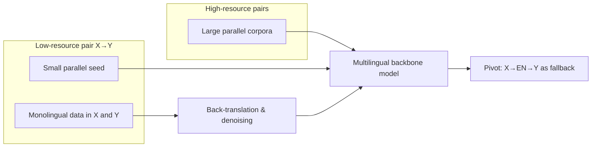
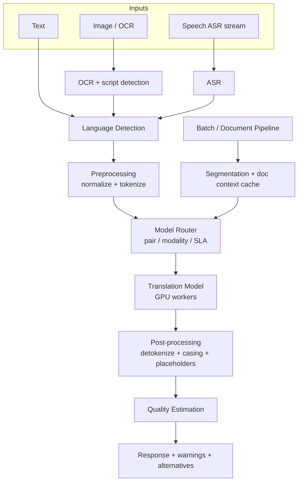
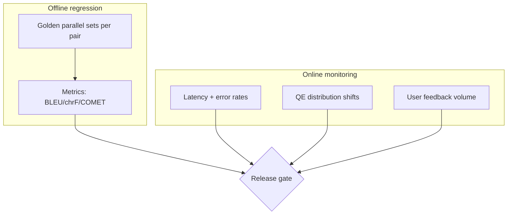

# Design a Machine Translation System (like Google Translate)

---

## What We're Building

We are designing a **large-scale neural machine translation (NMT)** platform comparable in spirit to **Google Translate**: support for **100+ languages**, **billions of translations per day**, and **multiple modalities**—plain text, **image/OCR** (translate text in photos), **speech** (ASR → translate → TTS), and **real-time conversation** (streaming, low-latency turn-taking).

!!! tip
    In interviews, anchor numbers to public ballparks (orders of magnitude), then show how you derive capacity from QPS, sequence length, and model FLOPs—interviewers care about structured reasoning more than exact figures.

### Reference scale (public-order benchmarks)

| Dimension | Representative public-scale anchor |
|-----------|-------------------------------------|
| **Daily volume** | On the order of **100B+ words/day** translated globally (industry-scale aggregate) |
| **Language coverage** | **100+ languages** in major consumer products; **133** languages cited for Google Translate coverage |
| **Modalities** | Web/mobile text, documents, camera/OCR, voice, conversation |
| **Quality bar** | Strong pairs often report **high BLEU/chrF** in research; production uses **human eval + side-by-side** |

### Why this problem is hard at scale

| Challenge | Why it matters |
|-----------|----------------|
| **Long tail of language pairs** | \(O(L^2)\) pairs if naive; multilingual models amortize |
| **Morphology & script** | Tokenization and normalization dominate quality for Finnish, Turkish, Arabic, Hindi |
| **Latency vs quality** | Beam search improves BLEU but hurts P99 latency |
| **Safety & abuse** | Translation can be used to evade moderation; rate limits and policy layers matter |
| **Low-resource** | Parallel data scarce; pivoting and transfer are mandatory |

---

## ML Concepts Primer

This section is the conceptual backbone for the rest of the design. Production MT is less “one giant LSTM” and more **data + tokenization + multilingual training + serving math**.

### Encoder–decoder and sequence-to-sequence (seq2seq)

**Seq2seq** maps a source sequence \(x_{1:T}\) to a target sequence \(y_{1:S}\). Classic RNN seq2seq used two recurrent networks: an **encoder** summarizes the source into a context vector; a **decoder** generates the target token by token.

**Bottleneck problem:** A single fixed-size vector cannot faithfully represent long or ambiguous sentences.

### Attention mechanism

**Attention** lets the decoder **look at all encoder hidden states** when predicting each target token. For timestep \(i\), attention weights \(\alpha_{ij}\) say how much to focus on source position \(j\).

Conceptually:

\[
\text{context}_i = \sum_j \alpha_{ij} \cdot h_j
\]

where \(h_j\) are encoder states and \(\alpha_{ij}\) are normalized scores (often softmax of a compatibility function).

!!! note
    In interviews, say clearly: **dot-product / additive attention** were precursors; **Transformers** generalize this into **multi-head self-attention** and **cross-attention**.

### Transformer architecture for translation

A **Transformer** block typically contains:

| Component | Role in MT |
|-----------|------------|
| **Self-attention (encoder)** | Each source token attends to all source tokens; builds contextual source representations |
| **Self-attention (decoder, masked)** | Each target token attends to previous target tokens only (causal mask) |
| **Cross-attention (decoder)** | Target-side queries attend to **encoder outputs** (source) |
| **Feed-forward + residuals + LayerNorm** | Nonlinear transforms and training stability |
| **Positional encoding** | Attention is permutation-invariant; positions are injected via sinusoidal or learned embeddings |

**Positional encoding (sinusoidal sketch):**

\[
PE_{(pos, 2i)} = \sin\left(\frac{pos}{10000^{2i/d}}\right),\quad
PE_{(pos, 2i+1)} = \cos\left(\frac{pos}{10000^{2i/d}}\right)
\]

Modern systems often use **learned positional embeddings** or **relative position** (e.g., T5-style) for simplicity and performance.

### Subword tokenization: BPE, SentencePiece, and why word-level fails

| Method | Idea | Typical use |
|--------|------|-------------|
| **BPE (Byte Pair Encoding)** | Merge frequent symbol pairs iteratively to build a vocabulary | Open-source NMT pipelines |
| **SentencePiece** | Unsupervised subword training; can encode raw sentences without pre-tokenization | Multilingual models (mBERT, mT5-style) |
| **Unigram LM** | Probabilistic subword segmentation | Alternative to BPE in some toolchains |

**Why word-level tokenization breaks:**

- **OOV explosion** for rare words, proper nouns, typos
- **Morphologically rich languages** (Finnish, Turkish, German compounding): one “word” can encode what English expresses as a phrase
- **Agglutinative languages**: long tokens with many morphemes; character-only models are expressive but inefficient without subwords

!!! warning
    For production, you almost always want **shared multilingual subword vocab** + **script-appropriate normalization** (Unicode NFC/NFKC, digit mapping policies), not “split on spaces.”

### Multilingual models: shared vocabulary, language tokens, zero-shot

**Multilingual NMT** trains one model on many language pairs simultaneously.

| Technique | What it does |
|-----------|--------------|
| **Shared subword vocabulary** | One tokenizer across languages; improves parameter efficiency |
| **Special tokens** | `<2en>`, `<2de>` target-language control tokens (common in mBART/mT5-style setups) |
| **Language embedding / adapter** | Per-language conditioning without full separate models |
| **Zero-shot / zero-resource transfer** | If the model sees `A→English` and `English→B`, it may generalize to `A→B` without direct parallel data—quality varies |

Trade-off: multilingual models **reduce footprint** and enable transfer, but can suffer **interference** between unrelated languages unless balanced sampling and capacity are tuned.

### Quality estimation (QE)

**QE** predicts how good a translation is **without references** (or with limited references).

| Signal | Use |
|--------|-----|
| **Model confidence** | Token-level softmax entropy, sequence log-probability (noisy but cheap) |
| **Dedicated QE model** | Regressor/classifier on source + hypothesis features; trained on human judgments |
| **Reference-based metrics (offline)** | BLEU, chrF++, COMET (neural metric) for eval—not always available online |

Production pattern: show **“Translation quality may be low”** when QE or confidence crosses thresholds—especially for low-resource pairs or OCR/speech.

### Beam search vs sampling

| Decoding | Pros | Cons |
|----------|------|------|
| **Beam search (width \(k\))** | Higher BLEU, more stable | Slower, less diverse, can favor “safe” bland outputs |
| **Sampling (top-k / top-p)** | Diversity, more natural in some generative settings | Risk of hallucination in MT if mis-tuned |
| **Greedy** | Fastest | Often suboptimal for NMT |

For **interactive short text**, you might use **small beams + length normalization**. For **batch/documents**, slightly wider beams or **segment-level reranking** may be acceptable if latency budget allows.

### Low-resource languages: data augmentation, back-translation, pivoting

| Technique | Description |
|-----------|-------------|
| **Back-translation** | Train a reverse model (English→X) on monolingual English; synthesize pseudo-parallel X→English |
| **Self-training / iterative BT** | Repeat pseudo-labeling with quality filtering |
| **Pivot translation** | Translate X→English→Y when X→Y parallel data is tiny |
| **Data augmentation** | Noising source, code-switch regularization (careful), transliteration for script gaps |
| **Few-shot LLM prompting** | Useful for gisting or rare pairs; needs guardrails for determinism and safety |



---

## Step 1: Requirements

### Functional requirements

| ID | Requirement | Notes |
|----|-------------|-------|
| **F1** | **Text-to-text translation** | Core API: source text + source/target lang → translated text |
| **F2** | **Language detection** | Auto-detect source language when unspecified |
| **F3** | **Broad language coverage** | **100+ languages**; graceful degradation for tail pairs |
| **F4** | **Interactive + batch** | Online API for product; **batch jobs** for large files |
| **F5** | **Document translation** | Preserve structure (HTML/DOCX), segment long inputs |
| **F6** | **Alternatives** | Optional n-best or paraphrase alternatives for UI |
| **F7** | **Multimodal paths** | OCR pipeline for images; ASR/TTS wrappers for speech; streaming for conversation |

### Non-functional requirements (targets for discussion)

| NFR | Target | Rationale |
|-----|--------|-----------|
| **Latency (short text)** | **P99 < 200 ms** server-side (excluding client networking) for small requests | Snappy UI; conversation requires tighter budgets per chunk |
| **Throughput** | **100K+ translations/sec** aggregate (horizontally scaled) | Global traffic; isolate hot pairs |
| **Quality** | **BLEU > 40** for select **major pairs** (offline eval) | Illustrative bar—pair-dependent; use human eval in production |
| **Availability** | **99.9%+** tier-1 regions | Fallback routes (pivot, smaller model) |
| **Cost** | Minimize $/1M characters | Quantization, batching, routing |
| **Safety & compliance** | Abuse detection hooks, regional data policies | Especially for user-generated content |

!!! note
    Always separate **per-request latency** (interactive) from **document latency** (minutes acceptable). Interviewers reward this distinction.

---

## Step 2: Estimation

Back-of-the-envelope reasoning ties product requirements to **GPU/TPU capacity**, **memory**, and **network**.

### Request volume

Assume **aggregate 100B words/day** as an industry-scale anchor (order-of-magnitude storytelling).

- Words/day \(\approx 10^{11}\)
- Seconds/day \(\approx 8.64 \times 10^4\)
- **Average words/sec** \(\approx 10^{11} / 8.6 \times 10^4 \approx 1.16 \times 10^6\) words/s (if spread uniformly)

Not all traffic hits the heaviest model tier (routing, caching, tiny queries). For capacity planning, split:

| Tier | Fraction of traffic (example) | Implication |
|------|---------------------------------|-------------|
| **Edge cached / repeated** | 10–40% | CDN-like caching of popular strings |
| **Small interactive** | 40–60% | Latency-sensitive |
| **Batch / documents** | 10–30% | Throughput-sensitive |

### Model serving compute (sketch)

Let:

- \(T\) = average **target tokens** per request after subword segmentation
- \(C_{\text{forward}}\) = forward pass cost per token for decoder (dominant at inference)
- Batch size \(B\) improves throughput via tensor cores

**Rule of thumb:** decoder steps \(\approx T\) autoregressive steps; total compute scales roughly linearly with \(T\) for inference (without speculative decoding). **KV-cache** avoids recomputing prefix keys/values for incremental decoding in conversation/documents.

Example: if an average interactive job is **30 target tokens**, global **1M req/s** truly hitting the GPU tier (after cache misses) implies **30M decoding steps/s**—this drives **GPU fleet sizing** and **model sharding**.

### Vocabulary size

Typical multilingual SentencePiece vocabularies range **32k–128k** pieces for large models. Storage per embedding table:

- **FP16**: 2 bytes × vocab × hidden_dim
- For vocab **64k**, hidden **4096**: \(64{,}000 \times 4{,}096 \times 2 \approx 512\) MB **per embedding table** (plus optimizer states only in training)

### One model vs many bilingual models

| Approach | Footprint | Pros | Cons |
|----------|-----------|------|------|
| **Per-pair bilingual models** | \(O(L^2)\) explosion | Tailored quality for top pairs | Operational nightmare at 100+ languages |
| **Single massive multilingual Transformer** | One stack + routing | Parameter efficient; transfer learning | Interference; harder debugging |
| **Hybrid (common)** | Multilingual backbone + **adapters / LoRA / small experts** | Balance | More complex serving |

At “Google-scale,” **multilingual models + routing + specialization** (adapters, distilled student models for hot paths) are standard talking points.

---

## Step 3: High-Level Design

### End-to-end flow



### Batch and document path


**Router** chooses:

- **Model variant** (tiny vs large; speech vs text)
- **Pivot path** (X→EN→Y) if direct pair is weak or model missing
- **Quantization policy** (INT8 for speed vs FP16 for quality)

---

## Step 4: Deep Dive

### 4.1 Language Detection

**Goals:** Extremely fast, robust across scripts, good on short strings.

**Techniques:**

| Method | When |
|--------|------|
| **fastText supervised classifier** | Strong baseline; tiny model; CPU friendly |
| **Script / Unicode ranges** | Disambiguate CJK; Arabic vs Latin, etc. |
| **Heuristics for ambiguity** | `pt` vs `es` on short strings: n-gram profiles |

Below is **illustrative** Python: a tiny **character n-gram + multinomial NB** sketch (stand-in for fastText API), plus **script detection**.

```python
from __future__ import annotations

import re
import unicodedata
from collections import Counter
from dataclasses import dataclass


def normalize_text(s: str) -> str:
    # NFC helps compare composed vs decomposed Unicode
    return unicodedata.normalize("NFC", s.strip())


def script_histogram(text: str) -> dict[str, float]:
    """Coarse script buckets for routing / ambiguity handling."""
    counts: Counter[str] = Counter()
    for ch in text:
        o = ord(ch)
        if "\u4e00" <= ch <= "\u9fff":
            counts["CJK"] += 1
        elif "\u0600" <= ch <= "\u06ff" or "\u0750" <= ch <= "\u077f":
            counts["Arabic"] += 1
        elif "\u0590" <= ch <= "\u05ff":
            counts["Hebrew"] += 1
        elif "\u0900" <= ch <= "\u097f":
            counts["Devanagari"] += 1
        elif "a" <= ch.lower() <= "z":
            counts["Latin"] += 1
        elif ch.isdigit():
            counts["Digit"] += 1
        elif not ch.isspace():
            counts["Other"] += 1
    total = sum(counts.values()) or 1
    return {k: v / total for k, v in counts.items()}


def char_ngrams(s: str, n: int = 3) -> list[str]:
    s = re.sub(r"\s+", " ", s.lower())
    if len(s) < n:
        return [s] if s else []
    return [s[i : i + n] for i in range(len(s) - n + 1)]


@dataclass
class LangDetector:
    """
    Sketch: train with labeled (text, lang) pairs.
    Production would call fastText.train_supervised / load_model.
    """

    vocab: list[str]
    class_log_prior: dict[str, float]
    word_log_prob: dict[str, dict[str, float]]  # lang -> ngram -> log p

    @classmethod
    def train(cls, examples: list[tuple[str, str]], min_df: int = 2) -> "LangDetector":
        df = Counter()
        lang_counts = Counter()
        ngram_lang_counts: dict[str, Counter[str]] = {}

        for text, lang in examples:
            lang_counts[lang] += 1
            grams = char_ngrams(normalize_text(text), n=3)
            seen = set(grams)
            for g in seen:
                df[g] += 1
            for g in grams:
                ngram_lang_counts.setdefault(lang, Counter())[g] += 1

        vocab = [g for g, c in df.items() if c >= min_df]
        vocab_set = set(vocab)
        V = len(vocab_set) or 1

        word_log_prob: dict[str, dict[str, float]] = {}
        alpha = 0.1  # Laplace smoothing
        for lang, ctr in ngram_lang_counts.items():
            denom = sum(ctr[g] for g in vocab_set) + alpha * V
            word_log_prob[lang] = {}
            for g in vocab_set:
                num = ctr.get(g, 0) + alpha
                word_log_prob[lang][g] = float(__import__("math").log(num / denom))

        total_docs = sum(lang_counts.values()) or 1
        class_log_prior = {l: float(__import__("math").log(c / total_docs)) for l, c in lang_counts.items()}
        return cls(vocab=vocab, class_log_prior=class_log_prior, word_log_prob=word_log_prob)

    def predict(self, text: str) -> tuple[str, float]:
        import math

        grams = char_ngrams(normalize_text(text), n=3)
        if not grams:
            best = max(self.class_log_prior.items(), key=lambda x: x[1])
            return best[0], 1.0

        scores: dict[str, float] = {}
        for lang, lp in self.class_log_prior.items():
            s = lp
            wlp = self.word_log_prob.get(lang, {})
            for g in grams:
                s += wlp.get(g, -10.0)  # backoff constant for OOV in sketch
            scores[lang] = s
        best_lang = max(scores.items(), key=lambda x: x[1])
        # Convert log-score to a pseudo-confidence via softmax max margin (sketch)
        m = max(scores.values())
        exp_sum = sum(math.exp(v - m) for v in scores.values())
        top = math.exp(best_lang[1] - m) / exp_sum
        return best_lang[0], top


def disambiguate_short_text(text: str, top_langs: list[str]) -> list[str]:
    """
    If confidence is low or text is very short, return candidate set for router:
    try multiple languages or ask user.
    """
    if len(normalize_text(text)) < 8:
        return top_langs[:3]
    return top_langs[:1]
```

**Ambiguity playbook:**

- Return **top-k languages** with scores to the router
- If scores within \(\epsilon\), **ask user** or run **tiny translate-to-English** compare (expensive; last resort)

---

### 4.2 Model Architecture

Core idea: **Transformer encoder-decoder** or **encoder-decoder with shared multilingual stack**. Below: **multi-head attention**, **cross-attention**, and a **language adapter** hook.

```python
from __future__ import annotations

import math
from dataclasses import dataclass

import torch
import torch.nn as nn
import torch.nn.functional as F


def sinusoidal_pos_emb(seq_len: int, dim: int, device: torch.device) -> torch.Tensor:
    position = torch.arange(seq_len, device=device).float().unsqueeze(1)
    div = torch.exp(torch.arange(0, dim, 2, device=device).float() * (-math.log(10000.0) / dim))
    pe = torch.zeros(seq_len, dim, device=device)
    pe[:, 0::2] = torch.sin(position * div)
    pe[:, 1::2] = torch.cos(position * div)
    return pe


class MultiHeadAttention(nn.Module):
    def __init__(self, d_model: int, n_heads: int, dropout: float = 0.1):
        super().__init__()
        assert d_model % n_heads == 0
        self.n_heads = n_heads
        self.d_head = d_model // n_heads
        self.qkv = nn.Linear(d_model, 3 * d_model)
        self.proj = nn.Linear(d_model, d_model)
        self.dropout = nn.Dropout(dropout)

    def forward(
        self,
        x: torch.Tensor,
        attn_mask: torch.Tensor | None = None,
        kv: torch.Tensor | None = None,
    ) -> torch.Tensor:
        """
        x: (B, T, D)
        If kv is provided, computes cross-attention where queries come from x and keys/values from kv.
        """
        if kv is None:
            kv = x
        B, T, D = x.shape
        _, S, _ = kv.shape

        q, k, v = self.qkv(x).chunk(3, dim=-1)
        q = q.view(B, T, self.n_heads, self.d_head).transpose(1, 2)
        k = k.view(B, S, self.n_heads, self.d_head).transpose(1, 2)
        v = v.view(B, S, self.n_heads, self.d_head).transpose(1, 2)

        scores = torch.matmul(q, k.transpose(-2, -1)) / math.sqrt(self.d_head)
        if attn_mask is not None:
            scores = scores.masked_fill(attn_mask == 0, float("-inf"))
        attn = torch.softmax(scores, dim=-1)
        attn = self.dropout(attn)
        out = torch.matmul(attn, v)
        out = out.transpose(1, 2).contiguous().view(B, T, D)
        return self.proj(out)


class LanguageAdapter(nn.Module):
    """Lightweight per-language shift in embedding space (adapter-style)."""

    def __init__(self, num_langs: int, d_model: int):
        super().__init__()
        self.lang_emb = nn.Embedding(num_langs, d_model)

    def forward(self, x: torch.Tensor, lang_ids: torch.Tensor) -> torch.Tensor:
        return x + self.lang_emb(lang_ids).unsqueeze(1)


class TransformerEncoderLayer(nn.Module):
    def __init__(self, d_model: int, n_heads: int, d_ff: int, dropout: float = 0.1):
        super().__init__()
        self.self_attn = MultiHeadAttention(d_model, n_heads, dropout)
        self.ff = nn.Sequential(
            nn.Linear(d_model, d_ff),
            nn.ReLU(),
            nn.Dropout(dropout),
            nn.Linear(d_ff, d_model),
        )
        self.ln1 = nn.LayerNorm(d_model)
        self.ln2 = nn.LayerNorm(d_model)
        self.dropout = nn.Dropout(dropout)

    def forward(self, x: torch.Tensor, src_mask: torch.Tensor | None) -> torch.Tensor:
        x2 = self.self_attn(self.ln1(x), attn_mask=src_mask)
        x = x + self.dropout(x2)
        x2 = self.ff(self.ln2(x))
        x = x + self.dropout(x2)
        return x


class TransformerDecoderLayer(nn.Module):
    def __init__(self, d_model: int, n_heads: int, d_ff: int, dropout: float = 0.1):
        super().__init__()
        self.self_attn = MultiHeadAttention(d_model, n_heads, dropout)
        self.cross_attn = MultiHeadAttention(d_model, n_heads, dropout)
        self.ff = nn.Sequential(
            nn.Linear(d_model, d_ff),
            nn.ReLU(),
            nn.Dropout(dropout),
            nn.Linear(d_ff, d_model),
        )
        self.ln1 = nn.LayerNorm(d_model)
        self.ln2 = nn.LayerNorm(d_model)
        self.ln3 = nn.LayerNorm(d_model)
        self.dropout = nn.Dropout(dropout)

    def forward(
        self,
        x: torch.Tensor,
        memory: torch.Tensor,
        tgt_mask: torch.Tensor,
        cross_mask: torch.Tensor | None = None,
    ) -> torch.Tensor:
        x2 = self.self_attn(self.ln1(x), attn_mask=tgt_mask)
        x = x + self.dropout(x2)
        x2 = self.cross_attn(self.ln2(x), attn_mask=cross_mask, kv=memory)
        x = x + self.dropout(x2)
        x2 = self.ff(self.ln3(x))
        x = x + self.dropout(x2)
        return x


@dataclass
class TinyNMTConfig:
    vocab_size: int = 32000
    d_model: int = 512
    n_heads: int = 8
    d_ff: int = 2048
    n_enc_layers: int = 6
    n_dec_layers: int = 6
    max_len: int = 1024
    num_langs: int = 128


class TinyMultilingualNMT(nn.Module):
    """
    Illustrative stack: embeddings + encoder + decoder + shared LM head.
    Real systems add MoE layers, relative positions, etc.
    """

    def __init__(self, cfg: TinyNMTConfig):
        super().__init__()
        self.cfg = cfg
        self.tok_emb = nn.Embedding(cfg.vocab_size, cfg.d_model)
        self.encoder_layers = nn.ModuleList(
            [TransformerEncoderLayer(cfg.d_model, cfg.n_heads, cfg.d_ff) for _ in range(cfg.n_enc_layers)]
        )
        self.decoder_layers = nn.ModuleList(
            [TransformerDecoderLayer(cfg.d_model, cfg.n_heads, cfg.d_ff) for _ in range(cfg.n_dec_layers)]
        )
        self.adapter = LanguageAdapter(cfg.num_langs, cfg.d_model)
        self.lm_head = nn.Linear(cfg.d_model, cfg.vocab_size, bias=False)

    def encode(self, src_ids: torch.Tensor, src_lang: torch.Tensor, src_pad_mask: torch.Tensor) -> torch.Tensor:
        B, T = src_ids.shape
        device = src_ids.device
        x = self.tok_emb(src_ids) + sinusoidal_pos_emb(T, self.cfg.d_model, device).unsqueeze(0)
        x = self.adapter(x, src_lang)
        attn_mask = src_pad_mask.unsqueeze(1).unsqueeze(2)  # (B,1,1,T)
        for layer in self.encoder_layers:
            x = layer(x, attn_mask)
        return x

    def decode_step(
        self,
        tgt_ids: torch.Tensor,
        memory: torch.Tensor,
        tgt_lang: torch.Tensor,
        causal_mask: torch.Tensor,
        src_pad_mask: torch.Tensor,
    ) -> torch.Tensor:
        B, U = tgt_ids.shape
        device = tgt_ids.device
        x = self.tok_emb(tgt_ids) + sinusoidal_pos_emb(U, self.cfg.d_model, device).unsqueeze(0)
        x = self.adapter(x, tgt_lang)
        cross_mask = src_pad_mask.unsqueeze(1).unsqueeze(2)  # attend to non-pad src
        for layer in self.decoder_layers:
            x = layer(x, memory, causal_mask, cross_mask=cross_mask)
        return self.lm_head(x)
```

**Mixture-of-Experts (MoE) talking points:**

- **Sparsely activated experts** increase capacity without proportional FLOPs per token
- Routing can be **language-aware** (route to region-specific experts)
- Challenges: **load balancing**, **all-to-all** communication, **training instability**

---

### 4.3 Training Pipeline

**Stages:**

1. **Corpus collection:** OPUS, Paracrawl, CommonCrawl mining, licensed data, user feedback (with consent)
2. **Cleaning:** length ratio filters, language ID filtering, dedup (MinHash), toxicity filters
3. **Augmentation:** back-translation, word dropout, span masking (denoising objectives)
4. **Curriculum:** train on cleaner/high-resource first; gradually add noisy tail
5. **Distillation:** large teacher → smaller student for serving latency

```python
from __future__ import annotations

import random
from dataclasses import dataclass


@dataclass
class ParallelExample:
    src: str
    tgt: str
    src_lang: str
    tgt_lang: str


def length_ratio_filter(ex: ParallelExample, min_ratio: float = 0.5, max_ratio: float = 2.0) -> bool:
    a = max(1, len(ex.src.split()))
    b = max(1, len(ex.tgt.split()))
    r = a / b
    return min_ratio <= r <= max_ratio


def noisy_copy(ex: ParallelExample, drop_prob: float = 0.1) -> ParallelExample:
    """Simple augmentation: random word dropout on source."""
    toks = ex.src.split()
    kept = [t for t in toks if random.random() > drop_prob]
    src2 = " ".join(kept) if kept else ex.src
    return ParallelExample(src=src2, tgt=ex.tgt, src_lang=ex.src_lang, tgt_lang=ex.tgt_lang)


def backtranslate_stub(mono_en: str, reverse_model) -> ParallelExample:
    """
    reverse_model: trained EN->X monolingual translator
    Returns synthetic X->EN parallel example for training X->EN forward model.
    """
    synthetic_src = reverse_model.translate(mono_en, src_lang="en", tgt_lang="xx")
    return ParallelExample(src=synthetic_src, tgt=mono_en, src_lang="xx", tgt_lang="en")


@dataclass
class CurriculumScheduler:
    """Increase weight of noisier datasets as training progresses."""

    step: int = 0

    def mixing_weights(self) -> dict[str, float]:
        t = min(1.0, self.step / 100_000)
        return {"clean": 1.0 - 0.5 * t, "noisy": 0.5 * t}


def kl_distillation_loss(student_logits, teacher_logits, temperature: float = 2.0):
    """
    student/teacher logits: (B, V) for next token
    """
    import torch.nn.functional as F
    import torch

    p = F.log_softmax(student_logits / temperature, dim=-1)
    q = F.softmax(teacher_logits / temperature, dim=-1)
    return torch.sum(q * (torch.log(q + 1e-9) - p), dim=-1).mean()
```

---

### 4.4 Serving Architecture

**Optimizations:**

| Technique | Benefit |
|-----------|---------|
| **INT8/FP8 quantization** | Higher QPS, lower memory |
| **Dynamic batching** | GPU utilization |
| **Routing by source language** | Co-locate hot pairs; reduce interference |
| **KV-cache** | Reuse prefix states in documents and conversation |
| **Speculative decoding** | Draft model proposes tokens; target verifies (latency win) |

```python
from __future__ import annotations

from collections import defaultdict, deque
from dataclasses import dataclass
import time

import torch


@dataclass
class TranslationRequest:
    req_id: str
    src_lang: str
    tgt_lang: str
    tokens: list[int]
    max_new_tokens: int


class LanguageBatchScheduler:
    """Group pending requests by (src_lang) bucket to improve locality (illustrative)."""

    def __init__(self, max_wait_ms: float = 5.0, max_batch: int = 16):
        self.max_wait_ms = max_wait_ms
        self.max_batch = max_batch
        self._queues: dict[str, deque[TranslationRequest]] = defaultdict(deque)

    def push(self, req: TranslationRequest) -> None:
        self._queues[req.src_lang].append(req)

    def pop_batch(self) -> list[TranslationRequest]:
        # Pick the longest queue; wait until deadline in real impl
        if not self._queues:
            return []
        src = max(self._queues.keys(), key=lambda k: len(self._queues[k]))
        q = self._queues[src]
        batch: list[TranslationRequest] = []
        while q and len(batch) < self.max_batch:
            batch.append(q.popleft())
        return batch


class KVCache:
    """Stores per-layer K/V tensors for a growing prefix (shape details omitted)."""

    def __init__(self, layers: int):
        self.layers = layers
        self.cache: dict[int, list[torch.Tensor]] = {}

    def update(self, layer: int, step: int, k: torch.Tensor, v: torch.Tensor) -> None:
        self.cache.setdefault(layer, []).append((k, v))


def speculative_decode_stub(draft, target, prefix_ids, max_new: int, gamma: int = 4):
    """
    draft/target are callables returning next-token logits for a given prefix.
    This is a structural sketch only.
    """
    ids = list(prefix_ids)
    for _ in range(max_new):
        # Draft proposes gamma tokens
        proposal = ids[:]
        for _ in range(gamma):
            logits = draft(proposal)
            next_tok = int(logits.argmax(-1)[-1])
            proposal.append(next_tok)
        # Target verifies proposal in parallel (real impl compares distributions)
        logits = target(proposal)
        # Accept/reject loop would go here
        ids.append(int(logits.argmax(-1)[len(ids) - 1]))
    return ids
```

---

### 4.5 Quality Estimation and Fallback

Combine **cheap signals** + **learned QE** + **product policy**.

```python
from __future__ import annotations

from dataclasses import dataclass


@dataclass
class QESignals:
    mean_token_prob: float
    seq_logprob: float
    length_ratio: float


def heuristic_confidence(mean_token_prob: float) -> float:
    return max(0.0, min(1.0, mean_token_prob))


class QEModelStub:
    """
    Real QE: Transformer regressor on (src, hyp) concatenated, or COMET-style.
    """

    def score(self, src: str, hyp: str) -> float:
        # Placeholder: length sanity + char overlap toy score
        overlap = len(set(src.lower()) & set(hyp.lower()))
        return max(0.0, min(1.0, overlap / (10.0 + abs(len(hyp) - len(src)))))


@dataclass
class EscalationPolicy:
    min_conf: float = 0.35
    min_qe: float = 0.40


def should_warn_user(sig: QESignals, qe: float, pol: EscalationPolicy) -> bool:
    if heuristic_confidence(sig.mean_token_prob) < pol.min_conf:
        return True
    if qe < pol.min_qe:
        return True
    if sig.length_ratio < 0.3 or sig.length_ratio > 3.0:
        return True
    return False


def alternatives_from_nbest(nbest: list[str], max_k: int = 3) -> list[str]:
    # De-dup and filter trivial variants
    out: list[str] = []
    for s in nbest:
        s2 = s.strip()
        if s2 and s2 not in out:
            out.append(s2)
        if len(out) >= max_k:
            break
    return out
```

**Human escalation:** route to **professional translation** partners when:

- User selects “certified translation”
- Legal/medical disclaimers require it
- QE signals failure on high-risk content

---

### 4.6 Document and Contextual Translation

Problems: **inconsistent terminology**, **wrong anaphora**, **broken formatting**.

```python
from __future__ import annotations

import re
from dataclasses import dataclass


PLACEHOLDER_RE = re.compile(r"(\{\{[^}]+\}\}|<[^>]+>|https?://\S+)")


@dataclass
class Segment:
    idx: int
    text: str


def protect_placeholders(text: str) -> tuple[str, dict[str, str]]:
    mapping: dict[str, str] = {}

    def repl(m: re.Match[str]) -> str:
        key = f"__PH{len(mapping)}__"
        mapping[key] = m.group(0)
        return key

    protected = PLACEHOLDER_RE.sub(repl, text)
    return protected, mapping


def restore_placeholders(translated: str, mapping: dict[str, str]) -> str:
    out = translated
    for k, v in mapping.items():
        out = out.replace(k, v)
    return out


def sentence_segment(text: str) -> list[Segment]:
    # Production: use language-specific segmenters (spaCy, Moses, etc.)
    parts = re.split(r"(?<=[.!?])\s+", text.strip())
    return [Segment(i, p) for i, p in enumerate(parts) if p]


class ContextWindow:
    """Keeps previous source/target tails for contextual conditioning (sketch)."""

    def __init__(self, max_chars: int = 512):
        self.max_chars = max_chars
        self.src_hist: list[str] = []
        self.tgt_hist: list[str] = []

    def update(self, src_seg: str, tgt_seg: str) -> None:
        self.src_hist.append(src_seg)
        self.tgt_hist.append(tgt_seg)
        joined_src = " ".join(self.src_hist)
        while len(joined_src) > self.max_chars and len(self.src_hist) > 1:
            self.src_hist.pop(0)
            self.tgt_hist.pop(0)
            joined_src = " ".join(self.src_hist)

    def prefix(self) -> str:
        return " ".join(self.src_hist[-2:])


def glossary_enforce(text: str, term_map: dict[str, str]) -> str:
    out = text
    for src_term, tgt_term in sorted(term_map.items(), key=lambda kv: -len(kv[0])):
        out = re.sub(re.escape(src_term), tgt_term, out, flags=re.IGNORECASE)
    return out
```

---

### 4.7 Low-Resource Languages

```python
from __future__ import annotations


def pivot_translate(text: str, translate_fn, src: str, pivot: str = "en", tgt: str | None = None) -> str:
    """
    translate_fn: (text, src_lang, tgt_lang) -> str
    """
    mid = translate_fn(text, src, pivot)
    if tgt is None:
        raise ValueError("tgt language required")
    return translate_fn(mid, pivot, tgt)


def few_shot_llm_prompt(src: str, tgt: str, examples: list[tuple[str, str]]) -> str:
    """
    For rare pairs, provide 3-5 high-quality in-context examples.
    Production systems constrain decoding, verify language IDs, and filter unsafe outputs.
    """
    ex_blocks = "\n".join([f"SRC: {s}\nTGT: {t}\n" for s, t in examples])
    return (
        "You are a careful translator. Follow the style of examples.\n\n"
        f"{ex_blocks}\n"
        f"SRC ({src}): {src}\nTGT ({tgt}):"
    )


def transfer_schedule(num_finetune_steps: int) -> dict[str, float]:
    """
    Illustrates staged unfreezing / LR for low-resource fine-tuning.
    """
    return {"head_only": 0.2, "adapters": 0.5, "full": 0.3}
```

**Pivot risks:** error compounding (X→EN→Y). Mitigate with **reranking**, **QE**, or **direct pair model** once data exists.

---

## Step 5: Scaling & Production

### Failure handling

| Failure | Mitigation |
|---------|------------|
| **Model host crash** | Health checks, **fast failover**, redundant replicas per region |
| **OOM on long doc** | Chunking, **streaming decode**, cap `max_tokens` |
| **Bad rollout** | **Canary**, automatic rollback on **BLEU/comet regression** |
| **Poisoned data** | Provenance tracking, **human audit** gates for training corpora |

### Monitoring

| Signal | Why |
|--------|-----|
| **Latency P50/P95/P99** | SLO tracking per region |
| **Token throughput** | Capacity planning |
| **BLEU/chrF/COMET (offline)** | Regression tests on golden sets |
| **Human side-by-side** | Gold standard for quality |
| **User edits / copy-feedback** | Implicit quality signal (with privacy controls) |
| **Language-pair dashboards** | Catch interference or data bugs |



### Trade-offs (interview gold)

| Axis | Option A | Option B |
|------|----------|----------|
| **Latency vs quality** | Greedy / small beam | Wide beam + reranker |
| **Cost vs quality** | Quantized 8-bit | FP16 |
| **Coverage vs interference** | One multilingual model | Mixture-of-experts + adapters |
| **Automation vs safety** | LLM gisting everywhere | Policy filters + escalation |

---

## Interview Tips

### Strong story arc

1. Clarify **modality**, **latency**, and **quality targets**
2. Commit to **multilingual backbone + routing + specialization**
3. Explain **tokenization** and **normalization** as first-class
4. Close with **eval** (offline + human) and **rollback**

### Likely Google-style follow-ups

| Topic | What to say |
|-------|-------------|
| **Multilingual vs bilingual** | Parameter efficiency, transfer, interference; hybrid MoE/adapters |
| **Low-resource** | Back-translation, pivoting, curated seed data, human-in-the-loop |
| **Metrics** | BLEU limits; use chrF++, COMET; human side-by-side for truth |
| **Decoding** | Beam width trade-offs; length normalization; n-best reranking |
| **Document translation** | Segmentation, context windows, glossary, layout preservation |
| **Safety** | Abuse, PII handling, regional policy |

!!! tip
    Practice one **numeric** capacity estimate (words/day → GPU tokens/s) and one **failure mode** (bad rollout + automatic rollback)—that combination signals senior thinking.

---

## Further Reading (patterns, not endorsements)

- **Transformer / attention:** Vaswani et al., *Attention Is All You Need* (2017) — This paper replaced recurrent and convolutional architectures with pure self-attention, solving the sequential computation bottleneck that limited RNN-based translation. The Transformer processes all positions in parallel, uses multi-head attention to capture different relationship types, and introduced positional encoding for sequence ordering. It became the foundation of BERT, GPT, and every modern NMT system because it scales efficiently to long sequences and massive parallelism on GPUs.
- **Subword:** Sennrich et al., *Neural Machine Translation of Rare Words with Subword Units* (BPE for NMT) — Before BPE, NMT systems used fixed vocabularies and replaced unknown words with UNK tokens, producing gibberish for rare words and morphologically rich languages. Byte Pair Encoding learns a vocabulary of subword units from data, enabling open-vocabulary translation without exploding vocabulary size. This technique is now used in every modern tokenizer (GPT, BERT, T5).
- **Multilingual NMT:** Johnson et al., *Google’s Multilingual Neural Machine Translation System: Enabling Zero-Shot Translation* (2017) — This paper showed that a single NMT model trained on many language pairs simultaneously can translate between language pairs it was *never* trained on (zero-shot), simply by prepending a target language tag to the input. The architecture enabled positive transfer between related languages and dramatically reduced the engineering cost of supporting N languages from O(N²) separate models to one shared model.
- **Distillation:** Kim & Rush, *Sequence-Level Knowledge Distillation* (2016) — Large NMT models are too slow and expensive for production serving. This paper showed that a small "student" model trained on the large "teacher" model’s outputs achieves near-teacher quality at a fraction of the inference cost. The technique is the foundation for deploying efficient translation models in latency-sensitive production systems.

---

### Appendix: Quick glossary

| Term | Meaning |
|------|---------|
| **BLEU** | N-gram overlap vs reference; common but imperfect |
| **chrF** | Character n-gram F-score; better for morphology |
| **COMET** | Neural metric estimating translation quality |
| **Pivot** | Indirect translation through a bridge language |
| **MoE** | Mixture-of-Experts: sparse routing to specialized subnetworks |
