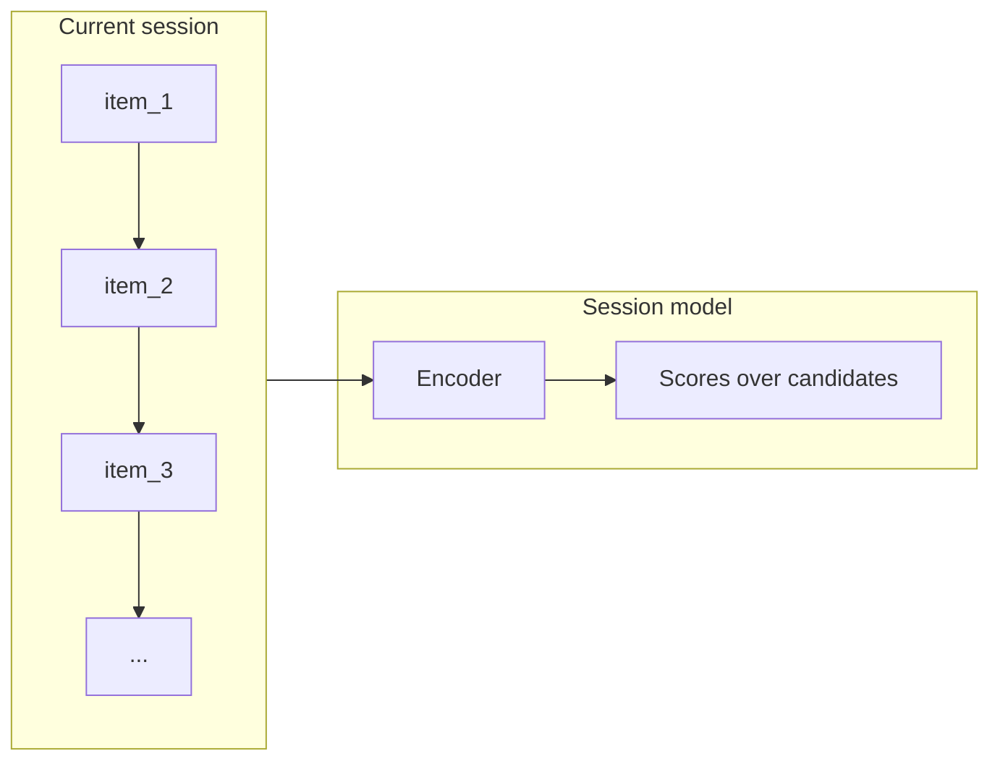
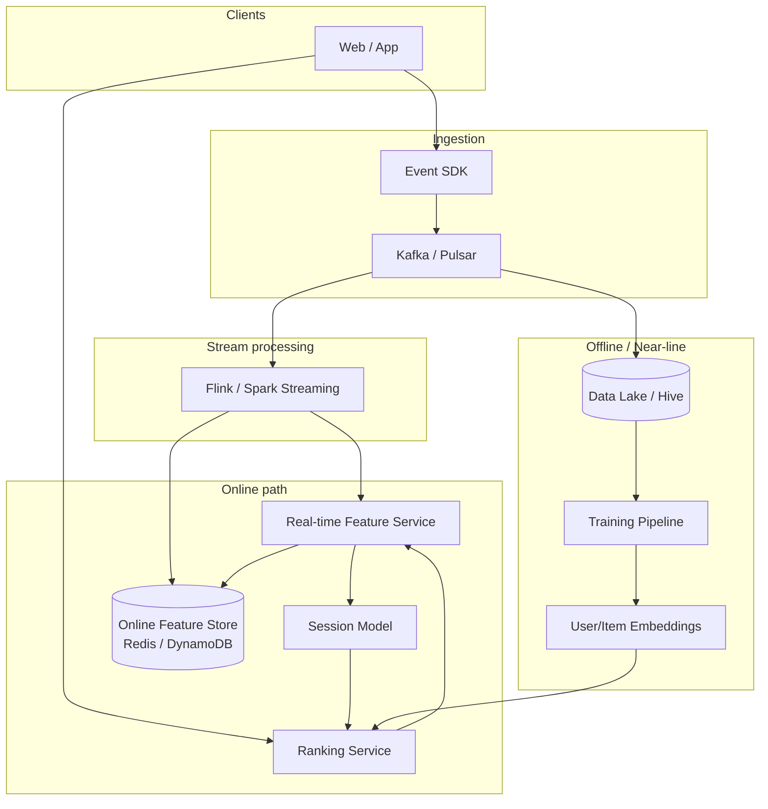
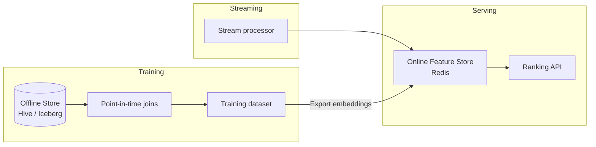
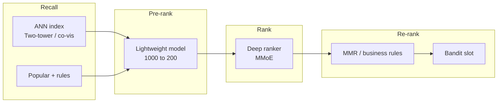

# Real-time Personalization System

---

## What We're Building

A **real-time personalization system** adapts recommendations and rankings to a user’s **current session**—not only to long-term profile history. It responds within milliseconds to clicks, scrolls, dwell time, and cart actions so the next screen feels “aware” of what the user is doing *right now*.

!!! note
    **Session vs. long-term personalization:** Batch or nightly jobs can refresh user embeddings and cohort features. Real-time personalization adds a **fast loop** from event → features → model → ranked list, usually with strict latency budgets.

**Typical surfaces:**
- E-commerce: home, category rails, search ranking, checkout upsells
- Content / streaming: next-video, feed ranking, autoplay queues
- Notifications: push ranking conditioned on recent app opens and engagement

**Real-world scale and impact (illustrative public references):**
- **Netflix** personalizes for hundreds of millions of accounts; ranking and artwork tests are central to engagement.
- **Spotify** “Discover Weekly” and radio lean on batch + streaming signals; session context affects what plays next.
- **TikTok** “For You” is a canonical example of **tight real-time feedback** (watch time, skips, replays) driving ranking.

**Difference from batch recommendations:**

| Dimension | Batch / near-batch | Real-time personalization |
|-----------|-------------------|---------------------------|
| **Signal freshness** | Hours to days | Sub-second to seconds |
| **Objective** | Stable taste, cohort trends | Immediate intent in session |
| **Infra** | Scheduled ETL, offline training | Streaming, online features, low-latency inference |
| **Failure mode** | Stale but safe | Wrong session → obvious mistakes |

!!! tip
    In interviews, state clearly: you still need **offline** training and **batch** features; real-time is an **additional** path, not a replacement for the whole stack.

---

## ML Concepts Primer

### Session-Based Recommendations

Session-based models treat a user’s interaction sequence as ordered events (e.g., item IDs, categories, actions). They predict the **next** item or score **candidates** given the prefix sequence.

**Families of models:**

| Family | Examples | Strengths | Trade-offs |
|--------|----------|------------|------------|
| **RNN** | GRU4Rec | Strong sequential bias, mature | Harder to parallelize; long sessions can vanish gradients |
| **Transformer / self-attention** | SASRec, BST | Long-range dependencies; parallelizable | More data-hungry; latency vs depth |
| **Graph** | Session graphs, GNN extensions | Cross-session / item graph structure | Heavier to serve; engineering complexity |



### Multi-Armed Bandits

Bandits formalize **exploration vs. exploitation**: show items likely to reward (exploit) while still learning (explore). Useful for **cold items**, **new users**, or **slots** where supervised scores are uncertain.

| Algorithm | Idea | Typical use |
|-----------|------|-------------|
| **ε-greedy** | Random explore with prob ε | Simple baselines |
| **UCB** | Optimism under uncertainty | Theoretical guarantees; tuned variants in production |
| **Thompson Sampling** | Sample from posterior over reward | Strong empirical performance; Bayesian flavor |
| **Contextual bandits** | Use user/context features (LinUCB, neural policies) | Personalization with side information |

!!! warning
    Bandits optimize **short-term reward** unless you add constraints. Combine with **diversity**, **fairness**, and **long-term metrics** in production.

### User Embeddings

**User embeddings** are dense vectors summarizing behavior. In real-time systems you often combine:

| Type | How built | Freshness | Role |
|------|-----------|-----------|------|
| **Static** | Batch model on full history | Hours–days | Stable taste, demographics proxy |
| **Dynamic** | Session encoder, short window aggregates | Seconds | In-session intent |

**Combining:** concatenate, gated fusion, or learned attention over `[static || dynamic || context]`.

---

## Step 1: Requirements Clarification

### Functional Requirements

| Area | Requirement |
|------|-------------|
| **Ranking** | Rank items using **current session** + profile + context |
| **Context-aware** | Time, device, geo (coarse), channel (web vs app), campaign |
| **Cold start** | New users: popular + content features + exploration |
| **Multi-surface** | Shared user state; surface-specific models or heads |
| **Consistency** | Same user should not see jarring jumps without reason (optional business rule) |

### Non-Functional Requirements

| NFR | Example target | Notes |
|-----|----------------|-------|
| **Inference latency** | P99 &lt; 50 ms for ranking path | End-to-end includes retrieval + features + model |
| **Throughput** | ~500K QPS globally | Sharded serving, regional caches |
| **State update** | User/session state visible within &lt; 100 ms of interaction | Async path acceptable if next page uses fresh state |
| **Availability** | 99.95%+ | Graceful degradation |

!!! note
    Always separate **API latency** (blocking user) from **async pipeline latency** (Kafka consumer lag). Interviewers reward crisp SLAs.

### Metrics

**Online (production):**
- **CTR**, **conversion rate**, **revenue per session**
- **Engagement time**, **session depth** (items per session)
- **Unsubscribe / churn** proxies for bad personalization

**Offline (evaluation):**
- **Hit Rate@K**, **NDCG@K**, **MRR**
- **Coverage** (catalog), **intra-list diversity**, **calibration**

!!! tip
    Mention **interleaving** or **counterfactual** evaluation when discussing online metrics—shows maturity.

---

## Step 2: Back-of-Envelope Estimation

**Assumptions:**
- **100M DAU**
- **20 interactions / session** (clicks, impressions counted per product decision—clarify in interview)
- **3 sessions / user / day** (signed-in app + web)

**Interactions per day:**

```
100M users × 3 sessions × 20 interactions/session = 6B interaction events / day
≈ 6×10^9 / 86,400 sec ≈ 69,400 events/sec average
```

Peak (×3–×5): **~200K–350K events/sec** to size Kafka.

**Model inference QPS (not equal to events):**
- Not every interaction triggers a full ranker call (e.g., impression-only batching).
- Assume **10 rank calls / session** (home, listing, search, PDP):  
  `100M × 3 × 10 = 3B rank calls/day` → **~35K QPS average**, peak **~100K–150K QPS**.

!!! note
    Separate **event ingestion QPS** from **inference QPS**—they differ by product instrumentation.

**Feature store reads:**
- Assume **40 feature keys / request** (session + user + item side features for top-200 candidates):  
  `3B × 40 = 120B point reads/day` if naive; **batching and vector features** cut this sharply.
- Realistic with candidate bundles: **~5–15M effective reads/sec** at peak depending on caching (many features are per-user or per-session, not per item).

**Rough storage (events only):**
- 200 bytes/event average → `6×10^9 × 200 B ≈ 1.2 TB/day` raw (before replication and indexes).

---

## Step 3: High-Level Design

### End-to-end architecture



**Offline:** batch features, embedding tables, training data joins, model export.

**Online:** capture events, serve low-latency features, run retrieval + ranking.

**Near-line:** session state, rolling aggregates, trending, delayed corrections (e.g., purchase confirmation).

!!! warning
    **Training/serving skew** is the #1 failure mode: document how feature definitions are **versioned** and **materialized** the same way offline and online.

---

## Step 4: Deep Dive

### 4.1 Event Collection & Processing

**Client-side event SDK** should batch, retry, and attach **request/session IDs**. Typical events:

| Event | Fields (example) |
|-------|------------------|
| `impression` | item_id, position, surface, query_id |
| `click` | item_id, dwell_ms, source_impression_id |
| `scroll` | depth_pct, surface |
| `add_to_cart` | item_id, price_bucket |
| `purchase` | order_id, items[] |

**Schema (versioned):**

```python
# Conceptual Avro / JSON Schema style — keep strict for downstream joins
EVENT_SCHEMA_V2 = {
    "type": "record",
    "name": "PersonalizationEvent",
    "fields": [
        {"name": "event_id", "type": "string"},
        {"name": "user_id", "type": ["null", "string"], "default": None},
        {"name": "session_id", "type": "string"},
        {"name": "event_type", "type": "string"},
        {"name": "item_id", "type": ["null", "string"], "default": None},
        {"name": "ts_ms", "type": "long"},
        {"name": "props", "type": {"type": "map", "values": "string"}},
        {"name": "schema_version", "type": "int"},
    ],
}
```

**Kafka:** partition by `user_id` or `session_id` for ordered per-user processing.

**Stream processing (Flink/Spark Streaming):** windowed aggregates, session state in RocksDB (Flink), join to static tables asynchronously.

**Python: minimal event processor** (illustrative; production uses Flink SQL / DataStream API):

```python
from __future__ import annotations

import json
from collections import defaultdict, deque
from dataclasses import dataclass
from typing import Any, Deque, Dict, List, Optional


@dataclass
class PersonalizationEvent:
    event_id: str
    user_id: Optional[str]
    session_id: str
    event_type: str
    item_id: Optional[str]
    ts_ms: int
    props: Dict[str, str]


class SessionEventProcessor:
    """
    In-process stand-in for Flink stateful operator.
    Maintains rolling session item sequence + impression counts.
    """

    def __init__(self, max_seq_len: int = 50) -> None:
        self._seq: Dict[str, Deque[str]] = defaultdict(lambda: deque(maxlen=max_seq_len))
        self._impr_count: Dict[str, int] = defaultdict(int)

    def process(self, raw: str) -> Optional[Dict[str, Any]]:
        evt = self._parse(raw)
        if evt is None:
            return None
        sid = evt.session_id
        if evt.event_type == "impression" and evt.item_id:
            self._impr_count[sid] += 1
            return {
                "kind": "impression_tick",
                "session_id": sid,
                "item_id": evt.item_id,
                "impression_index": self._impr_count[sid],
            }
        if evt.event_type == "click" and evt.item_id:
            self._seq[sid].append(evt.item_id)
            return {
                "kind": "session_update",
                "session_id": sid,
                "sequence": list(self._seq[sid]),
                "len": len(self._seq[sid]),
            }
        return {"kind": "ignored", "session_id": sid, "event_type": evt.event_type}

    @staticmethod
    def _parse(raw: str) -> Optional[PersonalizationEvent]:
        try:
            d = json.loads(raw)
            return PersonalizationEvent(
                event_id=d["event_id"],
                user_id=d.get("user_id"),
                session_id=d["session_id"],
                event_type=d["event_type"],
                item_id=d.get("item_id"),
                ts_ms=int(d["ts_ms"]),
                props=d.get("props") or {},
            )
        except (KeyError, json.JSONDecodeError, TypeError, ValueError):
            return None
```

---

### 4.2 Real-time Feature Engineering

**Feature groups:**

| Group | Examples |
|-------|----------|
| **Session** | last-K items, dwell times, categories in session, cart adds |
| **User** | country, loyalty tier, 7d click rate (near-line) |
| **Item** | price bucket, category, seller trust score |
| **Context** | hour-of-day, weekend flag, device, app version |

**Pipeline:** stream processors update **session keys** in Redis; batch jobs refresh **user historical** embeddings to another keyspace or table.

**Python: real-time feature service with Redis** (read path + cache-aside writes from stream consumer):

```python
from __future__ import annotations

import json
import time
from typing import Any, Dict, List, Optional

import redis


class RealtimeFeatureService:
    """
    Online feature read path. Writes usually happen in a separate consumer service.
    Keys:
      session:{session_id}:seq   -> JSON list of item_ids
      session:{session_id}:meta  -> hash: last_ts, surface, etc.
    """

    def __init__(self, redis_url: str, default_ttl_sec: int = 86_400) -> None:
        self._r = redis.Redis.from_url(redis_url, decode_responses=True)
        self._ttl = default_ttl_sec

    def append_click(self, session_id: str, item_id: str, max_len: int = 50) -> None:
        key = f"session:{session_id}:seq"
        pipe = self._r.pipeline()
        pipe.rpush(key, item_id)
        pipe.ltrim(key, -max_len, -1)
        pipe.expire(key, self._ttl)
        pipe.hset(
            f"session:{session_id}:meta",
            mapping={"last_ts_ms": str(int(time.time() * 1000))},
        )
        pipe.expire(f"session:{session_id}:meta", self._ttl)
        pipe.execute()

    def get_session_sequence(self, session_id: str) -> List[str]:
        key = f"session:{session_id}:seq"
        return list(self._r.lrange(key, 0, -1))

    def build_ranking_features(
        self,
        session_id: str,
        user_id: Optional[str],
        candidate_item_ids: List[str],
        item_static: Dict[str, Dict[str, Any]],
    ) -> Dict[str, Any]:
        seq = self.get_session_sequence(session_id)
        meta = self._r.hgetall(f"session:{session_id}:meta")
        feats: Dict[str, Any] = {
            "session_len": len(seq),
            "last_item": seq[-1] if seq else None,
            "user_id": user_id,
            "meta": meta,
            "candidates": [],
        }
        for iid in candidate_item_ids:
            static = item_static.get(iid, {})
            feats["candidates"].append(
                {
                    "item_id": iid,
                    "category": static.get("category_id"),
                    "price_bucket": static.get("price_bucket"),
                    "same_cat_as_last": (static.get("category_id") == static.get("_last_cat"))
                    if seq
                    else False,
                }
            )
        return feats


def json_dumps_features(obj: Dict[str, Any]) -> str:
    return json.dumps(obj, separators=(",", ":"), sort_keys=True)
```

!!! tip
    For **50 ms** budgets, precompute heavy aggregates **asynchronously**; the blocking path reads **O(1)** keys and small tensors.

---

### 4.3 Session Modeling

**GRU4Rec** (Hidasi et al.): RNN over item embeddings; loss often **ranking-based** (BPR-style) on next item.

**SASRec** (Kang & McAuley): self-attention over the session; scales better with GPUs and captures long-range deps.

**Comparison (interview table):**

| Model | Complexity | Latency | Data needs | Notes |
|-------|------------|---------|------------|-------|
| GRU4Rec | O(seq × d²) | Moderate | Medium+ | Classic baseline |
| SASRec | O(seq² × d) with attention | Higher if seq long | Large | Use **max len cap** (e.g., 50) |
| Two-tower + session | Encode session once | Often best for QPS | Large | Session tower + ANN retrieval |

**Python: SASRec (PyTorch)** — compact, training-oriented:

```python
from __future__ import annotations

import math
from typing import Optional, Tuple

import torch
import torch.nn as nn
import torch.nn.functional as F


class SASRec(nn.Module):
    """
    Self-Attentive Sequential Recommendation (simplified).
    item_num: includes padding index 0
    """

    def __init__(
        self,
        item_num: int,
        hidden_units: int = 64,
        max_len: int = 50,
        num_heads: int = 2,
        num_layers: int = 2,
        dropout: float = 0.1,
    ) -> None:
        super().__init__()
        self.item_num = item_num
        self.max_len = max_len
        self.hidden_units = hidden_units
        self.item_emb = nn.Embedding(item_num, hidden_units, padding_idx=0)
        self.pos_emb = nn.Embedding(max_len, hidden_units)
        enc_layer = nn.TransformerEncoderLayer(
            d_model=hidden_units,
            nhead=num_heads,
            dim_feedforward=hidden_units * 4,
            dropout=dropout,
            batch_first=True,
        )
        self.transformer = nn.TransformerEncoder(enc_layer, num_layers=num_layers)
        self.dropout = nn.Dropout(dropout)
        self.bias = nn.Parameter(torch.zeros(item_num))

    def forward(
        self,
        item_seq: torch.Tensor,
        seq_len: Optional[torch.Tensor] = None,
    ) -> torch.Tensor:
        """
        item_seq: [B, L] item ids (padded)
        returns logits over all items for next step: [B, item_num]
        """
        b, l = item_seq.shape
        pos = torch.arange(l, device=item_seq.device).unsqueeze(0).expand(b, l)
        x = self.item_emb(item_seq) + self.pos_emb(pos)
        x = self.dropout(x)
        key_padding_mask = item_seq == 0
        h = self.transformer(x, src_key_padding_mask=key_padding_mask)
        if seq_len is None:
            idx = (item_seq != 0).sum(dim=1) - 1
        else:
            idx = seq_len - 1
        idx = idx.clamp(min=0)
        final = h[torch.arange(b, device=item_seq.device), idx]
        logits = torch.matmul(final, self.item_emb.weight.transpose(0, 1)) + self.bias
        return logits

    @torch.no_grad()
    def predict_next(
        self,
        item_seq: torch.Tensor,
        topk: int = 50,
    ) -> Tuple[torch.Tensor, torch.Tensor]:
        logits = self.forward(item_seq)
        prob = F.softmax(logits, dim=-1)
        return torch.topk(prob, k=min(topk, prob.size(-1)), dim=-1)
```

**Python: GRU4Rec-style module:**

```python
from __future__ import annotations

import torch
import torch.nn as nn


class GRU4Rec(nn.Module):
    def __init__(
        self,
        item_num: int,
        hidden_size: int = 64,
        num_layers: int = 1,
        dropout: float = 0.1,
    ) -> None:
        super().__init__()
        self.item_num = item_num
        self.emb = nn.Embedding(item_num, hidden_size, padding_idx=0)
        self.gru = nn.GRU(
            hidden_size,
            hidden_size,
            num_layers=num_layers,
            batch_first=True,
            dropout=dropout if num_layers > 1 else 0.0,
        )
        self.out = nn.Linear(hidden_size, item_num)

    def forward(self, item_seq: torch.Tensor) -> torch.Tensor:
        x = self.emb(item_seq)
        lengths = (item_seq != 0).sum(dim=1).cpu()
        packed = nn.utils.rnn.pack_padded_sequence(
            x, lengths, batch_first=True, enforce_sorted=False
        )
        _, h_n = self.gru(packed)
        last = h_n[-1]
        return self.out(last)
```

---

### 4.4 User Representation

**Static embedding:** from historical sequence / two-tower user tower trained on past interactions.

**Dynamic embedding:** last hidden state of session model or pooled recent events.

**Fusion (example):** `h = W_s @ e_static || W_d @ e_dynamic + b`, then MLP.

**Cold start strategies:**

| Strategy | When |
|----------|------|
| **Popular + category** | No history |
| **Context-only model** | Device, geo, campaign |
| **Content embeddings** | Text/image for item cold start |
| **Bandit layer** | Explore new inventory |

**Python: user embedding service (composition):**

```python
from __future__ import annotations

from typing import Dict, List, Optional, Tuple

import numpy as np
import torch
import torch.nn as nn


class UserRepresentationService(nn.Module):
    """
    Combines pre-trained static user vector with dynamic session vector.
    Vectors are expected L2-normalized for cosine-style fusion.
    """

    def __init__(self, dim: int = 128) -> None:
        super().__init__()
        self.gate = nn.Linear(dim * 2, 2)
        self.proj = nn.Linear(dim * 2, dim)

    def forward(
        self,
        static: torch.Tensor,
        dynamic: torch.Tensor,
    ) -> torch.Tensor:
        z = torch.cat([static, dynamic], dim=-1)
        w = torch.softmax(self.gate(z), dim=-1)
        split = static.size(-1)
        blended = w[:, :1] * static + w[:, 1:] * dynamic
        return torch.nn.functional.normalize(self.proj(torch.cat([blended, z], dim=-1)), dim=-1)

    @torch.no_grad()
    def compose_numpy(
        self,
        static_vec: np.ndarray,
        dynamic_vec: np.ndarray,
    ) -> np.ndarray:
        s = torch.from_numpy(static_vec).float().unsqueeze(0)
        d = torch.from_numpy(dynamic_vec).float().unsqueeze(0)
        out = self.forward(s, d).squeeze(0).numpy()
        return out


def cold_start_fallback(
    context_bucket: str,
    popular_by_bucket: Dict[str, List[str]],
    k: int = 10,
) -> List[str]:
    return list(popular_by_bucket.get(context_bucket, popular_by_bucket.get("GLOBAL", [])))[:k]
```

---

### 4.5 Ranking & Scoring

**Multi-stage:** **Recall** (ANN, co-visitation) → **pre-ranking** (light model) → **ranking** (heavy) → **re-ranking** (diversity, rules, bandit).

**Pointwise / pairwise / listwise:** production often uses **pointwise** logits with calibrated probabilities, or **pairwise** (RankNet) for relative order.

**Multi-task learning:** predict **click**, **add-to-cart**, **purchase** with shared bottom + task-specific heads (**MMoE** helps when tasks conflict).

**Python: MMoE ranking module (simplified):**

```python
from __future__ import annotations

from typing import List, Tuple

import torch
import torch.nn as nn


class MMoERanking(nn.Module):
    """
    Multi-gate Mixture-of-Experts for multi-task ranking.
    tasks: e.g. ['ctr', 'cart', 'purchase']
    """

    def __init__(
        self,
        input_dim: int,
        num_experts: int,
        expert_hidden: int,
        tasks: List[str],
    ) -> None:
        super().__init__()
        self.tasks = tasks
        self.experts = nn.ModuleList(
            [
                nn.Sequential(
                    nn.Linear(input_dim, expert_hidden),
                    nn.ReLU(),
                    nn.Linear(expert_hidden, input_dim),
                )
                for _ in range(num_experts)
            ]
        )
        self.gates = nn.ModuleDict(
            {
                t: nn.Linear(input_dim, num_experts)
                for t in tasks
            }
        )
        self.heads = nn.ModuleDict(
            {t: nn.Linear(input_dim, 1) for t in tasks}
        )

    def forward(self, x: torch.Tensor) -> Dict[str, torch.Tensor]:
        # x: [B, D]
        expert_outs = torch.stack([e(x) for e in self.experts], dim=1)  # [B, E, D]
        logits: Dict[str, torch.Tensor] = {}
        for t in self.tasks:
            g = torch.softmax(self.gates[t](x), dim=-1).unsqueeze(-1)  # [B, E, 1]
            z = (expert_outs * g).sum(dim=1)  # [B, D]
            logits[t] = self.heads[t](z).squeeze(-1)
        return logits

    @staticmethod
    def combine_tasks(
        logits: Dict[str, torch.Tensor],
        weights: Dict[str, float],
    ) -> torch.Tensor:
        score = 0.0
        for k, w in weights.items():
            score = score + w * torch.sigmoid(logits[k])
        return score
```

---

### 4.6 Multi-Armed Bandits for Exploration

**When bandits help:** fresh inventory, cold-start users, constrained exploration slots on the page.

**When supervised models suffice:** rich logged data, stable objectives, tight latency with linear models.

**Thompson Sampling (Bernoulli rewards):**

```python
from __future__ import annotations

import numpy as np


class ThompsonSamplingBernoulli:
    def __init__(self, n_arms: int, alpha_prior: float = 1.0, beta_prior: float = 1.0) -> None:
        self.n = n_arms
        self.alpha = np.ones(n_arms) * alpha_prior
        self.beta = np.ones(n_arms) * beta_prior

    def select_arm(self) -> int:
        samples = np.random.beta(self.alpha, self.beta)
        return int(np.argmax(samples))

    def update(self, arm: int, reward: float) -> None:
        r = 1.0 if reward >= 0.5 else 0.0
        self.alpha[arm] += r
        self.beta[arm] += 1.0 - r
```

**LinUCB (contextual bandit, disjoint linear model):**

```python
from __future__ import annotations

from typing import List

import numpy as np


class LinUCB:
    """
    Disjoint LinUCB: one linear model per arm (simplified).
    Context x in R^d; reward in [0,1] treated as regression target.
    """

    def __init__(self, n_arms: int, dim: int, alpha: float = 1.0) -> None:
        self.n = n_arms
        self.d = dim
        self.alpha = alpha
        self.A: List[np.ndarray] = [np.eye(dim) for _ in range(n_arms)]
        self.b: List[np.ndarray] = [np.zeros(dim) for _ in range(n_arms)]

    def select(self, x: np.ndarray) -> int:
        p = np.zeros(self.n)
        for a in range(self.n):
            A_inv = np.linalg.inv(self.A[a])
            theta = A_inv @ self.b[a]
            p[a] = float(theta @ x + self.alpha * np.sqrt(x @ A_inv @ x))
        return int(np.argmax(p))

    def update(self, arm: int, x: np.ndarray, reward: float) -> None:
        self.A[arm] += np.outer(x, x)
        self.b[arm] += reward * x
```

!!! note
    Production systems often use **policy logging** and **off-policy evaluation** (IPS, SNIPS) before shipping bandit changes broadly.

---

### 4.7 Feature Store Architecture

**Online:** Redis, DynamoDB, Aerospike — **low latency**, key-value or wide columns.

**Offline:** Hive, Iceberg, S3 — **training datasets**, backfills, point-in-time correctness.

**Consistency:** same **feature name → definition** in Feast/Tecton or internal registry; **point-in-time joins** for training.



**Python: feature store client (read-through + batch):**

```python
from __future__ import annotations

import hashlib
import json
from dataclasses import dataclass
from typing import Any, Dict, List, Optional

import redis


@dataclass
class FeatureDescriptor:
    name: str
    version: int
    ttl_sec: int


class FeatureStoreClient:
    def __init__(self, redis_url: str) -> None:
        self._r = redis.Redis.from_url(redis_url, decode_responses=True)

    def _key(self, entity: str, entity_id: str, fd: FeatureDescriptor) -> str:
        raw = f"{fd.name}:v{fd.version}:{entity}:{entity_id}"
        return "fs:" + hashlib.sha256(raw.encode()).hexdigest()[:32]

    def get_user_features(self, user_id: str, fd: FeatureDescriptor) -> Optional[Dict[str, Any]]:
        k = self._key("user", user_id, fd)
        v = self._r.get(k)
        if v is None:
            return None
        return json.loads(v)

    def mget_item_features(
        self,
        item_ids: List[str],
        fd: FeatureDescriptor,
    ) -> Dict[str, Dict[str, Any]]:
        keys = [self._key("item", i, fd) for i in item_ids]
        vals = self._r.mget(keys)
        out: Dict[str, Dict[str, Any]] = {}
        for iid, val in zip(item_ids, vals):
            if val is not None:
                out[iid] = json.loads(val)
        return out

    def set_user_features(
        self,
        user_id: str,
        fd: FeatureDescriptor,
        payload: Dict[str, Any],
    ) -> None:
        k = self._key("user", user_id, fd)
        self._r.setex(k, fd.ttl_sec, json.dumps(payload, separators=(",", ":")))
```

---

### 4.8 A/B Testing & Experimentation

**Design choices:** unit of randomization (**user** vs **session**), **network effects** (social), **interference** between arms.

**Multi-variant:** factorial or **successive elimination** for many policies.

**Holdout:** long-term **1–5%** control to measure sustained effects.

**Stats:** sequential testing optional for fast iteration; **Bonferroni** or hierarchical testing for many metrics.

**Long vs short term:** CTR can rise while revenue falls—track **delayed outcomes**.

**Python: deterministic experiment assignment (salted hashing):**

```python
from __future__ import annotations

import hashlib
from typing import Dict, List, Tuple


def assign_variant(
    experiment_id: str,
    user_id: str,
    variants: List[Tuple[str, float]],
) -> str:
    """
    variants: [('control', 0.5), ('treatment', 0.5)]
    Returns variant name. Deterministic given experiment_id + user_id.
    """
    if not abs(sum(w for _, w in variants) - 1.0) < 1e-6:
        raise ValueError("variant weights must sum to 1")
    h = hashlib.sha256(f"{experiment_id}:{user_id}".encode()).hexdigest()
    u = int(h[:8], 16) / 0xFFFFFFFF
    acc = 0.0
    for name, w in variants:
        acc += w
        if u <= acc:
            return name
    return variants[-1][0]


class ExperimentAssignmentService:
    def __init__(self, active: Dict[str, List[Tuple[str, float]]]) -> None:
        self._active = active

    def variants_for_user(self, user_id: str) -> Dict[str, str]:
        return {exp: assign_variant(exp, user_id, weights) for exp, weights in self._active.items()}
```

---

### 4.9 Monitoring & Feedback Loops

**Dashboards:** latency P50/P95/P99, cache hit rate, Kafka lag, **null feature rate**.

**Drift:** **PSI** on key features; **label distribution** shift; **top-K overlap** drop vs shadow model.

**Biases:** **popularity bias** (model reinforces head items); mitigate with **inverse propensity**, **mixed objectives**, **diversity**.

**Diversity:** Maximal Marginal Relevance (MMR), **determinantal point processes** (DPP) in re-ranking.

**Retraining:** schedule + **trigger** on drift or metric breach.

**Python: simple PSI + drift flag:**

```python
from __future__ import annotations

from typing import Dict, Iterable, Tuple

import numpy as np


def psi(expected: np.ndarray, actual: np.ndarray, bins: int = 10) -> float:
    """
    Population Stability Index between reference and current samples.
    """
    e = np.asarray(expected, dtype=float)
    a = np.asarray(actual, dtype=float)
    qs = np.linspace(0, 1, bins + 1)
    edges = np.unique(np.quantile(e, qs))
    e_hist, _ = np.histogram(e, bins=edges)
    a_hist, _ = np.histogram(a, bins=edges)
    e_pct = e_hist / max(len(e), 1)
    a_pct = a_hist / max(len(a), 1)
    e_pct = np.where(e_pct == 0, 1e-6, e_pct)
    a_pct = np.where(a_pct == 0, 1e-6, a_pct)
    return float(np.sum((a_pct - e_pct) * np.log(a_pct / e_pct)))


class DriftDetector:
    def __init__(self, threshold: float = 0.2) -> None:
        self.threshold = threshold

    def check(self, reference: np.ndarray, current: np.ndarray) -> Tuple[float, bool]:
        s = psi(reference, current)
        return s, s > self.threshold


def rolling_ctr(clicks: Iterable[int], impressions: Iterable[int], window: int = 1000) -> float:
    c = np.array(list(clicks)[-window:], dtype=float)
    i = np.array(list(impressions)[-window:], dtype=float)
    return float(c.sum() / max(i.sum(), 1.0))
```

### 4.10 Training & Serving Utilities (Extended Python)

**BPR-style pairwise loss** is common for implicit-feedback session models: positive next item should score above sampled negatives.

```python
from __future__ import annotations

import torch
import torch.nn as nn
import torch.nn.functional as F


def bpr_loss(
    pos_scores: torch.Tensor,
    neg_scores: torch.Tensor,
) -> torch.Tensor:
    """
    pos_scores, neg_scores: [B] — logits for positive next item vs sampled negatives.
    """
    return -F.logsigmoid(pos_scores - neg_scores).mean()


def sample_session_minibatch(
    sequences: list[list[int]],
    item_num: int,
    max_len: int,
    num_negs: int,
    device: torch.device,
) -> tuple[torch.Tensor, torch.Tensor, torch.Tensor]:
    """
    Build padded sequences and (pos, neg) items for last position.
    sequences: list of variable-length id lists (1-indexed items; 0 = pad).
    """
    import random

    batch_size = len(sequences)
    batch = torch.zeros(batch_size, max_len, dtype=torch.long, device=device)
    pos = torch.zeros(batch_size, dtype=torch.long, device=device)
    negs = torch.zeros(batch_size, num_negs, dtype=torch.long, device=device)
    for i, seq in enumerate(sequences):
        if len(seq) < 2:
            continue
        start = max(0, len(seq) - max_len)
        chunk = seq[start : start + max_len]
        for j, it in enumerate(chunk[:-1]):
            batch[i, j] = it
        pos[i] = chunk[-1]
        neg_items = []
        while len(neg_items) < num_negs:
            n = random.randint(1, item_num - 1)
            if n != pos[i]:
                neg_items.append(n)
        negs[i] = torch.tensor(neg_items, device=device)
    return batch, pos, negs
```

**MMR (Maximal Marginal Relevance)** for re-ranking after the ML score—balances relevance vs diversity.

```python
from __future__ import annotations

import numpy as np


def maximal_marginal_relevance(
    relevance: np.ndarray,
    similarity_matrix: np.ndarray,
    lambda_param: float = 0.5,
    top_k: int = 10,
) -> list[int]:
    """
    relevance: scores [N] for candidates (higher better)
    similarity_matrix: [N, N] in [0,1], higher = more similar (e.g., cosine of item embeddings)
    Greedy MMR selection.
    """
    n = len(relevance)
    selected: list[int] = []
    candidates = set(range(n))
    while len(selected) < min(top_k, n):
        best_idx, best_mmr = -1, -np.inf
        for i in candidates:
            rel = relevance[i]
            if not selected:
                mmr = rel
            else:
                div = max(similarity_matrix[i, j] for j in selected)
                mmr = lambda_param * rel - (1.0 - lambda_param) * div
            if mmr > best_mmr:
                best_mmr = mmr
                best_idx = i
        selected.append(best_idx)
        candidates.remove(best_idx)
    return selected
```

**Batched inference with ONNX/TorchScript-style wrapper** (pure PyTorch placeholder):

```python
from __future__ import annotations

from dataclasses import dataclass
from typing import List

import numpy as np
import torch
import torch.nn as nn


@dataclass
class RankedItem:
    item_id: str
    score: float


class SessionRankerService:
    """
    Wraps a SASRec-like model + item embedding table for candidate scoring.
    """

    def __init__(self, model: nn.Module, item_id_to_idx: dict[str, int], device: str = "cpu") -> None:
        self.model = model.eval()
        self._map = item_id_to_idx
        self._inv = {v: k for k, v in item_id_to_idx.items()}
        self._device = torch.device(device)

    @torch.no_grad()
    def score_candidates(
        self,
        session_item_ids: List[str],
        candidate_ids: List[str],
        max_len: int = 50,
    ) -> List[RankedItem]:
        idx_seq = [self._map[i] for i in session_item_ids if i in self._map][-max_len:]
        if not idx_seq:
            return [RankedItem(i, 0.0) for i in candidate_ids]
        pad = max_len - len(idx_seq)
        tensor = torch.zeros(1, max_len, dtype=torch.long, device=self._device)
        tensor[0, pad:] = torch.tensor(idx_seq, device=self._device)
        logits = self.model(tensor)
        cand_idx = torch.tensor(
            [self._map[c] for c in candidate_ids if c in self._map],
            device=self._device,
        )
        if cand_idx.numel() == 0:
            return []
        scores = logits[0, cand_idx].cpu().numpy()
        order = np.argsort(-scores)
        out: List[RankedItem] = []
        valid_cands = [c for c in candidate_ids if c in self._map]
        for j in order:
            out.append(RankedItem(valid_cands[int(j)], float(scores[j])))
        return out
```

**Event schema validation** (boundary enforcement):

```python
from __future__ import annotations

from typing import Any


ALLOWED_TYPES = frozenset({"impression", "click", "scroll", "add_to_cart", "purchase"})


def validate_event_payload(d: dict[str, Any]) -> tuple[bool, str]:
    if "event_id" not in d or "session_id" not in d:
        return False, "missing ids"
    if d.get("event_type") not in ALLOWED_TYPES:
        return False, "invalid event_type"
    try:
        ts = int(d["ts_ms"])
    except (KeyError, TypeError, ValueError):
        return False, "bad ts_ms"
    if ts <= 0:
        return False, "non-positive ts"
    if d.get("event_type") in {"impression", "click", "add_to_cart"} and not d.get("item_id"):
        return False, "item_id required"
    return True, "ok"
```



!!! note
    In interviews, explicitly budget **latency per stage**: e.g., 5 ms recall + 10 ms pre-rank + 25 ms rank + 10 ms re-rank with parallel fan-out where possible.

---

## Step 5: Scaling & Production

### Scaling

| Layer | Technique |
|-------|-----------|
| **Model serving** | GPU pools, **TorchScript/ONNX**, **distillation** to smaller student for CPU |
| **Feature store** | **Sharding** by user_id, **replicas** per region, **TTL** tuning |
| **Events** | Kafka **partition** count, idempotent consumers, **dead-letter** queues |
| **Ranking** | **cascade**: cheap model filters to top-N before heavy scorer |

### Failure Handling

| Failure | Mitigation |
|---------|------------|
| Feature store slow | Timeout → default features; **stale cache** acceptable with flags |
| Model error | **Fallback ranker** (popularity + rules) |
| Stream lag | **Lag alerts**; serve from **last known good** session state |
| Bad deploy | **Canary**, **instant rollback** to previous model version |

### Privacy & Ethics

- **GDPR/CCPA:** consent logs, data minimization, **export/delete** APIs.
- **Right to be forgotten:** remove keys in feature store + **retrain** exclusion lists.
- **Filter bubbles:** diversity constraints, **topic coverage** metrics.
- **Fairness:** monitor outcomes across **regions**, **age buckets** (where legal), **seller** segments for marketplaces.

!!! warning
    Personalization can **amplify inequality of attention** (head items get stronger). Explicit **exploration** and **creator fairness** objectives are increasingly common in interviews.

---

## Interview Tips

1. **Clarify the unit of “real-time”** — sub-100 ms scoring vs minute-level profile refresh.
2. **Draw the three paths:** online, near-line, offline; show where **skew** is controlled.
3. **Quantify** ingestion QPS vs inference QPS vs feature reads separately.
4. **Name trade-offs:** SASRec accuracy vs latency; bandits vs supervised; diversity vs CTR.
5. **Operational maturity:** A/B tests, **shadow** traffic, **rollback**, **drift**.
6. **Be honest about cold start** — no magic; bandits + content + popularity.
7. **Connect to business:** conversion vs engagement; short-term lifts can hurt long-term retention.

!!! tip
    End with **“how I’d validate”**: offline metrics → bucketed offline sim → small experiment → ramp—mirrors how strong candidates structure answers.

---

## Summary Table: Batch vs Real-time Path

| Component | Batch / Offline | Real-time / Online |
|-----------|-----------------|---------------------|
| User understanding | Nightly embeddings | Session encoder + cached static |
| Features | Hive aggregates | Redis / stream-derived |
| Models | Heavy training | Distilled ranker, tight latency |
| Evaluation | Offline ranking metrics | A/B, interleaving, long-term holdout |

---

## Trade-Off Deep Dive (Interview Sound Bites)

| Topic | Option A | Option B | How to choose |
|-------|----------|----------|----------------|
| Session length | Cap at 50 | Full history window | Latency + GPU memory vs long-range intent |
| Exploration | Thompson on 5% slots | ε-greedy inserts | Prior complexity + infra for posteriors |
| Retrieval | Pure ANN | ANN + rules | Compliance, freshness, business constraints |
| Feature freshness | 100 ms SLA | 1 s async OK | Whether next **page view** must see update |
| Objective | Short-term CTR | LTV proxy | Need delayed labels + long holdouts |

**Real-world references (talking points):**
- Large streamers optimize **watch time** and **session length**, not raw CTR—align metrics with retention.
- Marketplaces often blend **seller fairness** and **GMV** into re-ranking constraints.
- Short-video feeds emphasize **immediate engagement signals** (watch %, skip rate) in near-real-time feature pipelines.

---

## Appendix: Propensity & Debiasing (Python Sketch)

Logged data is **biased by the current policy**. Inverse propensity scoring (IPS) is a standard interview topic.

```python
from __future__ import annotations

import numpy as np


def ips_mean_estimate(
    rewards: np.ndarray,
    propensity_logged: np.ndarray,
    propensity_new_policy: np.ndarray,
) -> float:
    """
    rewards: observed reward for shown action
    propensity_*: probability of taken action under logging vs new policy (clipped)
    """
    eps = 1e-6
    p0 = np.clip(propensity_logged, eps, 1.0)
    p1 = np.clip(propensity_new_policy, eps, 1.0)
    weights = p1 / p0
    return float(np.mean(weights * rewards))


def clipped_ips(
    rewards: np.ndarray,
    propensity_logged: np.ndarray,
    propensity_new_policy: np.ndarray,
    clip: float = 10.0,
) -> float:
    w = propensity_new_policy / np.clip(propensity_logged, 1e-6, 1.0)
    w = np.minimum(w, clip)
    return float(np.mean(w * rewards))
```

---

## Appendix: Kafka Partition Sizing (Back-of-Envelope)

Given **~200K–350K peak events/sec** and target **~5–10 MB/s per partition** (rule of thumb—validate for your payload):

```
Assume 500 bytes average record after compression
200_000 evt/s × 500 B = 100 MB/s aggregate
Partitions ≈ ceil(100 MB/s / 6 MB/s per partition) ≈ 17–30 partitions (wide range)
```

Increase partitions for **parallel consumer scale**; avoid excessive partition count (metadata overhead). **Key by user_id** to preserve per-user ordering.

---

## Appendix: Point-in-Time Correctness Checklist

| Check | Why it matters |
|-------|----------------|
| Training labels use only **past** interactions relative to decision time | Prevents leakage from future clicks |
| User aggregates computed as-of **timestamp T** | Matches serving at T |
| Item popularity features use **delayed** purchase data if reporting lag exists | Avoids impossible features online |
| Embeddings versioned with **model version** | Reproducibility and rollback |

---

## References & Further Reading

- Hidasi et al., *Session-based Recommendations with Recurrent Neural Networks* (GRU4Rec, 2015) — This paper was the first to apply RNNs (specifically GRU) to session-based recommendation, where user identity is unknown and only the current session's click sequence is available. GRU4Rec models the sequential patterns within a session to predict the next item, achieving significant improvements over item-KNN baselines. It established the paradigm of treating recommendation as a sequence prediction problem, which is the foundation for modern sequential recommenders.
- Kang & McAuley, *Self-Attentive Sequential Recommendation* (SASRec, 2018) — SASRec replaced RNNs with self-attention (Transformer) for sequential recommendation, demonstrating that attention mechanisms capture long-range item dependencies better than recurrent models. It processes the entire interaction history in parallel (O(1) sequential steps vs. O(n) for RNNs) and uses causal masking to prevent future information leakage. SASRec became the go-to baseline for sequential recommendation research and practical real-time personalization systems.
- Li et al., *A Contextual-Bandit Approach to Personalized News Article Recommendation* (LinUCB, 2010) — LinUCB formalized the exploration-exploitation dilemma in recommendations: showing only items the model is confident about (exploitation) leads to filter bubbles, while random exploration wastes user attention. LinUCB uses upper confidence bounds on a linear reward model to systematically explore uncertain items while exploiting known preferences. This is the theoretical foundation for real-time personalization systems that must balance relevance with discovery.
- Industry blogs on two-tower retrieval, **monolithic vs modular** ranking, and **feature platforms** — Netflix, Uber, and DoorDash tech blogs document the practical architecture patterns for production recommendation systems: two-tower models (separate user and item encoders for scalable retrieval via ANN), modular ranking pipelines (candidate generation → scoring → re-ranking), and feature platforms (centralized feature computation and serving). These real-world implementations reveal the engineering trade-offs that academic papers don't cover — latency budgets, A/B testing infrastructure, and gradual rollout strategies.
