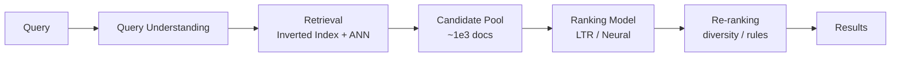
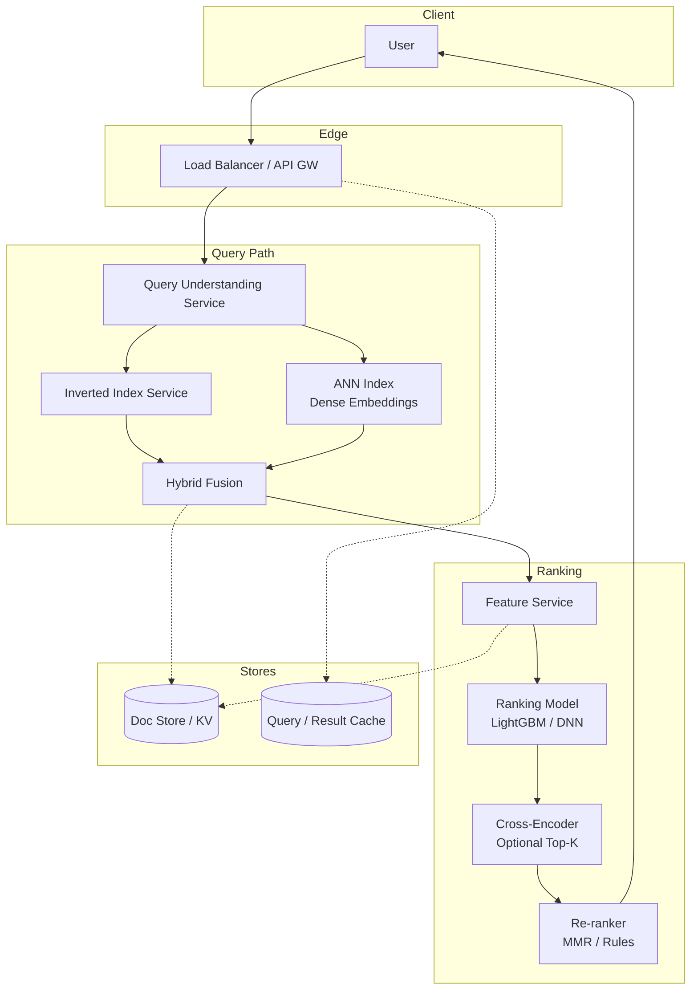
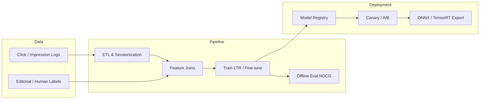
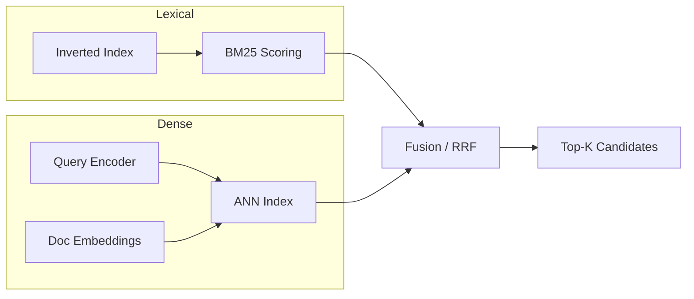
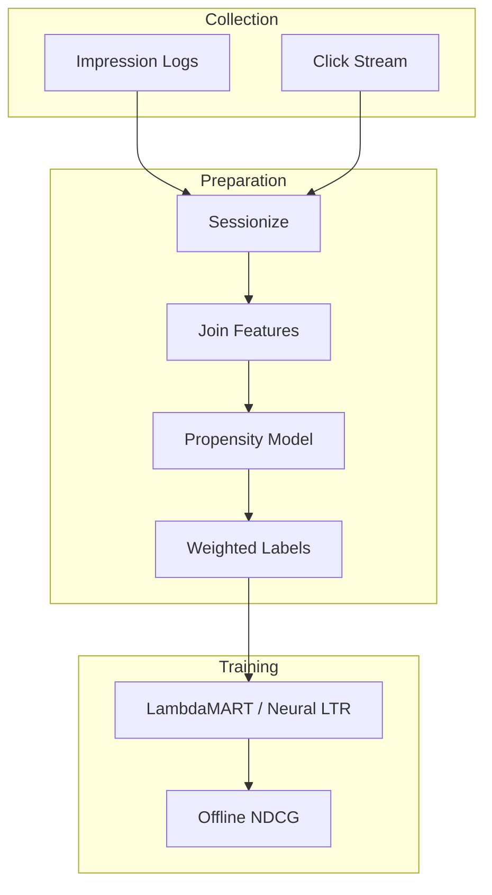
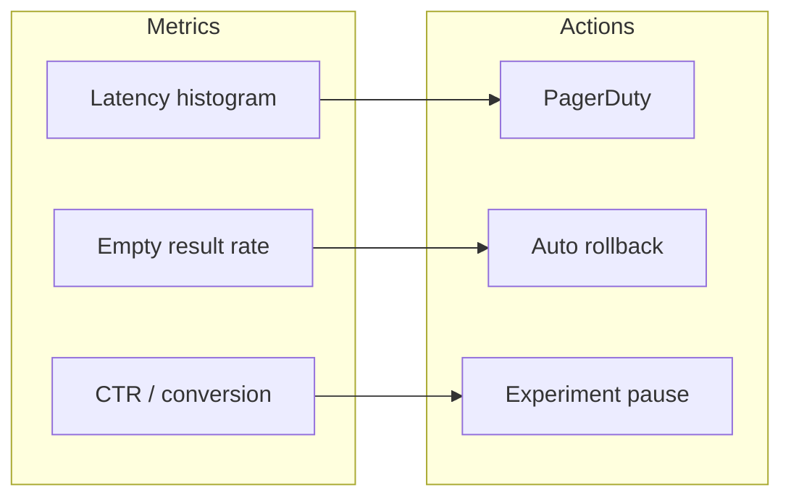
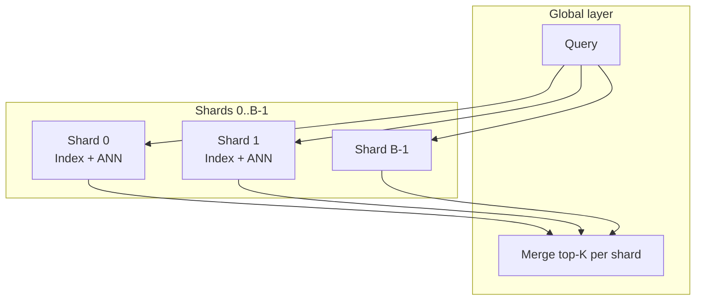

# Design an ML-Powered Search Ranking System

---

## What We're Building

We are designing an **ML-powered search ranking system** in the spirit of web search (Google, Bing) and large-scale product search (Amazon, eBay). The goal is to take a user query and a massive document corpus, retrieve a manageable set of candidates, and **rank** them so the most useful results appear first.

**Real-world scale (order-of-magnitude anchors for interviews):**

| Signal | Approximate scale |
|--------|-------------------|
| **Web search volume** | Google processes on the order of **8.5 billion searches per day** (public estimates vary by year) |
| **E-commerce search** | Industry analysts often cite that a large fraction of e-commerce journeys **start with on-site search**; Amazon has reported that a majority of product views originate from search |
| **Documents indexed** | Billions of web pages; product catalogs in the hundreds of millions per large retailer |

!!! note
    In interviews, cite ranges as **back-of-envelope** anchors, not precise audited figures. The point is **orders of magnitude** and **which bottlenecks** dominate (latency, index size, training data).

### Learning-to-Rank (LTR) Pipeline

Production search is rarely “one model scores everything.” It is typically a **pipeline**:

1. **Query understanding** — normalize, classify, expand, correct spelling.
2. **Retrieval (candidate generation)** — pull thousands of plausible docs cheaply (lexical + dense).
3. **Ranking** — score candidates with LTR or neural models under a latency budget.
4. **Re-ranking** — diversity, freshness, business rules, compliance.

!!! tip
    Saying “we use BERT end-to-end on billions of documents per query” fails the interview. Saying **retrieval → rank → re-rank** with explicit **latency budgets** passes.

---

## ML Concepts Primer

### Information Retrieval Basics

| Metric | Idea | When it matters |
|--------|------|-----------------|
| **Precision** | Fraction of retrieved items that are relevant | Spammy results hurt precision |
| **Recall** | Fraction of relevant items that are retrieved | Missing the right doc hurts recall |
| **Precision@K / Recall@K** | Same, but only top-K | Standard for ranked lists |
| **AP (Average Precision)** | Area under precision-recall curve for a query | Aggregated → **MAP** across queries |
| **MRR** | Mean reciprocal rank of the first relevant result | Great for navigational queries (“facebook login”) |
| **NDCG@K** | Normalized Discounted Cumulative Gain at K | **Gold standard** when multiple relevance levels and position matter |

**DCG** rewards putting highly relevant items high; **IDCG** is the ideal DCG; **NDCG = DCG/IDCG**.

```python
import math
from typing import Iterable, List


def dcg_at_k(relevance_scores: List[float], k: int) -> float:
    """relevance_scores: best-first list of graded relevance (e.g. 0,1,2,3)."""
    return sum(
        (2 ** rel - 1) / math.log2(idx + 2)
        for idx, rel in enumerate(relevance_scores[:k])
    )


def ndcg_at_k(relevance_scores: List[float], ideal_scores: List[float], k: int) -> float:
    ideal_scores = sorted(ideal_scores, reverse=True)
    idcg = dcg_at_k(ideal_scores, k)
    if idcg == 0:
        return 0.0
    return dcg_at_k(relevance_scores, k) / idcg
```

### Learning to Rank

**LTR** learns a scoring function \(f(q, d)\) from labeled or behavioral data.

| Paradigm | What you predict | Examples | Pros / cons |
|----------|------------------|------------|-------------|
| **Pointwise** | Absolute relevance per (query, doc) | Regression on labels | Simple; ignores relative order |
| **Pairwise** | Relative order for pairs (A > B) | **RankNet**, **LambdaRank** | Directly optimizes ranking; pair explosion |
| **Listwise** | Permutation or list distribution | **ListNet**, **LambdaMART** | Models whole list; heavier to train |

**RankNet** uses pairwise cross-entropy on score differences; **LambdaRank** and **LambdaMART** use gradients weighted by **ΔNDCG** (or similar) so mistakes that hurt NDCG more get larger updates — a key production favorite when trees are used.

### Two-Stage Architecture



!!! warning
    **Retrieval** must be sub-linear in corpus size (inverted index, ANN). **Full cross-attention over billions** of docs per query is not feasible — narrow the set first.

---

## Step 1: Requirements Clarification

### Functional Requirements

| Area | Examples |
|------|----------|
| **Query understanding** | Tokenization, language detection, intent |
| **Candidate retrieval** | Lexical (BM25), semantic (embeddings), hybrid |
| **ML-based ranking** | GBDT, neural LTR, cross-encoder re-rank |
| **Personalization** | Safe use of history, session, locale |
| **Spell correction** | “did you mean”, query suggestions |
| **Query expansion** | synonyms, related queries, embeddings |

Clarify **domain**: web search vs e-commerce vs enterprise documents — metrics and abuse (SEO spam) differ.

### Non-Functional Requirements

| NFR | Example target | Notes |
|-----|----------------|-------|
| **Latency** | **P99 &lt; 200ms** end-to-end for search API | Split budget: retrieval vs rank vs re-rank |
| **Throughput** | **~100K QPS** at peak (hypothetical exercise) | Regional load balancing, caching |
| **Corpus** | **Billions** of documents | Sharded index, replication |
| **Availability** | 99.9%+ | Degrade to lexical-only if ML path fails |

!!! note
    Always ask: **SLO per stage** (e.g. retrieval 50ms, ranker 80ms, re-rank 40ms) so you can trade accuracy vs latency explicitly.

### Metrics

**Online (what the business sees):**

| Metric | Role |
|--------|------|
| **CTR** | Clicks / impressions — sensitive to position and UI |
| **Conversion rate** | E-commerce: purchases from search |
| **Time-to-click / dwell time** | Proxy for satisfaction (noisy) |

**Offline (what ML optimizes in lab):**

| Metric | Role |
|--------|------|
| **NDCG@K** | Primary for graded relevance |
| **MAP** | Binary relevance + all ranks |
| **MRR** | First relevant result rank |

!!! tip
    Align offline labels with online goals: clicks are **biased by position** — handle with IPS / propensity models (see §4.5).

---

## Step 2: Back-of-Envelope Estimation

**Assumptions (interview scenario):**

| Quantity | Value |
|----------|--------|
| Queries | **1B / day** → ~**12K QPS** average; **~100K QPS** peak with 8–10× multiplier |
| Documents | **1B** in index (sharded) |
| Retrieval | Return **top 1000** candidates per query |
| Ranker | Score **1000 → 100** (or re-rank top 100 with heavy model) |

**Inference time budget (example):**

If P99 total is 200ms and overhead is 40ms, **160ms** for search path:

| Stage | Budget |
|-------|--------|
| Query understanding + routing | 10–20ms |
| Retrieval (parallel shards) | 40–80ms |
| Feature fetch | 20–40ms |
| GBDT / small NN scoring | 30–60ms |
| Re-rank / rules | 10–20ms |

Cross-encoder on **only top 50–100** is typical; bi-encoder / BM25 over full corpus.

---

## Step 3: High-Level Design

### Online path



### Offline / ML path



!!! note
    **Training-serving skew** is a classic failure mode: log features and serving features must come from the same definitions (feature store, versioned transforms).

---

## Step 4: Deep Dive

### 4.1 Query Understanding

**Goals:** produce a representation suitable for retrieval and ranking: tokens, normalized text, optional structured intent, expanded terms.

| Technique | Purpose |
|-----------|---------|
| **Tokenization** | Language-specific splitting |
| **Stemming / lemmatization** | Reduce inflection (trade: ambiguity) |
| **Stopword removal** | Sometimes skipped for neural retrieval |
| **Query classification** | Navigational vs informational vs transactional |
| **Spell correction** | Edit distance, noisy channel, or seq2seq / small LM |
| **Query expansion** | Synonyms, embedding neighbors, related queries |

!!! tip
    For **navigational** queries, MRR matters; for **informational**, NDCG@10; for **transactional** (shopping), conversion and filters matter.

**Python: minimal query processor sketch**

```python
from __future__ import annotations

import re
import unicodedata
from dataclasses import dataclass, field
from typing import Dict, List, Optional, Set


@dataclass
class QueryContext:
    raw: str
    normalized: str
    tokens: List[str]
    language: str = "en"
    expansions: List[str] = field(default_factory=list)
    intent_hint: Optional[str] = None  # navigational | informational | transactional


class SimpleQueryProcessor:
    """
    Illustrative pipeline — production uses language-specific tokenizers,
    lang-id, and learned classifiers.
    """

    STOPWORDS: Set[str] = {
        "the", "a", "an", "is", "are", "and", "or", "of", "to", "in", "for", "on",
    }

    def __init__(self, synonym_map: Optional[Dict[str, List[str]]] = None) -> None:
        self.synonym_map = synonym_map or {}

    def normalize(self, text: str) -> str:
        text = unicodedata.normalize("NFKC", text)
        text = text.lower().strip()
        text = re.sub(r"\s+", " ", text)
        return text

    def tokenize(self, text: str) -> List[str]:
        return re.findall(r"[a-z0-9]+", text.lower())

    def stem_simple(self, token: str) -> str:
        """Porter-lite illustration: strip common suffixes (not full Porter)."""
        for suf in ("ing", "ed", "es", "s"):
            if len(token) > 4 and token.endswith(suf):
                return token[: -len(suf)]
        return token

    def expand_synonyms(self, tokens: List[str]) -> List[str]:
        out: List[str] = []
        for t in tokens:
            out.extend(self.synonym_map.get(t, []))
        return list(dict.fromkeys(out))  # dedupe, order-preserving

    def classify_intent_heuristic(self, q: str) -> str:
        q = q.lower()
        if any(x in q for x in ["login", "sign in", "official site", "homepage"]):
            return "navigational"
        if any(x in q for x in ["buy", "cheap", "price", "discount", "near me"]):
            return "transactional"
        return "informational"

    def process(self, raw_query: str) -> QueryContext:
        norm = self.normalize(raw_query)
        toks = self.tokenize(norm)
        stemmed = [self.stem_simple(t) for t in toks]
        expansions = self.expand_synonyms(stemmed)
        intent = self.classify_intent_heuristic(norm)
        return QueryContext(
            raw=raw_query,
            normalized=norm,
            tokens=toks,
            expansions=expansions,
            intent_hint=intent,
        )


# Example
if __name__ == "__main__":
    qp = SimpleQueryProcessor(
        synonym_map={"laptop": ["notebook", "ultrabook"], "phone": ["smartphone", "mobile"]}
    )
    ctx = qp.process("Buy cheap laptop near me")
    print(ctx)
```

---

### 4.2 Retrieval / Candidate Generation

**Components:**

| Method | Mechanism | Strength |
|--------|-----------|----------|
| **Inverted index + BM25** | Lexical overlap, length-normalized TF-IDF variant | Exact token match, fast at scale |
| **Dense retrieval (bi-encoder)** | Query/doc embeddings, cosine similarity | Semantic match (“car” ≈ “automobile”) |
| **Hybrid** | Combine scores (linear, RRF, learned fusion) | Best of both worlds |

**ANN** (Approximate Nearest Neighbor): **FAISS**, **ScaNN**, **HNSW** in vector DBs — trade recall vs latency.



!!! warning
    **Embedding staleness**: if the encoder updates, **re-embed** documents on a schedule; version embeddings in the index.

**Python: hybrid retrieval service (illustrative)**

```python
from __future__ import annotations

import heapq
import math
from dataclasses import dataclass
from typing import Dict, Iterable, List, Mapping, Sequence, Tuple


def bm25_score(
    term_freq: int,
    doc_len: int,
    avg_doc_len: float,
    doc_freq: int,
    num_docs: int,
    k1: float = 1.5,
    b: float = 0.75,
) -> float:
    idf = math.log(1 + (num_docs - doc_freq + 0.5) / (doc_freq + 0.5))
    norm = term_freq * (k1 + 1) / (
        term_freq + k1 * (1 - b + b * doc_len / avg_doc_len)
    )
    return idf * norm


@dataclass
class LexicalHit:
    doc_id: str
    score: float


class MiniInvertedIndex:
    """Tiny in-memory inverted index for demonstration."""

    def __init__(self, docs: Mapping[str, str]) -> None:
        self.docs = dict(docs)
        self.doc_lens: Dict[str, int] = {}
        self.postings: Dict[str, Dict[str, int]] = {}
        self.N = len(docs)
        self.avg_len = 0.0
        total_len = 0
        for did, text in docs.items():
            terms = text.lower().split()
            self.doc_lens[did] = len(terms)
            total_len += len(terms)
            tf: Dict[str, int] = {}
            for t in terms:
                tf[t] = tf.get(t, 0) + 1
            for t, c in tf.items():
                self.postings.setdefault(t, {})[did] = c
        if self.N:
            self.avg_len = total_len / self.N

    def bm25_topk(self, query_terms: Sequence[str], k: int) -> List[LexicalHit]:
        scores: Dict[str, float] = {}
        for t in query_terms:
            posting = self.postings.get(t)
            if not posting:
                continue
            df = len(posting)
            for did, tf in posting.items():
                s = bm25_score(
                    tf, self.doc_lens[did], self.avg_len, df, self.N
                )
                scores[did] = scores.get(did, 0.0) + s
        top = heapq.nlargest(k, scores.items(), key=lambda x: x[1])
        return [LexicalHit(doc_id=d, score=s) for d, s in top]


class FakeEmbeddingBackend:
    """Placeholder: replace with sentence-transformers / internal encoder."""

    def embed(self, texts: Sequence[str]) -> List[List[float]]:
        # Deterministic fake vectors for demo only
        out: List[List[float]] = []
        for t in texts:
            seed = sum(ord(c) for c in t) % 997
            vec = [math.sin(seed + i) for i in range(8)]
            norm = math.sqrt(sum(x * x for x in vec)) or 1.0
            out.append([x / norm for x in vec])
        return out


def cosine_sim(a: Sequence[float], b: Sequence[float]) -> float:
    return sum(x * y for x, y in zip(a, b))


class DenseRetriever:
    def __init__(self, doc_ids: Sequence[str], doc_texts: Sequence[str], backend: FakeEmbeddingBackend) -> None:
        self.doc_ids = list(doc_ids)
        self.backend = backend
        self.doc_emb = backend.embed(list(doc_texts))

    def topk(self, query: str, k: int) -> List[Tuple[str, float]]:
        qv = self.backend.embed([query])[0]
        sims = [(self.doc_ids[i], cosine_sim(qv, self.doc_emb[i])) for i in range(len(self.doc_ids))]
        sims.sort(key=lambda x: x[1], reverse=True)
        return sims[:k]


def reciprocal_rank_fusion(
    ranked_lists: List[List[Tuple[str, float]]],
    k: int = 60,
) -> List[Tuple[str, float]]:
    """RRF: robust fusion without score calibration."""
    scores: Dict[str, float] = {}
    for rlist in ranked_lists:
        for rank, (doc_id, _) in enumerate(rlist, start=1):
            scores[doc_id] = scores.get(doc_id, 0.0) + 1.0 / (k + rank)
    return sorted(scores.items(), key=lambda x: x[1], reverse=True)


class HybridRetrievalService:
    def __init__(self, docs: Mapping[str, str]) -> None:
        self.lex = MiniInvertedIndex(docs)
        self.dense = DenseRetriever(list(docs.keys()), list(docs.values()), FakeEmbeddingBackend())

    def retrieve(self, query: str, k_lex: int = 20, k_den: int = 20, k_out: int = 30) -> List[str]:
        terms = query.lower().split()
        lex_hits = self.lex.bm25_topk(terms, k_lex)
        lex_ranked = [(h.doc_id, h.score) for h in lex_hits]
        den_ranked = self.dense.topk(query, k_den)
        fused = reciprocal_rank_fusion([lex_ranked, den_ranked])
        return [d for d, _ in fused[:k_out]]
```

---

### 4.3 Feature Engineering

| Category | Examples | Notes |
|----------|----------|-------|
| **Query** | length, term count, embedding, intent | Short queries are ambiguous |
| **Document** | PageRank, quality, freshness, popularity | Watch spam signals |
| **Query–doc** | BM25, cosine similarity, clicks, dwell | Core LTR features |
| **User** | history, locale, safe personalization | Privacy & consent |

**Example feature set (illustrative):**

| Feature name | Type | Description |
|--------------|------|-------------|
| `q_len` | int | Query token count |
| `bm25` | float | Lexical relevance |
| `dense_cosine` | float | Bi-encoder similarity |
| `doc_pagerank` | float | Static authority (if web) |
| `doc_age_hours` | float | Freshness |
| `ctr_smoothed` | float | Historical CTR for (query cluster, doc) |
| `user_country` | cat | For regional ranking |

```python
from __future__ import annotations

from dataclasses import dataclass
from typing import Any, Dict, Optional


@dataclass
class QueryDocPair:
    query_id: str
    doc_id: str
    query_text: str
    raw: Dict[str, Any]


class SearchFeatureExtractor:
    """
    Production systems batch-compute with Flink/Beam and serve via feature store.
    """

    def __init__(self, doc_static: Dict[str, Dict[str, Any]]) -> None:
        self.doc_static = doc_static

    def extract(self, pair: QueryDocPair, bm25: float, dense_sim: float) -> Dict[str, float]:
        ds = self.doc_static.get(pair.doc_id, {})
        q_tokens = pair.query_text.split()
        feats = {
            "log_q_len": float(__import__("math").log1p(len(q_tokens))),
            "bm25": bm25,
            "dense_cosine": dense_sim,
            "log_pagerank": float(__import__("math").log1p(ds.get("pagerank", 0.0))),
            "freshness_exp": __import__("math").exp(-ds.get("age_hours", 0.0) / 168.0),
            "ctr_smoothed": ds.get("ctr", 0.05),
        }
        return feats


def vectorize(feats: Dict[str, float], schema: list[str]) -> list[float]:
    return [feats.get(name, 0.0) for name in schema]
```

---

### 4.4 Ranking Model

| Model | Typical role | Notes |
|-------|--------------|-------|
| **LambdaMART** (GBDT) | Main ranker on 100–1000s of features | Industry workhorse; fast on CPU |
| **Neural LTR** | Replace or augment trees | Needs more data & infra |
| **Cross-encoder (BERT)** | Re-rank top 50–100 | Expensive; best relevance |

**Architecture comparison:**

| Aspect | LambdaMART | Two-tower + dot | Cross-encoder |
|--------|--------------|-----------------|---------------|
| Train cost | Moderate | Moderate–high | High |
| Serving cost | Low per doc | Low retrieval | High (pairs) |
| Cold start | Feature-driven | Embedding-driven | Needs fine-tune |

**Python: LambdaMART with LightGBM (ranking objective)**

```python
from __future__ import annotations

import numpy as np
import lightgbm as lgb

# X: (n_samples, n_features), y: relevance grades, qg: query group sizes


def train_lambdamart(
    X: np.ndarray,
    y: np.ndarray,
    query_group: np.ndarray,
    val_X: np.ndarray | None = None,
    val_y: np.ndarray | None = None,
    val_group: np.ndarray | None = None,
) -> lgb.Booster:
    train_set = lgb.Dataset(X, label=y, group=query_group)
    valid_sets: list[tuple[lgb.Dataset, str]] = []
    params = {
        "objective": "lambdarank",
        "metric": "ndcg",
        "ndcg_eval_at": [5, 10],
        "num_leaves": 64,
        "learning_rate": 0.05,
        "feature_fraction": 0.8,
        "min_data_in_leaf": 50,
        "verbosity": -1,
    }
    if val_X is not None and val_y is not None and val_group is not None:
        valid = lgb.Dataset(val_X, label=val_y, group=val_group, reference=train_set)
        valid_sets.append((valid, "val"))
    model = lgb.train(
        params,
        train_set,
        num_boost_round=500,
        valid_sets=[train_set] + [vs[0] for vs in valid_sets],
        valid_names=["train"] + [vs[1] for vs in valid_sets],
        callbacks=[lgb.early_stopping(50)] if valid_sets else [],
    )
    return model
```

**Python: BERT cross-encoder re-ranker (Hugging Face)**

```python
from __future__ import annotations

from typing import List, Tuple

import torch
from transformers import AutoModelForSequenceClassification, AutoTokenizer


class CrossEncoderReranker:
    """
    Scores pairs (query, title) — use only on top-K candidates.
    """

    def __init__(self, model_name: str = "cross-encoder/ms-marco-MiniLM-L-6-v2") -> None:
        self.tok = AutoTokenizer.from_pretrained(model_name)
        self.model = AutoModelForSequenceClassification.from_pretrained(model_name)
        self.model.eval()

    @torch.no_grad()
    def score_pairs(self, pairs: List[Tuple[str, str]], batch_size: int = 16) -> List[float]:
        scores: List[float] = []
        for i in range(0, len(pairs), batch_size):
            batch = pairs[i : i + batch_size]
            enc = self.tok(
                [p[0] for p in batch],
                [p[1] for p in batch],
                padding=True,
                truncation=True,
                max_length=256,
                return_tensors="pt",
            )
            logits = self.model(**enc).logits.squeeze(-1)
            scores.extend(logits.cpu().tolist())
        return scores
```

---

### 4.5 Training Pipeline

**Issues:**

| Issue | Mitigation |
|-------|------------|
| **Position bias** | IPS, propensity models, unbiased LTR papers |
| **Sparse labels** | Semi-supervised, editorial labels |
| **Train/serve skew** | Feature store, versioning |

**Inverse Propensity Weighting (sketch):**

\[
w_i = \frac{1}{p(\text{click} \mid \text{shown at position } i)}
\]

Use logged propensities or a position model to debias.



**Python: pairwise-style dataset + IPW weights (illustrative)**

```python
from __future__ import annotations

import math
import random
from dataclasses import dataclass
from typing import Iterable, List, Tuple


@dataclass
class Impression:
    query_id: str
    doc_id: str
    position: int
    clicked: bool


def estimate_propensity_positions(clicks: List[Impression], num_slots: int = 10) -> List[float]:
    """Simple global position CTR → propensity proxy (demo)."""
    pos_clicks = [0] * num_slots
    pos_imp = [0] * num_slots
    for im in clicks:
        if im.position < num_slots:
            pos_imp[im.position] += 1
            if im.clicked:
                pos_clicks[im.position] += 1
    return [(pos_clicks[i] / pos_imp[i]) if pos_imp[i] else 0.01 for i in range(num_slots)]


def ipw_weight(clicked: bool, position: int, propensity: List[float]) -> float:
    p = propensity[position] if position < len(propensity) else propensity[-1]
    p = max(p, 1e-6)
    return (1.0 / p) if clicked else 0.0


def build_training_rows(
    impressions: Iterable[Impression],
) -> List[Tuple[str, str, float]]:
    imps = list(impressions)
    prop = estimate_propensity_positions(imps)
    rows: List[Tuple[str, str, float]] = []
    for im in imps:
        w = ipw_weight(im.clicked, im.position, prop)
        if w > 0:
            rows.append((im.query_id, im.doc_id, w))
    return rows
```

**Online evaluation:** A/B tests, **interleaving** (compare two rankers cheaply).

---

### 4.6 Serving Architecture

| Pattern | When |
|---------|------|
| **Two-stage** | Always at scale: cheap retrieval + stronger ranker |
| **ONNX / TensorRT** | Low-latency neural models |
| **Batch scoring** | Offline precompute popular head queries |
| **Caching** | Exact query + regional caches |

```python
from __future__ import annotations

import hashlib
import time
from dataclasses import dataclass
from typing import Callable, Dict, List, Protocol, Sequence, Tuple


class RankerFn(Protocol):
    def __call__(self, query: str, doc_ids: Sequence[str], feats: Dict[str, Dict[str, float]]) -> List[float]: ...


@dataclass
class ServingPipeline:
    retrieve: Callable[[str], List[str]]
    feature_fn: Callable[[str, Sequence[str]], Dict[str, Dict[str, float]]]
    ranker: RankerFn
    cache: Dict[str, Tuple[float, List[str]]]
    ttl_sec: float = 60.0

    def _cache_key(self, q: str) -> str:
        return hashlib.sha256(q.encode("utf-8")).hexdigest()

    def search(self, query: str) -> List[Tuple[str, float]]:
        key = self._cache_key(query)
        now = time.time()
        if key in self.cache:
            ts, docs = self.cache[key]
            if now - ts < self.ttl_sec:
                return [(d, 1.0) for d in docs]  # scores omitted in cache hit path
        cand = self.retrieve(query)
        feats = self.feature_fn(query, cand)
        scores = self.ranker(query, cand, feats)
        ranked = sorted(zip(cand, scores), key=lambda x: x[1], reverse=True)
        self.cache[key] = (now, [d for d, _ in ranked[:10]])
        return ranked
```

---

### 4.7 Personalization

| Technique | Idea |
|-----------|------|
| **User embedding** | From recent searches/clicks (aggregate, differential privacy) |
| **Session features** | Short window for intent drift |
| **Privacy** | On-device signals, aggregation, opt-in |
| **Cold start** | Fall back to non-personalized ranking + popular |

**Trade-offs**

| Approach | Upside | Downside |
|----------|--------|----------|
| **History-based embeddings** | Strong intent for repeat users | Privacy reviews, storage |
| **Segment-based** (cohort features) | Cheaper, more stable | Weaker than 1:1 |
| **On-device ranking hints** | Privacy-friendly | Limited signals |

!!! warning
    Personalization can **filter bubble** or **amplify** sensitive attributes. Interviewers like hearing about **opt-in**, **aggregation**, and **evaluation for fairness** (e.g., slice metrics by region or new vs returning users).

**Python: lightweight user profile + session features**

```python
from __future__ import annotations

from collections import deque
from dataclasses import dataclass, field
from typing import Deque, Dict, List, Optional, Sequence


@dataclass
class UserEvent:
    query: str
    doc_id: str
    ts_ms: int


@dataclass
class UserProfile:
    user_id: str
    recent_queries: Deque[str] = field(default_factory=lambda: deque(maxlen=50))
    recent_doc_clicks: Deque[str] = field(default_factory=lambda: deque(maxlen=200))
    embedding: Optional[List[float]] = None  # filled by your training stack


class UserProfileBuilder:
    """Maintain rolling history for personalization features (simplified)."""

    def __init__(self, max_session_gap_ms: int = 30 * 60 * 1000) -> None:
        self._profiles: Dict[str, UserProfile] = {}
        self._max_gap = max_session_gap_ms

    def _get(self, uid: str) -> UserProfile:
        if uid not in self._profiles:
            self._profiles[uid] = UserProfile(user_id=uid)
        return self._profiles[uid]

    def record_click(self, uid: str, event: UserEvent) -> None:
        p = self._get(uid)
        p.recent_queries.append(event.query)
        p.recent_doc_clicks.append(event.doc_id)

    def session_features(self, uid: str, now_ms: int, events: Sequence[UserEvent]) -> Dict[str, float]:
        """Very small session window: count queries in session, repeat-query rate."""
        if not events:
            return {"sess_q_count": 0.0, "repeat_query": 0.0}
        session_start = events[0].ts_ms
        in_sess = [e for e in events if now_ms - e.ts_ms <= self._max_gap and e.ts_ms >= session_start]
        queries = [e.query for e in in_sess]
        repeat = 1.0 if len(queries) >= 2 and queries[-1] in queries[:-1] else 0.0
        return {"sess_q_count": float(len(in_sess)), "repeat_query": repeat}

    def cold_start_fallback(self, uid: str) -> bool:
        p = self._get(uid)
        return len(p.recent_doc_clicks) == 0
```

---

### 4.8 Result Diversity & Freshness

| Technique | Purpose |
|-----------|---------|
| **MMR** | Balance relevance vs novelty: \(\text{MMR} = \arg\max [\lambda \text{Sim}(q,d) - (1-\lambda)\max_{d'\in S}\text{Sim}(d,d')]\) |
| **Deduplication** | Near-duplicate detection (SimHash, embeddings) |
| **Freshness boost** | Time-decay for news |
| **Business rules** | Legal, inventory, brand safety |

**Maximum Marginal Relevance (MMR)** iteratively builds a result set: at each step pick the candidate that maximizes a combination of relevance to the query and **diversity** from already selected docs.

!!! note
    E-commerce often **forces diversity of brands**; news search **boosts recency**. State the **product policy** explicitly in interviews.

**Python: MMR + freshness + dedup helpers**

```python
from __future__ import annotations

import hashlib
import math
from typing import Dict, List, Sequence, Set, Tuple


def cosine_vec(a: Sequence[float], b: Sequence[float]) -> float:
    num = sum(x * y for x, y in zip(a, b))
    da = math.sqrt(sum(x * x for x in a))
    db = math.sqrt(sum(x * x for x in b))
    return num / (da * db) if da and db else 0.0


def mmr(
    _query_vec: Sequence[float],
    doc_vecs: Dict[str, Sequence[float]],
    relevance: Dict[str, float],
    k: int,
    lambda_param: float = 0.7,
) -> List[str]:
    """
    Greedy MMR using provided relevance scores (e.g., from ranker) and embeddings for diversity.
    lambda_param: 1 -> pure relevance, 0 -> pure diversity (not usually used alone).
    """
    selected: List[str] = []
    candidates: Set[str] = set(doc_vecs.keys())
    while len(selected) < k and candidates:
        best_id = None
        best_score = -1e9
        for did in list(candidates):
            rel = relevance.get(did, 0.0)
            if not selected:
                marginal = lambda_param * rel
            else:
                max_sim = max(
                    cosine_vec(doc_vecs[did], doc_vecs[s]) for s in selected
                )
                marginal = lambda_param * rel - (1.0 - lambda_param) * max_sim
            if marginal > best_score:
                best_score = marginal
                best_id = did
        assert best_id is not None
        selected.append(best_id)
        candidates.remove(best_id)
    return selected


def simhash_64(text: str, num_bits: int = 64) -> int:
    """Toy SimHash for near-dup detection — replace with production tokenizer."""
    tokens = text.lower().split()
    if not tokens:
        return 0
    acc = [0] * num_bits
    for tok in tokens:
        h = int(hashlib.md5(tok.encode("utf-8")).hexdigest(), 16)
        for i in range(num_bits):
            bit = 1 if (h >> i) & 1 else -1
            acc[i] += bit
    out = 0
    for i in range(num_bits):
        if acc[i] > 0:
            out |= 1 << i
    return out


def hamming(a: int, b: int) -> int:
    return (a ^ b).bit_count()


def freshness_multiplier(age_hours: float, half_life_hours: float = 24.0) -> float:
    """Exponential decay — tune half_life by vertical (news vs evergreen)."""
    return math.exp(-math.log(2) * age_hours / half_life_hours)


def combined_score(
    base_score: float,
    doc_embedding: Sequence[float],
    query_embedding: Sequence[float],
    age_hours: float,
    vertical: str = "web",
) -> float:
    sim = cosine_vec(query_embedding, doc_embedding)
    half = 6.0 if vertical == "news" else 720.0
    fresh = freshness_multiplier(age_hours, half_life_hours=half)
    return base_score * (0.6 + 0.4 * sim) * (0.5 + 0.5 * fresh)
```

---

### 4.9 Monitoring & Iteration

| Layer | What to watch |
|-------|----------------|
| **Dashboards** | CTR, NDCG proxy, latency P99, error rate |
| **Drift** | Query distribution, feature null rate |
| **Debugging** | Query-level trace: retrieval → features → scores |
| **Feedback** | Re-training loop with guardrails |

**Operational SLOs (example)**

| SLO | Target | Burn alert |
|-----|--------|------------|
| Search P99 latency | &lt; 200ms | 5 min window |
| Retrieval empty rate | &lt; 0.1% | Page |
| Ranker error rate | &lt; 0.01% | Ticket |



**Python: simple query-level debug record (for tooling)**

```python
from __future__ import annotations

import hashlib
import json
from dataclasses import asdict, dataclass
from typing import Any, Dict, List, Optional, Tuple


@dataclass
class SearchTrace:
    query: str
    trace_id: str
    retrieval: List[Dict[str, Any]]
    features_sample: Dict[str, Dict[str, float]]
    scores: Dict[str, float]
    final_order: List[str]
    latency_ms: float


class TraceLogger:
    def __init__(self, sink: Optional[List[str]] = None) -> None:
        self._sink = sink or []

    def emit(self, trace: SearchTrace) -> None:
        line = json.dumps(asdict(trace))
        self._sink.append(line)


def ab_bucket(user_id: str, num_buckets: int = 100) -> int:
    h = int(hashlib.md5(user_id.encode("utf-8")).hexdigest(), 16)
    return h % num_buckets


def assign_experiment(user_id: str, exp_ranges: Dict[str, Tuple[int, int]]) -> Optional[str]:
    """exp_ranges maps experiment name -> (low, high) inclusive bucket range."""
    b = ab_bucket(user_id)
    for name, (lo, hi) in exp_ranges.items():
        if lo <= b <= hi:
            return name
    return None
```

!!! tip
    Store **trace_id** with every request; join to **click logs** later for offline replay and counterfactual analysis (with care for privacy).

---

## Step 5: Scaling & Production

### Scaling

| Dimension | Approach |
|-----------|----------|
| **Index** | Sharding by doc id; replicas per region |
| **Serving** | Horizontal ranker pools; GPU for neural re-rank only |
| **Geo** | Route to nearest DC; edge caching for static |

**Sharding sketch:** with \(B\) shards, doc id `d` routes to shard `hash(d) mod B`. Each shard holds an inverted index **subset** and an ANN partition. Queries fan out to **all shards** (for global recall), merge by score, then take global top-K — this is expensive at scale; optimizations include **query routing** (only shards likely to contain relevant docs) and **tiered** retrieval.



!!! note
    **Real systems** often combine **shard-local** candidate generation with a **central** re-ranker, or use **two-phase** query processing (e.g., Block-Max indexes) to reduce work — name the idea even if you skip details.

### Model serving cluster

| Resource | Typical use |
|----------|-------------|
| **CPU pool** | GBDT inference, lightweight preprocessing |
| **GPU pool** | Cross-encoder batches, embedding servers |
| **Shared embedding cache** | Hot document vectors |

### Failure Handling

| Failure | Degradation |
|---------|-------------|
| ANN timeout | Lexical-only retrieval |
| Feature store slow | Default feature values + alert |
| New model bad | **Rollback** from registry; traffic switch |
| Regional outage | Failover to healthy region; stale index acceptable short-term |

### Graceful degradation

```python
from __future__ import annotations

from dataclasses import dataclass
from typing import Callable, List, Sequence


@dataclass
class ResilientSearch:
    lexical: Callable[[str], List[str]]
    dense: Callable[[str], List[str]]
    rank: Callable[[str, Sequence[str]], List[str]]

    def search(self, query: str) -> List[str]:
        """If dense retrieval fails (timeout, circuit open), fall back to lexical-only."""
        try:
            c_dense = self.dense(query)
        except Exception:
            c_dense = []
        c_lex = self.lexical(query)
        merged = list(dict.fromkeys(c_dense + c_lex))
        return self.rank(query, merged)
```

!!! warning
    Production code uses **timeouts**, **circuit breakers**, and **async** RPCs — not bare `except`. This pattern illustrates **fallback ordering** only.

---

## Appendix: Offline metrics (MAP, MRR, batch NDCG)

```python
from __future__ import annotations

from typing import Dict, Iterable, List, Sequence


def average_precision(ranked: Sequence[str], relevant: set[str]) -> float:
    hits = 0
    precisions: List[float] = []
    for i, doc in enumerate(ranked, start=1):
        if doc in relevant:
            hits += 1
            precisions.append(hits / i)
    if not precisions:
        return 0.0
    return sum(precisions) / max(1, len(relevant))


def mean_average_precision(queries: Dict[str, tuple[Sequence[str], set[str]]]) -> float:
    aps: List[float] = []
    for _, (ranked, rel) in queries.items():
        aps.append(average_precision(ranked, rel))
    return sum(aps) / len(aps) if aps else 0.0


def reciprocal_rank(ranked: Sequence[str], relevant: set[str]) -> float:
    for i, doc in enumerate(ranked, start=1):
        if doc in relevant:
            return 1.0 / i
    return 0.0


def mean_reciprocal_rank(queries: Dict[str, tuple[Sequence[str], set[str]]]) -> float:
    rrs = [reciprocal_rank(r, rel) for _, (r, rel) in queries.items()]
    return sum(rrs) / len(rrs) if rrs else 0.0


def ndcg_at_k(ranked: Sequence[str], relevance: Dict[str, int], k: int) -> float:
    import math

    def dcg(items: Sequence[str]) -> float:
        s = 0.0
        for idx, doc in enumerate(items[:k]):
            rel = relevance.get(doc, 0)
            s += (2 ** rel - 1) / math.log2(idx + 2)
        return s

    d = dcg(ranked)
    ideal = sorted(relevance.values(), reverse=True)
    ideal_scores = []
    # map ideal rel back to hypothetical doc order — simplified: use rel grades only
    for i in range(k):
        rel = ideal[i] if i < len(ideal) else 0
        ideal_scores.append(rel)
    idcg = sum((2 ** rel - 1) / math.log2(i + 2) for i, rel in enumerate(ideal_scores[:k]))
    return (d / idcg) if idcg > 0 else 0.0
```

---

## Appendix: Spell correction (edit distance + lexicon)

```python
from __future__ import annotations

from typing import Dict, List, Set


def levenshtein(a: str, b: str) -> int:
    """Classic DP edit distance — O(len(a)*len(b))."""
    n, m = len(a), len(b)
    dp = [[0] * (m + 1) for _ in range(n + 1)]
    for i in range(n + 1):
        dp[i][0] = i
    for j in range(m + 1):
        dp[0][j] = j
    for i in range(1, n + 1):
        for j in range(1, m + 1):
            cost = 0 if a[i - 1] == b[j - 1] else 1
            dp[i][j] = min(
                dp[i - 1][j] + 1,
                dp[i][j - 1] + 1,
                dp[i - 1][j - 1] + cost,
            )
    return dp[n][m]


def suggest_correction(token: str, lexicon: Set[str], max_dist: int = 2) -> str | None:
    best: str | None = None
    best_d = max_dist + 1
    for w in lexicon:
        if abs(len(w) - len(token)) > max_dist:
            continue
        d = levenshtein(token, w)
        if best is None or d < best_d or (d == best_d and w < best):
            best_d = d
            best = w
    return best if best is not None and best_d <= max_dist else None
```

---

## Appendix: Click logs → pairwise training rows

```python
from __future__ import annotations

from dataclasses import dataclass
from typing import List, Tuple


@dataclass
class QueryImpressionBlock:
    query_id: str
    doc_ids_in_order: List[str]
    clicked_doc: str | None


def pairwise_preferences(blocks: List[QueryImpressionBlock]) -> List[Tuple[str, str, str]]:
    """
    For each query, clicked doc beats unclicked docs shown above (position bias caveat!).
    Returns (query_id, better_doc, worse_doc).
    """
    pairs: List[Tuple[str, str, str]] = []
    for b in blocks:
        if not b.clicked_doc:
            continue
        try:
            click_pos = b.doc_ids_in_order.index(b.clicked_doc)
        except ValueError:
            continue
        for j in range(click_pos):
            worse = b.doc_ids_in_order[j]
            pairs.append((b.query_id, b.clicked_doc, worse))
    return pairs
```

---

## Real-world references (for depth)

| Topic | Pointer |
|-------|---------|
| Learning to rank | Burges, **From RankNet to LambdaRank to LambdaMART** (Microsoft technical report) |
| BM25 | Robertson & Zaragoza, **The Probabilistic Relevance Framework** |
| Dense retrieval | Reimers & Gurevych, **Sentence-BERT** |
| ANN | Malkov & Yashunin, **HNSW**; Johnson et al., **Faiss** |
| Position bias | Joachims et al., **Unbiased learning-to-rank** (propensity / IPS) |
| Production patterns | Google **WDM**-style stack is proprietary — discuss **generic** two-stage + re-rank |

!!! note
    Interview answers should emphasize **architecture and measurement**, not proprietary names you cannot explain.

---

## Interview Tips

1. **Start with requirements and metrics** — business goal + NDCG/CTR alignment.
2. **Draw retrieval → rank → re-rank** and assign **latency budgets**.
3. **Discuss position bias** and how you validate (offline + online).
4. **Mention diversity** and **freshness** so you sound production-aware.
5. **Trade-offs:** GBDT vs neural vs cross-encoder — cost vs quality.
6. **Name failure modes:** index lag, embedding version skew, feature nulls.
7. **Close with iteration:** how you ship models (canary, shadow traffic).

!!! tip
    Practice one **numerical estimate** (QPS, index size, candidates per stage) and one **failure mode** (degraded lexical search) in every mock.

!!! warning
    Avoid claiming you “solved search” with a single transformer — interviewers probe **latency**, **bias**, and **data**.

---

_Last updated: comprehensive ML search ranking guide for system design interviews._
