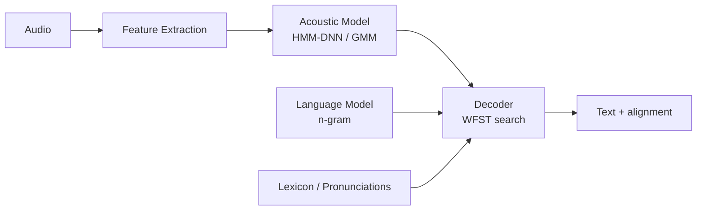
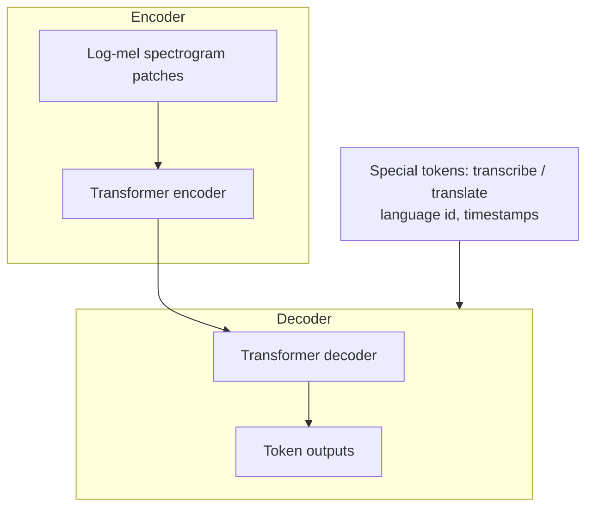
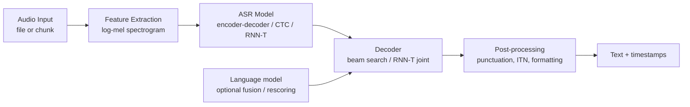
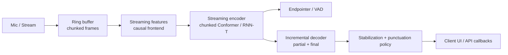
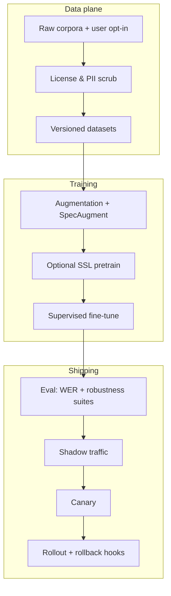

# Design a Speech Recognition System (ASR)

---

## What We're Building

We are designing an **automatic speech recognition (ASR)** platform comparable in spirit to **Google Cloud Speech-to-Text**, **OpenAI Whisper**, **Amazon Transcribe**, or **Azure Speech**. The system converts **spoken audio** into **text** for **real-time streaming** (voice assistants, live captions, dictation) and **batch** workloads (call-center analytics, media transcription, legal discovery). It should support **100+ languages**, robustness to **noise and accents**, optional **speaker diarization** (“who spoke when”), **keyword spotting**, and **rich post-processing** (punctuation, capitalization, formatting).

| Capability | User-visible outcome |
|------------|----------------------|
| **Streaming ASR** | Partial transcripts appear as the user speaks; final text stabilizes after pauses |
| **Batch ASR** | Hours of audio transcribed offline with high accuracy and timestamps |
| **Multilingual** | Same API routes audio to the right language model or detects language automatically |
| **Production quality** | Low word error rate (WER), stable latency, high availability |

### Real-World Scale (Illustrative)

| Signal | Order of magnitude | Why it shapes design |
|--------|--------------------|----------------------|
| **Google Assistant reach** | **500M+** users on devices (historical public figures vary by year) | Massive **tail latency** sensitivity; **caching** and **routing** matter globally |
| **Voice query volume (Assistant-class)** | **Billions** of voice queries per day (ecosystem-scale) | Requires **multi-region** serving, **autoscaling**, **degraded modes** |
| **Whisper training data (OpenAI)** | **680k hours** of weakly supervised web data | Demonstrates **scale of pretraining** + **multitask** learning for robustness |
| **Enterprise transcription** | **Petabytes/year** of call audio in large contact centers | Drives **batch pipelines**, **cost per hour**, **compliance** (retention, encryption) |

!!! note
    Interview framing: separate **research accuracy** (WER on benchmarks) from **product metrics** (task success rate, user edits per minute, caption lag). Production ASR is a **systems + ML** problem.

### Why Speech Recognition Is Hard

1. **Ambiguity:** Acoustics underdetermine words (“ice cream” vs “I scream”); **language models** resolve ambiguity.
2. **Variability:** Speaker age, accent, microphone, codec, and room acoustics shift the **feature distribution**.
3. **Alignment:** Audio is a **continuous** signal; text is **discrete**. Models must solve **time-to-text alignment** (HMM, CTC, attention, RNN-T).
4. **Streaming constraint:** Future audio is unknown—you cannot “look ahead” indefinitely without violating latency budgets.
5. **Long tail:** Rare names, entities, and code-switching break naive LMs unless you add **contextual biasing** and **personalization**.

---

## ML Concepts Primer

This section goes deeper than a typical “ML 101” because ASR interviews often probe **features**, **decoders**, and **streaming trade-offs**.

### Audio Features: From Waveform to Mel Spectrograms, MFCCs, and Filterbanks

**Raw waveform** \(x[n]\) is sampled at rates such as **8 kHz** (telephony narrowband), **16 kHz** (common for ASR), or **48 kHz** (broadcast). Most neural ASR models do **not** consume raw samples directly; they use **time-frequency representations**.

| Representation | What it captures | Typical use in ASR |
|----------------|------------------|---------------------|
| **Short-time Fourier transform (STFT)** | Magnitude vs frequency over time | Baseline spectrogram |
| **Mel spectrogram** | Perceptually warped frequency axis (mel scale) | **Dominant** input to transformers/CNNs |
| **Log-mel filterbanks** | Log compression + mel filters | Stable dynamic range for deep nets |
| **MFCCs** | DCT-compressed cepstral features | Legacy pipelines; still seen in classical systems |

**Mel scaling** approximates human hearing sensitivity—more resolution at low frequencies. **Log compression** reduces loudness variation.

!!! tip
    In interviews, say: “We use **25–80 ms windows**, **10 ms hop**, **40–128 mel bins**, and **per-utterance CMVN** or **global stats** depending on deployment.”

### Traditional ASR Pipeline: Acoustic Model → Language Model → Decoder

Classical systems decomposed the problem:



| Component | Role |
|-----------|------|
| **Acoustic model (AM)** | \(P(\text{acoustics} \mid \text{hidden states})\) often via **HMM** state tying |
| **Lexicon** | Maps words to phone sequences |
| **Language model (LM)** | Prior over word sequences \(P(w_1,\dots,w_n)\) |
| **Decoder** | **Weighted finite-state transducers (WFST)** compose AM+LM efficiently |

**Why it mattered:** Decoupled training; strong **WFST** tooling; excellent **CPU** decoding for small footprints.

### End-to-End Models: HMM/CTC/Attention

Modern ASR often uses a **single neural network** with a differentiable alignment mechanism:

| Paradigm | Alignment mechanism | Strengths | Weaknesses |
|----------|----------------------|-----------|------------|
| **CTC** | Blank symbol; dynamic programming alignment | Stable training; streaming variants exist | “Peakiness”; needs LM for best WER |
| **Attention encoder-decoder** | Cross-attention aligns frames to tokens | Great accuracy on long-form | **Non-streaming** unless heavily modified |
| **RNN-T (transducer)** | Predict next label given audio prefix + label history | Natural streaming; **label-loop** | Training complexity; latency tuning |

!!! warning
    **Attention** models can “cheat” with future frames—great for Whisper-style offline ASR, problematic for **true** low-latency streaming unless you constrain attention or switch architectures.

### Whisper Architecture (Representative)

Whisper is an **encoder-decoder Transformer** trained on **weakly supervised** web-scale audio with **multitask** objectives:



**Multitask training** includes:

- **Transcription** in many languages
- **Translation** to English (for some checkpoints)
- **Timestamp prediction** (segment-level)
- **Voice activity** / **no-speech** behavior via conditioning

This multitask setup improves **robustness** and **generalization** compared to narrow single-task training.

### Streaming vs Non-Streaming

| Mode | Definition | Key constraints |
|------|------------|-----------------|
| **Offline / batch** | Entire utterance or file available | Can use **full-context attention**, large beams, rescoring |
| **Streaming** | Emit partial hypotheses as audio arrives | **Causal** encoders, chunking, **endpointing**, limited lookahead |

**Challenges for real-time ASR:**

- **Causal convolution / streaming conformer:** Only use past + small **right context** per chunk.
- **Chunked processing:** Run inference every \(\Delta t\) ms; stitch partials.
- **Look-ahead buffers:** A small future window improves stability but increases **latency**.
- **Endpoint detection:** Deciding “user finished speaking” affects UX and downstream NLU.

### Language Models in ASR: Shallow Fusion, Deep Fusion, Rescoring

| Technique | What happens | Typical latency impact |
|-----------|--------------|------------------------|
| **Shallow fusion** | Combine AM log-probs with LM log-probs during beam search with weight \(\lambda\) | Moderate |
| **Deep fusion / cold fusion** | LM hidden states gate AM predictions (architectural) | Higher |
| **Second-pass rescoring** | Generate N-best list; **neural LM** rescores full hypotheses | Adds batch-like delay unless async |

**Formula sketch (shallow fusion):**

\[
\log p_\text{joint}(y \mid x) \approx \log p_\text{ASR}(y \mid x) + \lambda \log p_\text{LM}(y)
\]

### Speaker Diarization: Who Spoke When

**Diarization** segments an audio stream into **speaker-homogeneous** regions and labels **speaker identities** (often anonymous: Speaker A/B).

| Approach family | Idea |
|-----------------|------|
| **Embedding + clustering** | Compute **x-vectors** / **ECAPA** embeddings per segment; cluster (AHC, spectral) |
| **End-to-end diarization** | Neural models directly predict speaker activity overlaps |
| **Overlap handling** | Separate modeling for simultaneous speech |

Combining ASR + diarization: run **VAD/segmentation**, **diarization** to assign speaker IDs per time region, then **ASR** per segment or **joint** models in research systems.

---

## Step 1: Requirements

### Functional Requirements

| ID | Requirement | Notes |
|----|-------------|------|
| **F1** | **Real-time streaming transcription** | Partial results, stable finals, punctuation policy |
| **F2** | **Batch transcription** | Long files, diarization, timestamps, profanity filters |
| **F3** | **Language detection / routing** | Auto-detect vs user-specified language |
| **F4** | **Punctuation & capitalization** | Either ASR-integrated or **separate seq2seq** post-model |
| **F5** | **Speaker diarization** | Optional; increases cost and latency |
| **F6** | **Keyword spotting / commands** | “Wake words” or constrained grammars for device UX |

### Non-Functional Requirements

| ID | Requirement | Target (example) |
|----|-------------|------------------|
| **N1** | **Streaming latency** | **<300 ms** end-to-end budget is common for “snappy” UX (product-dependent) |
| **N2** | **Accuracy** | **WER < 5%** on clean major-language test sets; higher WER acceptable in noisy channels |
| **N3** | **Coverage** | **100+ languages** with tiered quality |
| **N4** | **Availability** | **99.99%** API availability (regional redundancy) |
| **N5** | **Privacy** | Encryption in transit/at rest; data retention controls; on-device option |

!!! tip
    Translate “300 ms” into **audio buffer + feature + inference + beam + post** with a rough pie chart in interviews—numbers matter more than buzzwords.

---

## Step 2: Estimation

Estimation is interviewer-specific; treat numbers as **Fermi-style** anchors you can defend.

### Audio Processing Compute (GPU/CPU)

Assume **16 kHz**, **16-bit PCM mono**:

- **Byte rate:** \(16000 \times 2 = 32\) KB/s ≈ **115 MB/hour** raw PCM.
- **Feature frontend (CPU):** Often **1–4 ms per second of audio** CPU time on modern cores for mel/STFT—cheap compared to GPU inference.
- **GPU inference:** Dominated by **encoder forward** + **decoder steps**. Throughput scales with **batch** and **model size**.

Order-of-magnitude **streaming** cost driver: **requests/sec** × **GPU memory footprint** × **autoscaling headroom**.

### Model Size

| Class | Parameters (indicative) | Deployment implication |
|-------|-------------------------|------------------------|
| **Edge / on-device** | **10M–100M** (quantized) | Fits NPU/phone; limited languages |
| **Cloud streaming** | **100M–1B** | GPU serving; aggressive quantization |
| **High-accuracy batch** | **1B+** (some architectures) | Multi-GPU or heavy batching |

### Bandwidth for Audio Streaming

- **Opus / AAC** compressed streams: **12–64 kbps** typical—orders of magnitude smaller than PCM.
- **Client-side VAD** can reduce uplink by not sending silence (privacy + cost trade-offs).

### Storage for Transcripts

- Text is tiny vs audio: **~1 KB/s** of speech text is already a lot (depends on language).
- Metadata (timestamps, speaker labels, confidence) may dominate storage for analytics pipelines.

| Asset | 1 hour (rough order) |
|-------|----------------------|
| **Raw PCM (16 kHz mono)** | ~**115 MB** |
| **Compressed audio** | ~**10–30 MB** |
| **Transcript text + JSON metadata** | ~**100 KB–2 MB** |

---

## Step 3: High-Level Design

### Batch / Offline Path



### Streaming Path (Conceptual)



**Key differences:**

- **Chunked inference** every \(\Delta t\).
- **Endpointer** decides utterance boundaries.
- **Partial results** may be **revised**—clients should handle **substitutions** gracefully.

!!! note
    Many products run **two models**: a **tiny streaming** model for UX + a **larger batch** rescoring pass on pauses—hybrid latency/accuracy trade-off.

---

## Step 4: Deep Dive

### 4.1 Audio Preprocessing

**Goals:** normalize loudness, reduce noise, remove silence for efficiency, compute stable features.

```python
"""
Educational numpy-only sketch: STFT magnitudes -> mel spectrogram.
Not production-grade; demonstrates real signal-processing steps.
"""
from __future__ import annotations

import math
import numpy as np


def hz_to_mel(hz: float) -> float:
    return 2595.0 * math.log10(1.0 + hz / 700.0)


def mel_to_hz(m: float) -> float:
    return 700.0 * (10 ** (m / 2595.0) - 1.0)


def preemphasis(x: np.ndarray, coeff: float = 0.97) -> np.ndarray:
    """High-pass emphasis to balance spectral tilt."""
    return np.append(x[0], x[1:] - coeff * x[:-1])


def framing(
    x: np.ndarray, sample_rate: int, frame_ms: float = 25.0, hop_ms: float = 10.0
) -> tuple[np.ndarray, int, int]:
    frame_len = int(sample_rate * frame_ms / 1000.0)
    hop_len = int(sample_rate * hop_ms / 1000.0)
    if frame_len <= 0 or hop_len <= 0:
        raise ValueError("Invalid framing parameters")
    num_frames = 1 + (len(x) - frame_len) // hop_len
    frames = np.stack([x[i * hop_len : i * hop_len + frame_len] for i in range(num_frames)], axis=0)
    return frames, frame_len, hop_len


def hann_window(length: int) -> np.ndarray:
    n = np.arange(length)
    return 0.5 - 0.5 * np.cos(2.0 * math.pi * n / (length - 1))


def stft_magnitude(frames: np.ndarray, sample_rate: int) -> np.ndarray:
    window = hann_window(frames.shape[1])
    windowed = frames * window
    fft_size = frames.shape[1]
    spectrum = np.fft.rfft(windowed, n=fft_size, axis=1)
    mag = np.abs(spectrum)
    return mag


def build_mel_filterbank(
    sample_rate: int, n_fft: int, n_mels: int, fmin: float, fmax: float
) -> np.ndarray:
    """Shape: (n_mels, n_bins) where n_bins = n_fft//2 + 1"""
    n_bins = n_fft // 2 + 1
    fft_freqs = np.linspace(0.0, sample_rate / 2.0, num=n_bins)
    mel_min, mel_max = hz_to_mel(fmin), hz_to_mel(fmax)
    mel_points = np.linspace(mel_min, mel_max, n_mels + 2)
    hz_points = np.array([mel_to_hz(m) for m in mel_points])
    bin_indices = np.floor((n_fft + 1) * hz_points / sample_rate).astype(int)
    fb = np.zeros((n_mels, n_bins), dtype=np.float64)
    for m in range(n_mels):
        left, center, right = bin_indices[m], bin_indices[m + 1], bin_indices[m + 2]
        for k in range(n_bins):
            if k < left or k > right:
                continue
            if k < center:
                fb[m, k] = (k - left) / max(center - left, 1)
            else:
                fb[m, k] = (right - k) / max(right - center, 1)
    # Slaney-style normalization (simplified)
    enorm = np.maximum(fb.sum(axis=1, keepdims=True), 1e-12)
    fb /= enorm
    return fb


def log_mel_spectrogram(
    x: np.ndarray,
    sample_rate: int = 16000,
    n_mels: int = 80,
    frame_ms: float = 25.0,
    hop_ms: float = 10.0,
) -> np.ndarray:
    x = preemphasis(x.astype(np.float64))
    frames, frame_len, _ = framing(x, sample_rate, frame_ms=frame_ms, hop_ms=hop_ms)
    mag = stft_magnitude(frames, sample_rate)
    mel_fb = build_mel_filterbank(sample_rate, frame_len, n_mels, fmin=0.0, fmax=sample_rate / 2.0)
    mel = np.matmul(mag, mel_fb.T)
    log_mel = np.log(np.maximum(mel, 1e-10))
    return log_mel


def simple_energy_vad(frames_power: np.ndarray, energy_threshold: float) -> np.ndarray:
    """frames_power: per-frame energy proxy (mean mel or RMS). Returns boolean voice activity."""
    return frames_power > energy_threshold


# Example usage with synthetic audio
if __name__ == "__main__":
    sr = 16000
    t = np.arange(sr * 0.5) / sr
    tone = 0.1 * np.sin(2 * math.pi * 440.0 * t)
    feats = log_mel_spectrogram(tone, sample_rate=sr)
    print(feats.shape)  # (num_frames, n_mels)
```

**Noise reduction (production patterns):**

- **DSP:** Wiener filtering, spectral subtraction (fast on device).
- **Neural:** **Speech enhancement** model as a front-end (latency trade-off).

**VAD:** WebRTC VAD, Silero VAD, or learned VAD for robust operation across codecs.

---

### 4.2 Model Architecture

Representative building blocks you should name confidently:

| Component | Role |
|-----------|------|
| **Conformer** | Convolution + self-attention; strong accuracy |
| **Streaming Conformer** | Chunk-based attention with limited future context |
| **RNN-T** | Streaming-friendly transducer |
| **CTC head** | Alignment for encoder-only models |

**CTC alignment sketch (conceptual):**

```python
import numpy as np


def ctc_forward_backward(log_probs: np.ndarray, labels: list[int], blank: int = 0) -> float:
    """
    Toy CTC path score (log domain) for sanity checking implementations.
    log_probs: (T, V) - already log-softmax per time
    labels: collapsed label sequence without blanks inserted yet
    """
    # Collapse repeats in labels for classic CTC path construction in L_prime
    L = [labels[0]]
    for x in labels[1:]:
        if x != L[-1]:
            L.append(x)
    L_prime = [blank]
    for x in L:
        L_prime.extend([x, blank])
    U = len(L_prime)
    T = log_probs.shape[0]
    alpha = np.full((T, U), -np.inf)
    alpha[0, 0] = log_probs[0, L_prime[0]]
    if U > 1:
        alpha[0, 1] = log_probs[0, L_prime[1]]
    for t in range(1, T):
        for u in range(U):
            alpha[t, u] = log_probs[t, L_prime[u]]
            terms = [alpha[t - 1, u]]
            if u - 1 >= 0:
                terms.append(alpha[t - 1, u - 1])
            if u - 2 >= 0:
                terms.append(alpha[t - 1, u - 2])
            alpha[t, u] += np.logaddexp.reduce(np.array(terms))
    return float(np.logaddexp(alpha[T - 1, U - 1], alpha[T - 1, U - 2] if U > 1 else -np.inf))


rng = np.random.default_rng(0)
T, V = 12, 6
log_probs = np.log(rng.random((T, V)))
log_probs -= np.max(log_probs, axis=1, keepdims=True)
labels = [1, 2, 2, 3]
score = ctc_forward_backward(log_probs, labels, blank=0)
print("CTC path log-score (toy):", score)
```

**Whisper-style multitask (conceptual API):**

```python
from dataclasses import dataclass


@dataclass
class WhisperTask:
    language: str | None  # None => auto
    translate_to_english: bool
    include_timestamps: bool


def build_decoder_prompt(task: WhisperTask) -> list[str]:
    tokens = []
    if task.language is None:
        tokens.append("<|auto|>")
    else:
        tokens.append(f"<|{task.language}|>")
    tokens.append("<|translate|>" if task.translate_to_english else "<|transcribe|>")
    if task.include_timestamps:
        tokens.append("<|timestamps|>")
    return tokens
```

---

### 4.3 Streaming Inference

**Patterns:**

- **Chunked encoder:** every 80–120 ms emit hidden states.
- **Trigger/endpointer:** VAD + speech/silence classifier.
- **Incremental decoding:** maintain beam state across chunks; **stabilization** rules for UI.

```python
from collections import deque
import numpy as np


class StreamingChunkProcessor:
    def __init__(self, chunk_ms: int = 80, sample_rate: int = 16000):
        self.chunk_ms = chunk_ms
        self.sample_rate = sample_rate
        self.chunk_samples = int(sample_rate * chunk_ms / 1000.0)
        self.buffer = deque()

    def accept_audio(self, pcm_chunk: np.ndarray) -> list[np.ndarray]:
        """Returns zero or more fixed-size chunks ready for inference."""
        self.buffer.extend(pcm_chunk.tolist())
        ready = []
        while len(self.buffer) >= self.chunk_samples:
            piece = np.array([self.buffer.popleft() for _ in range(self.chunk_samples)], dtype=np.float32)
            ready.append(piece)
        return ready


class SimpleEndpointer:
    """Energy-based endpointing sketch (replace with neural EP in prod)."""

    def __init__(self, silence_ms: int = 500, energy_ratio: float = 0.1):
        self.silence_ms = silence_ms
        self.energy_ratio = energy_ratio
        self.silence_frames = 0

    def update(self, frame_rms: float, noise_floor: float) -> bool:
        if frame_rms < self.energy_ratio * max(noise_floor, 1e-6):
            self.silence_frames += 1
        else:
            self.silence_frames = 0
        # Assume 10ms frames for illustration
        return self.silence_frames * 10 >= self.silence_ms


class IncrementalHypothesis:
    def __init__(self):
        self.partial_text = ""
        self.stable_prefix = ""

    def merge(self, new_partial: str, stable: bool) -> tuple[str, str]:
        """Returns (display_text, stable_prefix)."""
        self.partial_text = new_partial
        if stable:
            self.stable_prefix = new_partial
        return self.partial_text, self.stable_prefix
```

**Latency vs accuracy trade-off:**

| Knob | Effect |
|------|--------|
| **Chunk duration** | Larger chunks → more context, higher latency |
| **Beam width** | Wider beam → better WER, slower |
| **Right context** | More lookahead → better stability, higher latency |
| **Second-pass rescoring** | Better finals; may add delay at pauses |

---

### 4.4 Language Model Integration

**Shallow fusion scoring sketch:**

```python
import math

import numpy as np


def shallow_fusion_score(
    asr_logp: float,
    lm_logp: float,
    lam: float = 0.35,
    lm_weight: float = 1.0,
) -> float:
    return asr_logp + lam * lm_weight * lm_logp


def ngram_lm_logp(tokens: tuple[str, ...], counts: dict[tuple[str, ...], int]) -> float:
    """Toy bigram log-probability with Laplace smoothing."""
    vocab_size = 10000
    alpha = 1.0
    logp = 0.0
    prev = "<s>"
    for w in tokens:
        c = counts.get((prev, w), 0)
        d = sum(v for k, v in counts.items() if k[0] == prev)
        p = (c + alpha) / (d + alpha * vocab_size)
        logp += math.log(p)
        prev = w
    return logp


counts = {
    ("<s>", "hello"): 50,
    ("hello", "world"): 40,
    ("<s>", "world"): 1,
}
print(shallow_fusion_score(asr_logp=-4.2, lm_logp=ngram_lm_logp(("hello", "world"), counts)))
```

**Contextual biasing** for rare entities:

- **Class-based language model** biasing
- **WFST** biasing graphs (classical)
- **Neural** biasing via **partial prompts** or **keyword spotting** gating

```python
def biased_lexicon_boost(hypothesis: str, term: str, base_score: float, boost: float = 5.0) -> float:
    """Illustrative: add constant boost if hypothesis contains an important term."""
    return base_score + (boost if term in hypothesis else 0.0)


hypothesis = "contact john doe at acme"
print(biased_lexicon_boost(hypothesis, "acme", 10.0))
```

---

### 4.5 Speaker Diarization

Typical pipeline: **segment audio** → **embedding** per segment → **cluster** speakers → **refine boundaries**.

```python
import numpy as np


def cosine_sim(a: np.ndarray, b: np.ndarray) -> float:
    return float(np.dot(a, b) / (np.linalg.norm(a) * np.linalg.norm(b) + 1e-8))


def greedy_speaker_clusters(embeds: np.ndarray, threshold: float) -> np.ndarray:
    """Greedy cosine-similarity clustering: each new segment joins best centroid or opens a cluster."""
    n = embeds.shape[0]
    norms = np.linalg.norm(embeds, axis=1, keepdims=True) + 1e-8
    x = embeds / norms
    labels = np.zeros(n, dtype=np.int32)
    centroids = [x[0].copy()]
    counts = [1]
    for i in range(1, n):
        sims = [cosine_sim(x[i], c) for c in centroids]
        j = int(np.argmax(sims))
        if sims[j] >= threshold:
            labels[i] = j
            counts[j] += 1
            centroids[j] += (x[i] - centroids[j]) / counts[j]
        else:
            k = len(centroids)
            labels[i] = k
            centroids.append(x[i].copy())
            counts.append(1)
    return labels


emb = np.random.default_rng(1).normal(size=(8, 16))
print(greedy_speaker_clusters(emb, threshold=0.85))
```

**Overlap handling:** use **multi-label** segmentation models or separate **overlap detection** + **ASR** on separated tracks (research-heavy).

**Combining ASR + diarization:**

```python
def assign_words_to_speakers(word_intervals: list[tuple[str, float, float]], speaker_intervals: list[tuple[int, float, float]]):
    """word: (text, t0, t1); speaker: (spk, t0, t1)"""
    out = []
    for w, w0, w1 in word_intervals:
        mid = 0.5 * (w0 + w1)
        spk = min(speaker_intervals, key=lambda s: 0.0 if s[1] <= mid <= s[2] else 1e9)[0]
        out.append((spk, w))
    return out
```

---

### 4.6 Training Pipeline

| Stage | Purpose |
|-------|---------|
| **Data collection** | Licensed speech, user logs (with consent), calls, podcasts |
| **Pseudo-labeling** | Teacher model labels massive unlabeled audio |
| **Augmentation** | Noise, reverberation, codec simulation, tempo perturbation |
| **SpecAugment** | Mask time/frequency bands to improve robustness |
| **SSL pretraining** | wav2vec/HuBERT-style representation learning |
| **Multilingual training** | Shared encoder + language adapters or tokens |

```python
import numpy as np


def spec_augment(mel: np.ndarray, freq_mask: int = 8, time_mask: int = 30) -> np.ndarray:
    """mel: (time, freq)"""
    mel = mel.copy()
    t, f = mel.shape
    if freq_mask > 0:
        f0 = np.random.randint(0, max(f - freq_mask, 1))
        mel[:, f0 : f0 + freq_mask] = 0.0
    if time_mask > 0:
        t0 = np.random.randint(0, max(t - time_mask, 1))
        mel[t0 : t0 + time_mask, :] = 0.0
    return mel


def additive_noise(clean: np.ndarray, noise: np.ndarray, snr_db: float) -> np.ndarray:
    clean_power = np.mean(clean**2) + 1e-12
    noise = noise[: clean.shape[0]]
    noise_power = np.mean(noise**2) + 1e-12
    factor = math.sqrt(clean_power / (noise_power * 10 ** (snr_db / 10.0)))
    return clean + noise * factor


import math

rng = np.random.default_rng(0)
clean = rng.normal(size=16000).astype(np.float32)
noise = rng.normal(size=16000).astype(np.float32)
mixed = additive_noise(clean, noise, snr_db=10.0)
```

**Self-supervised sketch (contrastive intuition):**

```python
def info_nce_loss(sim_pos: float, sim_negs: np.ndarray, tau: float = 0.07) -> float:
    logits = np.array([sim_pos / tau, *(sim_negs / tau)])
    logits -= logits.max()
    exp = np.exp(logits)
    return float(-math.log(exp[0] / exp.sum()))
```

---

### 4.7 Serving at Scale

```python
from dataclasses import dataclass
import numpy as np


@dataclass
class GpuBatch:
    features: np.ndarray  # (B, T, F)
    lengths: np.ndarray  # (B,)


def dynamic_batch(requests: list[np.ndarray], max_batch: int = 16, pad_token: float = 0.0) -> GpuBatch:
    batch = requests[:max_batch]
    lengths = np.array([x.shape[0] for x in batch], dtype=np.int32)
    T_max = int(lengths.max())
    F = batch[0].shape[1]
    padded = np.full((len(batch), T_max, F), pad_token, dtype=np.float32)
    for i, x in enumerate(batch):
        padded[i, : x.shape[0], :] = x
    return GpuBatch(features=padded, lengths=lengths)


def quantize_int8(x: np.ndarray) -> tuple[np.ndarray, float, float]:
    xmin, xmax = x.min(), x.max()
    scale = (xmax - xmin) / 255.0 if xmax > xmin else 1.0
    q = np.round((x - xmin) / scale).astype(np.int8)
    return q, scale, xmin


def route_model(language: str, streaming: bool) -> str:
    if streaming:
        return "streaming_conformer_rnn_t_en_us_int8"
    if language.startswith("en"):
        return "whisper_large_v3_en_batch"
    return "whisper_large_v3_multilingual_batch"
```

**gRPC streaming pseudo-interface:**

```python
class AsrStreamServicer:
    def StreamRecognize(self, request_iterator, context):
        processor = StreamingChunkProcessor(chunk_ms=80)
        for audio_chunk in request_iterator:
            pcm = np.frombuffer(audio_chunk, dtype=np.int16).astype(np.float32) / 32768.0
            for fixed in processor.accept_audio(pcm):
                feats = log_mel_spectrogram(fixed, sample_rate=16000)
                # yield partial decode ...
                yield b"PARTIAL: ..."
```

**Edge deployment checklist:**

- **INT8** weights, **structured pruning**, **knowledge distillation**
- **On-device LM** small n-gram vs cloud LM
- **Privacy**: local inference for sensitive domains

---

## Step 5: Scaling & Production

### Failure Handling

| Failure | Mitigation |
|---------|------------|
| **GPU OOM / crash** | Fallback to **CPU** model tier; shed load; retry with smaller batch |
| **Region outage** | **Multi-region** active-active; DNS failover |
| **Model regression** | **Canary** releases; automatic rollback on WER drift |
| **Bad audio** | Detect music-only / silence; return actionable errors |

### Monitoring

| Metric | Why |
|--------|-----|
| **WER by channel** (clean/noisy) | Catches robustness regressions |
| **Real-time factor (RTF)** | Cost + capacity planning |
| **Partial stability rate** | UX quality for streaming |
| **Language confusion rate** | Misrouting under multilingual traffic |
| **GPU utilization** | Autoscaling quality |

!!! warning
    Watch **label drift**: transcripts from human reviewers are biased by **guidelines**; mixing reviewer sets can shift WER without a “true” change in user-perceived quality.

### Trade-offs (Interview Gold)

| Choice | Upside | Downside |
|--------|--------|----------|
| **Attention offline** | Best WER on long-form | Not inherently streaming |
| **RNN-T streaming** | Natural partials | Tuning complexity |
| **Big LM rescoring** | Big WER gains | Latency / infra cost |
| **On-device** | Privacy + offline | Limited model size |

### Security, Privacy, and Compliance

| Concern | Practical control |
|---------|-------------------|
| **Encryption in transit** | TLS for all streaming RPC/websocket audio; certificate pinning on mobile SDKs |
| **Encryption at rest** | Customer-managed keys for buckets storing audio and transcript JSON |
| **Data minimization** | Optional **no-retain** mode: process stream, return text, discard audio |
| **Geo-fencing** | Route EU customer traffic to EU regions only (policy-driven) |
| **Training consent** | Opt-in for using customer audio to improve models; default **off** in enterprise contracts |

!!! note
    Regulated customers (healthcare, finance) often require **on-device** or **VPC-isolated** deployment even if cloud accuracy is higher—design for **both**.

### Training and Release Pipeline



### Capacity Planning Snapshot

| Quantity | Back-of-envelope |
|----------|-------------------|
| **GPU capacity** | Peak concurrent hours of audio × **RTF** ÷ GPU throughput × redundancy factor |
| **CPU for features** | Usually small vs GPU; dominate only at **massive** micro-batch edge |
| **Egress cost** | Dominated by **client→cloud** audio unless compressed aggressively |
| **Queue depth** | Batch jobs buffer in **Kafka/SQS**; SLA drives **max wait** alarms |

### Offline Beam Search (Toy)

Beam search keeps the top **B** partial hypotheses; essential for **attention** and many **CTC** decoders when paired with an LM.

```python
import math
import numpy as np


def lm_bigram_logp(prefix: tuple[int, ...], bigram_counts: dict, vocab_size: int = 5000) -> float:
    if len(prefix) < 2:
        return 0.0
    a, b = prefix[-2], prefix[-1]
    num = bigram_counts.get((a, b), 0)
    den = sum(bigram_counts.get((a, k), 0) for k in range(vocab_size))
    return math.log((num + 1.0) / (den + vocab_size))


def beam_search_decoder(
    log_probs: np.ndarray,
    beam_size: int = 8,
    lm_fn=lm_bigram_logp,
    lm_weight: float = 0.35,
    bigram_counts: dict | None = None,
) -> tuple[int, ...]:
    """
    log_probs: (T, V) — log-softmax per frame
    Returns best token sequence (toy; no CTC blank handling).
    """
    if bigram_counts is None:
        bigram_counts = {}
    beams: list[tuple[float, tuple[int, ...]]] = [(0.0, tuple())]
    for t in range(log_probs.shape[0]):
        next_beams: list[tuple[float, tuple[int, ...]]] = []
        for score, pref in beams:
            for tok in range(log_probs.shape[1]):
                ns = score + log_probs[t, tok]
                npref = pref + (tok,)
                if lm_fn is not None:
                    ns += lm_weight * lm_fn(npref, bigram_counts)
                next_beams.append((ns, npref))
        next_beams.sort(key=lambda x: x[0], reverse=True)
        beams = next_beams[:beam_size]
    return beams[0][1]


rng = np.random.default_rng(2)
lp = np.log(rng.random((20, 50)))
lp -= lp.max(axis=1, keepdims=True)
print(beam_search_decoder(lp, beam_size=4, lm_fn=None))
```

!!! tip
    In interviews, say beam search is **approximate**; production systems add **length normalization**, **blank handling** for CTC, and **diverse decoding** for N-best rescoring.

### Incident Response and Rollback

| Signal | Action |
|--------|--------|
| **WER SLO breach** | Automatic shift traffic to **last-known-good** model revision |
| **Latency spike** | Shed load → CPU fallback tier → extend client-side buffering |
| **Bad region** | Drain region in LB; fail over |

---

## Interview Tips

### Likely Follow-Ups (Google-Style)

1. **Streaming vs batch:** Explain **causal encoders**, **chunking**, **lookahead**, and **UI stabilization**; mention **hybrid two-pass** approaches.
2. **Noise robustness:** **Augmentation**, **speech enhancement**, **multistyle training**, **domain adaptation**, and **evaluation** on matched noisy test sets.
3. **On-device vs cloud:** **Privacy**, **latency**, **cost**, **model size**, **quantization**, and **fallback** strategies.
4. **Multilingual routing:** **LID** model costs, **language confusion**, **code-switching**, and **per-language calibration**.
5. **Entity accuracy:** **Contextual biasing**, **personalized lexicons**, and **careful** measurement (WER misses rare words disproportionately).

### How to Structure a Strong Answer

- Start with **requirements** and **metrics** (WER, RTF, latency).
- Draw the **batch** and **streaming** diagrams.
- Deep dive on **one** of: **streaming**, **LM fusion**, or **diarization**.
- Close with **failure modes** and **monitoring**.

### A Crisp Soundbite

> “ASR is **alignment + prior**: a neural acoustic model proposes hypotheses, a **language model** supplies prior knowledge, and **production** is about **streaming constraints**, **latency**, and **continuous evaluation** under real audio.”

---

## Appendix: Quick Reference Tables

### Feature Extraction Defaults (Typical)

| Parameter | Common values |
|-----------|----------------|
| Sample rate | **16 kHz** (ASR), **48 kHz** (some pipelines resample) |
| Frame length | **25 ms** |
| Hop | **10 ms** |
| Mel bins | **40–128** |
| CMVN | **utterance** vs **global** |

### Model Families

| Family | Streaming | Notes |
|--------|-----------|-------|
| **RNN-T / transducer** | Strong | Used in many production assistants |
| **CTC + LM** | Moderate | Good baseline |
| **Attention AED** | Offline-first | Whisper-like |

### Evaluation

| Metric | Definition hint |
|--------|-----------------|
| **WER** | \(\frac{S+D+I}{N}\) substitutions/deletions/insertions vs reference words |
| **MER / CER** | Token/character variants for morphologically rich languages |

!!! tip
    Pair WER with **semantic** task metrics for voice assistants (intent capture), not just string edit distance.

---

## Glossary

| Term | Meaning |
|------|---------|
| **ASR** | Automatic speech recognition |
| **CTC** | Connectionist temporal classification |
| **RNN-T** | Recurrent neural network transducer |
| **VAD** | Voice activity detection |
| **WER** | Word error rate |
| **RTF** | Real-time factor: processing time / audio duration |
| **LID** | Language identification |

---

_End of document._
