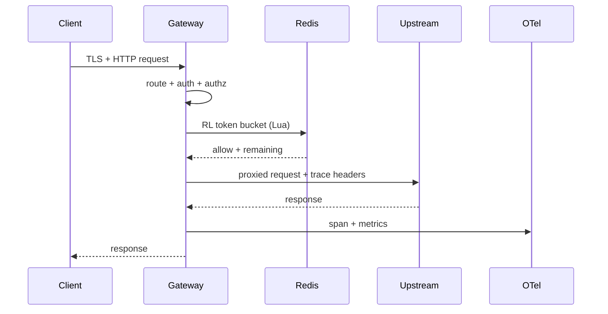
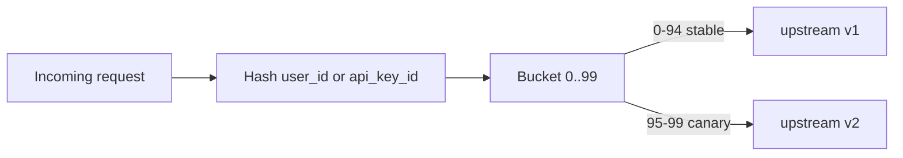
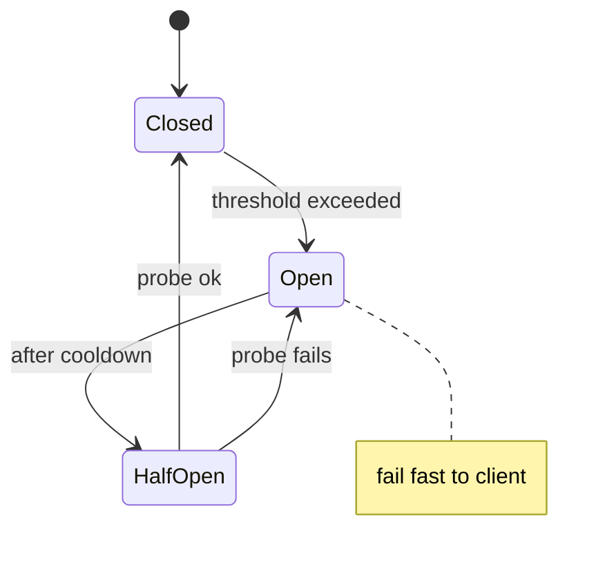
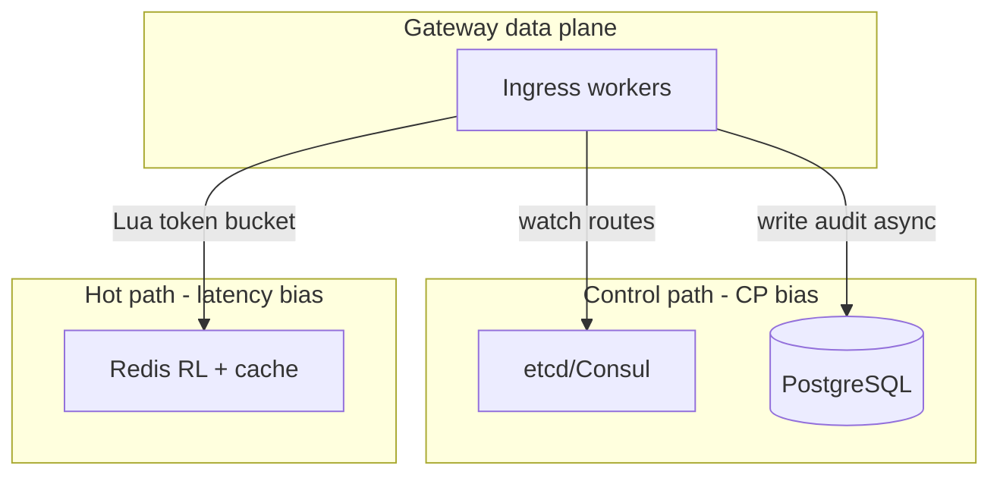
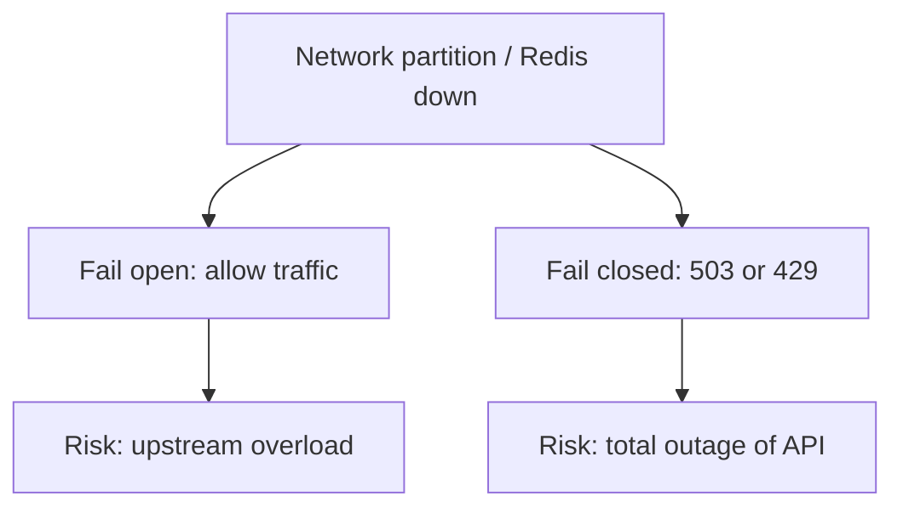

# API Gateway

---

## What We're Building

An **API gateway** is a **reverse proxy and policy enforcement point** that sits in front of microservices: it terminates TLS, authenticates callers, authorizes routes, shapes traffic (rate limits, circuit breaking), routes to the right upstream (with load balancing and canary splits), optionally transforms requests/responses, caches safe responses, and emits **unified observability** (logs, metrics, traces). It is the **single front door** for external and internal API consumers.

**Why it exists:** without a gateway, every service reinvents TLS, auth, quotas, and client-facing versioning. The gateway centralizes **cross-cutting concerns** so application teams focus on business logic while platform/SRE teams own **SLOs for ingress**, **security baselines**, and **traffic management**. At scale, the gateway is often deployed **per region** with **anycast** or DNS steering, backed by **shared control plane** stores (etcd/Consul) and **stateful edge data** in Redis.

**Production shape:** data plane instances (Envoy, NGINX, Kong, or custom Go/Rust) execute hot-path logic with **sub-millisecond** overhead targets; control plane services publish **route tables**, **rate-limit policies**, and **certificates** with **hot reload** (xDS, file watch, or config API). **PostgreSQL** holds **durable audit** and **API key metadata**; **Redis** holds **token buckets** and **response cache** entries; **OpenTelemetry** exports traces to the same backends as services for **correlation**.

| Capability | Why it matters |
|------------|----------------|
| **Routing** | Path/header/weighted rules map clients to the correct upstream version and region |
| **Rate limiting** | Protects upstreams and enforces commercial tiers (per key, IP, global) |
| **AuthN/Z** | API keys, JWT validation, OAuth introspection—before traffic hits services |
| **Transformation** | Header injection, body rewrite, REST↔gRPC bridging at the edge |
| **Load balancing & resilience** | RR, least-conn, consistent hash; circuit breaker prevents cascading failure |
| **Composition** | Aggregate multiple backend calls into one client-facing API |
| **Caching** | TTL-based response cache with invalidation hooks |
| **Observability** | Structured logs, RED metrics, distributed traces (OTel) |
| **Extensibility** | WASM/Lua/plugins—policy without recompiling the binary |
| **Ops** | Hot config reload, service discovery, mTLS, canary/blue-green |

!!! note
    In interviews, separate **data plane** (low latency, stateless logic + fast I/O) from **control plane** (durable config, rollout, audit). Confusing them is a common trap.

### Reference systems (interview vocabulary)

| System | Positioning | Typical talking point |
|--------|-------------|------------------------|
| **Envoy** | L7 proxy, xDS control plane, WASM filters | **Rate limit service** sidecar; **ext_authz** for auth |
| **Kong** | Postgres/Lua or DB-less; rich plugins | Admin API; **declarative** config for GitOps |
| **NGINX / OpenResty** | High-performance reverse proxy | **Lua** for custom logic; **less** dynamic than xDS |
| **AWS API Gateway / Azure APIM** | Managed edge + integrations | Vendor IAM; **latency** vs self-hosted tradeoff |
| **Traefik / HAProxy** | Ingress / LB with dynamic config | Simpler than Envoy; fewer **L7** extension points |

### Questions to ask (before you draw boxes)

| Question | Why it matters |
|----------|----------------|
| External vs internal clients? | Public internet drives **WAF**, **DDoS**, **TLS** ciphers |
| Synchronous only or WebSockets/SSE? | Long-lived connections change **LB** and **deploy** strategy |
| Who owns API keys—us or IdP? | Drives **Postgres** vs **OAuth-only** |
| Multi-region active-active? | **Global** rate limits and **routing** consistency |
| Compliance (PCI, HIPAA)? | **mTLS**, **audit** granularity, **data residency** |

---

## 1. Requirements Clarification

### Functional Requirements

| Requirement | Priority | Description |
|-------------|----------|-------------|
| **Path-based routing** | Must have | Match URI prefixes/patterns to upstream clusters |
| **Header-based routing** | Must have | Route by `X-Tenant`, `Accept`, mobile vs web, A/B flags |
| **Weighted routing** | Must have | Canary (% to new version), blue-green switch |
| **Rate limiting** | Must have | Token bucket per API key, per client IP, global ceiling |
| **API key auth** | Must have | Validate key, attach identity to request context |
| **JWT validation** | Must have | Signature, `aud`/`iss`, `exp`; optional JWKS rotation |
| **OAuth 2.0 introspection** | Should have | Opaque tokens via RFC 7662-style introspection endpoint |
| **Header/body transform** | Should have | Inject tracing headers, strip secrets, JSON patch |
| **REST↔gRPC translation** | Should have | gRPC-Web or JSON to gRPC for browser/legacy clients |
| **Load balancing** | Must have | RR, least-connections, consistent hash (session affinity) |
| **Circuit breaker** | Must have | Open on failures; half-open probe; configurable thresholds |
| **Request aggregation** | Nice to have | Fan-out to multiple services; combine JSON |
| **Response caching** | Should have | Cacheable GET with TTL; surrogate keys / purge API |
| **Logs/metrics/traces** | Must have | OTel; correlation IDs; no PII in logs |
| **Plugin architecture** | Should have | WASM/Lua/Go plugins for custom policy |
| **Hot reload** | Must have | Routes/limits/certs without process restart |
| **Service discovery** | Must have | Consul, etcd, Kubernetes Endpoints |
| **TLS & mTLS** | Must have | Edge TLS; optional client cert to gateway |
| **WebSocket / SSE** | Should have | Long-lived upgrade proxying |
| **Canary / blue-green** | Should have | Traffic split and instant rollback |

### Non-Functional Requirements

| Requirement | Target | Rationale |
|-------------|--------|-----------|
| **Throughput** | **~100K RPS per node** (illustrative; workload-dependent) | Hot path must be I/O and syscall efficient |
| **Routing overhead** | **Sub-millisecond p99** added latency vs direct upstream | Users pay gateway tax on every request |
| **Availability** | **99.99%** regional gateway tier | Ingress is on the critical path |
| **Consistency (config)** | **Seconds** to propagate route changes globally | Balance freshness vs blast radius |
| **Security** | TLS 1.2+, strong ciphers; secrets in KMS/HSM | Edge is the attack surface |
| **Auditability** | Append-only admin actions in PostgreSQL | Compliance and incident forensics |

### Out of Scope

- **Authoritative user directory / IdP** — gateway *integrates* with Okta/Auth0/Keycloak; it does not replace them.
- **Business logic** — orchestration belongs in BFF or domain services; gateway stays thin unless using **composition** as an explicit product feature.
- **Full API lifecycle** (design-first codegen, developer portal billing) — often a separate **developer platform**; gateway may expose metadata but not own the portal UX.
- **Payload inspection beyond policy** — deep ML content scanning is typically async pipelines, not synchronous gateway path (unless specialized product).

---

## 2. Back-of-Envelope Estimation

Assume **one gateway node** target **100K RPS** sustained for sizing discussions; multiply by **N active nodes** behind LB with **~70% peak utilization** headroom.

### Traffic & concurrency

| Quantity | Formula / assumption | Result |
|----------|----------------------|--------|
| **Peak RPS per node** | Design target | **100,000** |
| **Average request size** | JSON APIs | **1 KB** ingress |
| **Average response size** | JSON APIs | **2 KB** egress |
| **Ingress bandwidth** | `100K × 1 KB` | **~100 MB/s** (~800 Mbps) |
| **Egress bandwidth** | `100K × 2 KB` | **~200 MB/s** (~1.6 Gbps) |
| **Concurrent connections** | Assume 50ms mean service time, open keep-alive | `100K × 0.05` ≈ **5,000** (order-of-magnitude) |

!!! tip
    Real numbers depend on **TLS**, **compression**, **HTTP/2 multiplexing**, and **payload size**. Use these as **interview Fermi** checks, not purchase orders.

### Storage (PostgreSQL — audit & config)

| Store | Daily volume | Retention | Notes |
|-------|--------------|-----------|-------|
| **Audit log** | `100M requests/day × 500 bytes/row` ≈ **50 GB/day** | 90 days hot, then archive | Index by `ts`, `actor`, `route_id` |
| **API keys metadata** | Low churn | Years | Small table; secrets are **hashed** |
| **Route config history** | Versioned rows on change | 1 year | Rollback support |

### Redis (rate limits + cache)

| Use | Key cardinality | Memory hint |
|-----|-----------------|-------------|
| **Token bucket per API key** | 1M active keys × ~100 B | **~100 MB** + overhead |
| **Per-IP limit** | 100K hot IPs | **~10–20 MB** |
| **Response cache** | Popular GETs; TTL 60s | **GB–TB** (product choice) |

### Bandwidth & cross-AZ

| Path | Cost driver |
|------|-------------|
| **Client → gateway** | Internet / CDN; DDoS protection |
| **Gateway → upstream** | Often same region; **cross-AZ** doubles bill—**topology-aware** LB helps |

### CPU, memory & file descriptors (order-of-magnitude)

| Resource | Rule of thumb | At ~100K RPS |
|----------|---------------|--------------|
| **CPU** | TLS + JSON parsing dominate; HTTP/2 multiplexing amortizes handshakes | **16–32 vCPU** class machines (workload-dependent) |
| **Memory** | Connection buffers, TLS session cache, route tables | **32–64 GB** if large body buffering |
| **FDs** | `ulimit -n`; one FD per upstream + client connection | Tune to **1M+** on Linux with `sysctl` |

!!! warning
    **100K RPS per node** is a **design target**, not a guarantee—**payload size**, **TLS resumption rate**, and **plugin** CPU can move this by **10×**.

---

## 3. High-Level Design

### System Architecture

```
                         +------------------+
                         |   Global DNS /   |
                         |  Geo / Anycast   |
                         +--------+---------+
                                  |
          +-----------------------+-----------------------+
          |                       |                       |
   +------v------+          +------v------+         +------v------+
   |  Region A   |          |  Region B   |         |  Region C   |
   |  Gateway LB |          |  Gateway LB |         |  Gateway LB |
   +------+------+          +------+------+         +------+------+
          |                        |                        |
   +------v------+          +------v------+         +------v------+
   | Gateway pool|          | Gateway pool|         | Gateway pool|
   | (Envoy/Kong)|          | (Envoy/Kong)|         | (Envoy/Kong)|
   +---+---+-----+          +---+---+-----+         +---+---+-----+
       |   |                      |   |                 |   |
       |   |  +-------------------+   |                 |   |
       |   |  |                       |                 |   |
       v   v  v                       v                 v   v
   +---Redis Cluster (rate limits, cache)------------------------+
   |  shard by hash(api_key) / hash(route)                      |
   +----------------------------------------------------------------+
       |
       v
   +---PostgreSQL (audit, keys, route metadata)---+
   +---etcd / Consul (runtime discovery, optional config watch)---+
       |
       v
   +---------------- Upstream microservices ----------------+
   |  Orders │ Payments │ Users │ gRPC internal services |
   +--------------------------------------------------------+
```

### Component Overview

| Component | Role |
|-----------|------|
| **Edge LB** | L4/L7 health checks, TLS offload optional first hop |
| **Gateway data plane** | Policy chain: TLS → auth → route → limit → transform → proxy |
| **Redis** | Token buckets, sliding windows, response cache |
| **PostgreSQL** | API keys, audit trail, route config snapshots |
| **etcd / Consul** | Service catalog, KV for dynamic upstreams, config watches |
| **Control plane API** | Admin REST for routes, limits, keys; publishes to data plane |
| **Secret store** | KMS/Vault for signing keys, TLS certs |
| **OTel collector** | Metrics, logs, traces export |

### Core Flow

1. **Client** connects with TLS; gateway terminates (or passes through to upstream per policy).
2. **Router** matches host + path + method + headers; resolves **upstream cluster** and **traffic weight** (canary).
3. **Authentication** extracts API key or bearer token; validates JWT locally or calls **introspection**.
4. **Authorization** checks scopes/roles against route requirements.
5. **Rate limiter** runs **token bucket** in Redis (Lua atomicity); may enforce **global** counter.
6. **Optional cache** lookup for idempotent GET with cache policy.
7. **Load balancer** picks upstream (RR / least-conn / **consistent hash** on user id).
8. **Circuit breaker** gates unhealthy origins; may short-circuit with 503.
9. **Transform** adjusts headers/body; **gRPC** bridge if needed.
10. **Proxy** streams request/response; **WebSocket/SSE** upgraded connections pass through.
11. **Observability** emits span (OTel), metrics (latency, codes), audit row (async).
12. **Response** returns to client with **Retry-After** on 429 if limited.

### End-to-end sequence (happy path)



### Canary routing (deterministic)



---

## 4. Detailed Component Design

### 4.1 Routing & Traffic Management

**Path-based routing** uses longest-prefix or regex matchers (e.g. `/v2/orders/*` → `orders-v2` cluster). **Header-based** rules enable tenant isolation: `X-Route-Shard: eu` → EU pool.

**Weighted routing** assigns percentages: `stable: 95%`, `canary: 5%`. Implementations often use **consistent hashing of request id** into `[0,100)` or **Envoy runtime** / **split client** with sticky debug headers.

**Blue-green:** flip weights 0/100 atomically after health checks; **canary** is gradual. Store weights in **control plane**; push via **xDS**, **file snapshot**, or **Redis pub/sub** for custom stacks.

```
Request
   |
   v
+--------+    match host/path/header
| Router |---> route table (versioned)
+--------+
   |
   +---> cluster: orders-prod
           |
           +---> subset: version=canary (5%)
```

!!! warning
    **Hostile clients** can game unseeded random routing—prefer **deterministic** canary (user id hash) for consistent UX and easier debugging.

#### Service discovery integration

| Backend | Mechanism | Example |
|---------|-----------|---------|
| **Consul** | DNS or HTTP API; **long-poll** blocking queries | `orders.service.consul` → healthy instances |
| **etcd** | **Watch** prefix `/discovery/orders/` | Custom control plane writes instance list |
| **Kubernetes** | **Endpoints** / **EndpointSlice** via API watch | `orders.ns.svc.cluster.local` |
| **Static** | Bootstrap list in config | DR drills, small clusters |

**Health-aware LB:** only **passing** instances receive traffic; **unhealthy** drains over **grace period** to avoid flapping.

### 4.2 Authentication & Authorization

| Mechanism | Behavior | Storage / crypto |
|-----------|----------|------------------|
| **API keys** | `Authorization: ApiKey <id>` or header `X-API-Key` | Lookup id → **hashed secret** salt compare in PG or cache; never log raw key |
| **JWT** | Validate `alg`, `exp`, `iss`, `aud`; optional **JWKS** fetch with cache | Local verify (RS256) preferred for latency |
| **OAuth introspection** | POST to AS with token; returns `active`, `scope` | Extra RTT—cache **short TTL** (5–30s) keyed by token hash |

**Authorization** maps JWT `scope` / custom claims to **route templates**. Example: `orders:write` required for `POST /orders`. Use **OPA** or **Cedar**-style policy embedded in control plane for complex ABAC.

### 4.3 Rate Limiting (Redis Token Bucket)

Per **API key**, **IP**, and **global** limits compose as **waterfall**: evaluate cheapest filters first (global) to protect Redis.

**Token bucket (Lua sketch):**

```lua
-- KEYS[1] = bucket key, ARGV: capacity, refill_per_sec, now_ms, cost
local key = KEYS[1]
local capacity = tonumber(ARGV[1])
local refill = tonumber(ARGV[2])
local now = tonumber(ARGV[3])
local cost = tonumber(ARGV[4])

local data = redis.call('HMGET', key, 'tokens', 'ts')
local tokens = tonumber(data[1])
local ts = tonumber(data[2])
if tokens == nil then tokens = capacity; ts = now end

local delta = math.max(0, now - ts) / 1000.0
tokens = math.min(capacity, tokens + delta * refill)

if tokens < cost then
  return {0, tokens}  -- denied, remaining
end
tokens = tokens - cost
redis.call('HSET', key, 'tokens', tokens, 'ts', now)
redis.call('PEXPIRE', key, 3600000)
return {1, tokens}
```

**Global limit:** single key or **sharded counters** with **probabilistic** merge if key hotspot—at extreme scale use **approximate** (Redis HyperLogLog not for counts; use **GCRA** or **sliding window** in separate keys per slice).

### 4.4 Transformation, gRPC Bridge & Composition

**Header injection:** add `X-Request-Id`, `X-Forwarded-For`, **W3C traceparent** from OTel context.

**Body rewrite:** JSON **merge patch** for legacy clients; **large bodies** increase latency—prefer **minimal** transforms at gateway.

**REST ↔ gRPC:** **gRPC-Web** proxy (Envoy filter) or **JSON transcoding** via protobuf `google.api.http` annotations. **Double encoding** cost: keep payloads small.

**Request aggregation (composition):** orchestrate parallel upstream calls (async I/O), merge JSON. Risk: **partial failure**—define per-subresource error policy (fail all vs degrade). Often better in a **BFF**; gateway composition is for **edge-only** latency wins.

### 4.5 Load Balancing, Circuit Breaker & Caching

**Algorithms:**

| Algorithm | When |
|-----------|------|
| **Round-robin** | Homogeneous pods, stateless |
| **Least connections** | Long-lived or variable-cost requests |
| **Consistent hashing** | Cache affinity on `user_id` / session |

**Circuit breaker state machine:**

```
        +----------------+
        |    CLOSED      |  requests pass; failures counted
        +-------+--------+
                | failure threshold exceeded
                v
        +-------+--------+
        |     OPEN       |  fail fast (503/429 upstream)
        +-------+--------+
                | after cooldown
                v
        +-------+--------+
        |   HALF-OPEN    |  allow probe traffic
        +-------+--------+
           success -> CLOSED
           failure -> OPEN
```

Implement with **sliding failure rate** or **consecutive errors**; export **gauge** `cb_state{upstream}`.



**Response caching:** key = `hash(method, path, normalized query, vary headers)`. **TTL** from `Cache-Control` or route default. **Invalidation:** admin **purge** API writing tombstone in Redis; or **short TTL** for simplicity.

| Cache strategy | Mechanism | Tradeoff |
|----------------|-----------|----------|
| **Fixed TTL** | Redis `SETEX` | Simple; stale reads until expiry |
| **Surrogate-Key** | Purge tag `orders:*` on write | Needs **publisher** hooks from services |
| **ETag / If-None-Match** | Conditional GET | Extra RTT; great for **REST** clients |

### 4.6 Observability, Plugins & Hot Reload

**OpenTelemetry:** start span at entry; inject into upstream **grpc/http** headers. **RED metrics:** `rate`, `errors`, `duration` by `route`, `upstream`.

**Structured logs:** JSON with `trace_id`, `route_id`, **no** PII—mask `Authorization`.

**Plugin model:** **Envoy WASM** (Rust/AssemblyScript), **NGINX Lua**, **Kong Go plugins**, **Traefik middleware**. Contract: **init → request → response** hooks with **bounded CPU** timeouts.

**Hot reload:** **Envoy xDS** (ADS) streams config; **SIGHUP** on NGINX; **custom Go** watches **etcd** prefix `/gateway/routes/v{ver}` and **atomic swap** of route table pointer (RCU pattern).

### 4.7 WebSocket, SSE, and long-lived streams

| Protocol | Gateway behavior | Pitfalls |
|----------|------------------|----------|
| **WebSocket** | HTTP `Upgrade`; **bidirectional** TCP proxy after handshake | **Idle timeouts** must exceed **heartbeat**; **sticky** optional |
| **SSE** | HTTP/1.1 chunked read; **unidirectional** server→client | **LB buffering** can delay events—disable proxy buffering |
| **gRPC streaming** | HTTP/2 streams end-to-end | **Deadline** propagation via `grpc-timeout` |

**Timeouts:** align **gateway** `read_timeout`, **upstream** service, and **client** SDK—**shortest** wins.

### 4.8 TLS termination, mTLS, and SPIFFE

| Mode | Description |
|------|-------------|
| **TLS terminate at gateway** | Certificates on gateway; upstream may be **plain HTTP** in private network (not ideal) or **mTLS** |
| **TLS passthrough** | Gateway sees **SNI** only; **L4** routing—no HTTP auth at edge |
| **mTLS client→gateway** | B2B partners present **client cert**; map **CN/SAN** to tenant |
| **mTLS gateway→upstream** | **SPIFFE** IDs; workload identity from **SPIRE** |

```text
[Client --TLS--> Gateway --mTLS SPIFFE--> Upstream]
```

### 4.9 Example configuration snippets

**Envoy (fragment — rate limit + ext_authz):** production YAML is verbose; this captures **intent**:

```yaml
http_filters:
  - name: envoy.filters.http.ext_authz
    typed_config:
      "@type": type.googleapis.com/envoy.extensions.filters.http.ext_authz.v3.ExtAuthz
      grpc_service:
        envoy_grpc:
          cluster_name: ext_authz_cluster
      transport_api_version: V3
  - name: envoy.filters.http.ratelimit
    typed_config:
      "@type": type.googleapis.com/envoy.extensions.filters.http.ratelimit.v3.RateLimit
      domain: api_gateway
      rate_limit_service:
        grpc_service:
          envoy_grpc:
            cluster_name: rate_limit_service
```

**etcd watch (Go-style pseudocode) for hot reload:**

```go
watchCh := client.Watch(ctx, "/gateway/routes/", clientv3.WithPrefix())
for wresp := range watchCh {
  for _, ev := range wresp.Events {
    snap := loadSnapshotFromEtcd(ctx, client)
    atomic.StorePointer(&routeTable, unsafe.Pointer(snap))
  }
}
```

**Kong declarative (sketch):**

```yaml
_format_version: "3.0"
services:
  - name: orders
    url: http://orders.orders-ns.svc.cluster.local:8080
    routes:
      - name: orders-api
        paths:
          - /v1/orders
plugins:
  - name: rate-limiting
    config:
      minute: 100
      policy: redis
      redis_host: redis.gateway.svc.cluster.local
```

---

## 5. Technology Selection & Tradeoffs

### Data plane: Envoy vs NGINX vs Kong vs custom Go/Rust

| Option | Pros | Cons | Our Pick + Rationale |
|--------|------|------|----------------------|
| **Envoy** | Rich L7 filters, xDS hot reload, gRPC-Web, rate limit service, WASM, strong K8s story | Operational complexity; steep learning curve | **Default for cloud-native** — filters cover TLS, RL, authz extensibility |
| **NGINX / OpenResty** | Extremely fast, Lua for glue, huge ops familiarity | Dynamic config less elegant than xDS; extensibility via C/Lua | **Good** when team is NGINX-native and patterns are stable |
| **Kong (OSS/Enterprise)** | Postgres-backed config, plugin ecosystem, admin API | Heavier; vendor path for enterprise features | **Good** when you want **batteries-included** API management |
| **Custom Go/Rust** | Full control, minimal deps, embed RL/auth exactly | You own security patches, HTTP/2, H2, WS edge cases | **Pick** at very high scale or special protocols—**long-term cost** |

### Config & discovery store

| Option | Pros | Cons | Our Pick |
|--------|------|------|----------|
| **etcd** | Strong consistency, watches, K8s native | Ops overhead if not already in stack | **Primary** when K8s + gateway config co-located |
| **Consul** | Service mesh + DNS; multi-DC | Another stack if not used | **Pick** if enterprise already standardized |
| **Kubernetes API** | No extra CRD infra | API server load at scale | **Ingress + Gateway API** for k8s-only shops |

### Rate limit state

| Option | Pros | Cons | Our Pick |
|--------|------|------|----------|
| **Redis** | Lua, TTL, sub-ms, mature | Hot key, memory | **Default** |
| **Memcached** | Simple | No Lua richness | Edge-only simple counters |
| **Local memory** | Fastest | Not shared | Layer **with** Redis for micro-bursts only |

### Audit & durable metadata

| Option | Pros | Cons | Our Pick |
|--------|------|------|----------|
| **PostgreSQL** | ACID, JSONB, audit triggers | Vertical limits | **Default** for keys + audit |
| **DynamoDB** | Regional, pay-per-use | Less expressive ad hoc | When AWS-native |

### Rate limiting implementation shape

| Option | Pros | Cons | Our Pick |
|--------|------|------|----------|
| **Envoy global RL + Redis** | Central policy; same math everywhere | Extra hop to **rate_limit_service** | **Large mesh** deployments |
| **Embedded Lua/WASM in gateway** | Lowest hop count | Harder to **uniformly** update policy | **Single-vendor** edge |
| **Dedicated RL microservice** (gRPC) | Independent scaling | **Critical path** dependency | When RL CPU dominates |

### Custom Go/Rust gateway: when it wins

| Signal | Meaning |
|--------|---------|
| **Protocol** needs not covered by Envoy filters | Proprietary framing, custom binary |
| **p99** budget **&lt; 100µs** proxy overhead | Hand-tuned **io_uring** / zero-copy |
| **Org** has platform team to maintain | Security patches, HTTP/3, **QUIC** |

---

## 6. CAP Theorem Analysis

The gateway system is **not one database**—partition by concern:

| Subsystem | CAP stance | Explanation |
|-----------|------------|-------------|
| **Route config (etcd)** | **CP** | Prefer **consistent** view of routes; brief unavailability better than split-brain routing |
| **Redis rate limits** | **AP** leaning | Under partition, **over-admission** or **fail-open**—product choice; **per-key** primary avoids split writes if single region |
| **PostgreSQL audit** | **CP** | Strong durability for compliance |
| **Response cache** | **AP** | Stale cache acceptable; **TTL** bounds inconsistency |



**Partition scenario (Redis unavailable):**



!!! tip
    Say clearly: **CAP applies per subsystem**. The **gateway process** favors **availability** of traffic (often **fail open on RL**) vs **strict quota**—that is a **business** knob, not a theorem misunderstanding.

---

## 7. SLA and SLO Definitions

### SLIs & SLOs

| SLI | Measurement | SLO (example) |
|-----|-------------|-----------------|
| **Availability** | Successful responses (2xx/3xx) / total (excl. client 4xx) | **99.99%** monthly |
| **Latency** | p99 gateway-added latency (upstream subtracted or canary direct) | **&lt; 1 ms** p99 overhead |
| **Error rate** | `5xx` from gateway / all | **&lt; 0.01%** |
| **Config freshness** | Time from publish to 99% nodes applied | **&lt; 30 s** |

### Error budget policy

| Budget remaining | Action |
|------------------|--------|
| **&gt; 50%** | Normal release velocity |
| **25–50%** | Freeze risky gateway plugin changes |
| **&lt; 25%** | Feature freeze; incident review; prioritize reliability work |
| **Exhausted** | **Stop** canary increases; root-cause review before new deploys |

!!! note
    **99.99%** ≈ **4.38 min/month** downtime budget—ingress incidents burn budget fast; **multi-AZ** and **graceful degradation** are mandatory talking points.

---

## 8. Database Schema and Data Model

PostgreSQL DDL for **route configuration**, **rate limit rules**, **API keys**, and **audit logs**.

```sql
-- Tenants / environments
CREATE TABLE tenants (
  id              BIGSERIAL PRIMARY KEY,
  external_ref    TEXT NOT NULL UNIQUE,
  name            TEXT NOT NULL,
  created_at      TIMESTAMPTZ NOT NULL DEFAULT now()
);

-- Upstream clusters (logical groups of instances)
CREATE TABLE upstream_clusters (
  id              BIGSERIAL PRIMARY KEY,
  tenant_id       BIGINT NOT NULL REFERENCES tenants(id),
  name            TEXT NOT NULL,
  discovery_type  TEXT NOT NULL CHECK (discovery_type IN ('static','dns','consul','k8s')),
  discovery_spec  JSONB NOT NULL,  -- hosts, SRV name, k8s service ref, etc.
  health_check    JSONB,
  created_at      TIMESTAMPTZ NOT NULL DEFAULT now(),
  UNIQUE (tenant_id, name)
);

-- Routes: matching + destination + flags
CREATE TABLE routes (
  id              BIGSERIAL PRIMARY KEY,
  tenant_id       BIGINT NOT NULL REFERENCES tenants(id),
  host_pattern    TEXT NOT NULL,
  path_pattern    TEXT NOT NULL,
  methods         TEXT[] NOT NULL DEFAULT ARRAY['GET','POST','PUT','PATCH','DELETE'],
  header_rules    JSONB,  -- [{"name":"X-Env","op":"eq","value":"canary"}]
  upstream_id     BIGINT NOT NULL REFERENCES upstream_clusters(id),
  weight          INT NOT NULL DEFAULT 100 CHECK (weight >= 0 AND weight <= 100),
  priority        INT NOT NULL DEFAULT 1000,
  tls_mode        TEXT NOT NULL DEFAULT 'terminate' CHECK (tls_mode IN ('terminate','passthrough')),
  mtls_upstream   BOOLEAN NOT NULL DEFAULT false,
  cache_ttl_sec   INT,
  enabled         BOOLEAN NOT NULL DEFAULT true,
  version         BIGINT NOT NULL DEFAULT 1,
  updated_at      TIMESTAMPTZ NOT NULL DEFAULT now()
);
CREATE INDEX idx_routes_tenant ON routes(tenant_id);

-- Rate limit rules (evaluated in order)
CREATE TABLE rate_limit_rules (
  id              BIGSERIAL PRIMARY KEY,
  tenant_id       BIGINT NOT NULL REFERENCES tenants(id),
  name            TEXT NOT NULL,
  scope           TEXT NOT NULL CHECK (scope IN ('global','api_key','ip','route')),
  route_id        BIGINT REFERENCES routes(id),
  algorithm       TEXT NOT NULL DEFAULT 'token_bucket',
  limit_per_sec   NUMERIC NOT NULL,
  burst           NUMERIC NOT NULL,
  priority        INT NOT NULL DEFAULT 100,
  enabled         BOOLEAN NOT NULL DEFAULT true,
  UNIQUE (tenant_id, name)
);

-- API keys (secret stored as hash only)
CREATE TABLE api_keys (
  id              BIGSERIAL PRIMARY KEY,
  tenant_id       BIGINT NOT NULL REFERENCES tenants(id),
  key_prefix      TEXT NOT NULL,  -- first 8 chars for lookup
  secret_hash     BYTEA NOT NULL,
  salt            BYTEA NOT NULL,
  scopes          TEXT[] NOT NULL DEFAULT '{}',
  status          TEXT NOT NULL DEFAULT 'active' CHECK (status IN ('active','revoked')),
  created_at      TIMESTAMPTZ NOT NULL DEFAULT now(),
  revoked_at      TIMESTAMPTZ
);
CREATE INDEX idx_api_keys_prefix ON api_keys(key_prefix) WHERE status = 'active';

-- Audit log (append-heavy; partition in production)
CREATE TABLE gateway_audit_log (
  id              BIGSERIAL PRIMARY KEY,
  ts              TIMESTAMPTZ NOT NULL DEFAULT now(),
  tenant_id       BIGINT REFERENCES tenants(id),
  actor_type      TEXT NOT NULL,  -- 'admin','system'
  actor_id        TEXT,
  action          TEXT NOT NULL,
  resource_type   TEXT NOT NULL,
  resource_id     TEXT,
  payload         JSONB,
  ip              INET,
  trace_id        TEXT
);
CREATE INDEX idx_audit_ts ON gateway_audit_log(ts DESC);
CREATE INDEX idx_audit_actor ON gateway_audit_log(actor_id, ts DESC);

-- Published config snapshots (for audit + rollback)
CREATE TABLE route_config_snapshots (
  id              BIGSERIAL PRIMARY KEY,
  tenant_id       BIGINT NOT NULL REFERENCES tenants(id),
  version         BIGINT NOT NULL,
  content_hash    BYTEA NOT NULL,
  payload         JSONB NOT NULL,
  published_by    TEXT,
  published_at    TIMESTAMPTZ NOT NULL DEFAULT now(),
  UNIQUE (tenant_id, version)
);

-- Response cache surrogate keys (optional; for tag-based purge)
CREATE TABLE cache_surrogate_tags (
  id              BIGSERIAL PRIMARY KEY,
  tenant_id       BIGINT NOT NULL REFERENCES tenants(id),
  tag             TEXT NOT NULL,
  cache_key_hash  BYTEA NOT NULL,
  expires_at      TIMESTAMPTZ NOT NULL,
  UNIQUE (tenant_id, tag, cache_key_hash)
);
CREATE INDEX idx_surrogate_tag ON cache_surrogate_tags(tenant_id, tag);
```

!!! warning
    Partition `gateway_audit_log` by **month**; use **async insert** from gateway to avoid blocking hot path.

---

## 9. API Design

### Admin API — routes & limits

```http
POST /admin/v1/tenants/{tenantId}/routes
Content-Type: application/json
Authorization: Bearer <admin-token>

{
  "hostPattern": "api.example.com",
  "pathPattern": "/v1/orders/*",
  "methods": ["GET", "POST"],
  "headerRules": [{ "name": "X-Cell", "op": "eq", "value": "us-east-1a" }],
  "upstreamCluster": "orders-prod",
  "weight": 95,
  "priority": 100,
  "cacheTtlSec": null
}
```

```http
PATCH /admin/v1/routes/{routeId}
Content-Type: application/json

{ "enabled": false, "weight": 0 }
```

```http
POST /admin/v1/tenants/{tenantId}/rate-limit-rules
Content-Type: application/json

{
  "name": "orders-key-bucket",
  "scope": "api_key",
  "routeId": 42,
  "limitPerSec": 50,
  "burst": 100
}
```

**API key lifecycle:**

```http
POST /admin/v1/tenants/{tenantId}/api-keys
Content-Type: application/json

{
  "scopes": ["orders:read", "orders:write"],
  "description": "Partner ACME integration"
}
```

```http
201 Created
Content-Type: application/json

{
  "id": "key_01hq...",
  "prefix": "gw_live_a",
  "secret": "gw_live_a************************xyz",
  "scopes": ["orders:read", "orders:write"],
  "createdAt": "2026-04-05T12:00:00Z"
}
```

!!! warning
    Return **secret once**; persist only **hash** + **prefix** for lookup.

**Publish route snapshot (triggers xDS / etcd push):**

```http
POST /admin/v1/tenants/{tenantId}/config/publish
Content-Type: application/json

{ "comment": "Enable canary 5% on orders" }
```

**Cache purge by surrogate tag:**

```http
POST /admin/v1/tenants/{tenantId}/cache/purge
Content-Type: application/json

{ "tags": ["orders:user:42", "catalog:product:99"] }
```

### Gateway proxy behavior (client-facing)

| Client request | Gateway behavior |
|----------------|------------------|
| `GET /v1/orders` + valid API key | Route → upstream; emit trace; 200/4xx/5xx |
| Same, over quota | **429** + `Retry-After: 3` |
| Invalid JWT | **401** `WWW-Authenticate` |
| Upstream circuit open | **503** + `Retry-After` optional |
| WebSocket upgrade | TCP stream proxy; **idle timeouts** aligned |

**Introspection cache (internal):**

```http
POST /internal/oauth/introspect
Content-Type: application/x-www-form-urlencoded

token=<opaque>&token_type_hint=access_token
```

Response cached in Redis `SET introspect:<sha256(token)> JSON EX 30`.

---

## 10. Scaling & Production Considerations

| Topic | Practice |
|-------|----------|
| **Horizontal scale** | Stateless gateway pods + **anycast** / LB; **connection draining** on deploy |
| **Redis** | Cluster mode; **hash tags** `{tenant}:rl:*` for locality; replicas for read-heavy cache |
| **Hot keys** | Shard global limit; **local token refill** + sync |
| **Config rollout** | **Canary** control plane; **validate** JSON schema before xDS push |
| **TLS** | Cert **auto-renew** (ACME); **OCSP stapling** |
| **Multi-region** | **Global** RL is hard—prefer **per-region budgets** + async reconciliation |
| **Testing** | **Chaos** on Redis/etcd; verify **fail-open** vs **fail-closed** matches policy |

### Load shedding & backpressure

| Signal | Action |
|--------|--------|
| **Redis latency p99** &gt; SLO | Shed **non-critical** routes first (feature flag) |
| **Upstream queue depth** | **429** with `Retry-After` beats **504** storm |
| **CPU** saturation on gateway | **Drop** expensive transforms; **bypass** cache write |

### Deployment patterns

| Pattern | Description |
|---------|-------------|
| **Rolling** | Replace N% pods; **maxUnavailable** / **maxSurge** tuned for connections |
| **Blue-green** | Two stacks; flip LB weight **instantly** |
| **Canary (data plane)** | New Envoy binary on **5%** pods; compare **5xx** and **p99** |

### Observability in production

| Signal | Alert |
|--------|-------|
| `gateway_requests_total{code=~"5.."}` | Page if **&gt; SLO** error budget burn |
| `gateway_upstream_circuit_breaker_state` | Warn on **open** |
| `gateway_config_last_applied_timestamp` | Stale config **&gt; 5 min** |

### Capacity planning (back-of-envelope)

| Goal | Math |
|------|------|
| **1M RPS** regional | `1M / 100K = 10` nodes at target + **N+2** spare |
| **Redis** memory | Count **distinct** RL keys at peak × **bytes/key** × **1.5** fragmentation |

!!! tip
    Treat gateway as **multiplier**: a **retry storm** from clients can **10×** upstream load—coordinate **retry budgets** with **429** semantics.

---

## 11. Security, Compliance, and Data Privacy

| Concern | Design |
|---------|--------|
| **Secrets** | API keys **hashed** (Argon2/bcrypt); raw keys shown **once** at creation |
| **TLS** | TLS 1.2+; **HSTS** for public APIs |
| **mTLS** | Optional client certs for B2B; **SPIFFE** identities mesh-style |
| **PII** | **No** full tokens or bodies in logs; **mask** `Authorization` |
| **Audit** | All admin mutations to PostgreSQL; **immutable** append |
| **Compliance** | Data residency: **route** + **upstream** pinned to region; **GDPR** delete flows for API key metadata |
| **DDoS** | Syn flood → LB; app-layer → **WAF** + rate limits; **edge** partnership (Cloudflare/Akamai) |

---

## Interview Self-Check

| Question | Strong answer hints |
|----------|---------------------|
| Where does JWT verify happen? | Gateway for **uniform policy**; service for **fine-grained** authz |
| Global rate limit at 10M RPS? | Shard counters; **approximation**; **local** + **merge** tradeoffs |
| Why not cache POST? | **Non-idempotent**; unless explicit **safe** extension |
| Circuit breaker vs retry? | Breaker **stops** hammering; retries **amplify** load—**retry budget** |
| etcd vs Redis for routes? | **etcd** for **source of truth**; **Redis** for **ephemeral** RL/cache |
| gRPC from browser? | **gRPC-Web** + Envoy; or **JSON transcoding** |
| How do you debug **p99** regressions? | Compare **upstream** vs **gateway** span; check **RL Redis**; **TLS** session reuse |
| **ext_authz** latency too high? | Cache decisions; **move** JWT local; **batch** introspection |
| WebSocket behind multiple gateways? | **IP hash** or **session** stickiness; or **single** regional anycast |
| Blue-green vs canary? | Blue-green = **instant** cut; canary = **gradual** risk reduction |

### Staff-level follow-ups

| Topic | Depth to show |
|-------|----------------|
| **Blast radius** | Bad route config → **internal** validation + **staged** rollout |
| **Multi-tenant fairness** | **Noisy neighbor**: per-tenant RL + **separate** Redis shards |
| **Compliance** | **Audit** who changed **which** route; tie to **corp SSO** |

---

## Quick Reference Tables

### Routing & resilience

| Pattern | Use |
|---------|-----|
| Path + header match | Tenant / cell routing |
| Weighted | Canary |
| Consistent hash | Cache affinity |
| CB closed/open/half-open | Upstream protection |

### Technology summary

| Layer | Typical choice |
|-------|----------------|
| Data plane | Envoy (+ RL service), Kong, NGINX |
| RL state | Redis + Lua |
| Config / SD | etcd, Consul, K8s API |
| Audit | PostgreSQL |
| Tracing | OpenTelemetry |

### HTTP status map (gateway)

| Code | Cause |
|------|-------|
| **401** | Auth failed |
| **403** | Authz denied |
| **429** | Rate limited |
| **503** | CB open / no healthy upstream |

### Redis key patterns (operations cheat sheet)

| Key family | Example | Purpose |
|------------|---------|---------|
| Token bucket | `{t1}:rl:tb:rule:{id}:sub:{hash}` | Per-subject limit |
| Introspection | `oauth:introspect:{sha256(token)}` | Cached AS response |
| Response cache | `cache:{h(method,path,query,vary)}` | GET cache entry |

### Control plane vs data plane (one-liner)

| Plane | Owns |
|-------|------|
| **Control** | Route CRUD, keys, audit, **publish** pipeline |
| **Data** | **Every** request: match, auth, RL, proxy |

---

!!! tip
    **Sound bite:** *“We treat the gateway as a **policy execution engine** at the edge: **Redis** for milliseconds-counts, **Postgres** for **durable** identity and audit, **etcd** for **consistent** routing intent, and **OTel** so every **429** and **503** is explainable in a trace.”*
