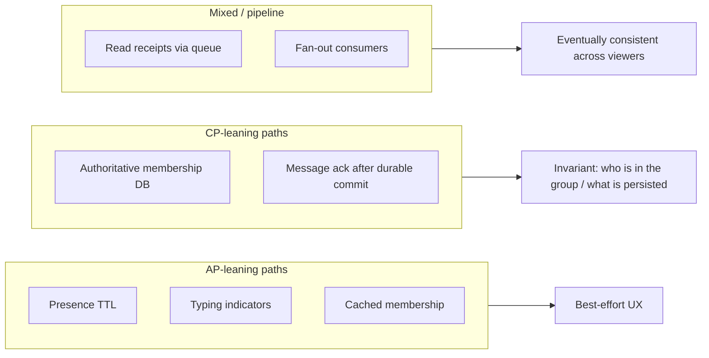
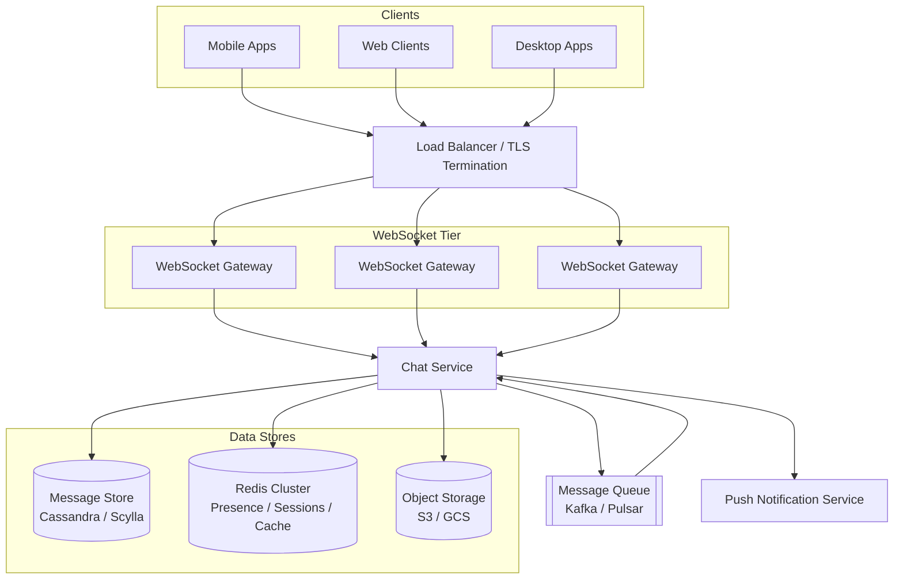
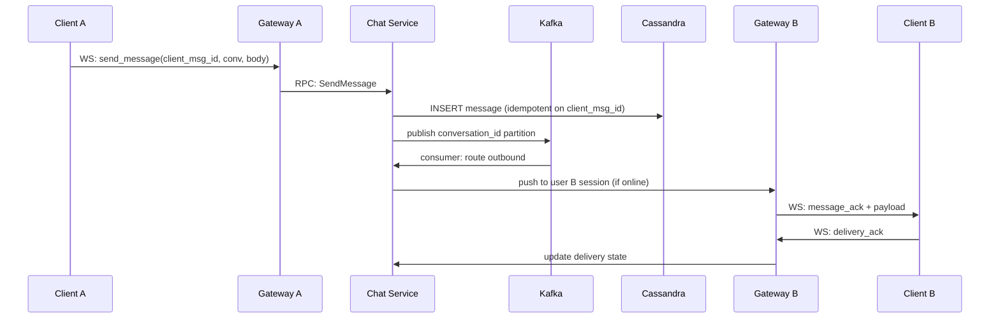
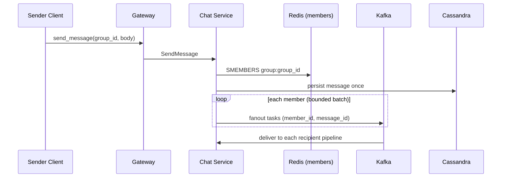
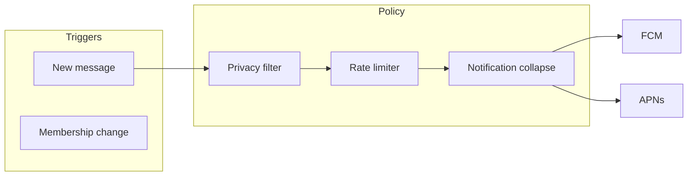
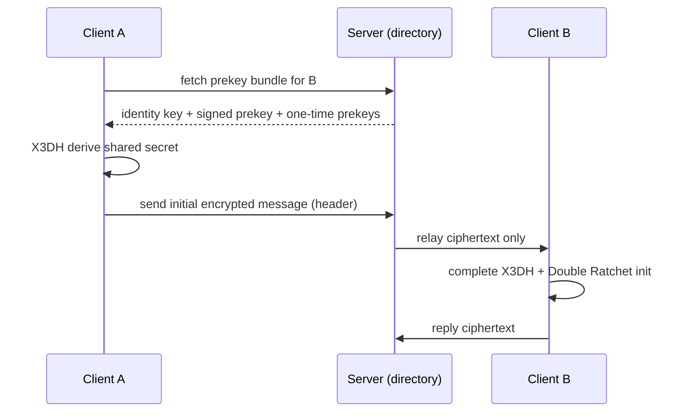

# Design a Chat System

---

## What We're Building

A **real-time messaging platform** that supports one-to-one (1:1) conversations, group channels, presence, delivery semantics, and optional rich media—similar in spirit to WhatsApp, Slack DMs/channels, or Discord.

**Core capabilities in scope:**
- Instant message delivery when recipients are online
- Durable history and sync across devices
- Group conversations with membership and permissions
- Read receipts and typing indicators (where product requires them)
- Push notifications for offline users
- Media attachments (images, files) via object storage

### Why Chat Systems Are Hard

| Challenge | Description |
|-----------|-------------|
| **Stateful connections** | Millions of long-lived WebSocket sessions; routing must stay consistent |
| **Ordering** | Per-conversation ordering is expected; groups amplify fan-out |
| **Delivery guarantees** | Networks drop packets; clients reconnect; duplicates are inevitable without design |
| **Presence at scale** | Heartbeats × friends/groups = hot paths and fan-out |
| **Storage growth** | Messages are append-mostly; retention and compaction matter |
| **Global users** | Multi-region latency vs consistency trade-offs |

### Real-World Scale (Order-of-Magnitude)

| Product | Scale signal | Takeaway |
|---------|----------------|----------|
| **WhatsApp** | On the order of **~100B+ messages/day** (public reporting varies by year) | Write-heavy, global, mobile-first |
| **Slack** | **Millions of organizations**, very large shared channels in enterprise | Fan-out and search dominate |
| **Discord** | Huge concurrent voice + text in communities | Hot channels + regional edge matter |
| **Microsoft Teams** | Enterprise messaging + meetings | Compliance, retention, search |

!!! note
    Interview tip: cite ranges as **orders of magnitude**, not precise audited figures, unless you have a source. The point is **write throughput**, **connection count**, and **fan-out**, not decimal precision.

### Comparison to Adjacent Systems

| System | Similarity | Difference |
|--------|------------|------------|
| **Notification system** | Async delivery, retries, idempotency | Chat needs **ordering** + **session routing** |
| **News feed** | Fan-out | Feed is often **read-optimized**; chat is **write + delivery** |
| **Email** | Durable messages | Chat expects **sub-100ms** for active sessions |

---

## Step 1: Requirements Clarification

### Questions to Ask

| Question | Why It Matters |
|----------|----------------|
| 1:1 only, or groups too? | Fan-out strategy, storage keys, ordering scope |
| Max group size? | Fan-out on write vs read, storage of membership |
| Cross-region / GDPR? | Data residency, multi-master vs single-writer regions |
| E2EE required? | Server-side search/indexing limited; key management complexity |
| Media size limits? | Object storage, CDN, virus scanning pipeline |
| Message retention? | Compliance (legal hold), storage cost, compaction |
| Read receipts / typing? | Extra events, privacy settings, traffic multiplication |
| Search in messages? | Secondary index (Elasticsearch/OpenSearch), cost |
| Bots / webhooks? | Another producer/consumer with rate limits |

### Functional Requirements

| Requirement | Priority | Description |
|-------------|----------|-------------|
| 1:1 messaging | Must have | Send/receive text between two users in real time |
| Group messaging | Must have | Channels with membership; post to all members |
| Online/offline presence | Must have | Show availability; last seen optional |
| Read receipts | Must have | Delivered/read markers per conversation |
| Push notifications | Must have | FCM/APNs when user offline or app backgrounded |
| Message history | Must have | Paginated sync for new devices and scrollback |
| Media sharing | Should have | Upload to object store; reference in message |
| Typing indicators | Nice to have | Ephemeral signals; can be dropped under load |
| Reactions / threads | Nice to have | Additional indices and UI complexity |

### Non-Functional Requirements

| Requirement | Target | Rationale |
|-------------|--------|-----------|
| **Latency (active chat)** | **&lt; 100 ms** server-side (not including client rendering) | Feels “instant” for typing conversations |
| **Availability** | **99.99%** for messaging API | Enterprise expectations; plan maintenance windows |
| **Message ordering** | **Per conversation** total order (or per sender order with causal metadata) | Avoid confusing transcript |
| **Delivery semantics** | **At-least-once** with **idempotent** consumers | Exactly-once end-to-end is rare; idempotency keys everywhere |
| **Durability** | No acknowledged message lost | Ack after durable commit or replicated log |
| **Scalability** | Horizontal for gateways and workers | Connection and write sharding |

!!! warning
    Do not promise **exactly-once delivery** to end users without qualifiers. In practice you implement **at-least-once** + **deduplication** + **idempotent handlers**; the UX can still feel exactly-once.

### API Design

**Transport**
- **WebSocket** (or HTTP/2 streams) for bidirectional real-time events: new messages, receipts, presence, typing.

**Representative REST / RPC endpoints** (names illustrative):

| Operation | Method | Purpose |
|-----------|--------|---------|
| `POST /v1/ws/token` | HTTP | Short-lived JWT to authenticate WebSocket upgrade |
| `WS /v1/stream` | WebSocket | Multiplexed events: `message`, `ack`, `presence`, `typing` |
| `POST /v1/messages` | HTTP | Optional HTTP fallback for send (mobile background rules) |
| `GET /v1/conversations/{id}/messages` | HTTP | Paginated history (`before` cursor) |
| `POST /v1/groups` | HTTP | Create group |
| `POST /v1/groups/{id}/members` | HTTP | Add/remove members |
| `GET /v1/groups/{id}` | HTTP | Metadata, roles |

**WebSocket event envelope (conceptual)**

```json
{
  "id": "evt_01h2...",
  "type": "message.new",
  "conversation_id": "cnv_abc",
  "client_msg_id": "cli_xyz",
  "payload": { }
}
```

!!! tip
    Always separate **client-generated idempotency** (`client_msg_id`) from **server message id**. Retries must not create duplicate logical messages.

### Technology Selection & Tradeoffs

Chat is **write-heavy** and **connection-heavy**. Technology choices should separate **durability + ordering** (messages) from **ephemeral + fast** (presence, typing) and **bulk immutable** (media). Below is how you compare options in an interview—not to memorize winners, but to **name constraints** (latency, ops cost, partition model, team skills).

#### Message storage (write-heavy chat history)

| Store | Strengths | Weaknesses | When it shines |
|-------|-----------|------------|----------------|
| **Apache Cassandra / Scylla** | Massive sustained writes, hash/range partitioning by `conversation_id`, tunable consistency, TTL | No rich joins; secondary indexes are limited; ops/understanding of LWT & repairs | Global scale, hot partitions managed with buckets |
| **Apache HBase** | Strong for wide rows, Hadoop ecosystem, BigTable model | Heavier ops, JVM tuning; less common greenfield for pure chat than C* | Existing HBase investment, batch analytics co-located |
| **MongoDB** | Flexible documents, change streams, developer familiarity | Single-document atomicity is natural; **cross-shard multi-doc transactions** add latency/complexity at high QPS | Mid-scale chat, teams already on Mongo |
| **PostgreSQL** | ACID, constraints, great tooling, Citus/Sharding for scale | Vertical + careful sharding; **very high global write QPS** needs discipline (partitioning, connection pooling) | MVP–early scale, compliance-heavy metadata, relational membership |

**Why write-heavy matters:** Inserts are the steady path; reads are often “recent window + cursor.” You want **append-friendly partitions** and **idempotent writes** (`client_msg_id`), not heavy cross-table joins on the hot path.

#### Connection management (real-time to clients)

| Mechanism | Strengths | Weaknesses | Fit |
|-----------|-----------|------------|-----|
| **WebSocket** | Full duplex, low overhead after upgrade, standard for chat | Stateful gateways, reconnect/backoff, proxy timeouts | **Default** for interactive chat |
| **SSE (Server-Sent Events)** | Simple one-way server→client over HTTP; auto-reconnect in browsers | No binary multiplexing like WS; half-duplex; send path still needs HTTP/WS | Live feeds, read-heavy notifications; often paired with HTTP POST for sends |
| **Long polling** | Works through restrictive proxies | High latency vs WS; many open requests | Legacy mobile networks; fallback only |
| **MQTT** | Lightweight pub/sub; good for IoT | Not the typical web chat stack; different auth/session model | Device telemetry, not general consumer chat UX |

**Interview point:** Choose **WebSocket** for bidirectional chat unless product is strictly broadcast-only; keep **HTTP** for history sync and uploads.

#### Message queue / log

| System | Strengths | Weaknesses | Fit |
|--------|-----------|------------|-----|
| **Apache Kafka** | High throughput, durable log, consumer groups, partition = ordering scope | Ops complexity; tuning for latency vs durability | **Fan-out pipeline**, cross-service replay, partition by `conversation_id` |
| **RabbitMQ** | Flexible routing (exchanges), classic enterprise | Throughput ceiling lower than Kafka at extreme scale; different mental model | Smaller scale, complex routing, lower message volume |
| **Redis Streams** | Low latency, simple if Redis already present | Persistence model differs from Kafka; clustering for durability needs care | Per-region buffers, gateway-local queues, **not** sole global source of truth at WhatsApp scale |

**Why:** Kafka (or Pulsar) gives a **replayable** backbone when workers or gateways restart; Redis Streams can sit **inside** a region for fast handoff but usually **pairs** with a durable log for critical paths.

#### Presence service

| Approach | Strengths | Weaknesses | Fit |
|----------|-----------|------------|-----|
| **Redis (TTL + Pub/Sub)** | Fast, simple heartbeats, fan-out channels | Best-effort; memory-bound; cluster failover semantics need design | **Industry default** for online/away |
| **Custom in-memory** on gateway | Lowest read latency | Not shared across gateways without sync; loss on crash | Micro-optimization with Redis as source of truth |
| **Dedicated protocols (XMPP presence, etc.)** | Standardized | Heavy ecosystem; less common in greenfield mobile apps | Interop, legacy IM |

**Why:** Presence is **eventually consistent** by nature; optimize for **availability** and **low latency**, not perfect global agreement.

#### Media storage

| Approach | Strengths | Weaknesses | Fit |
|--------|-----------|------------|-----|
| **S3 (or GCS/Azure Blob) + CDN** | Infinite scale, lifecycle, encryption at rest, signed URLs | Cold/warm latency without CDN; egress cost | **Default** for attachments |
| **Custom blob store** | Full control, colocation with app | You reimplement durability, erasure coding, compliance | Hyperscale or special compliance; rare in interviews |

**Our choice (aligned with this guide):**

| Layer | Choice | Rationale |
|-------|--------|-----------|
| **Message bodies** | **Cassandra / Scylla** (or DynamoDB in managed form) | Partition by conversation, clustering by server message id; survives write spikes |
| **Metadata / membership** | **PostgreSQL** (or managed SQL) | Roles, invites, audit—fits relational model |
| **Realtime transport** | **WebSocket** gateways | Bidirectional events; industry norm |
| **Async fan-out** | **Kafka** (conceptually; Pulsar similar) | Durable log, replay, partition-scoped ordering |
| **Presence & routing** | **Redis** cluster | TTL presence, session routing, rate limits |
| **Media** | **Object storage + CDN** | Offload bytes; signed URLs; lifecycle policies |

This stack **separates concerns**: SQL for **authoritative membership**, wide-column (or key-value) for **append-only messages**, Kafka for **pipeline durability**, Redis for **soft state**.

### CAP Theorem Analysis

CAP (**Consistency**, **Availability**, **Partition tolerance**) is a **lens**, not a single dial: in a network partition, you often pick between **linearizable consistency** and **always answering**. Chat systems **cannot** sacrifice partition tolerance in real networks—so the real design is **per subsystem**: which paths favor **CP** (strong invariants) vs **AP** (always try to serve or deliver).

**How to narrate it in an interview**

- **Messages (durable history):** You want **ordering and durability within a conversation** more than global linearizability across all conversations. Typical pattern: **single-writer order per partition** (e.g., Kafka partition or DB shard key = `conversation_id`) + **at-least-once** delivery with idempotency. Under partition, you may **delay ACK** until replicated (favor **CP** on “accepted” write) while still keeping the **read path** available from a replica with **explicit staleness** bounds if you allow it (product decision).
- **Presence:** Inherently **AP**: show “online” with **TTL**; accept **false offline/online** briefly after splits. Wrong presence is annoying but not a financial ledger error.
- **Read receipts:** Often **eventual**: delivered/read state propagates asynchronously; duplicates handled by idempotency. You may choose **stronger consistency** for “read cursor” per user in SQL if product demands strict ordering of receipts.
- **Group membership:** Usually **CP** in the **authoritative store** (add/remove must not disagree); **cached** membership in Redis is **AP** (stale cache tolerable for milliseconds–seconds with invalidation).



**Per-path summary**

| Data path | CAP leaning | Why |
|-----------|-------------|-----|
| **Messages** | **CP** at commit (“accepted” = durable); **AP** on optional read replicas if you allow lag | Users must not lose acknowledged messages; ordering scoped to conversation |
| **Presence** | **AP** | Availability and freshness beat perfect agreement |
| **Read receipts** | **Eventual** (often **AP** on fan-out) | Optimize for delivery; tolerate short inconsistency between devices |
| **Group membership** | **CP** in source of truth | Security and billing depend on correct roster |

### SLA and SLO Definitions

SLAs are **contracts** (often with customers); **SLOs** are internal targets; **SLIs** are what you measure. For chat, define SLOs **per user journey** so error budgets drive **priorities** (e.g., shed typing before dropping message ACKs).

#### Proposed SLOs (illustrative—tune to product tier)

| SLI | SLO target | Measurement window | Notes |
|-----|------------|--------------------|-------|
| **Message delivery latency (server-side)** | **p99 &lt; 300 ms** from accept to first delivery attempt to recipient’s gateway; **p99 &lt; 1 s** including mobile variable last mile | 30-day rolling | Separate “online” vs “push” paths |
| **Message delivery reliability** | **99.99%** of messages accepted by server are **delivered or made durable for offline sync** within **60 s** | 30-day rolling | Pair with idempotency metrics |
| **Connection availability** | **99.95%** of connection-minutes **without unexplained mass disconnect**; per-region | 30-day rolling | Exclude client OS kills |
| **Presence accuracy** | **95%** of presence transitions reflected within **10 s** for watched peers | 30-day rolling | Intentionally softer than messaging |
| **Group message fan-out latency** | **p99 fan-out enqueue** &lt; **500 ms** for groups up to product max size (e.g., 10k members) | 30-day rolling | Large channels may use async pipeline only |

!!! note
    **p99** hides worst users; also watch **p999** and **max** for hot conversations. Publish SLOs **per region** if you operate globally.

#### Error budget policy

| Concept | Policy |
|---------|--------|
| **Budget** | If monthly error budget for **message delivery reliability** is exhausted (e.g., more than 0.01% failed deliveries), **freeze feature launches** that touch the hot path; focus on reliability work |
| **Burn rate** | Alert on **multi-hour burn** (fast budget consumption) vs slow drift |
| **Tiering** | **Tier 1:** message accept + durable write + fan-out. **Tier 2:** receipts, presence. **Tier 3:** typing, optional badges. Shed **Tier 3** first under stress |
| **Customer-facing SLA** | May promise **monthly uptime** on API/WebSocket endpoint separately from latency SLOs; be explicit about **exclusions** (client bugs, third-party push) |

**Why this matters in interviews:** Showing **SLOs + error budgets** proves you connect **architecture** to **operations**: what you protect first when Kafka lags or a region degrades.

---

## Step 2: Back-of-Envelope Estimation

### Assumptions (for arithmetic)

```
- DAU: 500 million
- Messages per user per day: 40 (mix of 1:1 and small groups)
- Average message payload (metadata + text): ~100 bytes (excluding media bodies)
- Peak factor: 3× average for busy hours
- Active connections: ~30% of DAU simultaneously during peak (illustrative)
```

### Messages per Second

```
Daily messages = 500M × 40 = 20 billion/day
Average RPS    = 20B / 86,400 ≈ 231,000 msg/sec
Peak RPS       ≈ 231,000 × 3 ≈ 693,000 msg/sec (order of 700k/s at peak)
```

!!! note
    Real products cluster heavily by geography and hour. Peak **per-region** numbers matter for provisioning.

### Storage (Messages Only)

```
20B messages/day × 100 bytes ≈ 2 TB/day raw payload
Monthly (30 days) ≈ 60 TB (before replication and indexes)
With 3× replication (illustrative) ≈ 180 TB/month in cluster footprint
```

Add: **media** in object storage (S3/GCS), **indexes** for search, **receipts**, and **audit**.

### Bandwidth (Egress-Critical)

If average message is 100 bytes and **each** message is delivered to **one** recipient on average for 1:1-heavy product:

```
231,000 msg/s × 100 bytes ≈ 23.1 MB/s average egress from messaging layer
```

Groups multiply fan-out: a single 100-byte server event might become **N** deliveries. **Fan-out dominates** cost for large channels.

### Connections

```
Peak concurrent users (illustrative): 500M × 0.30 = 150M concurrent
If each user has ~1.2 devices/sessions average: ~180M WebSocket sessions (peak illustration)
```

In practice, **not** all DAU are connected simultaneously; this is an upper-bounds stress mental model. Interviewers care that you understand **connection state** is its own scaling dimension.

| Resource | Order of Magnitude | Planning implication |
|----------|-------------------|----------------------|
| Write QPS | High hundreds of thousands peak | Partition by conversation; queue absorb spikes |
| Storage | Multi-PB/year at WhatsApp-like scale | Tiered storage, compaction, legal retention |
| WebSockets | Many millions concurrent | Gateway layer, sticky routing, memory caps |
| Fan-out | Dominates for large groups | Hybrid fan-out strategies |

---

## Step 3: High-Level Design

### Architecture Overview



### Request Path (Conceptual)

1. Client opens **WebSocket** through **LB** to a **gateway** instance.
2. Gateway authenticates (JWT), registers session in **Redis** (routing table: `user_id → gateway_id`).
3. **Chat Service** validates permissions, assigns **monotonic server id**, persists to **Cassandra**, publishes to **Kafka** topic partitioned by `conversation_id`.
4. Consumers fan-out to recipients: push to their gateway sessions, or enqueue **offline mailbox** + **push notification**.

### Connection Management

| Concern | Approach |
|---------|----------|
| **Sticky sessions** | Route user to consistent gateway via **consistent hashing** on `user_id` (or connection token) |
| **Reconnect storm** | Jittered backoff, resume tokens, server-side rate limits |
| **Heartbeat** | App-level ping/pong every ~20–30s; kill half-open TCP |

### Stateful vs Stateless

| Component | Typical role |
|-----------|--------------|
| **WebSocket Gateway** | **Stateful** (holds sockets). Scale horizontally with shard-aware routing |
| **Chat Service** | **Stateless** workers behind RPC; session state in Redis |
| **Kafka consumers** | **Stateful processing** with partition offsets |
| **Cassandra** | **Stateful** storage; tunable consistency per query |

!!! note
    Gateways are stateful but **replaceable**: losing a gateway drops its sockets; clients reconnect to another node using backoff and resume cursors.

---

## Step 4: Deep Dive

### 4.1 WebSocket Connection Management

**Lifecycle**
1. **Handshake**: HTTP Upgrade → WebSocket; authenticate before accepting.
2. **Session binding**: Map `user_id` + `device_id` → `connection_id` + `gateway_id`.
3. **Heartbeat**: detect dead peers; update **last_seen** for presence (debounced).
4. **Backpressure**: bounded per-connection send buffers; drop **typing** before **messages** under pressure.
5. **Graceful drain**: on deploy, stop accepting, flush, close with **reconnect** reason.

**Reconnection**
- Client sends **last_received_message_id** / epoch per conversation.
- Server replays from **history API** + live stream.

#### WebSocket handler

=== "Python"

    ```python
    # asyncio + websockets (conceptual pseudo-code)
    
    import asyncio
    import json
    import time
    from typing import Awaitable, Callable, Any
    
    import websockets
    from websockets.server import WebSocketServerProtocol
    
    Handler = Callable[[str, dict], Awaitable[None]]
    
    
    class GatewayConnection:
        def __init__(self, user_id: str, on_message: Handler):
            self.user_id = user_id
            self.on_message = on_message
            self._last_pong = time.monotonic()
            self._send_queue: asyncio.Queue[bytes] = asyncio.Queue(maxsize=256)
    
        async def writer(self, ws: WebSocketServerProtocol) -> None:
            while True:
                payload = await self._send_queue.get()
                await ws.send(payload)
    
        async def heartbeat(self, ws: WebSocketServerProtocol) -> None:
            while True:
                await asyncio.sleep(25)
                try:
                    pong_waiter = await ws.ping()
                    await asyncio.wait_for(pong_waiter, timeout=10)
                    self._last_pong = time.monotonic()
                except asyncio.TimeoutError:
                    await ws.close(code=1001, reason="heartbeat timeout")
                    return
    
        def stale(self, timeout_sec: float = 90) -> bool:
            return (time.monotonic() - self._last_pong) > timeout_sec
    
        async def handle_incoming(self, raw: str) -> None:
            env = json.loads(raw)
            await self.on_message(self.user_id, env)
    
    
    async def connection_handler(
        ws: WebSocketServerProtocol,
        path: str,
        authenticate: Callable[[WebSocketServerProtocol], str],
        on_message: Handler,
    ) -> None:
        user_id = await authenticate(ws)
        conn = GatewayConnection(user_id, on_message)
    
        writer = asyncio.create_task(conn.writer(ws))
        beat = asyncio.create_task(conn.heartbeat(ws))
    
        try:
            async for raw in ws:
                if isinstance(raw, bytes):
                    raw = raw.decode("utf-8", errors="replace")
                await conn.handle_incoming(raw)
        finally:
            for t in (writer, beat):
                t.cancel()
    ```

=== "Java"

    ```java
    package com.example.chat.ws;
    
    import org.eclipse.jetty.websocket.api.Session;
    import org.eclipse.jetty.websocket.api.annotations.*;
    
    import java.io.IOException;
    import java.nio.ByteBuffer;
    import java.time.Instant;
    import java.util.Map;
    import java.util.concurrent.ConcurrentHashMap;
    import java.util.concurrent.Executors;
    import java.util.concurrent.ScheduledExecutorService;
    import java.util.concurrent.TimeUnit;
    
    @WebSocket
    public class ChatWebSocketEndpoint {
    
        private final String userId;
        private final ConnectionRegistry registry;
        private final ScheduledExecutorService heartbeat = Executors.newSingleThreadScheduledExecutor();
    
        private Session session;
        private volatile long lastPongNs = System.nanoTime();
    
        public ChatWebSocketEndpoint(String userId, ConnectionRegistry registry) {
            this.userId = userId;
            this.registry = registry;
        }
    
        @OnWebSocketConnect
        public void onOpen(Session session) {
            this.session = session;
            registry.register(userId, this);
            heartbeat.scheduleAtFixedRate(this::sendPing, 25, 25, TimeUnit.SECONDS);
        }
    
        private void sendPing() {
            try {
                if (session != null && session.isOpen()) {
                    session.getRemote().sendPing(ByteBuffer.wrap("ping".getBytes()));
                }
            } catch (IOException e) {
                closeQuietly();
            }
        }
    
        @OnWebSocketPong
        public void onPong(ByteBuffer payload) {
            lastPongNs = System.nanoTime();
        }
    
        @OnWebSocketMessage
        public void onMessage(String message) {
            // Parse JSON envelope, dispatch to ChatService (async)
            // Never block the websocket thread for DB I/O
            ChatEnvelope env = ChatEnvelope.parse(message);
            registry.dispatch(userId, env);
        }
    
        @OnWebSocketClose
        public void onClose(int statusCode, String reason) {
            registry.unregister(userId, this);
            heartbeat.shutdownNow();
        }
    
        public void sendJson(String json) throws IOException {
            if (session != null && session.isOpen()) {
                session.getRemote().sendString(json);
            }
        }
    
        public boolean isStale(Instant now, long timeoutSeconds) {
            long elapsed = System.nanoTime() - lastPongNs;
            return elapsed > TimeUnit.SECONDS.toNanos(timeoutSeconds);
        }
    
        private void closeQuietly() {
            try {
                if (session != null && session.isOpen()) session.close();
            } catch (Exception ignored) {
            }
        }
    
        public interface ConnectionRegistry {
            void register(String userId, ChatWebSocketEndpoint endpoint);
            void unregister(String userId, ChatWebSocketEndpoint endpoint);
            void dispatch(String userId, ChatEnvelope env);
        }
    
        public static final class ChatEnvelope {
            public String type;
            public String clientMsgId;
            public String conversationId;
    
            static ChatEnvelope parse(String json) {
                // Use Jackson in production
                return new ChatEnvelope();
            }
        }
    }
    ```

=== "Go"

    ```go
    package ws
    
    import (
    	"context"
    	"encoding/json"
    	"log"
    	"net/http"
    	"sync"
    	"time"
    
    	"github.com/coder/websocket"
    	"github.com/google/uuid"
    )
    
    type Envelope struct {
    	Type            string `json:"type"`
    	ClientMsgID     string `json:"client_msg_id"`
    	ConversationID  string `json:"conversation_id"`
    }
    
    type Hub struct {
    	mu       sync.RWMutex
    	userID   string
    	sendCh   chan []byte
    	done     chan struct{}
    	onMessage func(ctx context.Context, userID string, env Envelope) error
    }
    
    func NewHub(userID string, onMessage func(context.Context, string, Envelope) error) *Hub {
    	return &Hub{
    		userID:    userID,
    		sendCh:    make(chan []byte, 256),
    		done:      make(chan struct{}),
    		onMessage: onMessage,
    	}
    }
    
    func (h *Hub) RunWriter(ctx context.Context, c *websocket.Conn) {
    	ticker := time.NewTicker(25 * time.Second)
    	defer ticker.Stop()
    	for {
    		select {
    		case <-ctx.Done():
    			return
    		case <-h.done:
    			return
    		case msg := <-h.sendCh:
    			writeCtx, cancel := context.WithTimeout(ctx, 5*time.Second)
    			err := c.Write(writeCtx, websocket.MessageText, msg)
    			cancel()
    			if err != nil {
    				log.Printf("write failed: %v", err)
    				return
    			}
    		case <-ticker.C:
    			pingCtx, cancel := context.WithTimeout(ctx, 3*time.Second)
    			err := c.Ping(pingCtx)
    			cancel()
    			if err != nil {
    				log.Printf("ping failed: %v", err)
    				return
    			}
    		}
    	}
    }
    
    func (h *Hub) EnqueueServerEvent(payload []byte) {
    	select {
    	case h.sendCh <- payload:
    	default:
    		// Drop or spill to disk queue — policy choice
    	}
    }
    
    func ServeWS(w http.ResponseWriter, r *http.Request, userID string, onMessage func(context.Context, string, Envelope) error) {
    	c, err := websocket.Accept(w, r, &websocket.AcceptOptions{
    		InsecureSkipVerify: false,
    	})
    	if err != nil {
    		return
    	}
    	defer c.Close(websocket.StatusInternalError, "closing")
    
    	ctx := r.Context()
    	h := NewHub(userID, onMessage)
    
    	writerCtx, cancel := context.WithCancel(ctx)
    	defer cancel()
    	go h.RunWriter(writerCtx, c)
    
    	readTimeout := 60 * time.Second
    	for {
    		readCtx, readCancel := context.WithTimeout(ctx, readTimeout)
    		_, data, err := c.Read(readCtx)
    		readCancel()
    		if err != nil {
    			return
    		}
    		var env Envelope
    		if err := json.Unmarshal(data, &env); err != nil {
    			continue
    		}
    		if err := onMessage(ctx, userID, env); err != nil {
    			log.Printf("handler error: %v", err)
    		}
    	}
    }
    
    func ExampleTokenMiddleware(next http.Handler) http.Handler {
    	return http.HandlerFunc(func(w http.ResponseWriter, r *http.Request) {
    		// Validate JWT, extract userID, set in context
    		_ = uuid.NewString()
    		next.ServeHTTP(w, r)
    	})
    }
    ```


!!! tip
    In production, run **message handling** on a bounded thread/executor pool if your stack blocks (e.g., some DB drivers). Never stall the socket loop on slow I/O without backpressure.

---

### 4.2 Message Flow (1:1 and Group)

#### 1:1 sequence



#### Group sequence (fan-out on write — small group)



**Routing**
- **Partition key**: `conversation_id` for ordering in Kafka.
- **Group fan-out**: fetch membership; for each member enqueue delivery task. Large groups switch strategy (below).

#### Message routing

=== "Python"

    ```python
    from __future__ import annotations
    
    import dataclasses
    from typing import Protocol, List
    
    
    @dataclasses.dataclass(frozen=True)
    class SendCommand:
        sender_id: str
        client_msg_id: str
        conversation_id: str
        body: bytes
    
    
    class Directory(Protocol):
        async def can_send(self, user_id: str, conversation_id: str) -> bool: ...
        async def members(self, conversation_id: str) -> List[str]: ...
    
    
    class MessageStore(Protocol):
        async def insert_idempotent(
            self, client_msg_id: str, conversation_id: str, sender_id: str, body: bytes
        ) -> tuple[str, bool]:
            """Returns (server_msg_id, is_duplicate)."""
            ...
    
    
    class OutboundQueue(Protocol):
        async def enqueue(self, recipient_id: str, conversation_id: str, server_msg_id: str) -> None: ...
    
    
    class MessageHandler:
        def __init__(self, directory: Directory, store: MessageStore, outbound: OutboundQueue) -> None:
            self._directory = directory
            self._store = store
            self._outbound = outbound
    
        async def handle(self, cmd: SendCommand) -> str:
            if not await self._directory.can_send(cmd.sender_id, cmd.conversation_id):
                raise PermissionError("forbidden")
    
            stored_id, dup = await self._store.insert_idempotent(
                cmd.client_msg_id, cmd.conversation_id, cmd.sender_id, cmd.body
            )
            if dup:
                return stored_id
    
            members = await self._directory.members(cmd.conversation_id)
            for uid in members:
                if uid == cmd.sender_id:
                    continue
                await self._outbound.enqueue(uid, cmd.conversation_id, stored_id)
            return stored_id
    ```

=== "Java"

    ```java
    package com.example.chat.router;
    
    import java.util.List;
    import java.util.UUID;
    
    public class MessageRouter {
    
        public sealed interface RouteResult {
            record Accepted(String serverMessageId) implements RouteResult {}
            record Duplicate(String serverMessageId) implements RouteResult {}
            record Rejected(String reason) implements RouteResult {}
        }
    
        private final ConversationDirectory directory;
        private final MessageStore store;
        private final OutboundQueue queue;
    
        public MessageRouter(ConversationDirectory directory, MessageStore store, OutboundQueue queue) {
            this.directory = directory;
            this.store = store;
            this.queue = queue;
        }
    
        public RouteResult route(String senderId, String clientMsgId, String conversationId, byte[] body) {
            if (!directory.canSend(senderId, conversationId)) {
                return new RouteResult.Rejected("forbidden");
            }
    
            String serverMessageId = UUID.randomUUID().toString();
    
            var insert = store.insertIfAbsent(new InsertMessage(
                    serverMessageId,
                    clientMsgId,
                    conversationId,
                    senderId,
                    body
            ));
    
            if (!insert.inserted()) {
                return new RouteResult.Duplicate(insert.existingServerMessageId());
            }
    
            var members = directory.members(conversationId);
            for (String member : members) {
                if (member.equals(senderId)) continue;
                queue.enqueue(new OutboundDelivery(member, conversationId, serverMessageId));
            }
    
            return new RouteResult.Accepted(serverMessageId);
        }
    
        public record InsertMessage(
                String serverMessageId,
                String clientMsgId,
                String conversationId,
                String senderId,
                byte[] body
        ) {}
    
        public interface ConversationDirectory {
            boolean canSend(String userId, String conversationId);
            List<String> members(String conversationId);
        }
    
        public interface MessageStore {
            InsertResult insertIfAbsent(InsertMessage m);
        }
    
        public interface OutboundQueue {
            void enqueue(OutboundDelivery d);
        }
    
        public record OutboundDelivery(String recipientUserId, String conversationId, String serverMessageId) {}
    
        public record InsertResult(boolean inserted, String existingServerMessageId) {}
    }
    ```

=== "Go"

    ```go
    package chat
    
    import (
    	"context"
    	"errors"
    	"fmt"
    )
    
    type SendCommand struct {
    	SenderID         string
    	ClientMsgID      string
    	ConversationID   string
    	Body             []byte
    }
    
    type Dispatcher struct {
    	dir   Directory
    	store MessageStore
    	bus   OutboundBus
    }
    
    func (d *Dispatcher) Dispatch(ctx context.Context, cmd SendCommand) (serverMsgID string, err error) {
    	ok, err := d.dir.CanSend(ctx, cmd.SenderID, cmd.ConversationID)
    	if err != nil {
    		return "", err
    	}
    	if !ok {
    		return "", errors.New("forbidden")
    	}
    
    	res, err := d.store.InsertIdempotent(ctx, IdempotentInsert{
    		ClientMsgID:    cmd.ClientMsgID,
    		ConversationID: cmd.ConversationID,
    		SenderID:       cmd.SenderID,
    		Body:           cmd.Body,
    	})
    	if err != nil {
    		return "", err
    	}
    	if res.Duplicate {
    		return res.ServerMsgID, nil
    	}
    
    	members, err := d.dir.Members(ctx, cmd.ConversationID)
    	if err != nil {
    		return "", err
    	}
    	for _, uid := range members {
    		if uid == cmd.SenderID {
    			continue
    		}
    		if err := d.bus.Publish(ctx, DeliveryJob{
    			RecipientID:    uid,
    			ConversationID: cmd.ConversationID,
    			ServerMsgID:    res.ServerMsgID,
    		}); err != nil {
    			return "", fmt.Errorf("publish: %w", err)
    		}
    	}
    	return res.ServerMsgID, nil
    }
    
    type IdempotentInsert struct {
    	ClientMsgID      string
    	ConversationID   string
    	SenderID         string
    	Body             []byte
    }
    
    type InsertResult struct {
    	Duplicate   bool
    	ServerMsgID string
    }
    
    type DeliveryJob struct {
    	RecipientID      string
    	ConversationID   string
    	ServerMsgID      string
    }
    
    type Directory interface {
    	CanSend(ctx context.Context, userID, conversationID string) (bool, error)
    	Members(ctx context.Context, conversationID string) ([]string, error)
    }
    
    type MessageStore interface {
    	InsertIdempotent(ctx context.Context, in IdempotentInsert) (InsertResult, error)
    }
    
    type OutboundBus interface {
    	Publish(ctx context.Context, job DeliveryJob) error
    }
    ```


---

### 4.3 Message Storage

**Why Cassandra (or similar wide-column store) fits**
- **Write-heavy**, time-ordered workloads
- Natural partitioning by **`conversation_id`**
- Clustering by **`message_id` / time** for range scans
- Tunable per-query consistency

**Redis roles**
- **Presence**, **session routing**, **recent message cache** (optional), **rate limits**

#### SQL schema (illustrative) — metadata in relational store

```sql
CREATE TABLE users (
  user_id         UUID PRIMARY KEY,
  handle          TEXT UNIQUE NOT NULL,
  created_at      TIMESTAMPTZ NOT NULL
);

CREATE TABLE conversations (
  conversation_id UUID PRIMARY KEY,
  kind            TEXT NOT NULL CHECK (kind IN ('direct','group')),
  created_at      TIMESTAMPTZ NOT NULL
);

CREATE TABLE conversation_members (
  conversation_id UUID NOT NULL REFERENCES conversations(conversation_id),
  user_id         UUID NOT NULL REFERENCES users(user_id),
  role            TEXT NOT NULL DEFAULT 'member',
  joined_at       TIMESTAMPTZ NOT NULL,
  PRIMARY KEY (conversation_id, user_id)
);

CREATE UNIQUE INDEX uniq_direct_pair
ON conversation_members (user_id, conversation_id);
```

#### Cassandra CQL (messages)

```sql
CREATE TABLE messages (
  conversation_id UUID,
  bucket          INT,
  message_id      TIMEUUID,
  sender_id       UUID,
  client_msg_id   TEXT,
  body            BLOB,
  PRIMARY KEY ((conversation_id, bucket), message_id)
) WITH CLUSTERING ORDER BY (message_id DESC);

CREATE TABLE client_idempotency (
  conversation_id UUID,
  client_msg_id   TEXT,
  server_msg_id   TIMEUUID,
  PRIMARY KEY ((conversation_id), client_msg_id)
);
```

**Bucket strategy**: for very large conversations, introduce `bucket = hash(message_id) % N` or time buckets to avoid wide partitions.

| Approach | Pros | Cons |
|----------|------|------|
| **Cassandra** | Massive writes, TTL friendly | Secondary indexes limited; search needs other systems |
| **DynamoDB** | Managed, predictable | Hot partition risk similar to Cassandra |
| **Kafka log** | Great as source of truth stream | Query model needs compaction + materialization |
| **PostgreSQL** | Strong constraints | Harder at WhatsApp-like write rates without sharding |

!!! note
    At extreme scale, **hot channels** (millions of members) may require **separate ingestion pipelines** and **edge caches**—not a single row partition.

---

### 4.4 Online/Offline Presence

**Heartbeat model**
- Client sends `presence_ping` every **20–30s** while foregrounded.
- Server stores: `user:{id}:status = online|away`, TTL **60–120s**, refreshed by heartbeat.
- On TTL expiry → **offline** event (debounced).

**Fan-out**
- Maintain **adjacency** in Redis: `friends:{user}` or `group_members:{gid}`.
- On change, publish to **presence channel** per watcher batch.

#### Presence service

=== "Python"

    ```python
    import asyncio
    import time
    from typing import Iterable
    
    import redis.asyncio as redis
    
    
    class PresenceService:
        def __init__(self, r: redis.Redis) -> None:
            self._r = r
    
        async def heartbeat(self, user_id: str) -> None:
            key = f"presence:{user_id}"
            pipe = self._r.pipeline(transaction=True)
            pipe.set(key, "online", ex=90)
            pipe.zadd("presence:last_seen", {user_id: time.time()})
            await pipe.execute()
    
        async def fanout(self, watchers: Iterable[str], user_id: str, state: str) -> None:
            payload = f"{user_id}:{state}"
            await asyncio.gather(
                *(self._r.publish(f"presence:inbox:{w}", payload) for w in watchers)
            )
    ```

=== "Java"

    ```java
    package com.example.chat.presence;
    
    import redis.clients.jedis.Jedis;
    import redis.clients.jedis.Pipeline;
    
    import java.time.Duration;
    import java.util.List;
    
    public class PresenceService {
    
        private final Jedis jedis;
    
        public PresenceService(Jedis jedis) {
            this.jedis = jedis;
        }
    
        public void heartbeat(String userId) {
            String key = "presence:" + userId;
            jedis.setex(key, Duration.ofSeconds(90).toSeconds(), "online");
            jedis.zadd("presence:last_seen", System.currentTimeMillis() / 1000.0, userId);
        }
    
        public void fanoutPresence(List<String> watchers, String userId, String state) {
            try (Pipeline p = jedis.pipelined()) {
                for (String watcher : watchers) {
                    p.publish("presence:inbox:" + watcher, userId + ":" + state);
                }
                p.sync();
            }
        }
    }
    ```

=== "Go"

    ```go
    package presence
    
    import (
    	"context"
    	"fmt"
    	"time"
    
    	"github.com/redis/go-redis/v9"
    )
    
    type Service struct {
    	rdb *redis.Client
    }
    
    func (s *Service) Heartbeat(ctx context.Context, userID string) error {
    	key := fmt.Sprintf("presence:%s", userID)
    	pipe := s.rdb.TxPipeline()
    	pipe.Set(ctx, key, "online", 90*time.Second)
    	pipe.ZAdd(ctx, "presence:last_seen", redis.Z{Score: float64(time.Now().Unix()), Member: userID})
    	_, err := pipe.Exec(ctx)
    	return err
    }
    
    func (s *Service) PublishToWatchers(ctx context.Context, watchers []string, userID, state string) error {
    	payload := fmt.Sprintf("%s:%s", userID, state)
    	for _, w := range watchers {
    		ch := fmt.Sprintf("presence:inbox:%s", w)
    		if err := s.rdb.Publish(ctx, ch, payload).Err(); err != nil {
    			return err
    		}
    	}
    	return nil
    }
    ```


!!! warning
    Presence is **best-effort**. Do not build financial-grade correctness on it; show **last seen** privacy controls in product requirements.

---

### 4.5 Group Chat Architecture

| Strategy | When | Mechanism | Risk |
|----------|------|-------------|------|
| **Fan-out on write** | Small/medium groups (≤ few thousand) | Persist once; enqueue N deliveries | Spikes on large N |
| **Fan-out on read** | Huge channels (Slack/Discord scale) | Store once; readers pull from stream | Read amplification, hot keys |
| **Hybrid** | Production default | Write fan-out up to threshold; beyond that, segmented ingestion + edge caches | Complexity |

**Membership**
- Authoritative in **relational** or **wide table** (`group_members`).
- Cache hot membership in **Redis** with TTL; invalidate on change.

**Ordering in groups**
- **Single logical stream** per conversation id in the log (**Kafka partition key** = `conversation_id`).
- Clients display by **server timestamp**; tolerate clock skew with **server time authority**.

---

### 4.6 Message Delivery and Acknowledgment

**At-least-once**
- Kafka consumers may redeliver; gateways may retry sends.
- Mitigate with **idempotency keys** and **dedupe cache** (`processed_event_id`).

**Read receipts**
- States: `sent → delivered → read`.
- `delivered`: reached device (per device).
- `read`: user opened thread (product-defined).

**Offline queue**
- Per user **outbox** in Cassandra or **mailbox topic** keyed by `user_id`.
- On reconnect, client **syncs** via history API with cursor.

**Receipt state progression:** `persisted → outbound_queued → delivered (per device) → read (cursor)` — draw this on a whiteboard if asked.

#### Idempotency keys (canonical shapes)

| Key space | Example | Purpose |
|-----------|---------|---------|
| Send dedupe | `(conversation_id, client_msg_id)` | Same retry does not insert twice |
| Delivery dedupe | `(recipient_id, server_msg_id, device_id)` | Duplicate consumer writes ignored |
| Receipt dedupe | `(conversation_id, server_msg_id, user_id, receipt_type)` | Idempotent upsert |

#### Receipt and delivery acknowledgment

=== "Python"

    ```python
    from __future__ import annotations
    
    import dataclasses
    import time
    from typing import Protocol, Optional, Dict
    
    
    @dataclasses.dataclass(frozen=True)
    class DeliveryAck:
        recipient_id: str
        device_id: str
        conversation_id: str
        server_msg_id: str
    
    
    @dataclasses.dataclass(frozen=True)
    class ReadReceipt:
        user_id: str
        conversation_id: str
        last_read_server_msg_id: str
    
    
    class ReceiptStore(Protocol):
        async def mark_delivered(
            self, conversation_id: str, server_msg_id: str, recipient_id: str, device_id: str
        ) -> None: ...
    
        async def mark_read_up_to(
            self, user_id: str, conversation_id: str, last_read_server_msg_id: str
        ) -> None: ...
    
        async def sender_of(self, conversation_id: str, server_msg_id: str) -> Optional[str]: ...
    
    
    class Realtime(Protocol):
        async def emit_to_user(self, user_id: str, event: dict) -> None: ...
    
        async def emit_to_conversation_members(self, conversation_id: str, event: dict) -> None: ...
    
    
    class AsyncIdempotency:
        """TTL LRU-style dedupe for high-volume receipt events."""
    
        def __init__(self, ttl_sec: float = 600) -> None:
            self._ttl = ttl_sec
            self._m: Dict[str, float] = {}
    
        def should_skip(self, key: str) -> bool:
            now = time.time()
            cutoff = now - self._ttl
            self._m = {k: t for k, t in self._m.items() if t >= cutoff}
            if key in self._m:
                return True
            self._m[key] = now
            return False
    
    
    class ReceiptCoordinator:
        def __init__(self, store: ReceiptStore, rt: Realtime) -> None:
            self._store = store
            self._rt = rt
            self._dedupe = AsyncIdempotency()
    
        async def on_delivery_ack(self, ack: DeliveryAck) -> None:
            key = f"d:{ack.recipient_id}:{ack.server_msg_id}:{ack.device_id}"
            if self._dedupe.should_skip(key):
                return
            await self._store.mark_delivered(
                ack.conversation_id, ack.server_msg_id, ack.recipient_id, ack.device_id
            )
            sender = await self._store.sender_of(ack.conversation_id, ack.server_msg_id)
            if sender:
                await self._rt.emit_to_user(
                    sender,
                    {
                        "type": "receipt.delivery",
                        "conversation_id": ack.conversation_id,
                        "message_id": ack.server_msg_id,
                        "recipient_id": ack.recipient_id,
                    },
                )
    
        async def on_read_receipt(self, rr: ReadReceipt) -> None:
            key = f"r:{rr.user_id}:{rr.conversation_id}:{rr.last_read_server_msg_id}"
            if self._dedupe.should_skip(key):
                return
            await self._store.mark_read_up_to(rr.user_id, rr.conversation_id, rr.last_read_server_msg_id)
            await self._rt.emit_to_conversation_members(
                rr.conversation_id,
                {
                    "type": "receipt.read",
                    "conversation_id": rr.conversation_id,
                    "last_read": rr.last_read_server_msg_id,
                    "user_id": rr.user_id,
                },
            )
    ```

=== "Java"

    ```java
    package com.example.chat.delivery;
    
    import java.util.Optional;
    import java.util.concurrent.ConcurrentHashMap;
    
    /**
     * In-memory dedupe for illustration; production uses Redis SET NX or DB unique index.
     */
    public class ReceiptService {
    
        private final ConcurrentHashMap<String, Boolean> processedDeliveryAcks = new ConcurrentHashMap<>();
        private final ReceiptStore store;
        private final RealtimeFanout realtime;
    
        public ReceiptService(ReceiptStore store, RealtimeFanout realtime) {
            this.store = store;
            this.realtime = realtime;
        }
    
        public void onDeliveryAck(String recipientId, String deviceId,
                                  String conversationId, String serverMessageId) {
            String dedupeKey = recipientId + "|" + serverMessageId + "|" + deviceId;
            if (processedDeliveryAcks.putIfAbsent(dedupeKey, Boolean.TRUE) != null) {
                return;
            }
            store.markDelivered(conversationId, serverMessageId, recipientId, deviceId);
            Optional<String> senderId = store.findSender(conversationId, serverMessageId);
            senderId.ifPresent(sid -> realtime.sendToUser(sid,
                    new ReceiptEvent("delivery", conversationId, serverMessageId, recipientId)));
        }
    
        public void onReadCursor(String userId, String conversationId, String lastReadMessageId) {
            store.markReadUpTo(userId, conversationId, lastReadMessageId);
            realtime.broadcastConversationParticipants(conversationId,
                    new ReceiptEvent("read", conversationId, lastReadMessageId, userId));
        }
    
        public record ReceiptEvent(String kind, String conversationId, String messageId, String actorId) {}
    
        public interface ReceiptStore {
            void markDelivered(String conversationId, String serverMessageId, String recipientId, String deviceId);
            Optional<String> findSender(String conversationId, String serverMessageId);
            void markReadUpTo(String userId, String conversationId, String lastReadMessageId);
        }
    
        public interface RealtimeFanout {
            void sendToUser(String userId, ReceiptEvent event);
            void broadcastConversationParticipants(String conversationId, ReceiptEvent event);
        }
    }
    ```

=== "Go"

    ```go
    package delivery
    
    import (
    	"context"
    	"fmt"
    	"sync"
    	"time"
    
    	"github.com/redis/go-redis/v9"
    )
    
    type OfflineMailbox struct {
    	rdb *redis.Client
    }
    
    // EnqueueForOffline stores a lightweight pointer so reconnect/history can hydrate.
    func (m *OfflineMailbox) EnqueueForOffline(ctx context.Context, userID, conversationID, serverMsgID string) error {
    	key := fmt.Sprintf("mailbox:%s", userID)
    	mem := &redis.Z{Score: float64(time.Now().UnixMilli()), Member: conversationID + ":" + serverMsgID}
    	return m.rdb.ZAdd(ctx, key, mem).Err()
    }
    
    // Deduper: production systems prefer Redis SET key NX EX <ttl> per dedupe key.
    type Deduper struct {
    	mu   sync.Mutex
    	seen map[string]struct{}
    }
    
    func NewDeduper() *Deduper {
    	return &Deduper{seen: make(map[string]struct{})}
    }
    
    func (d *Deduper) SeenOrSet(key string) bool {
    	d.mu.Lock()
    	defer d.mu.Unlock()
    	if _, ok := d.seen[key]; ok {
    		return true
    	}
    	d.seen[key] = struct{}{}
    	return false
    }
    
    type Consumer struct {
    	dedupe *Deduper
    	mail   *OfflineMailbox
    	push   PushNotifier
    }
    
    func (c *Consumer) HandleOutbound(ctx context.Context, job OutboundJob, online bool) error {
    	dedupeKey := job.RecipientID + "|" + job.ServerMsgID
    	if c.dedupe.SeenOrSet(dedupeKey) {
    		return nil
    	}
    	if !online {
    		_ = c.mail.EnqueueForOffline(ctx, job.RecipientID, job.ConversationID, job.ServerMsgID)
    		return c.push.Notify(ctx, job.RecipientID, job.ConversationID, job.ServerMsgID)
    	}
    	// else: WebSocket path already attempted by gateway; this branch is queue replay safe
    	return nil
    }
    
    type OutboundJob struct {
    	RecipientID      string
    	ConversationID   string
    	ServerMsgID      string
    }
    
    type PushNotifier interface {
    	Notify(ctx context.Context, userID, conversationID, serverMsgID string) error
    }
    ```


---

### 4.7 Push Notifications

**FCM (Android) / APNs (iOS)**
- When no active WebSocket session for user/device, enqueue push with **truncated** text per privacy policy.
- Include **`message_id`** to dedupe on client.

**Batching**
- Collapse multiple messages: “**3 new messages in #engineering**” instead of 3 pushes.



**Collapse keys:** per-conversation (`user:{uid}:conv:{cid}`) for “N new messages in #channel”; per-sender for DM bursts; **no collapse** for security alerts.

#### Push batching and delivery

=== "Python"

    ```python
    from __future__ import annotations
    
    import asyncio
    import time
    from dataclasses import dataclass
    from typing import Dict, Protocol
    
    
    @dataclass
    class PushPayload:
        user_id: str
        conversation_id: str
        server_msg_id: str
        collapse_key: str
        title: str
        body: str
    
    
    class PushSender(Protocol):
        async def send(self, payload: PushPayload) -> None: ...
    
    
    class CollapsingBatcher:
        """Coalesces multiple events per collapse_key within quiet_window seconds."""
    
        def __init__(self, sender: PushSender, quiet_window: float = 3.0) -> None:
            self._sender = sender
            self._quiet = quiet_window
            self._tasks: Dict[str, asyncio.Task[None]] = {}
            self._pending: Dict[str, PushPayload] = {}
            self._counts: Dict[str, int] = {}
            self._lock = asyncio.Lock()
    
        async def submit(self, payload: PushPayload) -> None:
            key = payload.collapse_key
            async with self._lock:
                self._pending[key] = payload
                self._counts[key] = self._counts.get(key, 0) + 1
                if key in self._tasks:
                    return
                self._tasks[key] = asyncio.create_task(self._flush_after(key))
    
        async def _flush_after(self, key: str) -> None:
            await asyncio.sleep(self._quiet)
            async with self._lock:
                payload = self._pending.pop(key, None)
                count = self._counts.pop(key, 0)
                self._tasks.pop(key, None)
            if payload is None:
                return
            if count > 1:
                payload.body = f"{count} new messages"
            await self._sender.send(payload)
    ```

=== "Java"

    ```java
    package com.example.chat.push;
    
    import java.time.Duration;
    import java.util.Map;
    import java.util.concurrent.*;
    
    public class PushBatchingCoordinator {
        private final ScheduledExecutorService scheduler = Executors.newScheduledThreadPool(2);
        private final Map<String, Accum> pending = new ConcurrentHashMap<>();
        private final FcmClient fcm;
        private final Duration quiet = Duration.ofSeconds(3);
    
        public void onMessageEvent(String userId, String conversationId, String preview) {
            String ck = userId + ":" + conversationId;
            pending.compute(ck, (k, cur) -> {
                if (cur == null) {
                    scheduler.schedule(() -> flush(ck), quiet.toMillis(), TimeUnit.MILLISECONDS);
                    return new Accum(userId, conversationId, preview, 1);
                }
                cur.count++;
                cur.lastPreview = preview;
                return cur;
            });
        }
    
        private void flush(String ck) {
            Accum a = pending.remove(ck);
            if (a == null) return;
            String body = a.count == 1 ? a.lastPreview : a.count + " new messages";
            fcm.sendDataMessage(a.userId, Map.of("collapse_key", ck, "conversation_id", a.conversationId, "body", body));
        }
    
        private static final class Accum {
            final String userId, conversationId;
            String lastPreview;
            int count;
            Accum(String u, String c, String p, int count) { userId = u; conversationId = c; lastPreview = p; this.count = count; }
        }
    
        public interface FcmClient { void sendDataMessage(String userId, Map<String, String> data); }
    }
    ```

=== "Go"

    ```go
    package push
    
    import (
    	"context"
    	"fmt"
    
    	"golang.org/x/time/rate"
    )
    
    type Notifier struct {
    	limiter *rate.Limiter
    	sender  Sender
    }
    
    func NewNotifier(rps float64, sender Sender) *Notifier {
    	return &Notifier{limiter: rate.NewLimiter(rate.Limit(rps), int(rps*2)), sender: sender}
    }
    
    func (n *Notifier) Notify(ctx context.Context, userID, conversationID, serverMsgID string) error {
    	if err := n.limiter.Wait(ctx); err != nil {
    		return err
    	}
    	return n.sender.Send(ctx, Payload{
    		UserID:       userID,
    		CollapseKey: fmt.Sprintf("%s:%s", userID, conversationID),
    		Conversation: conversationID,
    		MessageID:  serverMsgID,
    		Title:      "New message",
    		Body:       "You have a new message",
    	})
    }
    
    type Payload struct {
    	UserID, CollapseKey, Conversation, MessageID, Title, Body string
    }
    
    type Sender interface {
    	Send(ctx context.Context, p Payload) error
    }
    ```


!!! tip
    Add a **per-user push budget** (token bucket) in front of `CollapsingBatcher` so viral channels do not drain mobile batteries.

---

### 4.8 End-to-End Encryption

**Signal Protocol (high level)**
- **Double Ratchet** provides forward secrecy after key compromise (bounded window).
- **X3DH** for asynchronous initial key agreement.

!!! note
    E2EE changes the system: server **cannot** search plaintext; attachments must be encrypted client-side; **key backup** is a product problem (passphrase, secure enclave).

#### Key exchange flow



| Topic | Server-knows-plaintext | E2EE |
|-------|------------------------|------|
| Search | Yes | No (unless client-side index) |
| Abuse reports | Easier | Harder (hash commitments / client reports) |
| Multi-device | Straightforward | Requires key sync |

---

## Step 5: Scaling & Production

### Scaling Strategy

| Layer | Technique |
|-------|-----------|
| **WebSocket gateways** | Horizontal scale + **consistent hashing**; **drain** on deploy |
| **Kafka** | Partition by `conversation_id`; scale consumers with partitions |
| **Cassandra** | Add nodes; watch partition size; use **leveled compaction** where appropriate |
| **Redis** | Cluster mode; hash tags carefully for multi-key ops |
| **Object storage** | CDN for media; lifecycle policies |

**Sticky sessions**
- LB uses **hash of user_id** or **connection token** to pin to gateway for cache locality.
- Still design for **loss**: gateways fail.

**Database sharding**
- Shard messages by **`conversation_id`** (not user_id) to preserve conversation locality.

**Geographic distribution**
- **Multi-region active-active** is hard for ordering. Common patterns:
  - **Regional home** for conversation (single writer region)
  - **Global load balancing** for connections; **cross-region replication** async

### Failure Handling

| Failure | Mitigation |
|---------|------------|
| **Gateway crash** | Client reconnect with exponential backoff + jitter |
| **Broker hiccup** | Producer retries; idempotent producer settings |
| **Slow consumer** | Autoscale consumers; lag alerts |
| **Hot partition** | Split conversation; special-case celebrity channels |

### Monitoring

| Metric | Why |
|--------|-----|
| **Active WebSocket connections** | Capacity planning |
| **Message publish lag** | Kafka health |
| **End-to-end latency P95/P99** | User experience |
| **Delivery success rate** | Push + realtime path |
| **Idempotency duplicate rate** | Client retry behavior |
| **Presence fan-out queue depth** | Backpressure signal |

---

## Interview Tips

### Common Follow-Ups

| Question | Strong answer direction |
|----------|-------------------------|
| **Exactly-once?** | End-to-end: **at-least-once** + **dedupe** + **idempotent** handlers; explain limits |
| **Ordering** | Per-partition ordering in Kafka; **per conversation** total order in UI via server ids |
| **Large groups** | Fan-out on read, edge caches, segmented pipelines; avoid O(N) inline |
| **Search** | Separate index (OpenSearch), ingestion from Kafka, ACLs |
| **Multi-device** | Per-device cursor; read receipts per device; session registry |
| **Abuse** | Rate limits, reporting, hash-only server scanning if not E2EE |

### Trade-Off Cheat Sheet

| Choice | Pick A | Pick B |
|--------|--------|--------|
| Storage | Cassandra write path | Relational simplicity |
| Fan-out | On write (low latency to readers) | On read (write cheap) |
| Presence | Redis TTL | Gossip (complex) |
| Push | Collapse notifications | One push per msg |

### Sample dialogue (short)

**Interviewer:** “Design WhatsApp.” **You:** Clarify group size, E2EE, regions. **Interviewer:** “Hundreds per group; no E2EE.” **You:** Walk through WebSocket gateways → stateless chat service → Kafka (partition by `conversation_id`) → Cassandra + Redis; at-least-once + client dedupe; fan-out on write for modest groups; push with collapse when offline. Offer deep dives: storage, presence, or hot partitions.

---

## Interview Checklist

- [ ] Clarified **group scale**, **regions**, **E2EE**, **media**
- [ ] Estimated **QPS**, **storage**, **connections**, **fan-out**
- [ ] Drew **gateways**, **queue**, **message store**, **presence cache**, **push**
- [ ] Explained **WebSocket** lifecycle + **reconnect**
- [ ] Addressed **ordering** per conversation and **Kafka partitions**
- [ ] Covered **idempotency** + **at-least-once**
- [ ] Contrasted **fan-out on write vs read** for groups
- [ ] Discussed **monitoring** and **failure modes**

---

## Summary

| Component | Technology | Rationale |
|-----------|------------|-----------|
| **Realtime transport** | WebSockets | Bidirectional, low latency |
| **Ingress** | Load balancer + gateway pool | Scale connections; sticky hash |
| **Ordering / async** | Kafka / Pulsar | Durable fan-out; partition by conversation |
| **Messages** | Cassandra / Scylla / Dynamo | Write-heavy, time series friendly |
| **Presence / routing** | Redis | TTL heartbeats; pub/sub fan-out |
| **Media** | Object storage + CDN | Offload large payloads |
| **Push** | FCM + APNs | Mobile background delivery |

Chat systems combine **stateful networking**, **durable logs**, and **careful delivery semantics**. The interview-winning move is to narrate **fan-out**, **ordering**, and **idempotency** clearly—and to show you know where WhatsApp-scale differs from a startup MVP.
