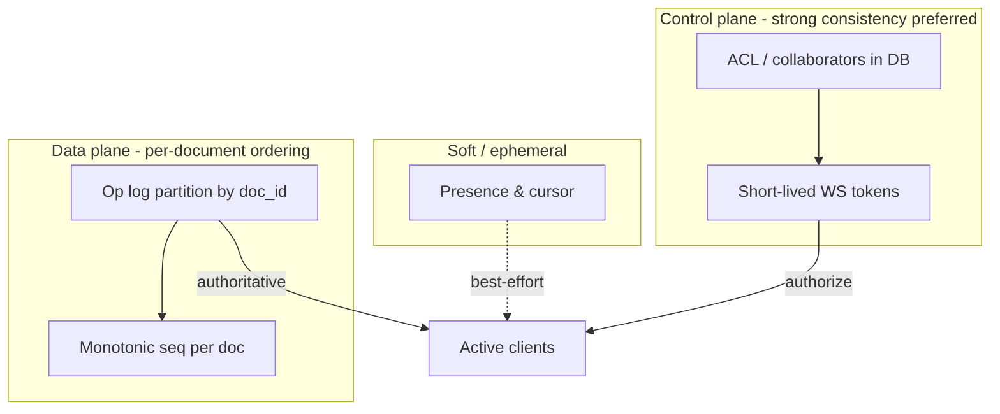
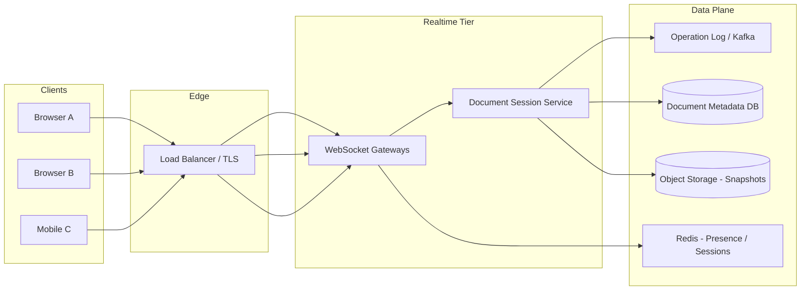
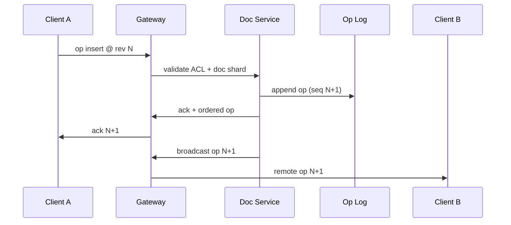
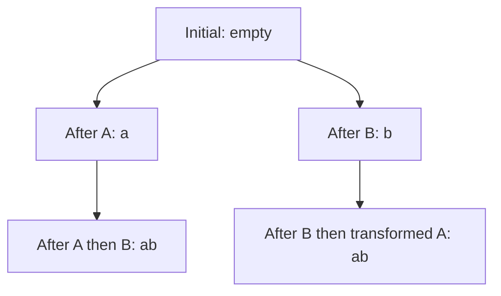
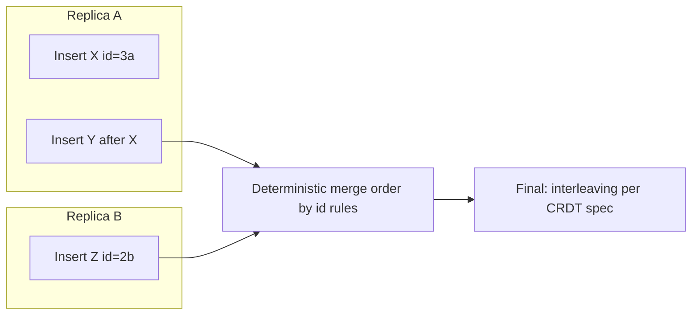
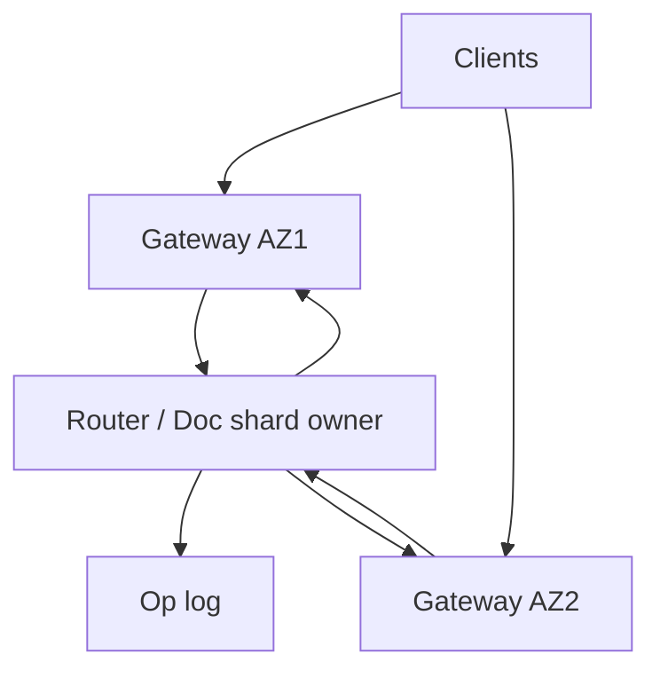
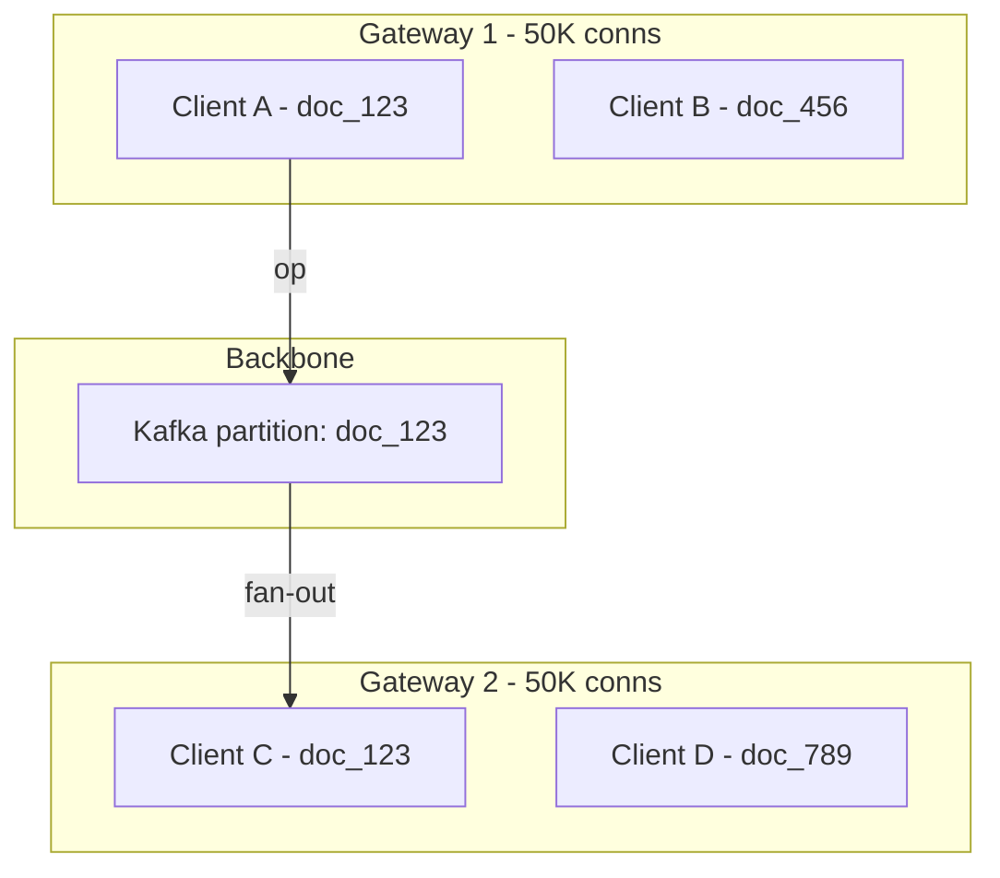

# Collaborative Editor (Google Docs)

---

## What We're Building

A **multi-user collaborative document editor** where many clients edit the same logical document concurrently, see each other's cursors and selections in near real time, and converge to a consistent shared state despite network latency, reordering, and intermittent connectivity—similar in spirit to Google Docs, Notion live blocks, or Figma multiplayer (documents vs canvas).

**Core capabilities in scope:**

- Real-time propagation of edits to all active collaborators with low perceived latency
- Conflict-free or safely resolved concurrent edits (the **OT vs CRDT** decision is central)
- Durable document storage, revision history, and restore/audit
- Presence: active users, cursor positions, and selection ranges (ephemeral, high churn)
- Permissions: owner, editor, commenter, viewer; link sharing; optional organization policies
- Offline editing with eventual sync and explicit conflict handling where the product requires it

### Why Collaborative Editors Are Hard

| Challenge | Description |
|-----------|-------------|
| **Correctness under concurrency** | Two users typing "at the same time" must not corrupt the document; naive last-write-wins breaks intent |
| **Latency sensitivity** | Humans notice typing lag; batching and server round-trips must be budgeted carefully |
| **Stateful sessions** | WebSockets and document routing; sticky affinity vs state migration on failures |
| **Operational complexity** | Transform functions (OT) or CRDT implementations are subtle; bugs are data corruption |
| **Storage model** | Plain text vs rich text (blocks, marks); binary attachments usually delegated to object storage |
| **Privacy and compliance** | Real-time presence leaks activity; document ACLs must be enforced on every operation path |

### Real-World Scale (Order-of-Magnitude Signals)

| Product | Scale signal | Takeaway |
|---------|--------------|----------|
| **Google Workspace** | Billions of users; documents are a core surface | Regional capacity, abuse prevention, and storage at planetary scale |
| **Notion / Confluence** | Block models + permissions + search | Rich schema + indexing is as important as typing latency |
| **Figma** | CRDT-style multiplayer on structured data | Domain-specific replicated data types beat generic text OT for many apps |

!!! note
    In interviews, cite **orders of magnitude** and **dominant costs** (WebSocket fan-out, transform CPU, storage growth), not unverifiable exact product metrics.

### Comparison to Adjacent Systems

| System | Similarity | Difference |
|--------|------------|------------|
| **Chat** | WebSockets, presence, ordering concerns | Chat messages are usually append-only; documents need **inline concurrent edits** |
| **News feed** | Fan-out | Feed is read-optimized; editors are **write-heavy with fine-grained merges** |
| **CRUD API** | Persistence | REST alone cannot deliver **sub-100ms collaborative feel** without a sync channel |

---

## Step 1: Requirements

### Functional Requirements

| Requirement | Priority | Description |
|-------------|----------|-------------|
| Collaborative editing | Must have | Multiple users edit the same document; all see consistent text (or structured blocks) |
| Real-time sync | Must have | Edits propagate to active collaborators quickly via persistent bidirectional connections |
| Revision history | Must have | Snapshots or operation logs for undo, restore, audit |
| Cursor and selection presence | Must have | Show where others are working; ephemeral, high-frequency updates |
| Comments and suggestions | Should have | Anchored metadata; may be modeled as separate layers |
| Offline editing | Should have | Queue local ops; reconcile on reconnect (product-dependent) |
| Import/export | Nice to have | DOCX/PDF pipelines are often async workers + object storage |

### Non-Functional Requirements

| Requirement | Target | Rationale |
|-------------|--------|-----------|
| **Edit latency** | **&lt; 150 ms** perceived for active sessions (regional) | Above ~200–300 ms, typing feels "laggy" depending on UX |
| **Availability** | **99.9%–99.99%** for edit/sync path | Matches enterprise SaaS expectations; plan degraded modes |
| **Durability** | No acknowledged edit lost | Ack only after durable append (log/DB) or replicated write |
| **Consistency** | **Eventual convergence** for all clients; **strong per-document ordering** on server | Clients may temporarily diverge; must merge to identical state |
| **Scalability** | Horizontal connection tier; shard by document | Hot documents are a reality; isolate noisy neighbors |
| **Security** | TLS everywhere; ACL on connect and per-operation | Stolen session or WS token must not exfiltrate content |

!!! warning
    Do not promise **linearizable typing** across the globe. Real systems use **regional serving**, **single-writer sequencing per document** (common), or **CRDTs** with bounded staleness—pick one story and stay consistent.

### API Design

**Transports**

- **WebSocket** (or WebRTC data channel for P2P experiments; most products use WebSockets via a gateway) for: join document, submit operations, receive transformed/ordered ops, presence
- **HTTPS** for: auth, metadata, sharing UI, exports, large uploads to object storage

**Representative endpoints (illustrative names)**

| Operation | Method | Purpose |
|-----------|--------|---------|
| `POST /v1/sessions` | HTTP | Exchange OAuth/session cookie for **short-lived WS token** scoped to `doc_id` |
| `WS /v1/docs/{docId}/stream` | WebSocket | Bi-directional sync + heartbeat + backpressure |
| `GET /v1/docs/{docId}/revisions` | HTTP | Paginated history for timeline UI |
| `POST /v1/docs/{docId}:export` | HTTP | Start async export job (PDF/DOCX) |
| `PATCH /v1/docs/{docId}/acl` | HTTP | Update sharing: users, groups, link policy |

**WebSocket message envelope (conceptual)**

```json
{
  "v": 1,
  "id": "msg_01h2k9",
  "type": "op.submit",
  "doc_id": "doc_abc",
  "client_op_id": "ccli_xyz",
  "seq": null,
  "payload": { }
}
```

!!! tip
    Always carry a **client-generated op id** for idempotent application on retries. The server maps it to a monotonic **server sequence** for total order (if you use a log).

### Technology Selection & Tradeoffs

Picking technologies here is really picking **semantics** (how conflicts resolve), **transport shape** (who speaks first), **durability layout** (log vs document vs blob), and **where presence lives** (ephemeral vs durable). Interviewers reward tying each choice to **product constraints**: offline depth, rich text complexity, compliance, and ops maturity.

#### Conflict resolution: OT vs CRDT vs diff-merge vs locking

| Approach | How convergence works | Strengths | Weaknesses | Typical fit |
|----------|------------------------|-----------|------------|-------------|
| **OT (Operational Transform)** | Transform ops against each other under a **canonical order** (often server-assigned) so all clients apply equivalent effects | Mature for text editors; compact ops; strong **intention preservation** narrative | Transform implementation is error-prone; central ordering or careful engineering | Classic Google Docs–style; server-sequenced plain/rich text |
| **CRDT** | Deterministic merge rules (e.g., RGA, Yjs) so replicas converge without a single global order | **Offline-first**; natural reconnect; less “single sequencer” dependency | Tombstones/memory; undo/redo and schema evolution need discipline | Notion-like blocks, Figma-like structured state, mobile offline |
| **Diff-merge (3-way / patch)** | Compare states or diffs at sync time; merge overlapping regions with heuristics | Simple mental model for **infrequent** sync (e.g., config files) | Terrible for **fine-grained concurrent typing**; merge conflicts surface constantly | Not a primary engine for live co-editing; OK for coarse-grained sections |
| **Locking (pessimistic)** | Serialize edits via section/paragraph locks | Predictable; easy to explain | Awful UX at scale; doesn’t match “many cursors”; fails on flaky networks | Rare; maybe admin “checkout” modes |

!!! note
    **Interview anchor:** OT and CRDT both target **eventual convergence**; diff-merge and locking trade away real-time collaboration quality for simplicity.

#### Real-time transport: WebSocket vs WebRTC vs SSE

| Transport | Direction | Strengths | Weaknesses | When to choose |
|-----------|-----------|-----------|------------|----------------|
| **WebSocket** | Full duplex | Low overhead after upgrade; natural **op + ack** loop; ubiquitous infra (L7 LB, gateways) | Stateful connections; sticky routing/drain; proxy timeouts need tuning | **Default** for doc sync, presence on same pipe |
| **WebRTC (Data Channel)** | P2P duplex | Can reduce server relay latency in true P2P topologies | NAT/signaling complexity; enterprise firewalls; harder ACL enforcement at wire | Experiments, local mesh, or hybrid **relay fallback** |
| **SSE** | Server → client only | Simple; HTTP/2 multiplexing | **Cannot** send edits upstream on same channel; need parallel HTTP for submits | Live **notifications** or read-only tailing; not enough for bidirectional editing |

#### Document storage: PostgreSQL vs MongoDB vs append-only log vs S3 (snapshots)

| Store | What it’s good for | Trade-offs |
|-------|---------------------|------------|
| **PostgreSQL** | **Metadata**, ACLs, titles, pointers to snapshot keys, **materialized read models** for search | Strong transactions; not ideal as the **only** home for multi-GB op streams |
| **MongoDB** | Flexible **document JSON** (blocks), nested comments metadata | Good for hierarchical docs; still pair with a **log** for ordered ops at high write rates |
| **Append-only log (Kafka / durable journal)** | **Per-doc ordered ops**, replay, audit; partition key = `doc_id` | Retention/compaction policy is a product decision; not a human-query store by itself |
| **S3 (object store)** | **Snapshots**, exports, cold revision blobs | High latency vs DB; **eventual listing** consistency; perfect for WORM-style snapshot storage |

!!! warning
    In interviews, say clearly: **hot path** = append op to **durable ordered log** + async **snapshot** to object storage; **cold path** = rebuild from log tail + latest snapshot.

#### Presence and cursor: Redis Pub/Sub vs dedicated presence service vs peer-to-peer

| Option | Pattern | Strengths | Weaknesses |
|--------|---------|-----------|------------|
| **Redis Pub/Sub (or Streams)** | Gateways publish/subscribe per `doc_id` channel | Fast to ship; cross-gateway fan-out; familiar ops | Pub/Sub is **fire-and-forget** (no persistence by default); need careful **ACL** at subscribe |
| **Dedicated presence service** | Optimized for ephemeral state, region-local, optional CRDT for cursor ordering | Clear scaling story; isolation from doc sequencer | More services to own; must not become durability bottleneck |
| **Peer-to-peer** | Exchange cursors over WebRTC mesh | Low server load for presence | Hard to enforce **who may see whom**; inconsistent under NAT; rarely alone for enterprise |

**Our choice (illustrative):** **CRDT or OT** for merge (product-dependent: CRDT if offline is core; OT if central order fits the team), **WebSockets** through a gateway tier for bidirectional sync, **Kafka (or equivalent) + periodic snapshots to S3** for durability and fast catch-up, **PostgreSQL** for document metadata and collaborator ACLs, and **Redis Pub/Sub** (or a thin presence microservice backed by Redis) for **throttled** presence/cursor fan-out—because it separates volatile traffic from the **authoritative op log** while staying operationally simple.

---

### CAP Theorem Analysis

CAP is easy to misapply in interviews. For collaborative editors, the nuanced story is:

- **Local edits must feel available**: clients apply their own keystrokes immediately (**high A for the local session**).
- **Global linearizability** across regions for “every character everywhere at once” is **not** the goal; **eventual convergence** with explicit ordering or CRDT rules is.
- **Partition** (client ↔ server or region ↔ region): you either **buffer** (offline queue), **degrade** (read-only), or **merge later** (CRDT)—you do not “solve CAP,” you **choose user-visible behavior**.

| Subsystem | Consistency flavor under partition | Availability posture | Why it’s special |
|-----------|-----------------------------------|----------------------|------------------|
| **Operation log** | **Ordered per document** (single partition key); **strong ordering** within a partition | Writers target a **single doc leader** or partition; failover may introduce **epoch** bumps | This is the **source of truth** for “what happened” in OT-style systems |
| **Document state (materialized)** | **Eventual** behind the log; snapshot + tail | Reads can be **stale** briefly; catch-up uses `seq` | Optimized for query/search, not for per-keystroke linearizable reads |
| **Presence / cursor** | **Soft consistency**; last-write or CRDT-lite per session | Prefer **availability** of presence channel; **lossy** updates acceptable | Ephemeral; correctness is **privacy + membership**, not document text |
| **Permissions / ACL** | **Strong** on control plane when possible | If IAM store is partitioned, **fail closed** (deny) for new joins | **Security beats liveness** for new connections |



!!! tip
    **Answer template:** “We guarantee **strong per-document operation order** on the log partition; **eventual** materialized document state; **best-effort** presence; **fail-closed** ACL when in doubt.” That shows you separate **hard invariants** from **UX-soft paths**.

---

### SLA and SLO Definitions

SLAs are **contracts** (often external); **SLOs** are internal targets measured by **SLIs**. For collaborative editors, measure what users **feel** (typing, reconnect) and what they **trust** (nothing acknowledged is lost).

| Area | SLI (what we measure) | Example SLO | Notes |
|------|-------------------------|-------------|-------|
| **Operation propagation** | End-to-end time from **client send** to **remote collaborator receive** (or “apply ready”) | **p99 &lt; 300 ms**, **p95 &lt; 150 ms** within region | Separate **cross-region** SLO if you allow it; presence may have looser targets |
| **Document save durability** | Time from **server accept** to **durable append** (fsync / quorum ack) | **p99 &lt; 100 ms** to durable log; **0** acknowledged ops lost | Align with “ack after durable append” policy |
| **Collaboration session availability** | WS session **successful connect + keepalive** for authorized users | **99.9%** monthly (exclude client network) | Define **error budget** exclusions (browser sleep, VPN) |
| **Cursor / presence freshness** | Staleness of last rendered remote cursor vs source | **p95 &lt; 500 ms** under normal load; degrade to **2 Hz** under pressure | Product may allow **seconds** for huge docs |

**Error budget policy (illustrative):**

- **Monthly budget** tied to collaboration SLO (e.g., 99.9% → **43.2 minutes** downtime budget per month).
- If **propagation p99** burns budget for **7 consecutive days**, trigger: **reduce presence rate**, **shed noncritical features**, **page** on-call.
- **Durability SLO** is **non-negotiable**: any breach triggers **incident**, possible **pause releases**, and **freeze** risky migrations.
- **User-visible degradation order**: throttle presence → batch broadcasts → read-only mode for overloaded docs (if product allows) → never silently drop **acknowledged** ops.

!!! note
    Pair every SLO with **how you measure it**: synthetic probes for WS regions, **trace span** from gateway → sequencer → fan-out, and **reconciliation jobs** for durability (checksum snapshot vs replayed tail).

---

### Database Schema

The schema separates **durable document identity**, **authoritative ordering** (operation log), and **sharing**. Exact types vary by SQL dialect; below is **PostgreSQL-oriented** DDL that interviews can adapt.

**`documents`** — one row per logical doc; snapshot pointer supports fast hydrate.

```sql
CREATE TABLE documents (
  id              UUID PRIMARY KEY DEFAULT gen_random_uuid(),
  title           TEXT NOT NULL,
  owner_user_id   UUID NOT NULL,
  content_snapshot TEXT,                    -- optional denormalized plain text / serialized tree
  snapshot_version BIGINT NOT NULL DEFAULT 0, -- last compacted seq included in snapshot
  snapshot_s3_key TEXT,                     -- object storage key for large/binary snapshot
  current_version BIGINT NOT NULL DEFAULT 0,  -- last applied server sequence (monotonic)
  created_at      TIMESTAMPTZ NOT NULL DEFAULT now(),
  updated_at      TIMESTAMPTZ NOT NULL DEFAULT now()
);

CREATE INDEX idx_documents_owner ON documents (owner_user_id);
CREATE INDEX idx_documents_updated ON documents (updated_at DESC);
```

**`operation_log`** — append-only logical table (at scale, **partition by `doc_id`** or store in Kafka with this schema mirrored).

```sql
CREATE TABLE operation_log (
  doc_id        UUID NOT NULL REFERENCES documents (id) ON DELETE CASCADE,
  seq           BIGINT NOT NULL,            -- monotonic per doc
  operation     JSONB NOT NULL,             -- OT op, CRDT update, or binary-encoded payload
  author_user_id UUID NOT NULL,
  client_op_id  TEXT NOT NULL,              -- idempotency key from client
  created_at    TIMESTAMPTZ NOT NULL DEFAULT now(),
  PRIMARY KEY (doc_id, seq),
  UNIQUE (doc_id, client_op_id)
);

CREATE INDEX idx_op_log_doc_seq ON operation_log (doc_id, seq);
```

**`collaborators`** — ACLs for share UI and server-side enforcement.

```sql
CREATE TABLE collaborators (
  doc_id     UUID NOT NULL REFERENCES documents (id) ON DELETE CASCADE,
  user_id    UUID NOT NULL,
  permission TEXT NOT NULL CHECK (permission IN ('owner', 'editor', 'commenter', 'viewer')),
  granted_by UUID,
  granted_at TIMESTAMPTZ NOT NULL DEFAULT now(),
  PRIMARY KEY (doc_id, user_id)
);

CREATE INDEX idx_collab_user ON collaborators (user_id);
```

!!! tip
    Mention **why** `client_op_id` is unique per `doc_id`: retries after timeouts must not **double-apply** ops. For CRDT-heavy designs, `operation` may store **binary blobs**; keep **seq** for catch-up and **debuggability**.

---

## Step 2: Back-of-the-Envelope Estimation

### Assumptions (for arithmetic)

```
- MAU: 200 million
- Fraction actively editing/day: 10% → 20M editing sessions/day
- Average session length: 20 minutes (active typing bursts lower)
- Average typing burst: 5 characters/second during bursts; duty cycle 20% → ~1 char/s average per active editor
- Average op size (metadata + payload): 200 bytes (rich text ops are larger)
- Peak factor: 3× average during business hours (illustrative)
- Concurrent editors (peak): 2% of MAU simultaneously → 4M concurrent (upper-bound illustration)
```

### Operations per Second (Illustrative)

```
Average effective insert rate per active editor ≈ 1 char/s
20M sessions/day × 20 min × 60 s × 1 op/s ≈ 24 billion ops/day (if sustained—use as stress upper bound)

More conservative:
Peak concurrent editors: 4M × 1 op/s × 0.2 duty cycle ≈ 800k ops/s (illustrative)

Interview takeaway: hot documents concentrate load; **per-document serialization** or **sharded actors** matter more than global QPS.
```

### Storage Growth (Operation Log)

```
24B ops/day × 200 bytes ≈ 4.8 TB/day raw op log (upper-bound illustration)

Real products compact snapshots + retain finite history; binary assets live in object storage.
```

### WebSocket Connections

```
Peak concurrent connections ≈ concurrent editors × devices/session factor

Illustrative: 4M × 1.2 ≈ 4.8M concurrent WebSockets (stress mental model)

Connection memory dominates gateway fleet sizing (buffers, TLS, kernel tuning).
```

| Resource | Order of magnitude | Planning implication |
|----------|---------------------|----------------------|
| Ops/sec | Hundreds of thousands to low millions peak (global) | Hot keys; per-doc ordering; backpressure |
| WebSockets | Millions concurrent (large products) | Gateway tier, sticky routing, graceful drain |
| Storage | PB-scale with history + media | Tiered storage, compaction, legal hold |
| Egress | Fan-out to collaborators per op | Coalesce broadcasts; binary framing |

!!! note
    The **dominant interview discussion** is rarely raw QPS—it is **correctness (OT vs CRDT)**, **ordering**, and **failure modes** (reconnect, duplicate ops).

---

## Step 3: High-Level Design

At a high level, clients maintain a local model (text index or CRDT structure). They send **operations** to a **document service** that assigns a canonical order (or merges via CRDT), persists to an **operation log**, and **fans out** to other subscribers. **Presence** uses a separate high-churn channel or lightweight messages on the same socket. **Object storage** holds snapshots and large blobs.



**Request path (happy path)**

1. Client authenticates; receives scoped token; opens WebSocket to a gateway mapped to a **document shard**.
2. Client sends `op` with vector clock or revision basis (OT) or CRDT payload.
3. Session service validates ACL, assigns **server sequence number** (if using OT with central ordering), persists op, transforms if needed, broadcasts to subscribers.
4. Clients apply remote ops locally; UI updates.



!!! tip
    Separate **transport** (gateway) from **document correctness** (service). Gateways should be restartable; session state is either sticky with recovery or fully reconstructable from the log.

---

## Step 4: Deep Dive

### 4.1 Conflict Resolution: OT vs CRDT

This is the **primary trade-off interviewers probe**.

| Dimension | Operational Transformation (OT) | CRDTs (e.g., RGA, Yjs, Automerge) |
|-----------|----------------------------------|-----------------------------------|
| **Core idea** | Transform ops against each other so order respects intent | Data structure + merge rules guarantee convergence without central ordering |
| **Server role** | Often **sequential per document** (canonical order) | Can be peer-to-peer; servers help with durability and fan-out |
| **Pros** | Mature for plain text; smaller ops for simple editors | Strong eventual consistency; offline-first; less central bottleneck |
| **Cons** | Correctness of transform functions is hard; edge cases multiply with rich text | Memory overhead; tombstones; more complex UX for undo/redo in some models |
| **Offline** | Typically harder; may need replay + transform storms | Natural fit; merge on reconnect |

!!! warning
    Avoid absolutes. **Google Docs historically leaned on OT-class techniques with careful engineering**; many modern apps use **CRDT libraries** for faster feature velocity. Interview credit comes from **clear criteria**: team expertise, offline requirements, rich schema, audit needs.

**When interviewers push:** articulate **invariants**:

- **Causality**: if op B depends on op A, apply order respects dependency
- **Convergence**: all participants eventually reach identical state
- **Intention preservation** (OT terminology): transformed ops preserve user intent as much as possible

### 4.2 Operational Transformation (OT)

Classic OT keeps a **document state** and represents changes as operations relative to a revision. When concurrent ops arrive, the system computes transforms so both sides apply equivalent effects.

Consider two insertions at what locally looked like the same index before learning about the other:

- User A inserts `"a"` at index 0
- User B inserts `"b"` at index 0

A central ordering might process A then B. B's insert must shift to index 1 after A's insert is applied (and symmetrically for the other order).



**Java: simplified OT transform for insert/insert on plain text**

Two operations `Oa` and `Ob` are transformed against each other to produce `Oa'` and `Ob'` such that applying in either order yields the same final text (under the chosen framework's rules). The following illustrates the **index adjustment** pattern only; production OT includes delete/delete, retain spans, rich attributes, and extensive tests.

```java
public final class OtInsert {
  public final int pos;
  public final String text;

  public OtInsert(int pos, String text) {
    this.pos = pos;
    this.text = text;
  }

  /** Returns transformed remote op after local op is applied first. */
  public OtInsert transformAgainstInsert(OtInsert remote) {
    if (remote.pos < this.pos) {
      return new OtInsert(this.pos + remote.text.length(), this.text);
    }
    if (remote.pos > this.pos) {
      return this;
    }
    // Tie-break: stable rule (e.g., by client id) — required in real systems
    return new OtInsert(this.pos + remote.text.length(), this.text);
  }
}
```

!!! note
    Real OT suites (e.g., for rich text) are **thousands of tests** and careful tie-breaking. Interview answer: "I'd start from a proven library or a minimal op model and add property-based tests."

### 4.3 CRDTs for Collaborative Editing

CRDTs attach **metadata** to inserts so concurrent inserts at the same position converge deterministically. Example family: **Replicated Growable Array (RGA)** uses unique identifiers and a tombstone for deletes.

**Python: conceptual RGA insert with unique id**

```python
from dataclasses import dataclass
from typing import List, Optional
import uuid

@dataclass(frozen=True)
class RgaId:
    ts: int          # logical/physical clock component
    node: str        # unique replica id

@dataclass
class Atom:
    id: RgaId
    ch: str
    deleted: bool = False

class RgaDoc:
    def __init__(self) -> None:
        self.atoms: List[Atom] = []

    def insert_after(self, after: Optional[RgaId], ch: str, me: str) -> RgaId:
        rid = RgaId(ts=self._next_ts(), node=me)
        atom = Atom(id=rid, ch=ch)
        if after is None:
            self.atoms.insert(0, atom)
        else:
            idx = next(i for i, a in enumerate(self.atoms) if a.id == after)
            self.atoms.insert(idx + 1, atom)
        return rid

    def delete(self, target: RgaId) -> None:
        for a in self.atoms:
            if a.id == target:
                a.deleted = True

    def _next_ts(self) -> int:
        return (self.atoms[-1].id.ts + 1) if self.atoms else 0

    def text(self) -> str:
        return "".join(a.ch for a in self.atoms if not a.deleted)
```

!!! warning
    The snippet is **educational**, not production-complete. Real RGA uses careful **ordering keys**, **tombstone compaction** policies, and **clock** strategies.

**Merge intuition (mermaid)**



### 4.4 WebSocket Connection Management

Production WebSockets require:

| Concern | Technique |
|---------|-----------|
| **Authentication** | Short-lived JWT in query/header; rotate on reconnect |
| **Heartbeats** | App-level ping/pong; detect half-open connections |
| **Backpressure** | Per-connection queues; drop presence before dropping edits under stress |
| **Sticky routing** | Same doc session often pinned to a gateway or can be stateless if service is externalized |
| **Reconnect storm** | Jittered exponential backoff; snapshot + catch-up from last `seq` |

**Go: minimal hub fan-out (illustrative)**

```go
package realtime

import "sync"

type Hub struct {
	mu      sync.RWMutex
	chans   map[string]map[chan []byte]struct{} // docID -> subscribers
}

func (h *Hub) Subscribe(docID string) chan []byte {
	ch := make(chan []byte, 64)
	h.mu.Lock()
	if h.chans[docID] == nil {
		h.chans[docID] = map[chan []byte]struct{}{}
	}
	h.chans[docID][ch] = struct{}{}
	h.mu.Unlock()
	return ch
}

func (h *Hub) Broadcast(docID string, msg []byte) {
	h.mu.RLock()
	defer h.mu.RUnlock()
	for ch := range h.chans[docID] {
		select {
		case ch <- msg:
		default:
			// Drop or close slow consumers; policy is product-specific
		}
	}
}
```

!!! tip
    For multi-region, consider **global doc routing** with regional primary, or **CRDT-first** clients that can tolerate partitioned merges with clear UX.

**WebSocket architecture (mermaid)**



### 4.5 Document Storage and Versioning

Common pattern: **operation log** (Kafka or replicated append-only) + **periodic snapshots** to object storage for fast restarts and reduced replay time.

| Approach | Pros | Cons |
|----------|------|------|
| **Log-only** | Simple; full audit | Replay cost grows; needs compaction |
| **Snapshot + log tail** | Fast cold start | Snapshot coordination; consistency points |
| **CRDT durable state** | Good for offline merges | Larger stored state; tombstones |

**Revision API**: clients request `from_seq` catch-up; server returns ops or a snapshot marker + diff.

### 4.6 Cursor and Presence Tracking

Presence is **ephemeral** and **high volume**. Typical strategies:

- Throttle to **5–10 Hz** per client; quantize cursor to glyph/cluster indices
- Separate **binary** or compact protobuf frames for cursor-only updates
- Store **nothing durable** for cursors; optional analytics in sampled form

**Permission coupling**: presence must not leak users who lack access; validate doc membership before subscription.

### 4.7 Offline Support and Sync

| Stage | Behavior |
|-------|----------|
| **Queue locally** | Store ops in IndexedDB/SQLite with client op ids |
| **Reconnect** | Send basis revision; server returns transformed ops or CRDT merge |
| **Conflict UX** | For OT systems, surface rare conflicts explicitly; CRDTs reduce hard conflicts but not semantic ones |

!!! note
    True offline-first is a **product commitment**. If you only need "flaky network tolerance," batching + reconnect + idempotency may suffice without full offline editing.

### 4.8 Access Control and Sharing

**Model (illustrative)**

| Role | Capabilities |
|------|--------------|
| Owner | Delete doc, transfer ownership, share, edit ACL |
| Editor | Edit body, comment |
| Commenter | Comment only |
| Viewer | Read-only |

**Enforcement points**

- **HTTP** for sharing changes
- **WebSocket connect**: token must include `doc_id` + role
- **Every op**: re-check if tokens can be long-lived; prefer short WS tokens

**Link sharing**: generate unguessable link tokens; optional password; domain restriction for enterprise.

---

## Step 5: Scaling & Production

| Technique | Purpose |
|-----------|---------|
| **Shard by document id** | Isolate hot docs; cap blast radius |
| **Single sequencer per shard** (OT-style) | Simplifies total order; bottleneck is acceptable for single doc |
| **Kafka partitioning** | Partition key = `doc_id` preserves per-doc ordering |
| **Snapshot workers** | Compact logs; rebuild indexes |
| **Rate limits** | Abuse protection on op flood |
| **Observability** | Trace id per op; metrics: apply latency, transform errors, reconnect rate |

**Failure modes**

- Gateway crash: clients reconnect to any gateway; resume from last `seq`
- Sequencer stall: health checks; failover with epoch bump; clients rotate tokens
- Partial partitions: prefer **availability of editing** with clear divergence bounds (CRDT) or **hard stop** (strict OT with central order)

---

## Interview Tips

!!! tip
    Start with **requirements** and **data model** (plain text vs blocks). Immediately signal you know **OT vs CRDT** is the core trade-off.

**Good signals**

- Separate **transport**, **ordering**, and **merge semantics**
- Discuss **idempotency** and **reconnect** before algorithms
- Name **hot document** problem and **per-doc shard**
- Acknowledge **rich text** complexity explicitly

**Bad signals**

- "WebSockets for everything" without **authz** and **ordering**
- "Last write wins" for concurrent edits
- Ignoring **presence** as a noisy-neighbor on the same channel

---

## Interview Checklist

| Topic | Talking points |
|-------|----------------|
| Requirements | Real-time sync, history, presence, sharing, offline depth |
| NFR | Latency targets, availability, durability, regional reality |
| API | WS token, HTTP ACL, export async jobs |
| Estimation | Concurrent editors, op rate, WS memory, storage growth |
| HLD | Gateways, doc service, op log, snapshots, object storage |
| OT vs CRDT | Convergence, offline, server role, complexity |
| Deep dives | Transform correctness OR CRDT merge rules; presence throttling |
| Scaling | Shard by doc, Kafka partitions, hot doc mitigation |
| Failure | Reconnect, duplicate ops, partition behavior |

---

## Sample Interview Dialogue

**Interviewer:** How would you synchronize edits in Google Docs?

**Candidate:** I'd clarify the data model—plain text vs rich text blocks—and whether offline editing is required. Real-time sync usually uses WebSockets. The core is concurrency control: I'd compare **Operational Transformation** with a central order versus **CRDTs** with deterministic merge. OT gives a long history in editors but needs careful transform functions; CRDTs fit offline-first and reduce reliance on a single ordering service but add memory and complexity for undo and schema.

**Interviewer:** Where does the server fit?

**Candidate:** Even with CRDTs, I'd still use a server for **authorization**, **durability**, and **fan-out**. The server may not need to assign total order for CRDT merges, but it must validate tokens and persist operations or periodic snapshots. For OT, a per-document sequencer or single writer for the doc shard is typical to keep transforms tractable.

**Interviewer:** How do you handle reconnects?

**Candidate:** Clients keep the last applied **server sequence** or CRDT state vector. On reconnect, they request ops after that sequence or exchange merged states. Ops carry **client ids** for idempotent replay. Presence streams reset independently.

**Interviewer:** How do you scale a celebrity document?

**Candidate:** Shard by `doc_id` so one hot document maps to a dedicated partition. Cap fan-out work per op: batch UI updates, throttle presence, and consider read-only mode for overload if product allows. Monitor gateway and sequencer health.

---

## Summary

- Collaborative editors combine **real-time networking** with **hard distributed systems semantics**; the flagship discussion is **OT vs CRDT** with explicit convergence and offline requirements.
- Use **WebSockets** for low-latency bidirectional sync; enforce **ACLs** at connection and operation submission.
- Persist with an **operation log** plus **snapshots**; catch-up via **sequence** or **state vectors**.
- Model **presence** as ephemeral, throttled traffic on the same or parallel channel.
- Scale by **document sharding**, **ordered partitions**, and **isolating hot documents**.

---

## Staff Engineer (L6) Deep Dive

The sections above cover the standard collaborative editor design. The sections below cover **Staff-level depth** that distinguishes an L6 answer. See the [Staff Engineer Interview Guide](staff_engineer_expectations.md) for the full L6 expectations framework.

### OT vs CRDT: The Decision Framework (Beyond "Pros and Cons")

At L6, don't just list trade-offs. Articulate a **decision framework** based on your system's constraints:

| Constraint | Favors OT | Favors CRDT |
|------------|-----------|-------------|
| **Offline editing is a core product requirement** | | Strong choice: CRDTs merge offline edits naturally |
| **Rich text with complex schema (tables, embeds)** | OT can leverage simpler transform functions on structured ops | CRDTs for complex schemas are still an active research area |
| **Team has OT expertise** | Lower risk; known bugs and mitigations | |
| **Peer-to-peer architecture** | Requires central server for total ordering | Designed for decentralized merge |
| **Undo/redo semantics matter** | Well-understood in OT literature | CRDT undo is subtle; may require "undo CRDTs" |
| **Audit trail / compliance** | Central log with server-assigned sequence | Requires additional logging layer |

!!! tip
    **Staff-level answer:** *"For a greenfield product targeting enterprises with offline editing requirements, I'd choose CRDTs (e.g., Yjs or Automerge). For a product extending an existing OT-based editor like Google Docs, the cost of migration outweighs the architectural benefit—I'd invest in hardening the OT transform functions and adding better offline queuing."*

### WebSocket Connection Management at Scale

| Challenge | L5 Answer | L6 Answer |
|-----------|-----------|-----------|
| **Connection routing** | "Sticky sessions via load balancer" | "Consistent hash on `doc_id` for gateway affinity; drain connections on deploy with 30s grace period; clients reconnect with jittered backoff" |
| **Connection limit** | "Use more servers" | "Each gateway handles ~50K connections (kernel tuning: `net.core.somaxconn`, `ulimit -n`); autoscale on connection count; connection memory = ~10KB/conn × 50K = 500MB per node" |
| **Reconnect storms** | "Retry" | "After a gateway crash, 50K clients reconnect simultaneously. Use jittered exponential backoff (base 500ms, max 30s) and a token bucket at the gateway to admit reconnections gradually" |
| **Cross-gateway fan-out** | Not discussed | "If collaborators on the same doc land on different gateways, use Redis Pub/Sub or a Kafka topic partitioned by `doc_id` for inter-gateway broadcast" |



### Hot Document Problem (Celebrity Document)

When a single document has thousands of concurrent editors (e.g., a company all-hands notes doc):

| Mitigation | Mechanism |
|------------|-----------|
| **Read-only fan-out** | Promote doc to read-only for most; only designated editors can write |
| **Batched broadcasts** | Coalesce ops into 100ms batches before fan-out; reduces per-op overhead |
| **Hierarchical fan-out** | Single sequencer → N relay nodes → clients; avoids single-node fan-out bottleneck |
| **Presence throttling** | Reduce cursor update frequency from 10Hz to 2Hz for docs with > 100 editors |
| **Document sharding** | For structured docs (blocks/pages), shard sequencing by section |

### Multi-Region Deployment

| Model | Description | Trade-off |
|-------|-------------|-----------|
| **Single-region primary** | All writes route to one region; replicas serve read-only catches up | Higher write latency for remote users; simpler consistency |
| **Follow-the-leader per document** | Each doc's primary region is the creator's region; migrate on ownership change | Low write latency for active editors; migration complexity |
| **CRDT with regional merge** | Each region accepts writes locally; merge asynchronously | True multi-region writes; conflict-free but higher storage overhead |
| **Active-active with OT** | Requires cross-region consensus per op | Highest correctness; highest latency; usually impractical at scale |

!!! note
    Google Docs uses a form of single-region primary per document with regional routing. This is a pragmatic choice—most documents have collaborators in the same timezone.

### Operational Excellence

| SLI | Target | Why |
|-----|--------|-----|
| Op apply latency (client-perceived) | < 150ms p95 | Above 200ms typing feels laggy |
| Op persistence latency | < 50ms p99 | Ack must be durable before confirming to client |
| Reconnect success rate | > 99.5% within 10s | Lost reconnects = lost edits |
| Transform error rate | 0 | Any transform bug = data corruption |
| Snapshot freshness | < 5 minutes | Stale snapshots increase replay time on reconnect |

### System Evolution

| Phase | Architecture |
|-------|-------------|
| **Year 0** | Single-region OT with central sequencer per doc; PostgreSQL for metadata; S3 for snapshots |
| **Year 1** | Add WebSocket gateway tier; Kafka for op log; snapshot workers for compaction |
| **Year 2** | Multi-region with follow-the-leader routing; add offline support with local IndexedDB queue |
| **Year 3** | Evaluate CRDT migration for offline-first mobile experience; block-level sharding for large docs |

---

_Last updated: 2026-04-05_
