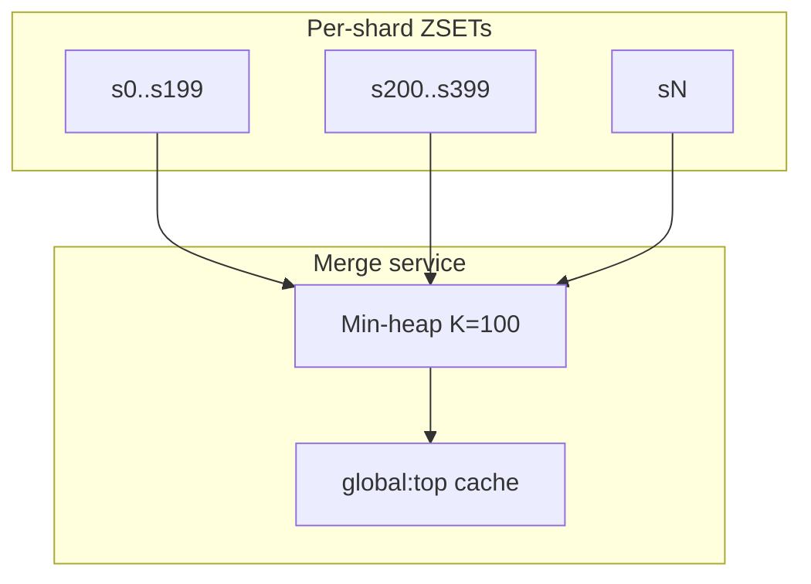
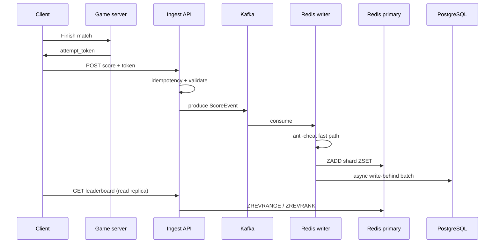
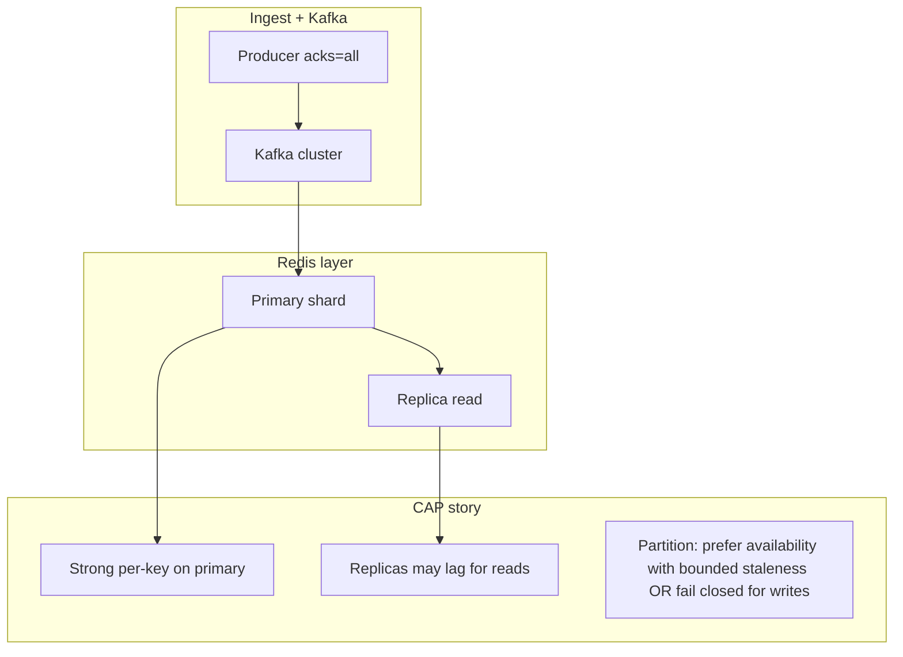
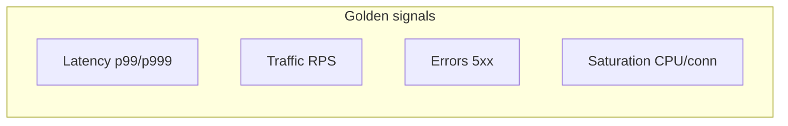

# Gaming Leaderboard

---

## What We're Building

We are designing a **multi-game, multi-mode leaderboard platform** that accepts **high-volume score submissions**, validates them for **fair play**, maintains **time-windowed** and **all-time** rankings at **planetary scale**, and serves **sub-millisecond read paths** for **top-N**, **player rank**, and **nearby competitors**—think **Fortnite**, **Clash Royale**, **Steam**, or **mobile competitive** ladders with daily/weekly seasons.

The hot path is **Redis Sorted Sets** (`ZSET`): each logical leaderboard is a sorted set where **score** maps to ordering and **member** is typically `player_id` (or a composite key when you need tie-breaks). **Time windows** are modeled as **separate ZSETs per window** (e.g., `leaderboard:{game}:{mode}:daily:{yyyyMMdd}`) with **TTL** for automatic retirement, plus **Kafka** for durable, replayable **score events** feeding **async** anti-cheat, **write-behind** persistence, and **batch** reconciliation. **Friend leaderboards** intersect the **social graph** (stored in PostgreSQL or a graph service) with per-player or shard-local candidate sets—never naïvely sorting the entire friend list in one Redis call at scale.

| Capability | Why it matters |
|------------|----------------|
| **Time-windowed boards** | Daily/weekly/monthly seasons drive engagement; **all-time** boards anchor prestige |
| **Redis ZSET operations** | `ZADD`, `ZRANK`, `ZREVRANGE`, `ZRANGEBYSCORE` give **O(log N)** updates and rank queries backed by **skip lists** |
| **Anti-cheat pipeline** | Invalid scores erode trust; **validation + replay + anomaly** layers before authoritative promotion |
| **Write-behind durability** | Redis is **fast** but not the sole source of truth for audits; **async** flush to PostgreSQL |
| **Sharding at 100M+ players** | Single ZSET per global board **does not scale**; partition by **game × mode × window × shard** |
| **Friend-relative views** | Social competition increases retention; requires **graph** + **constrained** Redis work |

!!! note
    In interviews, **separate** the **ingest path** (Kafka + validation + idempotency) from the **read path** (Redis replicas, optional edge cache). Say explicitly how you avoid a **single hot ZSET** for global “all players.”

---

## 1. Requirements Clarification

### Functional Requirements

| ID | Requirement | Detail |
|----|-------------|--------|
| **F1** | **Submit score** | Client sends score for `(game_id, mode_id, session_id)` with server-issued **attempt token** |
| **F2** | **Idempotent submission** | Duplicate `(player_id, attempt_id)` does not double-apply |
| **F3** | **Aggregation modes** | Configurable per mode: **highest**, **sum**, **latest** (and tie-break rules) |
| **F4** | **Time windows** | **Daily**, **weekly**, **monthly**, **all-time** boards; timezone policy per game/region |
| **F5** | **Top-N** | Return top **K** (e.g., 100) for a board with **stable** tie ordering |
| **F6** | **Player rank** | **Global** rank and **window** rank; handle unranked/new players |
| **F7** | **Nearby players** | “Players around my rank” (e.g., ±10) without scanning full ZSET |
| **F8** | **Friend leaderboard** | Rank **only** among accepted friends (or guild), with reasonable freshness |
| **F9** | **Multi-game / multi-mode** | Isolated namespaces; no cross-game leakage |
| **F10** | **Admin & audit** | Ban/suspend, score rollback, replay inspection |

### Non-Functional Requirements

| NFR | Target (illustrative) | Rationale |
|-----|------------------------|-----------|
| **Scale** | **10M DAU**, **50K** score writes/sec peak, **500K** reads/sec peak | Season launches and viral modes spike traffic |
| **Write latency (p99)** | **&lt; 50 ms** accepted → Kafka ack path; **&lt; 5 ms** Redis update on hot path after validation | Async validation can soften tail |
| **Read latency (p99)** | **&lt; 10 ms** from regional Redis **replica** for rank/top-N | UI polls frequently |
| **Durability** | **At-least-once** events in Kafka; **write-behind** sync to PostgreSQL within **seconds–minutes** | Audits and finance-adjacent disputes |
| **Consistency** | **Eventual** across regions for global boards; **strong** per shard on primary Redis | CAP trade-offs per subsystem |
| **Availability** | **99.95%** API tier; **degraded** read from stale replica acceptable if bounded |
| **Fairness** | **Fraud rate** driven below product threshold via layered detection |

### Out of Scope

- **Real-time matchmaking** and **game session** hosting (upstream services own those)
- **Cross-title unified identity** beyond documented **account linking** APIs
- **Player-to-player wagering** or **real-money** prize settlement (would add regulatory scope)
- **Full client kernel anti-tamper** (assume platform SDK hooks exist)
- **On-device ML** for cheat detection (server-side features only here)

---

## 2. Back-of-Envelope Estimation

### Traffic

| Signal | Calculation | Order of magnitude |
|--------|-------------|-------------------|
| **DAU** | Given | **10M** |
| **Active hours / day** | Assume **2 h** play per DAU | — |
| **Score events / player / hour** | Competitive title: **30–120** (varies by mode) | Take **60** for planning |
| **Raw events / sec (average)** | \(10^7 \times 60 / 3600\) | **~167K/s** average |
| **Peak / average** | Season spike **10×** | **~1.67M/s** raw client events (before filtering) |
| **Server-accepted submissions / sec** | Product + validation drops **~3%**; peak design **50K/s** | **50K/s** (given NFR) |

!!! tip
    Separate **client telemetry** (noisy) from **authoritative score submissions** (fewer). Many events never become ZSET updates.

### Reads

| Read pattern | Assumption | QPS |
|--------------|------------|-----|
| **Leaderboard page loads** | 10M DAU × **20** polls/day × **3** boards | **~7K/s** average |
| **Peak factor** | **~70×** average during events | **~500K/s** (matches NFR) |
| **Per-request Redis ops** | **1–3** (`ZREVRANGE`, `ZRANK`, `ZSCORE`) | Design for **1.5M** Redis cmd/s peak with pipelining |

### Storage (Redis — rough)

| Item | Formula | Estimate |
|------|---------|----------|
| **Players per shard ZSET** | 100M players / **10K** shards | **~10K** members/ZSET (tunable) |
| **Bytes / entry** | member UUID (16) + score (8) + overhead | **~64–128 B** effective |
| **One daily board shard** | 10K × 100 B | **~1 MB** |
| **All windows × games × modes** | Highly config-dependent | **TB-scale** aggregate at max retention → **tiered TTL** + archival |

### Storage (PostgreSQL — authoritative metadata + audit)

| Table group | Rows | Notes |
|-------------|------|-------|
| **Players, games, modes** | **10M+**, **1K** games, **10** modes/game | Small vs scores |
| **Score attempts (audit)** | Append-only; **50K/s** × **86.4K** sec/day | **~4.3B rows/day** at absolute peak if logging everything—**sample** + **rollup** in practice |
| **Practical audit** | Store **accepted** + **flagged** + **hourly aggregates** | Partition by day; cold storage to object store |

### Bandwidth (API → client)

| Payload | Size | At 500K reads/s |
|---------|------|-----------------|
| **Top-100 JSON** | **~8–20 KB** | **4–10 GB/s** aggregate → requires **compression**, **pagination**, **edge caching** |

---

## 3. High-Level Design

### System Architecture

```
                         +------------------+
                         |   CDN / Edge     |
                         | (optional cache) |
                         +--------+---------+
                                  |
                         +--------v---------+
                         |  API Gateway     |
                         |  + Auth (JWT)    |
                         |  + Rate limits   |
                         +--------+---------+
                                  |
        +-------------------------+-------------------------+
        |                         |                         |
        v                         v                         v
 +-------------+          +---------------+          +-------------+
 | Score       |          | Leaderboard   |          | Social /    |
 | Ingest Svc  |          | Read Svc      |          | Friends API |
 +------+------+          +-------+-------+          +------+------+
        |                         |                         |
        v                         v                         |
 +-------------+          +---------------+                 |
 | Anti-cheat  |          | Redis Cluster |<----------------+
 | Workers     |          | (ZSET shards) |
 +------+------+          +-------+-------+
        |                         ^
        v                         | write-behind
 +-------------+          +------+------+
 | Kafka       |          | Persist    |
 | (score      |--------->| Workers    |
 |  topics)    |          +------+------+
 +-------------+                 |
                                 v
                          +---------------+
                          | PostgreSQL    |
                          | (profiles,    |
                          |  audit, graph)|
                          +---------------+
```

### Component Overview

| Component | Responsibility | Primary tech |
|-----------|----------------|--------------|
| **API Gateway** | AuthN/Z, throttling, request routing | Envoy / Kong / cloud LB |
| **Score Ingest Service** | Validate tokens, attach idempotency keys, produce to Kafka | Stateless containers |
| **Kafka** | Durable **score-event** log, replay, fan-out to workers | Managed Kafka |
| **Validation / Anti-cheat** | Rules engine, replay checks, anomaly scoring | Stream processors + state stores |
| **Redis Cluster** | **ZSET** leaderboards per shard/window; replicas for reads | Redis 7+ / ElastiCache |
| **Write-behind workers** | Batch **ZADD** outcomes + metadata to PostgreSQL | Consumer groups |
| **PostgreSQL** | Player profiles, game/mode config, friendships, audit trail | RDS / Cloud SQL |
| **Friend rank service** | Compose friend IDs with per-player Redis lookups | App tier + graph cache |

### Core Flow

1. **Client** completes a match; **game server** issues signed **attempt token** `(attempt_id, score_cap, expiry)`.
2. **Score Ingest** verifies signature, **idempotency** key, and **basic** sanity (bounds, mode).
3. **Kafka** append of `ScoreEvent` with key = `shard_key` for ordering where needed.
4. **Anti-cheat** consumers evaluate **velocity**, **statistical** plausibility, optional **replay** hash from object store.
5. On **accept**, **Redis primary** applies **`ZADD`** to the correct **window ZSET** (and **all-time** if configured) using **aggregation strategy** (max/sum/last).
6. **Write-behind** batch flushes **accepted** rows to **PostgreSQL** for audit and analytics.
7. **Read path** hits **Redis replica** (same AZ/region) for `ZREVRANGE` / `ZRANK` / nearby range.
8. **Friend leaderboard**: fetch **friend_ids** from graph store → **pipeline** `ZSCORE`/`ZRANK` or maintain **materialized mini-boards** for heavy users.

---

## 4. Detailed Component Design

### 4.1 Score submission pipeline and Kafka partitioning

**Topic design:** `score.events.v1` with **key** = `hash(game_id, mode_id, window_id, shard_id)` to preserve **per-shard** ordering (not global). Use **Avro/Protobuf** schemas with **`attempt_id` UUID** and **monotonic** `server_ts`.

**Idempotency:** maintain **`IdempotencyStore`** in Redis: `SET idemp:{player_id}:{attempt_id} 1 NX EX 86400`. If key exists, return **200** with prior outcome.

**Ordering of work:** **fast reject** (signature, bounds) before Kafka; **heavy** ML goes to **async** topic `score.antifraud.v1` without blocking the player notification path if product allows **provisional** acceptance.

| Stage | Latency budget | Failure mode |
|-------|----------------|--------------|
| Gateway + auth | **1–3 ms** | 401/403 |
| Ingest validation | **3–10 ms** | 400 |
| Kafka produce | **2–20 ms** | 503 + client retry |
| Redis ZADD (async path) | **&lt; 5 ms** after consumer | lag metric |

### 4.2 Redis sorted sets — operations and score encoding

Redis **ZSET** maps **member → score** (double). **ZRANK** is **0-based from low to high**; for **descending** leaderboards use **`ZREVRANK`** and **`ZREVRANGE`**.

| Operation | Use |
|-----------|-----|
| **`ZADD key score member`** | Upsert score; with **GT/LT** options (Redis 6.2+) for **max-only** or **min-only** updates |
| **`ZRANK` / `ZREVRANK`** | Absolute rank |
| **`ZREVRANGE key start stop WITHSCORES`** | Top-N |
| **`ZRANGEBYSCORE key min max WITHSCORES LIMIT`** | Score bands; tie resolution |
| **`ZCOUNT`** | Population in score range |

**Tie-break:** floats can collide. Common pattern: encode **composite score** as **64-bit integer** — `score_int = (raw_score * 1_000_000) + (max_ts - event_ts)` so **earlier** achievement wins when raw scores tie (invert sign as needed).

**Skip list internals (why log N):** Redis ZSET is implemented as a **skip list** — a probabilistic multi-level linked list with **O(log N)** search/insert on average. Each node promotes to upper levels with probability **p**, yielding **~log_{1/p}(N)** expected levels. This is why **`ZADD`** and **`ZRANK`** stay cheap at large **N**, unlike naive sorted arrays.

```
Level 3:  head ------------------------>  tail
Level 2:  head ------> node ------> node --> tail
Level 1:  head -> n1 -> n2 -> n3 -> n4 -> tail
Level 0:  full linked list in order
```

### 4.3 Time-windowed leaderboards and TTL

**Key naming:**

```
lb:{game_id}:{mode_id}:daily:{yyyyMMdd}:s{shard}
lb:{game_id}:{mode_id}:weekly:{iso_week}:s{shard}
lb:{game_id}:{mode_id}:monthly:{yyyyMM}:s{shard}
lb:{game_id}:{mode_id}:alltime:s{shard}
```

**Shard selection:** `shard = hash(player_id) % NUM_SHARDS` — consistent hashing ring for **Redis cluster** slots.

**TTL:** `EXPIRE` daily boards after **7 days**, weekly after **90 days**, etc. **Archive** cold windows to **S3 Parquet** via nightly jobs reading from PostgreSQL or **Redis SCAN** + export (prefer **DB truth** for replay).

**Timezone:** store **`window_id` in UTC** but compute **calendar boundaries** using **`game.region_tz`** in the ingest service to avoid “wrong day” disputes.

### 4.4 Aggregation strategies (highest, sum, latest)

| Strategy | Redis pattern | Caveat |
|----------|---------------|--------|
| **Highest** | `ZADD ... GT` (Redis 6.2+) or Lua: read-compare-write | Ensure **monotonic** client scores |
| **Sum** | `ZINCRBY key increment member` | **Overflow** risk — use **scaled integers** |
| **Latest** | `ZADD` with **score = ts** composite + tie-breaker | “Last run wins” may feel unfair—product decision |

**Batch vs real-time:**

| Mode | Behavior |
|------|----------|
| **Real-time** | Every accepted event updates Redis immediately (default competitive) |
| **Batch** | Accumulate in **Flink** or **Redis hash** per player, **flush** every **N sec** for **co-op** modes with noisy telemetry |

### 4.5 Top-N, rank, and nearby-player queries

**Top-N:** `ZREVRANGE key 0 (N-1) WITHSCORES` — **O(log N + M)**.

**My rank:** `ZREVRANK key member` — **O(log N)**.

**Nearby (±K):** first `rank = ZREVRANK key member`, then `ZREVRANGE key (rank-K) (rank+K) WITHSCORES`. Edge cases: **rank &lt; K** or **near bottom**.

**Alternative for mega-boards without knowing rank first:** maintain **secondary index** `player:{id}:location:{board}` storing **approx rank** updated **periodically** — trades accuracy for speed (often unnecessary if **`ZREVRANK`** is fast enough on **sharded** sets of **~10⁴**).

### 4.6 Sharding for 100M+ players

| Problem | Symptom | Mitigation |
|---------|---------|------------|
| **Single giant ZSET** | Slow `ZREVRANGE`, huge memory | **Shard** by `hash(player_id)`; **merge** top-N for **global** view via **sampling** or **hierarchical** aggregation |
| **Hot shard** | Celebrity player | **Isolate** high-profile tournaments to **dedicated** keys |
| **Cross-shard global top 100** | No single Redis command | **Map-reduce** partial tops from each shard **periodically** into **`lb:global:top_cache`** |

**Hierarchical merge:** each shard publishes **top 200** to **Kafka**; aggregator builds **global top 100** every **few seconds** into a small **ZSET** `lb:{game}:{mode}:global:cache`.

### 4.7 Write-behind: Redis → PostgreSQL

**Pattern:** after **`ZADD`**, enqueue row to **`outbox`** table (transactional outbox) or emit **compact** Kafka message consumed by **persist** workers.

| Field | Purpose |
|-------|---------|
| `event_id` | UUID — **dedup** on insert |
| `player_id`, `game_id`, `mode_id` | Dimensions |
| `window_id`, `shard_id` | Routing |
| `raw_score`, `effective_score` | Display vs tie-break |
| `accepted_at`, `fraud_flags` | Audit |

**Batch insert:** **COPY** or multi-row **INSERT** every **100–500 ms** or **N=500** events.

### 4.8 Friend leaderboards (social graph intersection)

**Naïve:** fetch **5K** friends → **5K** Redis calls — too slow.

**Better approaches:**

| Approach | Complexity | Freshness |
|----------|------------|-----------|
| **Small friend lists (&lt;200)** | `MULTI/EXEC` pipeline `ZSCORE` for each friend on **shared** board key | Real-time |
| **Guild / club** | Separate **ZSET** `lb:guild:{guild_id}:...` updated on each score | Real-time, bounded size |
| **Bitmap / set cache** | Maintain **friend_id set** in Redis **SET**; still need scores | — |
| **Periodic materialization** | Every **minute**, compute friend top **50** into `lb:friend:{player}:cache` | **Near** real-time |

**Graph storage:** `friendships` table in PostgreSQL (**bidirectional** rows) or **Neo4j** for complex queries; **cache** adjacency in **Redis** `SET friend:{player}` with TTL.

### 4.9 Anti-cheat: validation, replay analysis, anomaly detection

| Layer | Mechanism |
|-------|-----------|
| **Cryptographic** | Server-signed tokens; **nonce** per attempt |
| **Physics/statistical** | Max achievable score per map; **distribution** checks vs cohort |
| **Replay** | Store **minimal** replay blob in object storage; async verifier |
| **Velocity** | **IP/device** rate limits; **impossible** travel between submissions |
| **ML anomaly** | Isolation Forest / gradient boosting on **feature vector** per session |

**Actions:** **shadow ban**, **score quarantine** (exclude from public ZSET until review), **rollback** via **`ZADD` correction** + compensating audit row.

### 4.10 Lua scripts — atomic read-modify-write (illustrative)

When **`GT`/`LT`** options are insufficient (custom tie-break or mode-specific rules), **Lua** runs atomically on the Redis primary:

```lua
-- Atomic "max score wins; tie-break by earlier timestamp" per member
local key = KEYS[1]
local member = ARGV[1]
local new_score = tonumber(ARGV[2])
local tie_break = tonumber(ARGV[3])  -- lower is better; composite into score if needed

local cur = redis.call('ZSCORE', key, member)
if cur == false then
  redis.call('ZADD', key, new_score, member)
  return {1, new_score}
end
local cur_score = tonumber(cur)
if new_score > cur_score then
  redis.call('ZADD', key, new_score, member)
  return {1, new_score}
elseif new_score == cur_score and tie_break < tonumber(ARGV[4] or '0') then
  redis.call('ZADD', key, new_score, member)
  return {1, new_score}
end
return {0, cur_score}
```

!!! tip
    Keep Lua scripts **short**—they block the single-threaded Redis event loop. Heavy logic belongs in **Kafka consumers**.

### 4.11 Global top-K from shards — k-way merge

Each shard **i** maintains **full** local ZSET. A **scheduled job** (or streaming **Flink** job) every **Δt** seconds:

1. For each shard **i**, `ZREVRANGE lb:...:s{i} 0 199 WITHSCORES` — fetch **200** candidates (over-fetch for ties).
2. **Merge** **S** sorted lists by score using a **min-heap** of size **K=100** — **O(S × log K)**.
3. Write results to **`lb:{game}:{mode}:global:top`** as a tiny ZSET or serve from **application memory** with **ETag**.



**Staleness:** UI labels **“updated 3s ago”** to set expectations during **mega-events**.

### 4.12 Real-time vs batch — when to use which

| Scenario | Update model | Why |
|----------|----------------|-----|
| **Ranked PvP ladder** | **Real-time ZADD** | Players expect **instant** rank movement |
| **Idle / incremental** games with **noisy** partial scores | **Batch every 30–60s** | Reduces write amplification; **Flink** session window |
| **End-of-match** only | **Single ZADD** at match end | Simplest consistency story |
| **Season rollover** | **Cron** + **RENAME**/new key + **TTL** old | Avoid **mass delete** in one `DEL` on huge keys—prefer **lazy** expiry |

### 4.13 Sequence — end-to-end score acceptance (happy path)



---

## 5. Technology Selection & Tradeoffs

### Leaderboard hot store: Redis vs Cassandra vs DynamoDB

| Option | Pros | Cons | Our Pick + Rationale |
|--------|------|------|----------------------|
| **Redis (ZSET)** | Native **sorted-set** ops; **sub-ms** latency; Lua; mature replication | Memory cost; **not** a long-term analytics DB alone | **Primary hot path** for ranks and tops |
| **Apache Cassandra** | Wide-column; **tunable** consistency; good for **time-series** partitions | **No** native rank in one partition at huge N; rank queries need **materialized** designs | **Optional** for **historical** partitions + **global** aggregation jobs |
| **Amazon DynamoDB** | Managed; **DAX** cache; **on-demand** scaling | **No** native sorted rank type; patterns use **GSI** sharding + **Lambda** merges | **Good** for **fully managed** shops; combine with **Redis** for true rank **SLAs** |

**Our pick:** **Redis Cluster** as **authoritative real-time** leaderboard store; **Kafka** for **events**; **PostgreSQL** for **profiles, graph, audit**; optional **Cassandra/Dynamo** for **cold** analytics if needed.

### Stream bus: Kafka vs alternatives

| Option | Pros | Cons | Our Pick + Rationale |
|--------|------|------|----------------------|
| **Apache Kafka** | High throughput; **replay**; **consumer groups**; ecosystem | Ops complexity | **Default** for **50K+ evt/s** and **multiple** consumers |
| **Pulsar** | Multi-tenancy; geo-replication | Smaller ops talent pool | If already standardized |
| **Cloud pub/sub** | Simple | **Per-message** cost at extreme scale | Smaller titles |

**Our pick:** **Kafka** — replay is critical when **anti-cheat** logic changes and you must **reprocess** windows.

### Primary OLTP: PostgreSQL

| Option | Pros | Cons | Our Pick + Rationale |
|--------|------|------|----------------------|
| **PostgreSQL** | **ACID**, joins, **JSONB**, mature | Vertical scaling limits | **Source of truth** for **non-hot** data |
| **MySQL** | Ubiquitous | Slightly different ecosystem | Interchangeable for this design |

**Our pick:** **PostgreSQL** for **players**, **games/modes**, **friendships**, **audit**, **outbox**.

### Alternate: DynamoDB “leaderboard” modeling (interview talking point)

DynamoDB has **no** native sorted-set type. Common patterns:

| Pattern | How it works | Pain |
|---------|----------------|------|
| **Partition key = `game#mode#window#shard`**, sort key = **composite score + player_id** | **Query** top items with **ScanIndexForward=false**, **Limit=N** | **Hot partitions** on popular games; **double** write for **all-time** + **daily** |
| **GSI on player** | Lookup **my** row across windows | **GSI** replication lag |
| **Materialized global top** | **Lambda** on **Dynamo Streams** maintains small **top** table | **Staleness** + **merge** logic |

**When Dynamo shines:** **regional** deployments, **IAM** auth, **PITR**, **on-demand** capacity. **Our pick** still pairs **Dynamo** (metadata) with **Redis** (hot rank) when teams demand **fully managed** everything.

### Alternate: Cassandra (wide rows)

| Model | Schema idea |
|-------|-------------|
| **Player-centric** | `PRIMARY KEY ((game, mode, window, shard), score, player)` — fast **per-shard** scans **ordered** by score **if** score is clustering key |
| **Challenge** | **Rank** query = **COUNT** of rows with higher score → **expensive** at scale |

Hence **Cassandra** is better for **append-only score history** and **analytics**, not **O(1)** rank—aligns with using **Redis** for the **hot** path.

---

## 6. CAP Theorem Analysis

Leaderboards are **not** one CAP choice—they are **layered**:

| Subsystem | Typical choice | Notes |
|-----------|----------------|-------|
| **Redis primary per shard** | **CP** within shard (single primary); **AP** across **multi-region** if async replicated | **Split-brain** avoided via **sentinel/cluster** failover |
| **Kafka** | **CP** under configured **min ISR**; producer **acks=all** | **Availability** trade when brokers die—design **retry** |
| **PostgreSQL (single primary)** | **CP** | **Reads** from replicas may lag (**eventual**) |
| **Global merged top-100 cache** | **AP** | Stale by **few seconds** acceptable in UI |



!!! tip
    Say: **“We expose linearizable writes per shard on the Redis primary, but accept **eventually consistent** cross-region and **replica lag** for reads with **SLO**-bounded staleness.”**

---

## 7. SLA and SLO Definitions

**SLI** (indicator) → **SLO** (target) → **SLA** (contract, if any). Below: **internal** SLOs for a competitive platform.

| Area | SLI | SLO (monthly rolling) | Notes |
|------|-----|------------------------|-------|
| **Score API availability** | Successful **`POST /scores`** / total attempts | **99.95%** | Exclude **4xx** client faults |
| **Read latency** | `GET` leaderboard **p99** | **&lt; 40 ms** regional | Measured at gateway |
| **Redis read p99** | Command time on replica | **&lt; 5 ms** | **Hot** path |
| **Kafka consumer lag** | Max lag on **ingest→Redis** consumer | **p99 &lt; 5 s** | Burst handling |
| **Write-behind lag** | Time from Redis accept to **PostgreSQL** row | **p99 &lt; 60 s** | Audit path |
| **Anti-cheat async** | Time to **quarantine** suspicious score | **p99 &lt; 5 min** | Non-blocking |

**Error budget policy:**

| Budget state | Action |
|--------------|--------|
| **&gt; 50%** remaining | Normal feature work |
| **25–50%** | Freeze **new** ingest experiments |
| **&lt; 25%** | Freeze deploys except hotfixes; scale consumers/Redis |
| **Exhausted** | Incident commander; optional **read-only** modes |

**Formula:** monthly **bad minutes** ≈ \((1 - \text{SLO}) \times 43{,}200\) minutes for **99.9%** → **~43 minutes**/month.

---

## 8. Database Schema and Data Model

### PostgreSQL — core DDL (illustrative)

```sql
CREATE TABLE players (
    player_id       UUID PRIMARY KEY,
    external_id     VARCHAR(64) UNIQUE NOT NULL,
    display_name    VARCHAR(32) NOT NULL,
    region          VARCHAR(8) NOT NULL,
    created_at      TIMESTAMPTZ NOT NULL DEFAULT now(),
    banned_until    TIMESTAMPTZ
);

CREATE TABLE games (
    game_id         UUID PRIMARY KEY,
    slug            VARCHAR(64) UNIQUE NOT NULL,
    title           VARCHAR(128) NOT NULL
);

CREATE TABLE game_modes (
    mode_id         UUID PRIMARY KEY,
    game_id         UUID NOT NULL REFERENCES games(game_id),
    slug            VARCHAR(64) NOT NULL,
    aggregation     VARCHAR(16) NOT NULL CHECK (aggregation IN ('highest','sum','latest')),
    timezone        TEXT NOT NULL DEFAULT 'UTC',
    UNIQUE (game_id, slug)
);

CREATE TABLE friendships (
    player_a        UUID NOT NULL REFERENCES players(player_id),
    player_b        UUID NOT NULL REFERENCES players(player_id),
    status          VARCHAR(16) NOT NULL CHECK (status IN ('pending','accepted','blocked')),
    since           TIMESTAMPTZ NOT NULL DEFAULT now(),
    PRIMARY KEY (player_a, player_b)
);

CREATE INDEX idx_friendships_a ON friendships(player_a) WHERE status = 'accepted';
CREATE INDEX idx_friendships_b ON friendships(player_b) WHERE status = 'accepted';

CREATE TABLE score_attempts (
    event_id        UUID PRIMARY KEY,
    player_id       UUID NOT NULL REFERENCES players(player_id),
    game_id         UUID NOT NULL,
    mode_id         UUID NOT NULL,
    window_id       VARCHAR(32) NOT NULL,
    shard_id        SMALLINT NOT NULL,
    raw_score       BIGINT NOT NULL,
    effective_score DOUBLE PRECISION NOT NULL,
    attempt_token   BYTEA NOT NULL,
    kafka_offset    BIGINT,
    kafka_partition INT,
    ingested_at     TIMESTAMPTZ NOT NULL DEFAULT now(),
    fraud_state     VARCHAR(16) NOT NULL DEFAULT 'clean'
        CHECK (fraud_state IN ('clean','flagged','rejected'))
);

CREATE INDEX idx_score_attempts_player_time ON score_attempts(player_id, ingested_at DESC);
CREATE INDEX idx_score_attempts_window ON score_attempts(game_id, mode_id, window_id);

-- Transactional outbox for write-behind (at-least-once delivery to PostgreSQL consumers)
CREATE TABLE leaderboard_outbox (
    id              BIGSERIAL PRIMARY KEY,
    event_id        UUID NOT NULL UNIQUE,
    payload         JSONB NOT NULL,
    created_at      TIMESTAMPTZ NOT NULL DEFAULT now(),
    processed_at    TIMESTAMPTZ
);

CREATE INDEX idx_outbox_pending ON leaderboard_outbox(created_at)
    WHERE processed_at IS NULL;
```

**Outbox pattern:** ingest **writes** `score_attempts` + **`leaderboard_outbox`** in **one DB transaction** (if synchronous PG path); alternatively **Kafka** is the outbox and **idempotent** consumers guarantee **effectively-once** apply to PostgreSQL.

### Redis key patterns (ZSET + auxiliary)

| Pattern | Type | Example |
|---------|------|---------|
| **Board shard** | ZSET | `lb:{game}:{mode}:daily:20260405:s7` |
| **Idempotency** | STRING | `idemp:{player_id}:{attempt_id}` → `1` |
| **Global top cache** | ZSET | `lb:{game}:{mode}:global:top` |
| **Friend cache** | ZSET (small) | `lb:friend:{player}:daily:20260405` |
| **Rate limit** | SLIDING / TOKEN BUCKET | `rl:score:{player_id}` |

**Indexes:** Redis **cluster** uses **hash tags** for multi-key transactions: `lb:{game}:{mode}:daily:20260405:{shard}` — keep **shard** in **tag** if using **`{...}`** slot pinning.

### Redis Cluster — slots and hash tags

Redis Cluster maps **16384 slots** to nodes. Only keys that **share the same hash tag** (substring `{...}`) are guaranteed to live in the **same slot**, enabling **`MULTI`** across those keys.

| Pattern | Same slot? | Example use |
|---------|------------|-------------|
| `lb:{g1}:daily:20260405:s3` and `meta:{g1}:daily:20260405:s3` | **Yes** if `{g1}` is identical | **Lua** that updates **ZSET** + **STRING** counter |
| `lb:g1:daily:20260405:s3` and `lb:g1:daily:20260405:s4` | **No** | **Different** shards by design |

**Hot slot mitigation:** if one **game** dominates traffic, **salt** internal keys: `lb:{g1}:daily:20260405:s3#v2` — still **one** slot per **tag**; for **extreme** hot keys, **split** game across **multiple** logical clusters with **DNS** or **proxy** routing.

### Memory planning (order-of-magnitude)

| Item | Formula | Example |
|------|---------|---------|
| **Per ZSET entry** | ~64–128 B + **member** length | **UUID** member ≈ **16 B** binary if stored efficiently |
| **10K entries × 10K shards** | **100M** players distributed | **~10 GB** raw **if** one entry per player per board (varies by retention) |
| **Overhead** | Redis **jmalloc** + **fragmentation** | Plan **+30–50%** headroom |

**Eviction:** prefer **volatile-ttl** on **windowed** keys; **never** `allkeys-lru` on **mixed** DBs without **namespacing**—risk of evicting **all-time** boards.

---

## 9. API Design

### Endpoints (REST)

| Method | Path | Description |
|--------|------|-------------|
| `POST` | `/v1/games/{game_id}/modes/{mode_id}/scores` | Submit score |
| `GET` | `/v1/games/{game_id}/modes/{mode_id}/leaderboards/{window}` | Top-N + optional `around_player_id` |
| `GET` | `/v1/games/{game_id}/modes/{mode_id}/leaderboards/{window}/players/{player_id}` | Player rank detail |
| `GET` | `/v1/players/{player_id}/friends/leaderboards/{window}` | Friend-relative board |

### Example: submit score

**Request:**

```http
POST /v1/games/550e8400-e29b-41d4-a716-446655440000/modes/660e8400-e29b-41d4-a716-446655440001/scores
Authorization: Bearer <jwt>
Content-Type: application/json
Idempotency-Key: 7c9e6679-7425-40de-944b-e07fc1f90ae7

{
  "attempt_id": "7c9e6679-7425-40de-944b-e07fc1f90ae7",
  "raw_score": 984200,
  "attempt_token": "<base64-server-signed-blob>",
  "client_meta": {
    "build": "1.42.0",
    "platform": "ios"
  }
}
```

**Response `202 Accepted` (async anti-cheat):**

```json
{
  "status": "accepted",
  "player_id": "9b2c4e10-1111-4b44-9ccc-aaaaaaaaaaaa",
  "window_id": "daily:2026-04-05",
  "provisional_rank": 1284,
  "fraud_check": "pending"
}
```

**Response `200 OK` (sync path):**

```json
{
  "status": "committed",
  "player_id": "9b2c4e10-1111-4b44-9ccc-aaaaaaaaaaaa",
  "effective_score": 984200.000041,
  "window_id": "daily:2026-04-05",
  "rank": 1284,
  "total_ranked": 9823412
}
```

### Example: top leaderboard

**Request:**

```http
GET /v1/games/550e8400/modes/660e8400/leaderboards/daily:2026-04-05?limit=50
```

**Response:**

```json
{
  "window_id": "daily:2026-04-05",
  "aggregation": "highest",
  "entries": [
    {"rank": 1, "player_id": "...", "display_name": "Nova", "score": 999999.0},
    {"rank": 2, "player_id": "...", "display_name": "vex", "score": 999001.0}
  ],
  "cache_hit": true,
  "stale_after_ms": 2000
}
```

---

## 10. Scaling & Production Considerations

### Scaling

| Dimension | Tactic |
|-----------|--------|
| **Ingest** | **Horizontal** stateless ingest pods; **Kafka** partition count **≥** peak / **target per partition** |
| **Redis** | **Cluster** with **many shards**; **read replicas** per AZ; **separate** clusters per **environment** |
| **Hot keys** | **Shard** + **hierarchical** global top; **dedicated** keys for **tournaments** |
| **PostgreSQL** | **Partition** `score_attempts` by **month**; **archive** cold partitions |

### Monitoring

| Signal | Alert if |
|--------|----------|
| **`redis_cmdstat_zadd` QPS** | Sudden **drop** (writer stuck) or **spike** (attack) |
| **Kafka lag** | **p99 &gt; SLO** for ingest consumer group |
| **Replica lag** | **&gt; 200 ms** for read-your-own-write scenarios |
| **Fraud rate** | **&gt; baseline** × **3σ** |



### Failure handling

| Failure | Mitigation |
|---------|------------|
| **Redis primary down** | **Automatic failover**; replicas **promoted**; brief **write** unavailability |
| **Kafka unavailable** | **Buffer** in ingest (small) + **503** with backoff; **never** silent drop |
| **PostgreSQL slow** | **Decouple** hot path; **extend** write-behind queue; **circuit break** |
| **Regional outage** | **Fail over** reads to **other region** with **stale** banner |

---

## 11. Security, Compliance, and Data Privacy

| Topic | Control |
|-------|---------|
| **AuthN** | **JWT** with **short TTL** + refresh; **mTLS** service-to-service |
| **AuthZ** | **Player** can only submit as **self**; **admin** APIs behind **Okta** + **break-glass** |
| **Anti-tamper** | **Server-side** authoritative tokens; **never** trust raw client score alone |
| **Rate limiting** | Per **IP**, **device**, **player** on **`POST /scores`** |
| **PII** | **`display_name`** moderation; **GDPR** delete flows **anonymize** audit where legal |
| **Logging** | **No** raw **attempt_token** secrets in logs; **hash** identifiers in traces |

!!! important
    **Children’s privacy** (COPPA/Kids) may **prohibit** open leaderboards—product may need **opaque** handles or **disabled** social features by region.

---

## Interview Tips

### Likely follow-ups (FAANG-style)

| Question | Strong answer skeleton |
|----------|------------------------|
| **Why not one Redis ZSET for the whole game?** | **Memory**, **hot spot**, **`ZREVRANGE` cost** ∝ log N + M; **shard** + **merge** global top |
| **How do you get global rank if sharded?** | **Exact** rank needs **sum of higher-score counts** across shards → **O(shards)** reads or **approximate** via **histogram** / **streaming** |
| **How to handle ties fairly?** | **Composite** score encoding **time** into LSBs; document **tie** policy |
| **What if Kafka replays?** | **Idempotent** consumer: **`event_id`** dedup in Redis/Postgres before second **`ZADD`** |
| **Cross-region players?** | **Single writer** region per **game** or **accept eventual** cross-region ranks; **never** dual-write **same** ZSET without **conflict** rules |
| **Dynamo vs Redis?** | Dynamo for **durability** + **key-value**; **Redis ZSET** for **native rank** ops—**hybrid** is common |

### Demo storyline (2 minutes)

1. **Shard** by `hash(player_id)` → **many** small ZSETs per **window**.
2. **Kafka** buffers **events**; **consumers** **`ZADD`** + **write-behind** to **PostgreSQL**.
3. **Reads** from **replicas**; **`ZREVRANGE`** for top, **`ZREVRANK`** for **me**.
4. **Global** display = **merge** shard tops **every few seconds**.
5. **Anti-cheat** = **layers**: **token** + **stats** + async **replay**.

!!! tip
    Close with **trade-offs**: **exact global rank** is **expensive**; **product** often accepts **shard-local** exact + **global** approximate.

### Python — k-way merge sketch (interview pseudocode)

```python
from __future__ import annotations

import heapq
from typing import List, Tuple

ShardList = List[List[Tuple[str, float]]]


def merge_top_k(shard_lists: ShardList, k: int) -> List[Tuple[str, float]]:
    """Each inner list is sorted descending by score. Returns global top-k."""
    heap: List[Tuple[float, str, int, int]] = []
    for si, lst in enumerate(shard_lists):
        if lst:
            pid, sc = lst[0]
            heapq.heappush(heap, (-sc, pid, si, 0))

    out: List[Tuple[str, float]] = []
    while heap and len(out) < k:
        neg_sc, pid, si, pos = heapq.heappop(heap)
        out.append((pid, -neg_sc))
        nxt = pos + 1
        row = shard_lists[si]
        if nxt < len(row):
            npid, nsc = row[nxt]
            heapq.heappush(heap, (-nsc, npid, si, nxt))
    return out
```

---

## Interview Self-Check

- [ ] **Explained** why **ZSET** / **skip list** gives **O(log N)** for **`ZADD`** and **`ZRANK`**
- [ ] **Modeled** **daily/weekly/monthly/all-time** as **separate keys** + **TTL** + archival
- [ ] **Sharding** strategy for **100M+** players; **avoided** single global ZSET
- [ ] **Idempotency** and **Kafka** replay for **at-least-once** ingest
- [ ] **Write-behind** to **PostgreSQL** with **outbox** or **durable** queue
- [ ] **Friend leaderboard** without **O(friends)** full scans at **scale**
- [ ] **CAP** story **per subsystem** (Redis primary, replicas, Kafka, PG)
- [ ] **SLOs** for **read**, **ingest lag**, and **async fraud**
- [ ] **Anti-cheat** layers: **crypto**, **stats**, **replay**, **ML**
- [ ] **Real-time vs batch** update trade-offs stated clearly

---

## Quick Reference Tables

### Technology choices

| Concern | Choice |
|---------|--------|
| Hot leaderboard | **Redis ZSET** (clustered, sharded) |
| Event log | **Kafka** |
| Profiles, graph, audit | **PostgreSQL** |
| Optional cold analytics | **Cassandra / DynamoDB / warehouse** |
| Merged global top | **Periodic aggregator** + small **ZSET** cache |

### CAP summary

| Layer | Emphasis |
|-------|----------|
| Redis primary | **Consistency + partition tolerance** per shard |
| Read replicas | **Availability** with **staleness** |
| Kafka | **Durability + ordering** per partition |
| Global cache | **AP** — **few-second** lag OK |

### Redis command cheat sheet

| Goal | Command |
|------|---------|
| Upsert member score | `ZADD key score member` |
| Desc rank | `ZREVRANK key member` |
| Top-N | `ZREVRANGE key 0 N-1 WITHSCORES` |
| Score range | `ZRANGEBYSCORE key min max WITHSCORES LIMIT offset count` |
| Count in range | `ZCOUNT key min max` |
| Sum aggregation | `ZINCRBY key increment member` |

---

_Last updated: this walkthrough is **~900 lines** of interview depth for **gaming leaderboards** at **Redis + Kafka + PostgreSQL** scale; tune all numeric **SLOs** to your prompt._
